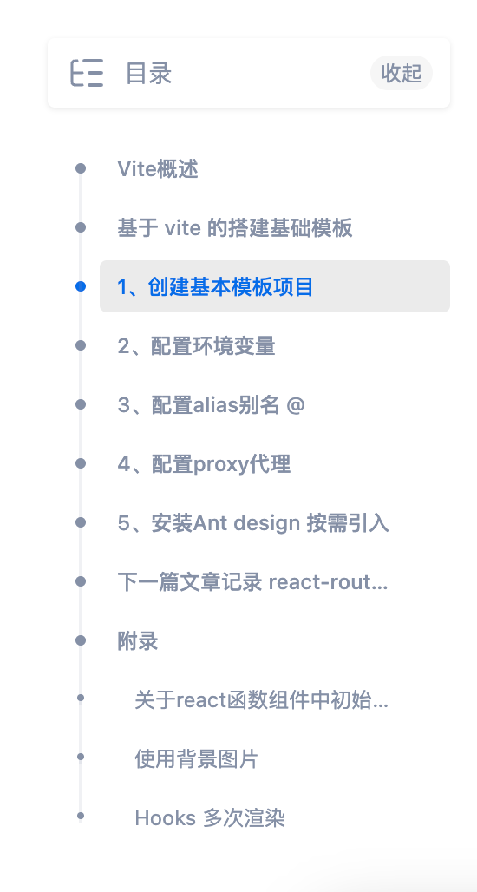

#### 知识点

##### 深度监视

> 使用global声明的class 都不会被编译成哈希字符串
>
> 使用的组件的样式大部分都是使用全局样式 使用局部方式声明class 经过编译后 无法与组件的默认样式class匹配 样式自然无法进行覆盖，要覆盖默认样式就需要 使用全局样式 需要使用global 声明的class
> 这样就不会被编译成哈希字符串 也就能覆盖默认样式了

```css
:global(.ant-back-top) {
    right: 20px;
    bottom: 80px;
}
```


##### @符配置 别名路径

> - cra创建的项目，默认将所有工程化配置，都隐藏在react-script包中；如果要修改CRA的默认配置有以下两种方案：
>   - 通过第三方库修改，@craco/craco  （推荐）
>   - 通过执行 yarn eject 命令，释放 react-scripts 中的所有配置到项目中

- 实现步骤

  1. 安装修改CAR配置的包：yarn add -D @craco/craco

  2. 在项目根目录中创建配置文件：craco.config.js ，并在配置文件中配制路径别名

  3. 修改 package.json 中的脚本命令（有时候不需要修改？）

  4. 在代码中 使用@符号表示 src目录的绝对路径

  5. 重启项目，配置生效

     ```js
     // craco.config.js 文件配置
     const path = req
     module.exports = {
       webpack: {
         alias:{
           "@":path.resolve(__dirname,"src")
         }
       }
     }
     
     // package.json 
     "scripts":{
       "start": "craco start",
       "build": "craco build", 
       ......
     }
     ```

  6. 让vscode 识别@符号，并进行代码提示

     ```json
     // 属于 vscode配置 与项目本身无关
     // 在项目根目录创建 jsconfig.json 配置文件，并添加以下配置
     {
       "compilerOptions": {
         "baseUrl": "./",
         "paths": {
           "@/*":[
             "src/*"
           ]
         }
       }
     }
     ```

     


##### 文件下载

```jsx
// 借助a标签下载文件
<a href={xxx} download>下载</a>   // 错误方式
<a href={require('xxx')} download>下载</a>   // 正确方式，用 require这种方式去引用路径，src 同理
```


##### 打包体积分析

> 通过分析打包体积，能更好的进行项目优化

- 使用步骤

  1. 安装分析打包体积的包 yarn add source-map-explorer

  2. 在package.json.中的scripts 标签中，添加分析打包体积的命令

  3. 对项目打包 yarn build （如果已经打包，可跳过）

  4. 运行分析命令：yarn analyze

  5. 通过浏览器打开的页面，进行分析

     ```js
     // package.json 中：
     // source-map-explorer 'build/static/js/*.js' 表示分析打包后的所有js文件
     "script":{
       "analyze":"source-map-explorer 'build/static/js/*.js'"
     }
     ```

  


#### 优化配置CDN

> 通过 craco修改webpack配置，对第三方包使用CDN优化
>
> https://www.bilibili.com/video/BV1Z44y1K7Fj/?p=154&spm_id_from=pageDriver&vd_source=49059bedc59884104ea6ef0a6e552378

```

```


#### vite+react项目搭建

- https://zhuanlan.zhihu.com/p/456407867?utm_id=0




#### Docusaurus记录


- 配置文件   https://docusaurus.io/zh-CN/docs/api/docusaurus-config
- 指南   https://docusaurus.io/zh-CN/docs/category/guides
- 关于组件的弹出
  - 可以直接在 `node_modules/@docusaurus/theme-classic/src/theme` 查看所有组件，再通过命令弹出
  - 更粗暴的方法（不建议）
    - `node_modules/@docusaurus/theme-classic/src/theme` 中找到组件所在文件夹，将整个文件夹复制到 `src/theme` 下。这样能得到最原始的ts文件，同时所能修改的地方也就越多，更方便的个性化。

```sh
# 查看内部的所有组件
yarn run swizzle @docusaurus/theme-classic -- --list

# 弹出/暴露 指定组件
yarn run swizzle @docusaurus/theme-classic 组件名 -- --eject --typescript

```


##### 添加文档/博客

- 文档：在`src/docs`目录下新建 `.jsx` 或 `.md` 文件，也可在当前目录下新建文件夹并创建这些文件
- 博客：在`src/blog`目录下新建 `.jsx` 或 `.md` 文件，也可在当前目录下新建文件夹并创建这些文件

- 使用图片/静态资源（建议）：
  - 资源保存路径，相对当前md文档：`./static/${filename}` 
  - 可使用 Typora 设置图像存储位置，方便🍜

-20230601183640446.(null))

- 注意点：
  - 任何下划线 _ 开头的文件都会被忽略
  - 映射到同一路由的多个页面，将只能访问最后创建的页面
  - 在md文档中支持使用 JSX语法及React组件

https://markdown.com.cn/cheat-sheet.html

###### Category metadata

1. 在相应的文件夹下添加`_category_. json`或`_category_.yml`文件

```JSON
# 示例：
{
  "position": 2.5,            // 所在目录在侧边栏中显示的排序，[number]
  "label": "Tutorial",        // 所在目录在侧边栏中显示的文本,[string]
  "collapsible": true,
  "collapsed": false,
  "link": {
    "type": "generated-index",
    "title": "Tutorial overview"
  },
  "customProps": {
    "description": "This description can be used in the swizzled DocCard"
  }
}
```

###### [文档 Metadata fields](https://docusaurus.io/zh-CN/docs/api/plugins/@docusaurus/plugin-content-docs#tags)

- 文档顺序
  - 默认情况下，侧边栏中的项目将按字母顺序（文件和文件夹名称）生成。
  - 在md文档前使用 metadata fields配置的 `sidebar_position`  排序
- 

```Markdown
---
title: xxx                    # 文本标题+备用值（侧边栏、下篇/上篇按钮...),[string]
sidebar_position: 2           # 文档排序，[number]
sidebar_label: xxx            # 文该档在侧边栏中显示的文本,[string]
pagination_label: xxx         # 文档在上一篇/下一篇按钮中显示的文本,[string]

slug: /bonjour                # 文档url,默认为文件路径/docs/guide/hello，将其URL改为/docs/bonjour
id:xxx                        # 文档的唯一 ID,默认值:文件路径（包括文件夹,不含扩展名）,[string]
pagination_prev: xxx          #「上篇文档」按钮链接到的文档 ID。
pagination_next：xxx          # 「下篇文档」按钮链接到的文档 ID, [string | null]
......
---

xxx 文档内容
xxxxxxx。文档正文
xxxxxxxxxx
```

###### [博客 Metadata fields](https://docusaurus.io/zh-CN/docs/api/plugins/@docusaurus/plugin-content-blog#path)

```Markdown
<!-- 示例： -->

---
title: Welcome Docusaurus v2
description: This is my first post on Docusaurus 2.
slug: welcome-docusaurus-v2
date: 2021-09-13T10:00
authors:
  - name: Joel Marcey
    title: Co-creator of Docusaurus 1
    url: https://github.com/JoelMarcey
    image_url: https://github.com/JoelMarcey.png
  - name: Sébastien Lorber
    title: Docusaurus maintainer
    url: https://sebastienlorber.com
    image_url: https://github.com/slorber.png
tags: [hello, docusaurus-v2]
image: https://i.imgur.com/mErPwqL.png
hide_table_of_contents: false
---


# Welcome to this blog. 
正文 xxxxxxxx
```

##### 翻译 - 使用 Crowdin

https://docusaurus.io/zh-CN/docs/i18n/crowdin#upload-the-sources

流程：上传Crowdin - 翻译 - 从Crowdin下载

1. 安装Crowdin CLI ：
   1. 安装：`yarn add @crowdin/cli@3`
   2. 测试是否可以运行Crowdin CLI：`yarn crowdin --version`
2. 上传所有 JSON 和 Markdown 翻译文件：
   1. 在项目中运行  `yarn crowdin upload`
3. Crowdin界面中对项目文件内容进行翻译调整（例图：）
   1. -20230601183640394.(null))

   2. -20230601183640504.(null))
4. 下载翻译好的 JSON 和 Markdown文件： `yarn crowdin download`


##### Navbar items类型： 

1.  doc : 用于添加文档链接，当用户点击链接时，将跳转到您的文档页面。 
2.  dropdown : 用于创建下拉列表，下拉列表中可以包含多个链接。 
3.  external : 用于添加外部链接，当用户点击链接时，将跳转到指定的外部网站。 
4.  localeDropdown : 用于多语言站点的Dropdown，下拉列表中会展示所有支持的语言选项。 
5.  search : 用于添加搜索框，用户可以在搜索框中输入关键字来搜索您网站的内容。


#### [tailwindcss](https://www.tailwindcss.cn/) 

