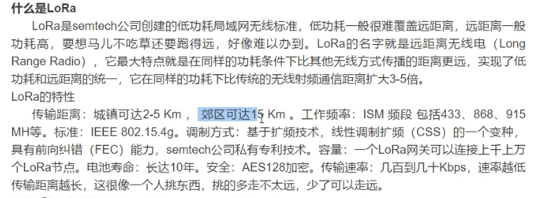
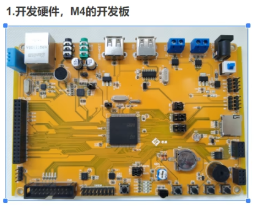

## 嵌入式与stm32

> 除PC外，所有的控制类设备，都可称之为嵌入式。MACOS -m1也是arm内核

ARM内核

- Cortex-A：应用级别的处理器，频率很高，1GHz，常用于消费类电子（寿命短，老化） —— 更新迭代快，以三星、华为、苹果芯片为代表
- Cortex-M：微控制器，频率不是很高，常用工业与控制（寿命长），应用广泛 —— 以stm32为代表
  - Cortex-M3 ：CPU 72MHz
  - M4：Cortex-M3+FPU（浮点运算单元），168MHz
- 经典系列：ARM7、9、11（很少使用）


STM32

> - [ST](https://www.st.com/content/st_com/zh.html)：公司名称，意法半导体
> - M：微控制器
> - 32：32位的CPU

- 产品系列
  - 智能驾驶 - 
  - 物联网 - LoRa联盟
  - 


LoRa联盟

> 腾讯、阿里、中过联通、Semtech、Google等巨头加入支持。成为主流物联网络制式之一




- 开发板介绍 - 两种无明显区别
- 熟悉阅读原理图
- 使用开发工具 - keil
- 库函数：标准库  **HAl库**   LL库




#### 单词

```sh
HSE	# 高速外部振荡器（晶振）
LSE	# L-低速
HSI
LSI	# I-内部

RTC	# 实时时钟
ADC # 模数转换 A-模拟信号 D-数字信号
IWDG # 独立看门狗

AHB	# 总线    
```


#### 时钟


