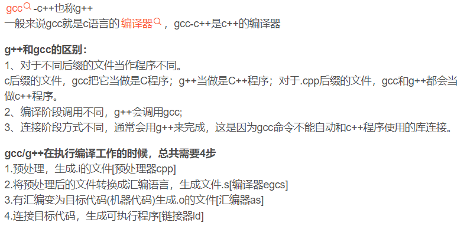
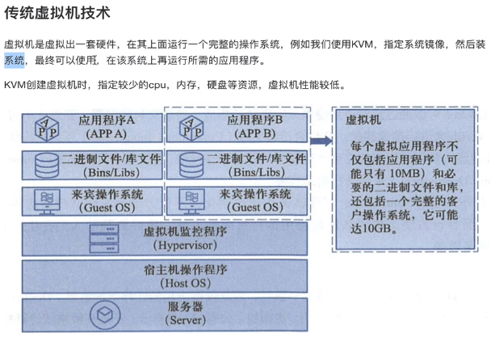
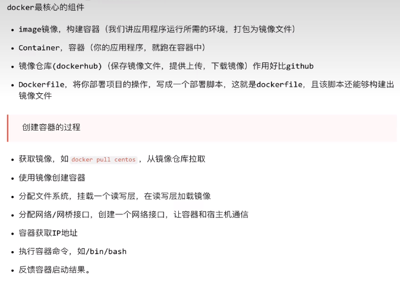
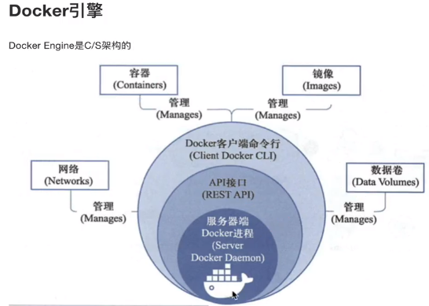
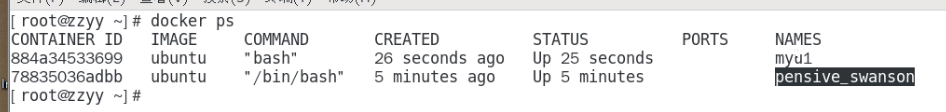
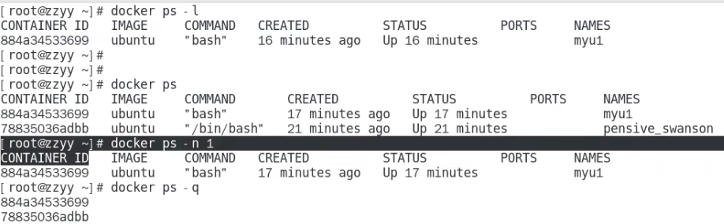
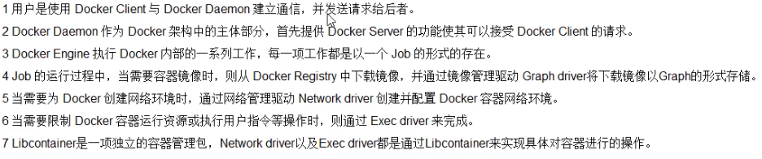
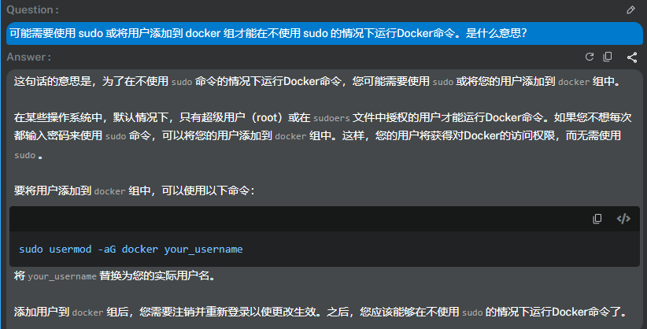
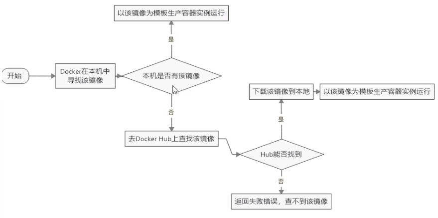

## Linux

> CentOS与Ubuntu常见差异：  
>
> 1. 软件包管理器：CentOS使用yum，而Ubuntu使用apt或apt-get。 
> 2. 系统服务管理：CentOS使用systemd，而Ubuntu使用systemd或upstart。
> 3. 防火墙管理：CentOS使用firewalld或iptables，而Ubuntu使用ufw或iptables。
> 4. 默认的软件包和安装路径：CentOS和Ubuntu有不同的默认软件包和安装路径。


### 命令

```sh
# 要求：linux系统内核版本 3.8以上，系统要求64位+ 

uname -r     # 查看系统内核版本
df -h		# 查看磁盘空间的使用情况

exit 		# 退出当前终端

# centos
cat  # 查看
cat /etc/redhat-release		# 查看系统版本

# ubuntu
lsb_release -a			# 查看系统版本

```


### gcc

> GCC是GNU编译器集合（GNU Compiler Collection）的缩写。它是一个开源的编译器套件，用于编译各种编程语言，包括C、C++、Objective-C、Fortran、Ada和其他一些语言。GCC是一个非常流行和广泛使用的编译器，被广泛用于开发各种软件和操作系统。它由GNU项目开发和维护，可在多个平台上使用，包括Linux、Windows和Mac等。




##  [Docker](https://docs.docker.com/desktop/install/ubuntu/)


### 历史概念

- 物理服务器

  - 缺点：部署慢、成本高、资源浪费、难以迁移和扩展、受限于硬件

- 虚拟化技术

  > 一台物理机通过vm虚拟化多个操作系统，一个物理机部署多个虚拟机及app。通过虚拟化技术，可以将计算工作放在云上进行。
  >
  > 虚拟化，是一种资源管理技术，将计算机的各种实体资源进行抽象、转换后呈现出来并可供分割、组合为一个或多个电脑配置环境。
  >
  > 全虚拟化、半虚拟化、硬件辅助虚拟化（KVM、Hyoer-V）......

  - 虚拟机工具产品：
    - vmware worfstation（个人学习使用），主要使用windows
    - 企业虚拟化 vmware esxi虚拟化工具，高性能服务器结合，进行服务器资源虚拟化
    - linux下的虚拟化工具、kvm工具
  - 缺点：每个虚拟机都是完成的操作系统，资源消耗较大
  - 

- 容器技术 Docker

  > 基于Golang语言开发而来，基于Linux内核的Cgroups、NameSpace、Union FS等技术。对进程进行封装隔离，属于操作系统层面的虚拟化技术。
  >
  > docker并非一个通用的容器工具，依赖于已存在并运行的linux内核环境。
  >
  > Docker是一个 CS模式的架构，后端是一个松耦合的架构，众多模块各司其职。
  
  - 概念:
    - 镜像 images：构建容器，应用程序运行所需的环境
    - 仓库 Repository：dockerhub类似于github，用于保存镜像文件、提供上传于下载功能
      - 类似maven仓库-存放jar包，github存放git项目，分为公开Public和私有Privatre两种
        - 最大的公开仓库是：https://hub.docker.com ;国内推荐使用阿里云、网易云等
    - 容器 containers：镜像文件的实例化对象，用来运行实际的应用程序（镜像创建的运行实例）
    - 网络  network
    - 数据卷 Data Volumes
    - 
    - 
  - 优点：
    - 提升性能，不需要单独分割硬件资源、启动耗时短、不依赖CPU的虚拟化支持、一致性的环境、便于迁移
    - 持续交付和部署


### 基础知识

```sh
# 帮助启动类命令
sudo systemctl status docker 	# 查看docker状态
sudo systemctl start docker     # 启动docker
sudo systemctl stop docker      # 停止docker
sudo systemctl restart docker   # 重启docker
sudo systemctl enable docker 	# 开机启动
sudo docker info		# 查看docker概要信息，等同于  docker --version
sudo docker--help		# 查看帮助文档
sudo docker 具体命令 --help   	 # 查看具体命令的帮助文档 


# 镜像命令
docker images		  	# 查看本地主机上的镜像有哪些
## 返回表格： REPOSITORY-镜像的仓库源/镜像名	TAG-标签/版本	IMAGE ID-镜像id	CREATED-创建时间	SIZE-大小
docker images -a		# 列出本地所有镜像（含历史映像层）
docker images -q 	 	# 只显示镜像id

docker search 镜像名	  # 查询镜像（包括远程）（选择时一般选择官方认证-命名：作者/命名） 
docker search 镜像名 --limit 5		# 查询指定镜像名下点赞数最多的5个
## 返回表格：NAME-镜像名称	DESCRIPTION-镜像说明	STARTS-点赞数量	OFFICIAL-是否属于官方	AUTOMATED-是否是自动构建的

docker pull 镜像名[:TAG]		  # 下载镜像,可指定对应tag版本，可忽略默认为最新的	

docker system df 				# 查看镜像/容器/数据卷所占的空间

docker rmi 镜像id/镜像名[:TAG] [镜像id/镜像名[:TAG]]		# 通过镜像id或镜像名，删除镜像
docker rmi 镜像id/镜像名 -f		# 强行删除，当镜像被某个容器使用时，直接删除会失败
docker rmi -f $(docker images -qa) 	# 删除全部镜像


# 容器命令（有镜像才能创建容器，容器是镜像运行的实例）
docker run [OPTIONS] 镜像名 [COMMAND] [ARG...]    	 # 新建+启动容器（交互式容器）
--name=容器的自定义命名   ## 为容器指定名称，默认为系统随机分配
-d		## 后台运行容器并返回容器id，（守护式容器-后台运行）
-i		## 以交互模式运行容器，通常与 -t 同时使用
-t		## 为容器分配一个伪输入终端，通常与 -i 同时使用
-P		## 随机端口映射，大写P
-p		## 指定端口映射，小写p		  -p 8080
## 举例：
docker run -it --name=ubuntu1 ubuntu /bin/bash # 交互式模式下新建+运行ubuntu容器，分配伪终端进入/bin/bash命令行程序，该容器的命名为ubuntu1

docker ps 	# 查看所有正在运行的容器
-a 		## 列出当前所有正在运行的容器+历史上运行过的
-l		## 显示最近创建的容器
-n		## 显示最近n个创建的容器  docker ps -n 1
-q		## 静默模式，只显示容器编号


```









#### [Install Docker](https://docs.docker.com/desktop/install/ubuntu/)

```sh
# ubuntu：

## 1.更新系统的软件包管理器
sudo apt update 	
## 2.安装依赖包以允许apt通过HTTPS使用存储库
sudo apt install apt-transport-https ca-certificates curl software-properties-common
## 3.添加Docker的官方GPG密钥
curl -fsSL https://download.docker.com/linux/ubuntu/gpg | sudo gpg --dearmor -o /usr/share/keyrings/docker-archive-keyring.gpg
## 4.添加Docker存储库 
echo "deb [arch=amd64 signed-by=/usr/share/keyrings/docker-archive-keyring.gpg] https://download.docker.com/linux/ubuntu $(lsb_release -cs) stable" | sudo tee /etc/apt/sources.list.d/docker.list > /dev/null
## 5.更新软件包索引并安装Docker
sudo apt update
sudo apt install docker-ce docker-ce-cli containerd.io
## 6.验证Docker是否正确安装（如果输出一堆东西，就表明正确安装）
sudo docker run hello-world

### 输出信息：
Unable to find image 'hello-world:latest' locally  # 无法在本地找到图像"hello-world:latest",会自动下载对应的镜像，并在容器内运行
......
Hello from Docker!
......


```






#### pull 慢问题

```sh
# 第一步：创建配置文件目录 + 进入/etc/docker的路径
sudo mkdir /etc/docker
# 编辑配置文件，不存在时，该命令会自动创建
sudo nano /etc/docker/daemon.json
# 进入编辑界面，添加源，保存并退出
{
    "registry-mirrors":[
        "https://9cpn8tt6.mirror.aliyuncs.com",
        "https://registry.docker-cn.com"
    ]
}
# 重启docker服务
sudo systemctl daemon-reload 
sudo systemctl restart docker
# 检查我们刚刚的源有没有换成功,查看 Registry Mirrors配置中是否有
sudo docker info
```


## p20-退出容器


### 虚拟化技术

#### KVM-基于内核的虚拟机

