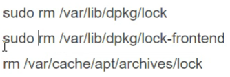
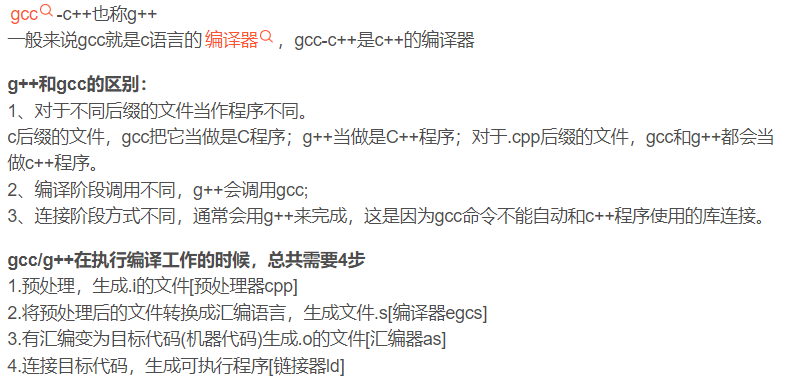
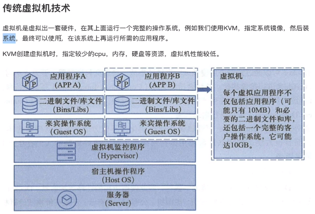
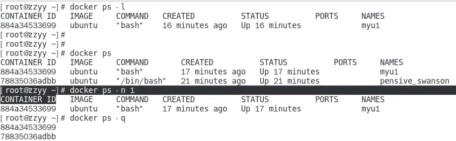
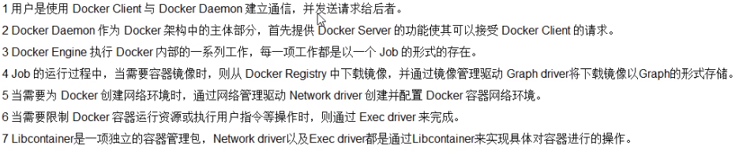

## Linux

> CentOS与Ubuntu常见差异：  
>
> 1. 软件包管理器：CentOS使用yum，而Ubuntu使用apt或apt-get。 
> 2. 系统服务管理：CentOS使用systemd，而Ubuntu使用systemd或upstart。
> 3. 防火墙管理：CentOS使用firewalld或iptables，而Ubuntu使用ufw或iptables。
> 4. 默认的软件包和安装路径：CentOS和Ubuntu有不同的默认软件包和安装路径。


### 命令

```sh
# 要求：linux系统内核版本 3.8以上，系统要求64位+ 

uname -r     # 查看系统内核版本
df -h		# 查看磁盘空间的使用情况
top			# 实时监视系统的运行情况。它提供动态更新的进程列表，显示了系统的整体资源使用情况，包括CPU利用率、内存使用情况、进程数量等。通过 `top` 命令，可查看当前运行的进程、监视系统的负载情况、查找资源占用较高的进程，并进行一些简单的进程管理操作。

exit 		# 退出当前终端

# centos
cat  # 查看
cat /etc/redhat-release		# 查看系统版本

# ubuntu
sudo 					# 执行命令没有权限时，在命令前加 sudo
lsb_release -a				# 查看系统版本
apt update				# 更新系统的软件包管理器
apt-get -y install xxx 	 # 安装指定软件
```


### Ubuntu

> - unity为ubuntu的默认桌面，打破传统gnome面板配置


#### 基础认识


##### 终端提示符

```sh
例：`wzt@wuzt:~$`
	wzt - 用户名
	@ - 连接作用
	wuzt - 主机名
	~ - 表示路径
		~ - ，当前在家目录（类似桌面位置）
		/ - 表示根目录（类似C盘位置）
		. - .或./ 表示当前路径
	$ - 表示权限
		$ : 普通用户权限
		# : 管理员权限
```


##### 命令的格式

- `命令	选项	参数`
- 注意：命令、选项、参数之间使用空格隔开
- 例：`ls -l`


##### 文件详细信息

> 在linux中不以后缀名作为文件类型的区分，而分为七种文件类型  bcd-lsp；在查看文件详细信息时，首字母为文件类型标识。

- b：块设备文件
- c：字符设备文件
- d：目录文件
- -：普通文件
- l：软链接文件
- s：套接字文件
- p：管道文件


###### 文件权限

> 三个为一组，分别表示：用户主（所有者）、用户组、其他用户对文件的操作权限。

- 例：`drwxr-xr-x`
- 分类
  - 所有者 rwx
  - 用户组 r-x 
  - 其他用户 r-x
- 权限类型
  - r：读权限
  - w：写权限
  - x：可执行权限
  - `-`：没有权限


rwxr-xr-x


##### man 帮助手册

> man命令：是linux提供的手册
>
> - 第一章：命令 的帮助手册
> - 第二章：系统调用（操作系统提供的函数 open）
> - 第三章：库函数（c库提供函数）的帮助信息

- 用法 ：`man 章节 查找信息`
- 例：`man 1 ls`  `man 2 open`  `man 3 printf`
- 注意：章节参数可以不写，默认会从前往后找，直到找到或找完` man - man`


#### 基本操作

```sh
win + 空格		   # 切换输入法
ctrl + alt + F3		 # 切换到命令行界面


# 在桌面下，打开终端
1/ 输入框搜“ terminal ”	
2/ ctrl+alt+t
3/ 鼠标右键打开
```


#### 基础命令

- 重定向 `>`或`>>`：将命令要输出的内容，重定向输出到指定文件中

- 管道`|`：将一个程序的输出，作为另一个程序的输入

- tree 命令：以树状结构显示目录信息，默认展示所有层级

  > 系统默认没有这个命令，需要安装`sudo apt-get install tree`

  - 用法：`tree -L 层次`

  - 如果报错无法获得锁，使用以下命令删除一些文件即可

    

```sh
# 基础操作命令
tab					# 自动补全命令，多次按tab，展示所有相关内容提示
上/下键			  # 查看历史命令
命令 > 目的文件		# 将命令要输出的内容，重定向输出到指定文件中（会清空原文件）
命令 >> 目的文件		# 将命令要输出的内容，重定向输出到指定文件中（在原文件后追加）
命令1 | 命令2		  # 将一个程序的输出，作为另一个程序的输入


命令 --help		# 查看命令的帮助信息（并非所有的命令都有帮助信息）
man	章节 命令	  # 使用linux的帮助手册

ls 		# 查看目录下的信息，默认为当前目录
# -a 包含隐藏文件；
# -l 查看文件详细信息 -la -lh；
# -hl 详细信息中的字节数显示带对应单位大小；
ls /etc | wc -w		# 查看/etc下的文件总数（使用管道命令 |）

clear			# 清屏
ctrl + l		# 清屏快捷键
tree -L 层次	   # 以树状结构显示目录信息

cd				# 进入指定的目录结构
# / 根目录		~ 家目录	.. 当前的上级目录	 - 回退上次目录

pwd					# 显示当前工作目录的绝对路径
cat	文件路径/名称 	# 显示文本文件内容
rm -rf 文件路径/名称 		# 删除指定内容（文件/文件夹）
# 例：rm test.c		rm -rf xiutao
# -f 意思是强制删除，即使要删除的文件或文件夹不存在也不报错


cp 选项 源文件/(文件夹路径/名称) 目的路径	# 将 `指定文件` 复制到 `目的路径` 下
# 例：`cp -r -v text.txt /home`	将text.txt复制到/home
# -r 拷贝文件夹时使用，默认不支持文件夹的复制
# -v 显示复制的进度
cp 目录1 目录2 -a	# -a，将目录1复制到目录2中
cp 文件名1 文件名2  # 无论2是否存在，都将产生2，与文件1一致

mv 文件路径/名称 目录名/文件名		# 移动文件夹/文件 到指定目录
# 当要移向的位置不存在时，相当于将原内容重命名

mkdir 目录名	# 创建文件夹
# mkdir dir1 dir2	## 同时创建dir1 dir2
mkdir -p 多级目录	# 创建文件夹，并且支持深层次
# mkdir -p dir1/dir2/mydir	## 创建三级的目录，三个嵌套文件夹

touch 文件名	# 创建文件 例：`touch a.txt`
# 当文件已存在时，会修改文件的修改时间戳

find 路径 -name 文件名	# 在指定路径下查找指定文件,深度查找
# 例：`find /home/teach -name a.txt` 
# 在/home/teach下查找a.txt

grep 查找信息 文件夹/文件名	# 在指定文件中查找指定内容，并整行输出
# -n：显示查找到的文件行号
# -R 递归查找文件夹的子目录
grep 查找信息 * -n	# 在所有文件中查找，并注明找到的是目录还是文件
grep hello /home/* -R -n	# 在/home/*下所有目录中查找包含hello的文件/文件夹


ln 源文件名 链接文件名 -s	# 创建软链接文件（影响源文件）
# 例：ln file1 file -s	# 创建./file1的软连接文件file
## 无论对源文件还是链接文件进行修改，内容都会发生改变
## 删除链接文件，对源文件没有影响；删除源文件，链接文件


# 压缩与解压缩
# gzip格式：压缩包必须以 .tar.gz结尾
tar zcvf 压缩包名 文件1 文件2 ... # 压缩，将a.txt b.txt压缩到apk.tar.gz中
tar zxvf apk.tar.gz -C /home # 解压1：解压到指定目录
tar zxvf apk.tar.gz # 解压2：解压到当前目录


# bz2格式：压缩包必须以 .tar.bz2结尾
tar jcvf 压缩包名 文件1 文件2... # 压缩，将文件或文件夹压缩到压缩包中
tar jxvf abc.tar.bz2	# 解压1：解压到当前目录
tar jxvf abc.tar.bz2 -C /home	# 解压2：解压到指定目录
```


#### [make概述](https://www.bilibili.com/video/BV1FA411v7YW/?p=156&spm_id_from=pageDriver)

p 156-163

> 在执行make命令时，会在当前目录下找makefile文件，并根据其中的规则，编译程序。
>
> - **make命令**：是个可执行程序，用来解析Makefile文件的命令，存放在`/usr/bin/`；
> - **makefile文件**：用来描述程序的编译规则
> - **优势：**简化编译程序时输入命令、节省编译时间、提高编译效率。


### vim 编辑器

> vim （vi升级版）

#### 安装 vim

```sh
# 安装vim
sudo apt-get install vim
# 安装ctags（索引工具，用来搜索）
sudo apt-get install ctags
# 配置 vim（从网上搜教程）
	step1：从网上找配置拷入当前用户目录下，使用samba或共享文件夹打开
	step2：打开终端，执行以下命令：
		cd vim_configure 
		./copy_con.sh
```


#### 使用

```sh
vi filename.c	# 打开或新建文件,并将光标置于第一行行首
vi +n filename.c	# 打开存在的文件，并将光标置于第n行行首
vim  +/关键词  文件的路径	# 打开指定的文件，并且高亮显示关键词
vim 文件路径1 文件路径2 文件路径3	# 同时打开多个文件
```


#### 三种模式

- 命令模式【默认进入的模式】

  > 不能直接编辑文件，可输入快捷键进行一些操作（删除行，复制行，移动光标，粘贴等）【打开文件之后默认进入的模式】

  - 编辑模式下的操作：

    ```sh
    u	# 撤销多次修改，
    ctrl r	# 反撤销
    
    [n]x 	# 删除光标后的n个字符
    [n]X	# 大写，删除光标前的n个字符
    [n]dd	# 删除从当前行开始的n行
    
    [n]yy	# 复制从当前行开始的n行
    p		# 把剪切板的内容插入到当前行
    .		# 执行上一次操作
    ZZ		# 大写，保存并退出当前文件
    ```

    

  - 转入编辑模式：`a	i	o`

  - 

- 编辑模式（输入模式）

  > 在该模式下可以对文件的内容进行编辑，按ESC退出并进入末行模式

- 末行模式（尾行模式）

  > 可在末行输入命令对文件进行操作（搜索、替换、保存、退出、撤销、高亮等）

  ```sh
  :w		# 保存文件
  :wq		# 保存并退出
  :q!		# 不保存文件，强制退出
  :x		# 保存并退出 vi
  :w filename	# 另存为 filename
  ```


### 编译器 gcc

> GCC是GNU编译器集合（GNU Compiler Collection）的缩写。开源的编译器套件，用于编译各种编程语言，包括C、C++、Objective-C、Fortran、Ada和其他一些语言。GCC是一个非常流行和广泛使用的编译器，被广泛用于开发各种软件和操作系统。它由GNU项目开发和维护，可在多个平台上使用，包括Linux、Windows和Mac等。
>
> - 在windows操作系统下，编译工具用继承开发环境，vs
> - 在linux操作系统下，使用编译器gcc


#### gcc与g++




#### 编译程序

> 程序编译的四个阶段：预编译、编译、汇编、链接

```sh
# 第1种.一步到位：
gcc hello.c		# 默认会生成 a.out的可执行文件
gcc hello.c -o hello	# 生成指定命名的可执行文件 hello

# 运行编译后的程序：
./ a.out	
./hello


# 第2种.分步骤完成
```


### makefile


##  [Docker](https://docs.docker.com/desktop/install/ubuntu/)


### 历史概念

- 物理服务器

  - 缺点：部署慢、成本高、资源浪费、难以迁移和扩展、受限于硬件

- 虚拟化技术

  > 一台物理机通过vm虚拟化多个操作系统，一个物理机部署多个虚拟机及app。通过虚拟化技术，可以将计算工作放在云上进行。
  >
  > 虚拟化，是一种资源管理技术，将计算机的各种实体资源进行抽象、转换后呈现出来并可供分割、组合为一个或多个电脑配置环境。
  >
  > 全虚拟化、半虚拟化、硬件辅助虚拟化（KVM、Hyoer-V）......

  - 虚拟机工具产品：
    - vmware worfstation（个人学习使用），主要使用windows
    - 企业虚拟化 vmware esxi虚拟化工具，高性能服务器结合，进行服务器资源虚拟化
    - linux下的虚拟化工具、kvm工具
  - 缺点：每个虚拟机都是完成的操作系统，资源消耗较大
  - 

- 容器技术 Docker

  > 基于Golang语言开发而来，基于Linux内核的Cgroups、NameSpace、Union FS等技术。对进程进行封装隔离，属于操作系统层面的虚拟化技术。
  >
  > docker并非一个通用的容器工具，依赖于已存在并运行的linux内核环境。
  >
  > Docker是一个 CS模式的架构，后端是一个松耦合的架构，众多模块各司其职。
  
  - 概念:
    - 镜像 images：构建容器，应用程序运行所需的环境
    - 仓库 Repository：dockerhub类似于github，用于保存镜像文件、提供上传于下载功能
      - 类似maven仓库-存放jar包，github存放git项目，分为公开Public和私有Privatre两种
        - 最大的公开仓库是：https://hub.docker.com ;国内推荐使用阿里云、网易云等
    - 容器 containers：镜像文件的实例化对象，用来运行实际的应用程序（镜像创建的运行实例）
    - 网络  network
    - 数据卷 Data Volumes
    - 
    - 
  - 优点：
    - 提升性能，不需要单独分割硬件资源、启动耗时短、不依赖CPU的虚拟化支持、一致性的环境、便于迁移
    - 持续交付和部署


### 基础知识

```sh
# 帮助启动类命令
sudo systemctl status docker 	# 查看docker状态
sudo systemctl start docker     # 启动docker
sudo systemctl stop docker      # 停止docker
sudo systemctl restart docker   # 重启docker
sudo systemctl enable docker 	# 开机启动
sudo docker info		# 查看docker概要信息，等同于  docker --version
sudo docker--help		# 查看帮助文档
sudo docker 具体命令 --help   	 # 查看具体命令的帮助文档 


# 镜像命令
docker images		  	# 查看本地主机上的镜像有哪些
## 返回表格： REPOSITORY-镜像的仓库源/镜像名	TAG-标签/版本	IMAGE ID-镜像id	CREATED-创建时间	SIZE-大小
docker images -a		# 列出本地所有镜像（含历史映像层）
docker images -q 	 	# 只显示镜像id

docker search 镜像名	  # 查询镜像（包括远程）（选择时一般选择官方认证-命名：作者/命名） 
docker search 镜像名 --limit 5		# 查询指定镜像名下点赞数最多的5个
## 返回表格：NAME-镜像名称	DESCRIPTION-镜像说明	STARTS-点赞数量	OFFICIAL-是否属于官方	AUTOMATED-是否是自动构建的

docker pull 镜像名[:TAG]		  # 下载镜像,可指定对应tag版本，可忽略默认为最新的	

docker system df 				# 查看镜像/容器/数据卷所占的空间

docker rmi 镜像id/镜像名[:TAG] [镜像id/镜像名[:TAG]]		# 通过镜像id或镜像名，删除镜像
docker rmi 镜像id/镜像名 -f		# 强行删除，当镜像被某个容器使用时，直接删除会失败
docker rmi -f $(docker images -qa) 	# 删除全部镜像


# 容器命令（有镜像才能创建容器，容器是镜像运行的实例）
docker run [OPTIONS] 镜像名 [COMMAND] [ARG...]    	 # 新建+启动容器（交互式容器）
--name=容器的自定义命名   ## 为容器指定名称，默认为系统随机分配
-d		## 后台运行容器并返回容器id，（守护式容器-后台运行）
-i		## 以交互模式运行容器，通常与 -t 同时使用
-t		## 为容器分配一个伪输入终端，通常与 -i 同时使用
-P		## 随机端口映射，大写P
-p		## 指定端口映射，小写p		  -p 8080
## 举例：
docker run -it --name=ubuntu1 ubuntu /bin/bash # 交互式模式下新建+运行ubuntu容器，分配伪终端进入/bin/bash命令行程序，该容器的命名为ubuntu1

docker ps 	# 查看所有正在运行的容器
-a 		## 列出当前所有正在运行的容器+历史上运行过的
-l		## 显示最近创建的容器
-n		## 显示最近n个创建的容器  docker ps -n 1
-q		## 静默模式，只显示容器编号

exit		# 退出容器，exit退出时容器会停止（run进入容器）
ctrl+p+q	# 退出容器，ctrl+p+q退出时容器不停止（run进入容器）

docker start 容器名/容器id	# 启动已经停止的容器
docker restart 容器名/容器id	# 重启容器
docker stop 容器名/容器id	# 停止正在运行的容器
docker kill 容器名/容器id	# 强制停止容器

docker rm 容器id 	   		  # 删除已停止的容器（不能删除运行时容器）
sudo docker rm -f $(sudo docker ps -a -q)  # 将$()中的结果作为整个语句的参数，全部删除
## docker ps -a -q | xargs docker rm  # 将|前的内容作为参数替换xargs，全部删除

 
docker run -d 容器名	# 启动守护式容器（后台服务器）
docker logs 容器id	 # 查看容器日志
docker top 容器id 	 # 查看容器内运行的进程（容器==极简内核版linux）
docker inspect 容器id  # 查看容器内部细节（）

# 进入正在运行的容器并以命令行交互
docker exec -it 容器id /bin/bash（bashshell位置） # 在容器中打开新的终端，启动新的进程，使用exit退出不会导致容器停止,!!!推荐
-d		## 后台运行容器并返回容器id，（守护式容器-后台运行）
-i		## 以交互模式运行容器，通常与 -t 同时使用
-t		## 为容器分配一个伪输入终端，通常与 -i 同时使用
docker attach 容器id	# 直接进入容器的命令终端，不会启动新的进程1，exit退出会导致容器的停止


docker cp 容器id:容器没的路径 目的主机路径 # 从容器内拷贝文件到主机上（例：docker cp dbaguhug29uda:/usr/local/con.txt /tem/c.txt）
docker export 容器id>文件名.tar # 导出容器的内容流作为一个tar归档文件(例：docker export dbaguhug29uda>abcd.tar )
cat 文件名.tar | docker import - 镜像用户/镜像名:镜像版本号 # 从tar包导入镜像文件(例：cat abcd.tar | docker import - hahaha:0.0.1)


docker commit -m='提交的描述信息' -a='作者' 容器id 要创建的镜像名:[tag标签名]	# 提交容器副本，生成一个新的镜像，生成后通过docker images查找并使用（例：docker commit -m="add vim cmd" -a='wzt' 容器id vimUbuntu:1.0）


# 其他重要内容：
 - 有镜像才能创建容器-根本前提
 - 守护式容器：不进入对应的交互式命令窗口
 - 出现apt update失败时，可尝试重启docker解决

##  其他习惯
- docker run 运行后，使用docker ps应该能看到对应的程序，如果没有说明失败/被关闭了（docker机制问题：后台进程模式的应用，导致docker前台没有运行的应用，会认为无事可做，立即自杀）
- 最佳解决方案：将运行的程序以前台进行的形式运行（交互模式） -d,再用exec进入对应容器实例
```








#### [Install Docker](https://docs.docker.com/desktop/install/ubuntu/)

```sh
# ubuntu：

## 1.更新系统的软件包管理器
sudo apt update 	
## 2.安装依赖包以允许apt通过HTTPS使用存储库
sudo apt install apt-transport-https ca-certificates curl software-properties-common
## 3.添加Docker的官方GPG密钥
curl -fsSL https://download.docker.com/linux/ubuntu/gpg | sudo gpg --dearmor -o /usr/share/keyrings/docker-archive-keyring.gpg
## 4.添加Docker存储库 
echo "deb [arch=amd64 signed-by=/usr/share/keyrings/docker-archive-keyring.gpg] https://download.docker.com/linux/ubuntu $(lsb_release -cs) stable" | sudo tee /etc/apt/sources.list.d/docker.list > /dev/null
## 5.更新软件包索引并安装Docker
sudo apt update
sudo apt install docker-ce docker-ce-cli containerd.io
## 6.验证Docker是否正确安装（如果输出一堆东西，就表明正确安装）
sudo docker run hello-world

### 输出信息：
Unable to find image 'hello-world:latest' locally  # 无法在本地找到图像"hello-world:latest",会自动下载对应的镜像，并在容器内运行
......
Hello from Docker!
......


```


#### pull 慢问题

```sh
# 第一步：创建配置文件目录 + 进入/etc/docker的路径
sudo mkdir /etc/docker
# 编辑配置文件，不存在时，该命令会自动创建
sudo nano /etc/docker/daemon.json
# 进入编辑界面，添加源，保存并退出
{
    "registry-mirrors":[
        "https://9cpn8tt6.mirror.aliyuncs.com",
        "https://registry.docker-cn.com"
    ]
}
# 重启docker服务
sudo systemctl daemon-reload 
sudo systemctl restart docker
# 检查我们刚刚的源有没有换成功,查看 Registry Mirrors配置中是否有
sudo docker info
```


#### Docker镜像

> docker镜像：是一种轻量级、可执行的独立软件包，包含运行某个软件所需的所有内容。将应用程序和配置依赖打包好形成一个可交付的运行环境。

##### UnionFS联合文件系统

> 是一种分层、轻量且高性能的文件系统。支持对文件系统的修改作为一次提交来一层层的叠加，同时可以将不同目录挂在到同一个虚拟文件系统下。
>
> 是Docker镜像的基础，镜像通过分层来进行继承，基于基础镜像，可以制作各种具体的应用镜像.
>
> 


##### 概念：

- docker镜像层都是只读的，容器层是可写的
- 可在原有镜像的基础上追加内容，并生成自己的镜像，类似虚拟机的快照
- Docker中的镜像分层，支持通过扩展现有镜像，创建新的镜像。类似Java继承于一个Base基础类，自己再按需扩展。新镜像是从 base 镜像一层一层叠加生成的。每安装一个软件，就在现有镜像的基础上增加一层


#### 本地镜像发布到云仓库

- 案例：阿里云 镜像容器服务

  ```shell
  # 1.阿里云 开通 镜像容器服务
  # 2.本地docker登录，（阿里云会提供对应命令）
  
  # 登录阿里云Docker Registry
  docker login --username=wuzhongtian registry.cn-wulanchabu.aliyuncs.com
  
  # PULL - 从Registry中拉取镜像
  docker pull registry.cn-wulanchabu.aliyuncs.com/wuzt/wuzt:[镜像版本号]
  
  # PUSH - 将想要推送的容器打成tag
  docker tag [ImageId] registry.cn-wulanchabu.aliyuncs.com/wuzt/wuzt:[镜像版本号]
  # 将镜像推送到Registry
  docker push registry.cn-wulanchabu.aliyuncs.com/wuzt/wuzt:[镜像版本号]
  
  
  ```

  


#### 本地镜像推送到私有库 registry

[28_新镜像推送私服库案例_哔哩哔哩_bilibili](https://www.bilibili.com/video/BV1gr4y1U7CY/?p=28&spm_id_from=pageDriver&vd_source=12c717d82cfc8f0cc3894516956cc8b3)

```shell
# 运行 registry 搭建私有库
docker run -d -p 5000:5000 -v /zzyyuse/myregistry/:/tem/registry -- privileged=true registry
# docker ps 查看registry的镜像id

apt-get update   # 更新软件源
apt-get install net-tools  # 安装net-tools，可以使用ifconfig命令

# 发起get请求，查看私有库中镜像
curl -XGET http://192.xxx.xxx:5000/v2/_catalog

# 将镜像修改为符合私服规范的Tag
docker tag 镜像名:tag名 自己主机的ip地址:端口/镜像名称:版本
（例：docker tag wuzt:1.0 192.18.111.167:5000/wuzt:1.0 ）

# 修改配置，支持http传输
## docker默认不允许http方式推送镜像，通过配置选项来取消这个限制。修改完不生效时，可尝试重启docker
## vim命令新增如下红色内容:  
vim /etc/docker/daemon.json
{
	"registry-mirrors":["https://aa25jnbu.mirror.aliyuncs.com"],
	"insecure-registries":["192.xxx.xxx:5000"]
}

# 将本地容器推送放到私服库
docker push id地址:端口/镜像名称:tag
（例：docker push 192.168.111.167:5000/wuzt:1.2）

# 发起get请求，查看私有库中镜像
curl -XGET http://192.xxx.xxx:5000/v2/_catalog

# 拉取代码
docker pull 192.168.111.167:5000/wuzt:1.2
```


#### docker容器数据卷

> 容器数据卷：完成数据持久化存储的方式，将重要资料备份；方式：将容器内的数据备份+持久化到本地主机目录( 映射，容器内的数据到本地主机目录)
>
> - 卷：含义是目录或文件，存在于一个或多个容器中，由docker挂载到容器，但不属于镜像的联合文件系统的内容，提供用于持续存储或共享数据的特性
> - 卷：设计目的就是`数据持久化`，完全独立于容器的生命周期，因此不会在容器删除时删除其挂载的数据卷

- 特点：
  1. 数据卷可在容器之间共享和重用数据
  2. 卷中更改-实时生效，不需要手动拷贝
  3. 数据卷中的更改不会包含在镜像的更新中
  4. 数据卷的生命周期一直在持续到没有容器使用它为止
- 权限扩容：
  - 问题：Docker挂载主机目录访问，如果出现`cannot open directory:Permission denied`
  - 解决办法：在挂载目录后多加一个 `--privileged=true`参数即可

```shell
# 命令：
docker run -it --privileged=true -v /宿主机绝对路径:/容器内目录 镜像名


例：docker run -d -p 5000:5000 -v /zzyyuse/myregistry/:/tem/registry --privileged=true registry

# -v  运行一个带有容器卷存储功能的容器实例
## /zzyyuse/myregistry/ 宿主机的路径
## /tem/registry 容器内的地址 
## --privileged=true 开启权限
```


## [31_容器卷和主机互通互联_哔哩哔哩_bilibili](https://www.bilibili.com/video/BV1gr4y1U7CY/?p=31&spm_id_from=pageDriver&vd_source=12c717d82cfc8f0cc3894516956cc8b3)

### 虚拟化技术

#### KVM-基于内核的虚拟机

