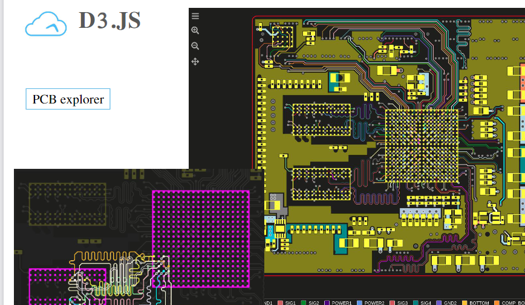

## [React](https://zh-hans.reactjs.org/docs/hello-world.html)

1. 特点：
   - *标记与逻辑**没有分离**到不同文件*，二者共同存放在“组件”的松散耦合单元之中
   - 采用组件化，声明式编码，提高开发效率
   - 可以使用React Navite 进行 移动端开发
   - 使用虚拟DOM + Diffing 算法，尽量减少操作真实DOM

```jsx
// hello word
const root = ReactDOM.createRoot(document.getElementById('root'));
root.render(<h1>Hello, world!</h1>);
```


### 基础使用

#### CDN引入

- 默认 `<script>`标签type类型为 `text/javascript`
  - jsx的 type类型应为  `text/babel`才能解析
- 引入顺序 react 核心文件  --> react-dom  --> babel

```html
<body>
   <!-- 准备一个“容器” -->
	<div id='test'></div>
   
   <!-- 引入react核心库 -->
   <script crossorigin src="https://unpkg.com/react@16/umd/react.development.js"></script>
   <!-- 引入react-dom，用于支持react DOM 操作 -->
   <script type="text/javascript" crossorigin src="https://unpkg.com/react-dom@16/umd/react-dom.development.js"></script>
   <!-- 引入bable.js，用于将jsx转为js -->
   <script src="../js/bable.min.js"></script>
   
   <!-- 书写jsx内容  type类型必须为 text/babel -->
   <script type="text/babel">
      // 创建虚拟DOM,此处不能写引号，他不是字符串而是虚拟DOM
      const VDOM = <h1>hello,word</h1>
      // 渲染虚拟DOM到页面 ReactDOM.render(虚拟DOM,html容器)
      ReactDOM.render(VDOM,document.getElementById('test'))
   </script>
   
   
</body>
```


#### 使用插件

- `ES7+React/Readux...`
- 快捷指令，代码块    
- rfc、rcc       分别是函数组件、类式组件
- imp、imn       引入模块、样式


#### 常用插件库

1. react-router-dom
   - 一共有三个版本，web版    移动版   通用版
   - 本笔记只记录 web版

2. prop-types    类型限制

3. qs   路径字符处理

4. redux  非官方
   - redux  
   - redux-thunk    中间件(封装的函数)，用于支持异步action的中间件

5. react-redux  与redux  功能一致
   - react插件库，官方出品

6. `yarn add redux-thunk`  使用redux的异步action

   


#### Fragment

- 相当于vue中的 template 标签，不会显示在页面上
  1. 用于在外层包裹标签，也可以写个空标签，作包裹
     - `<Fragment></Fragment>`
     - `<></>`
  2. 使用时必须先引入  `import React,{Component,Fragment} from react `


#### Context

>  一种组件间通信方式, 常用于【祖组件】与【后代组件】间通信；在应用开发中一般不用context, 一般都用它的封装react插件

```jsx
1) 创建Context容器对象：
	const XxxContext = React.createContext()  
	
2) 渲染子组时，外面包裹xxxContext.Provider, 通过value属性给后代组件传递数据：
    // 这个数据可以是数组、对象、字符串。。。。 {{}}   {[]}  {'xxx'}
	(<xxxContext.Provider value={数据}>
		子组件
    </xxxContext.Provider>)
    
3) 后代组件读取数据：

	//第一种方式:仅适用于类组件 
	  static contextType = xxxContext  // 声明接收context
	  this.context // 读取context中的value数据
	  
	//第二种方式: 函数组件与类组件都可以（直接写在子孙组件中）
	  (<xxxContext.Consumer>
	    {
	      value => ( // value就是context中的value数据
	      	return  要显示的内容
	      )
	    }
	  </xxxContext.Consumer>)
```


#### 杂项

- **render结构的注释**

  - 借助花括号中是js表达式，可使用js的 /* ... */ 进行注释

- jsx **标签样式中，可以使用{}，插入js表达式**

  ```jsx
  <li style={{backgroundColor:this.state.mouse?'#ddd':'white'}}></li>
  ```

- jsx中可能不认识**confirm**，使用时需要加 `window.confirm('确定吗')`

- **三元表达式的嵌套**

  - 

- todos案例

  - default 只在第一次生效，后续更改数据不再变化
  - checked 会让按钮固定值，需要配合 change事件使用
  - 


### 核心知识

#### 虚拟DOM

- 本质是Object类型的对象（一般对象）
- 虚拟DOM比较 " 轻"，真实DOM比较重，因为虚拟DOM是React内部在用，无需真实DOM上那么多属性
- 虚拟DOM最终会被React转为真实DOM，呈现在页面上。


#### JSX文件

> 既不是字符串也不是 HTML，是一个 JavaScript 的语法扩展；可以很好地描述 UI 应该呈现出它应有交互的本质形式。同时具有 JavaScript 的全部功能。 JavaScript + XML

语法：

- 定义虚拟DOM时，不要写引号
- 标签中混入JS表达式时需要使用 `{}`
- 样式的类名应使用 **className** 而不是class，避免与class类的定义混淆
- 内联样式，要用`style={{key:"value"}}`的形式书写
  - 多个单词的样式，采用**驼峰命名法**
  - 外层花括号表示是一个js表达式，内层括号表示是一个对象
- 最外层只能有**一个根标签**，所有标签必须闭合
- 标签首字母
  - 若小写字母开头，则将该标签转为html中同名元素，若html中无该标签对应的同名元素，则报错！
  - 若大写字母开头，react就去渲染**对应的组件**，若组件没有定义，则报错！


说明：

1. 不能直接被浏览器解析，需要借助`babel.js`将 jsx 转为 js

2. JSX也是一个表达式，编译后会被转为普通 JavaScript 函数调用，并且对其取值后得到 JavaScript 对象，本质就是一个js对象。

   ```js
   // 使用js语句创建虚拟DOM，而不用jsx
   const VDOM = React.creatElement('h1',{id:'title'},'123')
   // 等同于 jsx 下的如下代码
   const VDOM = <h1 id='title'> 123 </h1>
   
   // 使用js语句创建虚拟DOM，而不用jsx
   const VDOM = React.creatElement('h1',{id:'title'},React.creatElement('span',{id:'title'},123))
   // 等同于 jsx 下的如下代码
   const VDOM = <h1 id='title'><span>123</span></h1>
   ```

3. js表达式与js语句的区别

   - 表达式：一个表达式会产生一个值，可以放在任何需要的地方
     - a+b   demo()   arr.map()    function test(){}
   - 语句（代码），不能混入 jsx 虚拟DOM中
     - if()    for(){}    switch(){case:xxx}


使用：

- 模板中嵌入表达式

  - 花括号内可以放置任何有效的JavaScript表达式

  ```jsx
  const name = 'Josh Perez';
  // 模板中使用 {花括号} 插入数据
  const element = <h1>Hello, {name}</h1>;
  
  function formatName(user) {
    return user.firstName + ' ' + user.lastName;
  }
  const user = {
    firstName: 'Harper',
    lastName: 'Perez'
  };
  
  // 模板中使用 {花括号} 插入函数执行的结果
  const element = (
    <h1>
      Hello, {formatName(user)}!
    </h1>
  );
  ```

- 在 `if` 语句和 `for` 循环的代码块中使用 JSX，将 JSX 赋值给变量，把 JSX 当作参数传入，以及从函数中返回 JSX；但不能在虚拟DOM中使用这些语句。

  ```jsx
  function getGreeting(user) {
    if (user) {
      return <h1>Hello, {formatName(user)}!</h1>;
    }
    return <h1>Hello, Stranger.</h1>;
  }
  ```

- 循环遍历渲染

  - 每一项都需要有唯一的标识，key值与vue中的类似
  - 不能在jsx中使用 for if 等语句

  ```jsx
  const data=['abc','123','456'];
  const VDOM=(
     <div>
        <h1>列表渲染</h1>
        <ul>
           {
              data.map((item,index)=>{
                 return <li key='index'>{item}</li>
              })
           }
        </ul>
     </div>
  ) 
  ```

  


#### 组件分类

##### 函数式组件（无状态）

- 函数式组件中，this默认指向 undefined，
  - 原因：babel编译时，执行js严格模式，影响this执行
- 组件首字母必须大写，否则会被解析为html标签，导致报错！
- 函数式组件 **必须有返回值**
- render() 函数中，写函数标签，并且首字母大写！
- 执行 `ReactDOM.render(......)`的过程
  1. React 解析组件标签，找到  MyComponent组件
  2. 发现组件是使用函数定义的，随后调用该函数，将返回的虚拟DOM转为真实DOM，随后呈现在页面中

```jsx
// 1.创建函数式组件（组件名就是函数名）
function MyComponent(){
   console.log(this)    // undefined
   return <h2>函数自定义组件（适用于【简单组件】）</h2>
}
// 2.渲染组件到页面
ReactDOM.render(<MyComponent/>,document.getElementById('test'));
```


##### 类式组件（有状态）

-  注意：
  1. 必须写render函数，且必须有返回值
- 执行 `ReactDOM.render(......)`的过程
  1. React 解析组件标签，找到  MyComponent组件
  2. 发现组件是使用类定义的，随后new这个类的实例，并通过该实例调用到原型上的render方法
  3. 将render返回的虚拟DOM转为真实DOM，随后呈现在页面中
- render函数中，this指向当前组件实例对象

```jsx
// 1.创建类式组件  继承自 React.Component
class Welcome extends React.Component {
  // render 放在 Welcome的原型对象上(Welcome组件实例对象)，供实例使用
  render() {
    return <h1>类式组件，适用于【复杂组件】的定义</h1>;
  }
}
// 渲染组件到页面
ReactDOM.render(<Welcome/>,document.getElementById('test'));
```


##### 非受控组件（现用现取）

- 内容现用现取，不经过state管理
- 过于依赖视图，频繁使用ref

```jsx
//创建组件
class Login extends React.Component {
  handleSubmit = (event) => {
    event.preventDefault(); // 阻止默认事件 表单提交 
    const { username, password } = this;
    alert(`你输入的用户名是：${username.value},你输入的密码是：${password.value}`);
  };
  render() {
    return (
      <form onSubmit={this.handleSubmit}>
        用户名：
        <input ref={(c) => (this.username = c)} type='text' name='username' />
        密码：
        <input ref={(c) => (this.password = c)} type='password' name='password' />
        <button>登录</button>
      </form>
    );
  }
}
//渲染组件
ReactDOM.render(<Login />, document.getElementById("test"));
```


##### 受控组件

- 经过state管理的数据，减少 ref 的使用

```jsx
//创建组件
class Login extends React.Component{
	//初始化状态
	state = {
		username:'', //用户名
		password:'' //密码
	}
	//保存用户名到状态中
	saveUsername = (event)=>{
		this.setState({username:event.target.value})
	}
	//保存密码到状态中
	savePassword = (event)=>{
		this.setState({password:event.target.value})
	}
	//表单提交的回调
	handleSubmit = (event)=>{
		event.preventDefault() //阻止表单提交
		const {username,password} = this.state
		alert(`你输入的用户名是：${username},你输入的密码是：${password}`)
	}
	render(){
		return(
			<form onSubmit={this.handleSubmit}>
				用户名：<input onChange={this.saveUsername} type="text" name="username"/>
				密码：<input onChange={this.savePassword} type="password" name="password"/>
				<button>登录</button>
			</form>
		)
	}
}
//渲染组件
ReactDOM.render(<Login/>,document.getElementById('test'))
```

- **函数柯里化方式**，简化上面代码，核心如下：
  - saveFormData 函数：通过函数调用继续返回函数的方式，实现多次接收参数最后统一处理的函数编码形式。

```jsx
class Login extends React.Component {
  //保存表单数据到状态中
  saveFormData = (dataType) => {
    return (event) => {
      this.setState({ [dataType]: event.target.value });
    };
  };

  render() {
    return (
      <form onSubmit={this.handleSubmit}>
        用户名：
        <input onChange={this.saveFormData("username")} type='text' name='username' />
        密码：
        <input onChange={this.saveFormData("password")} type='password' name='password' />
        <button>登录</button>
      </form>
    );
  }
}
```

- 不使用柯里化方式实现

```jsx
class Login extends React.Component{
	// 保存表单数据到状态中  同时接收需要的参数，进行状态设置
	saveFormData = (dataType,event)=>{
		this.setState({[dataType]:event.target.value})
	}
   
   // 传递时： onChange 函数接收返回值中调用 this.saveFormData 并传入所有参数，会立即执行
	render(){
		return(
			<form onSubmit={this.handleSubmit}>
				用户名：<input onChange={event => this.saveFormData('username',event) } type="text" name="username"/>
				密码：<input onChange={event => this.saveFormData('password',event) } type="password" name="password"/>
				<button>登录</button>
			</form>
		)
	}
}
```


#### 组件实例核心属性

##### state状态/数据

- state是组件对象最重要的属性，值是对象（可以包含多个 key-value 的组合）
- 组件被称为"状态机"，通过更新组件state来更新对应页面的显示（重新渲染组件）
- 复杂写法：在创建组件时配置 constructor
  - 必须调用super方法
  - 通过 this.state ={}，配置状态数据

```jsx
// 1.创建类式组件  继承自 React.Component
class Welcome extends React.Component {
  constructor(props) {
    // 必须调用super，可以传入props
    super(props);
    this.state = {
      isHot: true,
    };
  }
  // render 放在 Welcome的原型对象上(Welcome组件实例对象)，供实例使用
  render() {
    console.log(this);    // this指向当前组件实例对象
    return <h1>今天天气：{this.state.isHot ? "炎热" : "寒冷"}</h1>;
  }
}
// 渲染组件到页面
ReactDOM.render(<Welcome />, document.getElementById("app"));
```


**简写**

- class中可以直接写赋值语句，且默认会放在类的实例对象自身

- 因此state可以不放在constructor中，直接放在class类中

- 类中的this默认指向组件的实例对象，再结合箭头函数，可简化方法的书写

  ```jsx
  class Weather extends React.Component{
  	//初始化状态
  	state = {isHot:false,wind:'微风'}
  	render(){
  		const {isHot,wind} = this.state
  		return <h1 onClick={this.changeWeather}>今天天气很{isHot ? '炎热' : '凉爽'}，{wind}</h1>
  	}
     
  	//自定义方法 ———— 使用赋值语句的形式+箭头函数
  	changeWeather = ()=>{
  		const isHot = this.state.isHot
  		this.setState({isHot:!isHot})
  	}
  }
  ```

  


##### 事件绑定

- 原生方法

  - onclick、addEventListener，都可以正常使用，jsx支持js

  <span></span>

  ```jsx
  
  ```

- 使用React绑定事件

  1. 为标签绑定时，事件名使用驼峰命名法（例： onClick ）
  2. 事件名写为函数形式，不能是原生的字符串形式，而是花括号的js表达式，且**不能**带小括号立即执行！
  3. this指向问题：
     - constructor 中的this指向 当前组件实例对象
     - render 中的this指向 当前组件实例对象
     - 类的普通方法 中的this指向 undefined
  4. 执行次数
     - constructor 构造器调用几次？  ——— 1次
     - render调用几次？   ——  1+n次  1是初始化的那次  n是状态setState更新的次数
     - 自定义函数调用几次？ ——  调用几次执行几次
  5. 修改状态
     - 状态(state)不可直接更改，借助React的API进行更改，且更新是一种合并，不是替换。
     - `this.state.isHot = !isHot` //这是错误的写法
     - `this.setState({ isHot: !this.state.isHot });`

  ```jsx
  //1.创建组件
  class Weather extends React.Component {
    constructor(props) {
      super(props);
      //初始化状态
      this.state = { isHot: false, wind: "微风" };
      //解决changeWeather中this指向问题
      this.changeWeather = this.changeWeather.bind(this);
    }
  
    //render调用几次？ ———— 至少一次，每次状态更新都再次调用
    render() {
      // 读取状态
      const { isHot, wind } = this.state;
      return (
         // 这里的this.changeWeather是constructor上的changeWeather
        <h1 onClick={this.changeWeather}>
          今天天气很{isHot ? "炎热" : "凉爽"}，{wind}
        </h1>
      );
    }
  
    changeWeather() {
      //changeWeather放在哪里？ ———— Weather的原型对象上，供实例使用
      //由于changeWeather是作为onClick的回调，所以不是通过实例调用的，是直接调用
      //类中的方法默认开启了局部的严格模式，所以changeWeather中的this为undefined
      this.setState({ isHot: !this.state.isHot });
      console.log(this);
    }
  }
  //2.渲染组件到页面
  ReactDOM.render(<Weather />, document.getElementById("test"));
  ```


##### setState修改数据

1. 函数式setState
2. 对象式的setState

```jsx
1. setState(stateChange, [callback])------对象式的setState(是函数式的语法糖)
       (1).stateChange为状态改变对象(该对象可以体现出状态的更改)
				this.staState({key:this.state.key+1},()=>{ console.log(this.state.key) })
       (2).callback是可选的回调函数, 它在状态更新完毕、界面也更新后(render调用后)才被调用
			 回调函数中可以确保获取到最新的数据
				
2. setState(updater, [callback])------函数式的setState
        1.updater为返回stateChange对象的函数。
        2.updater可以接收到state和props。
        		this.staState(state=>({key:state.key+1},()=>{...})
        4.callback是可选的回调函数, 它在状态更新、界面也更新后(render调用后)才被调用。

3.使用原则：
		(1).如果新状态不依赖于原状态 ===> 使用对象方式
		(2).如果新状态依赖于原状态 ===> 使用函数方式
		(3).如果需要在setState()执行后获取最新的状态数据, 
					要在第二个callback函数中读取
```


##### props基本使用

- 在组件标签中 书写属性，配置值进行数据传递
  - `age={18}` 如果在标签中传递数字时，使用花括号包裹，不能写成引号字符串
- 在组件的 props上可以得到对应数据
- props是只读属性，如果对props进行修改会报错！

```jsx
//创建组件
class Person extends React.Component{
	render(){
		// console.log(this);
		const {name,age,sex} = this.props
       // props是只读的
       // this.props.name = 'jack' //此行代码会报错，因为props是只读的
		return (
			<ul>
				<li>姓名：{name}</li>
				<li>性别：{sex}</li>
				<li>年龄：{age+1}</li>
			</ul>
		)
	}
}

//渲染组件到页面
ReactDOM.render(<Person name="jerry" age={19}  sex="男"/>,document.getElementById('test1'))
ReactDOM.render(<Person name="tom" age={18} sex="女"/>,document.getElementById('test2'))
const p = {name:'老刘',age:18,sex:'女'}
// console.log('@',...p);
// ReactDOM.render(<Person name={p.name} age={p.age} sex={p.sex}/>,document.getElementById('test3'))

// 这里的 {...p} 是js表达式的意思,react提供支持进行展开，原生js不支持直接展开
ReactDOM.render(<Person {...p}/>,document.getElementById('test3'))
ReactDOM.render(<Person name="tom" age={18} />,document.getElementById('test3'))
```

**函数式组件使用props**

```jsx
//创建组件
function Person (props){
	const {name,age,sex} = props
	return (
			<ul>
				<li>姓名：{name}</li>
				<li>性别：{sex}</li>
				<li>年龄：{age}</li>
			</ul>
		)
}
Person.propTypes = {
	name:PropTypes.string.isRequired, //限制name必传，且为字符串
	sex:PropTypes.string,//限制sex为字符串
	age:PropTypes.number,//限制age为数值
}
//指定默认标签属性值
Person.defaultProps = {
	sex:'男',//sex默认值为男
	age:18 //age默认值为18
}
//渲染组件到页面
ReactDOM.render(<Person name="jerry"/>,document.getElementById('test1'))
```


##### 标签属性限制

- 在React15及以前，可以通过`React.PropTypes`限制传递的数据类型

- 在React16之后，通过引入外部文件 prop-types 实现，减少React自身的体积

  - defaultProps 默认值限制（键值对形式存在）
  - propTypes 类型、必要性限制
    - isRequired  必传值
    - string  字符串
    - func 函数
    - number  数字

- 组件化开发中

  1. 需要手动下载 `prop-types`这个库   yarn add prop-types

     ```js
     // 引入 PropTypes
     import PropTypes from 'prop-types'
     
     //对接收的props进行：类型、必要性的限制
     static propTypes = {
     	addTodo:PropTypes.func.isRequired
     }
     ```

     

```jsx
<!-- 引入prop-types，用于对组件标签属性进行限制 -->
<script type="text/javascript" src="../js/prop-types.js"></script>

<script type="text/babel">
// Person是创建的class类名
// 对标签属性进行类型、必要性的限制
Person.propTypes = {
	name:PropTypes.string.isRequired, //限制name必传，且为字符串
	sex:PropTypes.string,//限制sex为字符串
	age:PropTypes.number,//限制age为数值
	speak:PropTypes.func,//限制speak为函数
}
// 指定默认标签属性值
Person.defaultProps = {
	sex:'男',//sex默认值为男
	age:18 //age默认值为18
}
// 渲染组件到页面
ReactDOM.render(<Person name={100} speak={speak}/>,document.getElementById('test1'))
ReactDOM.render(<Person name="tom" age={18} sex="女"/>,document.getElementById('test2'))
const p = {name:'老刘',age:18,sex:'女'}
// console.log('@',...p);
// ReactDOM.render(<Person name={p.name} age={p.age} sex={p.sex}/>,document.getElementById('test3'))
ReactDOM.render(<Person {...p}/>,document.getElementById('test3'))
function speak(){
	console.log('我说话了');
}
</script>
```


##### props简写

- 将类型限制放在定义类中，借助 static 配置类的静态属性
  - 可以直接将 内容放在类自身而不是原型上
- 构造器是否接收props，是否传递给super，取决于：是否希望在构造器中通过 this.props 访问props

```jsx
//创建组件
class Person extends React.Component{
	constructor(props){
		//构造器是否接收props，是否传递给super，取决于：是否希望在构造器中通过this访问props
		// console.log(props);
		super(props)
	}
	//对标签属性进行类型、必要性的限制
	static propTypes = {
		name:PropTypes.string.isRequired, //限制name必传，且为字符串
		sex:PropTypes.string,//限制sex为字符串
		age:PropTypes.number,//限制age为数值
	}
	//指定默认标签属性值
	static defaultProps = {
		sex:'男',//sex默认值为男
		age:18 //age默认值为18
	}
	
	render(){
		const {name,age,sex} = this.props
		return (
			<ul>
				<li>姓名：{name}</li>
				<li>性别：{sex}</li>
				<li>年龄：{age+1}</li>
			</ul>
		)
	}
}
ReactDOM.render(<Person {...p}/>,document.getElementById('test3'))
```


##### 三类 ref

###### String型refs（16.3前）

- 与vue中ref类似，通过ref给标签打标识，再借助refs可以获取

- ref 拿到的是真实 DOM

- **存在效率上的问题**，不建议使用，后期版本可能删除

  ```jsx
  //创建组件
  class Demo extends React.Component {
    //展示左侧输入框的数据
    showData = () => {
      const { input1 } = this.refs;
      alert(input1.value);
    };
    //展示右侧输入框的数据
    showData2 = () => {
      const { input2 } = this.refs;
      alert(input2.value);
    };
    render() {
      return (
        <div>
          <input ref='input1' type='text' placeholder='点击按钮提示数据' />
          &nbsp;
          <button onClick={this.showData}>点我提示左侧的数据</button>&nbsp;
          <input ref='input2' onBlur={this.showData2} type='text' placeholder='失去焦点提示数据' />
        </div>
      );
    }
  }
  ```


###### 回调型refs

- React 会自动调用 ref身上绑定的函数，
  - 接收到一个参数，该参数为标签自身
- 借助箭头函数，将该标签绑定到组件身上，再使用
- 数据更新时的**细节**（无关紧要）
  - 当数据刷新时，会重新调用render函数，此时通过ref绑定的回调会被执行两次
  - 第一次返回 undefined；第二次返回真正的结构
  - 解决：将函数写在class类中，就会不重新执行回调绑定，影响不大

```jsx
//创建组件
class Demo extends React.Component{
	//展示左侧输入框的数据
	showData = ()=>{
		const {input1} = this
		alert(input1.value)
	}
	//展示右侧输入框的数据
	showData2 = ()=>{
		const {input2} = this
		alert(input2.value)
	}
   // ref绑定函数外置
   saveInput = (c)=>{
		this.input1 = c;
		console.log('@',c);
	}
	render(){
		return(
			<div>
             <!-- c => this.input1 = c 相当于  (c)=>{this.input1 = c} -->
            {/*<input ref={c => this.input1 = c } type="text" placeholder="点击按钮提示数据"/>*/}&nbsp;
             	 <input ref={this.saveInput} type="text"/><br/><br/>
				<button onClick={this.showData}>点我提示左侧的数据</button>&nbsp;
				<input onBlur={this.showData2} ref={c => this.input2 = c } type="text" placeholder="失去焦点提示数据"/>&nbsp;
			</div>
		)
	}
}
//渲染组件到页面
ReactDOM.render(<Demo a="1" b="2"/>,document.getElementById('test'))
```


###### React.createRef() 16.3之后

- 一个容器只能存一个标签，重复使用会把上一次的内容覆盖

- 使用步骤

  1. myRef = React.createRef()  创建容器
  2. ref={this.myRef2}      在标签中绑定ref
  3. this.myRef.current    拿到绑定的标签

  ```jsx
  //创建组件
  class Demo extends React.Component{
  	// React.createRef调用后可以返回一个容器，该容器可以存储被ref所标识的节点,该容器是“专人专用”的
  	myRef = React.createRef()
  	myRef2 = React.createRef()
  	//展示左侧输入框的数据
  	showData = ()=>{
  		alert(this.myRef.current.value);
  	}
  	//展示右侧输入框的数据
  	showData2 = ()=>{
  		alert(this.myRef2.current.value);
  	}
  	render(){
  		return(
  			<div>
  				<input ref={this.myRef} type="text" placeholder="点击按钮提示数据"/>&nbsp;
  				<button onClick={this.showData}>点我提示左侧的数据</button>&nbsp;
  				<input onBlur={this.showData2} ref={this.myRef2} type="text" placeholder="失去焦点提示数据"/>&nbsp;
  			</div>
  		)
  	}
  }
  //渲染组件到页面
  ReactDOM.render(<Demo a="1" b="2"/>,document.getElementById('test'))
  ```


##### 事件处理

1. 通过onXxx属性指定事件处理函数(注意大小写)

   -    React使用的是自定义(合成)事件, 而不是使用的原生DOM事件 ——— 为了更好的兼容性
   -    React中的事件是通过事件委托方式处理的(委托给组件最外层的元素) ———为了更高效

2. 可通过event.target 拿到发生事件的DOM元素对象 ——— **不要过度使用ref**

   ```jsx
   class Demo extends React.Component {
     //展示右侧输入框的数据
     showData = (event) => {
       alert(event.target.value);
     };
     render() {
       return (
         <div>
           <input onBlur={this.showData} type='text' placeholder='失焦提示数据'/>
         </div>
       );
     }
   }
   ```


##### 高阶函数

- 在标签上绑定事件，并希望传入参数时，需要使用高阶函数 或直接在标签中传入回调函数，回调函数中再返回函数
  - 方法1：` <button onClick={()=>this.handleDelete(id)}>删除</button>`
  
  - 函数返回函数的形式
  
    


#### 生命周期

##### 旧版本  17.x以前

- constructor   class类自身的构造器
- componentWillMount     组件将要挂载之前
- **render     挂载组件（初始化渲染 或 更新渲染  时调用）**
- **componentDidMount    组件**
- **挂载完毕**
  -  一般在这个钩子中做一些初始化的事，例如：开启定时器、发送网络请求、订阅消息
- **componentWillUnmount     组件将要卸载**
  - 一般在这个钩子中做一些收尾的事，例如：关闭定时器、取消订阅消息
- componentWillReceiveProps    组件将要接受新的数据时( 写在子组件 )
  - 坑：第一次页面渲染时不会触发该 生命周期钩子
  - 可以接受一个参数props，即传递的数据形成的对象
- forceUpdate()      强制更新
  - 当不更改任何状态中的数据时，更新一次界面


- **卸载组件**: 由`ReactDOM.unmountComponentAtNode()`触发
  - 必须先引入 import ReacrDOM  from 'react-dom'
- `setState()`或父组件触发`render()`      **状态更新阶段**
  1. shouldComponentUpdate    控制状态更新的“阀门”
     - 默认不写该钩子，返回值一直为true，允许状态更新
     - 返回值为false时，阻止状态更新
  2. componentWillUpdate       组件将要更新
  3. componentDidUpdate       组件更新完毕
     - 可接收三个参数
     - 参数1：之前的props值
     - 参数2：之前的state值
     - 参数3：接收`getSnapshotBeforeUpdate`的返回值

```jsx
//构造器
constructor(props){
	console.log('Count---constructor');
	super(props)
	//初始化状态
	this.state = {count:0}
}
//加1按钮的回调
add = ()=>{
	//获取原状态
	const {count} = this.state
	//更新状态
	this.setState({count:count+1})
}
//卸载组件按钮的回调
death = ()=>{
	ReactDOM.unmountComponentAtNode(document.getElementById('test'))
}
//强制更新按钮的回调
force = ()=>{
	this.forceUpdate()
}

//若state的值在任何时候都取决于props，那么可以使用getDerivedStateFromProps
static getDerivedStateFromProps(props,state){
	console.log('getDerivedStateFromProps',props,state);
	return null
}
//在更新之前获取快照
getSnapshotBeforeUpdate(){
	console.log('getSnapshotBeforeUpdate');
	return 'atguigu'
}
//组件挂载完毕的钩子
componentDidMount(){
	console.log('Count---componentDidMount');
}
//组件将要卸载的钩子
componentWillUnmount(){
	console.log('Count---componentWillUnmount');
}
//控制组件更新的“阀门”
shouldComponentUpdate(nextProps,nextState){
    console.log(this.props,this.state);  // 当前的props和state
    console.log(nextProps,nextState); // 接下来要变化的目标props和目标state
    // return !this.state.xxx===nextState  //可根据值得变化控制是否掉 render函数
	return true
}
//组件更新完毕的钩子
componentDidUpdate(preProps,preState,snapshotValue){
	console.log('Count---componentDidUpdate',preProps,preState,snapshotValue);
}
```


##### 新旧版本区别

1. 不推荐，但没删除的生命周期钩子
   - `componentWillMount`
   - `componentWillReceiveProps`
   - `componentWillUpdate`
   - 这些生命周期方法经常被误解和滥用；17+版本使用时**添加 “UNSAFE_” 前缀**。（ “unsafe” 表示在 React 的未来版本中可能出现 bug，尤其是在启用异步渲染之后）
2. 新增两个生命周期钩子（不常用）
   - getDerivedStateFromProps
   - getSnapshotBeforeUpdate


##### 新增钩子

1. `static getDerivedStateFromProps(props, state)`

   - 在调用 render 方法之前调用，并且在初始挂载及后续更新时都会被调用
   - 必须是静态函数，加 static
   - 返回一个对象来更新 state，如果返回 `null` 则不更新任何内容
   - 该钩子会导致代码冗余，并使组件难以维护

   ```jsx
   // 当 state的值在任何时候都取决于 props 时适用
   static getDerivedStateFromProps(props, state){
      // props 是标签传递的数据，state是状态数据
      return props
   }
   ```

2. getSnapshotBeforeUpdate

   > 在最近一次渲染输出（提交到 DOM 节点）之前调用。它使得组件能在发生更改之前从 DOM 中捕获一些信息（例如，滚动位置）。此生命周期方法的任何返回值将作为参数传递给 `componentDidUpdate()`

   - 必须有返回值，除了undefined，可以是任何类型
   - 此用法并不常见，但它可能出现在 UI 处理中，如需要以特殊方式处理滚动位置的聊天线程等。

   ```jsx
   // 需求：新闻条数不断增加，但不会向下滚动
   class NewsList extends React.Component{
   	state = {newsArr:[]}
   	componentDidMount(){
   		setInterval(() => {
   			//获取原状态
   			const {newsArr} = this.state
   			//模拟一条新闻
   			const news = '新闻'+ (newsArr.length+1)
   			//更新状态
   			this.setState({newsArr:[news,...newsArr]})
   		}, 1000);
   	}
   	getSnapshotBeforeUpdate(){
   		return this.refs.list.scrollHeight
   	}
   	componentDidUpdate(preProps,preState,height){
   		this.refs.list.scrollTop += this.refs.list.scrollHeight - height
   	}
   	render(){
   		return(
   			<div className="list" ref="list">
   				{
   					this.state.newsArr.map((n,index)=>{
   						return <div key={index} className="news">{n}</div>
   					})
   				}
   			</div>
   		)
   	}
   }
   ReactDOM.render(<NewsList/>,document.getElementById('test'))
   ```


#### Diffing算法

- 比较切换的最小粒度：标签
- key值的作用，与Vue中key一致


### 进阶学习

#### 脚手架使用

- 特点：

  1. 包含所有需要的配置（语法检查、jsx编译、devServer...）
  2. 默认下载好了所有相关依赖
  3. 整体技术架构：react+webpack+es6+eslint
  4. 实现：模块化、组件化、工程化

- 安装脚手架库

  1. 全局安装：`npm install create-react-app -g`
  2. 创建项目：`create-react-app 项目名`
  3. 进入项目文件下
  4. 启动项目：`npm start`

- 常见命令

  ```shell
  yarn start    #运行项目
  yarn build    #打包项目
  yarn eject    #暴露webpack的命令，不可逆的；默认是隐藏的
  ```

- 脚手架项目结构

  - public文件夹
    - index.html  唯一html页面
    - favicon.ico  页签图标
    - manifest.json    app加壳的部分配置
    - robots.txt     爬虫规则文件
  - src
    - App.css            App样式文件
    - App.test.js       App测试文件，不常用
    - App.js              App组件
    - index.js           入口文件
    - index.css        公共样式文件
    - setupTests.js    用于做组件测试。。。
    - reportWebVitals.js     记录性能分析的文件。。。
  
- 其他细节

  1. 引入 js 或 jsx 文件时，可不写后缀

```html
<!-- index.html 单页面 -->
<!DOCTYPE html>
<html lang="en">
  <head>
		<meta charset="utf-8" />
		<!-- %PUBLIC_URL%代表public文件夹的路径 -->
		<link rel="icon" href="%PUBLIC_URL%/favicon.ico" />
		<!-- 开启理想视口，用于做移动端网页的适配 -->
		<meta name="viewport" content="width=device-width, initial-scale=1" />
		<!-- 用于配置浏览器页签+地址栏的颜色(仅支持安卓手机浏览器) -->
    <meta name="theme-color" content="red" />
    <meta
      name="description"
      content="Web site created using create-react-app"
		/>
		<!-- 用于指定网页添加到手机主屏幕后的图标 -->
		<link rel="apple-touch-icon" href="%PUBLIC_URL%/logo192.png" />
		<!-- 应用加壳时的配置文件 -->
		<link rel="manifest" href="%PUBLIC_URL%/manifest.json" />
    <title>React App</title>
  </head>
  <body>
		<!-- 若浏览器不支持js则展示标签中的内容 -->
    <noscript>You need to enable JavaScript to run this app.</noscript>
    <div id="root"></div>
  </body>
</html>

```

```js
import React from 'react';
import ReactDOM from 'react-dom/client';
import './index.css';
// 引入App组件
import App from './App';
// 引入记录性能分析的文件  。。。
import reportWebVitals from './reportWebVitals';

const root = ReactDOM.createRoot(document.getElementById('root'));
// <React.StrictMode>标签包裹，可以用于检查代码中不合理的地方
root.render(
  <React.StrictMode>
    <App />
  </React.StrictMode>
);

// If you want to start measuring performance in your app, pass a function
// to log results (for example: reportWebVitals(console.log))
// or send to an analytics endpoint. Learn more: https://bit.ly/CRA-vitals
reportWebVitals();
```


#### 组件编码流程

1. 拆分组件: 拆分界面,抽取组件
2. 实现静态组件: 使用组件实现静态页面效果
3. 实现动态组件
   - 动态显示初始化数据
   - 数据类型
   - 数据名称
   - 保存在哪个组件?
   - 交互(从绑定事件监听开始)


#### 样式的模块化

1. 将css文件名改为 xxx.module.css
2. 引入时，采用` import 命名 from 'index.module.css'`
3. 使用时，`{ 命名.类名 }`

```js
// 普通直接引入
import './index.css'

// 模块化方式引入
// 1.将css文件名改为 xxx.module.css
// 2.引入时，采用 import hello from 'index.module.css'
// 3.使用时，{ hello.类名 }
```


#### 组件间通讯

- 父组件   -- 》  子组件
  - props
    
    1. 父组件中，在子组件标签上 `命名={ 数据 }`
    
       - 批量传递数据
    
         ```jsx
         <List {...this.state} />   // 传递所有state的数据
         ```
    
    1. 子组件中，通过`this.props`获取数据
  
- 子组件 --》 父组件

  - 自定义事件( 状态在哪，操作数据的方法就在哪 )
    1. 父组件中定义事件，并传递给子组件
    2. 子组件中，通过`this.props`得到事件并在合适时机调用，传递数据
    3. 触发父组件中的自定义事件，拿到数据
  
- 任意组件间传值

  - 消息订阅与发布插件： pub-sub.js、event等
  - 集中式管理 ： redux、dva等
  - conText： 生产者-消费者模式（开发用的少，封装插件用的多）
  
- 总结：

  ```js
  // 三种组件间关系  四种通信方式
  	1.props：
  		(1).children props
  		(2).render props
  	2.消息订阅-发布：
  		pubs-sub、event等等
  	3.集中式管理：
  		redux、dva等等
  	4.conText:
  		生产者-消费者模式
  
  
  // 推荐的搭配组合
  	父子组件：props
  	兄弟组件：消息订阅-发布、集中式管理
  	祖孙组件(跨级组件)：消息订阅-发布、集中式管理、conText(开发用的少，封装插件用的多)
  ```
  
  
  
- 奇葩的父子组件间传值（插槽，可用于封装组件）

  - 


#### ajax请求

##### 脚手架配置代理

- 方法1

  1. 优点：配置简单，前端请求资源时可以不加任何前缀。

  2. 缺点：不能配置多个代理。

  3. 工作方式：上述方式配置代理，当请求了3000不存在的资源时，那么该请求会转发给5000 （优先匹配前端资源）

     ```json
     // 在package.json中追加如下配置
     "proxy":"http://localhost:5000"
     ```

- 方法2

1. 第一步：创建代理配置文件

   ```js
   // 在src下创建配置文件：src/setupProxy.js
   ```

2. 编写setupProxy.js配置具体代理规则：

   ```js
   const proxy = require('http-proxy-middleware');
   
   module.exports = function (app) {
       app.use(proxy('/api',     // 转发请求的前缀，遇到就转发代理
           {
               target: 'http://localhost:3000/',    // 转发地址
               pathRewrite: {
                   '^/api': '',  //去除该前缀，保证交给后台服务器的是正常请求地址(必须配置)
               },
          		// changeOrigin 默认值为false 是真实的host地址，可能会存在问题
               changeOrigin: true, // 控制服务器收到的请求头的host(端口)值,用假值
               secure: false, // 是否验证证书
               ws: true, // 启用websocket
           }
       ));
       app.use(proxy('/edge',
         {
             target: 'https://cpgxpt.zhengqiyezhi666.com:13001',
             changeOrigin: true,
             secure: false, // 是否验证证书
             ws: true, // 启用websocket
         }
     ));
   };
   ```

说明：

1. 优点：可以配置多个代理，可以灵活的控制请求是否走代理。
2. 缺点：配置繁琐，前端请求资源时必须加前缀。


#### 路由5.x

- 安装命令：`npm i react-router-dom@5`

  - 2021.11 升级默认版本为 6，因此需要手动指定 5版本

- 理解：

  - 路由器 router        路由 route
  - react 的一个插件库，专门用于实现SPA应用

- 潜在规则：

  - 路由组件  放在page文件夹下
  - 一般组件  放在 components文件夹下

- 路由组件 与 一般组件 区别

  - 

- 使用：

  1. 在index.js中引入BrowserRouter ，包裹在`<App>`标签外

     ```jsx
     // 一个项目，只能由一个路由进行管理，通过 react-router-dom 分别暴露引入
     // 分为两种模式：  哈希 HashRouter       非哈希 BrowserRouter
     // 不管是 HashRouter，还是 BrowserRouter，底层都是 Router 组件。
     // 使用Router的history配置 设置路由模式：
     // 1. const createHistory = require("history").createBrowserHistory
     // 2. export default createHistory();
     // 3. <Router history={history}>
     
     // 更便捷的：
     import {BrowserRouter,Router} from 'react-router-dom'
     ReactDOM.render(
      // <Router>
     	<BrowserRouter>
     		<App/>
     	</BrowserRouter>,
      // </Router>,   
     	document.getElementById('root')
     )
     ```
  
     
  
  2. 在页面中放置路由链接，切换组件
  
     - `<Link/>`   普通切换路由
     - `<NavLink activeClassName='yangshi'/>`  点击效果切换路由，点击谁就给谁 增加类名，默认为active，也可以通过`activeClassName`自己指定
       1. 可以指定样式名
       2. 标签体内容是一个特殊的标签属性
       3. 通过 this.props.children 可以获取标签体内容
  
     ```jsx
     // 引入 Link标签，在 react-router-dom 上
     import {Link,Route} from 'react-router-dom';
     // 引入路由组件
     import About from '../About/About' 
     
     // 使用link标签切换路由 ,编写路由链接
     // to为要跳转的路径
     <Link to='/about'>About</Link>
     <NavLink activeClassName='yangshi' to='/about'/>
     
     // 注册路由，显示的位置
     // path 指定当前组件显示的路径，  component 指定显示的路由组件
     <Route path='/about' component='{About}'/>
     ```
  
     

##### 封装`<NavLink>`

- **标签体内容**也是 props的属性   children:'标签体内容'
- 在标签上设置 children:'标签体内容'    ；标签体内容会自动变成：标签体内容

```jsx
import React, { Component } from 'react'
import {NavLink} from 'react-router-dom'

export default class MyNavLink extends Component {
	render() {
		// console.log(this.props);
		return (
			<NavLink activeClassName="atguigu" className="list-group-item" {...this.props}/>
		)
	}
}
```


##### Switch标签

- 当 同一路径注册多个路由，又指向不同的组件时 `<Router to='/about'/>`

  - 默认路径匹配时：全部显示在界面上
  - 使用Switch标签包裹，可以阻止后续的再匹配,只显示第一个匹配的组件

  ```jsx
  // 引入Switch
  import {Switch,Route} from 'react-router-dom';
  
  <Switch>
  	<Route path='/about' component='{About}'/>
  	<Route path='/about' component='{About}'/>
  </Switch>
  ```


##### Redirect标签

- 当所有都不匹配时，指定显示的路由

  ```jsx
  // 引入Redirect
  import {Switch,Route,Redirect} from 'react-router-dom';
  <Redirect to='/about'/>
  ```

  


##### 解决多级路由样式丢失

- 当使用多级路由，再刷新页面时可能出问题
- 


##### 模糊匹配与严格匹配

- 模糊匹配（默认）

  - 路由链接中写多级路由

  - 注册路由(挖的坑)，只要从前往后有匹配的就算匹配上
  - 例： to='/home/a/b'      path='/home'      可以匹配
    -  to='/home'      path='/home/a/b'       不能匹配

- 严格匹配（**非必要不要开启严格匹配**）

  - 必须完全一致时才算匹配，默认是模糊匹配

  - exact 属性开启严格匹配

    ```jsx
    <Route exact path='/home' component={Home}/>
    ```

- **注意：**

  1. 


##### 嵌套路由


##### 路由传参

- params

  - 暴露在地址栏

  - ```jsx
    // 1.路由链接(携带参数) 
    <Link to={`/home/one/${age}/${name}`}>跳转</Link>
    // 2.注册路由时，声明接收
    <Route path='/home/one/:age/:name' component={Test}/>
    // 3.使用参数 在类的props身上
    const {name,age}=this.props.match.params
    ```

- search

  - 暴露在地址栏

  - ```jsx
    // 1.路由链接(携带参数) 
    <Link to={`/home/one/?age=${age}&name=${name}`}>跳转</Link>
    // 2.无需在注册路由时声明接收
    // 3.接收使用search参数   ?age=18&name=value
    // 手动切割转化使用，或借助 qs(query-String) 插件的 
    // qs.parse()方法  将URL解析成对象的形式
    // qs.stringify()将对象序列化成URL的形式，以&进行拼接
    const {search} = this.props.location
    ```

- state参数

  -  不在地址栏显示，与组件的state无关

  - ```jsx
    // 1.路由传参, to传递一个对象
    // 外层花括号表示是js表达式，内层是个对象
    // pathname:'路由路径'    state:{key:value,...}
    <Link to={{pathname:'路由路径' state:{name:'value',age:18}}}>跳转</Link>
    // 2.接收使用参数 this.props.location.state
    // 当清除页面缓存后数据丢失，为避免报错，使用 || {}
    const {name,age} = this.props.location.state || {}
    ```


##### push和replace模式

- push留下痕迹，是默认值

- replace 替换，不保留当前界面

- ```jsx
  <Link replace to={'/home/one'}>跳转</Link>
  ```


##### 编程式路由导航

- this.props.history.push('path路径')

- 携带参数方法与上面一致

  


##### 一般组件使用路由

- 上述所有路由相关API均属于路由组件独有，一般组件不具有

- 如果希望在一般组件身上使用路由，需要引入使用  withRouter函数，进行组件包装

  1. withRouter 返回一个新组件
  2. withRouter加工一般组件，使其具备路由组件所特有的API

- ```jsx
  // 引入 withRouter函数 
  import {withRouter} from "react-router-dom"
  // 定义一般组件
  class Header extends Component {...}
  // 包装一般组件并导出
  export default withRouter(Header)
  ```


#### 路由6.x

- 127


#### Redux


```js
// API汇总

store.getState()   // 获取store管理的数据
store.dispatch({type:'increment',data:100})  // 触发组件的reducer事件，传入action对象 修改数据
store.subscribe(()=>{...}) // 检测redux中状态的变化，只要数据变化，就触发回调
```

1. 安装redux    `yarn add redux`

2. src文件夹下创建 redux文件夹，统一管理

3. 使用说明

   - 整个应用只有一个`store.js`

     - 该文件专门用于暴露 一个 store对象 

     - ```js
       // 引入 createStore 专门用于创建redux中最为核心的store对象
       import {createStore} from 'redux'
       // 引人为组件count 服务的reducer
       import countReducer from './count_reducer.js'
       // 生成store并暴露
       export default createStore(countReducer)
       ```

   - 每个组件有自己的 `count_reducer.js`

     - 该文件用于创建一个为 Count组件服务的reducer

     - ```js
       // reducer本质就是一个函数，并接受两个参数
       // 参数1：之前的状态preState
       // 参数2：动作对象action   {type:'things type',data:'things data'}
       
       // 初始化时默认  preState为undefined  action:{data为空,type为@@redux/INIT+随机字符串}
       export default function countReducer(preState=0,action){
           // 获取参数数据，执行操作，并return返回结果
           const {type,data} = action
           switch(type){
               case 'increment':
                   return preState+data
               case 'decrement':
                   return preState-data
               default:
                   return preState
           }
       }
       ```

   - 组件自身

     - ```js
       // 引入store
       import store from '@/redux/store'
       // 获取store管理的数据
       store.getState()
       // 触发组件的reducer事件，传入action对象 修改数据
       store.dispatch({type:'increment',data:100})
       ```


##### action

> 避免手动去指定加减或其他操作，直接调用对应方法传入数据即可

1. 在redux文件夹下 创建 count_action.js

   - 该文件专门为Count组件生成action对象

   - ```js
     // 对象式 同步action
     export default const creatIncrement = data=>({type:'increment',data})
     export default const creatDecrement = data=>({type:'decrement',data})
     // 简写时，不能简写为，花括号会被认为函数的花括号
     const creatIncrement = data=>{type:'increment',data}
     ```

2. 在组件自身

   - ```js
     // 引入actionCreat对象，用于创建action对象
     import {creatIncrement,creatIncrement} from '@/redux/count_action.js'
     
     // 组件的事件中 调用dispatch并触发对应action方法
     increment =()=>{
         const value = this.selectNumber
         store.dispatch(creatIncrement(value))
     }
     ```

3. 同步与异步action

   - 同步action 为 Object对象 形式

   - 异步action 为 Function函数 形式

     - 必须借助 redux-thunk中间件   `yarn add redux-thunk`

     - 使用步骤

       - store.js文件

         ```js
         // 在redux中额外引入applyMiddleware
         import {createStore,applyMiddleware} from "redux"
         // 引入redux-thunk 用于支持异步actioon
         import thunk from 'redux-thunk'
         // 引入为Count 组件服务的reducer
         import countReducer from './count_reducer'
         
         //暴露store
         export default createStore(countReducer,applyMiddleware(thunk))
         ```
     
       - crement_action文件（该文件专门为Count组件生成action对象）
       
         ```js
         // 函数式 异步action  返回值为一个函数
         export const createIncrementAsync = (data,time)=>{
             return (dispatch)=>{
                dispatch(creatIncrement(data))
                // store.dispatch(creatIncrement(data))   不需要单独引入store，可直接使用提供的参数
             }
         }
         ```
       
       - 


##### 存在的问题

- 视图不更新（redux中存在，但react-redux中不存在该问题）

  ```js
  /*
  存在问题：store.dispatch 修改状态后，不会触发视图更新
  解决方法：
    方案1：
  	1.借助生命周期钩子，在组件挂载完毕componentDidMount后监视store变化 
      2.使用this.steState({}) 会触发视图更新
      
    方案2：在index.js入口文件中进行全局监视
  */
  componentDidMount(){
      // 检测redux中状态的变化，只要数据变化，就调用render
      store.subscribe(()=>{
          this.setState({})
      })
  }
  
  // 在index.js入口文件中引入 store
  // 引入store
  import store from 'src/redux/store.js'
  // 检测redux中状态的变化，只要数据变化，就为App组件调用render，更新界面
  // 因为存在DOM diff算法 不会引起大面积的性能问题
  store.subscribe(()=>{
      React.render(<App>,document.getElementById('root'))
  })
  ```

  


#### react-redux

> 官方的redux，react自己的   新建redux文件夹

```js
// 1.安装react-redux
yarn add react-redux
// 引入 ui组件  引入connect 用于连接UI组件与redux
import CountUI from './countUI.js'
import {connect} from 'react-redux'

// 2.创建并暴露容器组件   
// 箭头函数默认返回一个对象，需要包一个小括号
//  mapStateToProps 简写 
    state=>({nmb: state.a}),
//  mapDispatchToProps 传统写法(函数形式)
//    dispatch=>({   
//        jia:number=> dispatch({type:'jia',data:number}),
//        jian:number=> dispatch({type:'jian',data:number}),
//	})
 
// 简写 react-redux 内部实现自动分发dispatch 对象形式
    {
        jia:{type:'jia',data:number},
        jian:{type:'jian',data:number}
    }
)(CountUI)

// 在组件中 使用store 并通过 props组件配置形式传入
import store from './store.js'
<Count store={store}/>
```

- **connect**
  - 第一个括号中传入两个参数
    - 第一个参数为函数且返回值作为 状态 传递给UI组件
      - 参数1 state：redux中的 state
    - 第二个参数为函数且返回值作为 操作状态的方法 传递给UI组件
      - 参数：dispatch方法，直接调用
  - 第二个括号中，传入 UI组件
- 注意：
  1. 容器组件中的store是靠props传进去的，而不是在容器组件中直接引入
  2. 第二个参数 mapDispatchToProps，也可以是一个对象

- 


##### 默认将store传递给所有容器组件

- ```js
  // 默认情况下，需要为所有的容器组件手动传入 store
  import store from './store.js'
  <Count store={store}/>
      
  // index.js 入口文件
  import React from 'react'
  import ReactDOM from 'react-dom'
  import App from './App'
  import store from './redux/store.js'
  // 借助 Provider标签自动传递
  import {Provider} from 'react-redux'
  
  ReactDOM.render(
  	<Provider store={store}>
      	<App/>
  	<Provider/>,
      documnet,getElementById('root')
  )
  ```

- **这里差了一些笔记，没有记录！**

- 


#### redux-saga

> - 是一个`redux `中间件；一个用于管理应用程序 Side Effect（副作用，例如异步获取数据，访问浏览器缓存等）的 library，它的目标是让副作用管理更容易，执行更高效，测试更简单，在处理故障时更容易。
> - 处理异步内容


##### 基础使用

```js
// 1.安装
npm install --save redux-saga
```


##### Effect方法

> `import {take,call,put,select,fork,takeEvery,takeLatest} from 'redux-saga/effects'`  // 引入

```js
// take 用来监听action，返回的是监听到的action对象
// 例：可以监听到UI传递到中间件的Action,上述take方法的返回，就是dispatch的原始对象。一旦监听到login动作，返回的action为:  {type:'login'}
const loginAction = { type:'login' }  
dispatch(loginAction)  // UI组件中 dispatch一个action
const action = yield take('login');  // 在saga中使用

// call(apply) 主要用于异步请求,与js中的call和apply相似
// call方法调用fn，参数为args，返回一个描述对象。不过这里call方法传入的函数fn可以是普通函数，也可以是generator。call方法应用很广泛，在redux-saga中使用异步请求等常用call方法来实现。
call(fn, ...args)
yield call(fetch,'/userInfo',username)

// put 对应与redux中的dispatch,可以发出原始action
yield put({type:'login'})

// select 对应的是redux中的getState，用户获取store中的state
const state= yield select()

// fork方法 相当于web work，fork方法不会阻塞主线程，在非阻塞调用中十分有用

// takeEvery和takeLatest
// 用于监听相应的动作并执行相应的方法，是构建在take和fork上面的高阶api，比如要监听login动作
// takeEvery监听到login的动作，就会执行loginFunc方法，除此之外，takeEvery可以同时监听到多个相同的action。
takeEvery('login',loginFunc)

// takeLatest方法跟takeEvery是相同方式调用：
// 与takeEvery不同的是，takeLatest是会监听执行最近的那个被触发的action。
takeLatest('login',loginFunc)
```


#### lazy

> 路由组件的懒加载

```jsx
//1.通过React的lazy函数配合import()函数动态加载路由组件 ===> 路由组件代码会被分开打包
// 注：fallback中的组件不能采用懒加载方式引入，必须使用原始引入方式
import Loading from './Loading'
const Login = lazy(()=>import('@/pages/Login'))
	
//2.通过<Suspense>指定在加载得到路由打包文件前显示一个自定义loading组件
(<Suspense fallback={<Loading/>}>
      <Switch>
            <Route path="/xxx" component={Xxxx}/>
            <Redirect to="/login"/>
       </Switch>
 </Suspense>)
```


#### Hooks

> (1). Hook是React 16.8.0版本增加的新特性/新语法
> (2). 可以让你在函数组件中使用 state 以及其他的 React 特性

##### state hook

```jsx
(1). State Hook让函数组件也可以有state状态, 并进行状态数据的读写操作
(2). 语法: const [xxx, setXxx] = React.useState(initValue)  
(3). useState()说明:
        参数: 第一次初始化指定的值在内部作缓存 initValue是初始值  xxx是数据名  setXxx修改数据的函数
        返回值: 包含2个元素的数组, 第1个为内部当前状态值, 第2个为更新状态值的函数
					数组的解构赋值，只需位置对应，命名随意
(4). setXxx()2种写法:
        setXxx(newValue): 参数为非函数值, 直接指定新的状态值, 内部用其覆盖原来的状态值
        setXxx(value => newValue): 参数为函数, 接收原本的状态值, 返回新的状态值, 内部用其覆盖原来的状态值
```


##### Effect hook

```jsx
(1). Effect Hook 可以让你在函数组件中执行副作用操作(用于模拟类组件中的生命周期钩子)
(2). React中的副作用操作:
        发ajax请求数据获取
        设置订阅 / 启动定时器
        手动更改真实DOM
(3). 语法和说明: 
        useEffect(() => { 
          // 在此可以执行任何带副作用操作
          return () => { // 在组件卸载前执行 return
            // 在此做一些收尾工作, 比如清除定时器/取消订阅等
          }
        }, [stateValue]) 
    // 第二个参数如果指定的是[], 回调函数只会在第一次render()后执行一次，
	// 如果不写，会检测所有数据变化时就执行，\
	// 如果传入数据名，会检测数据变化时再执行
    
(4). 可以把 useEffect Hook 看做如下三个函数的组合
        componentDidMount()
        componentDidUpdate()   
    	componentWillUnmount()   // 必须有return返回值，当成componentWillUnmount钩子
```


##### useRef

- 与类式组件中的 React.createRef()  用法一致

- ```jsx
  (1). Ref Hook可以在函数组件中存储/查找组件内的标签或任意其它数据
  (2). 语法: const refContainer = React.useRef()
  (3). 作用:保存标签对象,功能与React.createRef()一样
  ```

  

#### 组件优化

1. Component的2个问题 

   > 1. 只要执行setState(),即使不改变状态数据, 组件也会重新render() ==> 效率低
   >
   > 2. 只要当前组件重新render(), 就会自动重新render子组件，纵使子组件没有用到父组件的任何数据 ==> 效率低

2. **原因**：Component中的 shouldComponentUpdate() 生命周期钩子总是返回 true

3. 解决：

   ```js
   // 办法1: 
   	借助shouldComponentUpdate()生命周期钩子
   	比较新旧state或props数据, 如果有变化才返回true, 如果没有返回false
       //控制组件更新的“阀门”
       shouldComponentUpdate(nextProps,nextState){
           console.log(this.props,this.state);  // 当前的props和state
           console.log(nextProps,nextState); 	// 接下来要变化的目标props和目标state
           return !this.state.xxx===nextState  // 可根据值得变化控制是否掉 render函数
       }
   
   // 办法2:  
   	使用PureComponent
   	PureComponent重写了shouldComponentUpdate(), 只有state或props数据有变化才返回true
   // 注意: 
   	只是进行state和props数据的浅比较, 如果只是数据对象内部数据变了, 返回false  
   	因此不要直接修改state数据, 而是要产生新数据
   
   
   // 项目中一般使用PureComponent来优化
   // 1.引入 PureComponent
   import React,{PureComponent} from 'react'
   // 2.使用PureComponent创建组件
   export default class Count extends PureComponent {
       xxx...
   } 
   
   ```
   
   


#### 错误边界

> 错误边界(Error boundary)：用来捕获后代组件错误，渲染出备用页面

- 特点：

  只能捕获后代组件生命周期产生的错误，不能捕获自己组件产生的错误和其他组件在合成事件、定时器中产生的错误

- 使用方式：

  ```js
  // getDerivedStateFromError 配合 componentDidCatch
  state={hasError:""}
  // 生命周期函数，一旦后代组件报错，就会触发
  static getDerivedStateFromError(error) {
      console.log(error);
      // 在render之前触发
      // 返回新的state
      return {
          hasError: true,
      };
  }
  
  componentDidCatch(error, info) {
      // 统计页面的错误。发送请求发送到后台去
      console.log(error, info);
  }
  ```

  


#### render props

> 向组件内部动态传入带有内容的结构（标签/组件）

```
Vue中: 
	使用slot技术, 也就是通过组件标签体传入结构  <A><B/></A>
React中:
	使用children props: 通过组件标签体传入结构
	使用render props: 通过组件标签属性传入结构,而且可以携带数据，一般用render函数属性
```

- children props

	<A>
	  <B>xxxx</B>
	</A>
	{this.props.children}
	问题: 如果B组件需要A组件内的数据, ==> 做不到 

- render props

	`<A render={(data) => <C data={data}></C>}></A>`
	A组件: {this.props.render(内部state数据)}
	C组件: 读取A组件传入的数据显示 {this.props.data} 


### 周边库


#### react-cookies

> 可设置失效时间。如果在浏览器端生成Cookie，默认是关闭浏览器后失效
> 大小4K左右
> 每次都会携带在HTTP头中，如果使用cookie保存过多数据会带来性能问题
> 存在 XSS 注入的风险，只要打开控制台，就可以随意修改它们的值

```js
// 下载依赖
cnpm install  react-cookies --save-dev
// 引入
import cookie from 'react-cookies'

cookie.save('userId', "123"); // 存
cookie.load('userId')    // 取
cookie.remove('userId')  // 删

// 设置失效时间
let inFifteenMinutes = new Date(new Date().getTime() + 24 * 3600 * 1000);//一天
cookie.save('userId', "123",{ expires: inFifteenMinutes });

// 补充：
名字相同cookie是可以同时存在的，cookie不仅有名字和值两个属性，还有域（domain）、路径（path）等属性，不同的域、不同的路径下可以存在同样名字的cookie。

```


#### [Ant Design](https://ant.design/index-cn)

- 按需引入：[在 create-react-app 中使用 - Ant Design](https://3x.ant.design/docs/react/use-with-create-react-app-cn)
- 自定义主题：
  - [在 create-react-app 中使用 - Ant Design](https://3x.ant.design/docs/react/use-with-create-react-app-cn)
  - [定制主题 - Ant Design](https://3x.ant.design/docs/react/customize-theme-cn)

```js
// 1.安装
yarn add antd
// 2.看文档使用即可
```


### 没看的部分

- 123-125   性能优化
- 127+
- 路由：
  - 路由的配置
  - 动态路由
  - React路由的原理
- Redux-Saga   **周六**
  - 
  - 
- D3.js  v4.x  **周日**
  - 基本用法、曲线图、柱状图。。。
  - 
  - 
  - 
- git
  - [Git教程 - 廖雪峰的官方网站 (liaoxuefeng.com)](https://www.liaoxuefeng.com/wiki/896043488029600)
  - [Git 原理入门 - 阮一峰的网络日志 (ruanyifeng.com)](https://www.ruanyifeng.com/blog/2018/10/git-internals.html)
  - merge、cherry-pick、reset、checkout、branch...
  - github  基本使用
- Linux基本使用（看pdf网站？）
- JS代码规范（看pdf网站？）
- JS知识
  - webpage 教程？
  - babel教程？
  - js设计模式（看pdf网站？）
- [HTML+CSS基础教程-慕课网 (imooc.com)](https://www.imooc.com/learn/9)
- [SVG 图像入门教程 - 阮一峰的网络日志 (ruanyifeng.com)](https://www.ruanyifeng.com/blog/2018/08/svg.html)
- 
- 。。。。。。
- 。。。。


- 上班时间
  - 9:30 - 6:30


