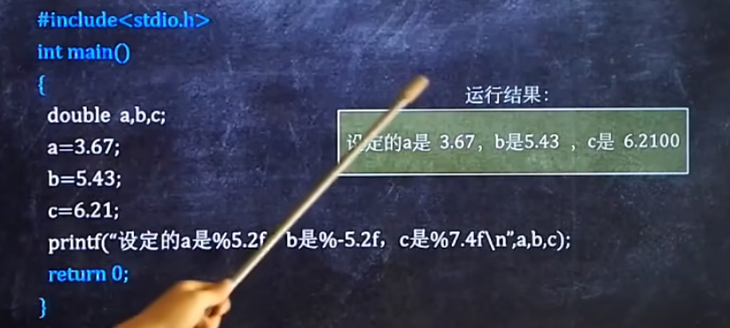
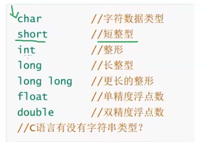

## c语言程序设计

> 特性：操作底层，尤其是内存地址的寻址及操作，指针的使用。
>
> 广泛用于底层开发，不需要任何运行环境支持便能运行的编程语言。
>
> 标准语法：
>
> - 美国国家标准局 ANSIC
> - 国际标准化组织、国际电工委员会 C11
> - 但后续的版本没有很好的支持，目前常用的是c89 / c90


- 流行的c语言编译器：

  - clang
  - GCc
  - msvc
  - vs2013 / vs2019  - 集成开发环境 -继承了msvc这样的编译器，可以编写+编译c代码

- 项目流程

  - 新建项目

  - 新建源文件  .c

    - 头文件  .h

  - 编写代码

    - 注意点：
      1. 一个工程只能有一个main函数
    - main 主函数（）

    ```c
    // c语言运行时，从main函数开始执行
    int main(){
        return 0;
    }
    ```

    

#### 基础知识


#### 快捷键

```shell
# 编译+链接库函数+运行代码
ctrl + f5    或
fn + ctrl + f5	或
菜单中 - 调试 - 开始执行不调试

#
```


#### 语法

- 单双引号 规则
  - 单引号 表示 字符 'A'
  - 双引号 表示字符串 'abc'
  - 不能混用！！！！
- 其他：

```c
printf   scanf	putchar	getchar

// printf 输出、打印
printf("输出内容\n");

// scanf 输入
/*
	- 报错：对于较新的编译器，可能会提示不让使用
	- 解决办法：在源文件第一行加内容
	#define _CRT_SECURE_NO_WARNINGS 1
	或
	使用 scanf_s()	
*/
int a;
scanf("%d%d" , &a, &b);  // 将输入的值，分别存放在变量a、b对应的位置

// putchar 输出/打印一个字符，类似printf
// getchar 输入/键入一个字符，类似scanf
char a;
a = getchar();  // 输入的字符赋值给a
putchar(a);     // 输出字符a
```


#### 特定符号

```c
\n   %d   %f   %lf	 %c
// \n  换行符
printf("输出内容\n");
// %d  整数
printf("%d",100);
// %f 单精度浮点型 带小数的数字
float a,b;
printf("%f%f",&a,&b);
// %lf 双精度浮点型 支持 单精度浮点型使用
double a,b;
printf("%lf%lf",&a,&b);
// %c  单个字符
printf("%c",'a');

// %m.nf  指定浮点数的长度格式，不分单双精度
// m 总长度，值为正-前面加空格，值为负-后面加空格
// n 小数点后的位数，加0

```




#### 关键字

```c
sizeof  

// sizeof()   计算字符串的长度  
printf('%d',sizeof(char))    // 输出char类型的大小
```


#### 作用域

- 局部变量

  - 声明及作用域：`{}`内部

- 全局变量

  - 声明：在main函数外部

  - 作用域：整个工程下的所有源文件都可使用

    ```c
    // a.c
    // main.c
    
    ```

    

- 问题：

  - 命名冲突时，局部有限，就近原则？


#### 数据类型



```c
char ch = 'a';    // char字符类型
float weight = 55.3;	// 单精度浮点型

// 计算集中的单位：
   1 bit比特位 - 8 byte字节 - 1024*8 kb - mb
// 1字节 == 8比特 == 8个二进制数
// 
// 字符型数据 char  1字节大小
// 短整型 short 2
// 整形 int 4
// 长整形 long 4
// 更长的整形 long long 8
// 单精度浮点数 float 4
// 双精度浮点数 double 8
    
// 疑问解答：
    // 对于c语言标准规定，因此long可能等于int，因此对于不同设备可能得出不同的结果。
    sizeof(long)>=sizeof(int)
```


#### 运算符号

```c
+ - * / %
```

- char 字符型 运算规则 遵循ascii表规则

  ```c
  char a='a';
  scanf("%c",&a);
  b=a-32;
  // 当输入小写字母a,将输出对应的大写字母（ASCII表）
  ```

  

