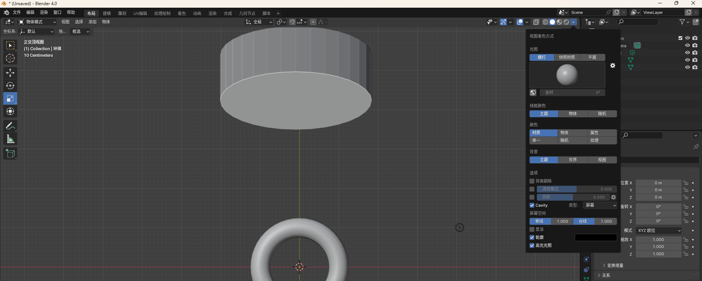

# [Blender](https://www.blender.org/)

> - 在一台设备中，可以同时存在多个版本
> - https://www.bilibili.com/video/BV1Bt4y1E7qn/?spm_id_from=333.1007.0.0

## 基础入门

- 编辑 -> 偏好设置

  - 可调节分辨率缩放、翻译语言等
  - 翻译中`新建数据`不建议勾选
  - 系统-内存设置，撤销次数

- 视图窗口区分：

  > 鼠标在任意窗口边缘（十字形），鼠标左键拖动即可复制新的窗口，右键点击可进行分割/合并

  - 3D 视图 - 左上（主要）
  - 大纲 - 右上角
  - 属性 - 右下角
  - 时间线 - 左下


### 推荐设置

- 推荐打开 Cavity，会为形状提供外框线，不会影响形状，只是看着更高级
  - 脊线、股线 推荐为 0.6，让边缘线看上去更自然




### 常见操作

```sh
ctrl + z  # 撤销


## 选中物体后
g   # 移动    
g  x/y/z   # 在 x/y/z轴上移动
s  # 缩放 - 缩放后记得应用
r  # 旋转
r x 90  # 在x轴旋转90度

x # 删除物体

~  切换视图

e  # 挤出
i  # 内插面


shift + c  # 将游标添加到世界中心
shift + 鼠标右键  # 将游标固定到鼠标位置
shift + a  # 添加物体


ctrl + a   # 应用，缩放、倒角等...
ctrl + b   # 设置倒角，同时使用鼠标滚动可调整分段
ctrl + r   # 设置环切，同时使用鼠标滚动可调整分段

ctrl + 1 || 2 || 3   # 添加细分曲面，更光滑

```


#### 鼠标操作

```sh
# 3D 视图中 - 左侧图标（由上至下）
- 框选
- 游标
- 移动 （也可进行框选）
```

```sh
鼠标滑轮 		 # 缩放视图
点击鼠标中键 + 移动鼠标   # 旋转视图
长按shift + 按住鼠标中键移动鼠标   # 移动视图
```


### 操作指引

#### 圆柱管道

1. 内插面
2. 删除上下内插的面
3. 选中上下两个内插面删除后留的边 alt + 鼠标左键
4. 鼠标右键- 桥接循环边
