## Linux

> CentOS与Ubuntu常见差异：  
>
> 1. 软件包管理器：CentOS使用yum，而Ubuntu使用apt或apt-get。 
> 2. 系统服务管理：CentOS使用systemd，而Ubuntu使用systemd或upstart。
> 3. 防火墙管理：CentOS使用firewalld或iptables，而Ubuntu使用ufw或iptables。
> 4. 默认的软件包和安装路径：CentOS和Ubuntu有不同的默认软件包和安装路径。


### 部分命令

```sh
# 要求：linux系统内核版本 3.8以上，系统要求64位+ 

uname -r     # 查看系统内核版本
df -h		# 查看磁盘空间的使用情况
top			# 实时监视系统的运行情况。它提供动态更新的进程列表，显示了系统的整体资源使用情况，包括CPU利用率、内存使用情况、进程数量等。通过 `top` 命令，可查看当前运行的进程、监视系统的负载情况、查找资源占用较高的进程，并进行一些简单的进程管理操作。

exit 		# 退出当前终端

# centos
cat  # 查看
cat /etc/redhat-release		# 查看系统版本


# ubuntu
sudo 					# 执行命令没有权限时，在命令前加 sudo
lsb_release -a				# 查看系统版本
apt update				# 更新系统的软件包管理器
apt-get -y install xxx 	 # 安装指定软件

kill -l			# 在linux中查看信号和编码的对应关系
kill <-kill编码> 进程号		# kill命令，通过信号编码，控制进程
# 常用： kill -9 进程号		## 强制结束指定进程


ps -ef		# 显示所有的进程信息
grep mysql	# 查找含有mysql相关的信息
```


### Ubuntu

> - unity为ubuntu的默认桌面，打破传统gnome面板配置


#### 基础认识


##### 终端提示符

```sh
例：`wzt@wuzt:~$`
	wzt - 用户名
	@ - 连接作用
	wuzt - 主机名
	~ - 表示路径
		~ - ，当前在家目录（类似桌面位置）
		/ - 表示根目录（类似C盘位置）
		. - .或./ 表示当前路径
	$ - 表示权限
		$ : 普通用户权限
		# : 管理员权限
```


##### 命令的格式

- `命令	选项	参数`
- 注意：命令、选项、参数之间使用空格隔开
- 例：`ls -l`


##### 文件详细信息

> 在linux中不以后缀名作为文件类型的区分，而分为七种文件类型  bcd-lsp；在查看文件详细信息时，首字母为文件类型标识。

- b：块设备文件
- c：字符设备文件
- d：目录文件
- -：普通文件
- l：软链接文件
- s：套接字文件
- p：管道文件


###### 文件权限

> 三个为一组，分别表示：用户主（所有者）、用户组、其他用户对文件的操作权限。

- 例：`drwxr-xr-x`
- 分类
  - 所有者 rwx
  - 用户组 r-x 
  - 其他用户 r-x
- 权限类型
  - r：读权限
  - w：写权限
  - x：可执行权限
  - `-`：没有权限


rwxr-xr-x

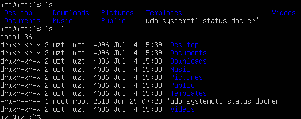


##### man 帮助手册

> man命令：是linux提供的手册
>
> - 第一章：命令 的帮助手册
> - 第二章：系统调用（操作系统提供的函数 open）
> - 第三章：库函数（c库提供函数）的帮助信息

- 用法 ：`man 章节 查找信息`
- 例：`man 1 ls`  `man 2 open`  `man 3 printf`
- 注意：章节参数可以不写，默认会从前往后找，直到找到或找完` man - man`


#### 基本操作

```sh
win + 空格		   # 切换输入法
ctrl + alt + F3		 # 切换到命令行界面


# 在桌面下，打开终端
1/ 输入框搜“ terminal ”	
2/ ctrl+alt+t
3/ 鼠标右键打开
```


#### 基础命令

- 重定向 `>`或`>>`：将命令要输出的内容，重定向输出到指定文件中

- 管道`|`：将一个程序的输出，作为另一个程序的输入

- tree 命令：以树状结构显示目录信息，默认展示所有层级

  > 系统默认没有这个命令，需要安装`sudo apt-get install tree`

  - 用法：`tree -L 层次`

  - 如果报错无法获得锁，使用以下命令删除一些文件即可

    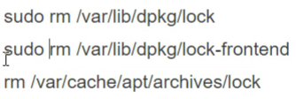

```sh
sudo su # 进入具备管理员权限的终端窗口

# 基础操作命令
tab					# 自动补全命令，多次按tab，展示所有相关内容提示
上/下键			  # 查看历史命令
命令 > 目的文件		# 将命令要输出的内容，重定向输出到指定文件中（会清空原文件）
命令 >> 目的文件		# 将命令要输出的内容，重定向输出到指定文件中（在原文件后追加）
命令1 | 命令2		  # 将一个程序的输出，作为另一个程序的输入


命令 --help		# 查看命令的帮助信息（并非所有的命令都有帮助信息）
man	章节 命令	  # 使用linux的帮助手册

ls 		# 查看目录下的信息，默认为当前目录
# -a 包含隐藏文件；
# -l 查看文件详细信息 -la -lh；
# -hl 详细信息中的字节数显示带对应单位大小；
ls /etc | wc -w		# 查看/etc下的文件总数（使用管道命令 |）

clear			# 清屏
ctrl + l		# 清屏快捷键
tree -L 层次	   # 以树状结构显示目录信息

cd				# 进入指定的目录结构
# / 根目录		~ 家目录	.. 当前的上级目录	 - 回退上次目录

pwd					# 显示当前工作目录的绝对路径
cat	文件路径/名称 	# 显示文本文件内容
rm -rf 文件路径/名称 		# 删除指定内容（文件/文件夹）
# 例：rm test.c		rm -rf xiutao
# -f 意思是强制删除，即使要删除的文件或文件夹不存在也不报错


cp 选项 源文件/(文件夹路径/名称) 目的路径	# 将 `指定文件` 复制到 `目的路径` 下
# 例：`cp -r -v text.txt /home`	将text.txt复制到/home
# -r 拷贝文件夹时使用，默认不支持文件夹的复制
# -v 显示复制的进度
cp 目录1 目录2 -a	# -a，将目录1复制到目录2中
cp 文件名1 文件名2  # 无论2是否存在，都将产生2，与文件1一致

mv 文件路径/名称 目录名/文件名		# 移动文件夹/文件 到指定目录
# 当要移向的位置不存在时，相当于将原内容重命名

mkdir 目录名	# 创建文件夹
# mkdir dir1 dir2	## 同时创建dir1 dir2
mkdir -p 多级目录	# 创建文件夹，并且支持深层次
# mkdir -p dir1/dir2/mydir	## 创建三级的目录，三个嵌套文件夹

touch 文件名	# 创建文件 例：`touch a.txt`
# 当文件已存在时，会修改文件的修改时间戳

find 路径 -name 文件名	# 在指定路径下查找指定文件,深度查找
# 例：`find /home/teach -name a.txt` 
# 在/home/teach下查找a.txt

grep 查找信息 文件夹/文件名	# 在指定文件中查找指定内容，并整行输出
# -n：显示查找到的文件行号
# -R 递归查找文件夹的子目录
grep 查找信息 * -n	# 在所有文件中查找，并注明找到的是目录还是文件
grep hello /home/* -R -n	# 在/home/*下所有目录中查找包含hello的文件/文件夹


ln 源文件名 链接文件名 -s	# 创建软链接文件（影响源文件）
# 例：ln file1 file -s	# 创建./file1的软连接文件file
## 无论对源文件还是链接文件进行修改，内容都会发生改变
## 删除链接文件，对源文件没有影响；删除源文件，链接文件


# 压缩与解压缩
# gzip格式：压缩包必须以 .tar.gz结尾
tar zcvf 压缩包名 文件1 文件2 ... # 压缩，将a.txt b.txt压缩到apk.tar.gz中
tar zxvf apk.tar.gz -C /home # 解压1：解压到指定目录
tar zxvf apk.tar.gz # 解压2：解压到当前目录


# bz2格式：压缩包必须以 .tar.bz2结尾
tar jcvf 压缩包名 文件1 文件2... # 压缩，将文件或文件夹压缩到压缩包中
tar jxvf abc.tar.bz2	# 解压1：解压到当前目录
tar jxvf abc.tar.bz2 -C /home	# 解压2：解压到指定目录
```


### vim 编辑器

> vim （vi升级版）

#### 安装 vim

```sh
# 安装vim
sudo apt-get install vim
# 安装ctags（索引工具，用来搜索）
sudo apt-get install ctags
# 配置 vim（从网上搜教程）
	step1：从网上找配置拷入当前用户目录下，使用samba或共享文件夹打开
	step2：打开终端，执行以下命令：
		cd vim_configure 
		./copy_con.sh
```


#### 使用

```sh
vi filename.c	# 打开或新建文件,并将光标置于第一行行首
vi +n filename.c	# 打开存在的文件，并将光标置于第n行行首
vim  +/关键词  文件的路径	# 打开指定的文件，并且高亮显示关键词
vim 文件路径1 文件路径2 文件路径3	# 同时打开多个文件
```


#### 三种模式

- 命令模式【默认进入的模式】

  > 不能直接编辑文件，可输入快捷键进行一些操作（删除行，复制行，移动光标，粘贴等）【打开文件之后默认进入的模式】

  - 编辑模式下的操作：

    ```sh
    u	# 撤销多次修改，
    ctrl r	# 反撤销
    
    [n]x 	# 删除光标后的n个字符
    [n]X	# 大写，删除光标前的n个字符
    [n]dd	# 删除从当前行开始的n行
    
    [n]yy	# 复制从当前行开始的n行
    p		# 把剪切板的内容插入到当前行
    .		# 执行上一次操作
    ZZ		# 大写，保存并退出当前文件
    ```

    

  - 转入编辑模式：`a	i	o`

  - 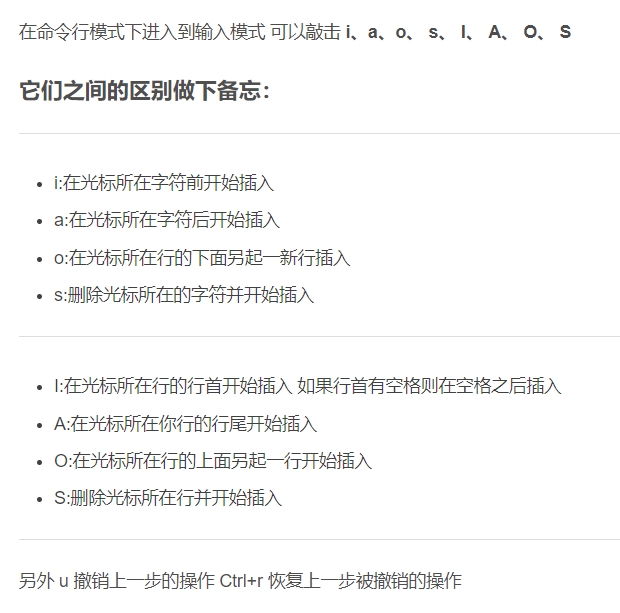

- 编辑模式（输入模式）

  > 在该模式下可以对文件的内容进行编辑，按ESC退出并进入末行模式

- 末行模式（尾行模式）

  > 可在末行输入命令对文件进行操作（搜索、替换、保存、退出、撤销、高亮等）

  ```sh
  :w		# 保存文件
  :wq		# 保存并退出
  :q!		# 不保存文件，强制退出
  :x		# 保存并退出 vi
  :w filename	# 另存为 filename
  ```

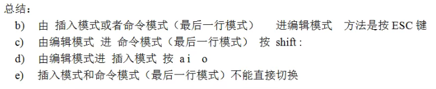


### 编译器 gcc

> GCC是GNU编译器集合（GNU Compiler Collection）的缩写。开源的编译器套件，用于编译各种编程语言，包括C、C++、Objective-C、Fortran、Ada和其他一些语言。GCC是一个非常流行和广泛使用的编译器，被广泛用于开发各种软件和操作系统。它由GNU项目开发和维护，可在多个平台上使用，包括Linux、Windows和Mac等。
>
> - 在windows操作系统下，编译工具用继承开发环境，vs
> - 在linux操作系统下，使用编译器gcc


#### gcc与g++

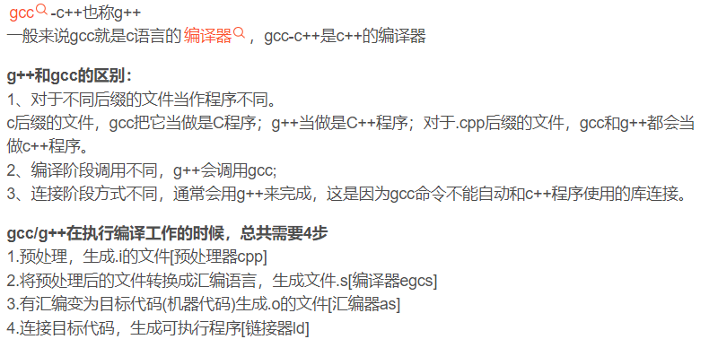


#### 编译程序

> 程序编译的四个阶段：预编译、编译、汇编、链接

```sh
# 第1种.一步到位：
gcc hello.c		# 默认会生成 a.out的可执行文件
gcc hello.c -o hello	# 生成指定命名的可执行文件 hello

# 运行编译后的程序：
./a.out	
./hello


# 第2种.分步骤完成
gcc -E hello.c -o hello.i	# 预处理
gcc -S helo.i -o hello.s	# 编译
gcc -c hello.s -o hello.o	# 汇编
gcc hello.o -o hello		# 链接

```


### Makefile

> make是一种代码维护工具、会根据当前目录下makefile文件定义的规则和步骤，完成整个软件项目的代码维护工作，提高开发及编译效率。
>
> - **make命令**：是个可执行程序，用来解析Makefile文件的命令，存放在`/usr/bin/`；
> - **makefile文件**：用来描述程序的编译规则
> - **优势：**简化编译程序时输入命令、节省重复编译的时间、提高开发效率。
> - window中一般有集成开发环境自动生成
> - linux中需要根据需要编写对应内容


#### 语法规则

156-163

[13.02 makefile语法规则_哔哩哔哩_bilibili](https://www.bilibili.com/video/BV1FA411v7YW/?p=156&spm_id_from=pageDriver&vd_source=12c717d82cfc8f0cc3894516956cc8b3)


### Shell 脚本

> shell：既是一种应用程序，又是一种程序设计语言。
>
> - 作为应用程序：交互式解释、执行用户命令、将用户操作翻译为机器语言（称为 shell命令解释器 ）
> - **是用户和Linux内核之间的接口程序**，用户输入命令都有shell解释后交给linux系统内核，采取 **并行** 方式协调各个程序的运行。
> - Linux系统提供了多种不同的shell


#### 403-419

[3-1.02 shell脚本的定义与执行_哔哩哔哩_bilibili](https://www.bilibili.com/video/BV1FA411v7YW/?p=404&spm_id_from=pageDriver&vd_source=12c717d82cfc8f0cc3894516956cc8b3)


### 系统调用


#### 概述

linux系统编程：在有操作系统的环境下编程，并使用操作系统提供的系统调用及各种库，对系统资源进行访问。可使用C语言进行linux系统编程。

系统编程，主要是为用户能够更方便的操作硬件设备，并起到保护作用。程序本质就是对硬件的操作。

只有内核才可以操作硬件设备，如果想调用内核的系统调用，有三种方式直接操纵：

1. shell命令，通过shell解释器操作内核的系统调用
2. 库函数，用户通过应用层库函数的接口
3. 应用层系统调用，也可直接对内核的系统调用进行操作


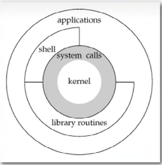

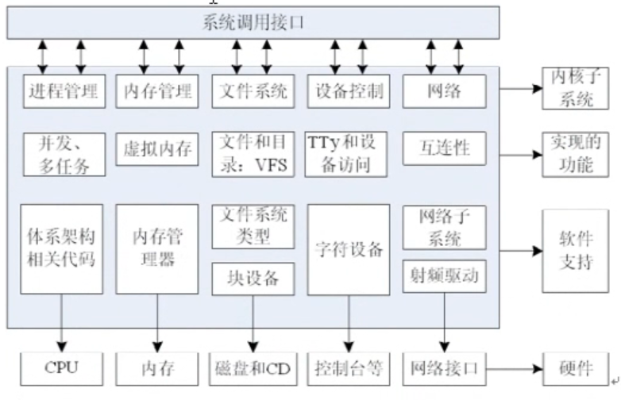


#### 系统调用I/O函数

- 系统调用按功能逻辑分：
  - 进程控制、进程间通信、文件系统控制、系统控制、内存管理、网络管理、socket控制、用户管理
- 系统调用的返回值（通常）
  - `负`：表示错误，错误信息存放在全局变量errno中。
  - `0`：表示成功，用户可用perror函数打印出错信息。
- 系统调用遵循的规范
  - 在linux中，API接口遵循POSIX标准（基于UNIX实践和经验）


##### 文件描述符

文件描述符是非负整数，打开现存文件或新建文件夹时，系统（内核）会返回一个文件描述符号。文件描述符用来指定已打开的文件。

```c
// 程序运行起来后，这三个文件描述符，是默认打开的
//				文件IO描述符	标准IO文件指针
#define STDIN_FILENO 0	stdin	// 标准-输入的文件描述符
#define STDOUT_FILENO 1	stdout	// 标准-输出的文件描述符
#define STDERR_FILENO 2	stderr	// 标准-错误的文件描述符
```


##### 相关函数

###### open函数

```c
/**
* open：打开一个文件
* @param  {const char *} pathname-文件的路径及文件名
* @param  {int} flags-open 函数的行为标志
* @param  {mode_t} mode-文件权限(可读、可写、可执行)的设置
* @return 成功返回打开的文件描述符; 失败返回-1,可用perror查看原因
*/
#include <sys/types.h>
#include <sys/stat.h>
#include <fcntl.h>
int open(const char *pathname, int flags); // 当文件存在时使用
int open(const char *pathname, int flags, mode_t mode);// 当文件不存在时使用


/**
* flags 取值
* 0_RDONLY 以只读方式打开
* 0_WRONLY 以只写的方式打开
* 0_RDWR 以可读、写的方式打开
*/
```

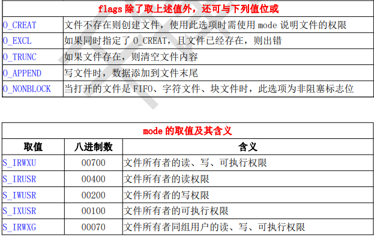

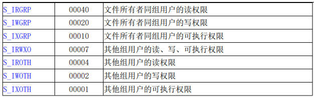


###### close函数

###### read函数

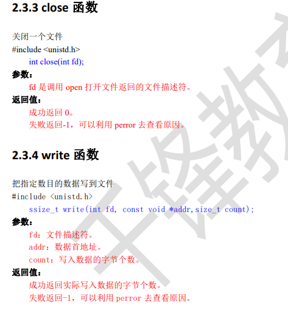


###### remove库函数

```c
/**
* remove：删除文件
* @param  {const char *} pathname-文件的路径及文件名
* @return 成功返回 0; 失败返回-1,可用perror查看原因
*/

#include <stdio.h>
int remove(const char *pathname);
```


#### 库函数

> 并不是所有的系统调用都被封装成了库函数，系统提供的很多功能都必须通过系统调用才能实现。

1. 系统调用需要时间，频繁使用会降低程序运行效率。
2. 运行内核代码时，CPU工作在内核态，在系统调用发生前需要保存用户态的栈和内存环境，然后转入内核态工作。
3. 系统调用结束后，又要切换回用户态。这种环境的切换会消耗掉许多时间。
4. 库函数访问文件时，根据需要设置不同类型的缓冲区，从而减少直接调用 IO 系统调用的次数，提高访问效率


##### 分类

- 不需要系统调用

  > 不需要切换到内核空间即可完成函数全部功能，并且将结果反馈给应用程序，如 strcpy、bzero 等字符串操作 函数

- 需要系统调用

  > 需要切换到内核空间，这类函数通过封装系统调用去实现相应功能，如 printf、fread 等

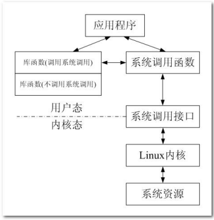


### 进程

> 进程是程序的执行实例，包括程序计数器、寄存器和变量的当前值。 
>
> 程序：静态的，存放在磁盘上；进程：动态的，存放在内存中。
>
> 程序是一些指令的有序集合，而进程是程序执行的过程。进程的状态是变化的，其包括进程的创建、调度和 消亡。
>
> 进程拥有自己独立的处理环境和系统资源（处理器、存储器、 I/O 设备、数据、程序）。 可使用 exec 函数由内核将程序读入内存，使其执行起来成为一个进程


- 进程的状态

  - 就绪态： 进程已经具备执行的一切条件，正在等待分配 CPU 的处理时间。
  - 执行态： 该进程正在占用 CPU 运行。 
  - 等待态： 进程因不具备某些执行条件而暂时无法继续执行的状

- 进程控制块

  > 操作系统（OS）根据 PCB 来对并发执行的进程进行控制和管理的。系统在创建一个进程的时候会开辟一段内存空间存放与此进程相关的 PCB 数据结构。
  >
  > PCB 中记录了用于描述进程进展情况及控制进程运行所需的全部信息。 PCB 是进程存在的唯一标志，在 Linux 中 PCB 存放在 task_struct 
  >
  > task_struct :（在 linux内核中 `/usr/src/`，然后使用ctags进行查找，`sudo ctags -R`生成索引文件；`vim -t task_struct`查询，会找到对应结构体的位置  ）

  - 调度数据：进程的状态、标志、优先级、调度策略等。 
  - 时间数据：创建该进程的时间、在用户态的运行时间、在内核态的运行时间等。
  - 文件系统数据： umask 掩码、文件描述符表等。 内存数据、进程上下文、进程标识(进程号)...

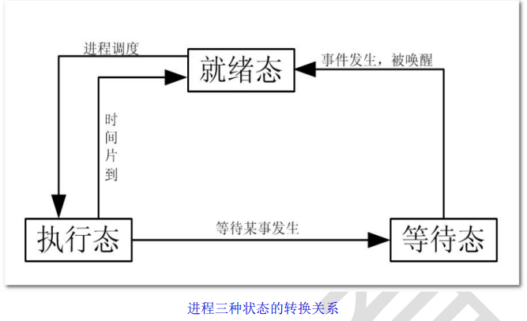

#### 430-442


#### 进程间通讯

> 实质：系统创建进程，就会分配4G的虚拟内存(32位系统)，虚拟内存分为3G用户空间、1G内核空间
>
> 用户空间：进程私有、每一个进程的用户空间只能自己访问和使用，（堆区、战区、数据区、代码区等）
>
> 内核空间：进程公有、绝大多数进程通信方式本质就是对内核空间的操作

- 特点
  - 进程是一个独立的资源分配单元，
  - 不同进程（常指用户进程）之间资源相互独立，无法直接访问另一个进程的资源。
- 功能
  - 数据传输：多进程间的数据发送。
  - 资源共享：多进程之间资源共享。
  - 通知事件：一个进程需要向另一个或一组进程发送消息，通知它们发生了某种事件。 
  - 进程控制：有些进程希望完全控制另一个进程的执行（如 Debug 进程），此时控制进程希望能够拦截另一个进程的所有操作，并能够及时知道它的状态改变。
- 特殊的进程间通讯方式：
  - socket通信可以实现不同主机之间的进程通讯（其他仅能在一台主机内通讯）
  - 信号通信是唯一的一种异步通信机制
  - 共享内存是所有进程间通信方式中效率最高的，直接对物理内存进行操作


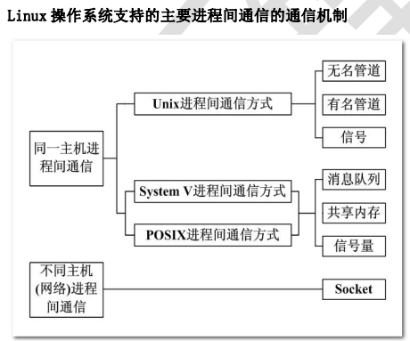


#### 信号

> 信号是**软件中断**，它是在软件层次上对中断机制的一种模拟。
>
> 每个信号的名字都以 **字符 SIG 开头**。 每个信号都和一个数字编码(`正整数)`对应，在头文件 signum.h 中，信号名定义路径： /usr/include/i386-linux-gnu/bits/signum.
>
> 信号是由系统已经定义好的标识，每个标识都会在特定场合使用并对进程产生影响。
>
> 信号是一种**异步通信**方式。
>
> - 进程不必等待信号的到达，进程也不知道信号什么时候到达
> - 信号可以直接进行用户空间进程和内核空间进程的交互，内核进程可以利用它来通知用户空间进程发生了哪些系统事件。

```sh
kill -l			# 在linux中查看信号和编码的对应关系
```

- 信号的产生条件

  - 当用户按某些终端键时，将产生信号

    - 终端上按“Ctrl+c”组合键通常产生中断信号 SIGINT
    - 终端上按"Ctrl+\"键通常产生中断信号 SIGQUIT
    - 终端上按"Ctrl+z"键通常产生中断信号 SIGSTOP。

  - 硬件异常将产生信号

    - 除数为 0，无效的内存访问等。这些情况通常由硬件检测到，并通知内核,然后内核产生适当的信号发送给相 应的进程

  - 软件异常产生信号

  - 调用 kill 函数

    > 接收信号进程和发送信号进程的所有者必须相同，或发送信号进程的所有者必须是超级用户。

  - 运行 kill 命令

    > 使用 kill 函数发送信号，常用此命令终止一个失控的后台进程

- 信号的默认（缺省）处理方式

  > 每个信号只有一个默认的处理方式

  - 终止进程：立即结束
  - 缺省处理：不做处理
  - 停止进程：停止当前进程，还可恢复，后台进程
  - 恢复停止的进程：让停止的进程会恢复运行

  

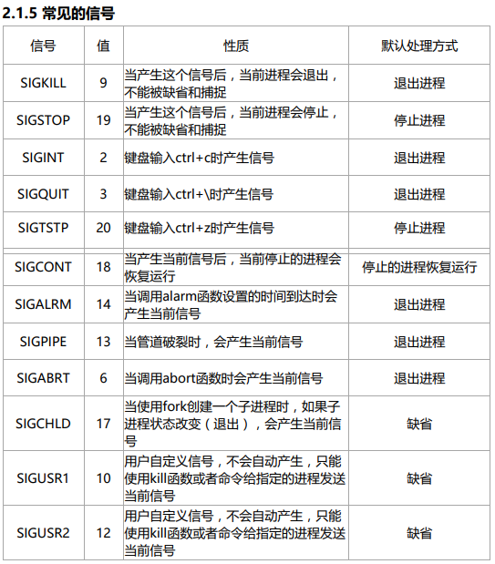

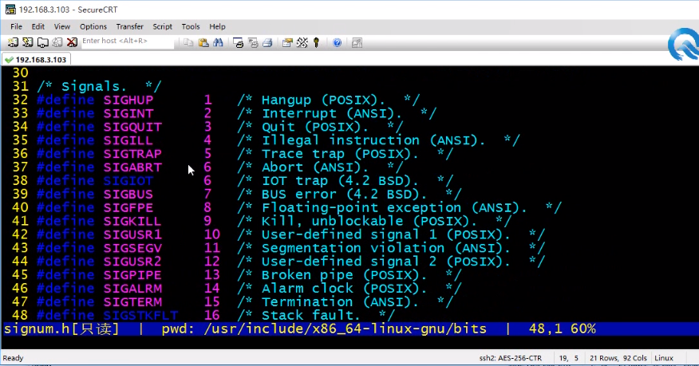


##### kill 函数

> 向指定的进程发送指定信号，

- 参数：
  - signum - 信号的编号
  - pid
    - pid>0: 将信号传送给进程ID为pid的进程。
    - pid=0: 将信号传送给当前进程所在进程组中的所有进程。
    - pid=‐1: 将信号传送给系统内所有的进程，除了init进程
    - pid<‐1: 将信号传给指定进程组的所有进程。这个进程组号等于pid的绝对值。
- 返回值：成功：0、  失败：-1
- 注意：使用 kill 函数发送信号，接收信号进程和发送信号进程的所有者必须相同，或者发送信号进程的所有者是超级用户

```sh
#include <sys/types.h>
#include <signal.h>
int kill(pid_t pid, int sig);

```

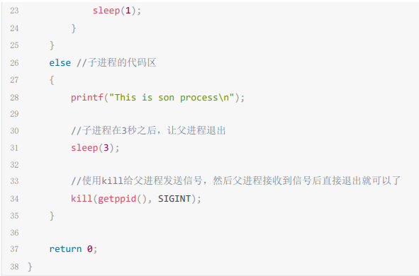


##### alarm 函数

> 定时信号，在 seconds 秒后，向调用进程发送一个 SIGALRM 信号，SIGALRM 信号的默认动作是终止调用 alarm 函数的进程。

- 返回值
  - 若没有设置过alarm，或alarm已超时，返回0
  - 否则，返回上个定时器剩余的秒数，并重新设定定时器

```c
// 声明
#include <unistd.h>
unsigned int alarm(unsigned int seconds);

// 例：该程序实际运行 9s
#include <stdio.h>
#include <unistd.h>
int main(int argc, char *argv[])
{
unsigned int seconds;
seconds = alarm(5);
printf("seconds = %d\n", seconds);	// 0
sleep(3);
seconds = alarm(6);
printf("seconds = %d\n", seconds);	// 2，因为上一个剩余2s
while(1);
return 0;
}
```


##### 445-450


##### 信号集

- 信号集：方便同时对多个信号进行处理，用来表示多个信号的数据类型。
- 信号集数据类型：`sigset_t`
- 信号集相关函数：
  - sigemptyset	初始化空的信号集
  - sigfillset    初始化一个满的信号集
  - sigismember   判断某个集合中是否有某个信号
    - 0 不在 ；  1 存在
  - sigaddset  向某个集合中添加一个信号
  - sigdelset  从某个信号集中删除一个信号

```c
#include <signal.h>
int sigemptyset(sigset_t *set);

#include <signal.h>
#include <stdio.h>
int main(int argc, char *argv[])
{
	sigset_t set;   // 定义一个信号集
	int ret = 0;
	sigemptyset(&set);	// 初始化空的信号集
	ret = sigismember(&set, SIGINT);	// 判断其中是否有SIGINT信号
	if(ret == 0){  //不存在
		printf("SIGINT is not a member of sigprocmask \nret = %d\n", ret);
    }
	sigaddset(&set, SIGINT);
	sigaddset(&set, SIGQUIT);
	ret = sigismember(&set, SIGINT);
	if(ret == 1){
        printf("SIGINT is a member of sigprocmask \nret = %d\n", ret);
    }
	
	return 0;
}

```

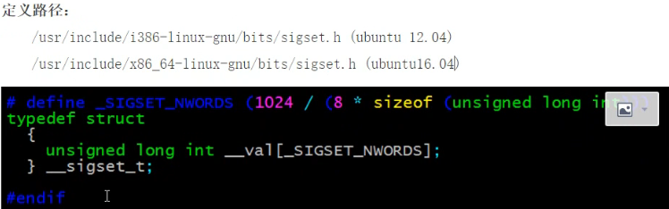


##### 452-460

###### 信号阻塞集（屏蔽集、掩码）

###### 文件描述符复制 b c d p ls

###### 无名管道通讯


#### 管道

##### 无名管道

##### 命名管道FIFO

- 特点：
  - FIFO 在文件系统中作为一个特殊的文件而存在并且在文件系统中可见，但 FIFO 中的内容依旧存放在内存中。（ 因此实现不相关进程间通信 ）
  - 当使用 FIFO 的进程退出后，FIFO 文件将继续保存在文件系统中以便以后使用。
  - FIFO 有名字，不相关的进程可以通过打开命名管道进行通信。

```c
// 创建一个有名管道（文件类型p）
// 方法1.使用shell命令创建 
mkfifo 文件名
    
// 2.使用函数 mkfifo创建
/* 参数
    pathname 
*/
#include <sys/types.h>
#include <sys/stat.h>
int mkfifo(const char *pathname, mode_t mode);

```


## 使用解答


### vm相关

- [安装VMware Tools](https://blog.csdn.net/weixin_46829095/article/details/128528922)
  - [Ubuntu22.04安装完vmware tools还是不能在和win之间拖拽文件复制粘贴](https://blog.csdn.net/qq_45060188/article/details/132154379)

- [ubuntu虚拟机设置静态ip](https://blog.csdn.net/m0_57168310/article/details/128176238)


### 开机无网络

- 打开主机打开网络和共享中心，点击更改适配器 选择本地连接VMnet8 右键->属性->ipv4协议->属性->选择“自动获得IP、自动获得DNS服务器
- VMware Workstation11的编辑（E）-->虚拟网络编辑器（N），点击更改设置，将VMnet0移除，只剩下VMnet1 和 VMnet8,点击确定


