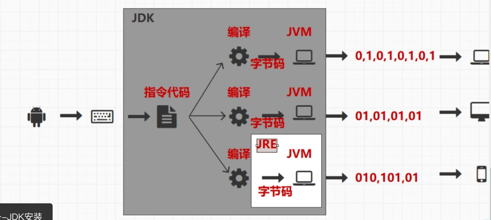
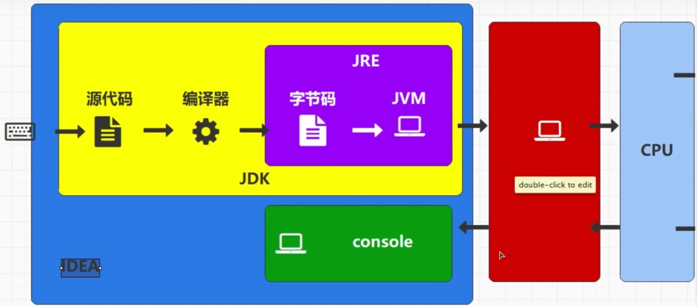
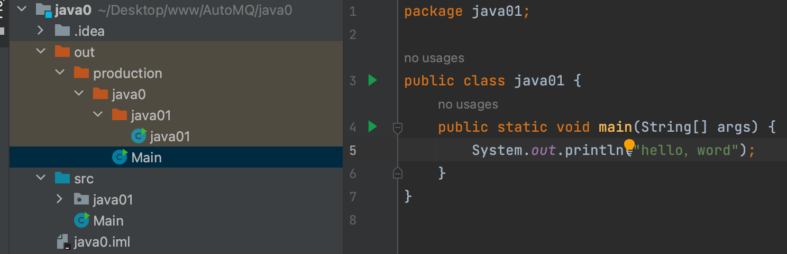
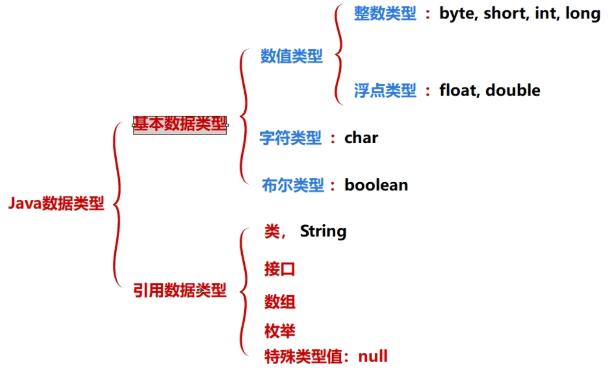
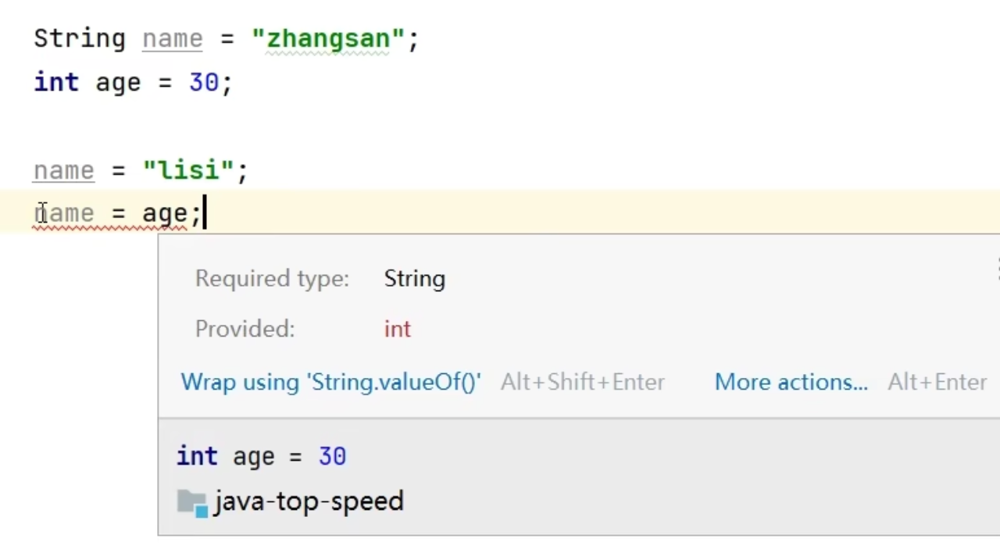
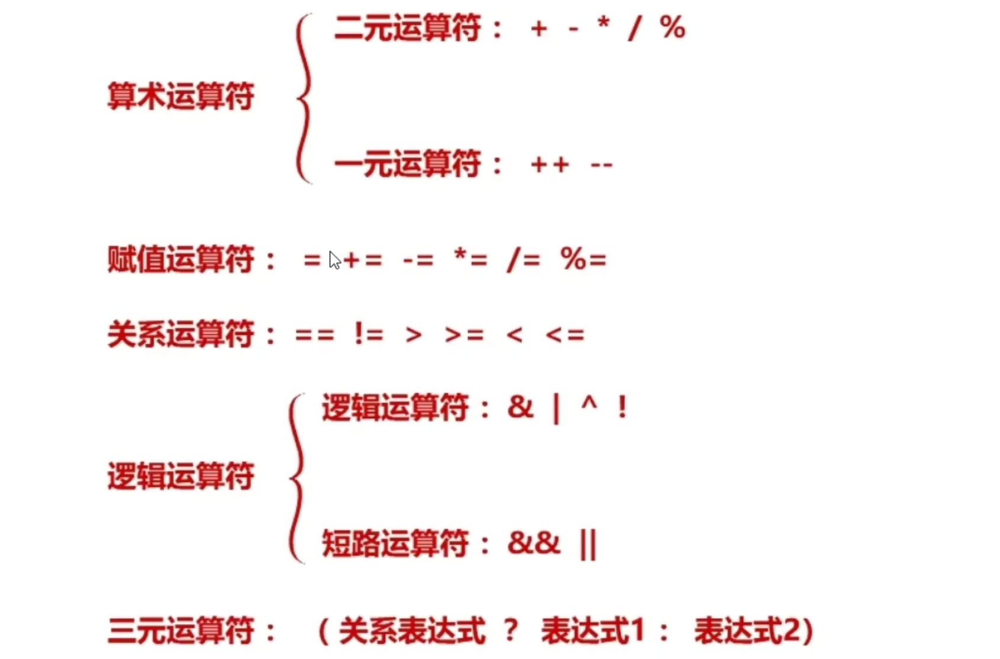

## Java

- **JRE（Java Runtime Environment， Java运行环境）**是Java平台，所有的程序都要在JRE下才能够运行。包括JVM和Java核心类库和支持文件。

- **JDK（Java Development Kit，Java开发工具包）**是用来编译、调试Java程序的开发工具包。包括Java工具（javac/java/jdb等）和Java基础的类库（java API ）。

- **JVM（Java Virtual Machine， Java虚拟机）**是JRE的一部分。JVM主要工作是解释自己的指令集（即字节码）并映射到本地的CPU指令集和OS的系统调用。Java语言是跨平台运行的，不同的操作系统会有不同的JVM映射规则，使之与操作系统无关，完成跨平台性。

  > Java虚拟机的缩写。是通过在实际的计算机上仿真模拟各种计算机功能来实现的。由**一套字节码指令集、一组寄存器、一个栈、一个垃圾回收堆和一个存储方法域等**组成。JVM屏蔽了与操作系统平台相关的信息，使得Java程序只需要生成在Java虚拟机上运行的目标代码（字节码），就可在多种平台上不加修改的运行，这也是Java能够“**一次编译，到处运行的**”原因。





源代码-必须放在蓝色文件夹src下，.java 文件

字节码文件/类文件 -由源代码编译而成  .class 文件

编译器-javac


### 起步

#### 环境准备

- 安装 java jdk  https://www.oracle.com/java/technologies/downloads/#jdk17-mac

  - 验证是否安装成功： `java --version`

- 安装编译器 IDEA

- hello word

  


#### 基础知识


##### 数据存储单位

- 比特 bit位：数据运算的最小存储单位
- 字节 byte：数据的最小存储单位
  - 1byte=8bit		1024byte=1kb		1024kb=1mb


##### 注释

```java
// 单行注释

/*
	多行注释，
	注释的内容只在源码中有效，编译后不存在
*/

/*
	IDEA中用于标记 待办的特殊注释 TODO
	TODO 注释的内容，该行高亮显示
	在IDEA底部的TODO中可快速查看所有的TODO标注行
*/
```


##### 程序入口main

```java
// main 函数作为程序的入口。是所有java程序都应具备的内容
public static void main(String[] args) {
    System.out.println("hello，word");
}
```


##### 打印输出

```java
System.out.println("张三");   // 在控制台输除 "张三" ，ider快捷键 ·sout·
```


##### 变量

```java
// String 字符串类型
String name;    // 声明字符串变量
name = '张三';


```


##### 数据类型

```java
// 基本数据类型
// 1.整数类型（存储空间不一致，分为以下几种类型）
// byte 8位
byte b = 10;
// short 16位
short s = 16;
// int 32位
int i = 32;
// long 64位
long l = 64;

// 2.浮点类型，含有小数点的值
// float 单精度浮点类型，数据需要使用 F(f) 结尾
float f = 1.0F;
// double 双精度浮点类型
double d = 2.0;

// 3.字符类型,表示一个字符
char c = '@';

// 4.布尔类型，值为true或false
boolean bln = true
  
  
  
  
// 引用数据类型
String name =	'zhangsan';

```




###### 数据类型的转换

- java中，变量的类型在声明时就被确定，后续不允许随意再赋予其他类型的值。
- 数据类型转换
  - 范围小的数据类型 可转为 大的数据类型，在java中是允许的，但 无法将大的数据类型赋值给小的数据类型

```java
String name = 'zhangsan';
int age = 30;

name = 'lisi';
// name = age;    // 此时编译器报错，应为String类型，却得到 int类型


// 类型转换法则（小->大）：
// 小->大		byte -> short -> int -> long -> float -> double
byte b = 10;
short s = b;
int i = s;
long lon = i;
float f = lon;
double d = f;

// 强制转换（大->小）： 会丢弃多余的部分
double d = f;
// int i1 = d； // 编译器报错，不允许直接 小->大
int i1 = (int)d; // 强制转换，多余的浮点值会被抹去。

```





##### 标识符

- 标识数据的符号
  - 变量名 就是 标识符，主要用于起名
- 标识符的命名规则
  - 英文字母
  - 符号仅限 `&  _`
  - 数字，不能做为标识符的开头（当为数字开头时，会被认为是数字而报错）
  - 标识符不允许重复声明（以大括号为作用域），并区分大小写
  - 关键字/保留字
    - `static	public	String`

```java
String userName = '张三'
String _userName = '张三'
```


##### 运算符与表达式

```java
// TODO:算数表达式，拥有计算结果，就需要有类型，这里的类型是参与运算的元素中范围最大的那一种
System.out.println(1 + 2)   // 输出 3
System.out.println(1 / 2)   // 输出 0     (int,int) => int
System.out.println(1.0 / 2) // 输出 1.5   (double,int) => double
System.out.println(5 % 2)   // 输出 1     取余操作，模运算
  
// 计算后的，最小的使用类型为int
byte b1 = 10;
byte b2 = 20;
// byte b3 = b1 + b2;  // 报错！，算数表达式的最小使用类型为int类型
int b3 = b1 + b2; 
byte b3 = (byte)(b1 + b2); // 强制转换 
```





