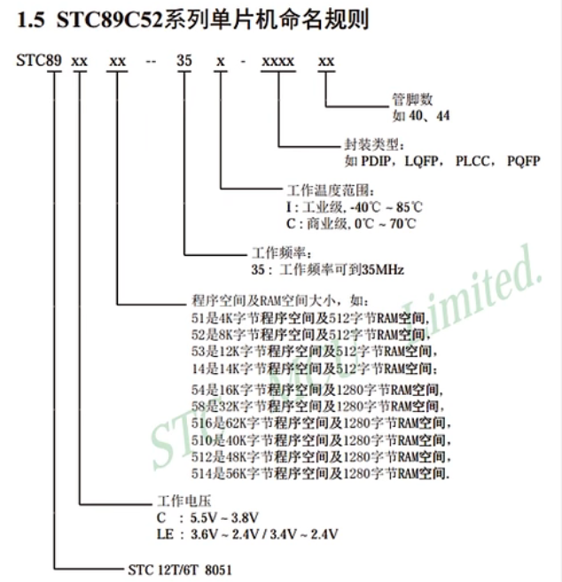
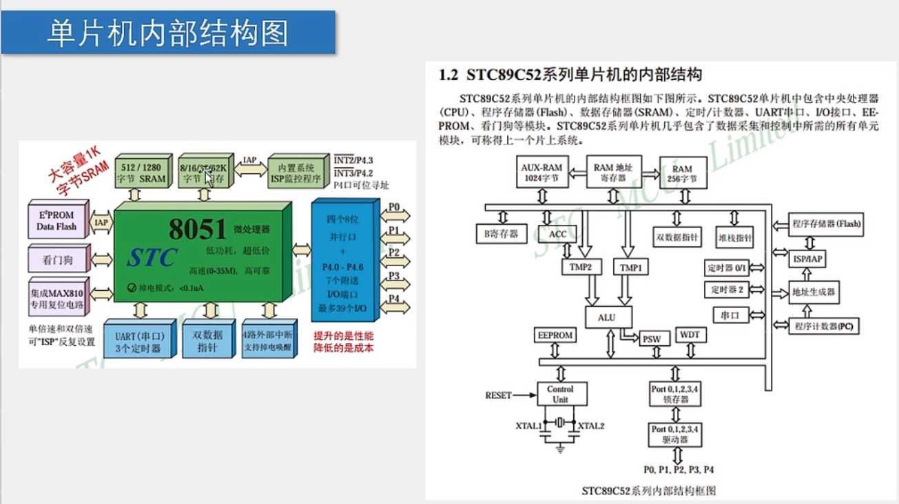
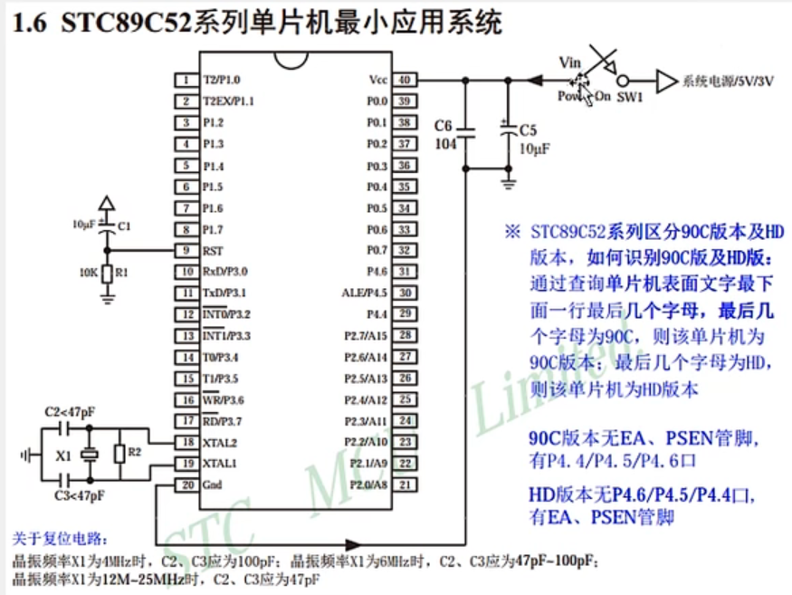
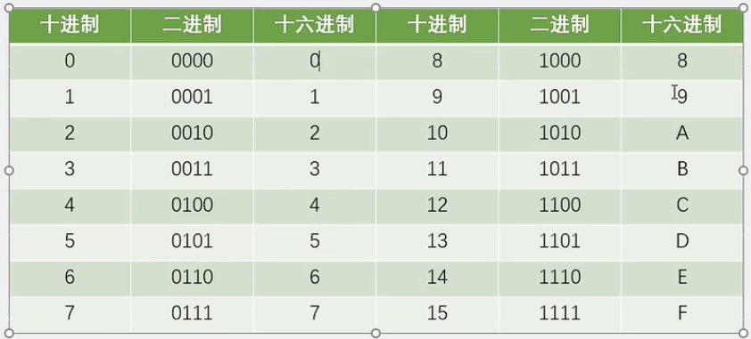
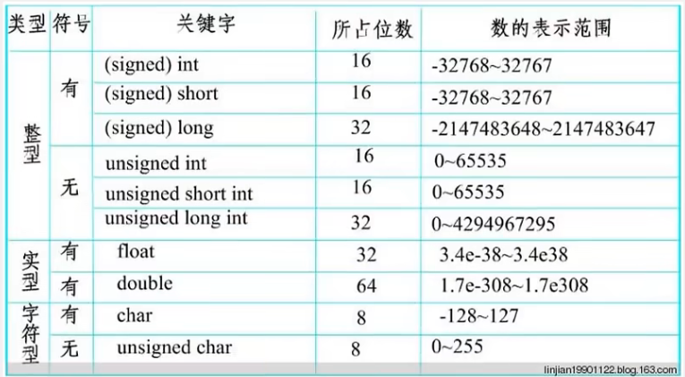
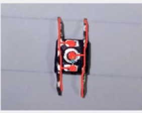

# 51单片机


### 基础知识

- 开发工具：keil5 编写程序、STC-ISP 下载程序、烧录软件-找厂商要
- 说明：本文档基于 STC89C52 单片机


#### 单片机介绍

> - 单片机 Micor Controller Unit、简称MCU
> - 内部集成了CPU、RAM、ROM、定时器、中断系统、通讯接口等一系列电脑常用硬件功能
> - 单片机的任务是：信息采集（依靠传感器）、处理（依靠CPU）、控制（电机、LED等）
> - 单片机算是一个袖珍版的计算机，一个芯片能构成完整的计算机系统。在性能上略显逊色；但成本低、体积小、结构简单；有利于了解计算机原理和结构。
> - 51单片机是指所有 兼容Inter 8031指令系统的单片机的统称。


##### STC89C52 单片机

- 位数：8位单片机
- RAM：512字节 - 掉电丢失
- ROM：8kb（Flash）- 掉电不丢失 1k=1024b 1b=8字节
- 工作频率/速度：不同板子不一定相同（单片机晶振决定？）
- 命名规则：

  






##### 如何控制单片机引脚

> - 在单片机中有寄存器（存储器）、且8个为一组、每个寄存器都通过一个驱动器（驱动增大电流）连接一个IO口
> - CPU可以直接访问并控制寄存器中的值，从而控制IO的输出
> - 通过CPU控制寄存器、完成对硬件电路的控制
> - 在51中一般使用16进制进行控制




#### C51数据类型




#### 代码示例

- 使用kile5新建项目
- 第一步：设置项目名及保存的路径
- 第二步：配置·单片机型号；stc89c52并没有提供，可使用at89c52
- 第三步：新建main.c，开写

```c
#include <REGX52.H>
void main(){
    P2 = 0xFE;	// 设置P2组的引脚值，控制高低电平 1111 1110
}
```


##### 软件延时计算器

> 在STC-ISP软件中有提供相关的函数生成工具，用来生成延时函数
>
> - 选择系统频率（查单片机配置的晶振频率）
> - 选择指令集（）
> - 定时长度（一般使用1ms，然后通过传参形式复用任意时间长度）
>
> ```c
> // 定义
> void Delay1ms(unsigned int xms){		// @12.00MHz 系统频率
>     unsigned char i,j;
>     while(xms--){
>          i=2;
>     	j=239;
>     	do{
>        	 	while(--j);
>         	while(--i);
>     	}
>     }
> }
> 
> // 使用
> Delay1ms(1000)
> ```
>
> 


#### 定时器


##### 软件消抖

> 举例：独立按键-在使用时，独立按键通过其中的金属弹片控制电路。在按下和抬起过程中，硬件接触之间不是瞬间完成的，存在抖动变化的过程。
>
> 

```

```


