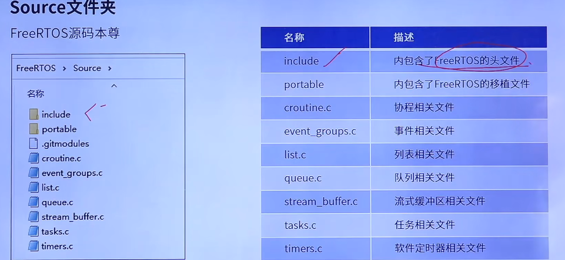

## RTOS


### 软件工具

- [MDK-ARM Version 5.41 Evaluation Software Request (keil.com)](https://www.keil.com/demo/eval/arm.htm#/DOWNLOAD)
  - [5.38 arm Keil5 下载、安装及激活（附系列芯片包下载](https://blog.csdn.net/qq_53430455/article/details/132732710)
  - [Arm Keil | Keil STM32F1xx_DFP](https://www.keil.arm.com/packs/stm32f1xx_dfp-keil/boards/)


### 基础入门(FreeRTOS)

#### 裸机与RTOS

- 裸机【前后台系统】

  > 前台系统：中断服务函数 ；后台系统：大循环、即应用程序

  - 特点
    - 时效性差，应用程序依次轮流执行
    - delay 空等待，浪费cpu
    - 结构臃肿，实现功能放在main中无限循环
  - 

- RTOS【实时操作系统】

  - 特点
    - 分而治之：实现功能划分为多个任务
    - 延时函数：任务调度，让出CPU使用权，而不是空等待
    - 抢占式：高优先级任务可抢占低优先级任务
    - 任务堆栈：每个任务都有自己的栈空间【抢占与恢复】
    - **中断可以打断任意任务**【内核级】，任务都是【软件级】
    - **任务之间可以同等优先级**
  - 


#### [FreeRTOS™](https://www.freertos.org/zh-cn-cmn-s)

- 特点
  - 免费开源，无商业使用风险
  - 可裁剪，核心代码9000+行，对硬件要求友好
  - 简单，简单易用，可移植性非常好
  - 优先级不限：任务优先级分配没有限制，多任务可同一优先级
    - 优先级算法：通用软件方法，无限制
    - 硬件方法：受限于MCU架构，例stm32属于32位，则优先级限制在0-31
      - 数字越大，任务优先级越高（中断数字越小，任务优先级越高）
  - 任务不限：可创建的实时任务没有软件限制，but分配堆栈受硬件限制
  - 抢占/协程/时间片：支持抢占式、协成程、时间片流转任务调度


#### 任务调度与状态

> 调度器使用相关的调度算法决定当前需要执行哪个任务

- 任务状态
  - 运行态
  - 就绪态
  - 阻塞态：因外部延迟或等待外部事件发生，而等待
  - 挂起态：类似暂停，调用函数`vTaskSusoend()`进入挂起态，调用`vTaskResume()`解除挂起进入就绪态
- 任务列表【除就绪态外，其余三种状态都拥有任务列表-类似链表】
  - 就绪列表
    - `pxReadyTaskLists[x]`   x代表任务优先级值，常取硬件值范围。软件-无限制；硬件-0~31； 
    - 挑选最高优先级任务进入运行态，相同优先级的任务会连接在同一就绪列表上轮流执行
    - 32位的变量，当某个位，置一时，标识当前对应的优先级就绪列表有任务存在
  - 阻塞列表
    - `pxDelayedTaskList`
  - 挂起列表
    - `xSuspendedTaskList`


- 三种调度方式

  - 抢占式

    - 针对优先级不同的任务，高优先级抢占低优先级任务【数值越大，优先级越大】
    - 高优先级任务不停止，低优先级任务就无法被执行
    - 被抢占的任务进入`就绪态`

  - 时间片

    > 同等优先级任务轮流的享有CPU的时间（可设置中断周期），一个时间片就等于滴答定时器(SysTick)中断周期

    - 针对优先级相同的任务，在每一次系统时钟节拍到达时切换任务，循环执行
    - 当前任务意外阻塞后，会直接切换下个任务重新计时，而不是空等待

  - 协成程【了解即可，FreeROTS不再更新，被淘汰？】

    - 当前任务一直执行，高优先级也无法抢占，从前小芯片适合的方案


#### 移植OS

> - 源码获取   [FreeRTOS™ - FreeRTOS™](https://www.freertos.org/zh-cn-cmn-s)


##### 源码目录

- FreeRTOS/Source/portable   的移植文件
  - keil    指向 RVDS 文件夹
  - RVDS 不同内核芯片的移植文件
  - MemMang 内存管理文件





##### 基础工程

> 后续需使用LED、LCD、定时器、内存管理等，可使用【HAL库版本的内存管理实验工程】作为基础工程进行FreeRTOS的移植

1. 添加FreeRTOS源码   将源码添加到基础文件、头文件路径等

   - 项目的 Middlewares下新建 `FreeRTOS`文件夹，并将源码部分拷贝进来

   - 精简 portable 文件内容

   - 将文件添加到工程 keil打开项目 Projects/MDK_ARM/...   新建文件分组

     - Middlewares/FreeRTOS_CORE

       - 将下图1的所有.c文件加入

     - Middlewares/FreeRTOS_PORT

       - 加入port.c

       - heap_4.c

       - | 开发板类型 | 所在文件夹   |
         | ---------- | ------------ |
         | STM32F1    | ARM_CM3      |
         | STM32F4    | ARM_CM4F     |
         | STM32F7    | ARM_CM7/r0p1 |
         | STM32H7    | ARM_CM7/r0p1 |

     - 添加头文件路径

       - 魔法笔 - c/c++ include path 
         - 选择 下图1的`include` 和 RVDS下的ARM_CM3

     

     

2. 添加 FreeRTOS  Config.h 配置文件

   > 操作系统的配置文件 宏定义，FreeRtOS可裁剪特性

   - 获取途经
     - 1：根据裁剪需求，自行编写
     - 2：官方提供的demo文件夹的演示工程获取
     - 3：正点原子教程获取
   - **复制到项目的 user文件夹下**

3. 修改SYSTEM文件中的` sys.c    delay.c    uart.c`

4. 修改中断相关文件 `Systick中断   SVC中断    PendSV中断`

5. 添加应用程序


##### 略


#### 系统配置文件

- FreeRTOSConfig.js 配置文件：进行功能配置和裁剪，以及API函数的使能。
- https://www.freertos.org/zh-cn-cmn-s/Documentation/02-Kernel/03-Supported-devices/02-Customization
- 略


#### 任务创建与删除

- 动态创建任务  xTaskCreate()

  - 创建流程
    1. 将宏`configSUPPORT_DYNAMIC_ALLOCATION` 配置为  1
    2. 定义函数入口参数
    3. 编写任务函数
  - 内部实现过程
    1. 申请堆栈内存 & 任务控制块(TCB)内存
    2. TCB结构体成员赋值 - 保存任务的信息
    3. 将新任务添加到就绪列表
  - 查询任务栈历史剩余最小值
    - 

  ```c
  // 动态创建任务函数
  BaseType_t xTaskCreate{
      TaskFunction_t pxTaskCode, /* 指向任务函数的指针 */
      // const char * const 表示指针和常量都不能修改
      const char * const pcName, /* 任务名字，最大长度 configMAX_TASK_NAME_LEN */
      const configSTACK_DEPTH_TYPE usStackDepth, /* 任务堆栈大小，字为单位 1字==4字节 */
      void * const pvParameters, /* 传递给任务函数的参数 */
      UBaseType_t uxPriority, /* 任务优先级，范围 0 ~ configMAX_PRIORITIES-1 */
      TaskHamdle_t * const pxCreatedTask, /* 任务句柄，任务的任务控制块 */
  }
  
  
  // 返回值
  pdPASS 任务创建成功
  errCOULD_NOT_ALLOCATE_REQUIRED_MEMORY  任务创建失败
      
      
  // 任务控制块TCB 结构体成员介绍
  typedef struct tskTaskControlBlock{
      // 任务栈顶与任务上下文保存、任务恢复息息相关
      volatile StackType_t *pxTopOfStack;		/* 任务栈栈顶，必须为TCB的第一个成员 */
      ListItem_t xStateListItem;		/* 任务状态列表项 */
      ListItem_t xEventListItem;		/* 任务事件列表项 */
      UBaseType_t uxPriority;		/* 任务优先级，数值越大，优先级越大 */
      StackType_t * pxStack;		/* 任务栈起始地址 */
      char pcTaskName[ configMAX_TASK_NAME_LEN ];		/* 任务名字 */
      ...  // 省略条件编译成员
  }
  ```


- 静态创建任务 xTaskCreateStatic()

  - 创建流程
    1. 将宏`configSUPPORT_STATIC_ALLOCATION` 配置为  1
    2. 定义空闲任务 & [定时器任务]  的任务堆栈及TCB
       - cpu不能停止，在空闲时需执行空闲任务
    3. 实现两个接口函数
       - `vApplicationGetldleTaskMemory()`	必要，空闲任务内存赋值
       - `vApplicationGetTimerTaskMemory()`  可选，软件定时器内存赋值
    4. 定义函数入口参数
    5. 编写任务函数
  - 内部实现
    - TCB结构体成语赋值
    - 添加新任务到就绪列表

  ```c
  // 静态创建任务函数
  BaseType_t xTaskCreate{
      TaskFunction_t pxTaskCode, /* 指向任务函数的指针 */
      const char * const pcName, /* 任务函数名 */
      const uint32_t usStackDepth, /* 任务堆栈大小，字为单位 1字==4字节 */
      void * const pvParameters, /* 传递给任务函数的参数 */
      UBaseType_t uxPriority, /* 任务优先级，范围 0 ~ configMAX_PRIORITIES-1 */
  	StackType_t * const puxStackBuffer, /* 任务堆栈，一般为数组，由用户分配 */
  	StackType_t * const pxTaskBuffer, /* 任务控制块指针，由用户分配 */
  }
  
  // 返回值
  NULL 创建任务失败，用户没有提供相应的内存
  其他值	任务句柄，任务创建成功
  ```


- 删除任务  vTaskDelete()

  - 删除流程
    1. 使用删除任务函数，需将宏 `INCLUDE_vTaskDelete`配置为 1
    2. 入口参数输入需要删除的`任务句柄`，`NULL`代表删除任务自身（当前正在执行的任务）
  - 内部实现过程
    1. 获取要删除的任务控制块
    2. 将被删除任务，从其所在列表移除【就绪、阻塞、挂起、事件等列表】
    3. 判断所需删除的任务
       - 删除自身，添加到等待删除列表，内存释放在空闲任务中执行
       - 删除其他任务，任务释放，任务数量--
    4. 更新下个任务的阻塞时间
       - 更新下一个任务的阻塞时间
  - 注意
    - 用于删除已被创建成功的任务
    - 被删除的任务，将从 就绪任务列表、阻塞态任务列表、挂起态任务列表和事件列表执行中移除。

  ```c
  void vTaskDelete( TaskHandle_t xTaskToDelete );
  // xTaskToDelete 待删除任务的任务句柄
  ```

  


- 静态与动态区别
  - 动态：
    - 任务控制块及任务的栈空间所需内存，从FreeRTOS管理的堆栈中自动分配
    - 删除函数传参
      - NULL，空闲任务负责释放被删除任务中由系统自动分配的内存，运行中不能自杀
      - 其它任务句柄，由删除任务函数直接释放内存
  - 静态：
    - 需用户分配提供内存
    - 删除函数，由用户在删除任务前提前释放内存，否则将导致内存泄漏
  - 形同点
    - 创建的任务会立刻进入就绪态，由任务调度器调度运行


#### 任务挂起与恢复


