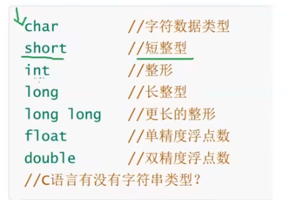

# c语言

> 特性：操作底层，尤其是内存地址的寻址及操作，指针的使用。
>
> 广泛用于底层开发，不需要任何运行环境支持便能运行的编程语言。
>
> 标准语法：
>
> - 美国国家标准局 ANSIC
> - 国际标准化组织、国际电工委员会 C11
> - 但后续的版本没有很好的支持，目前常用的是c89 / c90


- 流行的c语言编译器：

  - clang
  - GCc
  - msvc
  - vs2013 / vs2019  - 集成开发环境 -继承了msvc这样的编译器，可以编写+编译c代码

- 项目流程

  - 新建项目

  - 新建源文件  .c

    - 头文件  .h

  - 编写代码

    - 注意点：
      1. 一个工程只能有一个main函数
    - main 主函数（）

    ```c
    // c语言运行时，从main函数开始执行
    int main(){
        return 0;
    }
    
    // main函数传参:
    // argc: int类型的变量，标识命令终端传入的参数个数
    // argv：一个指针数组，用于保存每一个命令终端输入的参数
    int main(int argc, char *argv[]){
        printf("argc=%d\n",argc);
        for(int i=0;i<argc;i++){
            printf("argcv[%d]=%s\n",i,argv[i]);
        }
    
    }
    ```
    
    

#### 基础知识


##### ASCII码表

> 对于计算机而言，只能识别二进制数，也就是数字，对于非数值型数据，使用时需要用一个数值型数据进行标识，就称之为ASCII码表。

char 字符型 运算规则 遵循 ascii表规则

```c
char a='a';
scanf("%c",&a);
b=a-32;
// 当输入小写字母a,将输出对应的大写字母（ASCII表）

char ch1 = 'w';
printf("ch1 = %c %d\n, ch1, ch1");     // w 119
char ch2 = 97;
printf("ch2 = %c %d\n, ch2, ch2");	   // a 97
```


##### 快捷键

```shell
# 编译+链接库函数+运行代码
ctrl + f5    或
fn + ctrl + f5	或
菜单中 - 调试 - 开始执行不调试

#
```


##### c语言编译

> 预编译 -> 编译 -> 汇编 -> 链接

- 预编译：将.c中的头文件展开、宏展开，生成.i文件
- 编译：将预处理后的文件生成.s的汇编文件
- 汇编：生成.o的目标文件
- 链接：将.o文件链接成可执行文件

```c
gcc -E hello.c -o hello.i		// 预处理
gcc -S hello.i -o hello.s		// 编译
gcc -c hello.s -o hello.o		// 汇编
gcc hello.o -o hello_elf		// 链接
```

 


#### 格式化控制符

```c
// 区分不同进制数字的方法：在输出时带上特定的前缀。在格式化控制符中加上#即可输出前缀，

%#x		#
```

```c
\n   %d   %f   %lf	 %c	%ld	%u	%o	%x	%e	%s	%p
// \n  换行符
printf("输出内容\n");
// %d  整数
printf("%d",100);
// %f 单精度浮点型 带小数的数字
float a,b;
printf("%f%f",&a,&b);
// %lf 双精度浮点型 支持 单精度浮点型使用
double a,b;
printf("%lf%lf",&a,&b);
// %c  单个字符
printf("%c",'a');
// %ld	十进制long有符号整数
// %u	十进制无符号整数
// %o	以八进制表示的整数
// %x	以十六进制表示的整数
// %e	指数形式的浮点数
// %c	单个字符
// %s	字符串
// %p	指针的值


// %m.nf  指定浮点数的长度格式，不分单双精度
// m 总长度，值为正-前面加空格，值为负-后面加空格
// n 小数点后的位数，加0

// %nmd  宽度为m位的整数
// n取值为0或-，0表示如果不足m位时前面补0，-表示不足时后面补空格
// n值不存在时，默认为前面补空格

```


#### 关键字

```c
sizeof  struct	union	enum	signed	insigned	void
    
// struct - 用于定义结构体类型
// union - 与共用体（联合体）相关的关键字
// enum	- 与枚举类型相关的关键字
// signed -定义有符号数，表明定义的数据存在正负。例：signed int b=-6;
// insigned - 无符号
// void - 定义 空类型 的关键字。用于修饰函数的参数或者返回值，代表函数没有参数或没有返回值； 不能用来定义变量；
    
    
// void - 定义空类型的关键字。用于修饰函数的参数或者返回值；不能用来定义变量； 
void fun(void){}   // 该函数没有参数或没有返回值
```


##### 存储相关关键字

- `register`:寄存器变量修饰符 - 用register修饰的变量为寄存器变量
  - 特点：编译时告诉编译器此变量为寄存器变量，尽量将其存储空间分配在寄存器中。
  - 注意：
    1. 定义的变量不一定真的存放在寄存器中。
    2. cpu 取数据时将从寄存器中获取数据，比从内存获取数据更快
    3. 因为寄存器比较宝贵，所以不能定义寄存器数组
    4. register 只能修饰 字符型及整型，不能修饰浮点型
    5. 因为register修饰的变量可能存放在寄存器中，所以不能对寄存器变量取地址，只有存放在内存中的数据才有地址。
- `static`:可修饰为全局变量、局部变量、函数
  - 特点：static 修饰的变量存储在内存的静态空间
- `const`:常量的意思，修饰的变量是只读的，定义时赋初始值，且不能被修改
- `auto`:很少使用，`auto int a`等用于` int a`
- `extern`:外部的意思，一般用于函数和全局变量的声明

```cpp
register	static	const	auto	extern
    
//  register 
register int a;
int *p;
p=&a;		// 错误，a可能在寄存器中，没有地址
register float d;	// 错误，寄存器中不能存储浮点型数据

// const 常量，只读
const int a = 111;

// extern
```


##### 控制语句关键字

```c
if	else	break	continue	for	  while		do		switch	  case		goto	default

// 条件控制语句：
if
switch case default
// 循环控制语句：
for while do goto
// 辅助控制语句：
break continue
```


##### 基本数据类型



```c
// 计算集中的单位：
   1 bit比特位 - 1/8 byte字节 - 1/8/1024 kb - mb
// 1字节 == 8比特 == 8个二进制数
// 
// char 字符型数据   1字节大小
// short = short int 短整型  2
// int 整形  4
// long = long int 长整形  4
// long long 更长的整形  8
// float 单精度浮点数  4
// double 双精度浮点数  8

char ch = 'a';    // char字符类型
float weight = 55.3;	// 单精度浮点型


// 疑问解答：
    // 对于c语言标准规定，因此long可能等于int，因此对于不同设备可能得出不同的结果。
    sizeof(long)>=sizeof(int)
```


##### 构造类型

> 由若干个相同或不同类型数据构成的集合，例：int a[10]

```cpp
// 数组、结构体、共用体、枚举

```


##### include

- `#include <>`:用尖括号包含头文件，在系统指定的路径下找头文件
- `#include ""`:用双引号包含头文件，先在当前目录下找头文件，找不到时再到系统指定的路径下找。
- **注意**：
  1. include用来包含.h结尾的头文件，但不建议使用.c文件。因为include包含的文件会在预编译时被展开，当.c文件被包含，多次展开会导致函数重复定义。
  2. 预处理阶段只是对include等预处理操作进行处理并不会进行语法检查，即使这个阶段有语法错误也不会报错，第二个阶段即编译阶段才会进行语法检查。


##### define 宏定义

> 定义宏时使用define定义，**在编译阶段进行替换**，定义的宏即可在代码作用域范围内直接使用

- 分类
  - 不带参宏 `#define`
  - 带参数宏`#define S(a,b) a*b`
  - 终止宏定义的使用`#undef`
- 作用域
  - 从定义的位置到该文件的末尾，不支持跨文件
- 特点：
  - 带参宏被调用多少次就展开多少次，执行代码时没有函数调用的过程，不需要压栈弹栈；相当于**空间换时间**；相反带参函数有个函数调用的过程，压栈弹栈属于**时间换空间**
  - 带参函数的形参带有类型，带参宏的形参没有类型名
- 注意：
  1. 定义宏时，后面不需要带分号；
  2. 带参宏的形参没有类型名，**在预处理时进行替换**

```c
// 不带参宏
#define PI 3.14
int main(){
    printf("%d\n",PI);	// 3.14
    printf("%d\n",PI);	// 3.14
    return 0;
}

// 带参宏- 类似一个函数，可以将值传给对应表达式
#define S(a,b) a*b
int main(){
    printf("%d\n",S(3,2));	// 6
    return 0;
}

```


##### ifdef选择性编译

- 如果当前.c `#ifdef AAA`之前定义过AAA，就编译代码段1，斗则编译代码段2
- 注意和if else存在区别，通过条件选择编译的代码，只有一块代码会被编译；而if else两部分都会被编译

```c
#ifdef	#else	#endef
#ifndef
#if	#else	#endef


// 选择性编译
#ifdef AAA
	代码段1;	// 如果定义过AAA，则执行
#else
	代码段2;
#endif

// ifndef - 经常用在防止头文件重复包含
// 多文件编程中.h的第一行就是#ifndef，最后一行#endef
#ifndef BBB
	代码段1;	// 如果没有定义过BBB(_A_H)，则执行
#else
	代码段2;
#endif

// #if
#if 表达式
	代码段1;	// 如果表达式为真，则执行
#esle
	代码段2;	// 表达式为假时执行
#endef

```


##### 其他关键字

- `sizeof`:用来测变量、数组的占用存储空间的大小（字节数）
- `typeof`:重命名，定义新的类型名
  - 作用：给现有类型新增类型名，并不创造新的类型
- `volatile`:取内存中最新的值，但很少使用。
  - 告诉 cpu 每次使用volatile变量时，重新从内存中取值，确保使用最新的值，而不是用寄存器中的备份。

```cpp
sizeof	typedef	volatile

// sizeof()   计算字符串的长度
printf('%d',sizeof(char))    // 输出char类型的大小
    
// typedef	定义新的类型名：
typedef	short int INT16;
// 使用新的类型名定义变量
INT16 b;  等同于	short int b;

```


#### 语法

- 单双引号 规则
  - 单引号 表示 字符 'A'
  - 双引号 表示字符串 'abc'
  - 不能混用！！！！
- 标识符命名：
  - 只能以数字、字母、下划线命名，
  - 首字母不能为数字，不能使用关键字

- 其他：

```c
printf   scanf	putchar	getchar

// printf 输出、打印
printf("输出内容\n");

// scanf 输入
/*
	- 报错：对于较新的编译器，可能会提示不让使用
	- 解决办法：在源文件第一行加内容
	#define _CRT_SECURE_NO_WARNINGS 1
	或
	使用 scanf_s()	
*/
int a;
scanf("%d%d" , &a, &b);  // 将输入的值，分别存放在变量a、b对应的位置

// putchar 输出/打印一个字符，类似printf
// getchar 输入/键入一个字符，类似scanf
char a;
a = getchar();  // 输入的字符赋值给a
putchar(a);     // 输出字符a
```


##### 变量与常量

- 变量：
  - 定义方式：
    - 存储类型 数据类型 变量名；
    - 存储类型 数据类型 变量名 = 变量或常量；
  - 注意：变量的定义应满足 标识符的命名规则


```sh
# 整型数据
## （按进制分）
十进制：以正常数字1-9开头，如456 789
八进制：以数字0开头，如0123
十六进制：以0x开头，如0x1e


# 实型数据（浮点型）

## 实型常量：实数 或 浮点数
### 十进制：由数字和小数点组成 1.12
### 指数型：123e3代表123*10的三次方
### 不以f结尾的常量是double类型
### 以f结尾的常量（如3.14f）是float类型

## 实型变量
### 单精度：float占4字节，7位有效数字，指数-37到38
### 双精度：double占8字节，16位有效数字，指数-307到308
```


##### 类型转换

- 自动转换

  - 占用内存字节数较小的类型向 占用内存更大的类型转换时，自动转换
  - 规则：
    1. 表达式中出现`char	short	int`中的一种或多种，没有其他类型参与运算时，全部转化为`int类型`进行运算，结果也是int类型
    2. 当出现小数点级别的运算，全部转化为double类型，结果也为double类型
    3. 当无符号数和有符号数运算时，转为无符号数参加运算，结果为无符号数。

- 强制转换
  - 通过类型转换运算来实现，将表达式的运算结果强制转换成类型说明符所表示的类型
  - `(类型说明符)(表达式)`


```c
// 自动转换：
printf("%d\n",5/2);		// int  2
printf("%lf\n",5.0/2);	// int -> float	2.5

int a=-8;
unsigned int b=7;
printf("%d\n",a+b);		// -1
if(a+b>0){
    // 会进入这里
    printf("%u\n", a + b);	// 4294967295
}


注解：
在C语言中，将一个带符号整数和一个无符号整数进行运算时，会将带符号整数转换为无符号整数。在这种情况下，-8会被转换为一个大于等于2^32的正整数，并与7进行相加。结果将取决于机器的字长。

如果机器是32位的，那么转换后的-8将变成4294967288（2^32 - 8），然后与7相加得到4294967295。最终的输出结果将是4294967295。

如果机器是64位的，那么转换后的-8将变成18446744073709551608（2^64 - 8），然后与7相加得到18446744073709551615。最终的输出结果将是18446744073709551615。
    

// 强制转换：
(float)a;	// 把a的值转化为float类型
(int)(x+y);	// 把x+y的值转化为int类型

int x=10;
int y=4;
float w;
w = (float)x / (float)y;
printf("w = %f\n", w);
```


##### 运算符

- 位运算符
  - `& 与运算`: 遇0得0，遇1不变
  
  - `|或算`：有1变1，00不变
  
  - `~取反运算`：1变0，0变1
  
  - `^异或运算`：相异得1，相同得0
  
  - `>>右位移`:
    
    > 在一个编译系统，到底是算数右移还是逻辑右移，取决于编译器自身。
    
    - 逻辑右移、第一位的符号位不变，从左往右移动低位溢出、高位补0
    - 算数右移、对有符号数来说、第一位的符号位不变，低位溢出、高位补符号位
    
  - `<<左位移`：
    - 

```c++
// 算数运算符
+	-	*	/	%	+=	-=	*=	/=	%=
// 自增自减运算符。放后面-先使用-后自变
++	--
// 关系运算符
>	<	==	>=	<=	!=
// 逻辑运算符
&&	||	！
// 条件运算符/三元运算符
a?b:c
// 逗号运算符	(... , ... , ...)
D = (A,B,C)	// 表达式A、B、C依次运行，最后变量D的值为表达式C的值
int a=10, b=20,c;
c=(a+=10,b+=10,a+=b);  // 最终结果c=50，a=50，b=30

// 位运算符
10011100 ^ 01011010 = 11000110	// 异或运算
01011010 >>3 = 00001011		// 逻辑右移
10101101 >>3 = 11110101    // 算数右移
01010011 >>3 = 00001010    // 算数右移
    
// 判断右移是逻辑右移还是算数右移
#include <stdio.h>
int main(){
    printf("%d\n",-1>>3);	// 如果输出-1，则是算数右移，否则逻辑右移
    return 0;
}


```


##### 控制语句

```c
// if else
if(){}
if(){}else{}
if(){}else if{}else{}

// switch
// break-用于跳出当前switch语句
switch(表达式){
	case 常量表达式1;
        语句1;
        break;
	case 常量表达式2;
        语句2;
        break;
     ...
     default: 语句n; break;
}

// for 循环控制
for(int i=0;i<10;i++){}
// while-判断后执行
while(条件表达式){...}
// do{...}wihle(条件表达式); - 先执行，后判断
do{...}wihle();

// goto循环-主要用于在一个函数里实现代码的跳转
// 执行结果:111222333
int main(){
    printf("111");
    goto NEXT;
    printf("000");	// 因为上一句goto，导致跳过该句
    NEXT:
    	printf("222");	
    	printf("333");
    return 0;
}
```


##### 数组

27-35


##### 函数

36-41

- 定义函数：`返回值类型	函数名(形参列表){ ... }`
  - 注意点：
    1. 函数返回值的类型必须与函数名前设置的返回值类型一致/强类型转换。
    2. 形参必须带类型，并用逗号分隔。
    3. 函数的定义是不能嵌套的，必须是平行的。

- 分类
  - 从定义角度
    - 库函数（C语言库实现的）
    - 自定义函数
    - 系统调用（操作系统实现的函数）
  - 从参数角度分类
    - 有/无参数，无参函数在参数位置写 void或什么都不写
  - 从返回值角度分类
    - 带返回值，
      - 定义函数时可以在函数前加函数返回值类型
      - 不定义返回值类型时，默认为整型 int
    - 没有返回值的函数，在定义时在函数名前加 void，函数中可以不写return;

```c
// 有参函数，且函数返回值类型为 char
char fun(int a,float b){ ...; return 'a';}

// 无参数的函数
fun(void){}

// 无返回值函数
void fun(){
    return; // 可写可不写
}
```


###### 函数的声明

> 函数的定义只能出现一次，但函数的声明可以有多次；由于代码从上向下执行，当函数没有提前声明时，可能会导致编译时报错，不认识这个函数。

- 需要函数声明的情况

  1. 被调函数在 主函数代码之后
  2. 主调用函数和被调用函数不在同一个文件中
  
- 声明方法

  - 直接声明法 - 将被调用函数的第一行直接复制
  - 间接声明法 - 将函数的声明放在头文件中，.c程序包含头文件即可

  ```c
  // 声明方法
  // 1.直接声明法-将被调用函数的第一行直接复制，往前写
  int fun1();
  void fun(){
      fun1();
  }
  
  // 2.间接声明法-将函数的声明放在头文件中，.c程序包含头文件即可
  // 例子：在a.c文件中
  #include "a.h"	// 引入对应函数声明的头文件
  int main(){}
  void fun(){}
  // 在 a.h中
  extern void fun();
  ```


###### 函数的传参方式

> 可以给函数传递整型、字符型、浮点型数据，也可以传递一个指针，地址

- 复制传参 -- 传输值
  - 将实参的值传递给形参，无论形参怎么变，与实参的值无关
- 地址传参
  - 将地址作为参数传递，实参根据形参的变化而变化
  - 传递**数组**
    - 给函数传递数组时，无法将数据内容整体传递，而时通过数组首地址进行传递

- 全局传参（几乎用不到）

```c
// 地址传参
void fun(int *p, int*q){
    int temp = *p;	// *取值
    *p = *q;
    *q = temp;
}

int main(){
    int a=1,b=2;
    fun(&a,&b);
    printf("a=%d b=%d",a,b);	// a=2 b=1
}

// 注意：地址传参，不是传地址就是地址传参，看具体情况
// 案例分析：fun1中改变的是局部变量p，而不是指针变量p的**p指针变量的地址
void fun1(char *p){
    p="hello";
}
void main(){
    char *p="abc";
    fun1(p);
    printf("%c",p);	// 结果： abc，并没有发生变化
}


// 传递一维数组
void fun2(int *p){
    printf("%d 等价于 %d\n",p[2],*(p+3));
}
// 传递二维数组
// 形式1：void fun2( int (*p)[4] ){
void fun2(int *p[][4]){			// 形式2
    printf("%d 等价于 %d\n", p[0][2], *(*(p+1)+2);
}
```


##### 指针


###### 关于内存

> 存储器：存储数据的器件
>
> - 外存：长期存储数据，掉电不丢失数据（硬盘、光盘、U盘、磁带、rom）
> - 内存：暂时存放数据，掉电丢失数据（ram、DDR）
>   - 物理内存：实实在在的存储设备
>   - 虚拟内存：操作系统虚拟出来的内存，当一个进程被创建时，或程序运行的时候都会分配虚拟内存，虚拟内存和物理内存之间存在映射关系。
>
> 内存以字节为单位来存储数据，可将程序中的虚拟寻址空间，看作一个很大的一维字符数组


###### 指针概念

- 操作系统给每个存储单元分配了单独的编号，称之为地址，即**指针**。
- 指针变量：用来存放一个地址编号的变量
- 无论什么类型的地址，都是存储单元的编号，在32位平台下都是`4字节=32bit`


###### 定义指针变量

- 注意：
  1. 同时定义多个指针变量时，每个指针变量都需要使用*p来修饰。`int *p, *q;`
  1. 对应类型的指针，只能保存对应类型数据的地址，期望不同类型指针相互赋值时需要强制类型转换

```c
// 简单的指针
数据类型 * 指针变量名;
int *p;	// 定义指针变量p
// 定义指针变量时，* 号用来修饰变量，表明为指针变量

// 关于指针的运算
& 取地址		* 取值

// 例：
int a=0x0000234f;
int *p;		// 定义指针变量时
p = &a;		// 把a的地址赋值给p，而不是a的值
printf("a=%d %d\n",a,*p);	// 100 100
printf("&a=%d %d\n",&p,p);	// 0029FEA8 0029FEA8
```


```c
// 练习题：
#include <stdio.h>
int main(int argc, char *argv[]){
    int a=0x1234,b=0x5678;
    char *p1，*p2;
    printf("%#x %#x\n",a,b);
    p1=(char *)&a;
    p2=(char *)&b;
    printf("%#x %#x\n",*p1,*p2);
    p1++;
    p2++;
    printf("%#x %#x\n",*p1,*p2);
    return 0;
}

// 结果：
0x1234	0x5678
0x34	0x78
0x12	0x56
    
/* 
*+指针，取值由指针类型决定，
	指针为字符指针则取一个字节，为整形指针则取4个字节，
	指针为double型指针则取8个字节。

/* 
指针++，指向下个对应类型的数据
    字符指针++，指向下个字符数据，指针存放的地址编号加1
    整形指针++，指向下个整形数据，指针存放的地址编号加4
*/
```


###### 指针与数组

- c语言中规定，数组的名字==数组的首地址，即第0个元素的地址，是个常量。
- 数组名是个常量，不能给数组名赋值；

```c
// 例：
#include<stdio.h>
int main(int argc,char *argv[]){
    int a[10];
    int *p;
    p=a;
    *(p+2)=100;		// 相当于 a[2]=100
    return 0;
}
```


###### 指针的运算

- 指针可以加一个整数，往下指几个它指向的变量，结果还是个地址

  > 前提：指针指向数组时，加整数才有意义

- 两个相同类型的指针可以比较大小

  > 前提：只有两个**相同类型的指针**指向同一个数组的元素，比较大小才有意义，指向前面元素的指针 **小于** 指向后面元素的指针

- 两个相同类型的指针可以做减法，计算数组的两个指针中间有几个元素

- 两个相同类型的指针可以相互赋值（void * 类型的除外）

  > 不同类型的指针想要相互赋值，必须进行强制转换

```c
int a[10];
int *p,*q;
p=a;
q=a;
q+=2;		// 假设q保存的地址为200，则q+2之后的地址编号为208
*(p+2)=100;		// 相当于 a[2]=100
return 0;

// 相同类型指针相互赋值
int *p,*q,a;
p=&a;
q=p;
```


###### 指针数组

> 指针数组，本身是个数组，由若干个相同类型的指针变量构成的集合。

- 指针数组的定义方法：`类型说明符 * 数组名[元素个数];`

- 特点：

  1. 每个元素都是`int *`类型的变量，用来保存地址

  ```c
  // 类型说明符 * 数组名[元素个数];
  int *p[10];		// 定义整形的指针数组p，有10个元素p[0]~p[9]
  
  // 例：
  int a, *p[10];
  p[1]=&a;
  int b[10];
  p[2]=&b[3];		// p[2]和*(p+2)是等价的
  
  // 大多数情况下，指针数组都用来保存多个字符串
  char *name[5] = {"follw me","basic","good"}
  int i;
  for(i=0;i<3;i++){
      printf("&s\n",name[i]);	// "follw me" "basic" "good"
  }
  ```


###### 指针的指针

> 指针的指针，即指针所存放的地址。

```c
int a=0x1234;
int *p=&a;
int **p = &p;
int ***temp = &q;

// 示例：
int a, *p, **q;
p=&a;
q=&p;
**q === *p === a;
// p q 都是指针变量，都占4个字符，用来存放地址编号，只不过类型不一样

```


###### 字符与数组

- 概念：字符串就是以`\0`结尾的若干字符的集合
- 字符串的存储形式：数组、字符串指针、堆
- 总结：
  1. **字符数组**：
     - 在内存（栈、静态全局区）中开辟了一段空间存放字符串
     - 在栈和全局区内存中的内容是可修改的
  2. **字符串指针**：在文字常量区开辟了一段空间存放字符串，将字符串的首地址给str
     - 存放在文字常量区的内容不可修改
  3. **堆**：使用malloc函数在堆区申请空间，将字符串拷贝到堆区
     - 堆区内容可修改

```c
// 字符数组 - 可修改
// 定义字符数组string，
char str[100] = "I love C!";
str[0]='y';		// 在栈和全局区内存中的内容是可修改的

// 字符串指针 - 不可修改
// 定义了一个指针变量str，只能存放字符地址编号
// str中只存放了字符I的地址编号，"I love C!"存放在文字常量区
char *str = "I love C!";
*str = 'y';  // 报错！！！，不可修改


// 堆 - 可修改
// 动态申请 10个字节的存储空间，首地址赋值给str
char *str = (char*)malloc(10*sizeof(char));
// 将字符串"I love C!"拷贝到str执向的内存里
strcpy(str,"I love C!");


```


###### 数组指针

> 数组指针本身是个指针，指向一个数组，加1指向下一个数组，用来保存多维数组的首地址。

- 定义数组指针`指向的数组类型 (*指针变量名)[指向数组的元素个数];`

```c
int(*p)[5];	// 定义数组指针变量p，指向整形的有5个元素的数组
// p+1往下指5个整形，跳过一个有5个整形元素的数组
    
int a[3][5];
int(*p)[5];
printf("a=%p\n",a);	// 第0行的行地址
printf("a+1=%p\n",a+1);	// 第1行的行地址，a和a+1差20个字节
p=a;
printf("p=%p\n",p);	// 第0行的行地址
printf("p+1=%p\n",p+1);	// 第1行的行地址，a和a+1差20个字节

// 结果：a===p	a+1===p+1
```


###### 多维数组指针

- n维数组指针，加1后指向下个n维数组

- 二维数组的数组名降价问题：
- 


###### 指针函数

> 本质是函数，特点是：函数的返回值为指针类型


###### 函数指针

> 本质是指针，保存函数的地址。c语言中规定，函数的名字就是函数的首地址；可定义指针变量存放函数的地址。
>
> - 使用场景1：回调函数使用

```c
// 函数指针
int max(int a, int b){...}
int main(){
    int num;
    int (*p)(int,int);	// 定义函数指针
    p=max;		// 给函数指针赋值
    num=p(3,5);	//调用函数指针，等同于调用函数
}

// 回调函数使用
int dive(int a, int b){...}
int mux(int a, int b){...}
int proccess(int (*p)(int,int),int a,int b){
    int ret = (*p)(a,b);
    return ret;
}
// 调用使用
proccess(dive,1,2);
proccess(mux,2,3);
```


###### 特殊指针

- 空类型指针（void *）

  - 对应类型的指针只能存放对应类型的数据的地址

  - `void *`是通用指针，任何类型的指针都可以给void *类型的指针变量赋值

    ​	`int *p;		void *q;	q=p;` // 可行

- 空指针（）

  - `char *p = NULL;`
  - 一般NULL用在给指针初始化


##### 总结数组、指针

- 指针数组- 本质是个数组，每个元素为指针元素

- 数组指针- 本质是指针，指向某个数组，加1跳向下一个数组

- 指针的指针- 本质是指针，指向指针的地址

- 数组名字，相当于数组指针，指向数组的首地址，加1跳向下一个数组

- 数组名、指针变量 区别：

  

  


##### 结构体

89-98


##### 链表

99-110


#### 作用域

- 局部变量

  - 声明及作用域：`{}`内部

- 全局变量

  - 声明：在main函数外部

  - 作用域：整个工程下的所有源文件都可使用

    ```c
    // a.c
    // main.c
    
    ```

    

- 问题：

  - 命名冲突时，局部有限，就近原则？


### 内存的分区

> 内存分为：物理内存和虚拟内存，操作系统会在物理内存和虚拟内存之间做映射。
>
> 在32位系统下，每个进程的寻址范围是4G，`0x00000000 ~ 0xffffffff`

- 虚拟内存分区
  - 堆：在动态申请内存的时候，在堆里开辟内存
  - 栈：主要存放局部变量
  - 静态全局区：
    - 未初始化的静态全局区
      - 静态变量（定义变量的时候，前面加**static修饰**），或全局变量，没有初始化的，存在此区
    - 初始化的静态全局区
      - 全局变量、静态变量，赋过初值的存放在此区
  - 代码区：存放程序代码
  - 文字常量区：存放常量


##### 函数与变量分类

- 普通的全局变量
  - 概念：在函数外部定义的变量
  - 生命周期/作用范围：
    - 程序运行的整个过程，在程序的所有地方可用
    - 使用之前需要先声明，声明时不要赋值，声明方法 `extern int num;`
- 静态全局变量   static
  - 概念：定义全局变量的时候，前面用 static 修饰
  - 生命周期/作用范围：
    - static 限定了静态全局变量的作用范围，只能在它定义的.c(源文件)中有效
    - 在程序运行的整个过程中，一直存在
  - 注意：定义静态全局变量大的时候，如果不赋值，它的默认值为0
- 普通的局部变量
  - 概念：在函数内部 / 复合语句中定义的变量
  - 生命周期/作用范围：
    - 在函数中定义的变量，在函数中有效
    - 在符合语句中定义的，在复合语句中有效，`{ }`
    - 在函数调用之前，局部变量不占用空间，调用函数时才为局部变量开辟空间，函数结束后局部变量就被释放。
- 静态的局部变量    static
  - 概念：定义局部变量的时候，前面加 static 修饰
  - 生命周期/作用范围：
    - 在它定义的函数或复合语句中有效
    - 第一次调用函数的时候，开辟空间赋值，函数结束后不释放，以后再调用函数的时候，就不再为其开辟空间，也不赋初值，用上次使用过的变量。
- 外部函数
  - 概念：定义的普通函数，都是外部函数，即函数可以在程序中的任何一个文件中调用
  - 在分文件编译中，只需将函数的实现过程写在.c文件中，然后将其声明写在指定的.h文件，其他文件只要包含了对应头文件，就可以使用外部函数
-  内部函数
  - 在定义函数时，返回值类型前加`static`修饰，被称为内部函数
  - 作用域：static 限定了函数的作用范围，仅在定义的.c中有效

```c
int num = 100; // num就是一个全局变量
static int num = 100; // num就是一个静态全局变量，默认值为0
if(1){ int a=10; }	// 复合语句中的变量为局部变量

// 静态局部变量
void fun(){
    static int num = 3;
    num++;
    printf("num=%d\n",num);
}
void main(){
    fun();		// 输出 num=4
    fun();		// num=5
    fun();		// num=6
}

// 内部函数 -仅在当前.c文件中可用
static int fun(){
    ...
}

```


##### 内存动态分配

> **动态分配内存概念：**在数组中，数组的长度是提前定义、固定不变的。但实际使用中所需内存取决于实际输入的数据，无法预先确定。因此c语言提供**内存管理函数**，可按需动态分配内存空间，也可对已分配空间回收再利用。


- 静态分配
  1. 在程序编译或运行时，按事先规定大小分配内存空间的分配方式。
  2. 必须事先知道所需空间的大小。
  3. 分配在栈区或全局变量区，一般以数组的形式。
  4. 按计划分配。
- 动态分配
  1. 在程序运行过程中，根据需要大小自由分配所需空间
  2. 按需分配
  3. 分配在堆区，一般使用特定的函数进行分配


###### malloc 申请单块

> 在内存的动态存储区（堆）中分配一块大小为size字节大的连续区域，用来存放类型说明符指定的类型。

- 函数定义：`void *malloc(unsigned int size);`
- 返回值：
  - 成功：分配空间的起始地址
  - 失败：NULL
- 注意点：
  1. 在调用malloc之后，需要判断是否申请成功
  2. 如果多次malloc申请的内存，第1次和第2次申请的内存不一定是连续的
  3. 由于不确定空间用于做什么，所以返回值本身为void *，在调用函数时需根据接收者的类型对其进行强制类型转换。


###### free 释放内存

> free函数释放ptr指向的内存空间，无 返回值
>
> **野指针**：被free释放后，原指针依旧指向原先动态申请的内存，但不能继续使用，原指针成为野指针，一般释放后赋值为NUlL。

- 函数定义：`void free(*ptr)`
- 注意：
  - free函数只能释放`malloc calloc relloc `动态申请的内存
  - 只能释放堆区的空间，其他区域的空间无法释放
  - 一块动态申请的内存只能free一次，不能多次free


###### calloc 申请多块

> 在内存的堆中，申请nmemb块，每块大小为size个字节大的连续区域

- 函数定义：`void * calloc(size_t nmemb, size_t size);`
- 返回值：
  - 成功：分配空间的起始地址
  - 失败：NULL
- 注意：
  - malloc 申请的内存，其中存放的内容是随机的，不确定
  - calloc 申请的内存中内容为 0，


###### realloc 扩缩内存


###### 76-78


```c
// 头文件  #include<stdlib.h>
#include<stdio.h>
#include<stdlib.h>

char *fun(){
    char *str = (char *)malloc(100 * sizeof(char));	// malloc申请内存
    str[0]='h';
    return str;
}
void main(){
    char *p;
    p = fun();
    printf("p=%s\n","p");
    free(p);	// 释放申请的p内存
    p = NULL;	// 防止p成为野指针，赋值为NULL
}
```


### 内置函数/方法

#### Memset

- `void * memset(void *s, int c, size_t n);`
- 功能：将s指向的内存前n个字节，全部赋值为c。
- 返回值：s指向的内存的首地址，可能是不同类型的地址，所以返回值也得是通用指针


#### 字符串相关

79-87


##### 文件操作

111-122

