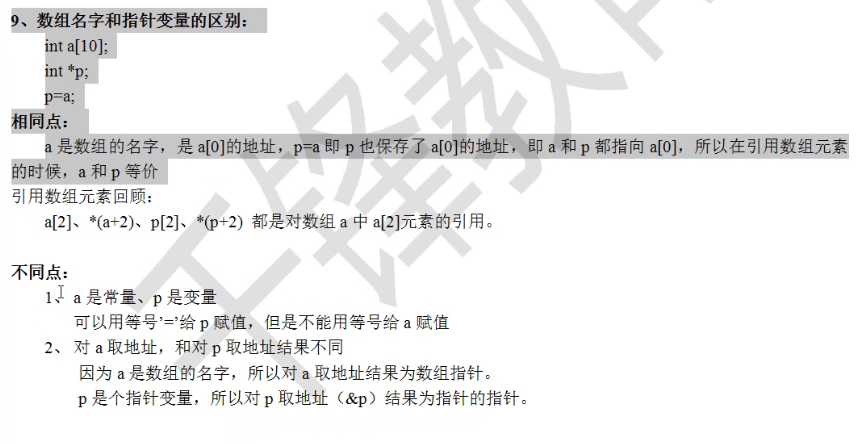

# c语言

> - 特性：操作底层，尤其是内存地址的寻址及操作，指针的使用。
>- 广泛用于底层开发，不需要任何运行环境支持便能运行的编程语言。

- 新建项目、新建文件

  - 源文件  .c
  - 头文件  .h

- 注意点：1个工程只有1个 `main() 主函数`

  ```c
  // c语言运行时，从main函数开始执行
  int main(){
      return 0;
  }
  
  // main函数传参:
  // argc: int类型的变量，标识命令终端传入的参数个数
  // argv：一个指针数组，用于保存每一个命令终端输入的参数
  int main(int argc, char *argv[]){
      printf("argc=%d\n",argc);
      for(int i=0;i<argc;i++){
          printf("argcv[%d]=%s\n",i,argv[i]);
      }
  
  }
  ```


### 基础知识

#### 计算机存储规则

- 文本 - 二进制 + 不同的码表，例如 ASCII 、GDK、Unicode等
- 图片
  - 像素：组成图片的小方格，屏幕显示的最小单元格
  - 分辨率：像素方格的总数
  - 光学三元色：RGB红绿蓝，通过三元色搭配形成色彩
- 声音
  - 采样：记录当前时间点的音频数据，形成采样波形图
  - 采样频率：一般`44.1kHz`，44100次/秒
  - 每个采样点都可转换为二进制数据


#### ASCII码表

> 计算机只能识别二进制，也就是数字，对于非数值型数据需用数值型数据进行标识转换，例如 ASCII码表。

char 字符型 运算规则 遵循 ascii表规则

```c
char a='a';
scanf("%c",&a);
b=a-32;
// 当输入小写字母a,将输出对应的大写字母（ASCII表）

char ch1 = 'w';
printf("ch1 = %c %d\n, ch1, ch1");     // w 119
char ch2 = 97;
printf("ch2 = %c %d\n, ch2, ch2");	   // a 97
```


#### c语言编译

> 预编译 -> 编译 -> 汇编 -> 链接

- 预编译：将.c 中的`头文件\宏`展开，生成`.i`文件
- 编译：将预处理后的文件生成`.s`汇编文件
- 汇编：生成`.o`目标文件
- 链接：将`.o`文件链接成可执行文件

```c
gcc -E hello.c -o hello.i		// 预处理
gcc -S hello.i -o hello.s		// 编译
gcc -c hello.s -o hello.o		// 汇编
gcc hello.o -o hello_elf		// 链接
```

 


#### 关键字

- 存储相关关键字
  - `const`:常量的意思，修饰的变量是只读的，定义时赋初始值，且不能被修改
  - `static`:可修饰为全局变量、局部变量、函数
    - 特点：static 修饰的变量存储在内存的静态空间
  - `auto`:很少使用，`auto int a`等用于` int a`
  - `extern`:外部的意思，一般用于函数和全局变量的声明
  - `register`:寄存器变量修饰符 - 用register修饰的变量为寄存器变量
    - 特点：编译时告诉编译器此变量为寄存器变量，尽量将其存储空间分配在寄存器中。
    - 注意：
      1. 定义的变量不一定真的存放在寄存器中。
      2. cpu 取数据时将从寄存器中获取数据，比从内存获取数据更快
      3. 因为寄存器比较宝贵，所以不能定义寄存器数组
      4. register 只能修饰 字符型及整型，不能修饰浮点型
      5. 因为register修饰的变量可能存放在寄存器中，所以不能对寄存器变量取地址，只有存放在内存中的数据才有地址。
- 其他关键字
  - `sizeof`:用来测变量、数组的占用存储空间的大小（字节数）
  - `typeof`:重命名，定义新的类型名
  - 作用：给现有类型新增类型名，并不创造新的类型
  - `volatile`:取内存中最新的值，但很少使用。
    - 使 cpu 每次使用volatile变量时，重新从内存中取值，确保使用最新的值，而不是用寄存器中的备份


```c
/* 类型 */
// struct - 用于定义结构体类型
// union - 与共用体（联合体）相关的关键字
// enum	- 与枚举类型相关的关键字
// signed -定义有符号数，表明定义的数据存在正负。例：signed int b=-6;
// insigned - 无符号
// void - 定义 空类型 的关键字。用于修饰函数的参数或者返回值，代表函数没有参数或没有返回值； 不能用来定义变量；

// void - 定义空类型的关键字。用于修饰函数的参数或者返回值；不能用来定义变量； 
void fun(void){}   // 该函数没有参数或没有返回值
```

```cpp
/* 存储相关 */
//  register 
register int a;
int *p;
p=&a;		// 错误，a可能在寄存器中，没有地址
register float d;	// 错误，寄存器中不能存储浮点型数据

// const 常量，只读
const int a = 111;

// extern
// static	
// auto
```

```c
// 条件控制语句：
if else
switch case default
break
// 循环控制语句：
for while do goto
// 辅助控制语句：
break continue

// sizeof()   计算字符串的长度
printf('%d',sizeof(char))    // 输出char类型的大小
printf('%zu',sizeof(char))   // %zu 与 %d 在sizeof时使用一致，据说%zu更好
    
// typedef	定义新的类型名：
typedef	short int INT16;
// 使用新的类型名定义变量
INT16 b;  等同于	short int b;

// 其他    
volatile
```


##### include

- `#include <>`:用尖括号包含头文件，在系统指定的路径下找头文件
- `#include ""`:用双引号包含头文件，先在当前目录下找头文件，找不到时再到系统指定的路径下找。
- **注意**：
  1. include用来包含.h结尾的头文件，但不建议使用.c文件。因为include包含的文件会在预编译时被展开，当.c文件被包含，多次展开会导致函数重复定义。
  2. 预处理阶段只是对include等预处理操作进行处理并不会进行语法检查，即使这个阶段有语法错误也不会报错，第二个阶段即编译阶段才会进行语法检查。预处理:需要使用的东西

```c
#include <stdio.h> 头文件，即调用需要的函数库-stdio标准输入输出
```


##### 宏定义define

> 定义宏时使用define定义，**在编译阶段进行替换**，定义的宏即可在代码作用域范围内直接使用

- 分类
  - 不带参宏 `#define`
  - 带参数宏`#define S(a,b) a*b`
  - 终止宏定义的使用`#undef`
- 作用域
  - 从定义的位置到该文件的末尾，不支持跨文件
- 特点：
  - 带参宏被调用多少次就展开多少次，执行代码时没有函数调用的过程，不需要压栈弹栈；相当于**空间换时间**；相反带参函数有个函数调用的过程，压栈弹栈属于**时间换空间**
  - 带参函数的形参带有类型，带参宏的形参没有类型名
- 注意：
  1. 定义宏时，后面不需要带分号；
  2. 带参宏的形参没有类型名，**在预处理时进行替换**

```c
// 不带参宏
#define PI 3.14
int main(){
    printf("%d\n",PI);	// 3.14
    printf("%d\n",PI);	// 3.14
    return 0;
}

// 带参宏- 类似一个函数，可以将值传给对应表达式
#define S(a,b) a*b
int main(){
    printf("%d\n",S(3,2));	// 6
    return 0;
}

```


##### 选择编译ifdef

- 如果当前.c `#ifdef AAA`之前定义过AAA，就编译代码段1，斗则编译代码段2
- 注意和if else存在区别，通过条件选择编译的代码，只有一块代码会被编译；而if else两部分都会被编译

```c
#ifdef	#else	#endef
#ifndef
#if	#else	#endef


// 选择性编译
#ifdef AAA
	代码段1;	// 如果定义过AAA，则执行
#else
	代码段2;
#endif

// ifndef - 经常用在防止头文件重复包含
// 多文件编程中.h的第一行就是#ifndef，最后一行#endef
#ifndef BBB
	代码段1;	// 如果没有定义过BBB(_A_H)，则执行
#else
	代码段2;
#endif

// #if
#if 表达式
	代码段1;	// 如果表达式为真，则执行
#esle
	代码段2;	// 表达式为假时执行
#endef

```


#### 基本语法

- 单双引号 规则
  - 单引号 表示 字符 'A'
  - 双引号 表示字符串 'abc'
  - 不能混用！！！！
- 其他

```c
printf   scanf	putchar	getchar

// printf 输出、打印
printf("输出内容\n");

// scanf 输入
/*
	- 报错：对于较新的编译器，可能会提示不让使用
	- 解决办法：在源文件第一行加内容
	#define _CRT_SECURE_NO_WARNINGS 1
	或
	使用 scanf_s()	
*/
int a;
scanf("%d%d" , &a, &b);  // 将输入的值，分别存放在变量a、b对应的位置

// putchar 输出/打印一个字符，类似printf
// getchar 输入/键入一个字符，类似scanf
char a;
a = getchar();  // 输入的字符赋值给a
putchar(a);     // 输出字符a

```


#### 格式控制符

```c
// printf 控制输出的语句，第一个参数为要输出的字符串，可通过插入格式控制符，再传参。

\n   %d   %f   %lf	 %c	%ld	%u	%o	%x	%e	%s	%p \t
// \n  换行符 => c语言会针对在不同的操作系统中会进行转化，统一为换行
printf("输出内容\n");
// \r  回到行首，回到这一行的开始位置
printf("输出内容\r");
// \t 制表符 长度可变大的空格，根据内容自动补空格，让长度保持 8 的倍数，最少补1个，最多补8个

// %d  整型
printf("%d",100);
// %f 实型，单精度浮点型 带小数的数字
float a,b;
printf("%f%f",&a,&b);
// %lf 双精度浮点型 支持 单精度浮点型使用
double a,b;
printf("%lf%lf",&a,&b);
// %c  字符型，单个字符
printf("%c",'a');
// %s	字符串
char str[4]='aaa'
printf('%s',str); // 输出aaa

// %ld	十进制long有符号整数
// %u	十进制无符号整数
// %o	以八进制表示的整数
// %x	以十六进制表示的整数
// %e	指数形式的浮点数
// %p	指针的地址位置


// %m.nf  指定浮点数的长度格式，不分单双精度
// m 总长度，值为正-前面加空格，值为负-后面加空格
// n 小数点后的位数，加0

// %nmd  宽度为m位的整数
// n取值为0或-，0表示如果不足m位时前面补0，-表示不足时后面补空格
// n值不存在时，默认为前面补空格


// 区分不同进制数字的方法：在输出时带上特定的前缀。在格式化控制符中加上#即可输出前缀，
%#x		#
```


#### 变量与常量

- 标识符
  - 由数字、字母、下划线组成
  - 不能以数字开头，不能使用关键字
  - 区分大小写
- 常量
  - 
- 变量：
  - 定义方式：
    - `[存储类型] 数据类型 变量名;`
    - `[存储类型] 数据类型 变量名 = 变量或常量;`
    - 存储类型可省略，默认为`auto`
  - 提示
    - 一条语句可定义多个变量、使用前需要赋值
    - 变量作用域范围内不允许重复定义


#### 进制数

```c
// 二进制 0 1, 代码中以 0b 开头
0b001
// 十进制，无需前缀
// 八进制，0~7，代码中以 0 开头
01
// 十六进制，0~9 a-f，代码中以 0x 开头
0x12   === 18
```


#### 数据类型

- 作用
  - 决定变量存储的数据类型
  - 决定存储空间的大小
  - 大小遵循：`short <= int <= long <= long long < float < double`
- 整数类型：`short、int、long、long long`   默认 int
  - signed -定义有符号数，表明定义的数据存在正负。例 `signed int b = -6;`
  - insigned - 无符号
  - 不同数据类型所表示范围和内存大小都不一样，由编译器决定，可用sizeof确定；
  - longlong c99版本新增，超长整型
- 实型数据/浮点型/小数：`float、double、long double` 默认  double
  - 小数的取值范围比整数都大
  - 默认为double类型无后缀，float类型常量以`f`结尾`3.14f`
  - 不能与unsigned 无符号关键字组合

```c
/* 整型 */
// short = short int 短整型  2
// int 整型  4
// long = long int 长整型  4
// long long 更长的整形  8

/* 实型 */
// float 单精度浮点数  4字节，指数从-37到38（精确到小数点后6位）
// double 双精度浮点数  8字节，指数-307到308（精确到小数点后15位）
// long double 高精度小数

/* 字符 */
// char 字符型数据   1byte = 32bit 32个二进制数据

// 计算集中的单位：
   1 bit比特位 - 1/8 byte字节 - 1/8/1024 kb - mb
// 1字节 == 8比特 == 8个二进制数
       
short a = 10;
int b = 100;
long c = 1000L;
long long d = 10000LL;
signed int b = -6; // 有符号整数
unsigned int b = -6; // 无符号整数
printf('%d,%d,%ld,%lld',a,b,c,d);


// 指数型：123e3代表123*10的三次方
float weight = 55.3F;
double n = 3.1415926
printf('%.2f,%.2lf',weight,n); // %.2f 表示保留两位小数   - 55.30 3.14

char ch = 'a';    // char字符类型
 
// 疑问解答：
    // 对于c语言标准规定，因此long可能等于int，因此对于不同设备可能得出不同的结果。
    sizeof(long)>=sizeof(int)
    

```


##### 类型转换

- 自动转换：内存字节占用较小的类型自动 向 占用内存更大的类型转换
  - 表达式中出现`char	short	int`中的一种或多种，隐士转化为`int类型`，结果也是int类型
  - char类型与数字相加时，字符按ASCLL码表转为数字参与运算
  - 当出现小数点级别的运算，全部转化为double类型，结果也为double类型
  - 当无符号数和有符号数运算时，转为无符号数参加运算，结果为无符号数。
  
- 强制转换
  - 通过类型转换运算实现，将表达式的运算结果强制转换成类型说明符所表示的类型
  - `(类型说明符)(表达式)`


```c
// 自动转换：
printf("%d\n",5/2);		// int  2
printf("%lf\n",5.0/2);	// int -> float	2.5
printf("%d\n",'a');		// int  97
int a = -8;
unsigned int b = 7;
printf("%d\n",a+b);		// -1
if(a+b>0){
    // 会进入这里
    printf("%u\n", a + b);	// 4294967295
}


注解：
在C语言中，将一个带符号整数和一个无符号整数进行运算时，会将带符号整数转换为无符号整数。在这种情况下，-8会被转换为一个大于等于2^32的正整数，并与7进行相加。结果将取决于机器的字长。

如果机器是32位的，那么转换后的-8将变成4294967288（2^32 - 8），然后与7相加得到4294967295。最终的输出结果将是4294967295。

如果机器是64位的，那么转换后的-8将变成18446744073709551608（2^64 - 8），然后与7相加得到18446744073709551615。最终的输出结果将是18446744073709551615。
    

// 强制转换：
(float)a;	// 把a的值转化为float类型
(int)(x+y);	// 把x+y的值转化为int类型

int x=10;
int y=4;
float w;
w = (float)x / (float)y;
printf("w = %f\n", w);
```


#### 运算符

- 位运算符
  - `& 与运算`: 遇0得0，遇1不变
  
  - `|或算`：有1变1，00不变
  
  - `~取反运算`：1变0，0变1
  
  - `^异或运算`：相异得1，相同得0
  
  - `>>右位移`:
    
    > 在一个编译系统，到底是算数右移还是逻辑右移，取决于编译器自身。
    
    - 逻辑右移、第一位的符号位不变，从左往右移动低位溢出、高位补0
    - 算数右移、对有符号数来说、第一位的符号位不变，低位溢出、高位补符号位
    
  - `<<左位移`：
  
- 逗号运算符
  
  - 从左到右计算
  - 最后一个子表达式的结果，是整个表达式的结果
  - 优先级最低，永远最后执行
  
- 注意

  - 小数直接参与的计算，结果可能不精确！
  - 不能除以0，不能对0取余，取余运算的数字必须时整数
  - 取余运算的结果，符号与第一个数字的正负保持一致


```c++
// 算数运算符、赋值运算符
+	-	*	/	%	=	+=	-=	*=	/=	%=
// 自增自减运算符。放后面-先用后变    前置-先变后用
++	--
// 关系运算符
>	<	==	>=	<=	!=
// 逻辑运算符
&&	||	！
// 条件运算符/三元运算符
a ? b : c
// 逗号运算符	(... , ... , ...)
D = (A,B,C)	// 表达式A、B、C依次运行，最后变量D的值为表达式C的值
int a=10, b=20,c;
c=(a+=10,b+=10,a+=b);  // 最终结果c=50，a=50，b=30

// 位运算符
10011100 ^ 01011010 = 11000110	// 异或运算
01011010 >>3 = 00001011		// 逻辑右移
10101101 >>3 = 11110101    // 算数右移
01010011 >>3 = 00001010    // 算数右移
    
// 判断右移是逻辑右移还是算数右移
#include <stdio.h>
int main(){
    printf("%d\n",-1>>3);	// 如果输出-1，则是算数右移，否则逻辑右移
    return 0;
}

int a = 10;
int k1 = a++ + a++; // 10+10=20
printf('%d',a); // 12
int k2 = ++a + ++a; // 14+14=28
printf('%d',a); // 14
    
```


#### 控制语句

- switch
  - 表达式结果只能是 **整数/字符**
  - break表示中断，结束switch语句
  - default兜底匹配
- break
  - 表示结束、跳出当前循环【只能写在 switch 或 循环中】
- continue
  - 结束本次循环，继续下次循环【只能写在 switch 或 循环中】

```c
// if else
if(){}
if(){}else{}
if(){}else if{}else{}

// switch
// break-用于跳出当前switch语句
switch(表达式){
	case 常量表达式1;
        语句1;
        break;
	case 常量表达式2;
        语句2;
        break;
     ...
     default: 语句n; break;
}
// case 穿透 表达式1或2满足时都执行同一个逻辑
switch(表达式){
    case 常量表达式1:
	case 常量表达式2：
        语句2;
        break;
     ...
     default: 语句n; break;
}

// for 循环控制
for(int i=0;i<10;i++){}
// while-判断后执行
while(条件表达式){...}
// do{...}wihle(条件表达式); - 先执行，后判断
do{...}wihle();

// 无限循环语句,无限循环后的语句不会被执行
for(;;){}
while(1){}


// goto循环-主要用于在一个函数里实现代码的跳转，可用在任何地方，一般用于跳出循环嵌套
// 执行结果:111222333
int main(){
    printf("111");
    goto NEXT;
    printf("000");	// 因为上一句goto，导致跳过该句
    NEXT:
    	printf("222");	
    	printf("333");
    return 0;
}
```


#### 函数

- 定义函数：`返回值类型 函数名 (形参列表) { ...函数体; retun 返回值; }`
  - 函数返回值的类型必须与函数定义的返回值类型一致，或使用强类型转换
  - 形参必须带类型，并用逗号分隔
  - 函数的定义不能嵌套，函数名不能重复
  
- 返回值
  - 定义函数时，在函数前设置函数返回值类型
  - 不定义返回值类型时，默认为整型 int
  - void类型表示没有返回值，renturn后不能写具体数据，或不写return

- 分类
  - 库函数（C语言库实现）
  - 系统调用（操作系统实现的函数）
  - 自定义函数

```c
// 有参函数，且函数返回值类型为 char
char fun(int a,float b){ ...; return 'a';}

// 无参数的函数
fun(void){}

// 无返回值函数
void fun(){
    return; // 可写可不写
}
```


##### 函数的声明

> 函数的定义只能出现一次，但函数的声明可以有多次；由于代码从上向下执行，当函数没有提前声明时，可能会导致编译时报错

- 需要函数声明的情况

  1. 被调函数在 主函数代码之后
  2. 主调用函数和被调用函数不在同一个文件中
  
- 声明方法

  - 直接声明法 - 将被调用函数的第一行直接复制
  - 间接声明法 - 将函数的声明放在头文件中，.c程序包含头文件即可

  ```c
  // 声明方法
  // 1.直接声明法-将被调用函数的第一行直接复制，往前写
  int fun1();
  void fun(){
      fun1();
  }
  
  // 2.间接声明法-将函数的声明放在头文件中，.c程序包含头文件即可
  // 例子：在a.c文件中
  #include "a.h"	// 引入对应函数声明的头文件
  int main(){}
  void fun(){}
  // 在 a.h中
  extern void fun();
  ```


##### 函数传参

- 复制传参 -- 传输值
  - 将实参的值传递给形参，无论形参怎么变，与实参的值无关
- 地址传参
  - 将地址作为参数传递，实参根据形参的变化而变化
  - 传递**数组**
    - 给函数传递数组时，无法将数据内容整体传递，通过数组首地址进行传递

- 全局传参（几乎用不到）

```c
// 地址传参
void fun(int *p, int*q){
    int temp = *p;	// *取值
    *p = *q;
    *q = temp;
}

int main(){
    int a=1,b=2;
    fun(&a,&b);
    printf("a=%d b=%d",a,b);	// a=2 b=1
}

// 注意：地址传参，不是传地址就是地址传参，看具体情况
// 案例分析：fun1中改变的是局部变量p，而不是指针变量p的**p指针变量的地址
void fun1(char *p){
    p="hello";
}
void main(){
    char *p="abc";
    fun1(p);
    printf("%c",p);	// 结果： abc，并没有发生变化
}


// 传递一维数组
void fun2(int *p){
    printf("%d 等价于 %d\n",p[2],*(p+3));
}
// 传递二维数组
// 形式1：void fun2( int (*p)[4] ){
void fun2(int *p[][4]){			// 形式2
    printf("%d 等价于 %d\n", p[0][2], *(*(p+1)+2);
}
```


#### 内存地址

> - 存储器：存储数据的器件
>   - 外存：长期存储数据，掉电不丢失数据（硬盘、光盘、U盘、磁带、rom）
>   - 内存：程序运行时，暂时存储数据，掉电丢失数据（ram、DDR）
>     - 物理内存：实实在在的存储设备
>     - 虚拟内存：操作系统虚拟出来的内存，创建进程或程序运行时，都会分配虚拟内存，虚拟内存和物理内存之间存在映射关系
>

- 内存地址：内存以字节为单位来存储数据，为方便快速的管理内存，对内存进行编号代表每一个内存
- 内存地址规则
  - 32位操作系统，内存地址以32位二进制表示，取值范围 0~2^32  ( 支持 4G 虚拟内存 )
    - 每个进程的寻址范围是，`0x00000000 ~ 0xffffffff`
  - 64位操作系统，内存地址以62位二进制表示，取值范围 0~2^62  (支持 17179TG 虚拟内存)
    - 为方便阅读，一般转化为16个16进制数表示 `0x0000000000000000 ~ 0xffffffffffffffff`

```c
// 获取变量的内存地址  &-取地址符   %p-地址数据占位符
int a = 10;
printf('%p\n',&a);	// xxxxxxxxxxxxxxxx 16位16进制地址数据

```


#### 数组

- 定义后，长度不可变，属于连续的空间
- 初始化数据，
  - 长度省略，初始化时的数据个数为长度
  - 数值个数 < 长度，默认填充`整型-0  实型-0.0  char-'\0'  字符串-NULL`
- 内存地址：数组名 == 数组的首地址，即第0个元素的第一个字节空间的地址，是个常量；索引-偏移量-数据类型大小的倍数
- 计算数组的长度：`int len = sizeof(arr) / sizeof(init);`
- 注意
  - 数组作为参数传递时，实际传递的是数组的首地址
  - 数组名是个常量，不能给数组名赋值；

```c
// 数据类型 数组名 [长度]
int arr [3];
//  定义数组时初始化
int arr [3] = {1,2,3}   等同于   int arr [] = {1,2,3}
```

```c
// 例：
#include<stdio.h>
int main(int argc,char *argv[]){
    int a[10];
    int *p;
    p=a;
    *(p+2)=100;		// 相当于 a[2]=100
    return 0;
}

int arr[] = {1,2,3,4}; // int=4字节
printf("%zu/n",sizeof(arr)); // 16
printArr(arr); // 调用函数

void printArr(int arr[]){ // 数组作为参数传递并接收，实际收到的是数组首地址，64位二进制=8字节
    printf("%zu/n",sizeof(arr)); // 8
}
```


#### 指针变量

- 指针/指针变量：存放地址编号的变量，表示一个内存地址
- 注意
  - 同时定义多个指针变量时，每个指针变量都需使用 *p 来修饰。`int *p, *q;`
  - 指针只能保存其对应类型的数据，不同类型指针赋值时需进行强制类型转换
  - 指针变量占用的大小与数据类型无关，与编译器有关，32位-4字节，64位-8字节
  - 指针只能用来存储地址，不能将数值赋值给指针变量
  - 函数结束后，函数中的变量将被回收无法使用，可在变量前加`static`关键字解决
- 指针的作用
  - 通过地址，操作其他函数中的变量
  - 函数返回多个值
  - 函数的结果和计算状态分开，return计算状态，计算结果通过指针参数直接赋值
  - 方便的操作数组和函数
- 使用场景
  - 定义函数时，将期望的结果直接通过指针参数接收并在函数中赋值，而不是用单一的返回值

```c
// 简单的指针
数据类型 * 指针变量名;
int* p;	// 定义指针变量p,	* 号用来修饰变量，表明为指针变量

// 关于指针符号
int* // 定义指针变量 【 数据类型* 指针变量名 】
&a // 取变量的地址【 &变量名 】		
*p // 取指针变量对应的值 【 *指针变量 】

// 例：
int a = 100;
int* p = &a;		// 定义指针变量时
*p = 200;	// 修改指针的数据
printf("a=%d %d\n",a,*p);	// 100 100
printf("&a=%d %d\n",&p,p);	// 0029FEA8 0029FEA8
```

```c
// 练习题：
#include <stdio.h>
int main(int argc, char *argv[]){
    int a=0x1234,b=0x5678;
    char *p1，*p2;
    printf("%#x %#x\n",a,b);
    p1=(char *)&a;
    p2=(char *)&b;
    printf("%#x %#x\n",*p1,*p2);
    p1++;
    p2++;
    printf("%#x %#x\n",*p1,*p2);
    return 0;
}

// 结果：
0x1234	0x5678
0x34	0x78
0x12	0x56
    
/* 
*+指针，取值由指针类型决定，
	指针为字符指针则取一个字节，为整形指针则取4个字节，
	指针为double型指针则取8个字节。

/* 
指针++，指向下个对应类型的数据
    字符指针++，指向下个字符数据，指针存放的地址编号加1
    整形指针++，指向下个整形数据，指针存放的地址编号加4
*/
    
/* 指针价值1：操作其他函数中的变量；在函数中交换两个变量的值 */
int main(){
    int a = 10;
    int b = 20;
    swap(a,b); // a==10 b==20
    swap2(&a,&b); // a==20 b==10
}
// 传递后，数值不会变
int swap(int num1,int num2){
    int temp = num1;
    num1 = num2;
    num2 = temp;
}
// 使用指针，传递后利用地址获取数据并修改
int swap2(int* num1,int* num2){
	int temp = *num1;
    *num1 = *num2;
    *num2 = temp; 
}


/* 指针注意1：函数结束后变量被销毁无法使用 */
int main(){
	int* p = method();
    printf("%d\n",*p); // 报错无法获取，函数执行结束后，变量已销毁
    int* p2 = method2();
    printf("%d\n",*p2); // 20，
}
int method(){
    int a = 10;
    return &a;
}
int method2(){
    static int a = 10;  // 使用static，保留a变量数据不被销毁
    return &a;
}
```


##### 指针运算

- 指针加整数，等同于数组下标，往下指几个它指向的变量，结果还是个地址，

  > 前提：指针指向数组时，加减整数才有意义

- 相同类型指针

  - 相减，计算指针间的元素个数

  - 比大小，前提指向同一个数组的元素，前置元素指针 **小于** 后置元素指针

  - 相互赋值（void * 类型的除外）；不同类型的指针相互赋值，需进行强制转换


```c
int a[10];
int *p,*q;
p=a;
q=a;
q+=2;		// 假设q保存的地址为200，则q+2之后的地址编号为208，int类型为4字节
*(p+2)=100;		// 相当于 a[2]=100
return 0;

// 相同类型指针相互赋值
int *p,*q,a;
p=&a;
q=p;
```


##### 指针数组

- 含义：由若干个相同类型的指针变量构成的集合，本质是个数组

- 指针数组的定义方法：`类型说明符 * 数组名[元素个数];`

- 特点：

  1. 每个元素都是`int *`类型的变量，用来保存地址

  ```c
  // 类型说明符 * 数组名[元素个数];
  int* p[10];		// 定义整形的指针数组p，有10个元素p[0]~p[9]
  
  // 例：
  int a, * p[10];
  p[1]=&a;
  int b[10];
  p[2]=&b[3];		// p[2]和*(p+2)是等价的
  
  // 大多数情况下，指针数组都用来保存多个字符串
  char *name[5] = {"follw me","basic","good"}
  int i;
  for(i=0;i<3;i++){
      printf("&s\n",name[i]);	// "follw me" "basic" "good"
  }
  ```


##### 指针的指针

```c
// 指针的指针，即指针所存放的地址
int a=0x1234;
int *p=&a;
int **p = &p;
int ***temp = &q;

// 示例：
int a, *p, **q;
p=&a;
q=&p;
**q === *p === a;
// p q 都是指针变量，都占4个字符，用来存放地址编号，只不过类型不一样

```


##### 字符串

- 概念：字符串就是以`\0`结尾的若干字符的集合
- 字符串的存储形式：数组、字符串指针、堆
- 中文两个字节，字母符号1个字节，结束符1个字节
- 总结：
  1. **字符数组**：
     - 在内存（栈、静态全局区）中开辟了一段空间存放字符串
     - 在栈和全局区内存中的内容是可修改的
  2. **字符串指针**：在文字常量区开辟了一段空间存放字符串，将字符串的首地址给str
     - 存放在文字常量区的内容不可修改
  3. **堆**：使用malloc函数在堆区申请空间，将字符串拷贝到堆区
     - 堆区内容可修改

```c
// 字符数组 - 可修改
// 定义字符数组string，
char str[100] = "I love C!";
str[0]='y';		// 在栈和全局区内存中的内容是可修改的
printf()

// 字符串指针 - 不可修改
// 定义了一个指针变量str，只能存放字符地址编号
// str中只存放了字符I的地址编号，"I love C!"存放在文字常量区
char *str = "I love C!";
*str = 'y';  // 报错！！！，不可修改


// 堆 - 可修改
// 动态申请 10个字节的存储空间，首地址赋值给str
char *str = (char*)malloc(10*sizeof(char));
// 将字符串"I love C!"拷贝到str执向的内存里
strcpy(str,"I love C!");


```


##### 数组指针

> 数组指针本身是个指针，指向一个数组，加1指向下一个数组，用来保存多维数组的首地址。

- 定义数组指针`指向的数组类型 (*指针变量名)[指向数组的元素个数];`

```c
int(*p)[5];	// 定义数组指针变量p，指向整形的有5个元素的数组
// p+1往下指5个整形，跳过一个有5个整形元素的数组
    
int a[3][5];
int(*p)[5];
printf("a=%p\n",a);	// 第0行的行地址
printf("a+1=%p\n",a+1);	// 第1行的行地址，a和a+1差20个字节
p=a;
printf("p=%p\n",p);	// 第0行的行地址
printf("p+1=%p\n",p+1);	// 第1行的行地址，a和a+1差20个字节

// 结果：a===p	a+1===p+1
```


##### 多维数组指针

- n维数组指针，加1后指向下个n维数组

- 二维数组的数组名降价问题：
- 


##### 指针函数

> 本质是函数，特点是：函数的返回值为指针类型


##### 函数指针

> 本质是指针，保存函数的地址。c语言中规定，函数的名字就是函数的首地址；可定义指针变量存放函数的地址。
>
> - 使用场景1：回调函数使用

```c
// 函数指针
int max(int a, int b){...}
int main(){
    int num;
    int (*p)(int,int);	// 定义函数指针
    p=max;		// 给函数指针赋值
    num=p(3,5);	//调用函数指针，等同于调用函数
}

// 回调函数使用
int dive(int a, int b){...}
int mux(int a, int b){...}
int proccess(int (*p)(int,int),int a,int b){
    int ret = (*p)(a,b);
    return ret;
}
// 调用使用
proccess(dive,1,2);
proccess(mux,2,3);
```


##### 特殊指针

- 空类型指针（void *）

  - 对应类型的指针只能存放对应类型的数据的地址

  - `void *`是通用指针，任何类型的指针都可以给void *类型的指针变量赋值

    ​	`int *p;		void *q;	q=p;` // 可行

- 空指针（）

  - `char *p = NULL;`
  - 一般NULL用在给指针初始化


##### 总结

- 指针数组- 本质是个数组，每个元素为指针元素

- 数组指针- 本质是指针，指向某个数组，加1跳向下一个数组

- 指针的指针- 本质是指针，指向指针的地址

- 数组名字，相当于数组指针，指向数组的首地址，加1跳向下一个数组

- 数组名、指针变量 区别：

  

  


#### 结构体

- 结构体：相当于类型/class类的概念，自定义变量类型
  - 先定义，后使用
- 结构体数组：数组中的每个成员都是结构体变量
- 结构体别名：
  - 定义结构体别名，使用`typedef`关键字
  - 使用结构体别名 声明数据时，可省略 `struct` 关键字` 结构体别名 变量名 = {}`
  - 使用非结构体别名时，需使用`struct 结构体名 变量名 = {...}`

- 结构体函数
  - 传递结构体变量，会在函数中创建新的结构体变量，不会修改到原变量
  - 传递结构体变量的指针，可利用指针在函数中修改原结构体变量

- 嵌套结构体：初始化时类似多维数组，使用时类似多层的对象
- 内存对齐
  - 确定变量位置：**只能放在自己类型整数倍的内存地址上！**
  - 最后一个补位：**结构体的总大小，是最大类型的整数倍！**
  - 对齐时补空白字节，并不改变原本字节的大小

- 优化：定义结构体时，将内存小的类型定义在最上面，大的数据类型写在最下面**（节约空间）**

```c
struct 结构体名称{	// 定义结构体
    成员1;
    成员2;
    ...
};
struct 结构体名 变量名;	// 定义结构体类型的变量

#include<stduio.h>
#include<string.h>
struct GirlFriend{
    char name[100];
    int age;
};
struct GirlFriend gf1;	// 定义结构体
scrcpy(gf1.name,'夏之一周');	// 单独对结构体成员进行赋值
gf1.age = 24;
// 定义结构体并赋值
struct GirlFriend gf2 = { 'wudetian',18 };


/* 结构体数组 */
struct GirlFriend gfArr[2] = { gf1,gf2 }


/* 结构体别名 */
typedef struct BoyFriend {	// 使用typedef表示要声明别名，此时结构体名BoyFriend可省略，默认为别名
    char name[100];
    int age;
} Boy;		// 定义别名 Boy1
Boy b1 = {'wudetian',24};	// 使用结构体别名声明数据，无需携带struct关键字
```

```c
/* 结构体函数 */
typedef struct Student{
    char name[100];
    int age;
}S;	// 结构体别名 S

void method(S* st);	// 声明函数method

int main(){
    S stu = { 'aaa',18 }
    method(&stu);	// 调用函数
    return 0;
}
void method(S* st){		// S* st  定义接收的参数为 S类型的指针st
    printf('接收到的数据:%s,%d', (*st).name, (*st).age);	// *st 取指针对应的值
    printf('修改姓名');
    scanf('%s', (*st).name);	// (*st).name为数组，默认就代表数组的首地址
    printf('修改年龄');
    scanf('%d', &((*st).age));	// (*st).age为整型数据，修改时应先取其地址
}


/* 结构体嵌套 */
struct ClassRoom{
    char className[100];	// 班级名
    struct Student stds;	// 借用Student结构体作为ClassRoom结构体的一部分
}

// 定义classRoom变量
struct ClassRoom cr1;
strcpy(cr1.className,'班级一');
strcpy(cr1.stds.name,'wudetian');
cr1.stds.age = 24;
struct ClassRoom cr2 = { '班级二', { 'luckin',18 } };	// 定义并赋初值
```

```c
/* 结构体 内存对齐 */
struct num1 {
    double a;	// 8
    char b;	// 1 + 3个空白字节，因为int c只能存在自己类型整数倍的位置
    int c;	// 4
    char d;	// 1
    // + 7个空白字节，因为结构体的总大小，应是最大类型的整数倍
}
struct num2 {
    double a;	// 8
    char b;	// 1
    char d;	// 1 + 2
    int c;	// 4
    // + 7个空白字节，因为结构体的总大小，应是最大类型的整数倍
}
// 结构体所占字节数???
sizeof(num1);	// 24
sizeof(num2);	// 16
```


#### 共用体

- 解释：一种数据可能有多种类型，也叫联合体、共同体
- 共同体别名，与结构体别名类似，使用 typedef 关键字
- 说明
  - 每次只能赋值一个值，二次赋值会直接覆盖原有数据
  - 所有的变量都使用同一个内存空间
- 受内存对其影响
  - 所占内存大小 = 最大的成员长度
  - 总大小一定是最大成员的类型的整数倍，而不是最大成员的整数倍！

```c
// 定义类型
union MoneyType {
    double moneyd;
    int moneyi;
    char moneystr[100];
}
union MoneyType m;	// 声明MoneyType类型的 变量m
m.moneyi = 100;
m.moneyd = 100.99;
strcpy(m.str,"100万");

// MoneyType 所占内存空间为 104，8的倍数
```


#### c函数


##### 键盘录入

- scanf

```c
/* scanf */
#define _CRT_SECURE_NO_WARNINGS // 报错提示 scanf 不安全，可使用该信息忽略；或将其配置到项目预处理器全局处理
int a,b;
scanf("%d",&a); // 将输入的内容，赋值给变量，&a指向a的地址
scanf("%d %d",&a,&b); // 多个数据间建议用空格隔开，因为%d会从第一个位置开始一直往后读所有的整型数据

```


##### stdilb.h

```c
#include<stdilb.h>	/* 标准库 */

// maclloc 申请空间
// calloc 申请空间+数据初始化
// realloc 修改空间大小
// free 释放空间


// srand(); 设置种子,初始值;
// 弊端：种子不变，随机数结果是固定的;   随机数范围受限
// rand(); 获取随机数
srand(1);  // srand(time(NULL));
int num = rand();
printf("%d\n",num);
```


##### math.h

```c
#include<math.h>
// pow();  幂
// sqrt(); 平方根
// ceil(); 向上取整
// floor(); 向下取整
// abs(); 绝对值

double res1 = pow(2,3); // 8
double res2 = sqrt(4); // 2
double res3 = ceil(3.14); // 4
int res4 = abs(-13); // 13
```


##### string.h

- `strcpy();`：赋值字符串，给字符数组赋值
- `strcmp();`：比较两个内容是否相同，相同返回0，不同返回1

```c
#include<string.h>
char arr[100];
/* strcpy(); 赋值函数，char类型数组进行赋值 */
strcpy(arr,"夏之一周")	// 给字符数组赋值， arr="夏之一周" 会报错，因为char表示首地址而不是整个数组
    
// strcmp();  比较函数，相同返回0，不同返回1
if(!strcmp(0,NULL)){ ... // 0与NULL相同时执行 }
```


##### Memset

- `void * memset(void *s, int c, size_t n);`
- 功能：将s指向的内存前n个字节，全部赋值为c。
- 返回值：s指向的内存的首地址，可能是不同类型的地址，所以返回值也得是通用指针


##### 其他

```c
// time();	获取当前时间戳,返回值long long 【time.h】
long long res = time(NULL);
```


#### 作用域

- 局部变量

  - 声明及作用域：`{}`内部

- 全局变量

  - 声明：在main函数外部

  - 作用域：整个工程下的所有源文件都可使用

    ```c
    // a.c
    // main.c
    
    ```

    

- 问题：

  - 命名冲突时，局部有限，就近原则？


#### 动态内存分配

- 概念：数组的长度需提前定义、固定不变；but 实际使用通常无法预先确定。因此c语言提供**内存管理函数**，可按需动态分配内存空间，或对已分配空间回收再利用。
- 静态分配
  - 按计划事先分配规定大小的内存空间
  - 分配在栈区或全局变量区，一般以数组的形式
- 动态分配
  - 程序运行过程中，按需自由分配所需空间
  - 分配在堆区，一般使用特定的函数进行分配


| 函数名  | 全称                  | 作用                           |
| ------- | --------------------- | ------------------------------ |
| malloc  | memory allocation     | 申请空间(连续)                 |
| calloc  | contiguous allocation | 申请空间(连续)+数据初始化      |
| realloc | re-allocation         | 扩容，修改空间大小，保留原数据 |
| free    | free                  | 释放空间                       |


- malloc

  - 定义：`void *malloc(unsigned int size); `
  - 在内存的动态存储区（堆）中分配大小为size字节的连续空间，用来存放类型说明符指定的类型
  - 返回值：成功-分配空间的起始地址         失败-NULL
  - 细节：
    - 在调用malloc之后，需要判断是否申请成功
    - malloc 申请的内存，其中存放的内容是随机的，需进行数据初始化
    - 多次malloc申请的内存，第1次和第2次申请的内存不一定是连续的
    - 创建空间的单位为字节，`malloc(100)` 表示创建单位为100字节的空间
    - 返回void类型的指针，没有步长概念，也无法获取空间中的数据，使用时需要强制转换
    - 仅返回空间的首地址，没有总大小，最好定义变量记录总大小`int size = 申请总字节数/单个数据类型所占字节`
    - malloc申请的空间不会自动消失，若不正确释放，会导致内存泄露
    - malloc申请的空间过多，会产生虚拟内存
      - 因为c语言不会立刻在内存中开辟空间，而是在真正使用时，才回去开辟空间

- calloc

  - 定义：`void * calloc(size_t_Count, size_t_size);`
  - 在内存的堆中，申请大小为size个字节大的连续区域
  - 返回值：成功-分配空间的起始地址         失败-NULL
  - 细节：calloc 申请的内存默认已全部初始化为 0

- realloc

  - 定义：`void * realloc(void* _Block,size_t_Size) `
  - 返回值：成功-分配空间的起始地址         失败-NULL
  - 细节
    - ？ 返回新的内存块，释放旧的内存块，旧的数据保留在新的内存块中
    - 修改后的空间，地址值可能改变，也可能不变，但原本的数据不会丢失
    - realloc修改后，无需释放原来的空间，函数底层会进行处理【内存地址变与不变】

- free

  - 定义：`void free(*ptr)`

  - free函数释放ptr指向的内存空间，无返回值

  - 细节

    - **野指针**：被free释放后，原指针依旧指向原先动态申请的内存，但不能继续使用，原指针成为野指针，一般释放后赋值为NUlL。

    - free函数只能释放`malloc calloc relloc `动态申请的内存
    - 只能释放堆区的空间，其他区域的空间无法释放
    - 一块动态申请的内存只能free一次，不能多次free
    - free释放后的空间所存数据叫“脏数据”，可能被清空，也可能被修改为其他值

```c
#include<stdio.h>
#include<stdlib.h>

int main(){
    /* malloc */
	int* p = malloc(10 * sizeof(int));  // 需强制转换也可省略: int* p = (int*)malloc(10 * sizeof(int))
    printf('%p\n',p);	// 输出指针p的地址
    
    // 赋值
    for(int i=0;i<10;i++){
        *(p+i) = 0;	// 方式1
        //	p[i] = 0;	// 方式2,  p[i] 实质是 p[i] === *(p+i) === *(i+p) === i[p]
         printf('%d 等同于 %d\n',p[i], *z(p+i));
    }
    
   /* calloc */
    int* p2 = calloc(10,sizeof(int));
    
    /* realloc */
    int* p3 = realloc(p2,20*sizeof(int));	// 将内存p2扩容为 20*sizeof(int)
    
    
    return 0;
}


char* fun(){
    char *str = (char *)malloc(100 * sizeof(char));	// malloc申请内存
    str[0]='h';
    return str;
}
void main(){
    char* p;
    p = fun();
    printf("p=%s\n","p");
    free(p);	// 释放申请的p内存
    p = NULL;	// 防止p成为野指针，赋值为NULL
}
```


#### 内存结构


- 虚拟内存分区
  - 代码区：程序运行时，临时存储代码，运行则转移到栈中
  - 栈
    - 主要存放局部变量、方法，如main等函数及数据
    - 函数运行结束，其中的常规变量也会被销毁
  - 堆
    - 通过malloc、calloc等动态申请内存开辟的空间，在堆里开辟内存
    - 无法通过堆指针获取堆的大小，获取的只是对应指针的大小
    - 堆中申请的空间会一直存在，除非手动释放或程序结束
  - 静态全局区：
    - 未初始化的静态全局区
      - 静态变量（定义变量的时候，前面加**static修饰**）或全局变量，未初始化时存在此区
    - 初始化的静态全局区
      - 全局变量、静态变量，进行初始化后存放在此区
  - 常量区：存放常量数据
    - 只有指针+双引号形式声明的常量字符串，放在常量区：`char* str = "abc"`
    - 特点：
      - 无法修改其中的内容，但可以重新创建 `str = "aaa"`；
      - 若常量区存在相同数据时可复用，无需重新创建


#### 函数与变量分类 

- 普通的全局变量
  - 概念：在函数外部定义的变量
  - 生命周期/作用范围：
    - 程序运行的整个过程，在程序的所有地方可用
    - 使用之前需要先声明，声明时不要赋值，声明方法 `extern int num;`
- 静态全局变量   static
  - 概念：定义全局变量的时候，前面用 static 修饰
  - 生命周期/作用范围：
    - static 限定了静态全局变量的作用范围，只能在它定义的.c(源文件)中有效
    - 在程序运行的整个过程中，一直存在
  - 注意：定义静态全局变量大的时候，如果不赋值，它的默认值为0
- 普通的局部变量
  - 概念：在函数内部 / 复合语句中定义的变量
  - 生命周期/作用范围：
    - 在函数中定义的变量，在函数中有效
    - 在符合语句中定义的，在复合语句中有效，`{ }`
    - 在函数调用之前，局部变量不占用空间，调用函数时才为局部变量开辟空间，函数结束后局部变量就被释放。
- 静态的局部变量    static
  - 概念：定义局部变量的时候，前面加 static 修饰
  - 生命周期/作用范围：
    - 在它定义的函数或复合语句中有效
    - 第一次调用函数的时候，开辟空间赋值，函数结束后不释放，以后再调用函数的时候，就不再为其开辟空间，也不赋初值，用上次使用过的变量。
- 外部函数
  - 概念：定义的普通函数，都是外部函数，即函数可以在程序中的任何一个文件中调用
  - 在分文件编译中，只需将函数的实现过程写在.c文件中，然后将其声明写在指定的.h文件，其他文件只要包含了对应头文件，就可以使用外部函数
-  内部函数
  - 在定义函数时，返回值类型前加`static`修饰，被称为内部函数
  - 作用域：static 限定了函数的作用范围，仅在定义的.c中有效

```c
int num = 100; // num就是一个全局变量
static int num = 100; // num就是一个静态全局变量，默认值为0
if(1){ int a=10; }	// 复合语句中的变量为局部变量

// 静态局部变量
void fun(){
    static int num = 3;
    num++;
    printf("num=%d\n",num);
}
void main(){
    fun();		// 输出 num=4
    fun();		// num=5
    fun();		// num=6
}

// 内部函数 -仅在当前.c文件中可用
static int fun(){
    ...
}

```


#### 文件操作

- 路径
  - 绝对路径，以盘符开始
  - 相对路径
- 转义字符 \


##### 读取数据


```c
// 1.打开文件    fopen
FILE* file= fopen("c:\\user\\a.txt","r"); // 以只读方式打开指定文件，返回FILE类型指针


/* 2.读取数据 
// fgetc - 一次读取一个字符; 读不到-返回-1，读到返回字符；可利用循环读取，直达读到-1
// 	- 参数为要读取的文件

// fgets - 一次读取一行【以换行符为准】
//	- 参数1：数组；参数2：要读取的长度，一般为数组长度；参数3：要读取的文件；读不到时返回NULL

// fread - 一次读取多个，可进行跨行处理;返回读取到的字节个数int
// 	- 参数1：数组，用于存储数据
//  - 参数2：数组中的每个数据占多少字节
//  - 参数3：数组的长度，要装多少数据
// 	- 参数4：要读取的文件
// 通过判断函数返回值与传入的数组大小进行比较，判断是否读取完
*/


// 读取中文时报错，尝试将编码改为CRLF
int c = fgetc(file);	// 第一次读取到第一个字符
char c2 = fgetc(file);	// 第二次读取到第二个字符
int c3;
while((c3=fget(file))!=-1){
    printf("%c",c3);
}

char arr[1024];
fgetc(arr,1024,file); // 参数2一般都是数组的长度，否则数组岂不是浪费？


int n = fread(arr,1,1024,file);
printf("%d",n);	// 读到的个数
printf("%s",arr);	// 读到的个数

char arr2[4];
int n;
while(n = fread(arr2,1,4,file)!=0){
    for(int i=0;i<n;i++){
        printf('%c',arr[i]);
    }
}
    
    
    
    
/* 3.关闭文件 fclose */
fclose(file);
```


##### 写出数据

- 将程序中的数据，写到本地文件中永久存储

```c
// 1.打开文件    fopen
FILE* file= fopen("c:\\user\\a.txt","w"); // 以只读方式打开指定文件，返回FILE类型指针

/* 2.写出数据
// fpuct 一次写出一个字符,返回写出的字符
// 	- 参数1：要写的字符；参数2：文件
// fputs 一次写出一个字符串，成功-返回非负数【一般忽略】，失败-EOF报错
// 	- 参数1：要写的字符串；参数2：文件
// fwrite 一次写多个，返回写出的字节个数
// 	- 参数1：要写的数组数据；参数2：数组中每个元素所占字节;参数三：要读取的长度；参数四：FILE
*/


int n = fpuct(97,file);
printf('%c\n',n);  // a---97

int n2 = fputs("你好！",file);

char arr[] = {97,99,0,100};
int n3 = fwrite(arr,1,5,file);
printf('%n\n',n3);
```

