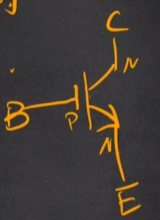
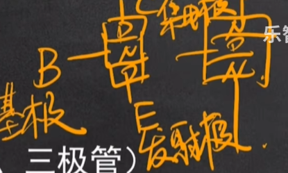
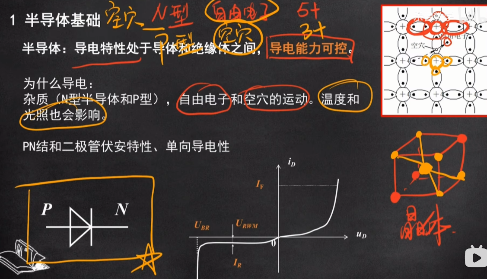
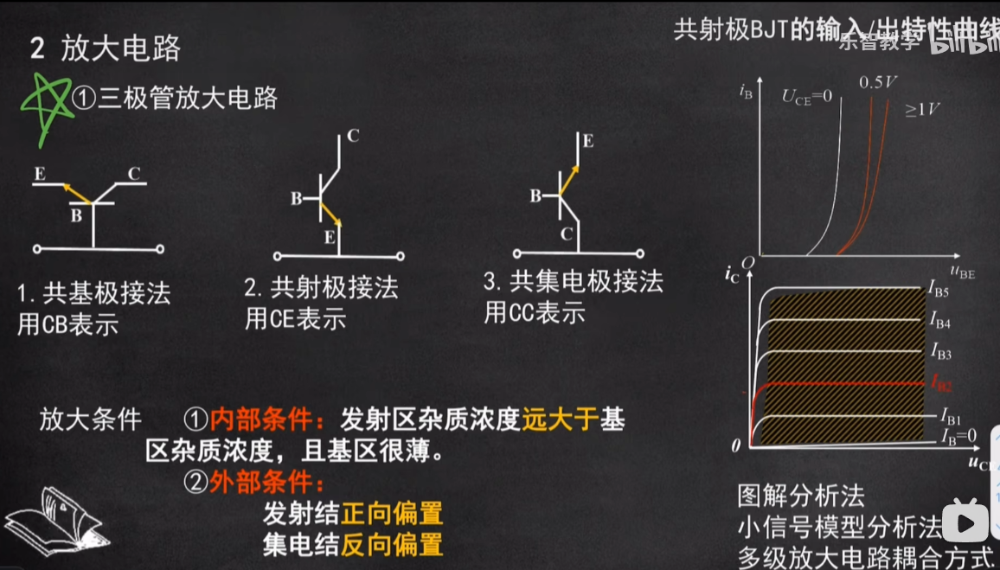

## 模电-模拟电子基础

- 半导体基础（）

  > 介于导电与不导电之间，可控
  >
  > - PN结：p型半导体、n型半导体
  >
  > - 二极管：pn极+导线
  >
  > - 三极管（C-集电极  B-基极  E-发射极）
  >
  >   - 电流一般由
  >   - pnp  n型半导体
  >   - 
  >   - npn  p型半导体
  >   
  >   

- 放大电路

  - 三极管、运算、功率放大器，反馈电路、电路频率响应，多级放大电路

- 波形产生与信号转换

  - 电压比较器和正弦波产生电路、滤波和整流

### 半导体基础

- 半导体：导电性处于导体和绝缘体之间，**导电能力可控**。
- 问什么导电？
  - 含有杂质（N型和P型半导体），自由电子和空穴的运动。受温度和光照的影响。
  - N型，周围5价电子，多1个自由电子
  - P型，周围3价电子，缺失一个电子

### 放大电路

#### 三极管放大电路

- 根据接线方式分类
  - 共基极接法 - CB
  - 发射极 - CE
  - 集电极 - CC
- 对于多级放大电路，逐级分析
- 放大条件
  1. 内部条件：发射区杂质浓度远大于基区杂质浓度，且基区很薄
  2. 外部条件：
     - 发射结正向偏置
     - 集电结反向偏置

- 结论1：
  - 对于共射极接法CE
    - I-be、U-be越大，I-ce、U-ce越大

#### 运算放大电路

