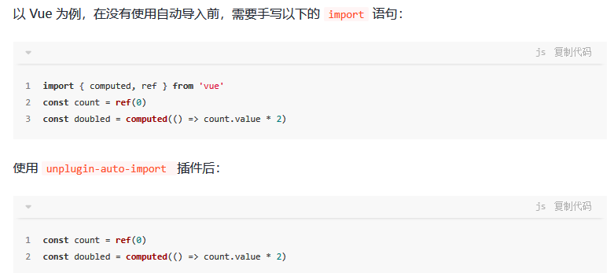

<WaterMark />
# JS周边库


## [GSAP](https://gsap.com/)

> GSAP 是一个强大的 JavaScript 工具集，可以将开发人员变成动画超级英雄。构建适用于所有主流浏览器的高性能动画。动画化 CSS、SVG、画布、React、Vue、WebGL、颜色、字符串、运动路径、通用对象……任何 JavaScript 可以触及的东西！ GSAP 的 ScrollTrigger 插件可让您使用最少的代码创建令人惊叹的基于滚动的动画。
>
> - [使用GSAP写出令人惊叹的动画！ - 掘金 (juejin.cn)](https://juejin.cn/post/7184080621831422011)
> - [Parallax scroll animation (codepen.io)](https://codepen.io/isladjan/pen/abdyPBw)
> - [10 个功能强大的 JavaScript 动画库，打造引人入胜的用户体验-腾讯云开发者社区-腾讯云 (tencent.com)](https://cloud.tencent.com/developer/article/2327140)
> - [练习动画最好的方式：用GSAP实现可滚动和可拖动的时间轴 - 掘金 (juejin.cn)](https://juejin.cn/post/7136508854422110244#heading-12)

```js
pnpm install gsap	// 安装
import { gsap } from "gsap";	// 引入
```


### 补间动画

> gsap在早期flash繁荣时期就已存在，其核心为**补间动画**
>
> 主要的补间动画：
>
> - gsap.to()	// 从元素的起始默认状态，动画到指定的结束值
> - gsap.from()  // 从指定的起始值，动画到元素默认的状态，与to() 相反
> - gsap.fromTo()  // 自定义起始值和结束值
> - gsap.set()  // 立即设置属性（无动画）

- [Easing](https://gsap.com/docs/v3/Eases/) ：动画曲线选择配置

```js
gsap.to()	// 由初始状态变化为动画指定的状态

// 参数1：选择器，支持id、class、标签
// 参数2：动画配置对象
gsap.to('.box',{
	scale: 0.1,	// 缩放为10%
	x: -100,	// x轴移动-100px
    y: 60,	// 向y轴移动60px
    xPercent: 50,	// 水平移动元素宽度的百分比，50%
    yPercent:50,	// 垂直移动元素高度的百分比，50%
    rotation:360,	// 旋转，360°
    duration: 1,	// 动画持续时间1s
    repeat: -1,	// 重复次数 -1 无限重复； 3 重复3次
    yoyo: true,	// 往复模式,正向运动结束后，反向运动；默认为一直重复正向运动
    // stagger: 0.2, // 设置被选中全部的元素，动画依次生效间隔时间0.2s；默认为全部一起运动
    // stagger 高级配置
    stagger:{
        amount: 1.5,	// 所有动画交错完成的总时间，单位s
        grid:"auto",
        from:"center"	// 动画开始的位置，向其他位置扩散展开；center||end||edges||random||数字
    },
})


gsap.from()	// 由指定状态变化为当前默认的状态

gsap.from('.box',{
    scale:0.5,
    y:-50,
    opacity:0,	// 透明度，初始为0
    easy:'power1.out',	// 动画运动曲线；power1||power2||back||....  看官网
    delay : 1,		// 动画延迟时间
})


gsap.fromTo('.box',{ x:-40,fill:'blue' },{ x:40,fill:"green" })

gsap.set('.box',{x:100})
```


### 时间线

> 时间线 timeline：是创建易于调整、有弹性的动画序列的关键。将补间动画添加到时间线时，默认情况下，补间动画将按照添加顺序依次播放。将多组动画编排动作，从而控制整个序列。

- 参数
  - 第一个参数：选择器
  - 参数2：动画属性配置
  - 参数3：可选，位置参数，用于指定多组动画之间的执行时机
    - `Number`：等待对应秒数后再执行
    - `"<"`：与上个时间的动画同步一起执行
    - `">"`：默认值，等待上个动画接受后再执行
    - `"+=n"`：上个动画结束后，等n秒后再执行
    - `"+=n"`：上个动画结束前n秒就开始执行

```js
const t = gsap.timeline()	// 创建时间线
t.to(".box1",{ x:600, duration:2 })		// 第一步动画
t.to(".box2",{ x:600, duration:2 })		// 第一步动画结束后执行
t.to(".box3",{ x:600, duration:2 })		// 第二步动画结束后执行

// 时间线参数示例：
t.to(".box4",{ x:600, duration:2 },"+=1")		// 第二步动画结束后执行
```


### 回调动画

> 所有的时间线和补间都有以下回调：

- onStart：在动画开始时调用
- onUpata：每次动画更新时调用（在动画处于活跃状态时的每一帧上）
- onRepeat：每次动画重复时调用
- onComplete：在动画完成时回调
- onReverseComplete：当动画反转时、再次到达起点时调用？

```js
gsap.to(".box4",{ 
    x:600, 
    duration:2,
	onStart:()=>{
      console.log("动画开始了")  
    }
},"+=1")	
```


### [ScrollTrigger 滚动触发器](https://gsap.com/docs/v3/Plugins/ScrollTrigger/)

- ScrollTrigger 回调函数
  - `onUpdata`：更新时
    
    > 每次ScrollTrigger 的进度更改（滚动条位置变化）时，都会触发的回调
    >
    > - 参数self：获取滚动条的相关信息
    >   - self.progress  滚动的整体进度，取值 0-1
    >   - 
    
    - 用途：可做背景视频联动播放卡点
    
  - `onScrubComplete`：在擦除完成时

```js
// 引入
import { ScrollTrigger } from "gsap/ScrollTrigger";
// 使用（可单独使用，也可添加到gsap的时间轴中）
ScrollTrigger.create({
    trigger:".box",	// 要绑定的元素
    start:"top top",	// 滚动触发器的起始位置
    end:"+=100",	// 滚动触发器的结束位置
    scrub:true,	// 擦洗动画，就是滚动回去时是否还原动画
    pin:true,	// 动画时是否固定屏幕，true-固定当前屏幕（不下滑） false-滚动下滑 || Element-指定元素
    animation:
    	gsap.to('.box',{y:1000,x:500}),
    markers:true,	// true-开启标注功能，便于开发时观察
    toggleClass:"",	// String||Object 当滚动时向元素添加的class类名
})


ScrollTrigger.create({
    trigger:".box",	// 要绑定的元素
    start:"top-=500 top",	// 滚动触发器的起始位置
    end:"+=2000",	// 滚动触发器的结束位置（滚动动画关联的滚动长度）
    scrub:true,	// 
    pin:true,	// 动画时是否固定屏幕，true-固定当前屏幕（不下滑） false-滚动下滑 || Element-指定元素
    animation:
    	gsap.timeline()
    	.fromTo('.box1',{y:1000,x:500},{y:0,x:1000}),
    	.fromTo('.box2',{width:"100em",height:"500px"},{width:"0em",height:"500px"},"<"),
    markers:true,	// true-开启标注功能，便于开发时观察
    toggleClass:"",	// String||Object 当滚动时向元素添加的class类名
    onUpdata(self){
        console.log("当前滚动的进度：",self.progress)
    }
})
```


##  [anime.js](https://animejs.com/)

> - 支持给任何对象做动画，Dom、js对象、数组..

### 动画目标

- 支持id/class选择器  `#app .app`
- 支持 js 对象
- 支持数组形式，同时传入多个动画目标


### css属性

- **单位**，例` borderRadius:'50%'`

  - 无单位-取原始值的单位
  - 特定单位-将自动转换初始目标值，例`100% vw vh`
  - 相对单位-在当前基础上，例`+= -= *=   -=10`
  - 颜色单位-不支持CSS颜色代码-如red，其他色值均支持

- **对象**-针对性的设置延迟运动曲线等

  - 例：`scale: { value: 2, duration: 1600, delay: 800, easing: 'easeInOutQuart' }`

- **数组/属性关键帧**-在一次动画周期内完成多个过渡

  - 属性关键帧使用属性Object的Array定义。属性关键帧允许重叠动画，因为每个属性都有自己的关键帧数组。

  ```js
  borderRadius: ['0%', '50%']  // 最基础
  
  anime({
    targets: '.property-keyframes-demo .el',
    translateX: [
      { value: 250, duration: 1000, delay: 500 },
      { value: 0, duration: 1000, delay: 500 }
    ],
    translateY: [
      { value: -40, duration: 500 },
      { value: 40, duration: 500, delay: 1000 },
      { value: 0, duration: 500, delay: 1000 }
    ],
    scaleX: [
      { value: 4, duration: 100, delay: 500, easing: 'easeOutExpo' },
      { value: 1, duration: 900 },
      { value: 4, duration: 100, delay: 500, easing: 'easeOutExpo' },
      { value: 1, duration: 900 }
    ],
    scaleY: [
      { value: [1.75, 1], duration: 500 },
      { value: 2, duration: 50, delay: 1000, easing: 'easeOutExpo' },
      { value: 1, duration: 450 },
      { value: 1.75, duration: 50, delay: 1000, easing: 'easeOutExpo' },
      { value: 1, duration: 450 }
    ],
    easing: 'easeOutElastic(1, .8)',
    loop: true
  });
  ```

- **函数**-通过函数参数中获取更多配置对多个元素进行动画，实现效果

  ```js
  anime({
    targets: '.function-based-values-demo .el',
    translateX: function(el) {
      return el.getAttribute('data-x');
    },
    translateY: function(el, i) {
      return 50 + (-50 * i);
    },
    scale: function(el, i, l) {
      return (l - i) + .25;
    },
    rotate: function() { return anime.random(-360, 360); },
    borderRadius: function() { return ['50%', anime.random(10, 35) + '%']; },
    duration: function() { return anime.random(1200, 1800); },
    delay: function() { return anime.random(0, 400); },
    direction: 'alternate',
    loop: true
  });
  ```


### 动画关键帧

- keyframes 关键帧内未指定持续时间，则每个关键帧持续时间将等于动画的总持续时间除以关键帧的数量

- 动画关键帧 每一帧是在上一帧的基础上进行叠加，而不是相对第一帧的位移

  ```js
  anime({
    targets: '.animation-keyframes-demo .el',
    keyframes: [
      {translateY: -40},
      {translateX: 250},
      {translateY: 40},
      {translateX: 0},
      {translateY: 0}
    ],
    duration: 4000,
    easing: 'easeOutElastic(1, .8)',
    loop: true
  });
  ```


### 动画函数

 - 参数：

   - target-当前的动画目标元素当前的动画目标元素
   - index 动画目标元素的索引
   - targetsLength 已设置动画的目标的总数

   ```js
   // 效果描述, targets选中的多个Dom，依次开始向右移动，到达终点等待全部到达后，再同时返回，循环往复
   anime({
     targets: '.function-based-params-demo .el',
     translateX: 270,
     direction: 'alternate',
     loop: true,
     delay: function(el, i, l) {
       return i * 100;
     },
     endDelay: function(el, i, l) {
       return (l - i) * 100;
     }
   });
   ```


### 基础使用

```js
// 版本 3.2.2
// 1.安装
pnpm i animejs
pnpm i @types/animejs

// 2.引入
import anime from 'animejs'

// 3.创建动画
anime({
  targets: '.duration-demo .el',  // 动画目标，支持id/class选择器
  translateX: 250,
  duration: 3000
});

/* 动画目标，支持js对象 */
let param = { left:0 }
anime({
  targets: param,  // 动画目标，支持 js对象
  left:100,
  duration: 3000,
  update:()=>{ 
  	d1.style.left = param.left + "px"; //动画每播放一帧执行一次
  }
});

/* 全部参数 */
targets // 动画目标
duration // 动画播放时间，单位ms，默认为1000
delay // 动画的延迟，单位ms，默认为0
endDelay // 一次动画结束后延迟，单位ms，默认为0，用在循环动画中
easing // 动画运动曲线，默认easeOutElastic(1, .5)
direction /* 动画的方向 'normal'-从0到100%	 'reverse'-从100%到0%	'alternate'-从0%到100%再回到0% */
loop // 迭代次数 Number-具体次数 true-无限循环
autoplay // true-自动启动动画 false-默认下暂停
keyframes // 动画关键帧

left // css left值变化到100px
backgroundColor: '#FFF' // 应该是支持所有的css属性
borderRadius: ['0%', '50%'], // 取值为数组时，表示一周期内分段变化

// ------- targer为js对象时
[n] // 可指定js对象的属性名，并设置变化的值，例x:5
round: 10 // 将值向上舍入到1位小数，100-2位 1000-3位

// ------- 函数
update // 动画每播放一帧执行一次

```


### [stagger](https://animejs.com/documentation/#gridStaggering)交错动画

> 针对被targets选中的多个DOM

```js
/* start 从特定值 开始错开效果 */
anime({
  targets: '.staggering-start-value-demo .el',
  translateX: 270,
  delay: anime.stagger(100, {start: 500}) // 延迟从500ms开始，然后每个元素增加100ms
});

/* 数组 在两个数字之间均匀分布值 */
anime({
  targets: '.range-value-staggering-demo .el',
  translateX: 270,
  rotate: anime.stagger([-360, 360]), // 所有DOM均匀分布旋转角度，从-360度到360度
  easing: 'easeInOutQuad'
});

/* from 从特定位置 开始错开动画 
'first'-默认第一个元素开始 'last'-最后一个元素开始 'center'-从中心开始 [index]-从指定索引开始
*/
anime({
  targets: '.staggering-from-demo .el',
  translateX: 270,
  delay: anime.stagger(100, {from: 'center'})
});

/*  direction 错开动画的顺序
'first'-默认,从第一个到最后一个 'reverse'-从最后一个到第一个
*/
anime({
  targets: '.staggering-direction-demo .el',
  translateX: 270,
  delay: anime.stagger(100, {direction: 'reverse'})
});

/* easing 缓动函数错开值,事件间隔 */
anime({
  targets: '.staggering-easing-demo .el',
  translateX: 270,
  delay: anime.stagger(300, {easing: 'easeOutQuad'})
});

/* grid “涟漪”效果的2D数组 
数组，第一个值是行数，第二个值是列数
*/
anime({
  targets: '.staggering-grid-demo .el',
  scale: [
    {value: .1, easing: 'easeOutSine', duration: 500},
    {value: 1, easing: 'easeInOutQuad', duration: 1200}
  ],
  delay: anime.stagger(200, {grid: [14, 5], from: 'center'})
});

/* axis  强制栅格交错效果的方向,前提是grid */
anime({
  targets: '.staggering-axis-grid-demo .el',
  translateX: anime.stagger(10, {grid: [14, 5], from: 'center', axis: 'x'}),
  translateY: anime.stagger(10, {grid: [14, 5], from: 'center', axis: 'y'}),
  rotateZ: anime.stagger([0, 90], {grid: [14, 5], from: 'center', axis: 'x'}),
  delay: anime.stagger(200, {grid: [14, 5], from: 'center'}),
  easing: 'easeInOutQuad'
});
```


### easing缓动效果

- linear 线性

- 贝塞尔曲线 `easing: 'cubicBezier(.5, .05, .1, .3)'`

- 基于Spring物理学的弹簧 `easing: 'spring(mass, stiffness, damping, velocity)'`

  | 参数           | 默认值 | Min  | Max   |
  | -------------- | ------ | ---- | ----- |
  | Mass 质量      | `1`    | `0`  | `100` |
  | Stiffness 硬度 | `100`  | `0`  | `100` |
  | Damping 阻尼   | `10`   | `0`  | `100` |
  | Velocity 速度  | `0`    | `0`  | `100` |

- 弹性缓动 `easing: 'easeOutElastic(amplitude, period)'`

  | in                | out                | in-out               | out-in               |
  | ----------------- | ------------------ | -------------------- | -------------------- |
  | `'easeInElastic'` | `'easeOutElastic'` | `'easeInOutElastic'` | `'easeOutInElastic'` |

  | 参数           | Default | Min   | Max  | Info                                                         |
  | -------------- | ------- | ----- | ---- | ------------------------------------------------------------ |
  | Amplitude 幅度 | `1`     | `1`   | `10` | 控制曲线的过冲。这个数字越大，过冲越多。                     |
  | Period 周期    | `.5`    | `0.1` | `2`  | 控制曲线来回移动的次数。这个数字越小，来回移动的次数就越多。 |

- 步骤 `easing: 'steps(numberOfSteps)'`       定义动画到达其结束值所需的跳跃数。

  - numberOfSteps 默认10，最小值1

- 内置 easing   [Easing Functions Cheat Sheet](https://easings.net/)

  | in               | out               | in-out              | out-in              |
  | ---------------- | ----------------- | ------------------- | ------------------- |
  | `'easeInQuad'`   | `'easeOutQuad'`   | `'easeInOutQuad'`   | `'easeOutInQuad'`   |
  | `'easeInCubic'`  | `'easeOutCubic'`  | `'easeInOutCubic'`  | `'easeOutInCubic'`  |
  | `'easeInQuart'`  | `'easeOutQuart'`  | `'easeInOutQuart'`  | `'easeOutInQuart'`  |
  | `'easeInQuint'`  | `'easeOutQuint'`  | `'easeInOutQuint'`  | `'easeOutInQuint'`  |
  | `'easeInSine'`   | `'easeOutSine'`   | `'easeInOutSine'`   | `'easeOutInSine'`   |
  | `'easeInExpo'`   | `'easeOutExpo'`   | `'easeInOutExpo'`   | `'easeOutInExpo'`   |
  | `'easeInCirc'`   | `'easeOutCirc'`   | `'easeInOutCirc'`   | `'easeOutInCirc'`   |
  | `'easeInBack'`   | `'easeOutBack'`   | `'easeInOutBack'`   | `'easeOutInBack'`   |
  | `'easeInBounce'` | `'easeOutBounce'` | `'easeInOutBounce'` | `'easeOutInBounce'` |

- 自定义缓动函数

  ```js
  easing: function() { return function(time) { return time * i} }
  
  anime({
    targets: '.custom-easing-demo .el',
    translateX: 270,
    direction: 'alternate',
    loop: true,
    duration: 2000,
    easing: function(el, i, total) {
      return function(t) {
        return Math.pow(Math.sin(t * (i + 1)), total); // 返回动画的当前时间
      }
    }
  });
  ```

  

### timeline时间轴

### play/pause控制

### 回调函数

### svg路径/形变/线描

### 其他方法

- get
- remove
- set
- tick
- running
- ....


### 在Vue3中使用

```typescript
/**
 * v-anime 动效实现animejs
 * 注意：不能使用在 template 标签上，不推荐在组件上使用自定义指令。当组件具有多个根节点时可能会出现预期外的行为。
 */
import anime from 'animejs'
export default {
  // 在绑定元素的父组件 及 他自己的所有子节点都挂载完成后调用
  mounted(el: any, binding: any) {
    const { value } = binding
    anime({ targets: el, ...value })
  }
}

```


## PixiJS

> Pixi是一个非常快的2D sprite渲染引擎。
>
> - 通过 `WebGL` 来调用 GPU 渲染动画，极大的提升了性能
> - 兼容性好、支持 `WebGL` 和 `canvas` 两种渲染模式，如果有需要可以无缝回退到 `HTML5 Canvas`框架底层做了抹平处理，支持在各个平台上运行
> - 非常灵活纯粹的渲染引擎，相对游戏引擎更轻量，比较适合做动画，采用插件系统，与其他插件或框架无缝集成 不会入侵代码，不与任何 `IDE` `工具` 绑定，任何项目都能很容易都接入
> - 不足：
>   - 不支持 3D（有相关的 3D 插件，自行体会🤔）
>   - 不适合做复杂的游戏

```js
// 下载 npm 或 yarn
npm i pixi.js
yarn add pixi.js
```


#### 绘制基础形状

- 利用`new PIXI.Application`创建应用
  - 使用`appendChild`将它的`view`添加到页面
- 利用`new PIXI.Graphics`绘制图像
  - `beginFill`填充的颜色，参数1：十六进制颜色值， 参数2：透明度0-1
    - `rectangle.beginFill(0x66ccff,0.5);`
  - `drawRect` 绘制矩形
  - `drawCircle`绘制圆形

```js
// 导入pixi
import * as PIXI from 'pixi.js'
// 创建应用
const app = new PIXI.Application({
    // 配置宽高、背景色、屏幕像素比（pc：1，手机可能为2）
    width:window.innerWidth,
    height:window.innerHeight,
    backgroundColor:0x1099bb,
    resolution:window.devicePixelRatio || 1,
    antialias:true,//抗锯齿
})
// 将应用画布添加到DOM中
document.body.appendChild(app.view)

//创建一个形状
const rectangle1 = new PIXI.Graphics();
// 绘制结束前的操作：
rectangle1.lineStyle(4,0xff0000,1)	// 设置边框样式 线宽，颜色，透明度
rectangle1.beginFill(0x66ccff);   	// 设置填充颜色
rectangle1.drawRect(0,0,64,64);  	// 绘制矩形 起始点xy，结束点xy
rectangle1.drawCircle(0,0,32);		// 绘制圆形，圆心xy，半径
rectangle1.endFill();	// 结束绘制

// 绘制后的操作：
// 图形的缩放
rectangle1.scale.set(2,2);
// 图形的位移
rectangle1.position.set(100,100)
//图形的旋转
rectangle1.rotation=0.5;
//图形的锚点位置（旋转中心）
rectangle1.pivot.set(82,32)

// 将形状添加到舞台 app
app.stage.addChild(rectangle1)
```


#### 更多形状

```js
// 绘制矩形 起始点xy，结束点xy
shape.drawRect(0,0,64,64);  	
// 绘制圆形，圆心xy，半径
shape.drawCircle(0,0,32);
// 绘制椭圆 x,y,宽,高
shape.drawEllipse(0,0,164,64)
// 绘制圆角矩形 x,y，宽，高，圆角半径
shape.drawRoundeRect(0,0,164,64,10)
// 绘制多边形 参数是一个数组，分别是x,y,x,y,x,y...组成
shape.drawPolygon([0,0,100,0,100,100,0,100])
// 绘制圆弧 圆心x,y,半径，起始角度，结束角度，是否逆时针
shape.arc(0,0,32,0,Math.PI,false])

// 绘制线段 
line.move(0,0) // 设置绘制起始点
line.lineTo(100,100); // 下一个点
line.lineTo(200,0); // 下一个点
line.lineTo(100,100);

// 绘制圆角矩形 x,y，宽，高，圆角半径
const roundedRectangle = new PIXI.Graphics();
roundedRectangle.beginFill(0x66ccff,1);
roundedRectangle.drawRoundeRect(0,0,164,64,10)
roundedRectangle.endFill();   // 结束绘制
roundedRectangle.target.position.set(500,500) // 设置位移
app.stage,addChild(roundedRectangle);  //添加到舞台 

```

 

#### 纹理/图片

```js
// 导入pixi
import * as PIXI from 'pixi.js'
// 创建应用
const app = new PIXI.Application({
    // 配置宽高、背景色、屏幕像素比（pc：1，手机可能为2）
    width:window.innerWidth,
    height:window.innerHeight,
    backgroundColor:0x1099bb,
    resolution:window.devicePixelRatio || 1,
    antialias:true,//抗锯齿
})
// 将应用画布添加到DOM中
document.body.appendChild(app.view)

// 创建一个纹理
const texture = PIXI.Texture.from("./xx/xx/a.png")
// 创建一个精灵（用来放置纹理）
const sprite = new PIXI.Sprite(texture);
// 设置精灵的锚点/中心点，正中心
sprite.anchor.set(0.5,0.5)

// 设置精灵的位置(默认以左上角为中心点/锚点)
sprite.x = app.screen.width/5   // 宽度局中
sprite.y = app.screen.height/5  // 高度局中
// 设置精灵的旋转45度
sprite.rotation = Math.PI / 4
// 透明度
sprite.alpha = 0.5
// 缩放
v.scale.set(2,2)

// 添加到舞台
app.stage,addChild(sprite);

// 实现动画
```


## iDraw.js

- 优点
  - 支持元素多选、固定、隐藏....
  - 支持导入、导出 data
  - 

```js
// 方法记录
idraw.方法名
idraw.setData(data,{triggerChangeEvent:true});	// 设置绘制数据 - 以最后一次 setData的data为准 - 因此可以用它清除画布
const resultData = idraw.getData();	// 获取画布JSON数据

selectElement(resultData.elements[0].uuid);	// 根据元素id,选中对应元素，一般没啥用，uuid没有时会自动创建，需求：拖拽创建元素后，默认选中创建的元素
selectElementByIndex()	// 根据元素在 data.elements中的索引位置选中。
cancelElement	// 根据uuid取消元素选中状态
cancelElementByIndex(0)	// 根据元素在 data.elements中的索引位置取消选中
getSelectedElements	// 读取被选中的元素数组数据
updateElement	// 更新画布中的元素

// 事件监听
idraw.on('事件名', (e) => { })	
changeData		// 绘图监听，画布数据变化时，获取最新数据，需配合setData的配置
screenSelectElement	 // 选中事件监听，回调
```


## [Vue-Easy-DnD](https://rlemaigre.github.io/Easy-DnD/)

- 普通拖拽
  - `<Drag/>     <Drop/>`
- 列表排序拖拽
  - [DropList](https://rlemaigre.github.io/Easy-DnD/components/droplist.html) - 在editors中使用过

```js
pnpm install vue-easy-dnd@latest --save  // 安装依赖

import { Drag, Drop } from "vue-easy-dnd";

<Drag/>  // 拖动de元素

@dragstart 	// 拖拽开始事件


type	// 允许设置 drag的type类型，仅支持两种 Number string
data	// 拖拽中携带的数据
drag-image-opacity	// 定义被拖拽元素的透明度 0-1
disabled	// 禁止此元素的拖拽，可用来做 前端权限校验！！
go-back		// 未拖动到容器的元素视为“失败”，将失败的元素以动画形式，原路返回
delta		// Number-定义拖拽效果 - 开始响应的距离，默认 3px
delay		// Number-选中元素到相应为拖拽的时长，类似于长按选中。默认 0ms
drag-class	// 给拖拽的浮动元素 自定义样式类
vibration	// Number-当拖动事件开始时，支持的移动设备上的振动反馈(默认0ms =无反馈)
handle		// 拖拽时的鼠标样式	？？
scrolling-edge-size	// 当将此元素拖到其边界容器/列表的边缘时，像素量定义了它将自动向上/向下/向左/向右滚动的距离容器边缘的距离(0 =在其边界容器上不滚动)

    
<Drop/>		// 容器
    
@dragend	// 拖拽停止事件
	- 回调函数中大量有价值的返回信息（往下看）
mode 		// 模式 -默认copy copy源不影响 cut删除源
// 如果拖动操作源自没有声明cut事件侦听器的Drag组件，则禁止在声明cut模式的Drop组件上放置。

accepts-type="number"	// 接受Drag中对应type的内容
:accepts-data="(d) => d === 2"	// 对接受的内容进行判断，只接受符合条件的元素
drag-image-opacity	// 定义被拖拽元素的透明度 0-1


// 内部样式 - 类名直接使用，声名样式即可
.drop-allowed{ background: rgba(167, 230, 22, 0.795); }	// 拖拽元素时，匹配可接受该元素的容器样式
drop-forbidden	// 拖拽元素时，type匹配但accepts-data不匹配的容器样式
.drop-in	// 拖拽元素进入容器范围中时，容器的样式

    
    
    
// @dragend 回调 参数 
/*
	clientX和clientY与x，y一样的，都是客户区域坐标，指鼠标的坐标，以浏览器显示区域的左上角开始
	offsetX，offsetY 针对目标元素的左上角坐标（e.target）
	layerX,layerY 往上找有定位属性的父元素的左上角（自身有定位属性的话就是相对于自身），都没有的话，就是相对于body的左上角
	pageX， pageY相对页面左上角的距离(包含滚动上去的距离)
	screenX screenY 相对屏幕左上角的位置（脱离浏览器位置）
*/
    data: 携带的自定义数据
    native: {
        clientX	// 相较于浏览器视口左侧的X轴位置
        clientY	// 相较于浏览器视口顶部的Y轴位置
        screenX	// 相较于浏览器 整页左侧的X轴位置
        screenY	// 相较于浏览器 整页顶部的Y轴位置
        offsetX	// 相对于Drop容器的X轴位置 - √√
        offsetY	// 相对于Drop容器的Y轴位置 - √√
        layerX	// 相对于Drop容器的X轴位置 - √
        layerY	// 相对于Drop容器的Y轴位置 - √
    }
	position:
	....
```


## D3js

> Data-Driven Documents：**基于数据驱动文档工作方式的一款JavaScript函数库，主要用于网页作图、生成互动图形，是最流行的可视化库之一。D3使你有能力借助HTML，SVG和CSS来生动地可视化各种数据**

- 优点：
  1. 提供了一种通过 Web 构建图形的便捷方式
  2. 简化了创建动画和交互式图形的方式
  3. 易学易用的框架，擅长做通用的 DOM 处理


### 基础使用

1. 安装

   - ```vue
     <!-- 方式1：直接引入js文件  
     	注：现在已经是V5版本。V5和V3的很多语法还是有区别的！
     -->
     <script src="http://d3js.org/d3.v5.min.js"></script>
     
     
     <!-- 模块化引入  -->
     <script>
         import * as d3 from 'd3';
     </script>
     ```


#### 选择器

> Selections 允许强大的数据驱动文档对象模型(DOM)：设置attributes,styles,HTML 或 text 内容，选择集的方法通常选择当前的选择当前的选择集或者新的选择集，因此允许进行链式调用。

```js
// 选中符合条件的第一个元素，选择条件为 selector 字符串。如果没有元素被选中则返回空选择集，如果选择器有多个，那就返回匹配第一个选择集
d3.select('selector') 

// 选择所有与制定的selector匹配的元素，返回一个数组。如果没有元素被选中，则返回的空的选择集
d3.selectAll('selector')


// const p = d3.selectAll("p");
// p.attr("class","fd-tag");
// p.style("color","red");
// 等价于 以下代码：
d3.selectAll("p")
      .attr("class","fd-tag")
      .style("color","red");

```


#### d3-zoom

> *视图移动以及缩放是一种流行的交互技术 缩放行为通过*d3-zoom*模块来实现，缩放本身与DOM元素无关，可以用于SVG，HTML 或者 Canvas。*

1. 引入d3-zoom 
   - `<script src="htts://d3js.org.js/d3-zoom.v1.min.js"></script>`
   - `npm install d3-zoom`

```js
// 引入d3-zoom
d3.zoom()

// 创建一个新的缩放行为,并返回该行为。zoom既是一个对象又是一个函数，通过selection.call()来应用到元素本身上
selection.call(d3.zoom().on( "zoom" , zoomed))

// 事件绑定 .zoom 双击禁用缩放 以及 禁止滚动齿轮缩放
  selection.on("dblclick.zoom",null)
  selection.on("wheel.zoom",null)

selection.call( d3.zoom()
         // extent 即将当前视口范围设置为指定的数组[[x0,y0],[x1,y1]] 
        // x0,y0为视口的左上角，x1,y1为视口的右下角
        .extent([0,0],["画布的宽度","画布的高度"])
        // 缩放的范围[k0,k1]     k0 为缩放的最小范围，  k1为缩放的最大范围
        .scaleExtent([0.4,1])    // 缩放范围
        .on("zoom",()=>{
            // zoom事件跟缩放的回调函数   d3.event.transform 
            selection.attr( "transform" , d3.event.transform )
    })
 )
```


## 控制台禁用

[disable-devtool/README.cn.md at master · theajack/disable-devtool (github.com)](https://github.com/theajack/disable-devtool/blob/master/README.cn.md)


## [Vxe Table v4](https://vxetable.cn/#/start/install)

### 问题记录

- 问题1： VxeGrid使用重置按钮时  @form-reset="gridformReset"   第一次重置后的值带不过去，还是上一个条件的参数？！

  - 解决方案：使用  nextTick   包裹

    ```js
    query: ({ page, form }) => {
        return nextTick(async () => {
        	...
        })
      }
    ```

- 问题2：vxegrid开启数据代理后，关闭分页报错

  ```ts
  // 详细描述：pager-config.enabled  设置为  false 时，若使用 proxy-config配置 导致报错
  
  // 方案1：不使用proxy-config配置，影响较大，不推荐
  // 方案2：保留 pager-config.enabled 的设置为true，但将 pager-config.layouts 布局设置为空数组【推荐】
  ```
  
  


## 用户指引

> - [Install Intro.js | Intro.js Docs (introjs.com)](https://introjs.com/docs/getting-started/install)
> - [Vue3网站用户引导功能【Intro.js】_introjs主题-CSDN博客](https://blog.csdn.net/QQ675396947/article/details/134812734)


## [Lodash 简介 ](https://www.lodashjs.com/)

> Lodash 通过降低 array、number、objects、string 等等的使用难度从而让 JavaScript 变得更简单
>
> - [安装lodash-es - 掘金 (juejin.cn)](https://juejin.cn/post/7354940462061715497)
>   - **lodash-es**是一个基于著名的JavaScript实用工具库`lodash`的模块化版本，专为使用ECMAScript（ES）模块规范的现代项目设计   **更轻量、更易于优化**

```js
// 安装
npm install --save lodash-es
// 使用
import { map, filter, reduce } from 'lodash-es';
```


### [防抖函数](https://www.lodashjs.com/docs/lodash.debounce)

```js
// 防抖函数 debounce
```


## unplugin-auto-import

> **自动导入常用的使用的第三方库的 API**，方便开发，提升效率
>
> - [告别手动引入依赖：unplugin-auto-import 插件助你提升编码体验（内附实现原理） - 掘金 (juejin.cn)](https://juejin.cn/post/7208099384070815803)
> - 




### 使用方法


## Events.js

[browserify/events: Node's event emitter for all engines. (github.com)](https://github.com/browserify/events#readme)

## [Day.js 时间处理](https://day.js.org/zh-CN/)


## css样式周边


### classnames动态类名

> js库，方便通过条件判断动态控制class类名的显示

```jsx
// 安装
npm i classnames

import classnames from 'classnames'

// 原始写法（React中）
<p className={`nav ${type=='1' && 'active'}`} ></p>

// 使用classname
<p className={classNames('nav',{active:type=='1'})} ></p>
```


### [UnoCSS](https://unocss.dev/)

- [Next.js 中使用 UnoCSS 及其图标样式方案](https://juejin.cn/post/7340907184639442944)

```js
// 示例：nextJS中使用
1. pnpm add -D unocss @unocss/postcss

2. 创建 uno.config.ts 文件，配置样式预设

3.globals.css 中 导入 
	@import "@unocss/reset/tailwind.css";
	@unocss all;

4.修改postcss.config.ts
module.exports = {
  plugins: {
    '@unocss/postcss': {
      content: [
        './pages/**/*.{js,ts,jsx,tsx,mdx}',
        './components/**/*.{js,ts,jsx,tsx,mdx}',
        './app/**/*.{js,ts,jsx,tsx,mdx}',
        '**/*.{html,js,ts,jsx,tsx}'
      ]
    }
  }
}

5.使用图标库
pnpm i @iconify-json/xxxx   // 安装所需图标库
```


### [Tailwind CSS](https://www.tailwindcss.cn/)

#### 使用

- [伪类 Hover, Focus...TailwindCSS汇总](https://www.tailwindcss.cn/docs/hover-focus-and-other-states#quick-reference)

```css
/* 主题 */
dark:text-white   /* 默认为亮色模式，使用dark配置暗色模式样式 */

/* 常用 */
hover:bg-sky-700  /* 悬停 */
focus:outline-none /* 聚焦 */
odd:bg-white /* 奇数项 */
even:bg-slate-50 /* 偶数项 */
first:pt-0 last:pb-0 /* 第一个，最后一个 */

group
group-hover:text-white /* 基于父标识设置状态 group-focus group-hover */
group/{name}   /* 为当前父元素指定命名name，后续嵌套中便于使用 */
group-hover/{name}:text-white   /* 针对特定的父类，设置样式 */

*:rounded-full *:border *:border-sky-100  /* 设置子元素样式，且子元素再设置同类样式时无效 */
has-*:bg-red has-[img]:bg-red has-[:focus]:bg-indigo-50 /* 设置指定类型或状态的子元素样式 */

before
after:content-['*'] after:ml-0.5 after:text-red-500   /* after 伪元素，content默认为'' */

marker:text-sky-400 /* marker 符号样式，例如 li的标点 */

selection:bg-fuchsia-300 selection:text-fuchsia-900  /* 文本高亮，文本选中时的样式，可继承 */


min-[320px]:text-center max-[600px]:bg-sky-300  /* 自定义响应式，更多参见下图 */
```


#### 自定义

##### 黑暗模式

> [Dark Mode - TailwindCSS中文文档 | TailwindCSS中文网](https://www.tailwindcss.cn/docs/dark-mode)


##### 自定义响应式

```js
/** @type {import('tailwindcss').Config} */
module.exports = {
  theme: {
    screens: {
      'tablet': '640px',
      // => @media (min-width: 640px) { ... }

      'laptop': '1024px',
      // => @media (min-width: 1024px) { ... }

      'desktop': '1280px',
      // => @media (min-width: 1280px) { ... }
    },
  }
}
```


#### 样式冲突

> tailwind css 样式与 其他UI库 共同使用中可能会发生样式冲突，毕竟 lg、flex这类样式名作为内置真的很好用
>
> 例：使用element-plus/antd 引入tailwind 可能导致正常的按钮样式变为“透明”！

```js
// 解决方法：
// 关闭tailwind的样式预设
// 将 @tailwind base; 引入它到项目时会包含默认的预设样式
// 通过tailwind.config.js 禁用Preflight预设样式
/** @type {import('tailwindcss').Config} */
module.exports = {
  corePlugins: {
    preflight: false,	// 禁用Preflight预设样式
  },
};
```


### [cva.style](https://cva.style/docs)

- [Tailwind CSS + cva 实现样式变体组件 - 掘金 (juejin.cn)](https://juejin.cn/post/7290802328722276352)


