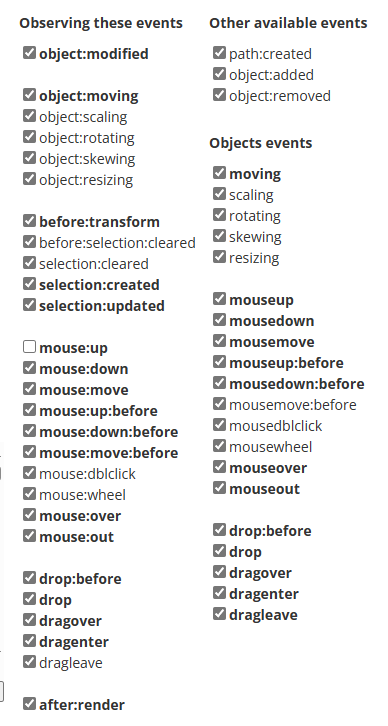

# Fabric.js

> 功能强大的 JavaScript 库，提供 canvas**对象模型**、SVG 解析器、交互层一整套工具。
>
> [关于本文档 | fabric.js 中文教程 (gitee.io)](https://k21vin.gitee.io/fabric-js-doc/docs/)
>
> [Fabric.js software gallery | Devpost](https://devpost.com/software/built-with/fabric-js)
>
> - 浏览器最后记录
>   - [Introduction to Fabric.js. Part 1. — Fabric.js Javascript Canvas Library (fabricjs.com)](http://fabricjs.com/fabric-intro-part-1)
>   - [Tutorial — Fabric.js Javascript Canvas Library (fabricjs.com)](http://fabricjs.com/articles/)
>   - [沃姆科技-创意工具 (aliui.com)](https://aliui.com/design/)
>   - [JSDoc: Home (fabricjs.com)](http://fabricjs.com/docs/)


### 基础指南

#### Canvas 画布

- `fabric.StaticCanvas()` 创建静态画布，取消了交互的事件处理，更轻量。

- `fabric.Canvas()` canvas 元素的包装器,负责管理该特定 canvas 上的所有 fabric 对象；

  - 参数：canvas 标签的 id
  - 返回值：`fabric.Canvas`实例 **_canvas( 下文用此词代表 `fabric.Canvas实例`)_**

  ```js
  fabric.Canvas('c',{
    backgroundColor: 'rgb(100,100,200)',		// 设置画布背景色
    selection: true,		// true-(默认)画布内容可交互，false-禁用交互
    selectionColor: 'blue',
    selectionLineWidth: 2,
    // ...
  })

  或

  var canvas = new fabric.Canvas('c');
  canvas.setBackgroundImage('http://...');
  canvas.onFpsUpdate = function(){ /* ... */ };
  ...
  canvas.selection = false; // 禁用组选择
  rect.set('selectable', false); // 使对象不可选中
  ```

- `canvas.add()`：添加 fabric 对象

- `canvas.item(n)`：获取画布中的第 n 个

- `canvas.getObjects()`：获取画布上的所有对象

- `canvas.remove(xxx)`：从画布中删除指定 fabric 对象

#### 基本形状

- [fabric.Circle](http://fabricjs.com/docs/fabric.Circle.html) 圆
- [fabric.Ellipse](http://fabricjs.com/docs/fabric.Ellipse.html) 椭圆
- [fabric.Line](http://fabricjs.com/docs/fabric.Line.html) 线
- [fabric.Polygon](http://fabricjs.com/docs/fabric.Polygon.html) 多边形
- [fabric.Polyline](http://fabricjs.com/docs/fabric.Polyline.html) 折线
- [fabric.Rect](http://fabricjs.com/docs/fabric.Rect.html) 正方形
- [fabric.Triangle](http://fabricjs.com/docs/fabric.Triangle.html) 三角形

- 设置/获取 Fabric 对象

  - 设置 `rect.set()`

  - 读取 `rect.get()`

    ```js
    rect.set('fill', 'red');
    rect.set({ strokeWidth: 5, stroke: 'rgba(100,200,200,0.5)' }); // 设置边框线
    rect.set('angle', 15).set('flipY', true);	// 设置旋转+Y轴翻转


    // 对于“公共”对象属性 width || stroke || strokeWidth || angle 等
    get('width') 或 getWidth()
    get('scaleX') 或 getScaleX()
    ```

  - 更新画布

    - `canvas.renderAll();` // 重新绘制画布，以便看到更改后的效果

- 来源

  > 大多数对象继承自根`fabric.Object` 它代表一个二维形状，具有`left/top/width/height/填充/描边/角度/不透明度/翻转`等属性。继承的 Fabric 对象都是通用的。
  >
  > - 可在`fabric.Object` 上定义方法，共享给所有子类

```js
// 尝试使用 Fabric 画个矩形
// 创建一个canvas的包装器
var canvas = new fabric.Canvas("c"); // canvas 标签的 id="c"

// 创建一个矩形的 fabric对象
var rect = new fabric.Rect({
  left: 100,
  top: 100,
  fill: "red", // 颜色
  width: 20, // 宽
  height: 20, // 高
  angle: 45, // 旋转角度
});

var circle = new fabric.Circle({
  radius: 20,
  fill: "green",
  left: 100,
  top: 100,
});

// 将 fabric图形 add 到画布上
canvas.add(rect, circle);

// 更改rect的位置，重新绘制
rect.set({ left: 20, top: 50 }); // 设置已有元素新的值
canvas.renderAll(); // 重新绘制画布

// 在 fabric.Object 上定义公共方法
fabric.Object.prototype.getAngleInRadians = () => (this.get("angle") / 180) * Math.PI;
var rect = new fabric.Rect({ angle: 45 });
rect.getAngleInRadians(); // 0.785...
var circle = new fabric.Circle({ angle: 30, radius: 10 });
circle.getAngleInRadians(); // 0.523...
```

#### Images 图像

- `fabric.Image`：接收 image 元素
- `fabric.Image.fromURL`：可以创建 URL 字符串的图像实例

```js
<!--
<canvas id="c"></canvas>

-->


var canvas = new fabric.Canvas('c');
var imgElement = document.getElementById('my-image');
// 使用真实的图像
var imgInstance = new fabric.Image(imgElement, {
  left: 100,
  top: 100,
  angle: 30,
  opacity: 0.85
});
canvas.add(imgInstance);

// 使用图像 url
fabric.Image.fromURL('my_image.png', (oImg)=>{
  // 在将图像添加到画布上之前，将其缩小并翻转，或其他操作...
  oImg.scale(0.5).set('flipX', true);
  canvas.add(oImg);
});
```

#### Image filters

> 每个`fabric.Image`的实例都有一个“filters”属性，它是一个简单的过滤器数组。该数组中的每个过滤器都是一个 Fabric 过滤器的实例。或者您自己的自定义过滤器的实例。
>
> “filters”属性是一个简单的数组，可对它执行任何所需的操作-**删除**(`pop`，`splice`或`shift`)，**添加**filter(`push`，`splice`，`unshift`)，甚至联合收割机组合多个 filter。当我们调用`applyFilters`时，“filters”数组中的任何过滤器都将被一个接一个地应用。所以让我们试着创造一个既深褐色又明亮的图像。

- 滤镜示例
  - new fabric.Image.filters.Sepia() 深褐色
  - new fabric.Image.filters.Grayscale() 灰度

```js
// 创建一个灰度图像
fabric.Image.fromURL("pug.jpg", function (img) {
  // add filter
  img.filters.push(new fabric.Image.filters.Grayscale());
  // 应用过滤器并重新渲染画布
  img.applyFilters();
  // 将图像添加到画布上（它也会重新渲染画布）
  canvas.add(img);
});

// 联合多个属性
fabric.Image.fromURL("pug.jpg", function (img) {
  img.filters.push(new fabric.Image.filters.Sepia(), new fabric.Image.filters.Brightness({ brightness: 100 }));

  img.applyFilters();
  canvas.add(img);
});
```

#### Paths 路径

> Fabric 中的路径与[SVG 路径元素](http://www.w3.org/TR/SVG/paths.html#PathElement)相似。它们使用相同的命令集，可以从路径元素创建，并序列化到它们中。稍后我们将更深入地研究序列化和 SVG 解析，但现在值得一提的是，您可能很少手工创建 Path 实例。相反，您将使用 Fabric 的内置 SVG 解析器。但是为了理解 Path 对象是什么，让我们尝试手工创建一个简单的对象：

- `fabric.Path`
- `fabric.Group`
- ...... 有点复杂......

```js
// 实例化fabric.Path对象，传递给它一串路径指令。得到一个三角形。
// “M”代表“移动”命令，告诉隐形笔移动到0，0点。“L”代表“线”，使钢笔画一条线到200，100点。然后，另一个“L”创建一条到170，200的线。最后，“z”告诉部队绘图笔关闭当前路径和完成形状
var path = new fabric.Path('M 0 0 L 300 100 L 200 300 z');
...
path.set({ fill: 'red', stroke: 'green', opacity: 0.5 });
canvas.add(path);


```


#### animtion 动画

> `animate`在每次更改后不会自动重新渲染画布的原因是性能问题。毕竟，我们可以在画布上有成千上百个动画对象，不能让他们中的每一个都试图重新渲染屏幕。在有很多对象的情况下，可以使用类似`requestAnimationFrame`（或其他基于计时器的）循环来连续地渲染画布，而不需要为每个对象调用`renderAll`。但大多数时候，您可能需要显式地指定`canvas.renderAll`作为“onChange”回调。

- `xxx.animate()`：为 fabric 对象设置动画(每个 Fabric 对象都有 animate 方法)
  - 参数 1：设置要动画的属性
    - `旋转-设置角度、left-top-移动、width-height-伸缩、opacity-淡入淡出`
  - 参数 2：动画的目标形态
    - 假设初始化角度为 15，参数 2 设置为 45，那么它将从-15° 到 45° 动画
  - 参数 3：指定了动画的细节--持续时间、回调、缓动等
    - **from**：指定动画属性的起始值（如果我们不想使用当前值）。
    - **duration**：动画的持续时间，单位 ms，默认值 500。
    - **onComplete**：在动画结束时调用的回调。
    - **easing**：缓动功能，默认- easeInSine
      - `easeInCubic || easeOutCubic || easeInElastic || easeOutElastic || easeInBounce || easeOutExpo`
- `fabric.runningAnimations`：访问当前正在按 Fabric 运行的动画，它是一个对象数组，每个对象都是动画上下文对象。
  - `fabric.runningAnimations.findAnimation(signature)` ：返回与`signature`匹配的动画上下文，这是由`fabric.util.animate`返回的中止函数。
  - `fabric.runningAnimations.findAnimationIndex(signature)`：与`findAnimation`相同，返回索引。
  - `fabric.runningAnimations.findAnimationsByTarget(target)`：返回所有具有`target`属性的动画。
  - `fabric.runningAnimations.cancelAll()`：取消所有正在运行的动画。
  - `fabric.runningAnimations.cancelByTarget(target)`：取消具有`target`属性的动画。
  - `object.dispose()`：取消对象`object.animate(...)`创建的所有动画。
    - 如果要使用 `fabric.util.animate`而不是`object.animate(...)`你可以通过传递 `target`财产。这样，一旦释放对象，动画将取消。

```js
rect.animate('angle', 45, {
  onChange: canvas.renderAll.bind(canvas)	// 重新渲染画布屏幕，从而看到动画
});

// 支持相对值
rect.animate('angle', '-=5', { onChange: canvas.renderAll.bind(canvas) });
rect.animate('left', '+=100', { onChange: canvas.renderAll.bind(canvas) });

// 动画参数
rect.animate('left', 500, {
  onChange: canvas.renderAll.bind(canvas),
  duration: 1000,
  easing: fabric.util.ease.easeOutBounce
});


// 动画对象操作
let cancel = fabric.util.animate({...});
let i = fabric.runningAnimations.findAnimationIndex(cancel);
let context = fabric.runningAnimations.findAnimation(cancel);
let cancelled = fabric.runningAnimations.cancelAll();

//  the following statements are true
cancelled[i] === context;
cancelled[i].cancel === cancel;
fabric.runningAnimations.length === 0;

```

#### 颜色/渐变

- `new fabric.Color();`创建颜色实例
- 颜色转换
  - `toRgb()`：转为 16 进制
  - `toHex()`：RGB
  - `.toHex()`：RGB 与 alpha 通道
- `new fabric.Gradient()`：创建渐变，然后指定给 fabric 对象进行填充或描边
  - coords：坐标，定义渐变如何在对象上延伸，最高点是`0`，最低点是`fabric对象的height`
  - colorStops：定义渐变颜色梯度，0 表示开始位置，1 表示结束位置

```js
// 颜色创建、转换、叠加（好像没什么用）
new fabric.Color("#f55");
new fabric.Color("#123123");
new fabric.Color("356735");
new fabric.Color("rgb(100,0,100)");
new fabric.Color("rgba(10, 20, 30, 0.5)");
// 转换
new fabric.Color("#f55").toRgb(); // "rgb(255,85,85)"
new fabric.Color("rgb(100,100,100)").toHex(); // "646464"
new fabric.Color("fff").toHex(); // "FFFFFF"
// 叠加
var redish = new fabric.Color("#f55");
var greenish = new fabric.Color("#5f5");
redish.overlayWith(greenish).toHex(); // "AAAA55"
redish.toGrayscale().toHex(); // "A1A1A1"

var circle = new fabric.Circle({
  left: 100,
  top: 100,
  radius: 50,
});

// 创建渐变色- 从上到下黑变白
var gradient = new fabric.Gradient({
  type: "linear",
  gradientUnits: "pixels", // 渐变单位，pixels-像素 或 percentage-百分比
  coords: { x1: 0, y1: 0, x2: 0, y2: circle.height },
  colorStops: [
    { offset: 0, color: "#000" },
    { offset: 1, color: "#fff" },
  ],
});
// 为fabric对象应用fill 颜色
circle.set("fill", gradient);

// 从左到右的五阶彩虹渐变的例子：
var gradient = new fabric.Gradient({
  type: "linear",
  // 像素单位形式
  gradientUnits: "pixels",
  coords: { x1: 0, y1: 0, x2: circle.width, y2: 0 },
  // 百分比形式
  // gradientUnits: 'percentage',
  // coords: { x1: 0, y1: 0, x2: 1, y2: 0 },
  colorStops: [
    { offset: 0, color: "red" },
    { offset: 0.2, color: "orange" },
    { offset: 0.4, color: "yellow" },
    { offset: 0.6, color: "green" },
    { offset: 0.8, color: "blue" },
    { offset: 1, color: "purple" },
  ],
});
```

#### Text 文本

> [Introduction to Fabric.js. Part 2. — Fabric.js Javascript Canvas Library (fabricjs.com)](http://fabricjs.com/fabric-intro-part-2)

#### [Events 事件](http://fabricjs.com/events)

> Fabric 提供了一个广泛的事件系统，从低级的“鼠标”事件到高级的对象事件。
>
> 事件可分为：画布事件、对象事件。可为他们分别注册事件，

- 事件
  - 鼠标事件
    - `mouse:move` 经过
    - `mouse:down` 按下
    - `mouse:up` 抬起
    
  - 渲染事件
    - `after：render` 整个画布被重新渲染后
    - `selection:created`：选择后
    - `before：selection：cleared`：删除选择前
    - `selection：cleared`：删除选择后
    
  - 对象事件
    
    > Fabric.js中常用的对象事件如下：
    >
    > 1. mousedown：当鼠标按下时触发。
    > 2. mouseup：当鼠标释放时触发。
    > 3. mousemove：当鼠标移动时触发。
    > 4. mouseover：当鼠标悬停在对象上时触发。
    > 5. mouseout：当鼠标离开对象时触发。
    > 6. touchstart：当触摸设备上开始触摸对象时触发。
    > 7. touchmove：当手指在触摸设备上滑动对象时触发。
    > 8. touchend：当手指从触摸设备上离开对象时触发。
    > 9. added：当对象添加到Canvas时触发。
    > 10. removed：当对象从Canvas中删除时触发。
    > 11. modified：当对象被修改时触发。
    >
    > 除了以上列出的事件，还有其他一些更特殊的事件，例如：
    >
    > 1. rotating：当对象旋转时触发。
    > 2. scaling：当对象缩放时触发。
    > 3. moving：当对象移动时触发。
    > 4. selected：当对象被选中时触发。
    > 5. deselected：当取消选择对象时触发。
    
    - `object:modified`：修改
    - `object:selected`： 选中
    - `object:moving`：移动
    - `object:scaling`：缩放
    - `object:rotating`：旋转
    - `object:added`：被添加到画布上
    - `object:removed`：删除
  
- `on`方法初始化事件侦听器，`off`方法删除它
  - options 回调对象
    - `e`：原始事件对象
    - `target`：画布上的单击对象，仅在您确实单击画布上的某个对象时才存在，也只传递给有意义的事件处理程序，例如 `mouse:down`而非`after：render`
  
- 注意事项
  - 每当对象移动（或缩放）一个像素时，类似“object：moving”（或“object：scaling”）的事件就会连续触发。
  - 但“object：modified”或`selection：created`这样的事件只在动作结束时（对象修改或选择创建）被触发。
  - 当一个页面上有多个画布，它们相互独立，可为每个画布附加不同的事件侦听器。
  - Fabric 允许您将侦听器直接附加到画布对象

```js
var canvas = new fabric.Canvas("...");
// 鼠标按下时触发-画布事件
canvas.on("mouse:down", function (options) {
  console.log(options.e.clientX, options.e.clientY);
  if (options.target) {
    console.log("an object was clicked! ", options.target.type);
  }
});

// 对象事件
var rect = new fabric.Rect({ width: 100, height: 50, fill: "green" });
rect.on("selected", function () {
  console.log("selected a rectangle");
});

var circle = new fabric.Circle({ radius: 75, fill: "blue" });
circle.on("selected", function () {
  console.log("selected a circle");
});
```



### [Part 3](http://fabricjs.com/fabric-intro-part-3)

#### Groups 组

- `new fabric.Group()`：创建组
- `group.item(0).set()`：设置组中第一个对象的值
- 相关方法
  - `getObjects()`：返回一个数组，其中包含一个组中的所有对象
  - `size()`：返回一个数组，其中包含一个组中的所有对象
  - `contains()`：允许检查特定对象是否在组中
  - `item()`：允许检索组中的特定对象
  - `forEachObject()`：
  - `add()`：向组中添加对象
  - `remove()`：从组中删除对象
- 注意：
  - 在使用图像形成组时，需要确保这些图像已完全加载。Fabric 已经提供相关方法来确保图像被加载

```js
var circle = new fabric.Circle({ radius: 100, fill: "#eef", scaleY: 0.5, originX: "center", originY: "center" });

var text = new fabric.Text("hello world", { fontSize: 30, originX: "center", originY: "center" });

// 创建组
var group = new fabric.Group([circle, text], { left: 150, top: 100, angle: -10 });
canvas.add(group);
group.item(0).set("fill", "red");
group.item(1).set({
  text: "trololo",
  fill: "white",
});

// 绘制三个并排的圆
var circle1 = new fabric.Circle({ radius: 50, fill: "red", left: 0 });
var circle2 = new fabric.Circle({ radius: 50, fill: "green", left: 100 });
var circle3 = new fabric.Circle({ radius: 50, fill: "blue", left: 200 });
var group = new fabric.Group([circle1, circle2, circle3], { left: 200, top: 100 });
canvas.add(group);

// 注意：在使用图像形成组时，需要确保这些图像已完全加载。Fabric已经提供相关方法来确保图像被加载
fabric.Image.fromURL("/assets/pug.jpg", function (img) {
  var img1 = img.scale(0.1).set({ left: 100, top: 100 });
  fabric.Image.fromURL("/assets/pug.jpg", function (img) {
    var img2 = img.scale(0.1).set({ left: 175, top: 175 });
    fabric.Image.fromURL("/assets/pug.jpg", function (img) {
      var img3 = img.scale(0.1).set({ left: 250, top: 250 });

      canvas.add(new fabric.Group([img1, img2, img3], { left: 200, top: 200 }));
    });
  });
});
```

#### Serialization 序列化

##### toObject, toJSON

> 使用的是 ES5 的`JSON.stringify()`方法，它隐式地调用传递对象的`toJSON`方法，如果该方法存在的话。由于 Fabric 中的 canvas 实例有`toJSON`方法，因此可调用`JSON.stringify(canvas.toJSON())`。

- `canvas.toObject()`：是迭代所有画布对象并委托给它们自己的 toObject 方法的结果
- `canvas.toJSON()`：自定义序列化输出，本质上是一个字符串化的`toObject`输出
- 注意：
  - 您可以将对象标记为不可导出，设置为 excludeFromExport 到 true。这样，在序列化过程中，画布上的一些辅助对象将不会被保存。

```js
// 空画布
var canvas = new fabric.Canvas("c");
JSON.stringify(canvas); // '{"objects":[],"background":"rgba(0, 0, 0, 0)"}'

// 为画布设置背景
canvas.backgroundColor = "red";
JSON.stringify(canvas); // '{"objects":[],"background":"red"}'

// 自定义替换对象的序列化导出
var rect = new fabric.Rect();
rect.toObject = function () {
  return { name: "trololo" };
};
canvas.add(rect);
console.log(JSON.stringify(canvas)); // '{"objects":[{"name":"trololo"}],"background":"rgba(0, 0, 0, 0)"}'

// 自定义扩展序列化导出
var rect = new fabric.Rect();
rect.toObject = (function (toObject) {
  return function () {
    return fabric.util.object.extend(toObject.call(this), {
      name: this.name,
    });
  };
})(rect.toObject);

canvas.add(rect);
rect.name = "trololo";
console.log(JSON.stringify(canvas));
//  '{"objects":[{"type":"rect","left":0,"top":0,"width":0,"height":0,"fill":"rgb(0,0,0)","overlayFill":null,"stroke":null,"strokeWidth":1,"strokeDashArray":null,"scaleX":1,"scaleY":1,"angle":0,"flipX":false,"flipY":false,"opacity":1,"selectable":true,"hasControls":true,"hasBorders":true,"hasRotatingPoint":false,"transparentCorners":true,"perPixelTargetFind":false,"rx":0,"ry":0,"name":"trololo"}],"background":"rgba(0, 0, 0, 0)"}'
```

##### [toSVG+解析器](http://fabricjs.com/fabric-intro-part-3)

#### ☆ Subclassing 子类化

- `fabric.util.createClass`实用程序方法、是对 JavaScript 原型继承的一个简单抽象

```js
// 创建一个简单的Point“类”
var Point = fabric.util.createClass({
  initialize: function (x, y) {
    this.x = x || 0;
    this.y = y || 0;
  },
  toString: function () {
    return this.x + "/" + this.y;
  },
});

// 使用 point
var point = new Point(10, 20);
point.x; // 10
point.y; // 20
point.toString(); // "10/20"

// 创建一个“Point”类的子类-比如一个彩色点
var ColoredPoint = fabric.util.createClass(Point, {
  initialize: function (x, y, color) {
    this.callSuper("initialize", x, y);
    this.color = color || "#000";
  },
  toString: function () {
    return this.callSuper("toString") + " (color: " + this.color + ")"; // 为避免重复，它会调用父类的方法
  },
});

// 使用彩色点
var redPoint = new ColoredPoint(15, 33, "#f55");
redPoint.x; // 15
redPoint.y; // 33
redPoint.color; // "#f55"
redPoint.toString();
("15/33 (color: #f55)");
```

```js
// 基于已经存在的Fabric类，创建子类
var LabeledRect = fabric.util.createClass(fabric.Rect, {

  type: 'labeledRect',
  initialize: function(options) {
    options || (options = { });
    this.callSuper('initialize', options);	// 为避免重复，它会调用父类的方法
    this.set('label', options.label || '');
  	this.set({ width: 100, height: 50 });	// 设置默认值，width-100 height-50
  },

  // 序列化扩展
  toObject: function() {
    return fabric.util.object.extend(this.callSuper('toObject'), {
      label: this.get('label')
    });
  },

  // 负责实际绘制实例
  _render: function(ctx) {
    this.callSuper('_render', ctx);
  	ctx.font = this.labelFont || '20px Helvetica';	    // 可被配置的属性
 	ctx.fillStyle = this.labelFill || '#333';	    // 可被配置的属性
    ctx.fillText(this.label, -this.width/2, -this.height/2 + 20);
  }
});


// 使用 labeledRect类
var labeledRect = new LabeledRect({
  width: 100,
  height: 50,
  left: 100,
  top: 100,
  label: 'test',
  fill: '#faa'
});
canvas.add(labeledRect);

labeledRect.set({
  label: 'trololo',
  fill: '#aaf',
  rx: 10,
  ry: 10
});


// 为了克隆和保存/恢复这个类，需要添加一个`fromObject`静态方法，并在此基础上添加子类 要添加到主fabricObject：
// standard options type:
fabric.labeledRect.fromObject = function(object, callback) {
  return fabric.Object._fromObject('LabeledRect', object, callback);
}
...
// argument + options type:
// 在本例中，aProp是对象中包含值的属性
// that goes in someValue in `new fabric.MyClass(someValue, options)`
fabric.labeledRect.fromObject = function(object, callback) {
  return fabric.Object._fromObject('LabeledRect', object, callback, 'aProp');
}

```

### [Part4](http://fabricjs.com/fabric-intro-part-4)

#### 自由绘画

#### 定制

#### Node.js 上的 Fabric

### [更多]([Tutorial — Fabric.js Javascript Canvas Library (fabricjs.com)](http://fabricjs.com/articles/))

#### 平移和缩放画布

##### 转换

#### 子类

#### 位图字体和文本框字体

#### clipPaths 剪切


## 使用记录

### 导出Json

- fabric.js自定义属性添加和导出

  > `reac.set(xxx,xxx)`修改数据，会被直接添加到对应数据中，但导出时 fabric.js默认只会保存自己默认拥有的对象数据。
  >
  > 解决：需要将toJSON中加入Array,Array内包含所添加的所有自定义属性。`canvas.toJSON(['id']);`

  ```js
  // 添加自定义数据 
  activeObject.set('href', state.href);
   
  // 导出逻辑，toJSON中添加自定义的属性，否则不会被导出
  this.canvas.toJSON(['href', 'id', 'gradientAngle', 'selectable', 'hasControls']);
  ```

  


