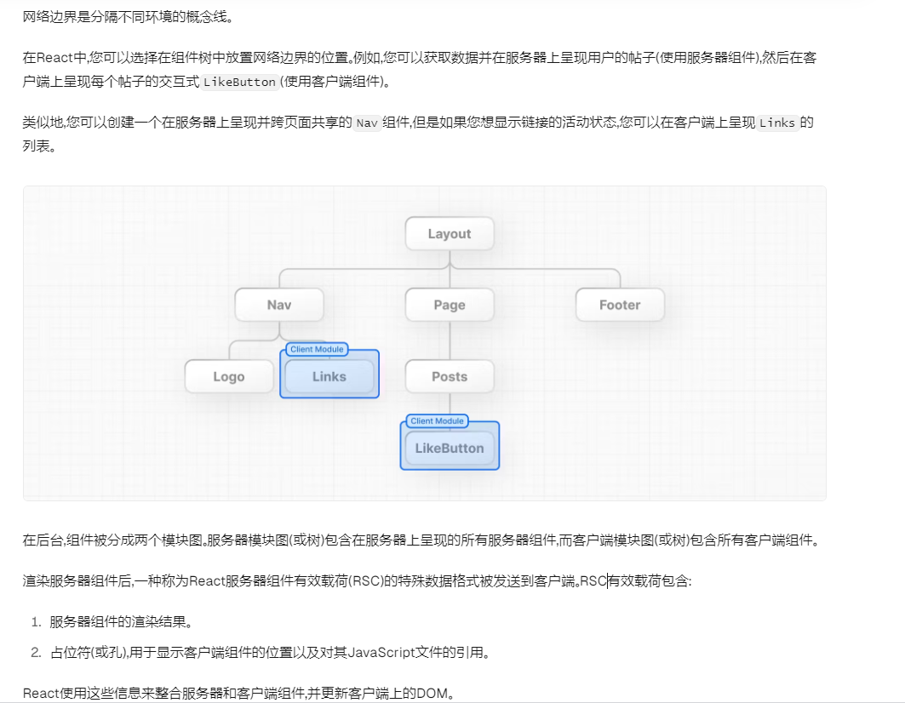
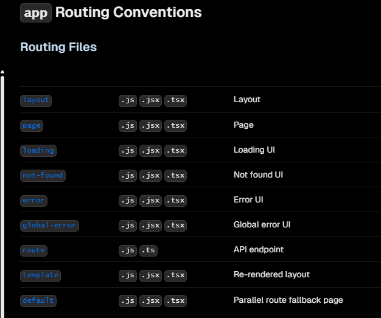
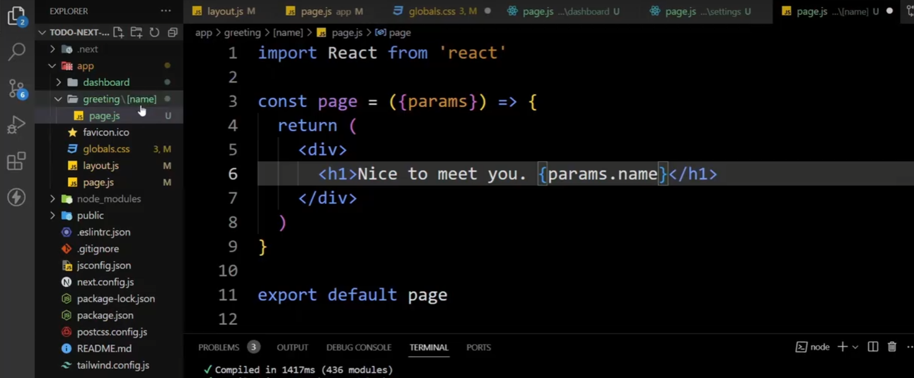
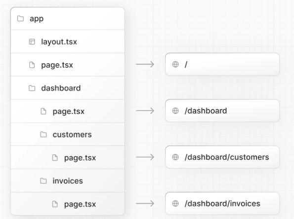

# [Next.js](https://nextjs.org/)

> - [路由](https://nextjs.org/docs/app/building-your-application/routing)：基于文件系统的路由器，构建在服务器组件之上，支持布局、嵌套路由、加载状态、错误处理等
> - 内置服务器渲染：Client-side and Server-side Rendering with Client and Server Components.通过 Next.js 在服务器上使用静态和动态渲染进一步优化 Edge 和 Node.js 运行时上的流媒体。
> - 优化：图像、字体和脚本优化，以改善应用程序的核心 Web 关键点和用户体验。
> - Next.js 现在默认附带 TypeScript，ESLint 和 Tailwind CSS 配置。
> - 特性：可添加伪后端代码，适用于文件系统、链接数据库，添加API
> - 其他特点：更好的SEO优化、潜在问题：同级页面存在操作数据库的操作，刷新响应会很慢！

## new

```sh
# 1.创建next项目 自动安装(推荐)   Node.js>=18.18
npx create-next-app@latest
```


## 基础入门


### 推荐配置

#### [mockAPI](https://mockapi.io/)

> 生成自定义数据，并使用 RESTful 接口对其执行操作

[Prisma | Simplify working and interacting with databases](https://www.prisma.io/)

> 根据数据库模式自动生成类型

#### 样式相关

- Sass支持：默认支持引入 scss 类型样式文件

- [Tailwind CSS](https://notes.wudetian.top/notes/front_end/JS周边库.html#tailwind-css)

- [UnoCSS: The instant on-demand Atomic CSS engine](https://unocss.dev/)

  - [UnoCSS 中文网 (nodejs.cn)](https://unocss.nodejs.cn/)

- CSSModule

  > 优点：
  >
  > - 生成唯一的类名标识，只在引用的位置生效，有效避免出现全局的类名冲突

  ```js
  // 新建 xxx.module.css文件
  .abc{ ... } // css样式内容
  
  // 导入css模块化样式文件
  import styles from '@/app/ui/xxx.module.css';
  // 使用模块样式
  <div className={styles.shape} />
  ```

- [clsx](https://github.com/lukeed/clsx)：实现 类名的轻松切换

  ```jsx
  // TODO: 与classnames用法一致，but classnames针对所有浏览器，clsx主要针对react中使用
  ...
  ```


### 前置概念


#### AppRouter vs PagesRouter

> 网页路由器，App Router 是更新的路由器，允许使用 React 最新功能，例如服务器组件和流。Pages Router 是最初的 Next.js 路由器，它允许您构建服务器渲染的 React 应用程序，并继续支持旧的 Next.js 应用程序。
>
> 本文以 AppRouter 为主展开：


#### [[Network Boundary 网络边界](https://nextjs.org/learn/react-foundations/server-and-client-components#network-boundary)

> - 网络边界是分隔不同环境的概念线


#### 使用客户端组件

- 请在文件顶部添加 React `'use client'`指令。这告诉 React 在客户端上渲染组件。




#### 目录结构

```sh
- app	# AppRouter路由器
- pages # PagesRouter路由器
- public # 静态资源目录
- src 	 # 可选应用程序源文件夹
next.config.js	Next.js配置文件
package.json	项目依赖项和脚本
instrumentation.ts	OpenTelemetry and Instrumentation 文件
middleware.ts	Next.js请求中间件
.env	环境变量
.env.local	局部环境变量
.env.production	生产环境变量
.env.development	开发环境变量
.eslintrc.json	ESLint 的配置文件
.gitignore	要忽略的 Git 文件和文件夹
next-env.d.ts	用于 Next.js 的 TypeScript 声明文件
tsconfig.json	TypeScript 的配置文件
jsconfig.json	JavaScript 的配置文件
```




#### 创建布局和页面

> - 使用文件系统路由创建路由
> - Next.js 使用文件系统路由，其中文件夹用于创建嵌套路由。每个文件夹代表一个映射到 URL 段的路由段。

- 创建路由页面：在 app 目录下新建文件夹，`文件夹名 = 路由名`，文件夹下的`page.tsx = 入口文件`；同理可在当前文件夹下继续嵌套更深层级的路由。

- 创建共享导航：文件夹下新建`layout.tsx 文件`，实现多个页面之间共享的 UI

- 动态路由，文件夹命名为`[xxx]`,使用中括号包裹，可实现再当前路由层级输入任何内容

  - 获取路由参数 params.xxx ， 取值为文件命名的xxx

  




### url参数的操作

- [URLSearchParams - Web API](https://developer.mozilla.org/zh-CN/docs/Web/API/URLSearchParams)

  > - `URLSearchParams` 生成对象可直接在 [`for...of`](https://developer.mozilla.org/zh-CN/docs/Web/JavaScript/Reference/Statements/for...of) 结构中，以键/值对形式，按顺序进行迭代

  ```js
  const paramsString = "q=URLUtils.searchParams&topic=api";
  // 返回一个 URLSearchParams 对象
  const searchParams = new URLSearchParams(paramsString);
  // 遍历 URLSearchParams 对象，获取每一个参数以及它的值
  for (const [key, value] of searchParams) { ... }
  
  searchParams.has('xxx');		// 返回 Boolean 判断是否存在此查询参数
  searchParams.get('xxx');		// 获取指定查询参数的第一个值
  searchParams.set('page', '1');		// 设置指定查询参数的值
  searchParams.append('xxx');      // 插入一个指定的键/值对作为新的查询参数
  searchParams.delete('xxx');      // 删除指定的查询参数及其对应的值。
                                            
  params.toString();	// 转化为字符串形式的url参数，不带 ? 号
  ```

  

- useSearchParams     NextJS方法

  > - 需要在客户端组件中使用，才能获取到url信息
  > - 在服务器组件中，应使用`req` 对象进行解析获取

  ```tsx
  import { useSearchParams } from 'next/navigation';	// next.js方法
  const searchParams = useSearchParams();		// 获取url参数
  ```

  


### 优化字体

> [Learn Next.js: Optimizing Fonts and Images | Next.js (nextjs.org)](https://nextjs.org/learn/dashboard-app/optimizing-fonts-images)
>
> 追求美观，但自定义字体的获取与加载，会明显的影响性能
>
> - CLS：chrome 评估网站性能和用户体验的指标之一，衡量网页加载中布局的稳定性
> - 浏览器显示页面->备用/系统字体->渲染显示->自定义字体下载->替换旧字体->布局偏移
> - next/front 模块，会自动优化字体
>   - 从 Google Fonts 加载字体：`next/font` 组件会自动从 Google Fonts 加载所需的字体。它会根据 `next.config.js` 中的配置，选择合适的字体文件。
>   - 优化字体大小：自动根据设备的屏幕尺寸调整字体大小。在 `next.config.js` 文件中配置 `fontSizes` 属性，可以自定义要使用的字体大小。
>   - 字体预加载：在页面加载时预加载所需的字体，从而提高页面加载速度。在 `next.config.js` 文件中配置 `preloadFonts` 属性，可以自定义要预加载的字体。
>   - 使用 `woff2` 格式：Next.js 会自动将字体文件转换为 `woff2` 格式，这种格式可以提高字体加载速度。
>   - 缓存字体：Next.js 会自动缓存加载的字体，以便在后续访问时直接使用。这可以减少网络请求，提高性能。
>   - 在build构建时，将字体和静态资源打包在一起，避免依赖外部的三方请求

- [subsets 配置项](https://fonts.google.com/knowledge/glossary/subsetting) 【需科学上网】
- 推荐 tailwind css属性`antialiased`  // 让字体拥有更平滑的触感

```jsx
// 导入Inter、Lusitana 两种 谷歌字体
import { Inter,Lusitana } from 'next/font/google'
// 使用Inter字体中的拉丁字符集【大写字母A到Z，小写字母a到z，以及数字0到9】
export const inter = Inter({ subsets:['latin'] })	
// 使用Lusitana字体中的拉丁字符集,以及weight为400 和700的部分
export const lusitana = Lusitana({ subsets:['latin'],weight:['400','700'] })	

// 全局使用inter字符集 本质是个字符串
( <body className={`${inter.className}`}>....</body> )

// 局部使用Lusitana字体
(<div className={`${lusitana.className}`}>....</div>)


```


### 优化图片

> - 优化点
>   - 防止在加载图像过程中发生布局偏移
>   - 自动调整图像大小，为客户端提供尺寸合适的图片，避免大图到小屏幕，而浪费带宽
>   - 默认懒加载（图像将要进入视口时再加载）
>   - 转化使用现代化的图像格式，例如 [WebP](https://developer.mozilla.org/en-US/docs/Web/Media/Formats/Image_types#webp) 和 [AVIF](https://developer.mozilla.org/en-US/docs/Web/Media/Formats/Image_types#avif_image)

- 使用 `<Image>` 组件 替换 HTML 的``标签
- 设置图片具体的宽高【宽高比】是个较好的行为

```jsx
import Image from 'next/image';

export default function Page() {
  return (
    // ...
      <Image
        src="/hero-desktop.png"
        width={1000} // 单位px
        height={760} // 单位px
        className="hidden md:block"  // 在桌面端才显示，其他设备中隐藏，移动端优先的写法
        alt="Screenshots of the dashboard project showing desktop version"
      />
      <Image
        src="/hero-moblie.png"
        width={1000} // 单位px
        height={760} // 单位px
        className="block md:hidden"  // 在移动端才显示，其他设备中隐藏，移动端优先的写法
        alt="Screenshots of the dashboard project showing moblie version"
      />
    //...
  );
}
```


### 文件路由

- `app/*/*`     文件夹名	===	url 路由名
  - `page.tsx`	路由的入口文件
  - `layout.tsx` 布局模板文件
    - children 参数类似于vue中的 `<router-view />`
    - 多个子路由中【共享数据】，也利于实现局部渲染
    - 当前目录如果存在`page.tsx`，也会作为单独的路由页存在于当前的 `layout.tsx`
  - `loading.tsx`  预备UI，在页面渲染未完成时的占位，用于做loading骨架屏效果！
  - `error.tsx`   错误处理UI，必须是客户端组件，当前级别页面出错时展示
  - `not-fount.tsx` 通过逻辑判断，手动调用错误展示，优先级高于error.tsx【更具体 de 自定义错误处理】
- `(xxxx)`    路由组
  - 小括号包裹的文件夹，用来分类当前路径下的所有路由，可做不同的`page\layout\loading.tsx`配置
  - url 路径中并不会包含 xxxx

- `[xxx]`     [动态路由](https://nextjs.org/docs/app/building-your-application/routing/dynamic-routes)，此处的路由段为任意值
  - 可在路由跳转中传任意值，并在当前路由的所有子路由page.tsx中，通过 params.xxx获取动态参数
  
- 目录下的其他文件，不会被暴露在浏览器的路由中，只有 page.tsx

```tsx
// page.tsx
export default function Page(){
    return <h1>Page页面-路由入口</h1>
}

// layout.tsx	根路由
import {inter} from '@/app/ui/fonts'	// 引入优化的字体
export default function RootLayout({children}:{children:React.ReactNode;}){
    return (
        <html lang='en'>
        	<body className={`${inter.className}`}>{children}</body>	<!--设置全局字体+路由总入口 -->
        </html>
    )
}

// layout.tsx   子路由
import SideNav from 'xxxx'
export default function Layout({children}:{children:React.ReactNode}){
    return (<div> 
                <SideNav /> 
                <div>{children}</div> 
            </div>);
}


// 动态路由参数
// app/blog/[post]/page.tsx
export async function generateMetadata({params}){
    console.log(params.post);	// 获取动态路由的参数值
    return{
        title:params.post,	// 自定义浏览器标签页的文字
    }
}
// app/blog/[post]/layout.tsx
export default const BlogLayout = ({children})=>{
    return children;
}


// error.tsx 错误处理UI - 客户端组件
'use client'
import { useEffect } from 'react'
export default function Error({error,reset}:{
    error:Error & { digest?: string};	// 错误信息
    reset: ()=>void;	// 重试函数
}){
    useEffect(()=>{
        console.log(error);
    },[error])
    return (<div>
            	<p>页面出错了！！！</p>
                <button onClick={()=>reset()}>重试</button>
            </div>)
}


// notFound 函数
import { notFound } from 'next/navigation';
....
// 当不满足需求时，手动调用notFound函数触发错误，展示当前路由下的not-font.tsx内容
if (!invoice) {
    notFound();
}
....
```


### 路由跳转

- `<Link>` 组件替代 `<a>`标签
  - 优点：
    - 基于路由刷新页面，不会造成浏览器的刷新
    - 如果页面的某一部分发生错误❌，其他部分依旧可以正常展示
    - 代码自动分割（基于路由的分割刷新）
    - 代码预取（链接出现在可视区，提前加载背后的内容）

- `usePathname`
  - 获取当前url


```tsx
// 导入Link
import Link from 'next/link'
// 使用Link
<Link href='xxx'>
    
// 基于页面url，设置激活状态
'use client'
import { usePathname }  from  'next/navigation'
const pathname = usePathname()
//  设置样式，通过判断 link的 href与pathname 是否一致
```


### 配置数据库

......略（官网教学使用vercel数据库，可从   [Node.js操作  MySQL](https://notes.wudetian.top/notes/database/MySQL.html#nodejs操作) 中参考数据库的操作，使用大致同理）


### 获取数据及API

> - 写对外开放的API接口：使用 [Route Handlers](https://nextjs.org/docs/app/building-your-application/routing/route-handlers) 创建API端点
> - Next.js将数据的获取过程保留在服务端，更加安全
> - **Next.js 默认使用服务器组件   RSC**，提高应用程序的性能
>   - 在服务端完成 数据+模板 的组合形成具体页面
>   - 不再需要API的映射，在服务器端完成数据的组合，不会暴露敏感信息


#### 请求瀑布

- 产生原因：数据请求无意中会相互阻塞，造成多个请求的等待，从而影响性能！
  - “瀑布”是指依赖于先前请求的完成的网络请求序列，例如先获取id，再获取id下的相关数据
- 使用 await 一堆请求造成

#### 并行数据获取

- 同时发起所有请求 - 并行、提高性能
- 使用` Promise.all() `或` Promise.allSettled()`函数同时启动所有promise

```tsx
// 请求瀑布
await getOneData();
await getTwoData();
await getThreeData();

// 并行数据获取 举例：
const invoiceCountPromise = sql`SELECT COUNT(*) FROM invoices`;
const customerCountPromise = sql`SELECT COUNT(*) FROM customers`;
const invoiceStatusPromise = sql`SELECT
         SUM(CASE WHEN status = 'paid' THEN amount ELSE 0 END) AS "paid",
         SUM(CASE WHEN status = 'pending' THEN amount ELSE 0 END) AS "pending"
         FROM invoices`;
const [data1,data2,data3] = await Promise.all([
      invoiceCountPromise,
      customerCountPromise,
      invoiceStatusPromise,
]);
```


### 静态/动态渲染

> NEXT.JS默认状态下为 【静态渲染】，

- 静态渲染
  - 服务器端进行构建，不在客户端中执行，而是在服务端进行执行
  - 实验：
    - 强制刷新静态渲染的页面，只会在服务器中打印log，客户端中不执行
    - 链接跳转，并不会向服务器发起请求，不会打印 log
    - **☆** 在数据库中修改数据，服务器不会自动的进行重新渲染，【在构建部署 build 时就完成】
- 动态渲染
  - 内容在请求时，由服务器为每个用户生成不同内容
  - `unstable_noStore`    局部退出静态渲染 【实验性API】
  - [Route Segment Config](https://nextjs.org/docs/app/api-reference/file-conventions/route-segment-config)   基于 page 或 layout 配置渲染行为  【稳定的API】
  - 使用动态呈现，应用程序的速度受最慢的数据获取速度影响，延迟到它获取后再返回。

```tsx
import { unstable_noStore as noStore } from 'next/cache'
export async function fetchRevenue( query: string, currentPage: number,) {
  // 使用 noStore() 退出局部的静态缓存； 相当于 fetch(..., {cache: 'no-store'}).
  noStore();
  // ...
}

// 基于 page.tsx 或 layout.tsx 配置动态或静态渲染
export const dynamic = "force-dynamic"
```

|                    | 静态渲染                                                     | 动态渲染                               |
| ------------------ | ------------------------------------------------------------ | -------------------------------------- |
| 数据获取和渲染时机 | build构建 或 [重新验证](https://nextjs.org/docs/app/building-your-application/data-fetching/fetching-caching-and-revalidating#revalidating-data)期间，缓存到cdn中不再变化 | 服务器，每次请求时就渲染               |
| 渲染结果           | 静态 html，可被分发、缓存、利于SEO                           | 实时数据、特定用户的内容、请求数据获取 |
| 适用场景           | 没有数据，或可共享数据的UI结构                               | 需要定期更新、使用个性化数据的UI结构   |


### Streaming流

> 目的：在数据获取缓慢情况下，改善用户体验

- Stream 流：一种数据传输技术，它允许您将路由分解为更小的“块”，并在它们准备就绪时将它们从服务器逐步流式传输到客户端。
  - 防止缓慢的数据请求阻塞整个页面
  - 允许用户查看页面的各个部分并与之交互，而无需等待加载所有数据
- 实现方式 - 并行呈现各个块
  - `loading.tsx`文件：路由级流，在页面渲染完成前的替代品，骨架/loading效果！
    - 一般用于动态渲染的界面
    - 在文件系统中外层的位置，适用于下级所有页面，可通过 [Route Groups](https://nextjs.org/docs/app/building-your-application/routing/route-groups) 进行分类，改变这一行为。
  - `<Suspense>`：细粒度、特定组件的流

```tsx
// 使用 loading.tsx 流式传输 整个路由页 与 page.tsx平级
// 将当前loading效果仅作用在当前组件: 利用Router Group在当前目录下新建 (xxx) 并将page.tsx 和 loading.tsx 移入即可
export default function Loading(){
    return <div>loadin....</div>
}


// 使用 <Suspense> 实现细粒度流
import { Suspense } from 'react';
import { RevenueChartSkeleton } from '@/app/ui/skeletons';
...
// 使用 Suspense 包裹，需要动态渲染的特定组件，并提供fallback组件用于loading效果
<Suspense fallback={<RevenueChartSkeleton />}>
	<RevenueChart />
</Suspense>
```


#### 部分预渲染【实验】

- 现状：
  - 大多数路由并不是完全静态或动态的，但处理时是，默认会按照完全静态或动态处理`export const dynamic = "force-dynamic"`
- 部分预渲染
  - 提供静态路由外壳，隔离路由的动态部分，并行进行加载
- 使用：
  - Suspense 包装组件不会使组件本身成为动态的，只作为路由的静态和动态部分之间的边界。
  - 单独使用`unstable_noStore`实现此行为，
  - [Partial Prerendering](https://nextjs.org/docs/app/api-reference/next-config-js/partial-prerendering)


### 添加搜索和分页

> 使用url参数：可被共享、可被服务器获取和渲染、便于用户行为追踪

- `useSearchParams`：访问当前url参数例：`?page=1 ==> {page:"1"}`
- `usePathname`：获取当前url路径名：`/dashboard/invoices`
- `useRouter`：编程式路由导航实现：[ useRouter ](https://nextjs.org/docs/app/api-reference/functions/use-router#userouter)

```tsx
'use client';	// 声明客户端组件
 
import { MagnifyingGlassIcon } from '@heroicons/react/24/outline';
import { useSearchParams, usePathname, useRouter } from 'next/navigation';
 
export default function Search() {
  const searchParams = useSearchParams();	// 获取url参数
  const pathname = usePathname();	// 获取url路径
  const { replace } = useRouter();	// 获取路由跳转方法
 
   // term 当用户输入搜索词时触发 
  function handleSearch(term: string) {
    const params = new URLSearchParams(searchParams);	// 创建url参数对象
    if (term) {
      params.set('query', term);	// 设置url参数的query参数
    } else {
      params.delete('query');
    }
    replace(`${pathname}?${params.toString()}`);	// 路由replace跳转,Next中跳转并不会造成刷新
  }
    
    return (
    	<input placeholder={placeholder}
  			onChange={ (e) => handleSearch(e.target.value) }
  			defaultValue={searchParams.get('query')?.toString()} 	// 同步url参数，或使用state
     	/>
    )
}

```


### Server Actions

> - React Server Actions：
>   - 允许您直接在服务器上运行异步代码，无需通过API改变数据
>   - 通过POST请求、加密闭包、严格的输入检查、错误消息哈希和主机限制等保障安全
> - 关于 from标签 的 action 属性
>   - html中：向`action`属性传递URL，提交表单的地址
>   - React中：特殊的属性，Server Actions，传入一个服务器函数
>   - Server Actions 执行时机：点击表单提交时执行在服务器中
> - 数据验证的三方工具库 - [Zod](https://zod.dev/)

- 服务器操作与Next.js[缓存](https://nextjs.org/docs/app/building-your-application/caching)深度集成。当通过服务器操作提交表单时，不仅可以使用该操作来改变数据，还可以使用`revalidatePath`和`revalidateTag`等API重新验证关联的缓存。
  - Next.js使用 - [客户端路由器缓存](https://nextjs.org/docs/app/building-your-application/caching#router-cache)，在用户浏览器中[预取](https://nextjs.org/docs/app/building-your-application/routing/linking-and-navigating#1-prefetching)+存储路由数据，确保用户路由的快速切换，同时减少向服务器发出的请求数量。
  - 当通过Server action 操作数据库后，希望清除缓存并触发对服务器请求时，可使用实现

- `<from>`
  - `<from>`标签的`action`属性，将自动接收包含捕获数据的本机 FormData对象【在React中】
  - 即使用户禁用 JavaScript，依据可以工作
- [`revalidatePath`](https://nextjs.org/docs/app/api-reference/functions/revalidatePath)函数：清除指定路由页的缓存，获取最新数据`import { revalidatePath } from 'next/cache';`
- [`redirect`](https://nextjs.org/docs/app/api-reference/functions/redirect)函数：重定向用户的路由，`import { redirect } from 'next/navigation';`

```tsx
/* 案例：通过from组件的action进行向数据库，提交新的数据 */
// actions.tsx 文件，创建Server action操作
'use server'		// 将该文件导出的函数标记为服务器函数，可通用的导入客户端和服务器组件中
import { revalidatePath } from 'next/cache'
import { redirect } from 'next/navigation';
import {z} from 'zod'		// 数据预处理 - 借助 zod三方库
const FormSchema = z.object({
    id: z.string(),
    customerId: z.string(),		// 检查customerId是否存在，并且值为string
    amount: z.coerce.number(),	// 强制转化为number类型
    status：z.string()
})
const CreateInvoice = FormSchema.omit({ id:true });		// 在已有验证器的基础上移除某个字段的规则，生成新的验证器
export async function createInvoice(formData: FormData) {
	// 将获取的表单数据进行 预处理,得到最终值
	const { customerId,amount,status } = CreateInvoice.parse({
    	customerId: formData.get('customerId'),
    	amount: formData.get('amount'),
    	status: formData.get('status'),
	});
    // .... 操作数据库
    revalidatePath('/dashboard/xxxx');	// 清除指定路由页面的缓存，获取最新数据
    redirect('/dashboard/xxx');		// 重定向用户的页面，实现数据的更新
}


// from 表单组件.tsx
import { createInvoice } from '@/app/lib/actions';
export default function Form({ customers, }: { customers: customerField[]; }) {
    /* async function create(formData: FormData) {
		'use server';		// 也可直接添加'use server'编写Server Actions   
		// .... 
	} */
  	return (
        <form action={createInvoice}>	<!-- 配置action属性，传入数据处理的Server Actions函数 -->
          // ...
  	)
}
```

```tsx
/* 案例：编辑现有的数据，并更新到数据库 */
// 1.将初始数据展示到编辑区，用户通过修改并提交完成更新
// - 技巧点：在from标签的action中传递多个参数时，默认只有一个参数为表单数据，通过bind方法，const xxaction = actionFn.bind(null,id),确保传递给服务器的数据都经过编码
// 或通过使用隐藏的input作为表单内容提交，但不安全，可在源码中看到
// <input type="hidden" name="id" value={invoice.id} />
/* 案例：删除数据  */
```


### 错误处理

- 使用`try/catch`语句包裹数据库操作【服务器报错】
- `error.tsx`错误处理文件，与page.tsx同级，当前级别路由发生错误时，使用error.tsx组件代替展示 - 客户端组件！【页面所有报错】
- `not-fount.tsx` 通过逻辑判断，手动调用错误展示，优先级高于error.tsx【更具体 de 自定义错误处理】


```tsx
// try/catch 捕获错误
try {
  await sql`
    INSERT INTO invoices (customer_id, amount, status, date)
    VALUES (${customerId}, ${amountInCents}, ${status}, ${date})
  `;
} catch (error) {
  return {
    message: 'Database Error: Failed to Create Invoice.',
  };
}

// error.tsx 错误处理UI - 客户端组件
'use client'
import { useEffect } from 'react'
export default function Error({error,reset}:{
    error:Error & { digest?: string};	// 错误信息
    reset: ()=>void;	// 重试函数
}){
    useEffect(()=>{
        console.log(error);
    },[error])
    return (<div>
            	<p>页面出错了！！！</p>
                <button onClick={()=>reset()}>重试</button>
            </div>)
}

// notFound 函数
import { notFound } from 'next/navigation';
....
// 当不满足需求时，手动调用notFound函数触发错误，展示当前路由下的not-font.tsx内容
if (!invoice) {
    notFound();
}
....
```


### 可访问性|表单验证

> - 可访问性/无障碍：例如：图片的alt属性，在无障碍模式下，触摸到图片会读出alt的内容
>   - nextJS默认安装了`eslint-plugin-jsx-a11y`插件，可用于检查代码是否符合**可访问性**要求
> - 表单验证
>   - 如何实现服务器端的表单数据进行验证，并展示错误信息到用户界面？
>   - 客户端验证存在局限性，服务器验证兜底保障数据安全！

- `eslint-plugin-jsx-a11y` 辅助检验可访问性问题
- `useFormState`   客户端hook
  - 

```tsx
// 1.在package.js 中添加 lint 指令
"scripts": {
    "build": "next build",
    "dev": "next dev",
    "seed": "node -r dotenv/config ./scripts/seed.js",
    "start": "next start",
    "lint": "next lint"
},
npm run lint	// 2.运行指令，检查代码，根据提示修改代码【build构建过程的一部分】
```


[Learn Next.js: Improving Accessibility | Next.js (nextjs.org)](https://nextjs.org/learn/dashboard-app/improving-accessibility)

[ Next.js-14-表单验证 Form Validation丨useFormState](https://www.bilibili.com/video/BV1Zf421d7NL/?spm_id_from=333.1007.top_right_bar_window_history.content.click)


## 其他


### 修改tsconfig.json，防止vercel部署报错

```json
"baseUrl":".",
"paths":{
   "@/*":["./*"]
   "@/app/*":["app/*"]
}
```


### 部署在服务器子路径

[Next.js 静态站如何部署在子路径 - 手册 (toulan.fun)](https://manual.toulan.fun/posts/nextjs-deploy-static-site-to-sub-folder/)

### API设置

```js
import { NextResponse } from 'next/server';
```


## 问题解决

#### 编辑器报错

> 编辑器中 import 处红色错误 : Cannot find module 'next/babel'

- 解决办法：

  ```json
  // 根目录创建 .babelrc 文件夹
  {
      "presets": ["next/babel"],
      "plugins": []
  }
  
  // 根目录创建 .eslintrc 文件夹
  {
    "extends": ["next/babel","next/core-web-vitals"]
  }
  ```
