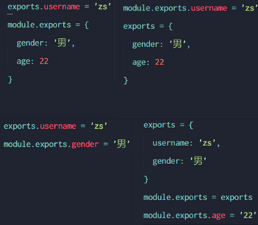
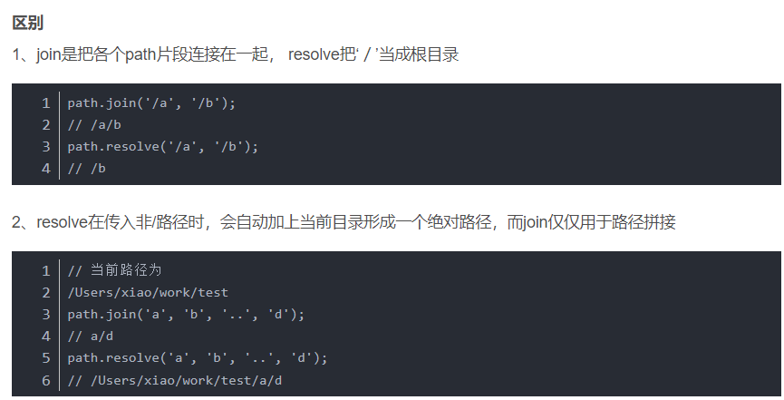
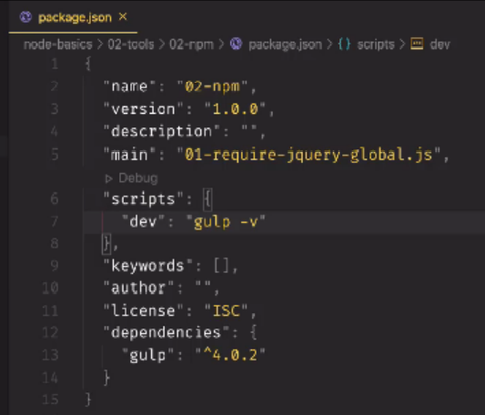
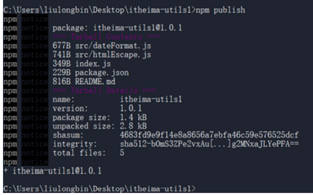
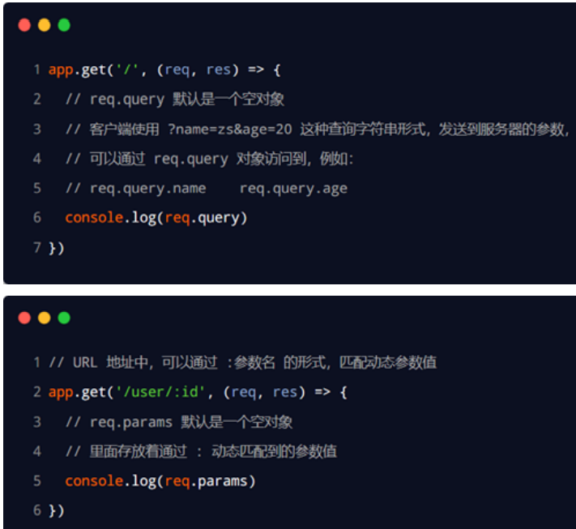
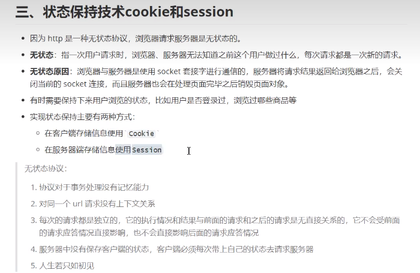
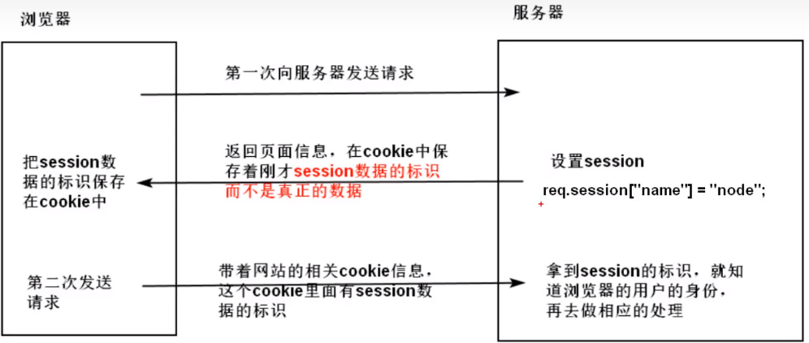

<WaterMark />
[前言 · 千锋大前端小册-GP19-Node.js (gitee.io)](https://lurongtao.gitee.io/felixbooks-gp19-node.js/)

[Node.js专业中文社区 (cnodejs.org)](https://cnodejs.org/)

# Node.js

### Node.js

- node：基于v8引擎的javascript运行环境，提供了一些特定的api；

- 可以实现的功能：

  - web 服务器、命令行工具、网络爬虫、桌面应用程序开发、app、游戏
  - 读写和操作数据库、创建使用的命令行工具辅助前端开发
  - 嵌入式（物联网设备）、在树莓派上使用node.js
  - 作为硬件控制工具代替C/C++,Noduino允许经由websocket或串来凝结实现arduino访问
  
- 常用框架

  - [基于Express框架]([Express - 基于 Node.js 平台的 web 应用开发框架 - Express 中文文档 | Express 中文网 (expressjs.com.cn)](https://www.expressjs.com.cn/))，可以快速构建web应用

    基于electron框架，可构建跨平台的桌面应用

    基于restify框架，可快速构建api接口项目

- Node.js特性

  - 可解析js代码( 没有浏览器安全级别限制) 提供很多系统级别的API
  - Node.js 网络通信；无浏览器安全杀箱，不存在跨域
  - 文件读写、进程管理
  
- node.js特点

  - 借助谷歌V8引擎，更高效的处理并发、异步等性能问题
  - 单线程、事件驱动、异步输入和输出
    - 主线程为单线程，阻塞部分由线程池处理。大多数的I/O请求都为异步请求，从而避免上下文频繁切换的耗时操作，具有高并发的特点
  - 能够支持跨平台功能
  - 异步队列
    - 使用异步队列，通过不断地循环队列从而等待程序进程的处理
    - 例如SQL查询、涉及硬盘、网络等延时较长的操作，php代码会产生阻塞，从而影响后续代码的执行；而Node.js使用异步队列的回调函数，只有当SQL执行完毕，才会执行相应的回调函数，避免阻塞程序执行的问题
  - 基于事件与回调
    - Node的异步操作是基于事件和回调完成的，例如：磁盘I/O、网络通讯、数据库查询
    - 核心：拥有一个事件循环，判断是否有事件，有则执行；然后再判断是否有相关的回调，有则执行；最后事件执行完毕。
    - 优点：增加了Node.js应用程序运行的健壮性和可用性
    - 缺点：不符合正常的线性开发思路，容易出错
  - 绝大多数API都是基于事件驱动、异步风格、非阻塞
    - 代码的执行并不依赖他们出现的位置、而是等待相应的事件被触发
    - 异步执行的回调无须阻塞的等待其他操作，充分利用系统资源

- 注意事项：

  - 可以使用：ES6这些js语法、node提供的API，但没有浏览器的DOM、BOM
  - 实际开发的文件命名建议使用全英文


####  windows命令行

- PowerShell  cmd    两种window版本工具，powershell为新版的，相比于cmd的功能更完善
  - PowerShell的使用，在目录文件夹下，鼠标右键`在windows终端下打开`即可

  - cmd 的使用，win+R  cmd进入


#### [NVM](https://www.cnblogs.com/cencenyue/p/10430618.html)

> - nvm - node版本控制工具
> - [Releases · coreybutler/nvm-windows · GitHub](https://github.com/coreybutler/nvm-windows/releases)
> - https://github.com/nvm-sh/nvm

- Node版本的管理工具 当需要多个版本的node时，使用Nvm可以同时管理过个版本；

- `安装Nvm之前，需要删除现有的node`

- 加快node下载的速度
  - nvm安装后，打开安装的目录文件setting.txt
    -  C:\Program Files\nodejs
  - 我的安装目录：C:\Users\wzt\AppData\Roaming\nvm
  - 加入：node_mirror:https://npm.taobao.org/mirrors/node/
    npm_mirror:https://npm.taobao.org/mirrors/npm/


#### 异常事件机制

> 可通过 try-catch 来捕获异常。如果异常未捕获，则会一直从底向事件循环冒泡。如是冒泡到事件循环的异常没被处理，那么就会导致当前进程异常退出


#### 常用命令

- #### **node相关**

```sh
node           # 在控制台进入node开发环境
node -v        # 查询当前node版本
node 文件名   # 执行node文件

ctrl + c       # 退出node的运行
```

- **nvm相关命令**（管理员身份）

```sh
nvm -v             # 查看当前nvm版本
nvm list           # 查看当前机器上安装了哪些node版本
nvm install 版本号        # 安装对应版本的node（例：nvm install 16.0.1） 
nvm install latest       # 安装最新版本的node
nvm uninstall 版本号      # 卸载指定版本的node
nvm use 版本号            # 选择使用指定版本的node
nvm on         # 启用node.js版本管理，即nvm
nvm off        # 禁用nvm，但不卸载任何版本

nvm alias default 版本号		# 设置node的默认版本号
```

- **Yarn—包管理工具**

```shell
# 由Facebook、Google等联合发布的全新JS包管理器，用于替代 NPM的快速、可靠、安全的包管理工具
  # 离线模式：已经下载过的包，使用时无需重复下载
  # 网络恢复：下载失败后，会自动重新请求，避免整个安装过程失败
  # 多个注册表：能从NPM或Bower安装任何包，也能保证各平台安装的一致性
  # 扁平化模式：将不匹配的安装包解析为同一个版本，避免重复创建
  # 确定性：无论安装顺序如何，在不同机器上会以完全相同的方式进行安装
    # 在初次安装依赖包时生成 yarn.lock文件，用于确保安装包的确定性
npm i -g yarn  # 使用npm 全局安装yarn

yarn --version      # 查看yarn版本
yarn init           # 生成项目package.json文件
yarn add 包名        # 安装依赖包
yarn add 包名 -dev   # 安装依赖包并记录在 dependencies节点，开发依赖包
yarn upgrade 包名@版本    # 升级指定的包的指定版本
yarn remove  包名@版本    # 移除指定的指定版本的依赖包
yarn global add 包名      # 全局安装指定包 

yarn install      # 一次性安装package.json 中的依赖包
yarn install -flat             # 安装一个包的单一版本时添加 -flat
yarn install -force            # 强制重新下载使用  -force 
yarn install --production      # 只安装生产环境依赖的包 --production

yarn global bin      # 查看yarn安装的路径

yarn run dev      # 运行项目
yarn run build    # 编译项目

yarn config set registry https://registry.npm.taobao.org   # 切换yarn下载源
```

- [pnpm](https://www.pnpm.cn/cli/remove)

  > 创建非扁平的node_modules
  >
  > 使用到软连接、硬链接

```shell
npm i -g pnpm 	# 安装前提：node>=16.14

pnpm dev		# 直接启动当前项目
pnpm -F 项目名 dev	# 在根目录通过-F过滤执行命令
pnpm add <pkg>	# 安装软件包以及其依赖的任何软件包，默认为生产依赖项 -D开发依赖
pnpm install	# 安装依赖
pnpm uninstall	# 卸载依赖
pnpm update		# 升级依赖
pnpm remove		# 从 node_modules 目录下和 package.json 文件中删除软件包。

pnpm import		# 将其他包管理器的 配置文件生成对应 pnpm-lock.yaml


monorepo架构：
# 在外层目录建立node_modules，可供内部所有项目使用
pnpm init 	# 步骤1：根目录创建package.json初始化文件
# 步骤2：根目录创建 pnpm-workspace.yaml 文件，并写入：
packages:
 -	'main'
 -  'web/**'
pnpm i	# 步骤3：安装依赖


优势：
- 基于软连接/硬链接的技术
可以将某块公共部分的代码提取在外层，并由多个项目共同使用
pnpm -F main add common # 给main项目添加common的内容
import {xxx} from common # 在main项目中引入common
```

- `pnpm run dev`和`pnpm dev`的区别：

  > `pnpm run dev` 需要您在命令行中指定要运行的项目的入口文件（通常是 `index.js` 或 `main.js`），而 `pnpm dev` 则会自动查找项目中的 `package.json` 文件中指定的入口文件。


- **PM2**

```shell
# Node.js 应用进程管理器
npm i pm2 -g   # 安装PM2
pm2 start app.js   # 以守护进程的方式运行app.js文件
pm2 -h       # 查看所有的 pm2命令
pm2 list     # 查看当前运行的所有应用 及 对应id
pm2 stop id  # 停止id对应的应用
pm2 restart id   # 重启node应用
pm2 restart all  # 重启所有node应用
```

- **其他命令**

```sh
ping 网址(www.baidu.com)       # 查看对应网址(百度)服务器的ip地址
exit            # 退出命令行
d:              # 进入D盘
dir             # 查看此文件下一级的目录
Tab 键          # 自动补全内容
cd 文件名       # 进入文件
esc            # 快速清空当前输入的命令
⬆️         # 快速定位到上一行命令
```

（查看文件中：显示`<DIR>`表示它是个文件目录；时间表示此文件最后一次的修改时间 ）


### 全局对象

> - 全局对象：浏览器中 - window       Node.js中 - global
> - Node.js中声明的**变量**，不会直接挂载到global上，但global上挂载的内容可以在任何地方使用
> - ES2020：新增 `globalThis`指向顶级对象，不同环境下`global == globalThis  global == window`

- 交互模式下
  - this 指向`global`
  - 交互模式下只有module.exports，没有exports
- js文件下
  - `this指向exports`，即js模块导出的对象
  - exports 是 module.exports的引用，只有文件中才存在exports
  - 在js文件下执行Node的`全局this≠global`,this指向的是当前这个js模块


#### module 对象

- 每个 .js 文件(模块) 都有一个 module对象；存储当前模块相关的信息
- module.exports 对象
  - 自定义模块中，可使用 module.exports对象，将模块内的成员共享出去，供外界使用。
  - 使用 require() 方法导入自定义模块时，导入的结果，以 module.exports 指向的对象为准。
  - 为简化向外共享成员的代码，Node提供了 exports对象，与 module.exports 等价。
  - <span style='color:hotpink'>默认情况下，exports和module.exports 指定同一个对象</span>
- 注意 :得到的永远是 module.exports对象
  - 
  - 图一：{ gender:男;age:22 }
  - 图二：{ username:zs }
  - 图三：{gender:男 }
  - 图四：{ username:zs; gender男; age:22}
  - <span style='color:hotpink'>为防止冲突，不要在同一个模块中同时使用 exports 和 module.exports</span>
  
  


#### process对象

> process 对象是一个全局变量，提供了有关当前 Node.js 进程的信息并对其进行控制。 作为全局变量，它始终可供 Node.js 应用程序使用，无需使用 require()。 也可以使用 require() 显式地访问。

- `process.env`  属性会返回包含用户环境的对象

```js
// process.argv 获取到执行文件时，命令行执行的所有参数，作为元素放在这个的数组中(字符串形式)
// 使用场景之一：可以用来做命令行工具(拿到命令行输入的内容，再执行一些操作)
console.log(process.argv)    // 打印一个数组
// 例：拼接字符串
console.log(process.argv[1]+process.argv[2])

// process.arch  得到执行环境的系统位数 x64 x32 ...
console.log(process.arch)
```


#### console对象

- 支持：

  - 格式化输出 

  - 清空控制台  console.clear()

  - 对输出的内容进行计数   console.count()

  - 打印堆栈踪迹 console.trace()

  - ```js
    console.log("我爱你");  // 在控制台打印我爱你
    
    // 支持格式化输出  %s为字符串   %d为相关的数字
    console.log('我的%s已经%d','猫',2);     // 输出：我的猫已经2岁了
    
    console.clear();        // 清空控制台
    console.count();        // 对输出的内容进行计数  结果形式 1：内容  下次还是指针的内容时 2：内容
    ```

    

- console.log()

  ```js
  // 用法与传统中一致
  // 可以利用占位符 定义输出的格式， %d 表示数字  %s表示字符串
  // 使用%d占位后，对应位置如果不是数字，会输出NaN
  console.log("%s%s",'node.js','is','powerful');  // node.js is owerful
  console.log('%d'，'node,js');   //NaN
  ```

- `console.info(); console.warn(); console.error() `输出的结果与console.log()输出的内容一致

- console.dir()

  ```js
  // console.dir() 用于将一个对象的信息打印到控制台
  const obj = {
     name:'node.js',
     get:funtion(){
        console.log('get');
     },
     post:funtion(){
        console.log('post');
     }
  }
  console.dir(obj); // { name: 'node.js', get: [Function: get], post: [Function: post] }
  ```

- console.time() 和 console.timeEnd()

  ```js
  // 用于统计一段代码的运行时间
  // 使用方法:在代码块的开始和结尾分别放置console.time() 和 console.timeEnd()
  // 并传入同一个参数,再一段代码中可以存在多个计时代码对
  
  console.time('one');
  console.time('two');
  for(var i=0;i<10;i++){
     var a = i;
  }
  console.timeEnd('two');
  console.time('three');
  for(var i=0;i<10;i++){
     var a = i;
  }
  console.timeEnd('three');
  console.timeEnd('one');
  // 控制台输出：
  // two: 0.102ms
  // three: 0.01ms
  // one: 8.835ms
  ```

- console.trace()

  ```js
  // 输出当前位置的栈信息，需要传入任意参数作为标识
  ？？？
  ```

- console.table()

  ```js
  // 用于将数组格式的信息以表格的形式输出
  // 参数：任意结构形式的数组信息，譬如对象、数组等
  const arr={
     A：{ name:'wu',id:1},
     B：{ name:'wu',id:2},
     C：{ name:'wu',id:3},
  }
  
  console.table(arr);   // 输出内容为表格 行；index  name   id
                                       //  A       wu     1   ....
  ```
  
  


### 内置模块


#### Buffer类型

> - 在处理文件流时，必须使用到二进制数据。但 JS中没有，因此Node.js中定义Buffer，主要用来存放二进制数据的缓冲区，用于表示固定长度的字节序列
> - 中文译为【缓冲区】，**固定长度**的内存空间，用于处理二进制数据
> - 特点：大小固定无法调整、性能好，直接操作计算机内存、每个元素的小为1字节byte
> - 注意点：
>   - Buffer 是Node.js内置模块，启动时自动导入，无需手动引入
>   - Buffer 的每个字节为8bit，溢出超出时会自动**舍去高位**的值
>   - 对应中文字符，每个字占3个字节

| 方法                    | 描述                                                         |
| ----------------------- | ------------------------------------------------------------ |
| Buffer.from('hello')    | 通过字符串创建 buffer                                        |
| Buffer.alloc(10)        | 创建一个可以存放10个字符的buffer对象，用不到位置它默认会由00占位 |
| Buffer.allocUnsafe(100) | 创建定长buffer，默认为旧的值，速度更快                       |
| buf3.write('abc')       | 往buffer对象中写入信息(转2再转16存起来)                      |
| .toString()             | 将16进制buffer内容 转为可识别的内容                          |

```js
// 创建buffer对象
let buf = Buffer.alloc(10);   // 创建一个10字节空间的buffer，每个bit位默认被清为0
let buf_2 = Buffer.allocUnsafe(10);  // 创建一个10字节空间的buffer，每个bit位默认为旧的值
let buf_3 = Buffer.from('hello');   // hello 先转unicode再转二进制 68 65 6c

let buf1 = Buffer.from([97,98,99]);   // 根据一个数组创建Buffer对象
console.log(buf1);    // <Buffer 61 62 63> 以16进制形式存储在Buffer对象中
console.log(buf1.toString());  // abc 将buffer内容转为可识别的内容


let buf2 = Buffer.from('nodejs');     // 根据一个字符串创建Buffer对象

let buf3 = Buffer.alloc(10);   // 创建可以存放10个字符的buffer对象
buf3.write('abc');             // 按照ASCLL表的价值，转16进制，存在Buffer中
```


#### fs 文件系统模块

| 方法                               | 描述                                                         |
| ---------------------------------- | ------------------------------------------------------------ |
| fs.readFile()                      | 读取指定文件中的内容，异步读取                               |
| fs.readFileSync()                  | 同步读取指定文件内容，读取完毕后再执行后面的代码，不需要回调函数 |
| fs.createReadStream()              | 流式读取文件，针对大文件占用的内存空间更小                   |
| fs.writeFile()                     | 向指定的文件中写入内容，异步写入                             |
| fs.writeFileSync()                 | 等待向指定的文件中写入内容，同步写入                         |
| fs.appendFile()                    | 在文件中追加写入，异步写入；  【 .appendFileSync  同步】     |
| fs.createWriteStream()             | 流式写入，适合写入较频繁的场景                               |
| fs.rename()                        | 修改、移动  指定文件路径(名)，异步；  【 .renameSync   同步】 |
|                                    |                                                              |
| fs.readdir('文件夹路径',callback)  | 获取指定路径下的文件列表，数组形式(包含文件和文件夹) 【.readdirSync   同步】 |
| fs.mkdir('文件夹路径',callback)    | 创建文件夹，默认只能创建一级，参数二：{recursive:true}  递归创建 |
| fs.rmdir('文件夹路径',callback)    | 删除文件夹，默认只能删除空文件夹                             |
|                                    |                                                              |
| fs.unlink('文件路径',callback)     | 删除文件，异步；    【 .unlinkSync  同步 】                  |
| [推荐]  fs.rm('文件路径',callback) | 删除文件，异步；    【 .rmSync  同步 】                      |
| fs.stat('文件路径',callback)       | 查看资源信息                                                 |

- fs.readFile(`path`[,`options`],`callback`)        异步的，读取指定文件中的内容
  - 参数 path：字符串格式，表示文件的路径
  - 参数 options：可选参数，表示用什么编码格式读取文件,字符串格式
  - 参数 callback：回调函数，文件读取后，通过回调函数拿到读取的结果
  
  ```js
  // 导入fs模块
  const fs =require('fs')
  fs.readFile('./one.txt','utf-8',(err,dataStr)=>{
      console.log(err);   //当接收到的err 为 null 时，表示文件读取成功；
      console.log(dataStr);   //当文件读取失败时，值为null ；成功时返回文件的内容
  })
  ```

- fs.writeFile(`file,data[,options],callback`)         用于向指定的文件中写入内容   
  - 当文件不存在时，fs.writeFile() 方法可以创建文件;但不能用来创建文件夹(路径)
  - 重复调用 fs.writeFile() 写入同一个文件，新写入的内容会覆盖之前的旧内容
  
  ```js
  /*
  - file ：指定文件路径的字符串
  - data：表示写入的内容
  - options ：表示写入的编码格式，默认utf-8；
  - callback ：文件写入完成后的回调函数
  */
  
  fs.writeFile('./two.txt','hello node,js!',(err)=>{
     console.log(err);     //当返回值 err 为 null 时，表示写入成功；
     // 判断文件是否写入成功
     if(err){  
        return  console.log('文件写失败'+ err.message)
     }
     console.log('文件写入成功！');
  })
  ```
  
- fs.rename(旧文件名,新文件名)      修改指定文件的文件名

  ```js
  // 重命名 和 修改文件路径的本质一致：修改文件路径
  fs.rename('./a.txt','../b.txt',err=>{});  // 移动 并 修改 文件名
  ```

- fs.readdir(__dirname)       获取指定文件夹路径下的文件名组成的数组

  - 返回值：[旧文件名1,旧文件名2,旧文件名3.....]

- fs.createWriteStream()    流式写入，适合频繁的写入

  ```js
  const ws = fs.createWriteStream('./测试文本.txt')	// 创建写入流对象，要写入的文件
  ws.write('一夫当关/r/n');
  ws.write('万夫莫开/r/n');
  
  ws.close(); 	// 关闭通道
  ```

- fs.createReadStream()    流式读取

  ```js
  const fs = require('fs');
  const rs = fs.createReadStream('../测试.video');
  const ws = fs.createWriteStream('./写入的文件.video')	// 创建写入流对象，要写入的文件
  
  // 读取事件
  rs.on('data',chunk=>{
      // chunk 块
       console.log(chunk.length);  //64kb
  })
  
  // 可选事件，读取完成时触发
  rs.on('end',()=>{
      console.log('读取完成');
  })
  
  // 简便写法： 将 rs读取流 直接交给 ws写入流 
  rs.pipe(ws);
  ```

- fs.stat()    查看文件信息

  ```js
  fs.stat('./aaa',(err,data)=>{
      if(err){
          console.log('操作失败',err)
          return ;
      }
      console.log(data);  // 查看资源信息
      console.log(data.isFile()); // true 目标资源是个文件
      console.log(data.isDirectory()); // true 目标资源是文件夹
  })
  ```

  


#### path 路径模块

path 模块是 Node.js 官方提供的、用来处理路径的模块。

| 内容                     | 描述                                                         |
| ------------------------ | ------------------------------------------------------------ |
| __dirname                | 当前文件所处的绝对路径，不包括文件名                         |
| __filename               | 当前文件的绝对路径，包含文件名                               |
| path.extname()           | 获取路径中 文件的扩展名                                      |
| path.basename()          | 获取路径中的 文件名                                          |
| path.dirname(__filename) | 去除路径中的文件名                                           |
| path.parse(__filename)   | 将路径解析为一个对象：所在盘符\|所在路径\|文件名后缀         |
|                          |                                                              |
| path.join()              | 将多个路径片段 拼接 成一个完整的路径字符串                   |
| path.resolve()           | 将多个路径解析为一个规范化的绝对路径。其处理方式类似于对这些路径逐一进行cd操作，与cd操作不同的是，这引起路径可以是文件，并且可不必实际存在（resolve()方法不会利用底层的文件系统判断路径是否存在，而只是进行路径字符串操作 |

```js
// 导入path模块
const path = require('path');

// 得到当前文件所处的绝对路径，不包括文件名  __dirname  
console.log(__dirname);
// 得到当前文件的绝对路径，包括当前文件的文件名   __filename
console.log(__filename);

// 获取路径中 文件的扩展名  path.extname(path)
// 参数：文件路径字符串      返回值：文件的扩展名
// 例：
const fpath = '/a/b/c/d/index.html';
const fext = path.extname(fpath);
console.log(fext);           //输出 .html

// 获取路径中的 文件名(包含后缀)  path.basename(path[,ext])
// 参数1：文件路径字符串             返回值：路径中的最后一部分
// 参数2：可选，文件的扩展名          带上参数2时，返回值中则不包含文件的扩展名
// 例：
const fpath = '/a/b/c/d/index.html';
var fullName = path.basename(fpath); 
console.log('fullName');    //输出：index.html
var Name = path.basename(fpath,'.html');
console.log('Name');      //输出：index 

// 去除路径中的文件名   path.dirname(__filename);
// 将路径解析为一个对象   (所在盘符、所在路径、文件名后缀)
path.parse(__filename);

```


- **`path.join(路径字符串1、字符串2、......)`**
- **该方法能够在不同操作系统中，转化成不同的路径格式，具有跨平台的兼容性**
- 凡是涉及路径拼接的操作，都建议使用 path.join() 方法进行处理。不要直接使用 + 进行字符串的拼接,因为加号不支持./的识别，且路径的符号会被当做转译符号

```js
// 将任意多个路径片段拼接成一个完整的路径字符串     path.join()
// 例：
const path = require('path')        //导入path模块
const pathStr = path.join('/a','/b','/c');
console.log(pathStr);                                //  输出路径： \a\b\c

const pathSrt2 = path.join(__dirname + './one.txt');
console.log(pathStr2); 
```

- **`path.resolve()`方法**




路径拼接问题

- 原理：代码在运行的时候，会以执行 node 命令时所处的目录，动态拼接出被操作文件的完整路径。
- 解决方案：操作文件时直接提供完整的路径，避免使用 ./ 或 ../ 开头的相对路径，从而防止路径动态拼接的问题。
- 使用 _ _dirname 表示当前文件所处的绝对路径
- 例：`fs.readFile(__dirname + '/one.txt')`    // 表示写入当前文件同级目录下的one.txt


#### process模块

> 用来和当前进程交互的工具，接受输入node命令时的传参
>
> [详解Node.JS模块 process (51sjk.com)](https://www.51sjk.com/b151b262468/)

- 命令行参数

  1. 传给node 的参数

     ```shell
     node --harmony script.js --version  # 其中 --harmony 	传给node的参数
     
     # 通过 process.argv 获取
     ```

  2. 传给进程的参数

     ```shell
     node script.js --version --help   # 其中 --version --help  传给进程的参数
     
     # 通过 process.execargv 获取
     ```

- 其他属性/方法

  - `uncaughtexception 事件`：在该事件中，清除一些已经分配的资源（文件描述符、句柄等），不推荐在其中重启进程
  - `unhandledrejection 事件`：如果一个 promise 回调的异常没有被`.catch()`捕获，那么就会触发 process 的该事件
  - `warning 事件`：不是 node.js 和 javascript 错误处理流程的正式组成部分。 一旦探测到可能导致应用性能问题，缺陷或安全隐患相关的代码实践，node.js 就可发出告警

  ```js
  const process = require("process")
  process.cwd()   // 获取当前的工作目录
  process.chdir(directory)  // 切换当前工作目录，失败后会抛出异常
  process.exit()  //
  ```

  


- **补充：**

  - process.memoryUsage()    获取代码的内存占用量

  ```js
  const process = require('process');
  console.log(process.memoryUsage());
  /* 
  {
  	res:xxxxx, 整个内存的占用大小
  } 
  */
  ```

  


#### http模块

> 用于创建 web 服务器的模块。在 Node.js 中，无需使用 IIS、Apache 等三方 web服务器软件。http模块可轻松的实现服务器软件。

- 通过 http 模块的 http.createServer() 方法，能方便的把电脑变成 Web 服务器，从而对外提供 Web 资源服务。
- 端口号范围：0——65536

##### 服务器端

```js
// 导入 http 模块
const http = require('http');
const port = 8001;
// 方法1：先创建 web服务器实例，再监听回调事件
const server = http.createServer();
// 为服务器实例绑定 request事件，监听客户端的请求
// 使用服务器的 .on()方法,为服务器绑定 request事件;只要有客户端向服务器发送请求,就触发request事件
server.on('request',(req,res) =>{      
       console.log('有人访问我们的服务器  Someone visit our web server');    
})

//方法2： 在创建实例时直接绑定监听事件
const server2= http.createSrever(function(res,req){
   res.writeHead(200,{'content-type':'text/plain'});
   res.write('hello word');  // 向浏览器中写入内容
   res.end('hello word');  // 响应数据，并断开连接
})

// 调用服务器实例的 .listen(端口号,回调函数) 方法，即可启动当前的 web服务器实例
server.listen(port,(error) => {
     //服务器启动成功即调用回调函数
     console.log(`http server running at http://127.0.0.1:${port}`);     
})
```


- request：当收到客户端请求时，触发该事件，提供res和req两个参数，表示请求和相应信息
  - 回调函数中，第一个参数 req 包含了客户端相关的数据或属性；
  - 回调函数中，第二个参数 res 包含了服务器相关的数据和属性；

| req 事件 | 描述                                                     |
| -------- | -------------------------------------------------------- |
| data     | 使用回调函数，监听post请求发来的数据，值默认为buffer类型 |
| end      | 当post 请求的数据传输完毕时触发该事件，此后不会再有数据  |
| close    | 用户当前请求结束时，触发该事件                           |

| req参数         | 描述                                  |
| --------------- | ------------------------------------- |
| req.url         | 得到 客户端请求的 url地址             |
| req.method      | 客户端的 method请求类型(post/get/...) |
| req.headers     | HTTP请求头信息                        |
| req.httpVersion | HTTP协议版本                          |


- res.writeHead()：向请求的客户端发送响应头
- res.write()：向请求发送内容
- res.end() 方法：向客户端发送指定的内容，并结束本次请求的处理

```js
server.on('request',(req,res) => {
   // 监听post请求的参数，返回值为buffer类型，可以用.toString()转为字符串
   req.on('data',function(data){
      console.log(data);
   })
   // 使用ES6 模板语法时，必须使用反单引号
   const str =`Your request url  is ${req.url},and request method is ${req.method}`; 
   console.log(str);
   res.writeHead(200,{'content-type':'text/plain'});
   res.end('hello word');
})
```


**注意事项**

- 需要对客户端发来的url请求地址进行操作，对应到服务器中实际的文件位置

  - 客户端请求的根目录为 /

  - 客户端发来的请求例：/index.html

  - 服务器接收到路径后需要根据文件在磁盘中的实际位置进行  path路径操作

    例;  C:\Users\wzt\Desktop\knowledge\node.js\练习\node服务器/index.html  ` (--dirname +req.url);`

- 在fs模块文件的读取和写入时 进行及时的判断，观察请求和响应是否成功；

- 代码更改后，需要重启服务器并刷新页面才能生效

- 解决 res.end() 发送给客户端数据的中文乱码问题，此时需要手动设置内容的编码格式

- 设置响应头，允许跨域

```js
server.on('request',(req,res) => {
const str = '我是响应给客户端的内容';
res.setHeader('Access-Control-Allow-Origin','*');   //允许跨域
res.setHeader('Access-Control-Allow-Headers','*');  //允许向服务器发送任意的请求头信息
res.setHeader('Content-Type','text/html;charset=utf-8');  // 为防止中文乱码问题，设置响应头
res.end(str);
})
```


##### 客户端

- http.request(option,[callback])：option为json对象，主要字段有host、post(默认为80)、methods(默认为get)、path(请求相对与根的路径，默认 / )、deaders等

- response：当接受到响应时触发该事件

- request.write()：发送请求数据

- res.end()：请求发送完毕，应当始终指定这个方法

- ```js
  const http=require('http');
  let reqData='';
  http.request({
     'host':'127.0.0.1',
     'post':'8003',
     'methods':'post',
     },function(res){
     res.on('data',function(chunk){
        // 保存请求来的数据
        resData+=chunk;
     });
     res.on('end',function(){
        // 打印请求来的数据
        console.log(reqData);
     });
  }).end();
  ```


#### http2模块

- node对http2协议的实现，该协议是一个二进制复用协议
- 实现并行请求可以在同一个链接中处理，移除http1.1中关于顺序和阻塞的约束、压缩了headers
- 允许服务器在客户端缓存中填充数据，并通过服务器推送机制来提前请求......

##### 说明：

- http2模块需要依赖于ssh安全证书来实现
- 配合fs文件模块来引入证书文件
- 

##### 创建http2服务器

- 创建的服务器server拥有两个事件，一个方法

  - 参数：stream 数据流，实现向客户端发送信息
  - 参数：headers 文件响应头信息

  - stream事件：当请求体数据来到时触发该事件，

    - 通过  respond()方法向客户端设置响应头信息

    - 通过 end()方法向客户端发送文本内容，并结束请求

  - error事件：

    - 错误信息

  - listen方法：监听客户端请求

```js
const http2 = require('http2');
const fs = require('fs');
const serve = http2.createSecureServer({
   key:fs.readFileSync('./ssl/lcalhost-certpem')
   cert:fs.readFileSync('./ssl/lcalhost-cert.pem')
});
server.on('error',(err) => console.log(err);)
server.on('stream',(stream,headers) => {
   //stream is a Duplex (两部分)
   stream.respond({
      'content-type':'text/html',
      ':status':200
   });
   stream.end('<h1>Hello http2</h1>')
})
server.listen(8003);
```


##### 客户端向服务器发http2请求


#### util模块

- util.promisify() 方法

  - 将异步回调风格的方法，转变成 promise 风格的方法

  - ```js
    const fs =require('fs');
    const util =require('util');
    // 将 fs.redFile方法 转成 promise风格的方法 并返回
    let mineReadFile = util.promisify(fs.redFile);
    mineReadFile('./resource/content.tet').then(value=>{
       // 事件成功的回调
       console.log(value.toString());
    })
    ```

    

#### url模块

- 用于分析、解析url

#### dns模块

- 域名处理和域名解析


#### 网络通信模块

##### net模块

- 用于创建TCP服务器、TCP客户端

##### http模块

- 用于创建HTTP服务

##### dgram模块

- 用于创建UDP服务器、UDP客户端


### Node模块化

- node遵循 CommonJS模块化规范，规定了模块的特性、各模块之间如何相互依赖。

  - 准确：Node.js使用的是轻微修改版本的CommonJS，它不需要考虑网络延迟问题

- CommonJS规定：

  - 每个模块内部，module变量 代表当前模块。
  - module 变量是一个对象，它的 exports 属性是对外的接口。(即 module.exports）
  - 加载某个模块，其实是加载该模块的 module.exports属性。<span style='color:hotpink'>require() 方法用于加载模块</span>

- Node.js模块的分类

  - 内置模块（由Node.js官方提供的，例：http、path、fs等）
  - 自定义模块（由用户自行创建的 .js文件，都属于自定义模块）
  - 第三方模块（由第三方开发出来的模块、使用前需要先下载）

- 模块作用域 ( Node.js )

  - 一个js文件就是一个模块，模块的作用域是私有的，内部定义的函数、变量名只能在当前文件(模块)使用

- 导出数据

  - ```js
    // 方式1：分别导出 可以是对象、数组、方法、字符串
    exports.nmb=123;
    exports.sum=sum;
    // 方式2：一次导出
    module.exports
    ```

- 导入模块 require() 方法  (可省略 .js)

  - 可以是 绝对路径 或 相对路径

  - ```js
    // 导入内置 fs模块
    const fs = require('fs');
    // 导入自定义模块
    const custom = require('./custon.js');
    const custom = require('./custon');
    // 导入第三方模块
    const moment = require('monent');
     
    ```


#### 模块的加载机制

- node.js中可以使用require导入模块，使用exports方法导出模块
- <span style='color:yellow'>模块在第一次加载后会被缓存。</span> 因此多次调用 require() 并不会导致模块代码被执行多次，
- 引入模块的查询机制：逐级向上级文件查询依赖的包
- 内置模块
  - 内置模块加载的优先级最高
  - 例如：require('fs') 始终返回的是内置fs模块，即使node_modules 目录下存在名字相同的包也叫fs。
- 自定义模块
  - 使用require()，加载自定义模块时，必须指定`./`或`../`开头的路径标识符。否则node会将其视为 <span style='color:hotpink'>内置模块`或`第三方模块</span>进行加载。
  - 在导入自定义模块时，省略文件扩展名，则node会按顺序进行如下尝试
    - 按照确切的文件名加载
    - 补全`.js`扩展名进行加载
    - 补全`.json`扩展名进行加载
    - 补全`.node`扩展名进行加载
    - 加载失败、终端报错
- 第三方模块加载机制
  - 当传递给 require() 的模块标识符不是内置模块，也没有 ./ 或 ../ 开头，
  - 则node.js会从当前模块的父目录开始，尝试从 `/node_modules` 文件夹中加载第三方模块
  - <span style='color:hotpink'>如果没有找到第三方模块，则移动到再上一层父目录中进行加载，直到文件系统的根目录</span>


#### 使用ES6模块化

- Node.js 默认不支持ES6模块发规范
- 可以借助插件，将代码进行转化，把ES6规范转化为Commonjs规范
- 实现插件：Bable-cli  和 Browserify
- 解决方法：

```shell
# 1.在项目下生成package.json文件
yarn init -y   或  npm init -y
# 2.全局 安装插件
yarn global add bable-cli browserify    或 npm i bable-cli browserify -g
# 3.在根目录下新建 .babelrc 文件，写入以下内容：
{
  "presets":[
      "es2015"
  ]
}

# 4.在src目录下写完代码之后，执行命令进行转化
# lib是src文件夹的同级文件夹，将src文件夹下的内容编译后放在lib文件夹下
babel src -d lib
# 5.此时，就可以使用es6的模块化语法在src文件夹下书写代码，编译后，运行lib文件夹下的对应代码即可
```


### npm 与 包

- 概念
  - Node.js中的 *第三方模块* 又叫做 包，是同一个概念。
  - 在node下载安装时，npm命令工具一同被安装在系统中，可以直接使用
- 包的来源
  - 不同于node内置模块和自定义模块，包由第三方个人或团队开发出来，免费供所有人使用。
  - 注：node.js的包都是免费且开源的，不需要付费即可免费下载使用。
- 包的作用
  - 基于内置模块的封装，提供了更高效、便捷的API，提高开发效率。


#### nrm切换源

- 著名npm，Inc旗下
  - 网站：https://www.npmjs.com/     (全球最大的包公享平台，找寻需要的包)
  - 下载地址：https://registry.npmjs.org/     （从这个服务器上 下载自己所需要的包）
- 包的下载优化
  - npm下载的默认地址是国外的 https://registry.npmjs.org/服务器，需要经过[海底光缆](https://baike.baidu.com/item/海底光缆/4107830) 跨度较大导致时间较慢。
  - 解决方案：淘宝npm镜像服务器
    - 镜像(Mirroring)：是一种文件存储形式，一个磁盘上的数据在另一个磁盘上存在完全相同的副本；
- 切换npm的下载包的镜像源   //必须在英文目录下使用，否则报错！
  - 淘宝镜像源:`https://registry.npm.taobao.org/`
  - 原始npm源:`https://registry.npmjs.org`
  - 或者用 `nrm ls`  查看可用的镜像源有哪些

  ```sh
  npm config get registry # 查看当前的下包镜像源
  npm congig set registry=http://registry.npm.taobao.org/   #切换下包镜像源为淘宝镜像源
  npm config get registry  # 检查镜像源是否下载成功  
  ```
  
  

#### npm包管理工具

> 由npm，Inc公司提供，在node.js安装时已经一起安装在用户电脑(全名：Node Package  Manager)
>
> 基于Node.js的包管理器，初衷：JavaScript开发人员更容易分享和复用代码

##### 命令操作

```sh
npm -v    或 npm version         # 查看npm包管理工具的版本号
npm i                            # 项目初始时,根据package.json中的配置 进行所有依赖的安装
npm i --production               # 项目初始时,根据package.json中的配置 只安装开发和部署都依赖的开发包

npm install 包名 或  npm i 包名   # 在项目中安装指定的包,核心依赖包 dependencies
npm i  包名@版本号                # 通过@符，下载指定版本，默认最新版   例：npm i moment@2.22.2
npm view 包名 versions           # 查看指定包的所有版本
npm i npm --global               # 更新npm版本到最新版

npm link 包名              # 将全局安装的包 链接到当前目录下；才能使用require()引入
npm i 包名 -g              # 安装指定的包并设置为 全局包 -g；  会将npm安装在c盘指定文件中
npm root -g                      # 查看全局安装的路径
npm i 包名 -D  或 npm install 包名 --save -dev   # 安装指定的包并记录在 dependencies节点，开发依赖包 save 表示只生产环境使用,可简写为S,是默认值   dev开发和部署都依赖的包，最终需要上传到项目服务器

npm init                        # 在项目中使用npm时，进行npm初始化（应当在项目根目录下）
npm init -y                     # 同上 快速创建 package.json包管理配置文件(目录文件必须是英文命名)

npm install   或   npm  i       # 一次安装所有的依赖包
npm uninstall 具体的包名         # 从当前目录卸载指定的包，并从package.json中移除

npm login                       # 依次输入用户名、密码；登录npm账号，必须在官方服务器上进行

npm list            # 显示当前目录下安装的模块
npm list -g         # 查看全局安装包
npm outdated        # 查看依赖的包的版本新旧信息，根据package.json判断是否需要更新
npm update          # 根据配置的依赖包信息，执行该命令进行更新

npm cache clean --force         # 清除npm缓存,解决一次安装出错后,下次再报错


# npm 安装git或gitee上发布的包
npm install git+https://git@github.com:lurongtao/gp-project.git  # 这样适合安装内部的git服务器上的项目
npm install git+ssh://git@github.com:lurongtao/gp-project.git    # 或者以ssh的方式

npm help         #查看帮助

```


##### 包的语义化版本规范

包的版本以：' 点分十进制 ' 进行定义,共三位数字，例：2,23,0

版本号提升规则：只要前一位的数字增长了，后面的数字都归零。

- 主版本号 major：大的更新
- 次版本号 minor：小的更新，功能版本更新
- Bug修复版本 patch：奇数表示不稳定，一般都以偶数结尾


版本号的标识： 

- `^2.2.0` 表示第一位锁定
- `~2.2.0` 表示前两位锁定
- `2.2.0` 表示版本号都锁定
- `*` 表示最新版本 
- 注：未锁定的版本位，默认会选择最新的版本


##### 注意事项

初次包安装完成后，会多两个新的文件

<span style='color:hotpink'>不建议手动修改自动生册文件中代码，npm包管理工具会自动维护他们</span>

- node_modules 文件夹，用来存放所有已经安装到项目中的包。

    // require() 导入第三方包时，就是从这个目录中查找并加载包。

- package-lock.json 配置文件，// 用来记录 node_modules 目录下的每个包的下载信息。(包名、版本号、下载地址等)


##### package.json包管理配置文件(自动生成和维护)

npm规定，在<span style='color:hotpink'>项目根目录</span>中，<span style='color:hotpink'>必须</span>提供一个叫 <span style='color:hotpink'>package.json</span>的包管理配置文件。

用来记录与项目相关的一些配置信息。

- 项目的名称name:如果要发布到npm平台,需要拥有全网唯一的名称
- repository：保存放的仓库地址
- keywords：包的关键字，有利于其他人搜索
- 版本号version、描述description
- 项目的作者author、项目所安装的依赖 dependencies、项目的版权分发方式license...
- 项目都用到了那些包  
- `scripts`：npm 脚本,定义一些快捷指令之类的内容,可以方便的在控制台进行调用
- 哪些包只在开发期间使用    记录在：devDepende ncies 节点  生产包
- 哪些包在开发和部署时都需要使用    记录在：dependencies节点  开发包
- main: 记录项目的主文件，项目的启动文件
- license：遵循的协议，常配置为MIT，表示开源，可以任意使用


##### 局部与全局安装

- 全局安装后，可以在任意位置调用命令
- 局部安装调用
  - 方法一：在下载的包文件`node-modules/.bin`路径对应的包下运行相关命令
  - 方法二：在项目文件中配置好相应的`scripts`脚本命令才行；
  - 

****

##### npm脚本

- 写在项目package.json中的`scripts部分` 用于自定义命令行中的脚本命令

- 控制台使用时必须`npm run 自定义的命令`

-  

- 关于脚本的串并行

  - 使用 `&` 符号分隔时，多个命令时同时执行的，依据执行完成先后顺序输出
  - 使用`&&`符号分隔时，多个命令按书写顺序执行，依次输出

- 脚本代码的简写

  - 解释：就是在执行的时候，可以不用写run，直接写`npm 自定义命令`即可

  - 可以使用的命令

    - `start`
    - `test`

    


解决的问题

###### 1、解决多人协作问题

由于协作项目可能导致包的重复，引发项目体积过大，不方便团队成员之间共享项目源代码

解决方案：<span style='color:hotpink'>共享时剔除node_modules</span>；即自己安装的包

###### 2、记录项目中安装了哪些包

// 在上传gitup 时不用上传这些赘余的包，即node_modules文件，把它添加到.gitignore忽略文件中

###### 3、快速创建package.json

`npm init -y`  // <span style='color:hotpink'>在执行命令的目录中，快速新建package.json文件<br>只能在英文目录下成功运行，不能有空格</span>

// 运行 npm install 命令 安装包时，npm 包管理工具会自动把包的名称和版本号，记录到 package.json 中。

###### 4、dependencies 节点

package.json文件中，dependencies节点，专门用来记录使用 npm install命令安装过的包

表示在项目开发和实际上线后都需要使用的包，建议存放在dependencies节点中。

###### 5、一次性安装所有的包

当拿到剔除了 node_modules 的项目后，需要先把所有的包下载到项目中，才能将项目运行起来。否则报错：

```sh
# 由于项目运行依赖于 moment 这个包，如果没有提前安装好这个包，就会报如下的错误：
Error: Cannot find module 'moment'
```

安装命令:    `npm  install `  或者  `npm  i`

###### 6、卸载指定的包

`npm uninstall 具体的包名`   // 命令执行后，会把卸掉的包自动从package.json的dependencies中移除

###### 7、devDependencies 节点

表示只在开发过程中使用，在实际线上项目中不使用的包，建议存放在devDependencies节点中。

```sh
# 安装指定的包，并记录到 devDependencies 节点中
npm i 包名 -D
# 上述命令的完整写法：
npm install 包名 --save-dev
```


#### 包的分类

##### ①、项目包

安装到node_modules项目目录中的包，都属于项目包

- 开发依赖包 (被记录在  devDependencies节点中，只在开发期间使用)
- 核心依赖包（被记录在 dependencies节点中，在开发期间和项目上线后都使用）

##### ②、全局包

安装在其他文件中，而不在项目文件。

`npm i 包名 -g`    // 安装时使用 -g 参数，则会把安装包设置为全部包。

- 只有<span style='color:hotpink'>工具性质的包</span>，才有安装在全局的必要性。
- 判断是否有全局安装的必要根据个人需要、官方文档、项目的实际需求综合考虑。


#### 规范化的包结构

- 包必须以<span style='color:hotpink'>单独的目录</span>而存在
- 包的顶级目录下必须包含<span style='color:hotpink'>package.json</span>这个包管理配置文件
- package.json 中必须包含 <span style='color:hotpink'>name、version、main</span>  这三个属性，分别代表 <span style='color:skyblue'>包的名字、版本号、包的入口</span>。
- 以上三点是最基本的规范要求，还更多关于包的规范，自行寻找。 


### 开发属于自己的包

#### 1.初始化包的基本结构

#### 2、将不同的功能进行模块化拆分

#### 3、编写包的说明文档

#### 4、发布包

- ##### 注册 npm 账号

  ①访问 https://www.npmjs.com/ 网站，点击 sign up 按钮，注册账号

  ④登录邮箱，点击验证链接，进行账号的验证

- ##### 登录 npm 账号

  可以在终端中执行 `npm login` 命令(或者 `npm adduser` )，依次输入用户名、密码、邮箱后，即可登录成功。

   <span style='color:hotpink'>注意：注意：在运行 npm login 命令之前，必须先把下载包的服务器地址切换为 npm 的官方服务器。否则会导致发布包失败！</span>

- ##### 发布包

  - 修改好包的package.json信息后上传
  - 将终端切换到包的根目录、运行 `npm publish`命令，即可将包发布到npm上
  - 注意：包名不能出现雷同！ 




#### 5、删除已发布的包

-  运行 `npm unpublish 包名 --force` 命令
- 注意
  - npm unpublish 命令只能删除72小时以内发布的包
  - npm unpublish 删除的包，在24小时内不允许重复发布
  - 发布时应慎重，尽可能不要发布没有意义的包


### 其他第三方包

#### 5ting_toc 

可以把 md 文档转为 html 页面的 工具。

生成的 html页面(包含css和js文件) 会直接放在本地的 preview文件夹中

```sh
# 将 i5ting_toc 安装为全局包
npm i i5ting_toc -g
# 调用i5ting_toc ,轻松实现md 转html的功能
# i5ting_toc -f 要转换的md文件路径 -o
```


#### nrm源管理

- 为了更方便的切换下包的镜像源，可以安装nrm工具，能够快速的查看和切换下包的镜像源
- 必须在管理员模式下，解决无法运行脚本问题
- 

```js
//解决 安装后的警告：找到报错路径，替换掉报错的代码
//const NRMRC = path.join(process.env.HOME, '.nrmrc');(注掉)
const NRMRC = path.join(process.env[(process.platform == 'win32') ? 'USERPROFILE' : 'HOME'], '.nrmrc');
```

```sh
# 常用nrm命令
npm i nrm -g            # 将nrm包下载为全局工具
nrm ls                  # 查看所有可用的镜像源
nrm use 镜像源名         # 切换镜像源路径

nrm test                # 测试并返回各个镜像源的速度
```


#### mongoose

- 用于连接Node.js与MongoDB的中间层，

```sh
# 在项目中安装mongoose 包
npm install mongoose --save -dev
```


#### nodemon

- 当修改并保存node可执行文件时，自动重启node服务

```sh
# 全局安装nodemon
npm install -g nodemon
# 启动运行文件 不再使用:node 文件名
nodemon 文件名
```


#### 本地服务器

- 快捷创建本地服务器   http-server
- 命令行窗口：任意文件路径下 http-server
  - 创建本地地址
  - 局域网地址


#### 定时任务

- [在node中使用定时任务node-cron - 知乎 (zhihu.com)](https://zhuanlan.zhihu.com/p/474819199)

- [Nodejs 定时执行(node-cron) – 隨習筆記 (pkcms.cn)](https://blog.pkcms.cn/archives/1441)

- [nodejs实现给女朋友自动定时发送邮件 - 知乎 (zhihu.com)](https://zhuanlan.zhihu.com/p/447973427)

- `nodeCron.schedule()` 方法

  - 参数1：cron 表达式。可以使用此表达式来指定应执行任务的时间（或次数），表达式应采用`* * * * * *`格式。可以用适当的数字（或可能的字符）替换每个`*`字段

    ```js
    // 用它来描述任务应该执行的时间。表达式中的每个 * 都是一个字段，您可以在下图中看到每个 * 字段代表的意义
    
    "* * * * * *"
     | | | | | |
     | | | | | |
     | | | | | day of week			 // 0-7 or names， 0 and 7 refer to sunday
     | | | | month					// 1-12 or names
     | | | day of month	 			 // 1-31
     | | hour						// 0-23
     | minute 						// 0-59
     second(optional)     			 // 0-59
    
    * 为通配符
    - 为时间段连接符
    , 号为分隔符，可以在某一节输入多个值
    / 号为步进符
    
    // 例子：
    * * * * * *     // 每秒都执行
    '10 03 * * * *'   // 在 秒为10 分钟为3 执行
    '10 05 14 * * *'  // 每天14点05分10秒时 执行
    '10 05 14-17 * * *'   // 每天14-17点的05分10秒时执行语句
    '11,22,25 * * * * *'  // 在秒为 11 22 25 时都执行
    
    '*/3 * * * * *'    // 间隔3秒执行
    '0 */2 * * * *'		// 间隔两分钟执行
    
    ```

    

  - 参数2：是第一个参数中的表达式执行的任务。你可以在这个函数中做任何你想做的事情。您可以发送电子邮件、进行数据库备份或下载数据。若当前系统时间与第一个参数中提供的时间相同时，将执行此函数。

  - 参数3：可选参数，可以传递给该方法进行其他配置

    ```js
    {
       scheduled: false,
       timezone: "America/Sao_Paulo"
    }
    job.start();
    // 默认情况下scheduled是true. 如果将其设置为false，则必须通过调用对象start上的方法来安排作业job。job是调用schedule方法返回的对象。
    ```

    

```js
// 安装
npm i node-cron
//使用
const nodeCron = require("node-cron");
import nodeCron from "node-cron";
const job = nodeCron.schedule("* * * * * *", function jobYouNeedToExecute() {
	//在这中间放任何想要执行的操作，例如打印出当前时间
    console.log(new Date().toLocaleString());
}, true, "America/Sao_Paulo");
```


#### 邮件服务

- [Nodemailer](https://nodemailer.com/about/)
- [Node实现邮箱服务功能 - 简书 (jianshu.com)](https://www.jianshu.com/p/b0786cc98755)
- [用nodejs向163邮箱, gmail邮箱, qq邮箱发邮件, nodemailer使用详解 - 码农教程 (manongjc.com)](http://www.manongjc.com/detail/52-xatfnyyxppadwng.html)

```js
// 安装对应模块nodemaile
npm install nodemailer

// 导入使用
const nodemailer = require('nodemailer');

async function main() {
  let transporter = nodemailer.createTransport({
    // 使用qq的smtp服务器
    host: 'smtp.qq.com',
    port: 587,
    secure: false,
    auth: {
      user: '这里填入你的邮箱',
      pass: '这里填入上一步生成得到的授权码',
    },
  });

  // 配置邮件标题、内容等
  // 这里我自己给自己发送一封 Test 测试邮件
  let info = await transporter.sendMail({
    from: '认证邮件',
    to: '123456@qq.com',
    subject: 'Test',
    text: 'Hello world',
    html: '<b>Hello world</b>',
  });

  console.log('Message sent:', info.messageId);
  console.log('Preview URL:', nodemailer.getTestMessageUrl(info));
}

main().catch(console.error);
```


#### 操作 Excel 表格

> node-xlsx 模块

- [会计老婆大人的前端小跟班儿——node 操作 Excel 表格 - 知乎 (zhihu.com)](https://zhuanlan.zhihu.com/p/562528384)
- [使用nodejs处理Excel文件 (360doc.com)](http://www.360doc.com/content/22/0831/14/18334519_1046005809.shtml)
- [(40条消息) nodejs操作Excel_node操作excel_imdongrui的博客-CSDN博客](https://blog.csdn.net/D578332749/article/details/117783517)
- [node操作excel - 码农教程 (manongjc.com)](http://www.manongjc.com/detail/13-ewirrikcqvxkptk.html)
- [(40条消息) node读写xlsx文件_node-xlsx_阿斯巴甜嘛的博客-CSDN博客](https://blog.csdn.net/weixin_47201486/article/details/123235858)

```js
// 安装 node-xlsx 模块
npm i node-xlsx

const path = require('path');
const fs = require('fs')
const process = require("process")
const nodeXlsx =require('node-xlsx')

// const workbook = nodeXlsx.parse(paths) // 读取所有数据，包含页签
let paths =path.join(__dirname,'./abc.xlsx')
let sheets = nodeXlsx.parse(paths)

const objective = process.argv[2]  // 要操作的指定内容,命令行参数1
const objective2 = process.argv[3]  // 要操作的类型,命令行参数2
let ok = []

// 解析所有sheet页签
sheets.forEach(sheet => {
    let initdata = sheet.data
    let newdata=undefined
    if(objective2==1){
        newdata=[
            [ `接收${objective}请求`, 'E', `${objective}信息` ],
            [ `从数据库获取${objective}数据`, 'R', `${objective}数据库信息` ],
            [ `返回${objective}信息到前台`, `X`, `${objective}返回信息` ]
        ]
    }else if (objective2==2){
        newdata=[
            [ `接收${objective}请求`, 'E', `${objective}信息` ],
            [ `保存${objective}到数据库`, 'W', `${objective}保存信息` ],
            [ `${objective}结果返回`, `X`, `${objective}返回信息` ]
        ]
    }
    

        ok = 
        [
            {
                name: 'firstSheet',
                data: [...initdata,...newdata],
            },
        ]

//     // for (var i = 0; i < rows.length; i++) {
//     //     console.log(`第${i + 1}行第一列数据：${rows[i][0]}`)
//     //     console.log(`第${i + 1}行第二列数据：${rows[i][1]}`)
//     // }
});


fs.writeFileSync('./abc.xlsx',nodeXlsx.build(ok),"binary");
// // 利用 xlsx 生成表格流文件
// const workboot = xlsx.build(data)

// // 把生成好的内容写入一个文件
// fs.writeFileSync('./test.xlsx', workboot)

```


#### 文件处理[multer](https://github.com/expressjs/multer/blob/master/README.md)

- [multer](https://github.com/expressjs/multer/blob/master/README.md) 是一个用于处理 multipart/form-data 的 node.js 中间件，主要用于上传文件。它被写在 busboy 的顶部以获得最大的效率。

- 在项目中安装  npm install multer

- 注意：用户获取服务器图片需要处理对应的静态资源请求

- ```js
  // 导入multer
  const multer = require('multer');
  //  配置文件保存的目录
  const upload = multer({ dest: '设置图片上传的路径' })
  
  // upload.single('avatar')  配置上传单一文件时的name属性 avatar
  // 在执行回调函数之前执行，把图片存储到本地，再执行回调函数
  // req.file得到上传的文件信息
  app.post('/api', upload.single('avatar'), (req, res) => {
      console.log(req.file);
      res.send(req.file)
  });
  
  // 得到的信息格式 req.file
  {
    fieldname: 'avatar',
    originalname: '1F36A2AFF47749C43C6665AC1E674EFE.jpg',
    encoding: '7bit',
    mimetype: 'image/jpeg',
    destination: './a',
    filename: '0c53ee9af2827ba7cdb7b55cdabc31c2',
    path: 'a\\0c53ee9af2827ba7cdb7b55cdabc31c2',
    size: 1096
  }
  ```
  
  ```js
  // 更好的使用方式：
  const multer = require('multer');
  const storage = multer.diskStorage({
      // 上传的文件目录
      destination: function(req, file, cd) {
          cd(null, path.join(__dirname, 'public', 'images', 'goods'))
      },
      // 上传文件的名称
      filename: function(req, file, cd) {
          cd(null, file.originalname)
      }
  });
  // 应用配置
  const upload = multer({ storage })
  ```
  


#### [模板引擎-后端渲染](http://aui.github.io/art-template/zh-cn/)

- [art-template Js模板引擎](http://aui.github.io/art-template/zh-cn/)


#### 状态保持中间件

##### [cookie-parser 基于express](https://github.com/expressjs/cookie-parser)

##### [cookie-session 基于express](https://github.com/expressjs/cookie-session)

##### [cookie-parser中间件](https://www.jianshu.com/p/7fc30d77cc5c)


#### CryptoJS前端加解密

> [【全栈之旅】NodeJs登录流程以及Token身份验证 - 掘金 (juejin.cn)](https://juejin.cn/post/6894065644933906445)
>
>  `crypto-js`是一个纯 javascript 写的加密算法类库 ，可以非常方便地在 javascript 进行 MD5、SHA1、SHA2、SHA3、RIPEMD-160 哈希散列，进行 AES、DES、Rabbit、RC4、Triple DES 加解密。

```js
const CryptoJS = require('crypto-js');
/**
 * 加密
 */
function encrypt(word) {
  const key = CryptoJS.enc.Utf8.parse('yyq1234567890yyq');//16位随机公钥
  const srcs = CryptoJS.enc.Utf8.parse(word);
  const encrypted = CryptoJS.AES.encrypt(srcs, key, {
    mode: CryptoJS.mode.ECB,
    padding: CryptoJS.pad.Pkcs7
  });
  return encrypted.toString();
}
/**
 * 解密
 */
function decrypt(word) {
  // 需要16位
  const key = CryptoJS.enc.Utf8.parse('yyq1234567890yyq');//16位随机公钥
  const srcs = CryptoJS.enc.Utf8.stringify(word);
  const decrypt = CryptoJS.AES.decrypt(srcs, key, {
    mode: CryptoJS.mode.ECB,
    padding: CryptoJS.pad.Pkcs7
  });
  console.log(decrypt);
  return CryptoJS.enc.Utf8.stringify(decrypt).toString();
}
module.exports = {
  encrypt,
  decrypt
};
```


#### JWT(Json Web Tokens)

>  生成Token的解决方案有许多，但是我这里使用的是`JWT（Json web token ）`

```js
pnpm i jsonwebtoken
```


#### [alipay-sdk](https://www.npmjs.com/package/alipay-sdk)

- [支付宝开放平台](https://open.alipay.com/api/detail?abilityCode=SM010000000000001014)

- [密钥工具下载 - 支付宝文档中心 (alipay.com)](https://opendocs.alipay.com/common/02kipk)

- [SDK 配置](https://www.yuque.com/chenqiu/alipay-node-sdk/config-sdk)

- 使用步骤

  - 遇到的问题：应用私钥，需要使用`支付宝开放平台密钥工具`进行格式转换
  
  - ```js
    // 下载alipay-sdk  
    npm i alipay-sdk 
    // 建立单独文件配置支付基本信息
    const AlipaySdk = require('alipay-sdk').default;
    const alipaySdk = new AlipaySdk({
        // 应用id
        appId: '2021003129602062',
        // 签名算法
        signType: 'RSA2',
        // 支付宝网关地址
        gateway: 'https://openapi.alipay.com/gateway.do',
        // 支付宝公钥  在支付包软件中生成应用公钥 复制到支付宝网站中配置，生成支付宝公钥
        alipayPublicKey: '',
        // 应用私钥 在支付包软件中生成应用私钥 
        privateKey:''
    })
    module.exports = alipaySdk;
    
    
    // 在主文件中 导入相关模块
    const AlipayFormData = require('alipay-sdk/lib/form').default;
    const alipay = require('./alipay/index.js');
    
    // 创建订单
    app.post('/alipay', async function(req, res) {
        console.log(req.body);
        const formData = new AlipayFormData();
        formData.setMethod('get');
        // 成功之后的异步通知地址 notifyUrl
        // formData.addField('notifyUrl', 'http://wudetian.top');
        // 成功之后的同步通知地址
        // formData.addField('returnUrl', 'http://wudetian.top');
        formData.addField('bizContent', {
            outTradeNo: req.body.id, // 商户订单号，确保商户端唯一
            productCode: 'FACE_TO_FACE_PAYMENT', // 固定的，不同支付方式该值不同
            totalAmount: '0.01', //总金额
            subject: '定制开发', //商品标题
            body: req.body.name, //商品详情
        });
        // 生成支付信息
        const result = await alipay.exec('alipay.trade.precreate', {}, { formData });
        // 从官方文档看到，result 包含 tradeNo、outTradeNo 2 个 key
        await axios({
            // 请求方法
            method: "get",
            // 请求url
            url: result,
        }).then(response => {
            let url = response.data.alipay_trade_precreate_response.qr_code
            res.send(url);
        }).catch(err => {
            // 处理错误信息
            console.error(err);
        })
    
    
    })
    
    // 交易查询
    app.post('/alipayOver', async function(req, res) {
        const formData = new AlipayFormData();
        formData.setMethod('get');
        formData.addField('bizContent', {
            out_trade_no: req.body.id,
        });
        // 生成支付信息
        const result = await alipay.exec('alipay.trade.query', {}, { formData });
        // 从官方文档看到，result 包含 tradeNo、outTradeNo 2 个 key
        await axios({
            // 请求方法
            method: "get",
            // 请求url
            url: result,
        }).then(response => {
            let msg = response.data.alipay_trade_query_response.sub_msg;
            let code = response.data.alipay_trade_query_response.code;
            if (code == 10000) {
                let status = response.data.alipay_trade_query_response.trade_status;
                switch (status) {
                    case 'WAIT_BUYER_PAY':
                        reqmsg = '未付款';
                        break;
                    case 'TRADE_CLOSED':
                        reqmsg = '交易超时,已退款';
                        break;
                    case 'TRADE_SUCCESS':
                        reqmsg = '支付成功';
                        break;
                    case 'TRADE_FINISHED':
                        reqmsg = '支付成功';
                        break;
                    default:
                        reqmsg = '交易失败';
                }
            } else {
                reqmsg = msg;
            }
            console.log(reqmsg);
            res.send(reqmsg);
        }).catch(err => {
            // 处理错误信息
            console.error(err);
            res.send('出错了')
        })
    })
    ```
    
    


#### [Express](https://www.expressjs.com.cn/)

- 快速、开发、极简的**web开发框架**，可以用来创建web服务
- 用途：
  - <span style='color:hotpink'>Web 网站服务器：</span>专门对外提供web网页资源的服务器
  - <span style='color:hotpink'>API接口：</span>专门对外提供 API 接口的服务器。
- 使用
  1. 安装 Express  `npm i express`
  2. 创建基本服务器

```js
//导入 express
const express = require('express');
//创建 应用对象
const app = express();

//创建路由规则 见3、4
//利用 app.listen(端口号、回调函数)；监听端口  启动服务器
app.listen(80,() => {
    console.log('express server running at http://127.0.0.1')
    console.log('80默认端口监听中')
})
```


- `app.get()` 方法，监听客户端的 get请求。
  - 配置路由规则，可以响应的访问路径、请求的方式（如果不配置 前端请求时会报错）
- ` app.post()` 方法，监听客户端的 post请求。
- `app.all()` 方法， 监听所有类型的请求。
- `res.redirect("/login")`   重定向，跳转到指定接口继续执行代码
- `res.render('xxxx')`   配合模板引擎，返回渲染的页面（用在前后端不分离中）
- `res.writeHead(200)`  设置响应头中的状态码

```js
// request：对请求报文的封装，包含与请求相关的属性和方法   
// response：是对响应报文的封装，包含与响应相关的属性和方法
// 参数1：客户端请求的 url 地址        参数2：请求的回调函数

app.get('请求的url',function(reqest,response){ 
    // 设置响应头，允许跨域  *表示所有的url请求都支持
    response.setHeader('Access-Control-Allow-Origin','*');
    // 表示接受任意的请求头信息，针对前端的自定义请求头信息
    response.setHeader("Access-Control-Allow-Headers","*");
    /*处理函数*/
    response.send('hello express'); 
})

app.post('请求的url',function(req,res){ 
    /*处理函数*/
    res.send('hello express'); //设置响应体
})

app.all('请求的url',function(req,res){ 
    /*处理函数*/  
    res.send('hello express');  //设置响应体  
})
```


- 向客户端发送相应信息
  - 通过 res.send() 方法，可以把处理好的内容，发送给客户端
  - res.send() 应该写在监听请求处理函数的末尾
  - send中的数据必须是字符串类型
  - 如果是对象或其他数据格式，需要使用js方法进行转化

```js
app.get('/url',(req,res) => {
    //向客户端发送 json 对象
    res.send({
        name:'zs',
        age:20,
        gender:'男'
    })
})

app.post('/url',(req,res) => {
    //向客户端发送文本内容
    res.send('请求成功');
})
```


##### req请求参数

- `req.query对象`
  - 获取 url中携带的查询参数
  - 可以访问到客户端通过查询字符串的形式，发送到服务器的参数：
- `req.params 对象`
  - 获取url的动态参数
  - 访问到 URL 中，匹配到的动态参数：



##### 解决跨域问题

```js
app.all('*', function(req, res, next) {
   // 允许跨域
　　　res.header("Access-Control-Allow-Origin", "*");
   // 允许携带自定义请求头信息
           res.header("Access-Control-Allow-Headers", "X-Requested-With");
   // 支持接收的请求类型
           res.header("Access-Control-Allow-Methods","PUT,POST,GET,DELETE,OPTIONS");
           res.header('Access-Control-Allow-Headers', 'Content-Type, Content-Length, Authorization, Accept, X-Requested-With , yourHeaderFeild');
           res.header("Content-Type", "application/json;charset=utf-8");
           next();
});
```

##### 静态资源及post请求问题

```js
// 解决POST请求参数无法解析的问题
app.use(express.json());
// extended：true-接收的值为任意类型  false-接收的值为字符串或者数组
app.use(express.urlencoded({ extended: true }));
// 设置静态资源路径
app.use(express.static(path.join(__dirname, 'public')))

// 解决静态资源中图片显示乱码问题 删除如下代码 即可！！！
res.header("Content-Type", "application/json;charset=utf-8");
```

[指数 (mongodb.github.io)](http://mongodb.github.io/node-mongodb-native/3.1/api/index.html)


##### 接口开发

```js
const express = require("express")   // 导入express框架
const app = express()
app.post('/api/a',(req,res)=>{})    // 使用app.get() 或 .post 监听接口

// 为了抽离代码，使用模块化抽离代码，初步转化如下
// 1.单独创建文件管理接口 routes/passport.js(也可分为两个get、post)
const express =require("express")
var router = express.Router()  // 将大量的接口交给 router管理，而不是全局的app
router.get("/api".()=>{ ... })

module.exports = router
                       
// 2.在入口文件中引入使用
const postport = require("./routes/postport.js")
const getport = require("./routes/getport.js")
// 把路由对象注册到app下
app.use(getport)
app.use(postport)
```


##### pathinfo参数的获取

```js
// 前端中使用
// <a href="/datali/1/news">新闻1</a>
// <a href="/datali/2">新闻2</a>

// 后端_路径中使用 : 接受动态路径参数,可以连续写多个，和第一个获取方式一致
app.get("/detail/:id/:type/...",(req,res)=>{
    console.log(req.params); // 例如 /detail/2 得到 {id:2}
    console.log(req.params.id); // 例如 /detail/3 得到 3
    ...   // 其他操作
})
```


##### 处理请求前执行钩子函数

> 如果在执行处理请求的函数之前想执行一些代码，例如验证是否已经登录的工作；可以在`app.use(utile.xxx, routers);`前面加一个函数

- 使用场景
  - 登录信息校验/token校验，判定用户是否已经登陆
  - 。。。。。。

```js
// 一般作为工具函数抽离出去，使用时再引入
function func(req,res,next){
    ... // 要执行的提前操作
    console.log("执行在请求处理之前")
    
    //如果没满足某些条件，组织继续执行
    if(xxx){
        res.send("xxx")
        return
    }
    next();  // 继续执行，接口处理的操作
}
module.exports = {
    func
}


// 在app.js中使用
const getport = require("./routes/getport.js")
const utile = require("./utile/index.js")
app.use(utile.func,getport) // 在执行getport里面的函数之前，先执行func函数
```


## Node概述

### 编译过程区别

- Java
  - 先把源码 编译为 字节码
  - JVM优化执行 字节码
  - JRE(Java环境) 运行
- V8引擎 
  - JS源码 抽象为 语法树
  - 转化为本地机器码
  - 直接运行


### Node.js安装

- linux环境：

  - 使用库安装（epel仓库，为linux及衍生版提供高质量的软件安装源）

    - ```shell
      yum install epel-release   # 安装epel仓库
      yum install nodejs         # 安装node.js
      npm yum install npm        # 下载相关 NPM 的主要核心依赖包
      ```

  - 使用源代码安装

    - ```shell
      wget https://npmmirror.com/mirrors/node/v14.18.2/node-v14.18.2.tar.gz # wget命令和下载参数 可以从网络下载安装包
      
      tar xvf node-v14.18.2.tar.gz      # 使用tar命令进行解压
      cd node-V*                        # 使用cd命令进入解压后的目录
      yum install gcc gcc-c++           # 安装相关的依赖库(gcc 和 gcc-c++)
      
      # 完成基本配置文件生成，指定配置目录 /usr/local/node 
      # 使用configure命令，完成 MakeFile 配置文件的生成
      ./configure --prefix=/usr/local/node
      # 使用 make 命令，生成编译好的库文件
      make
      # 最后使用 make install 将软件安装在linux中
      make install
      ```

  - 两者差别：

    - 库**安装的速度**快，但源代码安装 **运行的速度**更快。


## 进程管理

> 感知、控制自身进程的运行环境和状态，可以创建子进程并与其协同工作，可以把多个程序组合在一起共同完成某项工作，并在其中充当胶水和调度器的作用。

### child_process模块

> 可以创建和控制子进程。该模块提供的API中最核心的是`.spawn`，其余API都是针对特定使用场景对它的进一步封装，算是一种语法糖。


## 使用技能

### 状态保持技术/会话跟踪技术

> HTTP协议属于无状态的协议需要进行状态保持；websocket协议是在单个TCP连接上进行全双工通信的协议自带状态保持能力；
>
> HTTP协议基于TCP协议，TCP协议又基于socket套接字；
>
> `cookie/客户端 + session/服务器端` 共同组成http协议下的状态保持技术

#### cookie

> - 由服务器生成，保存在浏览器的一小段文本信息，以键值对的形式进行存储在响应头中
> - 浏览器在访问一个网站的服务时，会自动在**请求头**中把和本网站相关的所有cookie发送给服务器
> - 基于域名安全、拥有过期时间，默认关闭浏览器之后过期
> - 借助第三方模块 [expressjs/cookie-parser](https://github.com/expressjs/cookie-parser) 操作cookie

- `res.cookie("key","value",{maxAge: 60*60 })`  可写多次，设置多个cookie并分别设置过期时间
  - 过期时间
    - 不设置时，默认为浏览器窗口关闭时失效
    - 设置过期时间，即使关闭浏览器也不会过期，直到过期时间到达
- `req.cookie["name"]`     获取值为name的cookie

```js
// 安装cookie-parser
yarn add cookie-parser

// 使用，
//引入、注册cookie-parser
const cookieParser = reqiure("cookie-parser")
app.use(cookieParser)  // const app = express()
// 在接口处理函数中使用 设置name，值为node
// 设置过期时间 毫秒ms {maxAge: 60*60*1000 }
res.cookie("name","node",{})
// 获取cookie,默认为undefined
req.cookie(["name"])
```




#### session

> - 保存在服务器端、以键值对形式进行存储
> - 依赖于cookie，每个session信息对应的客户端标识保存在cookie中
> - 借助第三方模块 [expressjs/cookie-session](https://github.com/expressjs/cookie-session)

- `req.session['key'] = 'xxxxx'`   设置session
- `req.session['key']`    获取session

```js
// 安装cookie-session
yarn add cookie-session
// 引入注册
const cookieSession = require("cokie-session")
app.use(cookieSession({
    name:"my_session",  //后端给前端cookie的命名,随便写
    key:["dasdanbbhsbchasjxnjsanx￥%@","dadnjwndajsss"],   //混淆字符串，底层有算法自动进行混淆，随便写
    maxAge: 1000*60,  // 设置session过期时间ms,它生成的键其实会保存在cookie中
}))

// 使用，在接口处理函数中
// 设置session
req.session["name"]="node_session"
req.session["age"]=12
// 获取session
req.session["name"]

```




