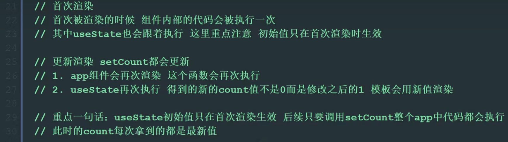
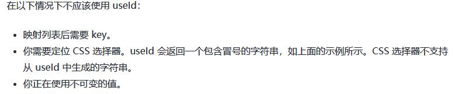
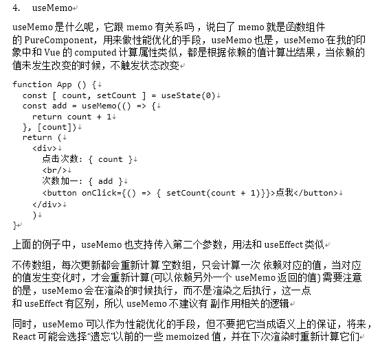
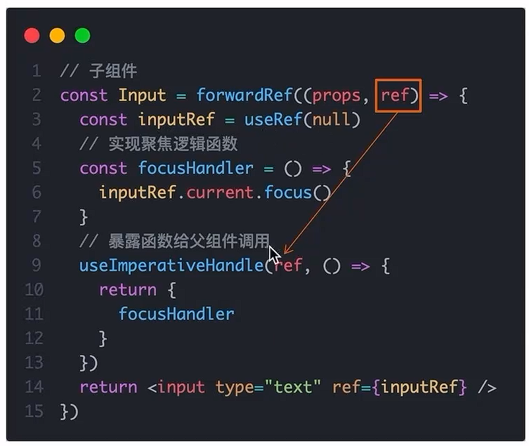
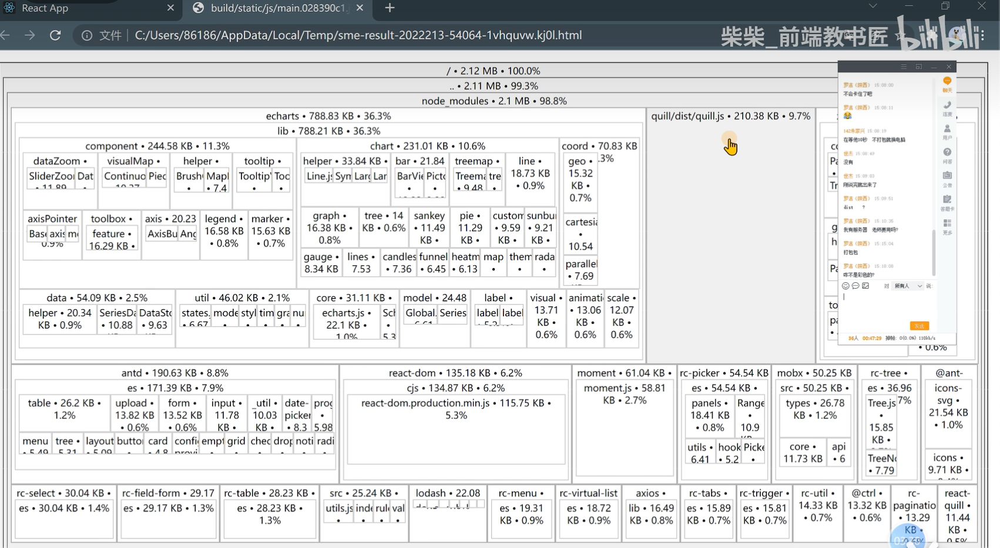
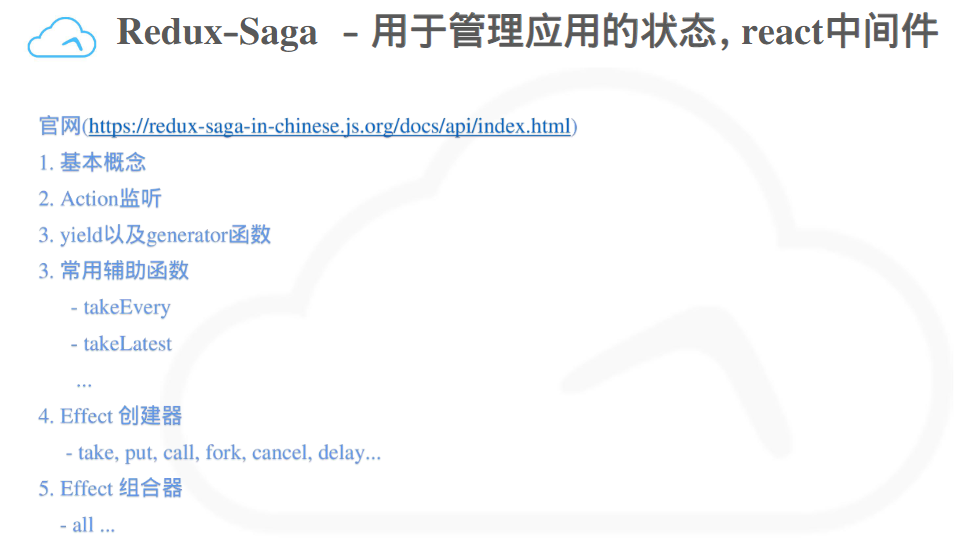
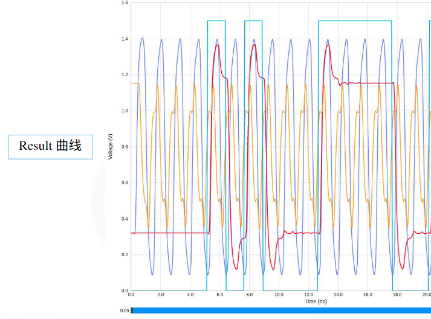
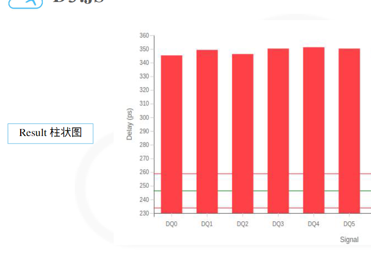
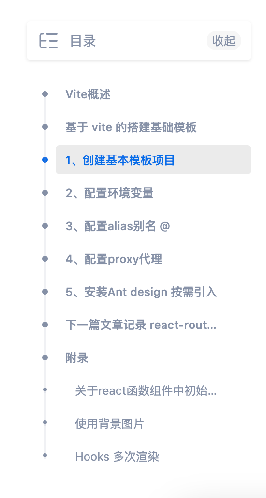

# [React+](https://zh-hans.react.dev/)

- [React 基础部分笔记](https://www.yuque.com/fechaichai/qeamqf/xbai87#e3638cf5)
- [React Router6 基础部分](https://www.yuque.com/fechaichai/qeamqf/smoknz#JRD2D)

> - 以`use`开头的函数被称为 Hook，且只能在【组件/其他 Hook】的**顶层**调用 hook
>
>   - 如果想在一个条件或循环中使用 `useState`，请提取一个新的组件并在组件内部使用它
>
> - 组件件数据共享：
>
>   ```react
>    // 通过{函数参数}接收
>   function MyButton({ count, onClick }) {
>     return (
>       <button onClick={onClick}>
>        Clicked {count} times
>       </button>
>    );
>   }
>
>    // 通过标签传值:数据、函数
>   <MyButton count={count} onClick={handleClick} />
>   ```
>
> - 官网推荐框架：Next.js、Remix、Gatsby、[Expo](https://docs.expo.dev/tutorial/introduction/)（用于原生应用）
>
>   - [Next.js 的 App Router](https://nextjs.org/docs) 是对 Next.js API 的重新设计，旨在实现 React 团队的全栈架构愿景。它让你在异步组件中获取数据，这些组件甚至能在服务端构建过程中运行
>
> - 不要忘了还有浏览器插件 React Developer Tools 可以使用

## 入口文件

```js
// react 18 及以后
import ReactDOM from 'react-dom';
import App from 'App';

// 创建root
const root = ReactDOM.createRoot(document.getElementById('root'));
//通过root渲染App
root.render(<App />);


// react 17及之前
import ReactDOM from 'react-dom';
import App from 'App';

ReactDOM.render(<App />, document.getElementById('root'););
```

## 补充：

> 代码转化器：[HTML to JSX (transform.tools)](https://transform.tools/html-to-jsx)

- 定义组件

  - **React 组件的名称必须以大写字母开头**，否则它们将无法运行！，相反 HTML 标签则必须是小写字母
  - 组件可以渲染其他组件，但是 **请不要嵌套他们的定义**，性能差+bug 产生；应在顶层定义每个组件。

- 导入导出

  - 同一个文件有且仅有一个默认导出，但可以同时存在多个具名导出（但不建议在同一个文件中存在两种导出行为，不便于维护）

  | 语法 | 导出语句                              | 导入语句                                |
  | ---- | ------------------------------------- | --------------------------------------- |
  | 默认 | `export default function Button() {}` | `import Button from './Button.js';`     |
  | 具名 | `export function Button() {}`         | `import { Button } from './Button.js';` |

- JSX

  - 为什么多个 JSX 标签需要被一个父元素包裹？
    - jsx 在底层其实被转化为了 JavaScript 对象，你不能在一个函数中返回多个对象，除非用一个数组把他们包装起来
  - 内联 `style` 属性 使用驼峰命名法编写
  - class 类定义改写为 className

- 纯函数与副作用

  > 组件应该只 **返回** 它们的 JSX，而不 **改变** 在渲染前就已存在的任何对象或变量（改变会导致多次调用）；多组件共用此变量时，会导致无法预测的结果。

  - 副作用
    - 无需处理事件处理程序的副作用，因为组件内部的事件处理程序不会在渲染期间运行
    - 无法避免的外层副作用，可使用`useEffect`方法将其包裹，告诉 React 在渲染结束后再执行它
  - 尽可能的精简 state 的使用（用于必要的交互）
    - 特定组件中、它们的公共父组件、单独创建组件管理，并添加在外层
  - 优势：
    - 可用于服务器组件，相同用的输入给出相同的结果。
    - 提升性能，[跳过渲染](https://zh-hans.react.dev/reference/react/memo)未更改输入值的组件

- 状态管理

  - reducer
    - Reducer 可以让您合并多个状态变量到一个对象中并巩固所有相关的逻辑！
    - [将状态提取到一个 reducer 中](https://zh-hans.react.dev/learn/extracting-state-logic-into-a-reducer)

## 自带标签

### Fragment 空标签

- 可简写为`<></>` ，表示空标签
- 使用场景:
  - 需要将 key 传递给标签，此时不能使用`<></>`

```jsx
// 需要传递key值时:
import { Fragment } from "React";
<Fragment key={xxx}></Fragment>;
//
```

### Helmet 动态 head

- 用来在页面组件中动态修改页面的`<head>`中的标签，如修改标题`<title>`、`<link>` `<meta>`等时，可以用这个实现

```jsx
import { Helmet } from "react-helmet-async";

<Helmet>
  <title> User: Account Settings | Minimal UI</title>
</Helmet>;
```

## React Hook

> - 函数式组件无生命周期的概念
> - hooks 是 React 16.8.0+增加，只能在函数式组件中使用（ 可通过开发者工具查看 hooks 状态 ）
> - 只能在**函数最外层**调用 Hook，不能嵌套在 if/for/其它函数中调用（react 按照 hooks 的调用顺序识别每一个 hook）
> - 只能在组件或其他自定义 hook 中调用

- useState `[ value,setValue ] = useState( defaultValue )`
- useEffect 副作用 `useEffect(()=>{...})`
- useContext 实现跨组件间的数据传输

- useReducer
- useCallback
- useMemo 缓存状态，类似于计算属性，只有指定依赖的值发生变化时才会执行相应的计算，而不会被其他不相关的更新触发
- React.mome 缓存 props，当 props 未发生变化时，跳过子组件的渲染
- useRef
- 自定义 hook：实质就是个外部定义的函数，换成类似 hook 的写法
- [React 18 新 hooks](https://zhuanlan.zhihu.com/p/562815409)
  - useId 生成全局唯一 id，可以用在 client 和 service 端
  - useTransition：
    - 搭配`startTransition`来使用，如果用户需要在 UI 上感知到 transition，react 提供了一个 hooks`useTransition`来获取 transition 的状态。
  - useDeferredValue
    - `deferring（延迟）`一个值，跟我们经常提到的 debounce 和 throttle 有点类似。在 React 18 中，当传递给`useDeferredValue`的值发生变化时，React 会根据当前**渲染的优先级**来返回之前的值或者是最新的值
  - **useSyncExternalStore**
    -

### 自定义 hook

> 自定义以 use 开头的函数，实现实现逻辑的封装和复用。

- 实现思路
  - 声明一个 use 开头的函数
  - 在函数体内部封装任何可复用的逻辑即可
  - 把组件中用到的状态/回调，return 出去（对象或数据）
  - 在需要使用的组件中，执行自定义 use 函数，解构并使用其中的状态/回调

```react
// 自定义hook举例：
import { useState } from 'react'
function useToggle(){
    // 可复用的逻辑
    const [value,setValue] = useState(true)
    const taggle = () => setState(!value);
    return {taggle,value}
}
function App(){
    const {value,taggle} = useToggle();
    return (
    <div>
            <p>{value ? "1" : "2"}</p>
            <button onClick={taggle}</button>>tagger</button>
     </div>
    )
}
```

### useState

```jsx
(1). State Hook让函数组件也可以有state状态, 并进行状态数据的读写操作
(2). 语法: const [xxx, setXxx] = React.useState(initValue)
(3). useState()说明:
        参数: 第一次初始化指定的值在内部作缓存 initValue是初始值  xxx是数据名  setXxx修改数据的函数
        返回值: 包含2个元素的数组, 第1个为内部当前状态值, 第2个为更新状态值的函数
					数组的解构赋值，只需位置对应，命名随意
(4). setXxx()2种写法:
        setXxx(newValue): 参数为非函数值, 直接指定新的状态值, 内部用其覆盖原来的状态值
        setXxx(value => newValue): 参数为函数, 接收原本的状态值, 返回新的状态值, 内部用其覆盖原来的状态值

const [from,setFrom] = useState({name:'xxx',age:12})
setFrom({...from,name:'new'})
setFrom({name:'new',age:13})
```



### useEffect

- 使用场景：

  - 在函数组件中执行副作用操作(用于模拟类组件中的生命周期钩子)
    - 常见副作用：发 ajax 请求数据获取、手动更改真实 DOM、localstorage、设置订阅 / 启动定时器
  - 用于创建不是由事件引起，而是由渲染本身引起的操作，例如：发起请求、更改 DOM 等

- 执行时机

  | 依赖项（第二个参数） | 副作用函数执行时机                  |
  | -------------------- | ----------------------------------- |
  | [ ]                  | 只在初次渲染时执行一次              |
  | 没有写               | 组件初次渲染 + 组件更新时执行       |
  | 添加特定依赖项       | 组件初次渲染 + 依赖项发生变化时执行 |

- 清除副作用，执行时机：组件卸载时

  - 在副作用函数中添加的定时器等操作，通过在 useEffect 中 通过 return 返回的函数中清理

```jsx
/* 语法和说明: */
        useEffect(() => {
          // 在此可以执行任何带副作用操作
          return () => { // 在组件卸载前执行 return
            // 在此做一些收尾工作, 比如清除定时器/取消订阅等
          }
        }, [stateValue])
  // 第二个参数如果指定的是[], 回调函数只会在第一次render()后执行一次，
	// 如果不写，会检测所有数据变化时就执行，\
	// 如果传入数据名，会检测数据变化时再执行

/* useEffect Hook 可看做如下三个函数的组合	*/
        componentDidMount()		// 第二个参数为 []
        componentDidUpdate()   	//
    	componentWillUnmount()   // 有return返回值时，可当成componentWillUnmount钩子


// 相当于 componentDidMount 和 componentDidUpdate:
// 可以访问到组件的 props 和 state。在每次渲染后调用副作用函数 —— 包括第一次渲染时
  useEffect(() => {
      // 使用浏览器的 API 更新页面标题
      document.title = `You clicked ${count} times`;
  });


// 例：清除副作用
useEffect(()=>{
   const timer = setInterval(()=>{...},1000);
   return ()=>{
   		clearInterval(timer);	// 清除副作用（组件卸载时自动执行）
   }
},[])
```

### useRef

> 与 class 类式组件中的 React.createRef() 相似，用于获取真实 DOM

- current 属性存放拿到的 dom 对象

- ```jsx
  (1). Ref Hook可以在函数组件中存储/查找组件内的标签或任意其它数据
  (2). 语法1: const refContainer = React.useRef()
  	 语法2: import { useRef,useEffect } from "React"
  		   const h1ref = useRef(null)

              useEffect(()=>{
                console.log(h1ref.current)
              },[])

              `<div ref={ h1ref }></div> `
  (3). 作用:保存标签对象,功能与React.createRef()一样
  ```

### useContext

- 实现跨组件间的数据传输

```jsx
1. 使用createContext 创建Context对象
2. 在顶层组件通过Provider 提供数据
3. 在底层组件通过useContext函数获取数据
import { createContext, useContext } from 'react'
// 创建Context对象
const Context = createContext()

function Foo() {
    return <div>Foo <Bar/></div>
}

function Bar() {
    // 底层组件通过useContext函数获取数据
    const data = useContext(Context)
    return <div>Bar {data}</div>
}

function App() {
    return (
        // 顶层组件通过Provider 提供数据
        <Context.Provider value={'this is name'}>
            <div><Foo/></div>
        </Context.Provider>
    )
}

export default App
```


### useId

- `useId`用于生成全局唯一 id 的 hooks，可用在 client、service 端，能够避免其他 id 产品的水合问题

- 适用场景：生成唯一 ID、用来连接 HTML 元素，比如 label 和 input。

  

```jsx
import { useId } from "react";
const CheckBox = () => {
  const id = useId();
  return (
    <>
      <label htmlFor={id}>Do you like React?</label>
      <input type="checkbox" name="react" id={id} />
    </>
  );
};
```

### useReducer

- 作用：和 useState 一样，但用于管理相对复杂的状态，类似于状态管理的过程，可封装指定的处理事件

```react
// 1.定义reducer函数，根据不同的action返回不同的新状态
function reducer(state,action){
    // 处理逻辑
    switch(action.type){
        case 'INC': return state+1;
        case 'DEC': return state-1;
        case 'SET': return action.payload;
        default : return state;
    }
}
// 2.在组件中调用useReducer，并传入reducer函数和初始状态值
const [state,dispatch] = useReducer(reducer,0)
// 3.事件触发时，通过dispatch派发一个action对象(通知reducer要返回那个新状态并渲染UI)
dispatch({type:'INC'});
dispatch({type:'SEt',payload:100});
```

### useCallback

> 在组件多次重新渲染时，缓存函数

```react
// 使用useCallback包裹函数后，可保证在组件渲染时保持函数引用的稳定，在传递给子组件的引用不变
import { useCallback } from 'react'

const changeHandler = (value)=>{ console.log(value) }	// 改造前
const changeHandler = useCallback((value)=>{ console.log(value) })	// 改造后
```

### uesMemo

- 作用：在组件每次重新渲染时，缓存计算的结果，只有当指定的依赖项发生变化时，才再次执行计算的函数
- 使用场景：
  - 消耗非常大的计算时，例如递归的计算时，避免不相关的更新触发较大的计算逻辑

```react
import { useMemo } from 'react'
// 基础语法
useMemo(()=>{
    // 依赖变化时，才重新计算并返回结果
    return ...
},[xxx])

const [count1,setCount1] = useState(0)
const [count2,setCount2] = useState(0)

const result = useMemo(()=>{
    // 使用useMemo做缓存后，可确保只有依赖项count1发生变化时才会重新执行计算并返回
    return count1+1;
},[count1])

return (<>
    	<button onClick={()=>setCount1(count1+1)}>{{count1}}</button>
    	<button onClick={()=>setCount2(count2+1)}>{{count2}}</button>
    	{{result}}
    	</>)
```

### React.Memo

> React 默认渲染机制：只要父组件重新渲染，子组件就会无脑重新渲染

- 作用：允许组件在 Props 没有没有改变时，跳过渲染，从而节约性能
  - 通过对前后 props 进行**浅比较**，如果前后 props 不一致，将重新渲染，反之不进行渲染，使用缓存中的组件。
- props 的比较机制
  - 使用 memo 缓存组件后，会对每一个 prop 使用`Object.is`比较，只有全部为 true 时，才会跳过渲染
  - prop 是简单类型
    - Object.is(3,3); // true
  - prop 是复杂类型 - 每次重新执行，都会产生新的对象/数组引用
    - 可结合 useMemo 或 useState 使用，从而保证引用的类型地址不会变化
    - Object.is([],[]); // false

```react
// 使用memo函数包裹生成的缓存组件只有在props发生变化时才会重新渲染
import {mome} from 'react'

const MomoSon = memo(function Son(props){
    // ...
})
```



### React.forwardRef

> 作用：使用 ref 暴露子组件的 DOM 节点交给父组件

```react
import {forwardRef,useRef} from 'react'
// 子组件  使用forwardRef包裹子组件
const Input =forwardRef((props,ref)=>{
    return <input ref={ref} type='type'/>
})

// 父组件
function App(){
    const inputRef = useRef(null)
    return <Input  ref={inputRef}/>;
}
```

### useInperativeHandle

> 通过 ref 暴露子组件中的方法，可交给父组件使用



## react-hook-form

- https://www.jianshu.com/p/fa6e3d76bcaa

```jsx
yarn add react-hook-form

import React from 'react';
import { useForm } from 'react-hook-form';

function App() {
  const { register, handleSubmit, errors } = useForm(); // initialise the hook
  const onSubmit = (data) => {
    console.log(data);
  };

  return (
    <form onSubmit={handleSubmit(onSubmit)}>
      <input name="firstname" ref={register} /> {/* register an input */}
      <input name="lastname" ref={register({ required: true })} />
      {errors.lastname && 'Last name is required.'}
      <input name="age" ref={register({ pattern: /\d+/ })} />
      {errors.age && 'Please enter number for age.'}
      <input type="submit" />
    </form>
  );
}
```

## 进阶内容

### 组件间通信

- 父传子

  1. 父组件通过标签属性传递数据、子组件通过 props 参数接收数据

     - 可以使用 `<Avatar {...props} />` JSX 展开语法转发所有 props，但不要过度使用它
     - `<Card><Avatar /></Card>` 这样的嵌套 JSX，将作为 `Card` 组件的 `prop.children`，不影响其他标签属性传递
     - Props 是只读的时间快照：每次渲染都会收到新版本的 props，修改时可通过设置 state

     ```react
     // 基础用法
     import Avatar from './Avatar.js';
     function Card({ children,type }) {
       return <div className="card"> {children} </div>;
     }
     export default function Profile() {
       return (
         <Card type='xxx'>
           <Avatar size={100} person={{  name: 'Katsuko Saruhashi', imageId: 'YfeOqp2' }} />
         </Card>
       );
     }

     /*
     扩展：render props :向组件内部动态传入带有内容的结构（标签/组件）
     	Vue中:
     		使用slot技术, 也就是通过组件标签体传入结构  <A><B/></A>
     	React中:
     		使用children props: 通过组件标签体传入结构
     		使用render props: 通过组件标签属性传入结构,而且可以携带数据，一般用render函数属性
     */

     <A render={(data) => <C data={data}></C>}></A>
       // A组件: {props.render(内部state数据)} ???【存疑】
       // C组件: 读取A组件传入的数据显示 {props.data}
     ```

- 子传父

  1. 子组件中调用父组件方法并传值

     ```react
     // 注意：不建议将父组件中的setState传递给子组件，子组件应只关心数据的使用渲染，而不包含修改
     // 父组件中
     function getMsg(data){...}
     <A onGetMsqg={getMsg}></A>

     // 子组件中
     function A({onGetMsqg}){
         return (
         	<div onClick= { ()=>onGetMsqg('son') }>send</div>
         )
     }
     ```

- 兄弟组件通讯

  1. 使用状态提升，由公共父组件管理

     ```react
     // 父组件中使用state
     // 通过子传父，将子A中的数据传递给父组件
     // 组件B中再通过props使用父组件的数据
     ```

- 跨层级组件通讯

  1. 使用 Context 机制跨层级组件通信

     ```react
     // 在顶层组件中，使用 createContext 方法创建上下文对象ctx, ctx.Provider组件提供数据
     // 在底层组件中，通过 useContext hook函数 消费使用数据
     ```

### [React 路由](https://www.yuque.com/fechaichai/qeamqf/smoknz#JRD2D)

- 创建路由实例 `createBrowserRouter`
- 使用路由标签`RouterProvider`
- 路由跳转`useNavigate  Link`
- 路由参数 `useSearchParams   useParams`
- 嵌套路由`children    <Outlet />`
- 路由模式：`createHashRouter    createBrowerRouter`

```jsx
// 安装 react-router-dom
npm i react-router-dom

import { createBrowserRouter,RouterProvider, useNavigate,Link, useSearchParams,useParams,Outlet } from 'react-router-dom';

// 创建Router实例，并配置路由对应关系
const router = createBrowserRouter([
	{
        path: '/instance/trajectory/detail/:id',
        component: lazy(() => import('../layouts/instance/trajectory/detail')),
    },
    {
        path: '/',
        component: lazy(() => import('../layouts')),
        // 嵌套子路由 定义
        children:[
            // 默认二级路由，不使用path配置
            {
                 index:true,
            	component: lazy(() => import('../layouts/instance/detail')),
            },
            {
                 path: 'detail/:id',
            	component: lazy(() => import('../layouts/instance/detail')),
            }
        ]
    },
    // 404 路由配置,放置在路由末尾，path为 *
    {
        path:'*'，
        component: lazy(() => import('../404')),
    }
])

// 使用Router
<RouterProvider router={router}></RouterProvider>


// 路由跳转 navigate
const Login =()=>{
    const navigate = useNavigate();
    return (
        <div>
            {/* 声明式写法 */}
            <Link to='/active'>路由跳转</Link>
            {/* 编程式写法，并传url参数 */}
            <button onClick={()=>navigate('/active?id=100')}>路由跳转</button>
            {/* 嵌套路由出口 <Outlet/>  */}
            <Outlet/>
        </div>
    )
}

// 获取url路由参数  /active?id=100
const [params] = useSearchParams();
let id = params.get('id');
// 获取路径参数 /active/:id  /active/100  id为路由配置时的占位符命名
const params = useParams();
let id = params.id


/* 路由配置中制定路径参数 :id
{
    path: '/instance/trajectory/detail/:id',
    component: lazy(() => import('../layouts/instance/trajectory/detail')),
  },
*/
```

### 性能优化

#### useLayoutEffect/useEffect

- useLayoutEffect 和 useEffect 的最大差别在于执行时机的不同，useEffect 会在浏览器绘制完成之后调用，而 useLayoutEffect 则会在 React 更新 dom 之后，浏览器绘制之前执行，并且会阻塞后面的绘制过程，因此适合在 useLayoutEffect 中进行更改布局、及时获取最新布局信息等操作。
- 使用场景：
  - 为了避免在 React render 中多次声明 ResizeObserver 实例，我们可以把实例化过程放在 useLayoutEffect 或 useEffect 中。并且在非 SSR 场景中，我们应该尽量使用 useLayoutEffect 而不是 useEffect。

### 路由懒加载

> 指路由的 JS 资源只有在被访问时才会动态获取，可优化项目首次打开的时间

```react
// 1.使用lazy函数将组件动态导入
import { Suspense,lazy } from 'react'
const Home = lazy(()=>import('@/pages/Home'))

// 2.使用组件时，通过 <Suspense> 包裹，提供异步渲染能力
// fallback属性用于指定在组件加载完成前显示的内容
<Suspense fallback={'记载中'}><Home /></Suspense>
```

### 组件优化

1. Component 的 2 个问题

   > 1. 只要执行 setState(),即使不改变状态数据, 组件也会重新 render() ==> 效率低
   >
   > 2. 只要当前组件重新 render(), 就会自动重新 render 子组件，纵使子组件没有用到父组件的任何数据 ==> 效率低

2. **原因**：Component 中的 shouldComponentUpdate() 生命周期钩子总是返回 true

3. 解决：

   ```js
   // 办法1:
   	借助shouldComponentUpdate()生命周期钩子
   	比较新旧state或props数据, 如果有变化才返回true, 如果没有返回false
       //控制组件更新的“阀门”
       shouldComponentUpdate(nextProps,nextState){
           console.log(this.props,this.state);  // 当前的props和state
           console.log(nextProps,nextState); 	// 接下来要变化的目标props和目标state
           return !this.state.xxx===nextState  // 可根据值得变化控制是否掉 render函数
       }

   // 办法2:
   	使用PureComponent
   	PureComponent重写了shouldComponentUpdate(), 只有state或props数据有变化才返回true
   // 注意:
   	只是进行state和props数据的浅比较, 如果只是数据对象内部数据变了, 返回false
   	因此不要直接修改state数据, 而是要产生新数据


   // 项目中一般使用PureComponent来优化
   // 1.引入 PureComponent
   import React,{PureComponent} from 'react'
   // 2.使用PureComponent创建组件
   export default class Count extends PureComponent {
       xxx...
   }

   ```

### 错误边界

> 错误边界(Error boundary)：用来捕获后代组件错误，渲染出备用页面

- 特点：

  只能捕获后代组件生命周期产生的错误，不能捕获自己组件产生的错误和其他组件在合成事件、定时器中产生的错误

- 使用方式：

  ```js
  // getDerivedStateFromError 配合 componentDidCatch
  state={hasError:""}
  // 生命周期函数，一旦后代组件报错，就会触发
  static getDerivedStateFromError(error) {
      console.log(error);
      // 在render之前触发
      // 返回新的state
      return {
          hasError: true,
      };
  }

  componentDidCatch(error, info) {
      // 统计页面的错误。发送请求发送到后台去
      console.log(error, info);
  }
  ```

### CDN 优化

> 优化点：体积较大的非业务 JS 文件，如 react、react-dom 等，不需要经常做变动，直接 CDN 缓存即可
>
> - 利用 CDN 的缓存特性，将非业务 JS 文件排除在打包之外。
> - 以 CDN 的方式重新引入资源
> - 不同打包工具配置不同....【TODO:待完善】

### 打包体积分析

> 通过分析打包体积，能更好的进行项目优化

- 使用步骤

  1. 安装分析打包体积的包 yarn add source-map-explorer

  2. 在 package.json.中的 scripts 标签中，添加分析打包体积的命令

  3. 对项目打包 yarn build （如果已经打包，可跳过）

  4. 运行分析命令：yarn analyze

  5. 通过浏览器打开的页面，进行分析

     ```js
     // package.json 中：
     // source-map-explorer 'build/static/js/*.js' 表示分析打包后的所有js文件
     "script":{
       "analyze":"source-map-explorer 'build/static/js/*.js'"
     }
     ```

  

## 周边库

### react-cookies

> 可设置失效时间。如果在浏览器端生成 Cookie，默认是关闭浏览器后失效
> 大小 4K 左右
> 每次都会携带在 HTTP 头中，如果使用 cookie 保存过多数据会带来性能问题
> 存在 XSS 注入的风险，只要打开控制台，就可以随意修改它们的值

```js
// 下载依赖
cnpm install  react-cookies --save-dev
// 引入
import cookie from 'react-cookies'

cookie.save('userId', "123"); // 存
cookie.load('userId')    // 取
cookie.remove('userId')  // 删

// 设置失效时间
let inFifteenMinutes = new Date(new Date().getTime() + 24 * 3600 * 1000);//一天
cookie.save('userId', "123",{ expires: inFifteenMinutes });

// 补充：
名字相同cookie是可以同时存在的，cookie不仅有名字和值两个属性，还有域（domain）、路径（path）等属性，不同的域、不同的路径下可以存在同样名字的cookie。

```

### [Ant Design](https://ant.design/index-cn)

- 按需引入：[在 create-react-app 中使用 - Ant Design](https://3x.ant.design/docs/react/use-with-create-react-app-cn)
- 自定义主题：
  - [在 create-react-app 中使用 - Ant Design](https://3x.ant.design/docs/react/use-with-create-react-app-cn)
  - [定制主题 - Ant Design](https://3x.ant.design/docs/react/customize-theme-cn)

```js
// 1.安装
yarn add antd
// 2.看文档使用即可
```

### 没看的部分

- 123-125 性能优化
- 127+
- 路由：
  - 路由的配置
  - 动态路由
  - React 路由的原理
- Redux-Saga **周六**
  - 
  - 
- D3.js v4.x **周日**
  - 基本用法、曲线图、柱状图。。。
  - 
  - 
  - 
- git
  - [Git 教程 - 廖雪峰的官方网站 (liaoxuefeng.com)](https://www.liaoxuefeng.com/wiki/896043488029600)
  - [Git 原理入门 - 阮一峰的网络日志 (ruanyifeng.com)](https://www.ruanyifeng.com/blog/2018/10/git-internals.html)
  - merge、cherry-pick、reset、checkout、branch...
  - github 基本使用
- Linux 基本使用（看 pdf 网站？）
- JS 代码规范（看 pdf 网站？）
- JS 知识
  - webpage 教程？
  - babel 教程？
  - js 设计模式（看 pdf 网站？）
- [HTML+CSS 基础教程-慕课网 (imooc.com)](https://www.imooc.com/learn/9)
- [SVG 图像入门教程 - 阮一峰的网络日志 (ruanyifeng.com)](https://www.ruanyifeng.com/blog/2018/08/svg.html)
-

## 使用记录

### 基础细节

- React 组件首字母大小写，使用时带`< />`

  ```jsx
  function Header() {
    return <h1>Develop. Preview. Ship.</h1>;
  }

  function HomePage() {
    return (
      <div>
        {/* Nesting the Header component */}
        <Header />
      </div>
    );
  }

  const root = ReactDOM.createRoot(app);
  root.render(<Header />);
  ```

### 深度监视

> 使用 global 声明的 class 都不会被编译成哈希字符串
>
> 使用的组件的样式大部分都是使用全局样式 使用局部方式声明 class 经过编译后 无法与组件的默认样式 class 匹配 样式自然无法进行覆盖，要覆盖默认样式就需要 使用全局样式 需要使用 global 声明的 class
> 这样就不会被编译成哈希字符串 也就能覆盖默认样式了

```css
:global(.ant-back-top) {
  right: 20px;
  bottom: 80px;
}
```

### @符配置 别名路径

> - cra 创建的项目，默认将所有工程化配置，都隐藏在 react-script 包中；如果要修改 CRA 的默认配置有以下两种方案：
>   - 通过第三方库修改，@craco/craco （推荐）
>   - 通过执行 yarn eject 命令，释放 react-scripts 中的所有配置到项目中

- 实现步骤

  1. 安装修改 CAR 配置的包：yarn add -D @craco/craco

  2. 在项目根目录中创建配置文件：craco.config.js ，并在配置文件中配制路径别名

  3. 修改 package.json 中的脚本命令（有时候不需要修改？）

  4. 在代码中 使用@符号表示 src 目录的绝对路径

  5. 重启项目，配置生效

     ```js
     // craco.config.js 文件配置
     const path = req
     module.exports = {
       webpack: {
         alias:{
           "@":path.resolve(__dirname,"src")
         }
       }
     }

     // package.json
     "scripts":{
       "start": "craco start",
       "build": "craco build",
       ......
     }
     ```

  6. 让 vscode 识别@符号，并进行代码提示

     ```json
     // 属于 vscode配置 与项目本身无关
     // 在项目根目录创建 jsconfig.json 配置文件，并添加以下配置
     {
       "compilerOptions": {
         "baseUrl": "./",
         "paths": {
           "@/*": ["src/*"]
         }
       }
     }
     ```

### 文件下载

```jsx
// 借助a标签下载文件
<a href={xxx} download>下载</a>   // 错误方式
<a href={require('xxx')} download>下载</a>   // 正确方式，用 require这种方式去引用路径，src 同理
```

### 优化配置 CDN

> 通过 craco 修改 webpack 配置，对第三方包使用 CDN 优化
>
> https://www.bilibili.com/video/BV1Z44y1K7Fj/?p=154&spm_id_from=pageDriver&vd_source=49059bedc59884104ea6ef0a6e552378

```

```

### vite+react 项目搭建

- https://zhuanlan.zhihu.com/p/456407867?utm_id=0



### Docusaurus 记录

- 配置文件 https://docusaurus.io/zh-CN/docs/api/docusaurus-config
- 指南 https://docusaurus.io/zh-CN/docs/category/guides
- 关于组件的弹出
  - 可以直接在 `node_modules/@docusaurus/theme-classic/src/theme` 查看所有组件，再通过命令弹出
  - 更粗暴的方法（不建议）
    - `node_modules/@docusaurus/theme-classic/src/theme` 中找到组件所在文件夹，将整个文件夹复制到 `src/theme` 下。这样能得到最原始的 ts 文件，同时所能修改的地方也就越多，更方便的个性化。

```sh
# 查看内部的所有组件
yarn run swizzle @docusaurus/theme-classic -- --list

# 弹出/暴露 指定组件
yarn run swizzle @docusaurus/theme-classic 组件名 -- --eject --typescript

```

##### 添加文档/博客

- 文档：在`src/docs`目录下新建 `.jsx` 或 `.md` 文件，也可在当前目录下新建文件夹并创建这些文件
- 博客：在`src/blog`目录下新建 `.jsx` 或 `.md` 文件，也可在当前目录下新建文件夹并创建这些文件

- 使用图片/静态资源（建议）：

  - 资源保存路径，相对当前 md 文档：`./static/${filename}`
  - 可使用 Typora 设置图像存储位置，方便 🍜

- 注意点：
  - 任何下划线 \_ 开头的文件都会被忽略
  - 映射到同一路由的多个页面，将只能访问最后创建的页面
  - 在 md 文档中支持使用 JSX 语法及 React 组件

https://markdown.com.cn/cheat-sheet.html

###### Category metadata

1. 在相应的文件夹下添加`_category_. json`或`_category_.yml`文件

```JSON
# 示例：
{
  "position": 2.5,            // 所在目录在侧边栏中显示的排序，[number]
  "label": "Tutorial",        // 所在目录在侧边栏中显示的文本,[string]
  "collapsible": true,
  "collapsed": false,
  "link": {
    "type": "generated-index",
    "title": "Tutorial overview"
  },
  "customProps": {
    "description": "This description can be used in the swizzled DocCard"
  }
}
```

###### [文档 Metadata fields](https://docusaurus.io/zh-CN/docs/api/plugins/@docusaurus/plugin-content-docs#tags)

- 文档顺序
  - 默认情况下，侧边栏中的项目将按字母顺序（文件和文件夹名称）生成。
  - 在 md 文档前使用 metadata fields 配置的 `sidebar_position` 排序
-

```Markdown
---
title: xxx                    # 文本标题+备用值（侧边栏、下篇/上篇按钮...),[string]
sidebar_position: 2           # 文档排序，[number]
sidebar_label: xxx            # 文该档在侧边栏中显示的文本,[string]
pagination_label: xxx         # 文档在上一篇/下一篇按钮中显示的文本,[string]

slug: /bonjour                # 文档url,默认为文件路径/docs/guide/hello，将其URL改为/docs/bonjour
id:xxx                        # 文档的唯一 ID,默认值:文件路径（包括文件夹,不含扩展名）,[string]
pagination_prev: xxx          #「上篇文档」按钮链接到的文档 ID。
pagination_next：xxx          # 「下篇文档」按钮链接到的文档 ID, [string | null]
......
---

xxx 文档内容
xxxxxxx。文档正文
xxxxxxxxxx
```

###### [博客 Metadata fields](https://docusaurus.io/zh-CN/docs/api/plugins/@docusaurus/plugin-content-blog#path)

```Markdown
<!-- 示例： -->

---
title: Welcome Docusaurus v2
description: This is my first post on Docusaurus 2.
slug: welcome-docusaurus-v2
date: 2021-09-13T10:00
authors:
  - name: Joel Marcey
    title: Co-creator of Docusaurus 1
    url: https://github.com/JoelMarcey
    image_url: https://github.com/JoelMarcey.png
  - name: Sébastien Lorber
    title: Docusaurus maintainer
    url: https://sebastienlorber.com
    image_url: https://github.com/slorber.png
tags: [hello, docusaurus-v2]
image: https://i.imgur.com/mErPwqL.png
hide_table_of_contents: false
---


# Welcome to this blog.
正文 xxxxxxxx
```

##### 翻译 - 使用 Crowdin

https://docusaurus.io/zh-CN/docs/i18n/crowdin#upload-the-sources

流程：上传 Crowdin - 翻译 - 从 Crowdin 下载

1. 安装 Crowdin CLI ：
   1. 安装：`yarn add @crowdin/cli@3`
   2. 测试是否可以运行 Crowdin CLI：`yarn crowdin --version`
2. 上传所有 JSON 和 Markdown 翻译文件：
   1. 在项目中运行 `yarn crowdin upload`
3. Crowdin 界面中对项目文件内容进行翻译调整（例图：）
4. 下载翻译好的 JSON 和 Markdown 文件： `yarn crowdin download`

##### Navbar items 类型：

1.  doc : 用于添加文档链接，当用户点击链接时，将跳转到您的文档页面。
2.  dropdown : 用于创建下拉列表，下拉列表中可以包含多个链接。
3.  external : 用于添加外部链接，当用户点击链接时，将跳转到指定的外部网站。
4.  localeDropdown : 用于多语言站点的 Dropdown，下拉列表中会展示所有支持的语言选项。
5.  search : 用于添加搜索框，用户可以在搜索框中输入关键字来搜索您网站的内容。
