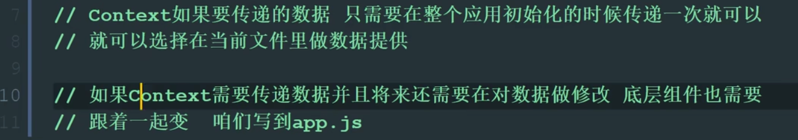

<WaterMark />
# [React+](https://zh-hans.react.dev/)

- [React 基础部分笔记](https://www.yuque.com/fechaichai/qeamqf/xbai87#e3638cf5)
- [React Router6 基础部分](https://www.yuque.com/fechaichai/qeamqf/smoknz#JRD2D)

> - React中：React组件 必须是大写字母开头、HTML 标签则必须是小写字母
>
> - className：指定class类名，
>
> - 以`use`开头的函数被称为Hook，且只能在【组件/其他Hook】的**顶层**调用hook
>
>   - 如果想在一个条件或循环中使用 `useState`，请提取一个新的组件并在组件内部使用它
>
> - 期望：
>
>   - 尽可能的精简 state 的使用（用于必要的交互）
>   - state的位置：
>     - 特定组件中、它们的公共父组件、单独创建组件管理，并添加在外层
>
> - 组件件数据共享：
>
>   ```jsx
>   // 通过标签传值:数据、函数
>   <MyButton count={count} onClick={handleClick} />
>   // 通过{函数参数}接收
>   function MyButton({ count, onClick }) {
>     return (
>       <button onClick={onClick}>
>         Clicked {count} times
>       </button>
>     );
>   }
>   ```
>
> - 官网推荐框架：Next.js、Remix、Gatsby、[Expo](https://docs.expo.dev/tutorial/introduction/)（用于原生应用）
>
>   - [Next.js 的 App Router](https://nextjs.org/docs) 是对 Next.js API 的重新设计，旨在实现 React 团队的全栈架构愿景。它让你在异步组件中获取数据，这些组件甚至能在服务端构建过程中运行
>
> - 在React中使用 [TypeScript](https://zh-hans.react.dev/learn/typescript#typescript-with-react-components)
>
>   - `.tsx`
>   
> - 不要忘了还有浏览器插件 React  Developer Tools 可以使用


## 入口文件

```js
// react 18 及以后
import ReactDOM from 'react-dom';
import App from 'App';

// 创建root
const root = ReactDOM.createRoot(document.getElementById('root'));
//通过root渲染App
root.render(<App />);
            
            
// react 17及之前
import ReactDOM from 'react-dom';
import App from 'App';

ReactDOM.render(<App />, document.getElementById('root'););
```


## 自带标签


### Fragment 空标签

- 可简写为`<></>` ，表示空标签
- 使用场景:
  - 需要将key传递给标签，此时不能使用`<></>`


```jsx
// 需要传递key值时:
import { Fragment } from 'React';
<Fragment key={xxx}></Fragment>
// 
```


### Helmet 动态head

- 用来在页面组件中动态修改页面的`<head>`中的标签，如修改标题`<title>`、`<link>` `<meta>`等时，可以用这个实现

```jsx
import { Helmet } from 'react-helmet-async';

<Helmet>
	<title> User: Account Settings | Minimal UI</title>
</Helmet>
```


## 常见的Hook

> - 函数式组件无生命周期的概念
> - Hook是React 16.8.0版本增加的新特性/新语法
> - hooks只能用在函数式组件中（ 可以通过开发者工具查看hooks状态 ）
> - 只能在**函数最外层**调用 Hook，不能嵌套在if/for/其它函数中调用（react按照hooks的调用顺序识别每一个hook） 

- useState     `[ value,setValue ] = useState( defaultValue )`
- useEffect      副作用 `useEffect(()=>{...})`
- useContext    实现跨组件间的数据传输

- useReducer
- useCallback
- useMemo
- useRef
- 自定义hook：实质就是个外部定义的函数，换成类似hook的写法
- [React 18 新hooks](https://zhuanlan.zhihu.com/p/562815409)
  - useId   生成全局唯一id，可以用在client和service端
  - useTransition：
    - 搭配`startTransition`来使用，如果用户需要在UI上感知到transition，react提供了一个hooks`useTransition`来获取transition的状态。
  - useDeferredValue
    - `deferring（延迟）`一个值，跟我们经常提到的debounce和throttle有点类似。在React 18中，当传递给`useDeferredValue`的值发生变化时，React会根据当前**渲染的优先级**来返回之前的值或者是最新的值
  - **useSyncExternalStore**
    - 


### useState

```jsx
(1). State Hook让函数组件也可以有state状态, 并进行状态数据的读写操作
(2). 语法: const [xxx, setXxx] = React.useState(initValue)  
(3). useState()说明:
        参数: 第一次初始化指定的值在内部作缓存 initValue是初始值  xxx是数据名  setXxx修改数据的函数
        返回值: 包含2个元素的数组, 第1个为内部当前状态值, 第2个为更新状态值的函数
					数组的解构赋值，只需位置对应，命名随意
(4). setXxx()2种写法:
        setXxx(newValue): 参数为非函数值, 直接指定新的状态值, 内部用其覆盖原来的状态值
        setXxx(value => newValue): 参数为函数, 接收原本的状态值, 返回新的状态值, 内部用其覆盖原来的状态值
```


### useEffect

```jsx
(1). Effect Hook 可以让你在函数组件中执行副作用操作(用于模拟类组件中的生命周期钩子)
(2). 常见的副作用操作:
        发ajax请求数据获取
        设置订阅 / 启动定时器
        手动更改真实DOM
        localstorage
(3). 语法和说明: 
        useEffect(() => { 
          // 在此可以执行任何带副作用操作
          return () => { // 在组件卸载前执行 return
            // 在此做一些收尾工作, 比如清除定时器/取消订阅等
          }
        }, [stateValue]) 
  // 第二个参数如果指定的是[], 回调函数只会在第一次render()后执行一次，
	// 如果不写，会检测所有数据变化时就执行，\
	// 如果传入数据名，会检测数据变化时再执行
    
(4). 可以把 useEffect Hook 看做如下三个函数的组合
        componentDidMount()
        componentDidUpdate()   
    		componentWillUnmount()   // 有return返回值时，可当成componentWillUnmount钩子


// 相当于 componentDidMount 和 componentDidUpdate:
// 可以访问到组件的 props 和 state。在每次渲染后调用副作用函数 —— 包括第一次渲染时
  useEffect(() => {    
      // 使用浏览器的 API 更新页面标题   
      document.title = `You clicked ${count} times`;  
  });
```


### useRef

- 与类式组件中的 React.createRef()  用法一致

- current属性存放拿到的dom对象

- ```jsx
  (1). Ref Hook可以在函数组件中存储/查找组件内的标签或任意其它数据
  (2). 语法1: const refContainer = React.useRef()
  		 语法2: import { useRef,useEffect } from "React"
  						const h1ref = useRef(null)
              
              useEffect(()=>{
                console.log(h1ref.current)
              },[])
              
              `<div ref={ h1ref }></div> `
  (3). 作用:保存标签对象,功能与React.createRef()一样
  ```

  

### useContext

- 实现跨组件间的数据传输

```jsx
1. 使用createContext 创建Context对象
2. 在顶层组件通过Provider 提供数据
3. 在底层组件通过useContext函数获取数据
import { createContext, useContext } from 'react'
// 创建Context对象
const Context = createContext()

function Foo() {  
    return <div>Foo <Bar/></div>
}

function Bar() {  
    // 底层组件通过useContext函数获取数据  
    const name = useContext(Context)  
    return <div>Bar {name}</div>
}

function App() {  
    return (    
        // 顶层组件通过Provider 提供数据    
        <Context.Provider value={'this is name'}>     
            <div><Foo/></div>    
        </Context.Provider>  
    )
}

export default App
```




### 自定义hook


### 18新hooks


#### useId

- `useId`是一个生成全局唯一id的hooks，它可以用在client和service端，从而可以避免水化过程中的不匹配，下面是一个简单的示例

```jsx
const CheckBox = () => {
  const id = useId();
  return (
    <>
      <label htmlFor={id}>Do you like React?</label>
      <input type="checkbox" name="react" id={id} />
    </>
  )
}
```


- 


## react-router-dom

- 127
- https://www.yuque.com/fechaichai/qeamqf/smoknz#JRD2D

- useParams
  - 返回URL参数的键/值对的对象。

```jsx
import { useNavigate, useParams } from 'react-router-dom';

const param = useParams();
console.log(param.id)

/* 路由配置中制定路径参数 :id
{
    path: '/instance/trajectory/detail/:id',
    component: lazy(() => import('../layouts/instance/trajectory/detail')),
  },
*/
```


## react-hook-form

- https://www.jianshu.com/p/fa6e3d76bcaa

```jsx
yarn add react-hook-form

import React from 'react';
import { useForm } from 'react-hook-form';

function App() {
  const { register, handleSubmit, errors } = useForm(); // initialise the hook
  const onSubmit = (data) => {
    console.log(data);
  };

  return (
    <form onSubmit={handleSubmit(onSubmit)}>
      <input name="firstname" ref={register} /> {/* register an input */}
      <input name="lastname" ref={register({ required: true })} />
      {errors.lastname && 'Last name is required.'}
      <input name="age" ref={register({ pattern: /\d+/ })} />
      {errors.age && 'Please enter number for age.'}
      <input type="submit" />
    </form>
  );
}
```


## 性能优化

#### useLayoutEffect/useEffect

- useLayoutEffect 和 useEffect 的最大差别在于执行时机的不同，useEffect 会在浏览器绘制完成之后调用，而 useLayoutEffect 则会在 React 更新 dom 之后，浏览器绘制之前执行，并且会阻塞后面的绘制过程，因此适合在 useLayoutEffect 中进行更改布局、及时获取最新布局信息等操作。
- 使用场景：
  - 为了避免在 React render中多次声明 ResizeObserver 实例，我们可以把实例化过程放在 useLayoutEffect 或 useEffect 中。并且在非 SSR 场景中，我们应该尽量使用 useLayoutEffect 而不是 useEffect。


### React.memo

> 函数组件，在任何情况下都会重新渲染，没有生命周期，官方提供React.memo优化手段

- 用于函数组件，通过对前后props进行**浅比较**，如果前后props不一致，该组件将重新渲染，反之，不进行渲染，使用缓存中的组件。


### Memo


### 组件优化

1. Component的2个问题 

   > 1. 只要执行setState(),即使不改变状态数据, 组件也会重新render() ==> 效率低
   >
   > 2. 只要当前组件重新render(), 就会自动重新render子组件，纵使子组件没有用到父组件的任何数据 ==> 效率低

2. **原因**：Component中的 shouldComponentUpdate() 生命周期钩子总是返回 true

3. 解决：

   ```js
   // 办法1: 
   	借助shouldComponentUpdate()生命周期钩子
   	比较新旧state或props数据, 如果有变化才返回true, 如果没有返回false
       //控制组件更新的“阀门”
       shouldComponentUpdate(nextProps,nextState){
           console.log(this.props,this.state);  // 当前的props和state
           console.log(nextProps,nextState); 	// 接下来要变化的目标props和目标state
           return !this.state.xxx===nextState  // 可根据值得变化控制是否掉 render函数
       }
   
   // 办法2:  
   	使用PureComponent
   	PureComponent重写了shouldComponentUpdate(), 只有state或props数据有变化才返回true
   // 注意: 
   	只是进行state和props数据的浅比较, 如果只是数据对象内部数据变了, 返回false  
   	因此不要直接修改state数据, 而是要产生新数据
   
   
   // 项目中一般使用PureComponent来优化
   // 1.引入 PureComponent
   import React,{PureComponent} from 'react'
   // 2.使用PureComponent创建组件
   export default class Count extends PureComponent {
       xxx...
   } 
   
   ```

   


### 错误边界

> 错误边界(Error boundary)：用来捕获后代组件错误，渲染出备用页面

- 特点：

  只能捕获后代组件生命周期产生的错误，不能捕获自己组件产生的错误和其他组件在合成事件、定时器中产生的错误

- 使用方式：

  ```js
  // getDerivedStateFromError 配合 componentDidCatch
  state={hasError:""}
  // 生命周期函数，一旦后代组件报错，就会触发
  static getDerivedStateFromError(error) {
      console.log(error);
      // 在render之前触发
      // 返回新的state
      return {
          hasError: true,
      };
  }
  
  componentDidCatch(error, info) {
      // 统计页面的错误。发送请求发送到后台去
      console.log(error, info);
  }
  ```

  


### render props

> 向组件内部动态传入带有内容的结构（标签/组件）

```
Vue中: 
	使用slot技术, 也就是通过组件标签体传入结构  <A><B/></A>
React中:
	使用children props: 通过组件标签体传入结构
	使用render props: 通过组件标签属性传入结构,而且可以携带数据，一般用render函数属性
```

- children props

  <A>
    <B>xxxx</B>
  </A>
  {this.props.children}
  问题: 如果B组件需要A组件内的数据, ==> 做不到 

- render props

  `<A render={(data) => <C data={data}></C>}></A>`
  A组件: {this.props.render(内部state数据)}
  C组件: 读取A组件传入的数据显示 {this.props.data} 


### 打包体积分析

> 通过分析打包体积，能更好的进行项目优化

- 使用步骤

  1. 安装分析打包体积的包 yarn add source-map-explorer

  2. 在package.json.中的scripts 标签中，添加分析打包体积的命令

  3. 对项目打包 yarn build （如果已经打包，可跳过）

  4. 运行分析命令：yarn analyze

  5. 通过浏览器打开的页面，进行分析

     ```js
     // package.json 中：
     // source-map-explorer 'build/static/js/*.js' 表示分析打包后的所有js文件
     "script":{
       "analyze":"source-map-explorer 'build/static/js/*.js'"
     }
     ```

  


## 周边库


### react-cookies

> 可设置失效时间。如果在浏览器端生成Cookie，默认是关闭浏览器后失效
> 大小4K左右
> 每次都会携带在HTTP头中，如果使用cookie保存过多数据会带来性能问题
> 存在 XSS 注入的风险，只要打开控制台，就可以随意修改它们的值

```js
// 下载依赖
cnpm install  react-cookies --save-dev
// 引入
import cookie from 'react-cookies'

cookie.save('userId', "123"); // 存
cookie.load('userId')    // 取
cookie.remove('userId')  // 删

// 设置失效时间
let inFifteenMinutes = new Date(new Date().getTime() + 24 * 3600 * 1000);//一天
cookie.save('userId', "123",{ expires: inFifteenMinutes });

// 补充：
名字相同cookie是可以同时存在的，cookie不仅有名字和值两个属性，还有域（domain）、路径（path）等属性，不同的域、不同的路径下可以存在同样名字的cookie。

```


### [Ant Design](https://ant.design/index-cn)

- 按需引入：[在 create-react-app 中使用 - Ant Design](https://3x.ant.design/docs/react/use-with-create-react-app-cn)
- 自定义主题：
  - [在 create-react-app 中使用 - Ant Design](https://3x.ant.design/docs/react/use-with-create-react-app-cn)
  - [定制主题 - Ant Design](https://3x.ant.design/docs/react/customize-theme-cn)

```js
// 1.安装
yarn add antd
// 2.看文档使用即可
```


### 没看的部分

- 123-125   性能优化
- 127+
- 路由：
  - 路由的配置
  - 动态路由
  - React路由的原理
- Redux-Saga   **周六**
  - 
  - 
- D3.js  v4.x  **周日**
  - 基本用法、曲线图、柱状图。。。
  - 
  - 
  - 
- git
  - [Git教程 - 廖雪峰的官方网站 (liaoxuefeng.com)](https://www.liaoxuefeng.com/wiki/896043488029600)
  - [Git 原理入门 - 阮一峰的网络日志 (ruanyifeng.com)](https://www.ruanyifeng.com/blog/2018/10/git-internals.html)
  - merge、cherry-pick、reset、checkout、branch...
  - github  基本使用
- Linux基本使用（看pdf网站？）
- JS代码规范（看pdf网站？）
- JS知识
  - webpage 教程？
  - babel教程？
  - js设计模式（看pdf网站？）
- [HTML+CSS基础教程-慕课网 (imooc.com)](https://www.imooc.com/learn/9)
- [SVG 图像入门教程 - 阮一峰的网络日志 (ruanyifeng.com)](https://www.ruanyifeng.com/blog/2018/08/svg.html)
- 


## 使用记录

### 基础细节

- React组件首字母大小写，使用时带`< />`

  ```jsx
  function Header() {
    return <h1>Develop. Preview. Ship.</h1>;
  }
   
  function HomePage() {
    return (
      <div>
        {/* Nesting the Header component */}
        <Header />
      </div>
    );
  }
   
  const root = ReactDOM.createRoot(app);
  root.render(<Header />);
  ```

  


### 深度监视

> 使用global声明的class 都不会被编译成哈希字符串
>
> 使用的组件的样式大部分都是使用全局样式 使用局部方式声明class 经过编译后 无法与组件的默认样式class匹配 样式自然无法进行覆盖，要覆盖默认样式就需要 使用全局样式 需要使用global 声明的class
> 这样就不会被编译成哈希字符串 也就能覆盖默认样式了

```css
:global(.ant-back-top) {
    right: 20px;
    bottom: 80px;
}
```


### @符配置 别名路径

> - cra创建的项目，默认将所有工程化配置，都隐藏在react-script包中；如果要修改CRA的默认配置有以下两种方案：
>   - 通过第三方库修改，@craco/craco  （推荐）
>   - 通过执行 yarn eject 命令，释放 react-scripts 中的所有配置到项目中

- 实现步骤

  1. 安装修改CAR配置的包：yarn add -D @craco/craco

  2. 在项目根目录中创建配置文件：craco.config.js ，并在配置文件中配制路径别名

  3. 修改 package.json 中的脚本命令（有时候不需要修改？）

  4. 在代码中 使用@符号表示 src目录的绝对路径

  5. 重启项目，配置生效

     ```js
     // craco.config.js 文件配置
     const path = req
     module.exports = {
       webpack: {
         alias:{
           "@":path.resolve(__dirname,"src")
         }
       }
     }
     
     // package.json 
     "scripts":{
       "start": "craco start",
       "build": "craco build", 
       ......
     }
     ```

  6. 让vscode 识别@符号，并进行代码提示

     ```json
     // 属于 vscode配置 与项目本身无关
     // 在项目根目录创建 jsconfig.json 配置文件，并添加以下配置
     {
       "compilerOptions": {
         "baseUrl": "./",
         "paths": {
           "@/*":[
             "src/*"
           ]
         }
       }
     }
     ```

     


### 文件下载

```jsx
// 借助a标签下载文件
<a href={xxx} download>下载</a>   // 错误方式
<a href={require('xxx')} download>下载</a>   // 正确方式，用 require这种方式去引用路径，src 同理
```


### 优化配置CDN

> 通过 craco修改webpack配置，对第三方包使用CDN优化
>
> https://www.bilibili.com/video/BV1Z44y1K7Fj/?p=154&spm_id_from=pageDriver&vd_source=49059bedc59884104ea6ef0a6e552378

```

```


### vite+react项目搭建

- https://zhuanlan.zhihu.com/p/456407867?utm_id=0


### Docusaurus记录


- 配置文件   https://docusaurus.io/zh-CN/docs/api/docusaurus-config
- 指南   https://docusaurus.io/zh-CN/docs/category/guides
- 关于组件的弹出
  - 可以直接在 `node_modules/@docusaurus/theme-classic/src/theme` 查看所有组件，再通过命令弹出
  - 更粗暴的方法（不建议）
    - `node_modules/@docusaurus/theme-classic/src/theme` 中找到组件所在文件夹，将整个文件夹复制到 `src/theme` 下。这样能得到最原始的ts文件，同时所能修改的地方也就越多，更方便的个性化。

```sh
# 查看内部的所有组件
yarn run swizzle @docusaurus/theme-classic -- --list

# 弹出/暴露 指定组件
yarn run swizzle @docusaurus/theme-classic 组件名 -- --eject --typescript

```


##### 添加文档/博客

- 文档：在`src/docs`目录下新建 `.jsx` 或 `.md` 文件，也可在当前目录下新建文件夹并创建这些文件
- 博客：在`src/blog`目录下新建 `.jsx` 或 `.md` 文件，也可在当前目录下新建文件夹并创建这些文件

- 使用图片/静态资源（建议）：
  - 资源保存路径，相对当前md文档：`./static/${filename}` 
  - 可使用 Typora 设置图像存储位置，方便🍜


- 注意点：
  - 任何下划线 _ 开头的文件都会被忽略
  - 映射到同一路由的多个页面，将只能访问最后创建的页面
  - 在md文档中支持使用 JSX语法及React组件

https://markdown.com.cn/cheat-sheet.html

###### Category metadata

1. 在相应的文件夹下添加`_category_. json`或`_category_.yml`文件

```JSON
# 示例：
{
  "position": 2.5,            // 所在目录在侧边栏中显示的排序，[number]
  "label": "Tutorial",        // 所在目录在侧边栏中显示的文本,[string]
  "collapsible": true,
  "collapsed": false,
  "link": {
    "type": "generated-index",
    "title": "Tutorial overview"
  },
  "customProps": {
    "description": "This description can be used in the swizzled DocCard"
  }
}
```

###### [文档 Metadata fields](https://docusaurus.io/zh-CN/docs/api/plugins/@docusaurus/plugin-content-docs#tags)

- 文档顺序
  - 默认情况下，侧边栏中的项目将按字母顺序（文件和文件夹名称）生成。
  - 在md文档前使用 metadata fields配置的 `sidebar_position`  排序
- 

```Markdown
---
title: xxx                    # 文本标题+备用值（侧边栏、下篇/上篇按钮...),[string]
sidebar_position: 2           # 文档排序，[number]
sidebar_label: xxx            # 文该档在侧边栏中显示的文本,[string]
pagination_label: xxx         # 文档在上一篇/下一篇按钮中显示的文本,[string]

slug: /bonjour                # 文档url,默认为文件路径/docs/guide/hello，将其URL改为/docs/bonjour
id:xxx                        # 文档的唯一 ID,默认值:文件路径（包括文件夹,不含扩展名）,[string]
pagination_prev: xxx          #「上篇文档」按钮链接到的文档 ID。
pagination_next：xxx          # 「下篇文档」按钮链接到的文档 ID, [string | null]
......
---

xxx 文档内容
xxxxxxx。文档正文
xxxxxxxxxx
```

###### [博客 Metadata fields](https://docusaurus.io/zh-CN/docs/api/plugins/@docusaurus/plugin-content-blog#path)

```Markdown
<!-- 示例： -->

---
title: Welcome Docusaurus v2
description: This is my first post on Docusaurus 2.
slug: welcome-docusaurus-v2
date: 2021-09-13T10:00
authors:
  - name: Joel Marcey
    title: Co-creator of Docusaurus 1
    url: https://github.com/JoelMarcey
    image_url: https://github.com/JoelMarcey.png
  - name: Sébastien Lorber
    title: Docusaurus maintainer
    url: https://sebastienlorber.com
    image_url: https://github.com/slorber.png
tags: [hello, docusaurus-v2]
image: https://i.imgur.com/mErPwqL.png
hide_table_of_contents: false
---


# Welcome to this blog. 
正文 xxxxxxxx
```

##### 翻译 - 使用 Crowdin

https://docusaurus.io/zh-CN/docs/i18n/crowdin#upload-the-sources

流程：上传Crowdin - 翻译 - 从Crowdin下载

1. 安装Crowdin CLI ：
   1. 安装：`yarn add @crowdin/cli@3`
   2. 测试是否可以运行Crowdin CLI：`yarn crowdin --version`
2. 上传所有 JSON 和 Markdown 翻译文件：
   1. 在项目中运行  `yarn crowdin upload`
3. Crowdin界面中对项目文件内容进行翻译调整（例图：）
4. 下载翻译好的 JSON 和 Markdown文件： `yarn crowdin download`


##### Navbar items类型： 

1.  doc : 用于添加文档链接，当用户点击链接时，将跳转到您的文档页面。 
2.  dropdown : 用于创建下拉列表，下拉列表中可以包含多个链接。 
3.  external : 用于添加外部链接，当用户点击链接时，将跳转到指定的外部网站。 
4.  localeDropdown : 用于多语言站点的Dropdown，下拉列表中会展示所有支持的语言选项。 
5.  search : 用于添加搜索框，用户可以在搜索框中输入关键字来搜索您网站的内容。

