# 相关知识

## 框架面

### SPA 单页应用

- 浏览器一开始就加载必须的 HTML、CSS、JS，所有的操作在单个页面上完成，由 JS 控制交互和局部刷新
- 优点：
  - 前后端分离、良好的用户体验，不刷新界面，显示更流畅
  - 减轻服务器压力，不需要频繁请求界面
- 缺点：初次加载比较耗时、且不利于 SEO 优化

### SSR 与 CSR

- SSR(Server-Side Rendering) ：服务端直接把渲染后的页面发送给客户端，提升页面响应速度。
  - 框架：
    - 基于 Vue 的：Nuxt、[VitePress](https://vitepress.dev/zh/)、[VuePress](https://v2.vuepress.vuejs.org/zh/)
    - 基于 React 的：Next、[Docusaurus](https://www.docusaurus.cn/)、[Docsify](https://docsify.js.org/#/)、Remix
  - 特点：
    - 不需要 SPA 中的等待页面加载 > 执行 JS > 加载数据 > 渲染到网页
    - 优点：提升性能、SEO 优化友好
    - 需要部署并运行在服务器，无法运行在静态空间
  - 一般构成：
    - 服务器端应用程序：运行服务器上的应用程序，**不能直接运行在静态空间**，需要使用 Node.js 运行；负责接收请求、执行渲染过程并返回页面
    - 路由：需要根据客户端请求的不同路径，调用对应的渲染逻辑和数据获取方法
    - 模板引擎：用于将页面模板和数据结合，最终生成 HTML 内容，基于某种 MVVM 框架
    - 数据获取：服务端获取初次渲染需要的数据，和用户信息等需要前端获取的数据，可能涉及数据库、API 或其他来源的数据
    - 状态管理：需要考虑如何管理客户端和服务器的状态同步，避免出现不一致的情况
    - 客户端交互：在页面初次渲染之后，客户端仍要进行交互，如何使用 JS 添加动态内容或处理用户操作
- CSR(Client Side Rendering)：依赖运行在客户端的 JS，用户首次发送请求只能得到小部分的指引性 HTML 代码。第二次请求将会请求更多包含 HTML 字符串的 JS 文件
- https://juejin.cn/post/7039151040188383268


### MVC 与 MVVM

- MVC：

  > 在传统的非前后端分离项目中，后端需要处理大量的内容，如果不按照一定的模式就是"大乱炖"
  >
  > 模型 M－视图(用户界面) V - 控制器 C

  - C 即 controller 控制器：接受用户的输入并调用模型和视图去完成用户的需求，控制器本身不输出任何东西和做任何处理。它只是接收请求并决定调用哪个模型构件去处理请求，然后再确定用哪个视图来显示返回的数据。
  - V 即 View 视图：指用户看到并与之交互的界面。比如由 html 元素组成的网页界面，或者软件的客户端界面。MVC 的好处之一在于它能为应用程序处理很多不同的视图。在视图中其实没有真正的处理发生，它只是作为一种输出数据并允许用户操作的方式。
  - M 即 model 模型：指业务规则。在 MVC 的三个部件中，模型拥有最多的处理任务。被模型返回的数据是中立的，模型与数据格式无关，这样一个模型能为多个视图提供数据，由于应用于模型的代码只需写一次就可以被多个视图重用，所以减少了代码的重复性。

  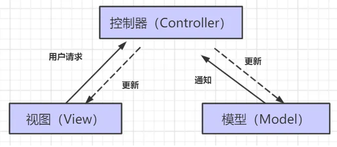

- MVVM

  > 由后端的 MVC 架构演化而来，传统的 MVC 并不符合前端的实际需求
  >
  > 划分代码职责：原本需要发数据、存数据、拼模板、渲染 DOM...（大乱炖）
  >
  > - Model 模型：对应 Vue data 中的数据
  > - View 视图：模板
  > - ViewModel 视图模型：vue 实例对象， 是 View 与 Model 的结合

  - 优点：
    - 将视图 UI 和业务逻辑分开
    - **低耦合**。视图（View）可以独立于 Model 变化和修改，一个 ViewModel 可以绑定到不同的"View"上，当 View 变化的时候 Model 可以不变，当 Model 变化的时候 View 也可以不变。
    - **可重用性**。你可以把一些视图逻辑放在一个 ViewModel 里面，让很多 view 重用这段视图逻辑。
    - 实现数据的双向绑定：
      - 修改数据 M => 视图自动改变
      - 修改视图 V => 数据自动改变


## 技巧方法

#### 代码混淆

> - [JavaScript 混淆/加密 | 菜鸟工具 (jyshare.com)](https://www.jyshare.com/front-end/6939/)

#### 变量命名管理

> 便于项目管理的同时避免编码时写错单词

- 创建 constant.js 文件
- const 定义变量并导出 `export const INCREMENT = 'increment'`
  - 当需要更换变量名时，只需修改一处
- 使用时导入需要的变量即可 `import {INCREMENT} from './constant'`

#### 主题色设置

> [一文搞懂前端多主题适配方案 - 掘金 (juejin.cn)](https://juejin.cn/post/7049384448256639006)
>
> 前端常见方案：
>
> - 使用浏览器默认主题作为默认主题色，监听浏览器的主题使用。
> - 后续根据用户在界面更换主题按钮，结合本地存储进行独立管理。

##### css 获取主题色

```css
/* prefers-color-scheme: dark 当浏览器模式为深色时生效 */
@media (prefers-color-scheme: dark) {
  .day.dark-scheme {
    background: #333;
    color: white;
  }
  .night.dark-scheme {
    background: black;
    color: #ddd;
  }
}

/* prefers-color-scheme: light 当浏览器模式为浅色时生效 */
@media (prefers-color-scheme: light) {
  .day.light-scheme {
    background: white;
    color: #555;
  }
  .night.light-scheme {
    background: #eee;
    color: black;
  }
}

/* .day.dark-scheme 表示选择同时拥有 day、dark-scheme 类名的标签 */
```

##### js 获取主题色

```js
const isDarkTheme = window.matchMedia("(prefers-color-scheme: dark)");
if (isDarkTheme.matches) {
  // 是深色
  // 主题设置为深色。
} else {
  // 不是深色
  // 主题设置为浅色。
}
```

##### 指定局部主题

> color-scheme CSS 属性允许元素指示它可以舒适地呈现哪些颜色方案。
>
> 操作系统颜色方案的常见选择为“亮色”和“暗色”，或“日间模式”和“夜间模式”。当用户选择其中一种颜色方案时，操作系统会对用户界面进行调整，包括表单控件、滚动条和 CSS 系统颜色的使用值。
>
> 该 css 属性，可以覆盖浏览器的默认主题配置

```css
/* 
禁止用户代理覆盖元素的颜色方案。
可以使用 color-scheme: only light; 应用于特定的元素或 :root，以关闭由 Chrome 的自动深色主题引起的颜色覆盖。
*/
color-scheme: only light; /* 指定必须为 亮色 */

color-scheme: normal; /* 使用浏览器的默认配色方案 */
color-scheme: light; /* 亮色 */
color-scheme: dark; /* 暗色 */
```

##### 监听当前环境颜色模式的变化

- [在浏览器中检测是否为深色模式 - 掘金 (juejin.cn)](https://juejin.cn/post/7080567228029992996)

```js
var mqList = window.matchMedia("(prefers-color-scheme: dark)");

mqList.addEventListener("change", (event) => {
  if (event.matches) {
    // 暗色模式
  } else {
    // 亮色模式
  }
});

// 兼容性问题：
/*  
Safari < 14时 
没有addEventListener和 .removeEventListener,需要使用
MediaQueryList.addListener, 和  MediaQueryList.removeListener, 
*/
/* IE不支持 */
```

#### 获取 ip 地址

##### 前端 js

```js
// 获取用户ip地址 借助搜狐接口
let loginIp = "";
const script = document.createElement("script");
script.src = "https://pv.sohu.com/cityjson?ie=utf-8";
script.async = true;
document.body.appendChild(script);
script.onload = () => (loginIp = window.returnCitySN["cip"]);
// {"cip": "211.142.190.47", "cid": "410000", "cname": "河南省"};
// loginIp 为ip地址
```

##### 后端 node

```js
// 获取客户端ip地址
app.get("/ip", function (req, res) {
  var clientIp = getIp(req);
  console.log("客户端ip", clientIp);
  res.json({ youIp: clientIp });
});
//通过req的hearers来获取客户端ip
var getIp = function (req) {
  var ip =
    req.headers["x-real-ip"] ||
    req.headers["x-forwarded-for"] ||
    req.connection.remoteAddres ||
    req.socket.remoteAddress ||
    "";
  if (ip.split(",").length > 0) {
    ip = ip.split(",")[0];
  }
  return ip;
};
```

#### 文件下载携带 token

> 使用 msSaveBlob 或 msSaveOrOpenBlob 可能存在兼容性问题

```js
// 因为存在兼容问题，使用前建议判断一下
if (window.navigator.msSaveOrOpenBlob) {
  navigator.msSaveBlob(blob, filename);
} else {
  // 使用a标签的下载功能。。。
}
// 创建内容
var blobObject = new Blob([
  "I scream. You scream. We all scream for ice cream.",
]);
// 1.msSaveBlob：只提供一个保存按钮
window.navigator.msSaveBlob(blobObject, "msSaveBlob_testFile.txt");
// 2.msSaveOrOpenBlob：提供保存和打开按钮
window.navigator.msSaveOrOpenBlob(
  blobObject,
  "msSaveBlobOrOpenBlob_testFile.txt"
);
```

> 下载文件使用 a 标签的 download 属性，但 a 标签无法设置请求头、请求参数

- [使用 a 标签下载文件时要设置请求头如带上用于鉴权的 token - 简书 (jianshu.com)](https://www.jianshu.com/p/f087cdf57846)

- `<a href="文件路径" download="filename">`

  - 注：如果遇到下载 txt、jpg 等文件时出现直接打开文件而不是下载文件的情况时，可以在下载地址即 url 后拼接 `?response-content-type=application/octet-stream` 即可

- objectURL = URL.createObjectURL(fileObject) 获取当前文件的一个内存 URL,同步执行

  - 参数：用于创建 URL 的 File 对象、Blob 对象或者 MediaSource 对象。

- URL.revokeObjectURL(objectURL) 释放他们

  - 浏览器在 document 卸载的时候，会自动释放它们，但是为了获得最佳性能和内存使用状况，你应该在安全的时机主动释放

- 

- ```js
  // 解决思路：
  // 1.使用xhr 发起请求，得到文件数据
  // 2.利用URL.createObjectURL() 将xhr获取的临时文件生成 本地临时地址
  // 3.使用a标签下载本地临时地址的文件 √
  this.getBlob(fileUrl || file.thumbUrl).then(blob => {
     this.saveAs(blob, file.name);
   });
  
  /** 获取 blob    url 目标文件地址  */
  getBlob(url) {
    return new Promise(resolve => {
      const xhr = new XMLHttpRequest();
      xhr.open("GET", url, true);
      xhr.setRequestHeader("token",sessionStorage.getItem('token'));
      xhr.responseType = "blob";
      xhr.onload = () => {
        if (xhr.status === 200) {
          resolve(xhr.response);
        }
      };
      xhr.send();
    });
  },
  
  /** 保存 blob
   * filename 想要保存的文件名称   */
  saveAs(blob, filename) {
    if (window.navigator.msSaveOrOpenBlob) {
      navigator.msSaveBlob(blob, filename);
    } else {
      const link = document.createElement("a");
      const body = document.querySelector("body");
      link.href = window.URL.createObjectURL(blob);
      link.download = filename;
      // fix Firefox
      link.style.display = "none";
      body.appendChild(link);
      link.click();
      body.removeChild(link);
      window.URL.revokeObjectURL(link.href);
    }
  },
  
  // 用fetch发送请求 对请求回来的二进制文件流进行处理
  fetch('/upload/user.png').then((res) => {
    res.blob().then((blob) => {
      const blobUrl = window.URL.createObjectURL(blob);
      // 这里的文件名根据实际情况从响应头或者url里获取
      const filename = 'user.txt';
      const a = document.createElement('a');
      a.href = blobUrl;
      a.download = filename;
      a.click();
      window.URL.revokeObjectURL(blobUrl);
    });
  });
  
  ```


#### token 刷新并发处理解决方案

1. 延时刷新：在 token 即将过期时，前端通过异步请求获取新的 token，此时旧 token 还可以使用。等到新 token 获取后，再将旧 token 替换成新 token。

   限制请求频率：前端可以限制刷新 token 的请求频率，避免多次重复请求导致并发问题。可以设置一个时间窗口，在该时间窗口内只允许刷新一次 token。

2. 轮询刷新：前端可以通过轮询的方式定时获取新的 token，以保证 token 的实时性。可以设置轮询时间间隔，避免并发请求问题。而非调用接口时进行判断

3. 使用锁机制：前端可以使用锁机制来保证同时只有一个请求可以刷新 token，其他请求需要等待锁释放后才能进行刷新操作。可以使用 JavaScript 的锁机制或者在后端设置锁机制。🧪

4. 使用队列：前端可以使用队列来控制 token 刷新请求的顺序，避免并发问题。将刷新 token 请求放入队列中，每次只处理队列中的一个请求，等待处理完后再处理下一个请求。

#### 国际化语言

- https://www.cnblogs.com/morango/p/15185442.html
- https://oldj.net/article/2019/06/15/get-the-language-of-browser/

#### 编辑器注释规范

```js
/**
 *
 * @param [eye] 中括号表示为可选值
 * @param [name='xiaowang'] 等号表示，该参数有默认值
 */
```

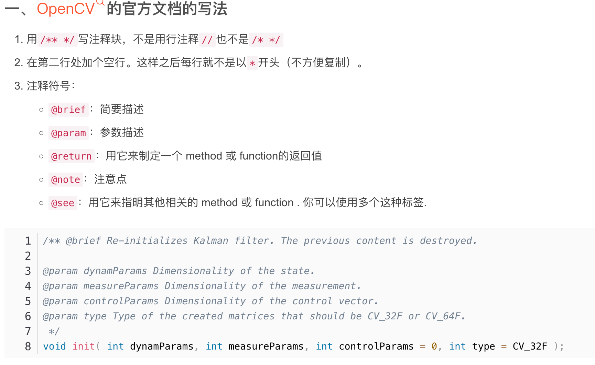

#### [clsx.js 条件用类](https://github.com/lukeed/clsx#readme)

> 与 classnames 用法一致，but classnames 针对所有浏览器，clsx 主要针对 react 中使用

- 同名包中的 `clsx()` 函数是一个 JavaScript 实用程序，用于设置设置 `className` 属性值的条件。它接受无限数量的参数，不限于一种特定类型。

- 最终，`clsx()` 函数**返回一个 `string` 插值**，检查 JavaScript 变量的 `boolean` 值并相应地应用类

- 会被丢弃的值

  - ```js
    clsx(true, false, "", null, undefined, 0, NaN);
    ```

```jsx
// classNameTwo的存在与否，根据number的值进行动态展示
import "./styles.css";
import clsx from "clsx";
const classNameOne = "redButton";
const classNameTwo = "blueBorder";
export default function App() {
  const number = 3;
  return (
    <div className="App">
      <button className={clsx(classNameOne, { [classNameTwo]: number > 5 })}>
        A sample button
      </button>
    </div>
  );
}

// => className='foo bar baz quux'
<div
  className={clsx("foo", { bar: true, duck: false }, "baz", { quux: true })}
/>;

const menuStyle = clsx({
  [classes.root]: true, //always applies
  [classes.menuOpen]: open, //only when open === true
});
```

#### 多栏布局拖拽

[vue 实现多栏布局拖拽（改变盒子的宽度）\_vue 拖拽改变盒子大小-CSDN 博客](https://blog.csdn.net/Little_Fishs/article/details/120150460)

#### 主题切换工程化方案

- https://juejin.cn/post/7414732430160183296

##### css 变量方案

- 按梯度层析，定义一系列 css 颜色变量

  - tailwindcss 预设颜色值

- 将梯度 css 变量作为颜色值使用

  - `background-color: theme('colors.gray.500');`

- 在业务代码中利用 css 变量来设置颜色

  ```css
  .app {
    background-color: var(--bg-color);
    color: var(--text-color);
  }
  ```

- 添加切换主题的功能：点击切换时更换根元素类名 或 css 变量的值

### Vercel-网站托管

> 将网站托管到 vercel，而不用购买服务器

- [官网，注册账号](https://vercel.com/new)

- 导入代码仓库 或 本地操作

- 本地

  - 全局安装 vercel `npm i -g vercel`

  - 在本地项目的根目录 新建`vercel.json`

    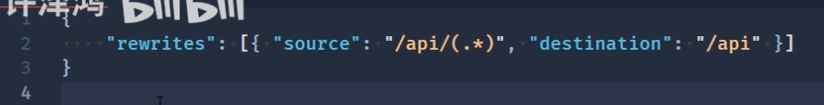

    ```json
    {
      "rewrites": [{ "source": "/api/(.*)" }]
    }
    ```

  - 根目录新建 api 文件夹/index.js

    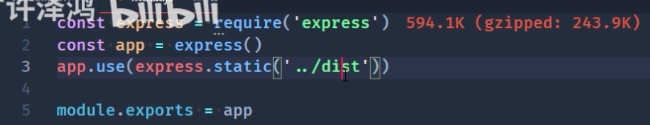

  - 命令行登陆 vercel `vercel login` 自动跳转到网页进行登陆，成功示例：

    

  - 本地命令行继续输入 `vercel` 进行推送，进行配置，自动上传成功

  - 后续修改后，只需输入 vercel 会自动推送

  - 更多配置...

### 前端安全

- [如何安全传输存储用户密码？](https://www.cnblogs.com/jay-huaxiao/p/14224777.html#:~:text=总结 1 因此，一般使用 https 协议 %2B 非对称加密算法（如 RSA）来传输用户密码，为了更加安全，可以在前端构造一下随机因子哦。 2,使用 BCrypt %2B 盐存储用户密码。 3 在感知到暴力破解危害的时候， 「开启短信验证、图形验证码、账号暂时锁定」 等防御机制来抵御暴力破解。)
- JavaScript 库**「jsencrypt」**

### 前端可观测性

> 前端可观测性是一套科学完整的性能检测、分析、优化体系。包含：页面指标、网络传输、服务可靠性、用户体验。
>
> - https://www.bilibili.com/video/BV19a411A72Y/?spm_id_from=333.337.search-card.all.click&vd_source=49059bedc59884104ea6ef0a6e552378
> - [Clarity (microsoft.com)](https://clarity.microsoft.com/)
> - [百度统计——一站式智能数据分析与应用平台 (baidu.com)](https://tongji.baidu.com/web5/10000607949/welcome/login)

- 构建前端可观测性的基础条件

  - 在浏览器有一套 收集发送指标的逻辑

  - 服务器对指标进行存储和处理 ß

  - 对指标进行可视化展示
    - [timeline](https://ilkeryilmaz.github.io/timelinejs/)时间轴、
      - three.js、D3.js、Echarts、[scichart](https://www.scichart.com/examples/javascript-chart/)、[chart.js](https://www.chartjs.org/docs/latest/)、

- 借助第三方产品
  - 观测云
  - 听云
  - 友盟+

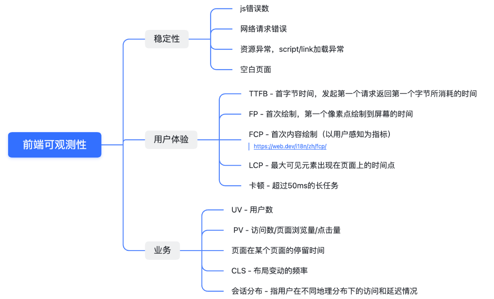

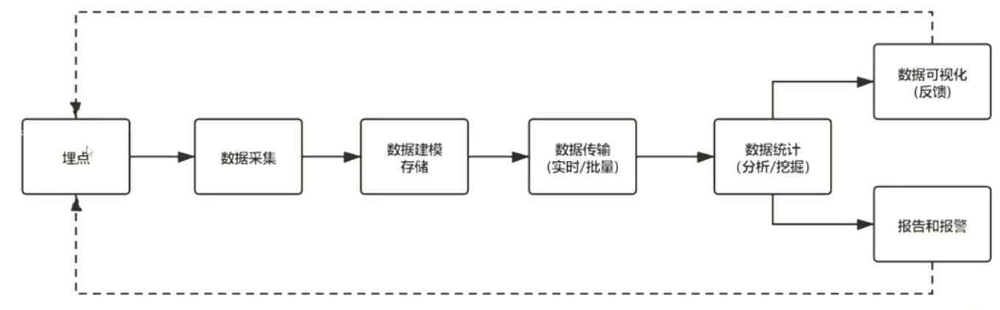

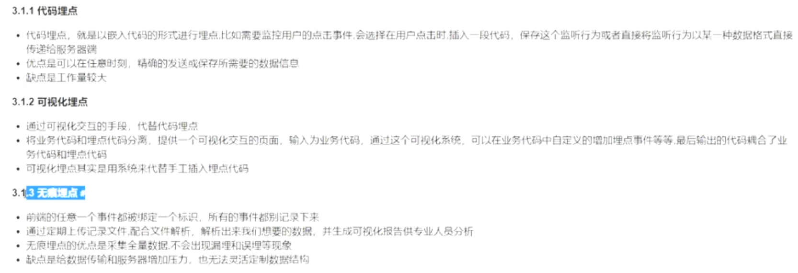

-

#### 异常捕获

- 监听全局未捕获的错误`监听 window的 error事件`

  ```js
  window.addEventListener("error",function(event){
    // event错误事件对象
    event.message // 报错信息
    event.filename // 报错的文件
    event.lineno   event.columnNo // 报错的行列
    event.error.stack // 报错的堆栈信息
  
    let log = {}
  })
  ```


## 组件库开发

- BEM（block element modifier）规范

  ```typescript
  // block-代码块    element-元素     modifier-装饰    state-状态
  // z-button  z-button_element z-button_element--disable  is-disable is-enabeld 诸如此类的命名
  
  // 但是为了便书写，可封装函数操作   实现  :clss=[bem.b()]   =>  z-button
  
  function _bem(prefixName:string,blockSuffix:string,element:string,modifier:string){
      if(blockSuffix) prefixName+=`-${blockSuffix}`
      if(element) prefixName+=`__${element}`
      if(modifier) prefixName+=`--${modifier}`
      return prefixName
  }
  
  function createBEM (prefixName){
      const b = (blockSuffix:string = '') => _bem(prefixName,blockSuffix,'','')
      // element 无值时取空，而不应返回一个block，由于与后续控制样式
      const e = (element:string = '') => element ? _bem(prefixName,'',element,'') : ''
      const m = (modifier:string = '') => modifier ? _bem(prefixName,'','',modifier) : ''
     	const be = (blockSuffix:string,element:string) => blockSuffix && element ? _bem(prefixName,blockSuffix,element,'') : ''
      const bm = (blockSuffix:string,modifier:string) => blockSuffix && modifier ? _bem(prefixName,blockSuffix,'',modifier) : ''
      const em = (element:string,modifier:string) => element && modifier ? _bem(prefixName,'',element,modifier) : ''
      const bem = (blockSuffix:string,element:string,modifier:string) =>  blockSuffix && element && modifier ? _bem(prefixName,blockSuffix,element,modifier) : ''
  
      const is = (name:string,state:any) => state ? `is-${name}` : ''
  
      return { b,e,m,be,bm,em,bem,is }
  }
  
  export function cerateNamespace(name:string)=>{
      const prefixName = `z-${name}`;
      return createBM(prefixName);
  }
  
  // 测试 , js生成类名
  const bem = cerateNamespace('icon')
  bem.b()   // 输出： z-icon
  bem.b('box')   // 输出： z-icon-box
  bem.e('ele')   // 输出： z-icon__ele
  bem.is('checked',true)   // 输出： is-checked
  ```

## 单元测试

> [探索前端单元测试之路 从入门到精通 Vitest ](https://blog.csdn.net/qq_41867608/article/details/136376417)
>
> [「敏捷架构」核心实践：测试驱动开发(TDD)简介 - 知乎 (zhihu.com)](https://zhuanlan.zhihu.com/p/404832754)
>
> - 优势：及时发现 bug、改善代码质量、check 他人代码、活文档
> - 最佳写测试时机：通过单测替代手动验证 或 先写测试再实现 TDD 敏捷开发。

```js
// 安装 vitest 依赖  注：Vitest 1.0 需要 Vite >=v5.0.0 和 Node >=v18.0.0
pnpm add -D vitest


```

## 前端性能优化

#### 性能指标

> - [前端性能优化 —— 页面性能指标及工具-CSDN 博客](https://blog.csdn.net/m0_60166861/article/details/134331310)
> - [【一】前端性能监控之请求耗时统计 - 掘金 (juejin.cn)](https://juejin.cn/post/7218121928799764535)
> - [如何计算浏览器页面的帧数 FPS？ - 知乎 (zhihu.com)](https://zhuanlan.zhihu.com/p/590686870)

##### 打包视图分析

> vue3 中 rollup-plugin-visualizer
>
> [vite3+vue3 项目打包优化实战之-视图分析（rollup-plugin-visualizer）、CDN 引入、依赖分包、gzip 压缩、history404 问题-CSDN 博客](https://blog.csdn.net/g18204746769/article/details/127431733)

##### Lighthouse 前端性能分析

- [lighthouse 工具](https://blog.csdn.net/m0_43550804/article/details/129756073#:~:text=Lighthouse是一个开源的自动化工具，用于帮助改进网络应用的质量。 可将其作为一个,Chrome 扩展程序运行，或从命令行运行。 Lighthouse 分析 web 应用程序和 web 页面，收集关于开发人员最佳实践的现代性能指标和见解，让开发人员根据生成的评估页面，来进行网站优化和完善，提高用户体验。)

#### 项目优化

##### 使用三方 CDN、依赖分包、

> [vite3+vue3 项目打包优化实战之-视图分析（rollup-plugin-visualizer）、CDN 引入、依赖分包、gzip 压缩、history404 问题-CSDN 博客](https://blog.csdn.net/g18204746769/article/details/127431733)
>
> - 借助 CDN 的特性，对打包后的体积进行分析，将部分较大的第三方包排除在打包之外，并使用 script 方式引入到项目中使用
>   - 常见公共 CDN（测试时间 24.04.09 fabricjs5.3.0）
>     - [字节跳动静态资源公共库 (bytedance.com)](https://cdn.bytedance.com/)
>     - [jsDelivr](https://www.jsdelivr.com/) 无对应版本资源
>     - [cdnjs](https://cdnjs.com/) 1.17s 834ms
>     - [Staticfile CDN](https://www.staticfile.net/) 260ms
>     - [UNPKG](https://unpkg.com/)
>     - [BootCDN - Bootstrap 中文网开源项目免费 CDN 加速服务](https://www.bootcdn.cn/)
>     - 自有服务器 101ms 17ms
> - vite 配置
>   - [MMF-FE/vite-plugin-cdn-import - Vite 中文文档 (viterc.cn)](https://www.viterc.cn/en/vite-plugin-cdn-import.html)
>   - [vite-plugin-cdn-import-async - npm (npmjs.com)](https://www.npmjs.com/package/vite-plugin-cdn-import-async)
>   - 注意：
>     - 容易由于错综复杂的依赖关系
>     - 或者异步记载的问题，导致执行时报错

```js
// vite-plugin-cdn-import
pnpm install vite-plugin-cdn-import --save-dev
// vite.config.js 基本用法
import reactRefresh from '@vitejs/plugin-react-refresh'
import importToCDN from 'vite-plugin-cdn-import'

import { defineConfig } from 'vite'
import vue from '@vitejs/plugin-vue'
import { autoComplete, Plugin as importToCDN } from 'vite-plugin-cdn-import';

export default defineConfig({
  plugins: [vue(),
   importToCDN({
    prodUrl: 'https://unpkg.com/{name}@{version}/{path}',
    modules: [
      autoComplete('vue'),
      {
        name: 'element-plus',
        var: 'ElementPlus', //根据main.js中定义的来
        version: '2.2.17',
        path: 'dist/index.full.js',
        css: 'dist/index.css'
      },
      {
        name: 'vue-demi',
        var: 'VueDemi', //根据main.js中定义的来
        version: '0.13.11',
        path: 'lib/index.iife.js'
      },
      {
        name: '@element-plus/icons-vue',
        var: 'ElementPlusIconsVue', //根据main.js中定义的来
        version: '2.0.9',
        path: 'dist/index.iife.min.js'
      },
    ],
  })
],
)}


// vite中  使用 vite-plugin-cdn-import   或  vite-plugin-cdn-import-async（性能更高？，可设置 defer/async ）
pnpm install vite-plugin-cdn-import-async --save-dev

// vite.config.js 基本用法
import cdnImport from 'vite-plugin-cdn-import-async'	// 引入cdnImport

export default {
    plugins: [
        cdnImport({
            modules: [
                {
                    name: 'react',
                    var: 'React',
                    mode: 'async', // 'async' atrribute will be added to its <script> tag.
                    path: `https://cdn.jsdelivr.net/npm/react@18.2.0/umd/react.production.min.js`,
                },
                {
                    name: 'lottie-web',
                    var: 'lottie',
                    mode: 'defer', // 'defer' atrribute will be added to its <script> tag.
                    path: `https://cdn.jsdelivr.net/npm/lottie-web@5.10.0/build/player/lottie.min.js`,
                },
                {
                    name: 'axios',  // Module without 'mode' param will be loaded synchronously.
                    var: 'axios',
                    path: 'https://cdn.jsdelivr.net/npm/axios@1.2.1/dist/axios.min.js',
                }
            ],
        }),
    ],
}

```

##### 开启 gzip

> Nginx 开启 Gzip apach 开启 gzip 前端脚手架开启 gzip cdn 开启 gzip
>
> [nginx 中如何设置 gzip（总结） - 范仁义 - 博客园 (cnblogs.com)](https://www.cnblogs.com/Renyi-Fan/p/11047490.html)

#### http 缓存

[前端缓存（浏览器缓存和 http 缓存）详解\_前端浏览器缓存-CSDN 博客](https://blog.csdn.net/hyupeng1006/article/details/126599764)

##### 强制缓存

> 直接从内存中读取目标资源，无需与服务器做任何通讯

- 基于 Cache-control 实现的强缓存（代替 Expires 的强缓存实现方法）

  - **max-age** 决定客户端资源被缓存多久。
  - **s-maxage** 决定代理服务器缓存的时长。
  - **no-cache ** 表示是强制进行协商缓存。
  - **no-store** 是表示禁止任何缓存策略，与 no-cache 互斥
  - **public ** 表示资源即可以被浏览器缓存也可以被代理服务器缓存。
  - **private** 默认值，表示资源只能被浏览器缓存，

  ```js
  //往响应头中写入需要缓存的时间,单位 秒 s
  
  res.writeHead(200, {
    "Cache-Control": "max-age=10", // 该资源第一次返回后开始，10秒内被再次请求，则从缓存中读取
    // Cache-control:max-age=10000,s-maxage=200000,public // 多个值使用,号分割
  });
  ```

##### 协商缓存

通过请求中携带文件修改时间 或 文件指纹 与服务器进行比对，判断是否使用缓存文件

#### 网页加载过程

- web 前端的开发与部署过程

  - 用户使用浏览器，借助网址向服务器获取【动态的、增量式】的静态资源
  - 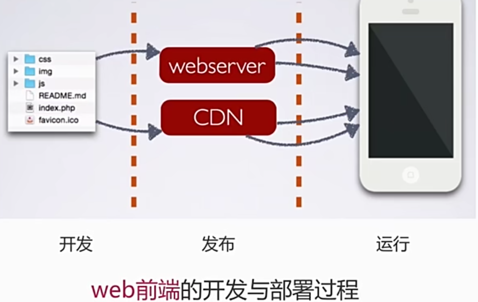

- 用户输入 url ，浏览器解析后发送到 DNS 服务器，查询 ip 地址【DNS 缓存，降低 dns 查询的时间？】

- 借助基础网络，传输到对应的服务器【使用 CDN 请求静态资源，解决网络缓存、线路选择等问题，但默认携带的 cookie 是一种浪费，不同的 cdn 域名可以解决；但 cdn 无法作为接口】

- 服务器接收到请求后，进行请求的分发处理 Contorller

  - Model 层，进行数据交互，读取数据库，获取数据
  - 最后将渲染好的页面通过 View，返会给网络--浏览器

- 浏览器接受数据【 减少 http 请求的次数和大小？】

  - rander 过程，浏览器将服务器返回的数据(html/css/js...)进行渲染【服务器端渲染？】

  - 浏览器生成 DOM 和 BOM 树，在进行 css 渲染，然后再去执行 js 相关的代码【渲染过程的优化？】

#### 资源的合并与压缩

**作用点：借助文件的合并减少 http 请求次数；借助文件压缩，减少请求文件的大小**

##### html 压缩

- 压缩在文本文件中有意义，但在 HTML 中不显示的字符，包括空格、制表符、换行符等，还有一些其他意义的字符，如：HTML 注释也可以被压缩
- HTML 压缩的效果不是很明显，但对于大量用户访问的网页来说，每 kb 的流量都不容忽视

##### html 压缩方式

- 使用网站在线压缩，适合初学者（但一般不用，使用 webpack...）
- node.js 提供了 `html-minifier`工具（可以进行很多的配置，具有可扩展性）
- 后端模板引擎渲染压缩（会增加服务端的计算量）

##### css 压缩

- 使用在线网站进行压缩
- 使用`html-minifier`库对 html 中的 css 进行压缩
- 使用`clean-css`库对 css 进行压缩

##### js 压缩与混乱

- 作用：无效字符的删除、剔除注释、代码语义的缩减和优化、代码保护(降低可读性)
- 方法：
  - 使用网站在线压缩
  - 使用`html-minifier`配置，对 js 进行压缩
  - 使用`uglifyjs2`对 js 进行压缩【】


##### 文件合并

- 不合并存在的问题

  - 文件与文件之间有插入的上行请求，增加了 N-1 个网络延迟

  - 受丢包影响更为严重

  - 经过代理服务器时可能会被断开

  - 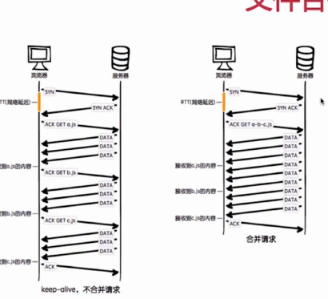

- 合并后的问题

  - 首屏渲染问题，合并后文件变大，首屏渲染可能减慢，需要适当分开
  - 缓存失效问题，任一文件的改动，会导致文件缓存大面积失效的问题

- 文件合并的建议

  - 公共库合并，对长期不经常改动的内合并
  - 不同页面的合并，对于单页应用，只加载当前页面，分别打包。
  - 见机行事，随机应变。

- 文件合并方法

  - 使用在线网站进行
  - 使用 node.js 实现文件合并，多种多样的库，自行挑选


#### 操作流程

##### 在线压缩工具

- 有一定的限制，可能不支持部分文件格式的压缩
- 分别手动对原生代码进行压缩
- 在 js 压缩过程中，需要手动根据依赖关系压缩后再合并
- 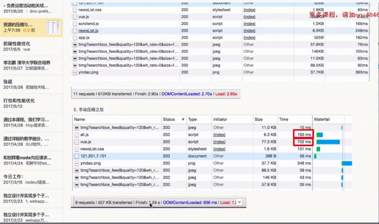

##### 构建工具的优点

- 对于大量的文件可以进行高效快速的构建
- 具有良好的可扩展性
- 可根据配置进行定制化的设置

##### webpack 构建工具(使用再学习)

##### fis3 构建工具(使用再学习)

- 流程：
  - 单文件编译过程，形成完整的结构
  - 打包，依据源文件的内容，进行压缩和混乱


#### 图片相关优化

**使用参考：文件大小、色彩的丰富度 根据不同场景进行选择**

##### 类型分类

###### JPG 图片- 有损压缩

- 情景：大部分**不需要透明图片**的业务场景
- 原始的数据与实际 jpg 压缩后的数据是不同的
- 但大多数 jpg 压缩并不影响肉眼观察
- 可能不支持透明，但实际使用大都可以透明

###### png8/png24/png32

- 情景：大部分需要**透明图片**的业务场景
- png8：256 色+支持透明，
  - 内部其实是一个颜色的索引表，每个颜色就是 2^8 的索引值，因此会小很多
  - 适用于颜色变化不特别丰富的图片
  - 缺点：支持的颜色比较少，不适合颜色丰富且相近的图片
- png24：2^24 色+不支持透明
  - 每一个索引值是 png8 的三倍
- png32：2^24 色+支持透明
  - 相比于 png24，增加了 8 位，用于支持透明

###### webp 压缩程度更好，再 ios 和 webview 有兼容性问题

- 压缩程度更好，建议安卓全部使用

###### svg 矢量图，代码内嵌，相对较小，图片样式相对简单的场景

- 情景：图片样式相对简单的业务场景
- 例如 icon 库，或者其他库....

###### gif 支持动画

##### 图片压缩

> 本质：针对图片真实情况，舍弃一些相对无关紧要的色彩信息
>
> - css 雪碧图：一些图片合并到一张图片，减少网站的 HTTP 请求数量（不常用）
>   - [Sprite Cow 雪碧图制作 - Generate CSS for sprite sheets](http://www.spritecow.com/)

###### Image inline

- 将图片的内容内嵌到 html 中，减少网站的 http 请求数量
- 适合大小较小的图片，建议 8kb 以下做 inline image 使用
- 特点：导致页面文件变大，但减少了一次 http 请求
- 

###### svg 矢量图

- 使用 svg 标签进行矢量图的绘制
- 使用 iconfont 解决 icon 问题
- 优点：速度和大小都会有很好的优化
- 学习：w3c

###### webp

- 优势：具有更优的图像数据压缩算法，能带来更小的体积，拥有无差别的图像质量
- 具备无损和有损的压缩模式、Alpha 透明、动画特性
- 再 PNG 和 JPEG 上的转哈效果都非常优秀、稳定和统一

##### 转换方法

###### 格式转换

- [TinyPNG – Compress WebP, PNG and JPEG images intelligently](https://tinypng.com/)
- [智图*图片压缩在线工具*在线制作 webp (isux.us)](https://zhitu.isux.us/)
- [SVG 教程 (w3school.com.cn)](https://www.w3school.com.cn/svg/index.asp)
- 图片格式的降级：兼容性服务，如果不支持更好的 webp 格式，自动转化为 jpg 格式(淘宝网)
- 转换方法
  - 手动更改转换
  - 使用 webpack 或者 fis3 等其他自动化工具，进行插件配置还能控制压缩率
  - 后端服务自动转换

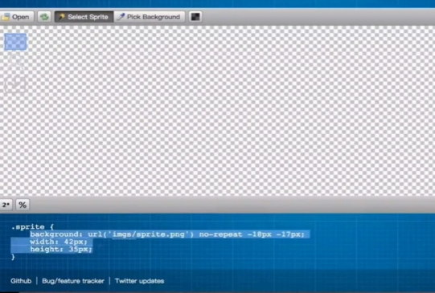

#### css 和 js 的装载与执行

- 学习目标：
  1. 理解浏览器端 html、css、js 的加载过程
  2. 结合 chrome 的能力学习掌握加载过程中的优化点
- 渲染的过程
  1. 拿到 html 文件后渲染为 DOM 树
     - HTML 渲染特点
     - 词法分析，由上至下顺序执行生成 DOM，
     - 多种资源的加载是并发进行加载的(受浏览器对单个域名并发请求限制)，因此一个网站常使用多个 cdn 服务
     - 是否阻塞：css 加载阻塞 js 加载？js 加载阻塞 js 执行？
       - css 在 head 中阻塞页面的渲染，当 css 加载完再渲染 html(推荐)
       - css 阻塞 js 的执行，因为 js 的执行可能操作 css 的内容
       - css 不阻塞外部脚本的加载，并发加载
       - 直接引入的 js 阻塞页面的渲染，存在 js 操作 dom 时，影响 dom 加载
       - js 不阻塞资源的加载（有一个预先扫描器，不执行先加载）
       - js 顺序执行，阻塞后续 js 逻辑的执行
     - 依赖关系：css 资源加载过慢时，出现屏闪问题(等完全渲染完后再显示)
     - 引入方式：
       - css：link 和 @import
       - js：script 和 路由动态引入 和 和
  2. 再根据 css 样式生成 CSSOM 树
  3. 将两者合并渲染为页面


#### CSS

- 使用`transfrom`,手动开启 3d 模式，可以代开系统渲染
  - 对比`position`定位的移动，会好很多（通过浏览器“性能 performance” 监测数据）
  - https://www.cnblogs.com/rmticocean/articles/16918354.html

#### JS

- 尽可能避免污染全局变量，全局声明的变量不会被垃圾回收机制回收
- 局部变量在代码调用结束之后，就会释放对应的内存空间，提高代码性能

#### 总结-优化点

1. 减少 HTTP 请求数量

   - 多域名 不超过 6 个，有的会根据域名进行限制，同一域名同一时刻会限制请求数量
   - 合并代码，使用雪碧图、精灵图或 canvas、svg 等方式将图片转为代码
   - 使用更合理的代码逻辑，防抖节流等减少请求

2. 压缩请求数据的大小，减少每次请求的代码量

   - 一般借助打包工具，对代码、图片进行压缩
   - 代码逻辑中去除重复的 脚本/代码 引用

3. 较少 cookie 体积，会在每次请求中携带，影响请求的速度

4. 延迟加载非必要的引用脚本 - 当前太慢，砍当前

   - 均摊第一次加载时的任务量，提升体验

5. 预加载可能需要的内容 - 当前太慢，牺牲上次

   - 在上次加载中 提前加载本次需要的内容

6. 减少 DOM 元素的层级

7. 减少 css 代码中，标签嵌套的层级

8. 减少 DOM 的访问次数，较少 DOM 的重构(回流)，和不必要的重绘

9. 使用特别的属性，opacity、transform、

   > 这些属性能够在不同的层，进行单独绘制，不会导致页面重绘
   >
   > 间接使用设备 GPU 硬件渲染，提升效率

10. 合理利用 HTTP 缓存，浏览器缓存，利用静态资源

    - 本地缓存、避免重复加载

##### 网页加载阶段分析

1. 网页资源请求与加载阶段 ( DevTools 查看请求各阶段耗时)

   - 浏览器对每个源允许的 TCP 连接数量限制

     > 现状：Chrome 基于 `http`只允许 6 个 TCP 同一时刻连接同一源
     >
     > 方案：
     >
     > - 将多个资源分布在不同的子域名上，减少请求队列的等待时间；
     > - 但不同的域，需要不同的 DNS 域名解析过程（通常划分为 3-5 个域名比较合适）
     > - DNS 解析记录会在浏览器中进行缓存，因此推荐使用 `公共CDN托管`

2. 网页渲染阶段( DevTools 查看网页渲染各部分耗时`Paining\Rendering`)

   - 获取 HTML 生成 DOM 树，同时下载 css、js 文件

   - 将 CSS 解析为`CSSOM 层叠样式表模型`

     > 过于复杂的 css 嵌套规则会影响 CSSOM 的生成，导致渲染时间延长

   - JS 引擎处理 JS

     > 如果在页面渲染时，使用 JS 操作 DOM，则会阻塞渲染
     >
     > 推荐方案：将 Js 代码放在页面代码底部 `</body>`前

   - 将 DOM 和 CSSOM 构建成为`渲染树`，生成用户界面


### 字体压缩

#### [font−spider](https://link.juejin.cn/?target=https%3A%2F%2Fgithub.com%2Faui%2Ffont-spider%2Fblob%2FHEAD%2FREADME-ZH-CN.md) 

> 智能 WebFont 压缩工具，它能自动分析出页面使用的 WebFont 并进行按需压缩
>
> - [aui/font-spider (github.com)](https://github.com/aui/font-spider/blob/HEAD/README-ZH-CN.md)
> - [ttf 字体包压缩优化 - 掘金 (juejin.cn)](https://juejin.cn/post/7161359760023879693)
> - 更简单的在线字体压缩工具：

```js
// 1.安装
npm install font-spider -g

// 2.新建用于转换文本的 html 文件，把需要用的文案粘贴进去
<!DOCTYPE html>
<html lang="en">
<head>
  <meta charset="UTF-8">
  <meta name="viewport" content="width=device-width, initial-scale=1.0">
  <title>Document</title>
  <style>
    @font-face {
      font-family: 'convert-font';
      /* src: url('./Alibaba-PuHuiTi-Bold.ttf') format('truetype'); */
      src: url('./Alibaba-PuHuiTi-Medium.ttf') format('truetype');
      font-weight: normal;
      font-style: normal;
    }

    .convert-font {
      font-family: 'convert-font';
    }
  </style>
</head>
<body>
  <div>
    Lorem ipsum dolor sit amet consectetur, adipisicing elit. Quam quos minima autem animi quae itaque assumenda doloribus, similique dicta sequi, molestias tenetur quaerat qui suscipit ducimus labore, saepe debitis adipisci!
  </div>
  </br>
  <div class="convert-font">
    Lorem ipsum dolor sit amet consectetur adipisicing elit. Blanditiis amet error quae perferendis eum repellendus
    necessitatibus quod, minus commodi? Quis eaque iusto distinctio libero eos architecto deserunt mollitia, aliquid
    tempora.
  </div>
</body>
</html>

// 3.在该项目文件夹内执行命令
font-spider index.html
    
// 4.查看并使用文件夹内新增的 .font-spider 中文件
```


## PWA

> 渐进式web应用，给用户原生引用体验；运用现代的Web Api及传统的渐进式增强策略创建跨平台web应用程序。
>
> - https://developer.mozilla.org/zh-CN/docs/Web/Progressive_web_apps/Guides/Caching
> - https://www.pwabuilder.com/

- 优势
  - 渐进式，适用于所有浏览器
  - 流畅，能够借助Service Worker在离线或者网络较差的情况下正常访问
  - 可安装、具备原生体验：首屏加载动画、隐藏地址栏等
  - 粘性：通过推送离线通知，让用户回流
- PWA应用 三要素
  - HTTPS 服务支持
  - manifest.json 清单
  - service worker


### manifest清单

- web app manifest 应用程序清单
  - 作用：提供有关应用的配置信息
  - 注意：
    - 需要在https协议下才能访问！！！

```js
// 1.在项目更目录 创建manifest.json文件
// 2.在index.html中引入 manifest.json
<link ref='manifest' href='manifest.json' />
    
    
// 3.manifest配置信息;
name:'应用名称';	// 用户安装横幅提示的名称，和启动画面的文字
short_name:'应用的短名称'; // 用于主屏幕展示
description:''; // 描述
start_url:'/'; // 指定用户设备启动时加载的url，绝对路径/相对路径
icons:[]; // 在各种环境中应用程序图标的对象数组
background_color:''; // 指定用户启动动画的背景颜色
theme_color:''; // 指定应用程序的主题颜色
display:'' // 指定应用程序的显示模式
// - fullscreen 全屏显示，不显示状态栏
// - standalone 更像原生App
// - minimal-ui 保留浏览器栏
```


### ServiceWorker

> - [【性能优化】Service Worker 能做的远比你想象的多 - 掘金 (juejin.cn)](https://juejin.cn/post/7067113836372819982)
> - [vite pwa项目使用 - 掘金 (juejin.cn)](https://juejin.cn/post/7039258299086143524#heading-1)
> - [添加配置项 · imsyy/home@ddda08c (github.com)](https://github.com/imsyy/home/commit/ddda08c03770ce8845ef10b354338f713ffa3e81)

- 14年提出的 HTML5 API，主要用来做持久的离线缓存
- 特点
  - 允许web应用在网络较差或离线环境下依旧可以使用，静态资源优先读缓存或不常变更的资源优先读取缓存
  - 是一个独立的worker线程，相当于当前网页进程，是一种特殊的webworker
  - 一旦被install就永远存在，除非被手动 unregister
  - 独立于主线程之外，使用时被唤醒，不使用时自动休眠
  - 可编程拦截代理请求和返回，缓存的文件可以被网页进程取到(包括离线状态)
  - 离线内容开发者可控
  - 必须在HTTPS环境下工作
  - 异步实现，内部大都是通过Promise实现
- 生命周期
  - install 在serviceWorker注册成功时触发，主要用于缓存资源
  - activate 在serviceWorker激活时触发，用于删除旧的资源
  - fetch 发送请求时触发，用于操作缓存或读取网络资源
- 注意
  - sw.js 文件发生变化时，install 会重新触发
  - activate 事件会在install事件后触发，但由于sw.js文件改变引起的install事件中由于serviceWorker已经存在，就会处于等待状态，直到当前serviceWorker终止
    - 可通过`self.skipWaiting()`方法跳过等待，返回Promise对象
    - 通过`self.waitUntil()`方法结束一个Pomise对象，会在Promsie结束后结束当前生命周期函数，防止浏览器在异步操作之前就停止了生命周期。
  - 注册serviceWorker默认在下次刷新页面时才生效；`claim()`方法会立即控制这些页面

```js
// 在window.onload 中注册 service worker,防止与其他资源竞争
// navigator对象中内置了 serviceWorker属性
// 兼容性判断： if('serviceWorker' in navigator){}
// register注册serviceWorker，返回Promise对象

// index.html
window.onload = ()=>{
    if('serviceWorker' in navigator){
        navigator.serviceWorker.register('./sw.js')
            .then(resitration=>{console.log(resitration)})
        	.catch(err=>{console.log(err)})
    }
}

// sw.js 
self.addEventListener('insatll',event=>{
    // 等待skipWaiting跳过等待结束，再触发activate事件
    event.waitUntil(self.skipWaiting())
})

self.addEventListener('activate',event=>{
    // 表示serviceWorke激活后，立即获取控制权
    event.waitUntil(self.clients.claim())
})

self.addEventListener('fetch',event=>{
    //
})
```


### CacheStorage缓存


### notification通知


### 更现代的PWA做法

- https://vite-pwa-org.netlify.app/
- https://www.pwabuilder.com/
- 


## WebAssembly

> 了解AssemblyScript：基于TS的语言，可编译为WebAssembly  ?

- 特点：
  - WebAssembly一种新的编码方式，属于低级的类汇编语言，具备紧凑的二进制格式，接近原生性能运行，编译其他语言并在 Web运行。可与 JavaScript 协同工作。
  - 编译和优化：wasm是体积小且加载快的二进制格式，用于充分发挥硬件能力以达到原生执行效率
  - 可使用非 JavaScript 编程语言编写代码在浏览器运行的技术方案，是一种新的字节码格式。最终编译为`.wasm`文件
  - 快速、高效、可移植、限制在安全沙箱中运行，遵循浏览器的同源策略和授权策略
  - wasm文件体积更小，下载速度更快，解析比JS更快
  -  WebAssembly模块 在很多方面和 ES模块等价
  - JavaScript API 为开发者提供了创建模块、内存、表格和实例的能力
  - 任意的 JavaScript 函数都能被 WebAssembly 代码导入并同步调用
- 可能的由来
  - 3D 游戏、虚拟现实、增强现实、计算机视觉、图像/视频编辑等大量要求原生性能的领域中JS性能受限
- 相关概念
  - 模块：被浏览器编译为可执行机器码的WebAssembly二进制代码；无状态的；支持像ES模块的声明导入导出
  - 内存：可变长的ArrayBuffer。本质上是连续的字节数组。WebAssembly 的低级内存存取指令可进行读写操作。
  - 表格：可变长的类型化数组，存储不能作为原始字节存储在内存里的对象的引用。
  - 实例：模块及其在运行时使用的所有状态，包括内存、表格和一系列导入值。
- 入门
  - 使用 [Emscripten](https://emscripten.org/) 移植一个 C/C++ 应用程序。
  - 直接在汇编层，编写或生成 WebAssembly 代码。【略】
  - 编写 Rust 程序，将 WebAssembly 作为它的输出。
  - 使用 [AssemblyScript](https://www.assemblyscript.org/)，它类似于 TypeScript 并且可编译成二进制 WebAssembly 代码。


### [JS接口](https://developer.mozilla.org/zh-CN/docs/WebAssembly/JavaScript_interface)

- 方法
  - [`WebAssembly.instantiate()`](https://developer.mozilla.org/zh-CN/docs/WebAssembly/JavaScript_interface/instantiate_static)   编译和实例化 WebAssembly 代码，返回一个 `Module` 和第一个`Instance`实例
  - [`WebAssembly.instantiateStreaming()`](https://developer.mozilla.org/zh-CN/docs/WebAssembly/JavaScript_interface/instantiateStreaming_static) 【推荐】直接从流式底层源编译和实例化 WebAssembly 模块
  - [`WebAssembly.compile()`](https://developer.mozilla.org/zh-CN/docs/WebAssembly/JavaScript_interface/compile_static)  把 WebAssembly 二进制代码编译为一个 [`WebAssembly.Module`](https://developer.mozilla.org/zh-CN/docs/WebAssembly/JavaScript_interface/Module) ，不进行实例化
  - [`WebAssembly.compileStreaming()`](https://developer.mozilla.org/zh-CN/docs/WebAssembly/JavaScript_interface/compileStreaming_static)  直接从流式底层源代码编译[`WebAssembly.Module`](https://developer.mozilla.org/zh-CN/docs/WebAssembly/JavaScript_interface/Module) ，将实例化作为一个单独的步骤
  - [`WebAssembly.validate()`](https://developer.mozilla.org/zh-CN/docs/WebAssembly/JavaScript_interface/validate_static)    校验 WebAssembly 二进制代码的类型数组是否合法，合法则返回 true，否则返回 false
- 构造器
  - [`WebAssembly.Global()`](https://developer.mozilla.org/zh-CN/docs/WebAssembly/JavaScript_interface/Global)   创建一个新的 WebAssembly `Global` 全局对象。
  - [`WebAssembly.Module()`](https://developer.mozilla.org/zh-CN/docs/WebAssembly/JavaScript_interface/Module)   创建一个新的 WebAssembly `Module`模块对象。
  - [`WebAssembly.Instance()`](https://developer.mozilla.org/zh-CN/docs/WebAssembly/JavaScript_interface/Instance)	创建一个新的 WebAssembly `Instance`实例对象。
  - [`WebAssembly.Memory()`](https://developer.mozilla.org/zh-CN/docs/WebAssembly/JavaScript_interface/Memory)   创建一个新的 WebAssembly `Memory`内存对象。
  - [`WebAssembly.Table()`](https://developer.mozilla.org/zh-CN/docs/WebAssembly/JavaScript_interface/Table)	创建一个新的 WebAssembly `Table`表格对象。
  - [`WebAssembly.CompileError()`](https://developer.mozilla.org/zh-CN/docs/WebAssembly/JavaScript_interface/CompileError)	创建一个新的 WebAssembly `CompileError`编译错误对象。
  - [`WebAssembly.LinkError()`](https://developer.mozilla.org/en-US/docs/WebAssembly/JavaScript_interface/LinkError)	创建一个新的 WebAssembly `LinkError`链接错误对象。
  - [`WebAssembly.RuntimeError()`](https://developer.mozilla.org/zh-CN/docs/WebAssembly/JavaScript_interface/RuntimeError)	创建一个新的 WebAssembly `RuntimeError`运行时错误对象。


### C/C++移植

> - 在线编辑    https://anonyco.github.io/WasmFiddlePlusPlus/
> - Emscripten   https://emscripten.org/
> - MDN文档    https://developer.mozilla.org/zh-CN/docs/WebAssembly/C_to_Wasm

- Emscripten 工具可以将任何 C/C++ 源代码编译成 Wasm 模块


#### Emscripten 

> Emscripten 工具可以将任何 C/C++ 源代码编译成 Wasm 模块，再加上必要的 JavaScript 粘合代码，用于加载和运行模块，以及显示代码结果的 HTML 文档。
>
> 

- 工作流
  1. Emscripten 首先把 C/C++ 提供给 `clang+LLVM —— 成熟的开源 C/C++ 编译器工具链`
  2. Emscripten 将 clang+LLVM 编译的结果转换为 Wasm 二进制文件
  3. WebAssembly 本身无法直接访问 DOM；它只能调用 JavaScript，并且只能传入整型和浮点型的原始数据类型作为参数 【 计划将来[允许 WebAssembly 直接调用 Web API](https://github.com/WebAssembly/gc/blob/master/README.md) 】


### Rust移植

- 两大主要用例
  - 构建完整应用——整个 Web 应用都基于 Rust 开发！   参考[`yew`](https://github.com/DenisKolodin/yew)项目
  - 构建应用的组成部分——在现存的 JavaScript 前端中使用 Rust【重点】
- MDN文档： https://developer.mozilla.org/zh-CN/docs/WebAssembly/Rust_to_Wasm


### [AssemblyScript](https://www.assemblyscript.org/)

> - 将 TypeScript 的严格变体编译为 WebAssembly，让网络开发者可以继续使用他们熟悉的 TypeScript 兼容工具，如 Prettier、ESLint、VS Code IntelliSense 等
> - https://www.assemblyscript.org/
> - 针对WebAssembly 的功能集、与 TypeScript 的相似性、与现有的Web 生态系统集成 


