# 前后端通信

## 前期基础

### 搭建本地服务器

1. 安装 [phpstudy- 小皮面板(xp.cn) ](https://www.xp.cn/download.html)

   > 1.软件安装目录中最好不要出现中文字符
   >
   > 2.只有局域网内可访问
   >
   > 3.内网穿透可以接入互联网让所有人访问

2. 设置服务器文件(_更改网站根目录的文件_)，

3. ip 地址可分享给局域网内的用户访问，或进行内网穿透操作

   - 端口问题：默认服务器软件端口为 80

4. 服务器分类

   - 按服务类型：文件服务器、数据库服务器、邮件服务器、Web 服务器等；
   - 按操作系统：Linux 服务器、Windows 服务器等；
   - 按应用软件：Apache 服务器、Nginx 服务器、IIS 服务器、Tomcat 服务器、Node 服务器等

5. 服务器软件

   - 文件服务器：Server-U、FileZilla、VsFTP 等；
   - 数据库服务器：Oracle、MySQL、PostgreSQL、MSSQL 等；
   - 邮件服务器：Postfix、Sendmail 等；
   - HTTP 服务器：Apache、Nginx、IIS、Tomcat、NodeJS 等；

### 浏览器机制

> 浏览器 Browser 服务器 Server 客户端 Client

- BS 架构：浏览器 服务器 ；

  - 十分便捷，但性能受限

  C S 架构： 客户端 服务器

  - 必须安装对应的客户端、性能更好，画面更炫

- url 地址的组成

  - http：//www.baidu.com/index.html
  - http：服务器与客户端之间的通信协议 www.baidu.com：服务器名称 /index.html：资源在服务器上具体的存放位置

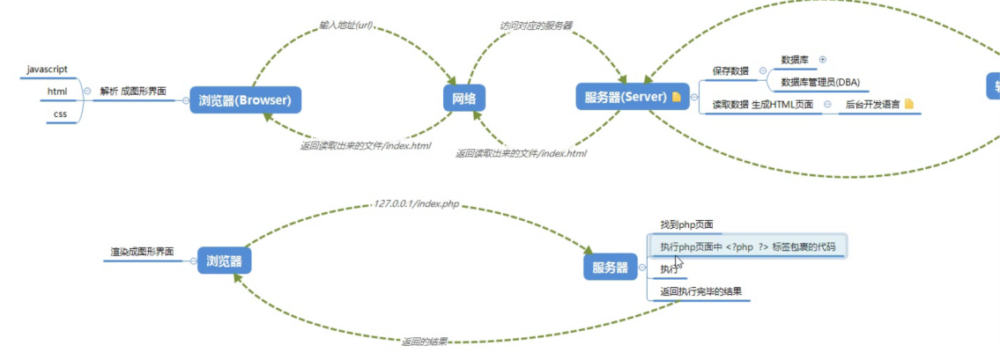

### 网络传输协议

#### 1.常见协议

- http、https
  - 超文本传输协议：协议规定了浏览器和万维网服务器之间的通信规则
  - 对由客户机到服务器的请求 和 从服务器到客户机的响应 进行了约束和规范
  - HTTP 抓包工具：HttpWatch、Fiddler、Charles、FireBug、chrome dev tools
- fps 文件传输协议
- smtp 简单邮件传输协议

`常用请求方式：get post  put delete`

#### 3.请求报文

`包含：请求行、请求头、请求主体`

- 请求行：
  - 由请求方式、请求 URL 和协议版本构成
  - 例：`POST /s?ie=utf-8 HTTP/1.1`
- 请求头
  - Host：localhost 请求的主机
  - Cache-Control：max-age=0 控制缓存
  - Accept：_/_ 接受的文档 MIME 类型
  - User-Agent：很重要
  - Referer：从哪个 URL 跳转过来的
  - Accept-Encoding：可接受的压缩格式
- 请求主体
  - 即传递给服务端的数据
  - 以 get 形式当不需要设置请求头
  - 当以 post 形式提交表单的时候，请求头`Content-Type: application/x-www-form-urlencoded`

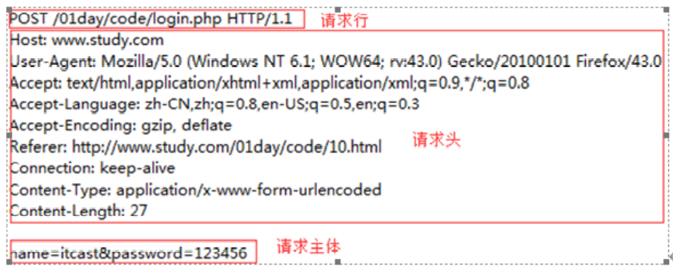

#### 4.响应报文

`包含：状态行、响应头、响应主体`

- 状态行
  - 由协议版本号、状态码和状态信息构成
  - 常见状态码：`200成功、304文档未修改、403没有权限、404未找到、500服务器错误`
- 响应头
  - Date：响应时间
  - Server：服务器信息
  - Content-Length：响应主体长度
  - Content-Type：响应资源的 MIME 类型
- 响应主体
  - 即服务端返回给客户端的内容；

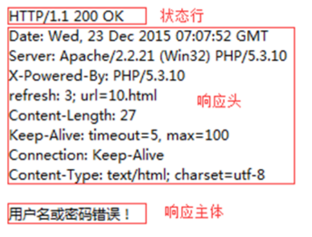


### from 表单提交数据

- `action`：指定提交的`url`
- `method`：指定提交的方法`post、get`，默认是`get`
- `name`：表单的名称，对提交的数据进行标记
- `target`：规定在何处打开页面`_blank  _self _parent _top`
- 注：每一个表单元素都要有`name`属性，它是作为提交后的 key 值

**提交后的数据格式**

- `get`提交 测试方便
  - 提交的数据拼接在`url`中 `xxx.php?key1=value1&key2=value2`
  - 问题：
    - 数据的安全性问题
    - `url`理论无限制长度，但部分浏览器会有限制
- `post`提交
  - 如果要上传文件必须使用`post`
  - 浏览器端没有提交数据大小的限制，服务器可能存在限制

### 了解 XML

- XML：可扩展标记语言，类似 HTML，其宗旨是用来传输数据，具有自我描述性（固定的格式的数据）
- XML 中没有预定义标签，完全自定义，用来表示一些数据（而 HTML 使用的都是预定义标签）
- 已经被淘汰的数据传输格式，替代者：JSON

在很久之前使用 XML 格式进行数据的前后端交互，再利用 js 对 xml 中的数据进行解析。

```XML
例：原数据：姓名：孙猴子，年龄108   用XML表示：
<student>
    <name>孙猴子</name>
    <age>108</age>
</student>
```

### 了解 Restful API

- https://zhuanlan.zhihu.com/p/334809573
- REST 不是一种技术，也不是一种协议
- 指的是一组架构约束条件和原则，提供了一种新的架构设计思路。满足这些约束和原则的应用程序或设计就是 RESTful
- 在 REST 规则中，有两个基本概念：对象、行为
  - 对象就是我们要操作的对象
  - 有四种常见的行为：GET -查看 POST -创建 PUT -编辑 DELETE -删除
- 传统没有任何规范和约束，容易混乱

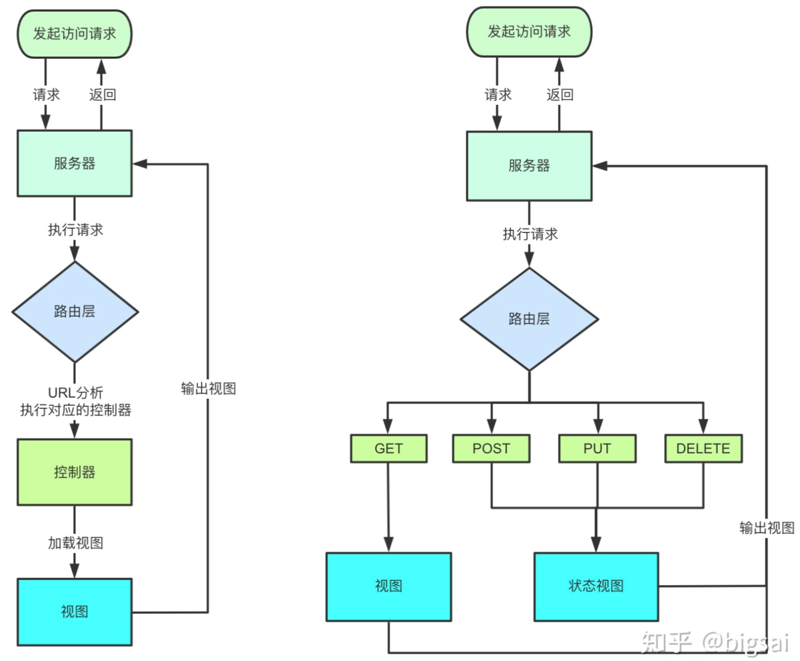

#### 请求方式

- HTTP 1.0
  - 三种方式：POST GET 和 HEAD 方法
- HTTP 1.1 新增六种请求方式

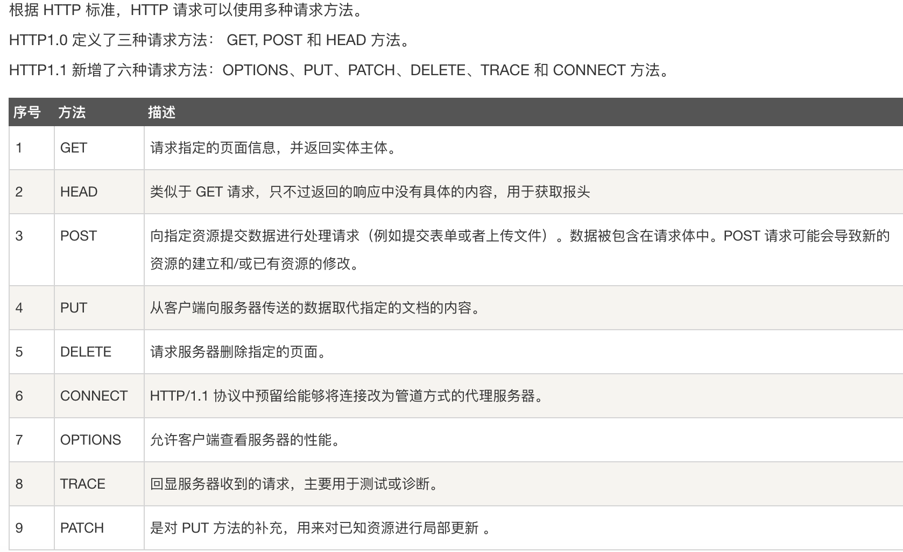

## ajax 编程

> - 本质：HTTP 协议的基础上以异步的方式与服务器进行通信 (异步 JS 和 XML)
> - 异步：指某段程序执行时不会阻塞其它程序执行，其表现形式为程序的执行顺序不依赖程序本身的书写顺序，相反则为同步。
> - 异步：各干各的 同步：必须执行完上一步才能下一步
> - XMLHttpRequest：浏览器的内置对象，用于与服务器通信，而不刷新页面，从服务器上请求数据

- 优点
  - 可以无刷新于与服务器进行通信
  - 允许根据用户事件更新部分页面内容
- 缺点
  - 没有浏览历史，无法回退页面
  - 存在跨域问题 (同源)
  - SEO 优化不友好，无法爬取到 ajax 中的数据

### 使用步骤

**步骤一：创建对象**

```js
var xhr = new XMLHttpRequest();
```

**步骤二、设置请求行; 请求方式 及 请求的 url 地址 **

```js
// get请求:数据追加在url地址后面  ？分割 采用键值对追加数据
xhr.open("GET", "index.php?name=lihua&agr=11");
```

**步骤三、请求头（）**

- GET 请求可以省略；post 不发送数据时也可以省略
- 请求头的设置必须放在 open 后面
- 请求头可以设置一些自定义请求头信息
  - 浏览器会有安全机制限制自定义的请求头,可以在后端进行配置即可解决
  - 后端配置：`response.setHeader("Access-Control-Allow-Headers","*)`表示接受任意的请求头

```js
// Content-type 设置请求体内容的类型

//发送json格式数据：
xhr.setRequestHeader("Content-type", "application/json;charset=UTF-8");
//发送表单数据
xhr.setRequestHeader(
  "Content-type",
  "application/x-www-form-urlencoded;charset=UTF-8"
);
//发送纯文本（默认值）
xhr.setRequestHeader("Content-type", "text/plain; charset=UTF-8");
//发送html文本
xhr.setRequestHeader("Content-type", "text/html; charset=UTF-8");

//字符编码可带可不带
```

**步骤四、注册回调函数两个方法**

- 方法 1.

```js
xhr.onload = function () {
  console.log(xhr.responseText);
}; //打印服务器返回的数据
```

- 方法 2（兼容性好）：

```js
// 事件绑定，处理服务端返回的结果
// xhr.readyState,表示状态 4响应完成(得到全部结果)  3:接收到响应主体(部分结果) 2:send方法调用完毕   1:open方法执行完毕得到头信息 0:初始的数据值
// xhr.status 响应码 2xx表示成功  304文档未修改   403没有权限  404代表没有权限   500服务器错误
xhr.onreadystatechange = function () {
  if (xhr.readyState == 4 && xhr.status >= 200 && xhr.status < 300) {
    console.log(xhr.responseText);
    // 处理结果 响应 行、头、空行、体
    // 响应行的状态码:xhr.status   响应状态字符串:xhr.statusText
    // 响应体:xhr.response
    console.log(xhr.status);
  }
};
```

**步骤五、请求主体 **

- send 中的数据必须是**字符串类型**
- 如果是对象或其他数据格式，需要使用 js 方法进行转化

```js
// get请求为空，或者写null
// post请求发送的数据写在请求主体中，没有数据时为 空/null
xhr.send(null);
```

### 代码示例

#### get 请求

```js
var xhr = new XMLHttpRequest();
xhr.open("GET", "index.php?name=lihua&agr=11");
//get请求不需要设置请求头
//打印服务器返回的数据
xhr.onreadystatechange = function () {
  //判断 服务器返回了所有结果  并 响应成功
  if (xhr.readyState === 4 && xhr.status >= 200 && xhr.status < 300) {
    console.log(xhr.response); //处理返回的结果
    //处理函数。。。
  } else {
  }
};
xhr.send(null);
```

#### post 请求

```js
// 创建对象 - 设置请求行 - 设置请求头 - 注册回调函数 - 发送请求
var xhr = new XMLHttpRequest();
xhr.open("POST", "index.php");
xhr.setRequestHeader("Content-type", "application/x-www-form-urlencoded");
xhr.onreadystatechange = function () {
  if (xhr.readyState == 4 && xhr.status == 200) {
    console.log(xhr.response); //处理返回的结果
    //处理函数。。。
  }
};
xhr.send("name=lihua&age=11");
```

#### get/post 差异

1. GET 没有请求主体，使用 xhr.send(null)
2. GET 可以通过在请求 URL 上添加请求参数
3. POST 可以通过 xhr.send('name=itcast&age=10')
4. POST 需要设置请求头
5. GET 效率更好（应用多）
6. GET 大小限制约 4K，POST 则没有限制

### 更多 API

- `xhr.onreadystatechange = function () {} 监听响应状态` 当响应状态码发生改变时执行
- `xhr.responseText  或  xhr.responseXML   //响应主体`
- `xhr.getAllResponseHeaders()    //获取全部响应头信息`
- `xhr.getResponseHeader('key')   //获取指定头信息`
- `xhr.responseType = 'json'` 设置响应体数据的类型，自动转换，写在最外层
- get 请求的效率更高，限制大小约 4k ；post 则没有大小限制

- 超时设置

  - `xhr.timeout = xxx` xxx 为数字，设置超时的毫秒数，不带单位
  - `xhr.ontimeout = function(){    }` 请求超时的回调函数

- 网络异常回调

  - `xhr.onerror = function(){    }` 网络异常时出发回调函数

- 手动取消发送的请求

  - `xhr.abort()` 当触发该方法时，就取消对应的 ajax 请求
  - 注：如果取消和创建请求不在一个函数体内，需要将 new 的接收者提前声明

- 请求重复发送问题

  - 请求较慢，用户重复多次发送同一个请求时，只保留最新的请求，能提高效率

  - ```js
    //代码示例：可以设置一个状态 标识变量
    let isSending = false;
    btn.onclick = function () {
      //判断 状态标识，如果正在发送就取消上一个请求
      if (isSending) x.abort();
      xhr = new XMLHttpRequest();
      //新建请求 就修改状态标识
      isSending = true;
      xhr.open("GET", "http://www.baidu.com/");
      x.send();
      x.onreadystatechange = function () {
        if (x.readyState === 4) {
          //响应完成就调整状态标识为 false，因为请求可能失败，所以不用判断相应码
          isSending = false;
        }
      };
    };
    ```

- IE 缓存问题

  - IE 浏览器，在 ajax 相同请求内容时，会走缓存信息，影响最新 ajax 数据的接受
  - 解决办法：请求时携带参数，内容为当前时间戳

  ```js
  xhr.open("GET", "http://127.0.0.1:8000/ie?t=" + Date.now());
  ```

### 封装 ajax 请求

#### axios

> 基于 Promise 对 xml 的封装

- 可以在 node.js / 浏览器中发送请求

- 支持 promise 异步方案
  - axios 请求的返回值是一个`promise对象`
- 响应状态码 头信息 字符串 响应体 都包含在响应结果中，且**经过处理**方便使用

- 安装：
  - yarn add axios 或 npm i axios
- **axios 请求方法** 别名

  | 方法名 (url、data、method 可以不在 config 中配置)                  | 描述 |
  | ------------------------------------------------------------------ | ---- |
  | axios.request(config)                                              |      |
  | axios.get(url[,config]) 或 axios.post(url[,data[,config]])         |      |
  | axios.delete(url[,config])                                         |      |
  | axios.head(url[,config])                                           |      |
  | axios.options(url[,config])                                        |      |
  | axios.put(url[,data[,config]]) 或 axios.patch(url[,data[,config]]) |      |

- **response 响应对象**

  ```js
  {
     data:{}, //服务器发回的响应数据
     status:200, //服务器响应的http状态码,可用于判断请求是否成功
     statusText:'OK',//服务器响应的HTTP状态描述
     headers:{}, // 服务器响应的消息报头
     config:{},// 为请求提供的配置信息
     request:{}, // 生成此响应的请求
  }
  ```

- **axios 请求配置**

  ```js
  {
     // 将自动加在请求的url之前，除非请求的url是一个绝对URL
     // 默认的 url 前部分，因此如果存在特定的url地址，可在请求时直接写绝对地址，于此处无影响
     baseURL:'http://wudetian.top/',
     // transformRequest ......
  }
  ```

- 更多内容查看 axios 相关课程和文档。。。

```js
// 发送GET请求
axios.get("http://127.0.0.1:8000/index.html",{
   //参数：
   params：{
      id:100,
      name:"1223"
   },
   // 设置请求头信息
   headers: {
      'content-type':'application/x-www-from-urlencoded'
   }
}).then(value => {
   // 输出返回的结果,包含很多信息
   console.log(value);
})
```

```js
axios({
  // 请求方法  默认值为get
  method: "POST",
  // 请求url
  url: "/front",
  // url参数,get请求/delete请求
  params: {
    vip: 10,
    name: "wu",
  },
  // 头信息
  headers: {
    a: 100,
    b: 200,
  },
  // 请求体参数,post请求/put请求...
  data: {
    username: "admin",
    password: "123456",
  },
})
  .then((response) => {
    // 处理请求的结果：响应状态码 头信息 字符串 响应体
    console.log(response);
  })
  .catch((err) => {
    // 处理错误信息
    console.error(err);
  });
```

```js
// axios请求的返回值是一个 promise对象
// 例: 使用promise 的 then方法 解决回调地狱问题
let username;
const userpromsie = axios.get("http://api.github.com/users");
userpromsie.then(
  (response) => {
    username = response.data[0].login;
    return axios.get(`http://api.github.com/users/${username}/repos`);
  },
  (err) => {
    console.log(err);
  }
);
```

#### JQuery

```js
$.ajax({
  url: "", //请求的url
  data: { a: xxx, b: xxx }, //参数
  type: "", //请求类型GET POST
  dataType: "json", //响应体结果
  success: function (data) {}, //成功的回调函数
  timeout: 2000, //超时时间，毫秒数
  error: function () {}, //失败的回调
  headers: {}, //头信息
});
```

## fetch 方法

> - 浏览器原生方法，node 中需借助插件支持，
> - 大多数手机浏览器不支持，--2023.09
> - 通过数据流（Stream 对象）处理数据，可分块读取，有利于提高大文件传输性能。

- 获取响应结果` res.json()`
  - res.json 是异步操作，表示取出所有内容，转化为 json 对象

### GET 请求

- 请求参数：通过 url 拼接

### POST 请求

> post、put、patch 三种类型请求的用法类似

- fetch 参数`fetch(url,options)`
  - url：请求的地址
  - options：请求的配置对象

```js
fetch("http://wudetian.top",{
   method:'POST',	// 请求方法，默认为get请求
   headers:{	// 请求头
      Content-type:"application/json;charset=UTF-8"	//发送json格式数据：
   },
   body:"username=wzt&password=admin"	// 请求体
}).then(res => {
   // 处理响应信息
    return res.json()
}).then(data=>{
    // 得到上层返回的json信息
    console.log(data)
}).catch(err=>{
    console.log(err)
})


// 将fetch封装为async异步函数,将.then格式转化为async await格式
async function getData(){
    let res = await fetch("http://wudetian.top")
    let data = await res.json()
}

// 可使用 try...catch...处理成功和失败
try{
    ...
}catch(err){
    console.log(err)
}
```

### 其他配置

#### cookie 配置

> fetch 发送请求默认是不发送 cookie 的，可以配置其`credentials`项

- `omit`: 默认值，忽略 cookie 的发送
- `same-origin`: 表示 cookie 只能同域发送，不能跨域发送
- `include`: cookie 既可以同域发送，也可以跨域发送

#### Response 对象

> fetch 请求成功后返回 Response 对象，对应服务器的 HTTP 响应

| 属性           | 含义                                 |
| -------------- | ------------------------------------ |
| res.ok         | 返回布尔值，表示是否成功             |
| res.status     | 返回一个数字，表示 HTTP 回应的状态码 |
| res.statusText | 返回状态的文本信息（成功返回 ok）    |
| res.url        | 返回请求的 url 地址                  |

## [GraphQL](https://graphql.org/code/#javascript)

> 由 Facebook 发起，其手机客户端自 2012 年起就全面采用了 GraphQL 查询语言， 15 年全面开源了第一份 GraphQL 规范。 GraphQL 是一种规范，使客户端能够准确地获得它需要的数据，而且没有任何冗余.
>
> 什么是**Apollo**：Apollo 是 Meteor 团队，基于 GraphQL 的全栈解决方案集合。包括了 apollo-client 和 apollo-server ；从后端到前端提供了对应的 lib ，使开发使用 GraphQL 更加方便。
>
> **apollo-server**是在 nodejs 上构建 grqphql 服务端的 web 中间件。支持 express，koa 等框架

- 传统问题

  - 接口数量众多维护成本高、响应的数据格式无法及时预知
  - 接口扩展成本高：出于带宽考虑要求接口返回尽量少的字段，考虑首屏性能又要求对接口做合并；改造成本较高

- 核心概念

  - Schema（图）：一个 graphql 接口都有一个 Schema 定义，其定义三种操作方式：query（查询）,mutation（变更）和 subscription（监听）。再往下延伸，一个查询中包含多个 field，也就是多种不同的查询，比如 query user 查询人，query message 查询消息，query weather 查询天气，通过这些就实现了 Restful API 使用多个 url 来达到不同操作的效果。

    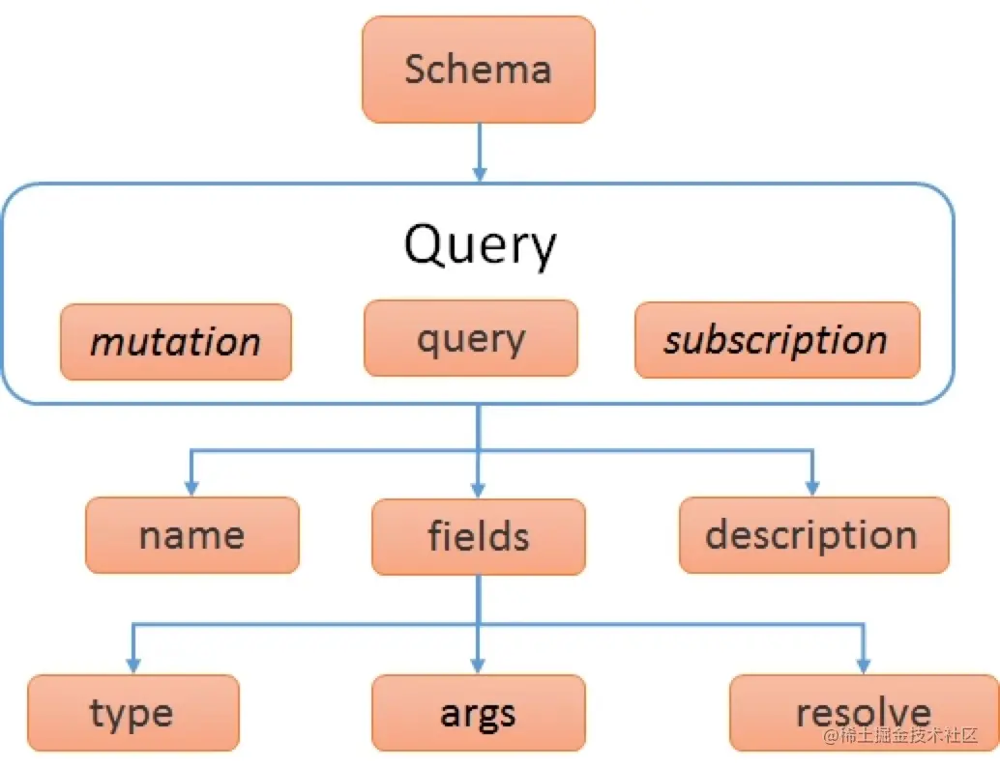

- 操作名称：操作名称是个可选的参数，操作名称对整个请求并不产生影响，只是赋予请求体一个名字，可以作为调试的依据。

- 变量定义：在 GraphQL 中，声明变量使用`$符号开头，冒号后面紧跟着变量的传入类型。如果要使用变量，直接引用即可。

```js
// 支持的标量类型 - 在传递给 buildSchema 的模式中可直接使用这些类型
String-UTF8 字符序列、Int-有符号32位整数、
Float-有符号双精度浮点值、Boolean、
ID-表示一个唯一标识符（常用来重新获取对象或者作为缓存中的键）

String!  // ❕感叹号 表示不能为空  是不可为空的字符串
[Int]  // 表示整数列表- 使用列表类型，请将类型括在方括号中


// 操作类型：指定本请求体要对数据做什么操作，类似与 REST 中的 GET POST
 Query 类型
 mutation 表示对数据进行操作，例如增删改操作，
 subscription 订阅操作
 RandomDie 对象类型

// 使用 buildSchema 示例
 var schema = buildSchema(`
	type RandomDie {
  	roll(numRolls: Int!): [Int]
	}

	type Query {
 	 getDie(numSides: Int): RandomDie
	}

	type User {
    id: String
    name: String
  }
  type Query {
    user(id: String): User
  }
`)

//// This class implements the RandomDie GraphQL type
class RandomDie {
  constructor(numSides) {
    this.numSides = numSides
  }
  rollOnce() { return 1 + Math.floor(Math.random() * this.numSides) }
  roll({ numRolls }) {
    var output = []
    for (var i = 0; i < numRolls; i++) { output.push(this.rollOnce()) }
    return output
  }
}

// 在不使用GraphQL schema语言的情况下实现相同的API
var express = require("express")
var { graphqlHTTP } = require("express-graphql")
var graphql = require("graphql")

var fakeDatabase = {a: {id: "a",name: "alice"}}
// Define the User type
var userType = new graphql.GraphQLObjectType({
  name: "User",
  fields: {
    id: { type: graphql.GraphQLString },
    name: { type: graphql.GraphQLString },
  },
})

// Define the Query type
var queryType = new graphql.GraphQLObjectType({
  name: "Query",
  fields: {
    user: {
      type: userType,
      // `args` describes the arguments that the `user` query accepts
      args: {
        id: { type: graphql.GraphQLString },
      },
      resolve: (_, { id }) => {
        return fakeDatabase[id]
      },
    },
  },
})
var schema = new graphql.GraphQLSchema({ query: queryType })
var app = express()
app.use(
  "/graphql",
  graphqlHTTP({
    schema: schema,
    graphiql: true,
  })
)
app.listen(4000)
console.log("Running a GraphQL API server at localhost:4000/graphql")
```

```js
// 客户端的使用
- 基础的 使用HTTP请求作为底层传输层
- 设置像Relay这样的GraphQL客户端需要多花一点时间

npm install graphql
// 基础操作
fetch("/graphql", {
  method: "POST",
  headers: {
    "Content-Type": "application/json",
    Accept: "application/json",
  },
  body: JSON.stringify({ query: "{ hello }" }),
})
  .then(r => r.json())
  .then(data => console.log("data returned:", data))

// 携带参数
var dice = 3
var sides = 6
var query = `query RollDice($dice: Int!, $sides: Int) {
  rollDice(numDice: $dice, numSides: $sides)
}`

fetch("/graphql", {
  method: "POST",
  headers: {
    "Content-Type": "application/json",
    Accept: "application/json",
  },
  body: JSON.stringify({
    query,
    variables: { dice, sides },
  }),
})
  .then(r => r.json())
  .then(data => console.log("data returned:", data))
```

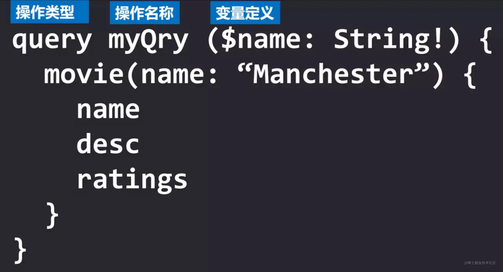

- 文档学习当前点：https://graphql.org/graphql-js/graphql/

### [Apollo 客户端](https://www.apollographql.com/tutorials/lift-off-part1/05-apollo-server)

> Apollo 是基于 GraphQL 的全栈解决方案集合。包括了 apollo-client 和 apollo-server ；从后端到前端提供了对应的 **lib** 使得开发使用 GraphQL 更加的方便。

- `graphql`提供了解析 GraphQL 查询的核心逻辑。
- `@apollo/client`包含了构建客户端所需的几乎所有内容，包括内存缓存、本地状态管理和错误处理。

```jsx
// 安装包
npm install graphql @apollo/client

// 在react中配置客户端
const client = new ApolloClient({
  uri: "http://localhost:4000",  // GraphQL服务器的url
  cache: new InMemoryCache(),    // 使用内存缓存？
});

// 全局包装 <ApolloProvider> 标签 并传入client配置
ReactDOM.render(
  <ApolloProvider client={client}>
    <GlobalStyles />
    <Pages />
  </ApolloProvider>,
  document.getElementById("root")
);

// 导入使用 gql，将所有GraphQL字符串包装在gql模板中
import { useQuery, gql } from "@apollo/client";

// 书写查询语句
const TRACKS = gql`
  query GetTracks {
    tracksForHome {
      id
      title
      length
      author {
        name
        photo
      }
    }
  }
`;

// 调用useQuery，将GraphQL查询字符串传递给它来在React组件中运行查询
// - loading值： true-查询中  false-查询结束
// - error：查询失败时展示失败的值
// - data：查询成功时，结果存放的位置
// 完整的Tracks组件：
const Tracks = () => {
  const { loading, error, data } = useQuery(TRACKS);
  if (loading) return "Loading...";
  if (error) return `Error! ${error.message}`;
  return <Layout grid>{JSON.stringify(data)}</Layout>;
};


// 书写 mutation 语句
mutation {
  createMessage(input: {
    author: "andy",
    content: "hope is a good thing",
  }) {
    id
  }
}

mutation {
  updateMessage(id:"c53c7faaa1c859eda6f0",input: {
    author: "andy",
    content: "hope is a good thing",
  }) {
    id
    author
    content
  }
}

// 通过fetch调用时
var author = "andy"
var content = "hope is a good thing"
var query = `mutation CreateMessage($input: MessageInput) {
  createMessage(input: $input) {
    id
  }
}`

fetch("/graphql", {
  method: "POST",
  headers: {
    "Content-Type": "application/json",
    Accept: "application/json",
  },
  body: JSON.stringify({
    query,
    variables: {
      input: {
        author,
        content,
      },
    },
  }),
})
  .then(r => r.json())
  .then(data => console.log("data returned:", data))

```

### GraphQL 代码生成器

[Guide: React and Vue – GraphQL Code Generator](https://the-guild.dev/graphql/codegen/docs/guides/react-vue)

[documents field – GraphQL Code Generator](https://the-guild.dev/graphql/codegen/docs/config-reference/documents-field)

https://www.apollographql.com/docs/react/development-testing/static-typing/

配置内容

- Typescript 模版使用
  - 在 console 项目根目录，使用软链接根据后端代码的模版获取
    - ln -s ../biz/insight/insight-api/src/main/resources/analytics.graphqls ./
  - 生成 GraphQL 文件夹
    - yarn run compile
  - 开启检测书写的 graphql 语句，自动生成 gql.ts（GraphQL 文件夹下）中对应 documents
    - yarn graphql-codegen --watch

## 同源跨域

- 同源：协议、域名、端口号，必须完全一致，违背同源策略就是跨域。
- ajax 默认遵循同源策略

### JSONP 方案

- 原理：
  - 利用`<script>`标签可以跨域的特性，
  - 在服务器端返回一个函数（包含要返回的数据），因为`<script>`要传 js 代码
  - 在本地定义对应的的函数，将函数中的数据拿出来使用

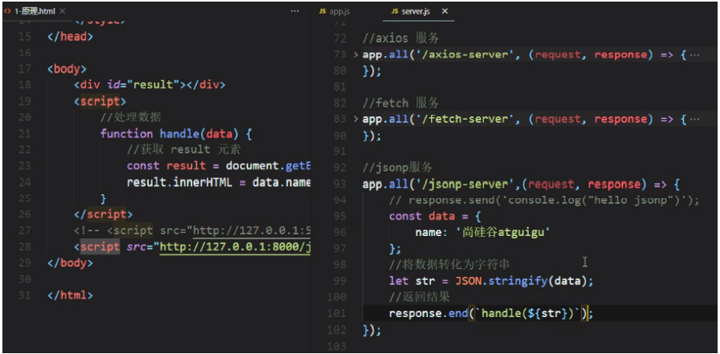

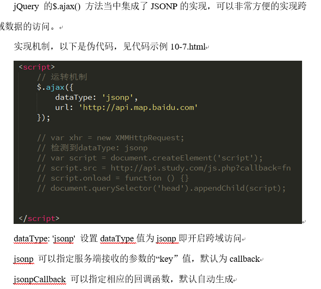

### CORS 方案

- 跨域资源共享 CORS ：官方的跨域解决方案，
- 特点：
  - 完全在服务器端设置，不需要在客户端进行操作
  - 通过设置响应头信息，告诉浏览器允许跨域，浏览器收到信息就会放行
- 更多内容参看相关文档。。。

```js
// 常在 后端 设置的三个信息  * 表示对所有都支持
// 允许请求的url
response.setHeader("Access-Control-Allow-Origin", "*");
response.setHeader("Access-Control-Allow-Origin", "http://wudetian.top:8000");
// 允许携带的请求头信息
response.setHeader("Access-Control-Allow-Headers", "*");
// 允许请求的方法，默认只允许get 和 post
response.setHeader("Access-Control-Allow-Methods", "*");
```

### 代理服务器

## FormData

- a) 提供了一个新的内建对象，可用于管理表单数据

  b) 首先要获取一个表单元素 form

  c) 然后在实例化时 new FormData(form)，将表单元素 form 传进去

  d) 会返回一个对象，此对象可以直接做为 xhr.send(formData)的参数

  e) 此时我们的数据就是以二进制形式传递了

  f) 注意我们这里只能以 post 形式传递，浏览器会自动为我们设置一个合适的请求头

  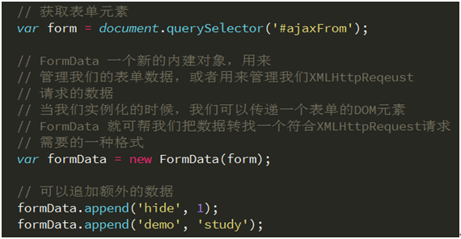

## 二进制

- a) 我们上传文件是以二进制形式传递的

  b) 我们可以通过表单`<input type="file">`获取到一个文件对象

  c) 然后 file.files[0]可以获取文件信息

  d) 然后再利用 var formData = new FormData() 实例化

  e) 然后再利用 formData.append(‘upload’, file.files[0])将文件转成二进制

  f) 最后将 formData 做为 xhr.send(formData)的参数

  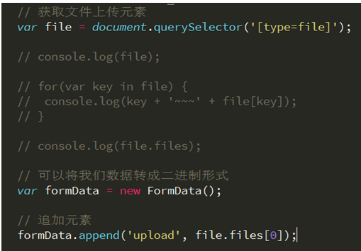

## 上传进度

- a) 利用 XMLHttpRequest 我们可以实现文件的上传

  b) 并且我们可以通过 xhr.upload.onprogress = function (ev) {// code}，监听上传的进度

  c) 这时我们上传的进度信息会保存在事件对象 ev 里

  d) ev.loaded 表示已上传的大小，ev.total 表示文件整体的大小

  e) var percent = ev.loaded / ev.total

  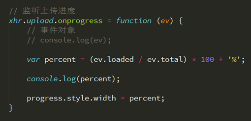

## 常见报错点

1. `url`地址拼接 token 等参数导致的过长，被浏览器直接拦截，导致请求失败

   - 现象：
     - 切换其他请求地址，请求正常发出
     - 后端无法收到任何反应，没有出现跨域问题

2. 浏览器跨域问题，后端有收到处理信息，但前端无法显示

   - CORS 或者 Nginx

3. 使用 promise 处理请求时，如果不写 catch 只有 then 控制台会出现 err 提示

4. 某些特定情况下，可能是由于浏览器缓存导致

   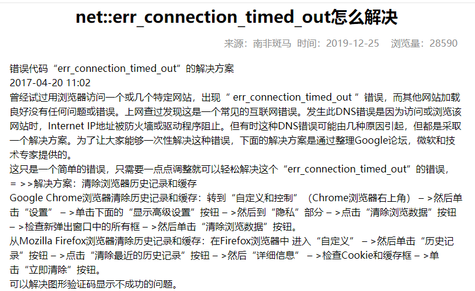

## Mock 数据

- [「前端该如何优雅地 Mock 数据」每个前端都应该学会的技巧*51CTO 博客*前端 mock 数据](https://blog.51cto.com/u_15531311/5236523)
- [前端如何 mock 数据？ - 首席 CTO 笔记 (shouxicto.com)](https://www.shouxicto.com/article/6256.html)
- [(40 条消息) 身为前端，你真的会 mock 数据吗\_郭顺杰的博客-CSDN 博客](https://blog.csdn.net/weixin_44314258/article/details/126508822)
- [前端该如何优雅地 Mock 数据 - 知乎 (zhihu.com)](https://zhuanlan.zhihu.com/p/551535359)
