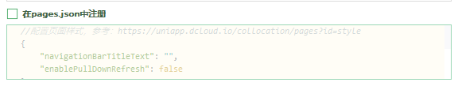
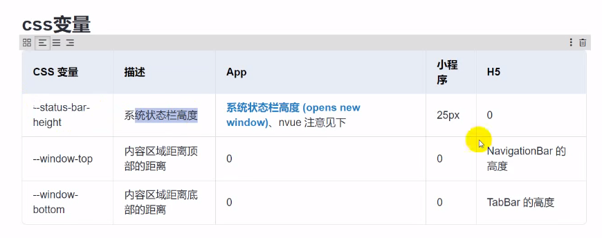
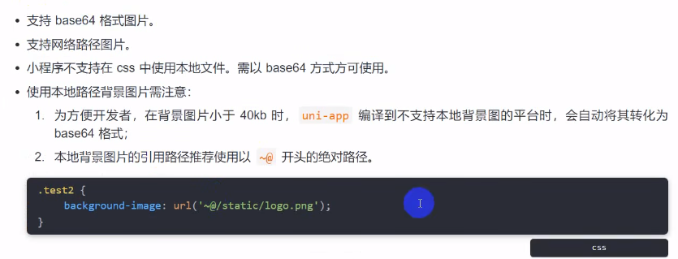
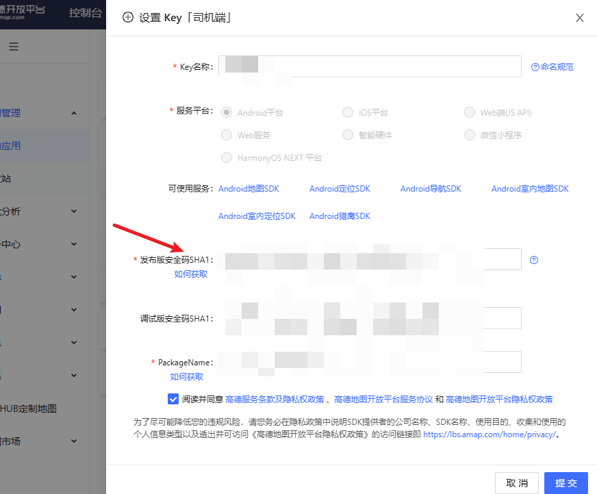
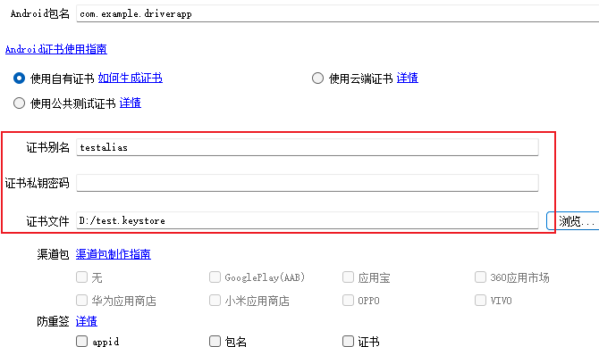

# [uni-app](https://uniapp.dcloud.net.cn/)

> uni id    uni Admin     uniCloud

### 基础学习

#### 初识uniapp

1. 打开 Hbuilder 创建项目

2. 项目结构

   ```js
   ┌─uniCloud              云空间目录，阿里云为uniCloud-aliyun,腾讯云为uniCloud-tcb（详见uniCloud）
   │─components            符合vue组件规范的uni-app组件目录
   │  └─comp-a.vue         可复用的a组件
   ├─utssdk                存放uts文件
   ├─pages                 业务页面文件存放的目录
   │  ├─index
   │  │  └─index.vue       index页面
   │  └─list
   │     └─list.vue        list页面
   ├─static                存放应用引用的本地静态资源（如图片、视频等）的目录，注意：静态资源只能存放于此
   ├─uni_modules           存放[uni_module](/uni_modules)。
   ├─platforms             存放各平台专用页面的目录，详见
   ├─nativeplugins         App原生语言插件 详见
   ├─nativeResources       App端原生资源目录
   │  └─android            Android原生资源目录 详见
   ├─hybrid                App端存放本地html文件的目录，详见
   ├─wxcomponents          存放小程序组件的目录，详见
   ├─unpackage             非工程代码，一般存放运行或发行的编译结果
   ├─AndroidManifest.xml   Android原生应用清单文件 详见
   ├─main.js               Vue初始化入口文件
   ├─App.vue               应用配置，用来配置App全局样式以及监听 应用生命周期
   ├─manifest.json         配置应用名称、appid、logo、版本等打包信息，详见
   ├─pages.json            配置页面路由、导航条、选项卡等页面类信息，详见
   └─uni.scss  		   uni-app内置的常用样式变量
   ```

3. 运行项目：直接点运行....

   > 运行配置：
   >
   > - 运行--运行到web服务器--运行配置--添加对应浏览器/小程序 安装路径
   > - 运行到微信小程序（需提前在微信开发工具、设置、安全设置中打开服务端口）

4. 创建页面

   - 在pages文件夹右键，新建页面，会自动生成对应页面，可勾选直接在pages中注册

     

5. 页面配置  pages.json （类wx）

   - 官网文档 -- 全局文件 -- pages.json中查看
   - 作用域越大，优先级越低

6. 组件使用（类wx）

   - 建议使用官方组件/较好的三方组件库，以避免不同平台的兼容性问题

7. 样式

   - 响应式单位rpx  750rpx == 100vw == 屏幕可视野宽度的100%
   - uniapp样式不需要手动加`scoped`,会自动添加

8. [组件局部注册 easycom](https://uniapp.dcloud.net.cn/collocation/pages.html#easycom)

   > - 传统Vue中需要三步  import引入  components注册  使用
   > - uniapp中可自动引入（HBuilderX 2.5.5起支持easycom组件模式）
   >   - 组件安装在components目录下，并符合 components/组件名称/组件名称.vue 目录结构。就可以不用引用、注册，直接在页面中使用
   >   - <组件名称></组件名称>

   - 优点：
     - easycom打包后会自动剔除没有使用的组件，组件库批量安装，随意使用，自动按需打包。
     - `easycom`是自动开启的，不需要手动开启
     - 引入组件无需`import  components`，即可在任意页面使用
     - 组件名完全一致的情况下，`easycom`引入的优先级低于手动引入（区分连字符形式与驼峰形式）
     - 可以在`pages.json`的`easycom`节点进行个性化设置，如关闭自动扫描，或自定义扫描匹配组件的策略
     - `easycom`只处理vue组件，不处理小程序专用组件（如微信的wxml格式组件）

9. 特殊的修饰符

   - `.natice`   给自定义标签使用原生事件（Vue原生支持）

     ```html
     <!-- 这里的 @click 会被认为是自定义事件 -->
     <myevent @click="onClick"></myevent>
     
     <!-- 使用.natice修饰符 给自定义标签使用原生事件 -->
     <myevent @click="onClick"></myevent>
     ```

   - `.sync`   实现父子组件props传递数据的双向绑定 (uniapp独有)

     ```html
     <!-- 当一个子组件改变了一个 prop 的值时，这个变化也会同步到父组件中所绑定。 .sync 它会被扩展为一个自动更新父组件属性的 v-on 监听器 -->
     <!-- 子组件可修改父组件的props数据 -->
     
     <myevent :state.sync="mystate"></myevent>
     
     // 子组件中修改props数据时，需要使用 this.$emit("updata:state",数据值)
     ```

10. 生命周期

    > 1. 应用生命周期：小程序规范
    > 2. 页面生命周期：小程序规范
    > 3. 组件生命周期：vue规范

   - 支持 Vue的生命周期（推荐)
   - 可能支持部分微信小程序的生命周期 App.vue

11. API

    - 与微信小程序保持高度一致，wx.  改为 uni.  (具体参看官网)

12. 项目打包

    1. 项目目录下的`manifest.json`文件，进行打包前的配置

    2. 点击`发行`选择对应打包即可

    3. 打包后的文件存放在项目根目录，unpackage/dist/build/xxx 文件夹下

       - 微信小程序需要在微信开发者平台项目配置中进行域名安全组配置等

       


#### [条件编译](https://uniapp.dcloud.net.cn/tutorial/platform.html#跨端兼容)

> 用特殊的注释作为标记，在编译时根据这些特殊的注释，将注释里的代码编译到不同平台。

- **写法：**以 #ifdef 或 #ifndef 加 %PLATFORM% 开头，以 #endif 结尾。
  - \#ifdef：if defined 仅在某平台存在
  - \#ifndef：if not defined 除了某平台 均存在
  - **%PLATFORM%**：平台名称(详见官方文档)
- 条件编译是利用注释实现的，在不同语法里注释写法不一样，js使用 `// 注释`、css 使用 `/* 注释 */`、vue/nvue 模板里使用 `<!-- 注释 -->`；

```shell
#ifdef APP-PLUS
仅出现在 App 平台下的代码
#endif

#ifdef H5 || MP-WEIXIN
在 H5 平台或微信小程序平台存在的代码
#endif

#ifndef H5
除了 H5 平台，其它平台均存在的代码
#endif
```


#### 路由传参

- H5开发可以使用 vue中的 $router，也支持 `onLaunch`

- 微信小程序中，不支持 vue中的 $router

  - 需使用`onLaunch`生命周期函数接收

    ```js
    onLaunch(e){
        console.log(e)  // e就是页面参数,兼容H5
    }
    ```

- 获取页面栈 `getCurrentPages()`


#### CSS变量




#### 背景图片




### UI框架

- uview
- 官方组件 uni-ui
- [wot-design-uni](https://wot-design-uni.netlify.app/)


## 新开始

> 鉴于uniapp内容杂乱，只要会Vue，其余对着文档就能冲，本篇仅记录琐碎的关键点！


### 数据通信

```js
/* 上级组件 */
// 在起始页面跳转到test.vue页面，并监听test.vue发送过来的事件数据
uni.navigateTo({
  url: '/pages/test?id=1',
  events: {
    // 为指定事件添加一个监听器，获取被打开页面传送到当前页面的数据
    acceptDataFromOpenedPage: function(data) {
      console.log(data)
    },
    someEvent: function(data) {
      console.log(data)
    }
    ...
  },
  success: function(res) {
    // 通过eventChannel向被打开页面传送数据
    res.eventChannel.emit('acceptDataFromOpenerPage', { data: 'data from starter page' })
  }
})


/* 跳转到的组件 */
// 在test.vue页面，向起始页通过事件传递数据
onLoad: function(option) {
  const eventChannel = this.getOpenerEventChannel();
  eventChannel.emit('acceptDataFromOpenedPage', {data: 'data from test page'});
  eventChannel.emit('someEvent', {data: 'data from test page for someEvent'});
  // 监听acceptDataFromOpenerPage事件，获取上一页面通过eventChannel传送到当前页面的数据
  eventChannel.on('acceptDataFromOpenerPage', function(data) {
    console.log(data)
  })
}
```


### 环境判断

- 支持 .env 自定义环境变量，与vue用法一致

##### 运行/生产

```js
// 点击“运行”-编译开发环境  点击“发行”-编译生产环境
if (process.env.NODE_ENV === 'development') {
	console.log('开发环境');// 发布到生产环境时，此处代码会被摇树移除掉。
} else {
	console.log('生产环境');
}

// 针对更多平台配置，自定义更多环境，可在 vue-config.js中配置
```


#### 判断平台

- 使用 ` // #ifdef xxx`  注释；打包时TreeShaking
- 使用 `uni.getSystemInfoSync().platform` 判断；运行时动态判断

```js
// #ifdef H5
alert('只有h5平台才有alert方法');
// #endif

switch (uni.getSystemInfoSync().platform) {
	case 'android':
		console.log('运行Android上');
		break;
	case 'ios':
		console.log('运行iOS上');
		break;
	default:
		console.log('运行在开发者工具上');
		break;
}
```


### app证书配置


- 基础步骤
  1. 下载jre安装包：https://www.oracle.com/java/technologies/downloads/#java8
  2. 将JRE安装路径添加到系统环境变量 cmd执行：`set PATH=%PATH%;"JDK的安装路径"`  `C:\Program Files\Java\jdk-23\bin` 
  3. `keytool -genkey -alias testalias -keyalg RSA -keysize 2048 -validity 36500 -keystore test.keystore`
     - testalias是证书别名，可修改为自己想设置的字符，建议使用英文字母和数字
     - test.keystore是证书文件名称，可修改为自己想设置的文件名称，也可以指定完整文件路径
     - 36500是证书的有效期，表示100年有效期，单位天，建议时间设置长一点，避免证书过期
     - 过程
       - 需要设置密码，默认为 android，随便设置
  4. 查看证书信息`keytool -list -v -keystore test.keystore  `
     - 输入步骤3中的密码
     - 将SHA1设置到高德地图应用中
  5. HbuilderX 中进行打包，选择自定义证书
     - 证书别名，步骤三中的 testalias
     - 证书私钥密码，步骤三种设置的密码
     - 证书文件，步骤三结束后在文件夹下生成的文件  test.keystore






### 高德地图

