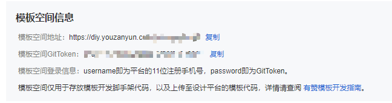

<WaterMark />
# 小程序组件开发

## 有赞云开发

> - 必看文档
>   - [文档中心 - 有赞云 (youzanyun.com)](https://doc.youzanyun.com/resource/doc/3194)
>   
> - 其它文档
>   - 组件库： https://youzan.github.io/zent/zh/component/tabs
>   
> - 网站
>   
>   > 账密在浏览器中有存储记录
>   
>   - 有赞店铺：https://www.youzan.com/v4/deco/decorate-list
>   
>   - 代码后台：https://diy.youzanyun.com/design-terrace
>   
>     


## 提示：

- showcase-component     对应H5端界面
- showcase-components-mp   对应微信小程序
- showcase-editor   对应编辑器界面
- 下面的内容来源于官方文档的个人总结，仅供参考！
  - 在组件开发中涉及到的代码内容，了解即可
  - 开发中可能有些小封装，`模仿cv`现有代码，效率更高！
  - [文档中心 - 有赞云 (youzanyun.com)](https://doc.youzanyun.com/resource/doc/3194)

- 开发中不涉及后端，整体思路是：先 设计编写编辑器界面为用户界面提供数据、再编写用户界面。部分数据使用平台提供接口方法获取。
- 调用商品信息、图片数据（参照现有代码即可）


## 编辑器开发

1. 拉取线上代码 https://diy.youzanyun.com/design-terrace
2. 使用`有赞开发者工具`导入项目代码
3. `自定义组件管理` 中 `创建自定义组件` - 会自动在项目代码中生成对应组件初始化文件（看git记录）
4. 本地模板中创建模板（个人开发测试使用）
5. 组件开发、编写代码....
6. 选择`本地模板`的`预览配置界面`选择开发的组件进行调试（需将本地项目代码跑起！）


- 注意：
  - name 字段的值，统一使用 下划线 命名，不能使用驼峰，不能使用大写字母
  - type的值在创建组件时已生成，请勿改动，与文件名保持一致
  - 编辑器中刷新按钮，点击前必须进行保存，否则无法有效刷新


## H5开发

> 代码位置：showcase-components（vue2 + VantUI）
>
> 有赞开发者工具中创建自定义模板时，会自动生成对应命名的文件夹，其中默认包含一个App.vue文件


### 默认props

```vue
componentIndex: 组件下标
componentData: b 端配置数据（编辑器代码中value绑定的数据？）

```


### 页面跳转（参考已有代码）

> - 微页面：使用a标签进行（h5/微信小程序）（通过 location 对象进行页面跳转）
> - 定制组件内部：使用`youzanyunRouter` 对象进行相关操作进行相关操作（不能通过 location 对象进行页面跳转）
> - 在开发者工具环境中，不能使用 `youzanyunRouter`，需要使用 `window.location.href=url` 跳转
> - 在正式环境中，可以使用 `youzanyunRouter` 进行跳转

```js
 // 等价于 location.href
 window.youzanyunRouter.push(url: string);

// 等价于 location.go
 window.youzanyunRouter.go(delta: number);

// 等价于 location.replace
 window.youzanyunRouter.replace(url: string);

// 等价于 location.reload
 window.youzanyunRouter.reload(url: string);
```


### Storage存储

> - 在定制组件内部，无法访问 `localStorage` 和 `sessionStorage` ，故提供 `youzanyunStorage` 对象进行相关操作

```js
const {localStorage} = window.youzanyunStorage

// 设置一项数据
localStorage.setItem("myCat", "Tom")

// 读取一项数据
localStorage.getItem("myCat").then((cat) => {
  console.log(cat) // Tom
})

// 移除一项数据
localStorage.removeItem("myCat")

// 移除所有数据
localStorage.clear()

// sessionStorage 使用方式同上
```


### 细节

- 全屏组件
  - 在编辑器及非正式环境下，需要通过判端当前是否为手机模式，限制固定高度 / 100vh。避免编辑器下的样式异常
  - 开发中参考现有代码，需要减去实际使用中可能存在的`顶部或底部样式高度`、
    - 需要额外减去底部的固定导航栏高度 50px
    - 小程序顶部导航高度参考现有方法获取
- 图片使用
  - 图片使用遍历标签方式，而不是修改src完成，能够避免重复请求，展示效果更好
  - 需要使用 getImg内置函数进行图片压缩处理


## [小程序组件开发 - mp](https://developers.weixin.qq.com/miniprogram/dev/framework/custom-component/)

- 细节
  - `WXML`标签名只能是小写字母、中划线和下划线的组合
  - 自定义组件和页面所在项目根目录名不能以` wx-`为前缀，否则会报错。

```
1.本地mp目录下	npm run dev
2.微信中打开 -mp 下的dist目录进行查看运行效果
3.编辑器数据同步 - 到 src/pages/home/feature/index.js		{}
4.打开 /feature/custom-components/  下自动生成的小程序目录进行组件下程序端开发


```


### 组件文件

- js文件

  ```js
  // 自定义组件使用 Component() 注册组件，并提供组件的属性定义、内部数据和自定义方法
  Component({
    behaviors: [],
    // properties 外部传入数据（定义时驼峰命名法，使用时用 - ）
    properties: {
      componentData: Object
    },
  
    data: {},		  // data 组件内部数据
    lifetimes: {
      attached: function attached() {},
      moved: function moved() {},
      detached: function detached() {}
    },
    attached: function attached() {},
    ready: function ready() {},
    pageLifetimes: {
      show: function show() {}
    },
    methods: { },		// 自定义方法
  });
  ```

  

- json 配置文件

  > - 已注册的自定义组件前 需要在json文件中引入

  ```json
  // 页面的配置信息-一般不需要改动
  
  {
    "component": true,	// 声明该组件为自定义组件
    "usingComponents": {
      "van-count-down": "@vant/weapp/count-down/index",	// 引入第三方组件
       "component-tag-name": "path/to/the/custom/component" // 引入已注册的自定义组件
    }
  }
  
  ```

- wxss 样式文件

  ```
  正常css样式书写
  ```


### 组件生命周期

```js
// 推荐：优先级更高
// 自小程序基础库版本 2.2.3 起，组件的的生命周期也可以在 lifetimes 字段内进行声明

Component({
  lifetimes: {
    attached: function() {},	 // 在组件实例进入页面节点树时执行
    detached: function() {},	 // 在组件实例被从页面节点树移除时执行
  },

  // 以下是旧式的定义方式，可以保持对 <2.2.3 版本基础库的兼容
  attached: function() {},		// 在组件实例进入页面节点树时执行
  detached: function() {},		// 在组件实例被从页面节点树移除时执行
  // ...
})
```


### 细节

- 真实视频url获取 - 为异步操作，video视频标签首次渲染时可能并未有src值
  - 解决：在url异步获取之后，使用setData方法，重置对应的值，能够出发界面的重新渲染
- 图片压缩
  - 图片遍历，避免每次请求
  - 使用xxxx，内置函数，对图片进行压缩处理


## 组件文档

### 编辑器

> `+`：表示自定义封装组件
>
> `-`：表示`editor-common`内部组件

#### + my-good-selector

> 涉及到的组件，页面无图片时，空白状态调整
>
> - 商品跑马灯
> - 商品列表
> - 商品T台轮播
> - 商品轮播B
> - CompositionSelector 公共组件涉及的所有组件配置

```js
// 位置 ...editor/src/common/my-good-selector

/*
1.点击界面添加商品 - 执行 addGoodImage
	- onSelectorChange 调用内部接口，修改goods数据
2.删除某个商品选项 - 执行 onhandleChange
	- onSelectorChange 调用内部接口，修改goods数据
3.页面渲染 - 执行 getItemDom
	- 
4.更换图片 - 执行 handleItemChange
*/

/*
最大商品数量限制 - 使用 handleMaxNumGoods
组件外部使用 max 传递 Number类型数量值
*/

/*
添加商品后，再次执行render时，得到添加后的新数据
当没有传递index值时：list = arr = [value.customName]
*/


```


#### - EditorCard

```js
/*
<EditorCard
	addText="添加商品"
     onChange={this.handleChange}
     list={list}
     isInline
     canDelete={list.length > minNum}
     canAdd={list.length < max}
     onAdd={this.addGoodImage}
>
	{list.map(this.getItemDom)}
</EditorCard>
*/


/**
  * EditorCardv
  * @param onChange - 自定义函数，展示商品列表发生变化时调用，一般用在某个商品被删除时,函数第一个参数为变化后的list数据
  * @param list - 绑定并传入默认数据
  * @param {boolean} canDelete/canAdd - 布尔值，用来判断是否可以继续删除或添加模块
  * @param onAdd - 自定义函数，绑定默认按钮点击后的操作
  * @param addText - 默认按钮文字，一般用来添加商品模块
  * @param 组件childern - 展示在模块内部的填充内容
*/

```


#### - SubEntryItem

> 子组件 SubEntryItem

```js
<SubEntryItem
  showImage={showImage}
  showTitle={showTitle}
  showDesc={showDesc}
  showLink={false}
  imageLabel={imageLabel}
  titleLabel={titleLabel}
  descLabel={descLabel}
  titleMaxLength={maxTitle}
  descMaxLength={maxDesc}
  titlePlaceholder={titlePlaceholder}
  descPlaceholder={descPlaceholder}
  linkMenuItems={linkMenuItems}
  uploadConfig={uploadConfig}
  settings={settings}
  globalConfig={globalConfig}
  key={subIndex}
  index={subIndex}
  data={aItem}
  onChange={this.handleItemChange}
  showError={showError}
  error={isArray(validation[customName]) ? validation[customName][subIndex] : undefined}
  helpText={'该图片在小程序不显示'}
  showHandler={showHandler}
  showHeader={showHeader}
  header={showHeader ? header : ''}
  extra={extras ? extras : ''}
/>
      
      
      
/**
  * SubEntryItem
  * @param onChange - 自定义函数，对数组指定一项进行更改，例更换图片时触发进行数据修改,函数第一个参数为变化后的item数据，第二个参数为索引值，代表当前操作item数据在原数据中的索引位置
  * @param extra - 相当于组件childern，展示在模块内部的填充内容
*/

```


## 经验

1. 先开发编辑器侧   -  确定好要显示/控制的内容
2. 再开发H5侧 - 展示界面效果
3. 编辑器侧开发中   -  建立合适的参数文档（便于H5侧使用）


## 问题

- 如何本地运行调试？

  - 在有赞云开发者工具中进行，加载可能较慢（可使用简洁版项目运行进行开发）

- 代码中引入的依赖，版本及来源？

  - 目前没有文档？根据先前使用方式模仿使用

  - ```js
    import { ControlGroup, RadioButton } from 'editor-common';
    ```


## 需求

- goods右上角x，用于删除图片
  
  > 1. 现状：按钮隐藏，，对于涉及的模板中需在无图时，使用默认图片替换展示
  >    - 'https://img01.yzcdn.cn/upload_files/2023/05/11/FmvUljzqZl8Vm4QXq2kdbmcS-wSg.png'
  > 2. 目前在单图+描述模块情况下可用，对于多图无描述情况，已存在x按钮，多图+描述情况可能较多未进行处理
  
- 产业会客厅 （有赞模板合并+改动）

  - 房型促销`H1`开发成选择常规商品 -> 限时促销`A2` - `extension-cnzoom-promotion-01`(其他模块)
  - 房型列表`H3`开发成自定义 -> 图文卡片3 - `extension-cnzoom-pictext-card03` (其他商品)
  
- H5端分类页 (全屏) 原生 + H5 -  `extension-gouban-mp-category-b` 仿店铺分类页A - > 店铺分类页B

  - 下划线相关 - 切换分类/修改下划线颜色后预览:      ？？？
  
  


## 淘宝开发

- 目录：E:\jin\xsgit\LiveCard
- 大卡、中卡、小卡：分别对应不同高度的屏幕尺寸
- widget - 模板  类似微信小程序语法 - 淘宝开发者工具（小程序项目 - 小部件模板）
- new_form - 编辑器 react  17.2  - 淘宝开发者工具（配置项目 - 配置应用）


### 注意事项

> 真机预览效果与IDE中模拟器预览效果存在差异，真实效果请以真机扫码预览为准

- 小部件跳转小程序：

  > 1. 在小部件创建的过程中已经确定了与其绑定的小程序（或模板），因此在小部件内仅可跳转至绑定的小程序（或模板实例化小程序），不可跳转至其他小程序
  >
  >    即：不支持my.navigateToMiniProgram ，仅支持[my.navigateToRelationMiniProgram](https://open.taobao.com/v2/doc#/abilityToOpen?treeId=776&docType=20&docId=1858)
  >
  > 2. 由于各个小部件接入场景可能在框架层面具备拉起关联的小程序入口，为了保障这些框架入口拉起小程序时携带了正确的参数，请在合适的时机调用 [my.updateNavigateParams](https://open.taobao.com/v2/doc#/abilityToOpen?treeId=776&docType=20&docId=1904) 来更新相关小程序唤起时的参数

- 小部件运行时后端数据查询：

  > 小部件与模板小程序绑定，在实际运行阶段，小部件需根据关联的实例化小程序来展示不同的数据与内容。可通过[my.getRelationAppInfo](https://open.taobao.com/v2/doc#/abilityToOpen?treeId=776&docType=20&docId=1905) 接口获取运行时实际关联的小程序appId，传给云服务来获取相对应的数据。

- 小部件降级

  > 当小部件运行时发生了一些错误时，服务商需要通过[ my.widgetDowngrade](https://open.taobao.com/v2/doc?spm=a219a.15212435.0.0.5419669aNiGpdG#/abilityToOpen?treeId=776&docType=20&docId=1871) 接口来告知平台。平台可在透出场景中做实时屏蔽


