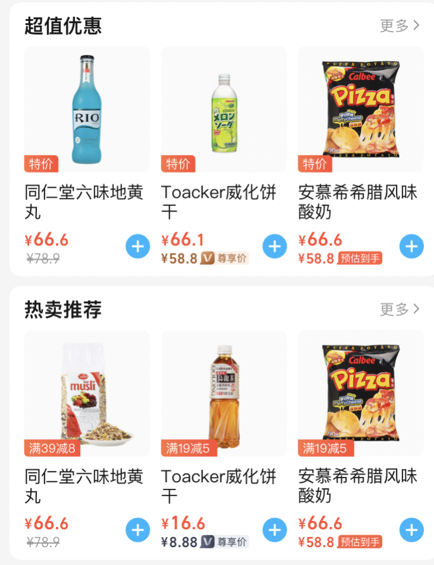

# 饿了么

> - 仓库：https://e.gitee.com/cn_zoom/repos/cn_zoom/elm/sources
>
> - 饿了么开放平台  https://open.shop.ele.me/openapi
>
>   基础组件研发：https://rax.js.org/docs/components/about 
>   本地模块开发手册：https://alidocs.dingtalk.com/i/p/wY7kmboewDWGLq2N7kmb7Ln78Nk74GLq 
>   表单组件配置说明文档：https://alidocs.dingtalk.com/i/p/wY7kmboewDWGLq2N7kmb79L8VjNy4GLq
>   
> - 账号：15355003615


## 组件开发


### 开发步骤

> 开发流程：
>
> 1. 根据需求 - 设计大致需要使用的配置数据
> 2. 配置数据完成mock的初步填充
> 3. 依据mock数据 -> 转化为 schema数据
> 4. 进行用户页面编写

1. 复制脚手架文件，

2. 修改包名...

   ```js
   // package.json、abc.json  中修改包名,不一致会导致报错。
   // @ali/estore- 为固定开头 ${username}为自身账号名称 xxx为ISV自定义模块名，保证唯一性
   
   package.json中的name字段格式应该为: @ali/estore-{userName}-[a-zA-Z0-9]
   "name": "@ali/estore-${username}-[a-zA-Z0-9]", 
   ```

3. 本地代理配置

   ```js
   将 dev.g.alicdn.com 代理到 g.alicdn.com。
   // 官方建议：借助`Xswitch 插件`使用浏览器代理,而不是项目中的代理配置
   ```

4. 开发

   ```js
   // schema.json 中配置 编辑器可控制的数据类型 - 编辑器面板数据 - 组件配置？
   // mock.json 文件 配置本地开发时，可获取到的模拟数据 - 本地的编辑数据 - 组件数据？
   props.data.$data  获取 mock.json 数据
   // 组件编写
   // schema特定组件-参看文档1、文档2： 商品组件、
   // 界面显示组件使用-参看文档3（rax - 一套代码同时支持多端 ）
   
   demo目录 // 购物车依赖本地缓存 （当模块需要使用购物车组件时，将本文件夹下文件复制到 node_module 中）
   
   
   // 理解:schema.json给用户编辑、mock.json本地自己模拟用户编辑的数据
   
   
   
   // 本地预览，需要在手机模拟环境下 pnpm run start
   // 打包 pnpm run build
   // 上传需要将build文件下所有文件打包成 tar.gz 格式压缩包 （不需要打包build文件夹本身，而是下面的文件）
   tar zcvf build.tar.gz -C build .
   
   
   // 在build文件夹下：
   tar -czvf output.tar.gz *
   ```

5. 饿了么后台-上传-真实环境模拟预览

   - 管理中心、我的应用：饿了么切换为新零售、选择应用、去开发、
   - 应用管理详情页面右上角、开发者后台、
   - 应用中心、应用详情
     - 模块管理、新增模块、模块制作、修改数据
   - 注意点：
     - 编辑器编辑数据后需要保存才能在预览生效。


### 注意事项：

- 项目名称必须保持一致，否则报错
- node版本 16+
- 包名规范- 参考文档 ①
- 关于数据

  - ```json
    // schema.json
    "key"值与对象key保存一致、与mock中的key保持一致
    "$elName": "BaseInput", // 使用到的组件名，参看文档2
    "name": "$theme", // 表单对象的属性名？，同key
    
    ...更多参数配置，参看antd同类表单组件
    ```


#### 细节

- 使用 Image图片组件时，必须设置图片宽高，否则在ele平台显示大小异常，可设置为100%


#### 商品价格规则

> - 价格透出，现在价格有4个字段：当前价，到手价、划线价和会员价（黄色为免费会员，黑色为付费会员），最多透出2个价格：
> - 透出优先级：商品现价、预估到手价、会员价、原价/划线价




#### 商品组件规则

- 需要将demo中的内容复制一份到node_modules中
- src/mobile/cartBtn 的 index.tsx 中 需要注释掉`  !!item && !!shopInfo &&`，否则本地无效果

```js
// schema中定义商品列表信息 必须使用 itemIds
// 外层数组名 必须使用 itemIdsList
// 例：mock数据
 "itemIdsList": [
      {
        "title": "绿色蔬菜热卖榜",
        "desc": "有机蔬菜 健康又美味",
        "itemIds": [
            {
                "name":"xxx"
                ...
            },
            {
                "name":"xxxs"
                ...
            },
        ]
      }
]
```


### 官方文档

1. [店铺装修本地模块开发手册 (dingtalk.com)](https://alidocs.dingtalk.com/i/p/wY7kmboewDWGLq2N7kmb7Ln78Nk74GLq)
2. [表单组件配置说明文档 (dingtalk.com)](https://alidocs.dingtalk.com/i/p/wY7kmboewDWGLq2N7kmb79L8VjNy4GLq)
3. [Rax - 快速构建多端应用](https://rax.js.org/docs/components/about)


### 设计思路

- 脚手架文件目前需要重复复制，可否借助pnpm管理，放在根目录，其中在设置多个项目，依赖同一份共同依赖，更便捷
- 或者一份脚手架中写过个模块（涉及打包...）？
- 代理配置是否可以考虑使用项目中的配置？


### 开发技术使用

- 支持 TypeScript、Less/Sass 等基础工程能力
- rpx单位：等同于vw   750rpx==100vw
- css module 支持且推荐


