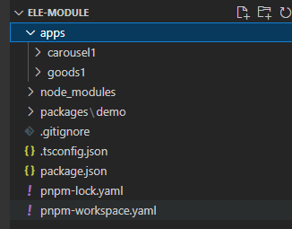

# 构建工具

## [Vite](https://cn.vitejs.dev/)

> - 与 vue-cli同类型，都属于项目初始化构建工具，相当于第二代vue项目构建工具
> - `vite`生产环境下打包需要借助`Rollup`完成       node.js >= 12.0.0
>

支持创建项目类型

-  [vanilla](https://links.jianshu.com/go?to=https%3A%2F%2Fvite.new%2Fvanilla) [vanilla-ts](https://links.jianshu.com/go?to=https%3A%2F%2Fvite.new%2Fvanilla-ts) 
-  [vue](https://links.jianshu.com/go?to=https%3A%2F%2Fvite.new%2Fvue) [vue-ts](https://links.jianshu.com/go?to=https%3A%2F%2Fvite.new%2Fvue-ts) 
-  [react](https://links.jianshu.com/go?to=https%3A%2F%2Fvite.new%2Freact) [react-ts](https://links.jianshu.com/go?to=https%3A%2F%2Fvite.new%2Freact-ts) 
-  [preact](https://links.jianshu.com/go?to=https%3A%2F%2Fvite.new%2Fpreact) [preact-ts](https://links.jianshu.com/go?to=https%3A%2F%2Fvite.new%2Fpreact-ts)  
- [lit](https://links.jianshu.com/go?to=https%3A%2F%2Fvite.new%2Flit) [lit-ts](https://links.jianshu.com/go?to=https%3A%2F%2Fvite.new%2Flit-ts)  
- [svelte](https://links.jianshu.com/go?to=https%3A%2F%2Fvite.new%2Fsvelte) [svelte-ts](https://links.jianshu.com/go?to=https%3A%2F%2Fvite.new%2Fsvelte-ts)

```shell
npm create vite@latest   # 使用npm创建项目（vue、react、）
yarn create vite  # 使用yarn创建项目
pnpm create vite  # 使用pnpm创建项目

# 创建react项目
yarn create vite react-router --template react


npm install #安装依赖！
npm run dev #运行项目 
```

特性：

- Vite冷启动服务，在开发预览时不进行打包，使用`ES6 import`
  - 项目过大时，webpack需要处理的时间就会更长
- 实时热更新，开发时代码更新保存时页面自动更新
- 按需进行编译，不会刷新全部DOM
- Vite的模块化规范基于 es6 module 不支持 commonjs模块化
  - webpack中，可以混用 es6和commonjs模块化，侧重于兼容性（必须一次性解析所有依赖）
  - vite侧重于浏览器开发的体验（按需解析依赖）

趋势：

- Vite是Vue团队的官方出品，vue-cli将把vite作为预设构架工具
- vite目前只基于浏览器项目
- vite也支持react项目，也支持angular项目，svelte项目


### 基础知识

#### 构建工具

> 可以让开发者不用关心代码是如何在浏览器运行的，只需要一份配置文件，他就能进行一系列的处理

- 企业可能需要的功能

  > 稍微修改一点代码，就需要执行一系列麻烦的操作

  - 如果遇到TS文件,需要使用tsc将ts文件转换为js
  - React/Vue代码，需要安装react-compiler / vue-compiler 将jsx文件或vue文件 转换为js文件
  - less/sass代码，需要安装 less-loader，sass-loader等一系列编译工具
  - 语法降级 bable，将es新语法转化为低版本浏览器支持的语法
  - 体积优化 uglifyjs：将代码进行压缩变成体积更小性能更高的代码

- 构建工具的功能

  1. 将大量模块集成在一起，我们只需要关注自己写的代码，会自动进行构建流程
  2. 模块化开发支持：支持直接从node_modules中引入代码 + 模块化支持
  3. 提高项目性能：打包过程进行 文件压缩、代码分割
  4. 优化开发体验：
     - 热更新：构建工具自动监听文件的变化，自动进行重新打包，再浏览器重新运行
     - 开发服务器：解决跨域问题，用vue-cli react-cli creat-react-app

- 市面常见的构建工具

  - webpack （国内主流）
  - vite
  - esbuild
  - parcel（国外）          rollup      grunt


##### vite脚手架和vite

- `yarn create vite` 命令都做了什么？
  1. 帮我们全局安装一个东西：create-vite（vite脚手架）
  2. 直接运行 creat-vite bi目录下的一个执行配置
- 关系：creat-vite内置vite  例如 vue-cli内置webpack


##### 依赖预构建

> 首先vite会到对应的依赖，然后调用esbuild（对js语法进行处理），将其他规范的代码转成esmodule规范，然后放到当前目录下的node_modules/.vite/deps，同时对esmodule规范的各个模块进行统一集成

- 安装vite，开发环境，生产环境不需要vite    `yarn add vite -D`
  - 开箱即用 out of box  安装后不需要做任何工作即可生效
  - 处理过程中如果有非绝对路径或非相对路径的引用，会自动尝试开启路径补全
- yarn dev --->  开发（每次依赖预构建 所重新构建的相对路径都是正确的）
  - vite会全权交给一个叫做 `rollup`的库去完成生产环境的打包
- 解决的问题
  1. 不同的第三方包会有不同的导出格式，vite本身无法约束，借助预构建解决
  2. 对路径的处理上可直接用 .vite/deps  方便路径重写
  3. 网络多包传输的性能问题（也是原生esmodule不敢支持node_modules的原因之一）；有了依赖预构建之后，vite最后会将他们集成为一个或多个js

#### 语法补全

- 使用webstorm，与生俱来的能力

- vscode或其他编译器，需要做配置

  - ```js
    // 方法1：引入对应内容
    import {defineConfig} from 'vite';
    export default defineConfig({
        xxx  //可以得到语法提示
    })
    
    //方法2：使用语法标注
    /**  @type import('vite').UserConfig  */
    const viteConfig = {
        //可以得到语法提示 
    }
    export default viteConfig
    ```


#### vite配置


##### 默认环境变量配置

```js
/**
- 项目更目录创建 
	.env   .env.development    .env.production   ....
- 修改package.json中的scripts配置
	"dev":"vite --mode==development",				- 当使用npm run dev时，使用development和env的变量
	"build":"vite --mode==production",				- 当使用npm run build时，使用production和env的变量
*/

注意：.env中的变量只有以VITE_开头的才会被暴露
```


##### 根据执行命令配置环境

```js
// vite.config.js 文件
export default {
    optimizeDeps:{
    	exclude:['lodash-es'],  //当遇到lodash-es这个依赖时不进行 依赖预构建
	}
}

//分类
// vite.config.js 文件
import {defineConfig} from 'vite'
import viteBaseConfig from './vite.base.config';
// 导入两种环境下的配置文件 dev开发环境的配置，prod生产环境的配置
import vitedevConfig from './vite.dev.config';
import viteProdConfig from './vite.prod.config';

// 策略模式
const evnResolver = {
    // 使用函数便于后期内容的扩展;  es6展开运算符
    "build":()=>Object.assign(viteBaseConfig,viteProdConfig),
    'serve':()=>({...viteBaseConfig,...viteProdConfig})
}
export default defineConfig( config:({command:'build'|'serve'})=>{
    // 具体使用那个配置，取决于命令行执行的命令
    return evnResolver[command]();
})
```


##### [环境变量和模式](https://cn.vitejs.dev/guide/env-and-mode.html#env-files)

> 根据当前的代码环境产生值的变化的变量 == 环境变量，在不同情况下使用不同的配置

代码环境

- 开发环境
- 测试环境
- 预发布环境
- 灰度环境
- 生产环境


###### 在vite中的环境变量处理

> vite借助内置的第三方库 dotenv，
>
> - 当在控制台执行命令时， dotenv就会去读取对应的 .env文件 并解析对应的环境变量，并将其注入到process对象（node环境下的进程对象？）
> - 但vite考虑到和其他配置的冲突问题，不会直接注入到process对象下
>   - root
>   - envDir：用来配置当前环境变量的文件地址


#### vite.config.ts

```ts
export default defineConfig({
  server:{
    hmr: true,	// 开启热更新，默认未开启
    https: false, // 是否启动http2
    cors:true, 	// 为开发服务器配置CORS，默认启用允许任何源
    open: true, // 服务启动时自动在浏览器打开
    port:"9000",// 指定启动的端口

  },
  plugins: [vue()],
  resolve:{
      alias:{
          '@':'/src'		// 配置别名，@表示src/ 目录
      }
  }
})


// 打包后，放置的路径配置
module.exports = {
    publicPath: '/html/front',
}
```


<hr/>


## [webpack](https://www.webpackjs.com/)

- 现代JavaScript应用 的静态模块打包器，在项目上线前打包

- 文件压缩合并：html css js 图片 表格....

- 语法转化

  - ```shell
    less/sass/stylus  ===>   css
    ES6+  ===>  ES5
    typescript  ===>  js
    ```

- 为开发提供服务器环境：代码热更新

- 其他特点：

  - 兼容所有模块化规范，借助webpack都可以直接在代码中使用
  - 


### 使用

```shell
# 初始化项目
yarn init -y
# 安装webpack 和 webpack-cli(使用webpack4+时)
yarn add --save-dev webpack webpack-cli

# 在项目的package.json文件中配置命令
"scripts": {
    "start": "webpack --config webpack.config.js",
    "build": "webpack 要打包的文件路径 -o 输出到的文件路径"
}
# 运行package.json文件中配置的命令
npm run 命令      #例：npm run build
```


### 环境变量

>  process.env.NODE_ENV


## 


## [monorepo管理](https://juejin.cn/post/7184392660939964474)

> - [基于pnpm的Monorepo实践 - 掘金 (juejin.cn)](https://juejin.cn/post/7211537759849037882)
>
> - 优势：
>   - **安装速度最快**：非扁平的包结构、
>   - **节省磁盘空间**：统一安装包到磁盘的某个位置，通过软链接使用
>   - monorepo可以让我们在跨团队的多个项目中 标准化一套pretty、eslint、以及git hook等配置...
> - 特点：
>   - 一个monorepo项目通常包含多个app和多个packages包
>   - app可以依赖pkg，pkg也可以依赖pkg，但app之间通常不建议相互依赖
>   - 在apps包中可以直接安装当前monorepo/packages下的包，并使用，（用于公共代码抽离）


### 初始化仓库



```js
// 初始化仓库 - 生成package.json
pnpm init

{
    "workspaces": {		// 启用 workspaces 功能
    	"packages": ["packages/*"]
  	},
    "engines": {		// 约束node、pnpm版本 - 在package.json中追加（根据需要添加）
        "node": ">=16",
        "pnpm": ">=7"
    },
    "private": true		// 避免根目录被当做包发布
}

// pnpm本身支持monorepo，不用额外安装包, 但每个monorepo的根目录下必须包含pnpm-workspace.yaml文件
// pnpm 会自动在更目录生成 公共的 node_modules（事先有多个项目文件）

// 安装全局项目依赖包（当前仓库的根目录）
// -w	表示在workspace的根目录下安装而不是当前的目录
// -D 表示安装为开发依赖
pnpm add -D -w xxxx
// 安装子包的依赖 - 直接进入子项目目录中安装(每个项目也都有自己的package.json)

```


### 公共配置

> - Eslint： 统一代码质量和格式检查
> - Prettier： 自动格式代码，统一代码风格
> - git 的 hook功能： 提交代码时自动执行Eslint代码检查
> - Husky：为git创建、管理代码仓库中的所有git hooks
> - lint-staged工具：提交代码时，只对当前变更的代码执行prettier 和 eslint命令，同时略过忽略文件
> - commitlint工具：对commit message进行格式检查，确保符合基本Augular规范
> - commitizen工具：辅助生成commit信息（可选）
> - vscode配置文件：extension.json  settings.json

```js
Eslint：
// 在项目更目录创建 .eslintrc 和 .eslintignore 文件夹


Prettier：
// vscode中安装插件prettier
pnpm add -w -D prettier		// 在项目根目录安装prettier
// 在根目录中创建 .prettierrc 和 .prettierignore 文件

Prettier与Eslint的冲突解决
// eslint-config-prettier 关闭所有可能干扰Prettier规则的Eslint规则,确保将其放在最后生效
// eslint-plugin-prettier 将Prettier规则转化为Eslint规则，使Eslint提供错误提示信息
pnpm add -w -D eslint-config-prettier eslint-plugin-prettier

```


## 代码规范

> 使用 [ESLint](https://eslint.org/) 配合vscode插件，实现项目代码统一规范
>
> - [ESLint配合VSCode 统一团队前端代码规范 - 掘金 (juejin.cn)](https://juejin.cn/post/7202463555176759353)

- Vscode插件：ESLint

- .eslintignore - 配置.eslintignore文件

  ```.eslintignore
  node_modules
  public
  build
  lib/
  dist/
  build/
  coverage/
  demo/
  es/
  .rax/
  src/miniapp
  ```

- .eslintrc.js - 配置ESLint的检查规则

```js
// 前提(前两步在现代项目创建时一般自带，不需要再执行)：
// 1.项目package.json中存在 eslint 依赖项
pnpm install eslint -save-dev
// 2.项目根目录下存在eslint的config文件: .eslintrc.js
eslint --init	//如果提示eslint找不到，可以尝试运行./node_modules/.bin/eslint --init


```

