# 鸿蒙应用开发

> - [HarmonyOS官网_操作系统 || 应用 || 设备开发](https://www.harmonyos.com/cn/develop)
> - [HarmonyOS应用开发官网 - 华为HarmonyOS打造全场景新服务](https://developer.harmonyos.com/)
> -  [应用开发导读-基础入门](https://developer.huawei.com/consumer/cn/doc/harmonyos-guides-V5/application-dev-guide-V5)
> -  https://www.bilibili.com/video/BV11psfebEvM/?p=6&spm_id_from=333.1007.top_right_bar_window_history.content.click


## 基础入门


### 应用结构

- [开发-HarmonyOS NEXT鸿蒙应用开发平台-华为开发者联盟 (huawei.com)](https://developer.huawei.com/consumer/cn/develop/)
  - ArkTS    ArkUI    DevEcoStudio-开发工具   DevEco-Testing-测试    AppGalleryConnect-移动场景服务/应用开发

- [DevEco Service  ](https://devecoservice.harmonyos.com/#deveco-testing)


### 开发异同

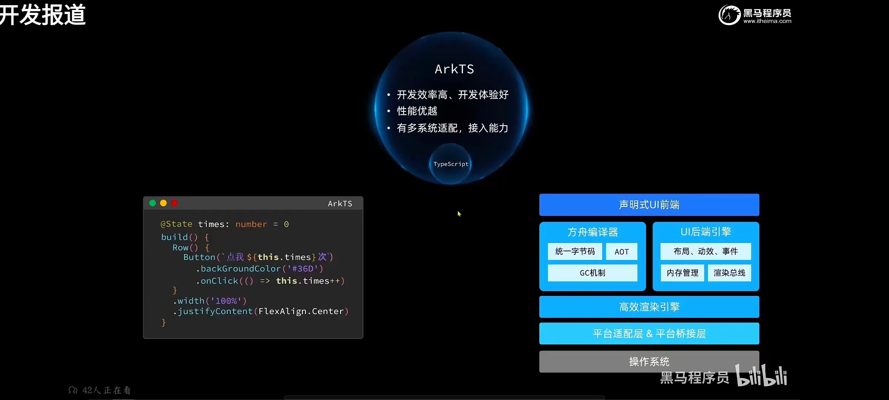

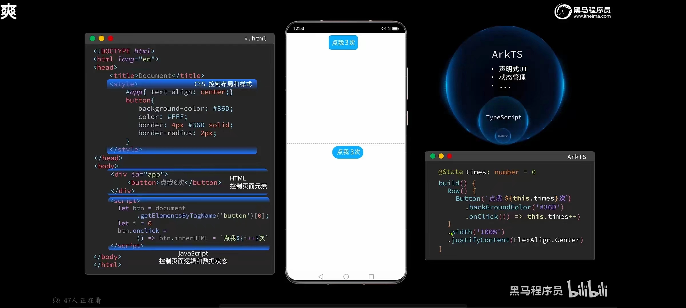


### 开发范式

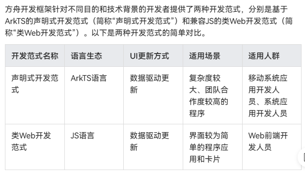


### 开发目录

#### [应用配置文件（Stage模型）](https://developer.harmonyos.com/cn/docs/documentation/doc-guides-V3/application-configuration-file-overview-stage-0000001428061460-V3)

> 在基于Stage模型开发的应用项目代码下，都存在一个app.json5及一个或多个module.json5这两种配置文件。
>
> - app.json5
>   - 应用的全局配置信息，包含应用的包名、开发厂商、版本号等基本信息。
>   - 特定设备类型的配置信息
> - module.json5
>   - Module的基本配置信息，例如Module名称、类型、描述、支持的设备类型等基本信息。
>   - [应用组件](https://developer.harmonyos.com/cn/docs/documentation/doc-guides-V3/stage-model-development-overview-0000001427744552-V3)信息，包含UIAbility组件和ExtensionAbility组件的描述信息。
>   - 应用运行过程中所需的权限信息。


#### [资源分类与访问](https://developer.harmonyos.com/cn/docs/documentation/doc-guides-V3/resource-categories-and-access-0000001711674888-V3#ZH-CN_TOPIC_0000001711674888__系统资源)

> stage模型多工程情况下，共有的资源文件放到AppScope下的resources目录。


#### TS基础

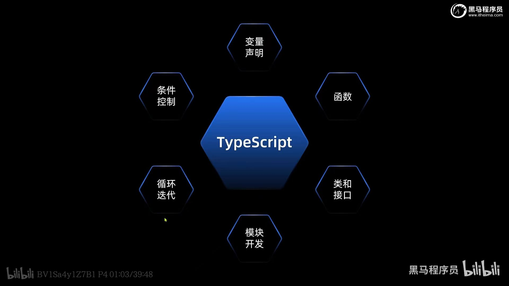

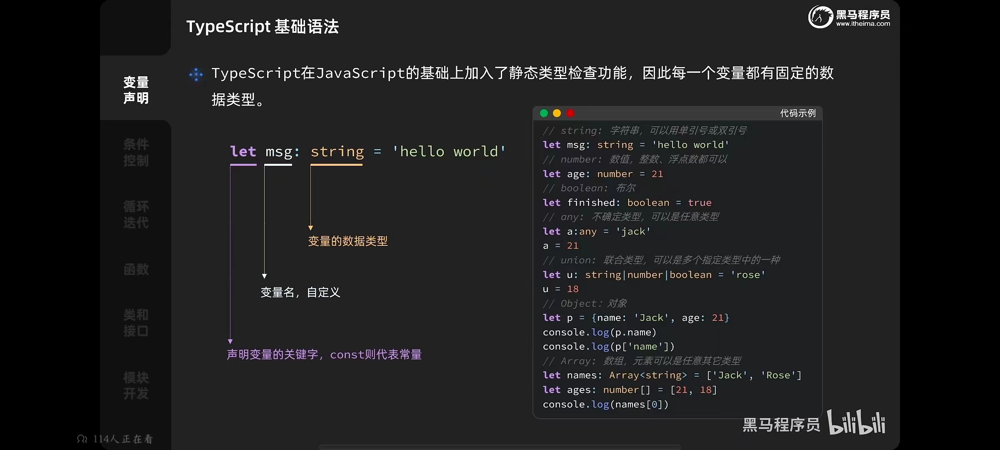

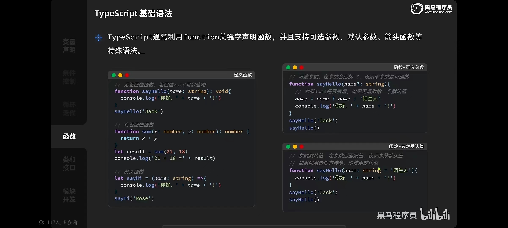

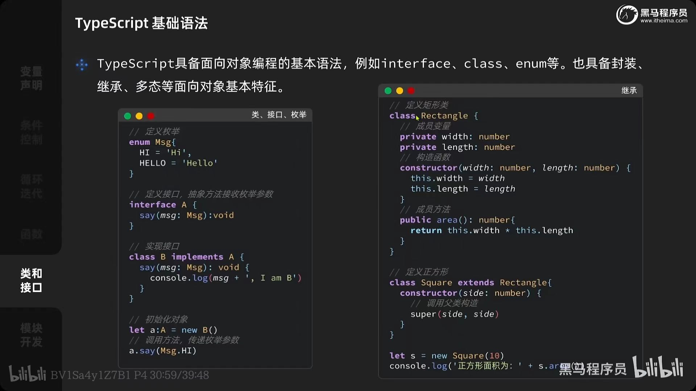


### 新版开发目录

> 应用/服务的发布形态为APP Pack (Application Package)，由一个或多个HAP包及描述APP Pack属性的pack.info文件组成
>
> 一个HAP工程目录中对应一个Module，由代码、资源、三方库及应用/服务配置文件组成，可分为 Entry 和 Feature 两种类型。
>
> - Entry：应用主模块，作为应用的入口，提供应用基础功能
> - Feature：应用的动态特性模块，作为应用能力的扩展，可根据用户需求和设备类型进行安装
>
> 基于Stage模型和FA模型开发应用，程序包的结构并不相同
>
> - 一个Stage模型的程序包，由一个Entry.hap一个pack.info和多个Feature.hap共同构成
>
>   - est 源码
>   - resources 资源
>   - libs 三方库
>   - resources.index   资源索引
>   - module.json 配置文件
>
>   
>
>   
>
>   
>
>   


### [ArkTS语言](https://developer.huawei.com/consumer/cn/arkts/first-know/)

> 在保持TypeScript 语法风格的基础上，对TS的动态类型特性施加更严格的约束，引入静态类型。同时，提供了声明式UI、状态管理等相应的能力，让开发者可以以更简洁、更自然的方式开发高性能应用。
>
> - [基于ArkTS的声明式开发范式](https://developer.harmonyos.com/cn/docs/documentation/doc-references-V3/ts-components-summary-0000001478181369-V3)


#### ArkTS特点

- 类中的属性必须有值，不能只定义不给初始值！

- 不支持运行时更改对象布局

  - 可使用可选属性和给该属性赋值undefined的方式替代

  ```typescript
  /* 不支持运行时更改对象布局-运行时支持此类特性需要大量的性能开销     报错：删除/添加/赋值其他类型
   - 原因：
  */
  class Point {
      public x:number
      public y:number
      
      constructor(x:number, y：number){
          this.x = x
          this.y = y
      }
  }
      
  let p1 = new Point(1,1) 
  delete p1.x // 删除对象属性-编译时报错
  p1.z = 1 // 添加对象属性-编译时报错
  p1.x = 'string字符串' // 赋值其他类型数据-编译时报错
  ```

- 不能使用 var 声明变量

- 对象字面量必须标注类型，且不能为空对象

  ```typescript
  /* 编译器不知道变量的类型，无法深度优化代码，造成性能瓶颈；其次缺少类型限制，运行时检查修改类型也会带来额外的性能开销 */
  const point = { x:0, y:0 }   // 编译报错-必须标注类型
  
  interface Point = {
      x:number,
      y:number
  }
  const point: Point = { x:0, y:0 } 
  ```

- 不支持 structural typing

  - 简言之：传参类型必须与定义的类型保持一致！


#### ArkTS数据类型及运算符

- 所有：Number   Boolean    String	Array    Enum-枚举    Union-联合类型

  - 枚举Enum：约定变量只能在一组数据范围内选择值，
    - 默认的取值为数组的0-1-2...
    - 也可进行等号赋值
  - 联合类型Union，一种灵活的数据类型，它修饰的变量可以存储不同的数据类型

  ```typescript
  /* Number类型 */
  // 进制表示
  let b1:number = 0o12  // 八进制 10
  let b2:number = 0x12  // 十六进制 18
  let b3:number = 0b11  // 二进制 3
  
  /* Boolean类型 */
  let b1:boolean = true
  let b2:boolean = false
  
  /* String类型 */
  let s1:string = 'string'
  let s2:string = "string"
  let s3:string = `string ${b3}`  // 可拼接变量
  
  /* Enum类型 */
  enum Man {
      GoodMan,
      BadMan,
      SexMan,
      otherMan=100
  }
  let you:Man = Man.GoodMan // you = 0
  let you2:Man = Man.otherMan // you2 = 100
  
  /* Union联合类型 */
  let 变量: 类型1 | 类型2 = 值
  let avPlayer = media.AVPlayer | null = null
  avPlayer?.play()
  let score: numer | string | null = null
  
  /* Array类型 - 支持动态扩容、下标使用等js保持一致 */
  let arr: string[] = []
  let arr2: number[] = new Array(10) // 10 数组长度限制
  arr2[100] = 100
  ```

- Object

- Aliases


```sh
/* 运算符 */
+= -= *= /= %= <<= >>= >>>= &= |= ^=
== != < > <= >=
+ - * / % 
位运算：   &与 |或 ^异或-同1异0   ~取反 <<左移  >>算数右移 >>>逻辑右移-左边补0
逻辑运算： &&与 	||或		!非
```


#### ArkTS函数

- 函数相关定义与使用与 TS 中保持一致！

- 函数类型：代表函数的引用，通常用于定义回调

  ```typescript
  type 类型名 = ()=>void // 没有传参，没有返回值
  type myFunType = (x:number) => number // 这是一个函数类型，声明函数入参和返回值
  type typeFun2 = (y?:number) => number // 可选参数y，返回值为number
  
  function do_action(f:myFunType) => {
      f(3.1415); // 调用函数
  }
  
  do_action(Math.sin);  // 将函数作为参数
  
  function fun1 = (x)=>{ returun x }
  let fun:myFunType = fun1
  
  // arkts代码示例：
  Button('测试回调按钮').onClick(mybuttonCallback) // 调用外部的函数
  let mybuttonCallback:myFunType = fun1;
  
  ```

  


#### ArkTs类/对象/泛型


##### 类

- 说明
  - 类的构造方法，只能有一个，不能写多个
  - 初始化方法有两种
    - 静态初始化，不适用constructor直接赋值
    - 通过 constructor构造方法，进行初始化【优先级更高】用的较多
- 字段修饰符
  - private  私有 - 无法在new后的对象进行访问，但可以自定义的方法访问
  - protected 保护 - 
  - public 公有【默认】- 可以在new后的对象上直接访问
- 继承与重写
  - 通过继承，子类能够获取父类非私有的属性和方法
  - 也能够重写父类的方法
  - 注意
    - super()   // 如何子类存在constructor方法 ，必须在子类的constructor方法中调用父类的构造方法！必须！
    - super()   // 可以传参，作为父类构造方法的传值
- 类型接口 implements

```ts
class 类名 {
	字段声明
    构造方法
    普通方法
    静态成员
}
class demo{
    name:string = ''
    sex:string = ''
}
class Employ{
    name:string
    sex:string
    private sal:number
    
    // 构造方法，只能有一个，不能写多个
    constructor(name:string,sex:string,sal:number){
        this.name = name
        this.sex = sex
        this.salsal = sal
    }
    
    show(){
        console.log('ken',this.name)
        return this.name
    }
}


// 创建对象
const emp = new Employ('张三','男',100)
emp.show()    // 张三


// 继承 
class 子类 extends 父类 { ... }

export class Employ2 extends Employ {
    show(){
        return this.name+'2'
    }
}

// 类型接口
interface Pingable {
  ping(): void;
}
 
class Sonar implements Pingable {
  ping() {
    console.log("ping!");
  }
}
```


##### 泛型

> 类型参数化，保证类型安全+使用时防止进行强制类型转换

- 泛型类
- 泛型数组【两种形式】
- 泛型约束，`<T extends Food>`  T 的值只能取 Food类及Food子类
  - class的T 决定内部 数据的T
- 泛型方法/函数
  - 参数的T 决定 方法名后的T；T由函数的参数决定，因此在调用方法时无需定义类型

```ts
/* 泛型类 */
export class MnStack<T>{		// 2.接收类型T
    index:number = -1
    data:T[] = []		// 3.将T的类型赋值给data的数组类型
    push(val){
        this.index++
        this.data[this.index] = val
    }
}

let stack = new MnStack<number>()  // 1.传入类型 number
stack.push(22)

/* 泛型数组 */
let arr:number[] = new Array() // 定义时设置类型
let arr = new Array<number>() // 通过泛型 new

arr[1] = 100


/* 泛型约束 */
export class MnStack<T extends Food>{ ... }   // T的传值类型只能取Food类及Food子类
let stack = new MnStack<Food>() 
stack.push(new Fash())
let stack = new MnStack<Fash>()


/* 泛型方法,T由函数的参数决定 */
function getList<T>(arr:T[]): T{
    return arr[arr.lenth-1]
}
getList([1,2,3])
// getList取代：
function getListString(arr:string[]){
    return arr[arr.lenth-1]
}
function getListString(arr:number[]){
    return arr[arr.lenth-1]
}
```


#### 空安全

> ArkTS中任何类型的值都不能赋值为 null

```ts
// ArkTS中任何类型的值都不能赋值为 null
let x:number = null  // 报错
let x:string = null  // 报错

// 解决1：使用联合类型
let x:string|number = null
// 解决2：非空断言   ! 非空断言运算符
let a: number | null = null
let b: number
b = a! + 1	// ! 非空断言运算符，当a为null空时忽略处理，不参与运算

// 解决3： 空值合并运算符 ??
return name ?? ''    // 等同于 name===null ? '' : name

// 解决4: 可选链
arr?.forEach()

```


### 约定规则


#### 数值单位

```ts
// 默认-不写单位为 vp-虚拟单位
// px-物理单位
```


#### 静态资源引用

```ts
/* 方式1：resources/base/media/ 下存放的静态文件  使用$r()引入，可以省略文件后缀  */
Image($r('app.media.xxx'))
```


### 布局


#### Column 列布局

- space 间距
- .alignItems()  设置交叉轴-水平方向的对其方式
  - HorizontalAlign.Start    水平靠左
  - HorizontalAlign.Center 水平居中
  - HorizontalAlign.End    水平靠右
- .justifyContent()  设置主轴 - 垂直方向对其方式
  - FlexAlign.Start 开始
  - FlexAlign.Center 居中
  - FlexAlign.End 末尾
  - 其他：xxx.SpaceBetween  SpaceAround  SpaceEvenly

```ts
@Entry
@Component
struct Index {
    @state message: string = 'Hello World';
    
    build(){
        Column({space:5}){
            Text("你好，鸿蒙Next")
                .width(50)
                .height(50)
                .border({
                	width:1,
                	color:Color.Red
            	})
        }
        .alignItems(HorizontalAlign.Start)
        .justifyContent(FlexAlign.Center)
    }
}

```


#### Row 行布局

- 默认行为
  - 默认依据Row盒子高度 - 垂直方向居中
  - 没有宽度时，默认居中对其，主侧轴布局不生效
- .justifyContent()  设置主轴 - 垂直方向对其方式 【同Column】
- .alignItems()  设置交叉轴-水平方向的对其方式 
  - VerticalAlign.Top   垂直靠顶
  - VerticalAlign.Center 垂直居中
  - VerticalAlign.Bottom 垂直靠下

```ts
Row({space:15}){
    // ...
}.width('100%').height('100%')
```


#### Stack 栈/堆叠布局

- 说明：子组件按照顺序依次入栈，后一个子组件覆盖前一个子组件

```ts
Stack(){
    Text('文本1').width(400).height(400).backgroundColor('#36D')
    Text('文本2').width(400).height(400).backgroundColor('red')
    Text('文本3').width(400).height(400).backgroundColor('yellow')
}
```


#### RelativeContainer 相对布局


### [ArkUI组件](https://developer.huawei.com/consumer/cn/doc/harmonyos-references-V5/arkui-api-V5)

#### [图标库](https://developer.huawei.com/consumer/cn/design/harmonyos-symbol/)


#### 通用属性

```ts
/*
width height margin padding border 
background：backgroundColor backgroundImage
*/

.border({
    width:1,
    style:'',
    color:'red', // 或者 Color.Red
    
})
```


#### 组件汇总

- Blank  空白间距

- Button 按钮

- Text 静态文本

- TextInput 文本输入框

  - palceholder 输入提示
  - type  输入内容类型【密码、邮箱等...】

- Image 图片

- AlertDialog  警告弹窗

  >  官方建议使用 `this.getUIContext().showAlertDialog({ message:'弹窗提示信息' })` 替代，更好地获取 UIContext实例

- Radio 单选

- checkbox 复选框

- Divider 分割线

- TextPicker 下拉文本选择器

- Swiper 轮播图

- 

```ts
/* Blank 空白间距 
- 仅当父组件为Row/Column/Flex时生效 
- 父元素设置了宽度，时默认占满空余空间；未设置尺寸时，通过输入最小值使用
*/ 
Blank(10)	// 最小尺寸为10vp的空白块-父元素未设置宽度时为10，设置宽度为撑满剩余空间

/* Button 按钮 */ 
Button('登录')

/* Text文本框 */
Text("你好，鸿蒙Next")

/* TextInput 文本输入框 
 - type类型：InputType.Password
*/ 
TextInput({placeholder:'请输入你的姓名'})
TextInput({placeholder:'请输入密码'}).type(InputType.Password)


/* Image 图片png/jpg/svg等资源呈现 
- fillColor 填充颜色
*/
Image($r('app.media.xxxx')).width(50).fillColor('red')
```


### 其他

#### 装饰器

> 装饰器： 用于装饰类、结构、方法以及变量，并赋予其特殊的含义 

- @Component： 装饰自定义组件，

  > **仅**能装饰 `struct关键字`声明的数据结构，装饰后则具备组件的能力，且一个struct只能被一个@Component装饰，通过build方法描述UI

- @Entry：装饰入口组件，使作为单独的页面使用

  > @Entry装饰的自定义组件将作为UI页面的入口。在单个UI页面中，最多可以使用@Entry装饰一个自定义组件。@Entry可以接受一个可选的[LocalStorage](https://developer.harmonyos.com/cn/docs/documentation/doc-guides-V3/arkts-localstorage-0000001524537149-V3)的参数

```js
@State		// 响应式变量（状态变量），装饰，能够引起界面刷新
```


#### 其它

> - [UI描述](https://developer.harmonyos.com/cn/docs/documentation/doc-guides-V3/arkts-declarative-ui-description-0000001524416537-V3)：以声明式的方式来描述UI的结构，例如build()方法中的代码块。
> - [自定义组件](https://developer.harmonyos.com/cn/docs/documentation/doc-guides-V3/arkts-create-custom-components-0000001473537046-V3)：可复用的UI单元，可组合其他组件
> - 系统组件：ArkUI框架中默认内置的基础和容器组件，可直接调用，例：Column、Text、Divider、Button。
> - 属性方法：组件可链式调用配置多项属性，如fontSize()、width()、height()、backgroundColor()等。
> - 事件方法：组件可以通过链式调用设置多个事件的响应逻辑，onClick()
> - 系统组件、属性方法、事件方法具体使用可参考[基于ArkTS的声明式开发范式](https://developer.harmonyos.com/cn/docs/documentation/doc-references-V3/ts-components-summary-0000001478181369-V3)。
> -  
> - 扩展的多种语法规范
>   - [@Builder](https://developer.harmonyos.com/cn/docs/documentation/doc-guides-V3/arkts-builder-0000001524176981-V3)/[@BuilderParam](https://developer.harmonyos.com/cn/docs/documentation/doc-guides-V3/arkts-builderparam-0000001524416541-V3)：特殊的封装UI描述的方法，细粒度的封装和复用UI描述。
>   - [@Extend](https://developer.harmonyos.com/cn/docs/documentation/doc-guides-V3/arkts-extend-0000001473696678-V3)/[@Style](https://developer.harmonyos.com/cn/docs/documentation/doc-guides-V3/arkts-style-0000001473856690-V3)：扩展内置组件和封装属性样式，更灵活地组合内置组件。
>   - [stateStyles](https://developer.harmonyos.com/cn/docs/documentation/doc-guides-V3/arkts-statestyles-0000001482592098-V3)：多态样式，可以依据组件的内部状态的不同，设置不同样式。

```js
// 自定义组件  - 使用 @Component 装饰的组件对象
struct Hello {
	// ...自定义组件内容
}

// UI 描述
build(){
    // ... UI 相关内容，类比 react中的 render return，Vue中的template
    // build()函数用于定义自定义组件的声明式UI描述，自定义组件必须定义build()函数
}

```


#### 使用说明

- 组件传参，变量或表达式也可以用于参数赋值，其中表达式返回的结果类型必须满足参数类型要求

  ```js
  Image(this.imagePath)
  Image('https://' + this.imageUrl)
  Text(`count: ${this.count}`)
  ```

- 属性方法，除了直接传递常量参数外，也可以传递变量或表达式

  ```js
  Text('hello')
    .fontSize(this.size)
  Image('test.jpg')
    .width(this.count % 2 === 0 ? 100 : 200)    
    .height(this.offset + 100)
  ```

- 事件方法，推荐箭头函数，

  > 匿名函数、组件成员函数 需要使用bind(),以确保函数体中的this指向当前组件

  ```js
  Button('add counter')
    .onClick(function(){  this.counter += 2; }.bind(this))	// 箭头函数
  	
  Button('Click me')
    .onClick(() => { this.myText = 'ArkUI';  })		// 匿名函数
  
  
  myClickHandler(): void { this.counter += 2; }
  Button('add counter')
    .onClick(this.myClickHandler.bind(this))			// 组件的成员函数
  ```


#### 自定义组件

> - 可组合：允许开发者组合使用系统组件、及其属性和方法。
> - 可重用：自定义组件可以被其他组件重用，并作为不同的实例在不同的父组件或容器中使用。
> - 数据驱动UI更新：通过状态变量的改变，来驱动UI的刷新。

- 自定义组件名、类名、函数名不能和系统组件名相同
- 自定义组件必须定义build()函数，用于定义声明式UI描述
- @Entry装饰的自定义组件，其**build()函数下的根节点唯一**且必要，**且必须为容器组件**，其中ForEach禁止作为根节点
- @Component装饰的自定义组件，其**build()函数下的根节点唯一**且必要，**可以为非容器组件**，其中ForEach禁止作为根节点
- **自定义组件成员函数约束**：不支持静态函数   ||    成员函数的访问是私有的
- **自定义组件成员变量约束**：
  - 不支持静态成员变量
  - 所有成员变量的访问都是私有的
  - 成员变量本地初始化有些是可选的，有些是必选的，[（状态管理）](https://developer.harmonyos.com/cn/docs/documentation/doc-guides-V3/arkts-state-management-overview-0000001524537145-V3)
- `build()`函数约束
  - **不能直接** 【声明本地变量、console打印、使用 `{}`】

```js
// 自定义组件的基本结构 - 基于struct实现，不能有继承关系
@Component
struct MyComponent {
   build() {
   }
}


// 示例：初始化自定义组件的值
@Component
struct MyComponent {
  private countDownFrom: number = 0;
  private color: Color = Color.Blue;

  build() {
  }
}

@Entry
@Component
struct ParentComponent {
  private someColor: Color = Color.Pink;

  build() {
    Column() {
      // 创建MyComponent实例，并将创建MyComponent成员变量countDownFrom初始化为10，将成员变量color初始化为this.someColor
      MyComponent({ countDownFrom: 10, color: this.someColor })
    }
  }
}


// 示例： 关于根节点的约束
@Entry
@Component
struct MyComponent {
  build() {
    // 入口组件中，根节点唯一且必要，且必须为容器组件，ForEach禁止作为根节点
    Row() {
      ChildComponent() 
    }
  }
}

@Component
struct ChildComponent {
  build() {
    // 非入口组件，根节点唯一且必要，可为非容器组件，ForEach可作为根节点
    Image('test.jpg')
  }
}
```


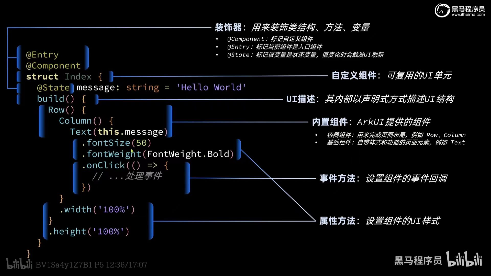

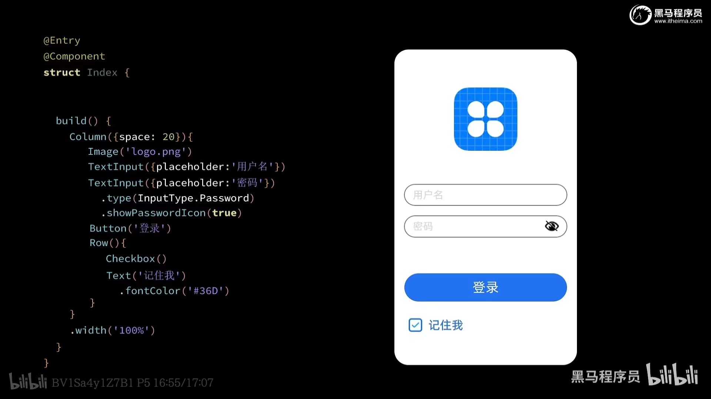

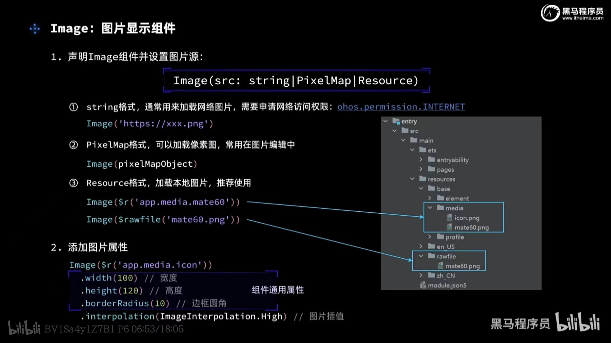

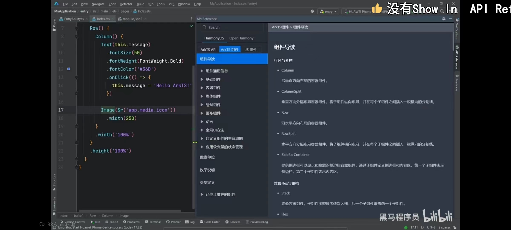

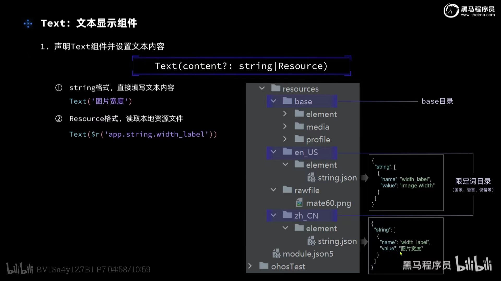


#### [@ohos.router (页面路由)](https://developer.harmonyos.com/cn/docs/documentation/doc-references-V3/js-apis-router-0000001478061893-V3)

> 页面路由栈支持的最大Page数量为32。
>
> - url
>   - 页面绝对路径，由配置文件中pages列表提供，例如：pages/index/index
>   - 如果url的值是"/"，则跳转到首页
> - params
>   - 使用router.getParams()获取传递的参数;在类web范式中，参数也可以在页面中直接使用，如this.keyValue(keyValue为跳转时params参数中的key值)，如果目标页面中已有该字段，则其值会被传入的字段值覆盖。
>   - params参数不能传递方法和系统接口返回的对象（params参数不能传递方法和系统接口返回的对象）；params参数不能传递方法和系统接口返回的对象。

- `router.pushUrl({}).then(()=>{}).catch(()=>{})`
- `router.replaceUrl`
- `router.back({url:'pages/detail'});   `    // 返回上一页面或指定的页面
- `router.clear()`    // 清空页面栈中的所有历史页面，仅保留当前页面作为栈顶页面。
- `let size = router.getLength();    `   // 获取当前在页面栈内的页面数量。
- `let page = router.getState();`     // 获取当前页面的状态信息
- `router.getParams();`     // 获取发起跳转的页面往当前页传入的参数。
- `router.showAlertBeforeBackPage({message: 'Message Info'})`   // 开启页面返回询问对话框。

```ts
// 导入路由模块
import router from '@ohos.router'

// 跳转到应用内的指定页面
router.pushUrl({
  url: 'pages/routerpage2',
  params: {
    data1: 'message',
    data2: {
      data3: [123, 456, 789]
    }
  }
})
  .then(() => {
    // success
  })
  .catch(err => {
    console.error(`pushUrl failed, code is ${err.code}, message is ${err.message}`);
  })


// 用应用内的某个页面替换当前页面，并销毁被替换的页面。不支持设置页面转场动效，如需设置，推荐使用Navigation组件。
router.replaceUrl({
  url: 'pages/detail',
  params: {
    data1: 'message'
  }
})
  .then(() => {
    // success
  })
  .catch(err => {
    console.error(`replaceUrl failed, code is ${err.code}, message is ${err.message}`);
  })
```


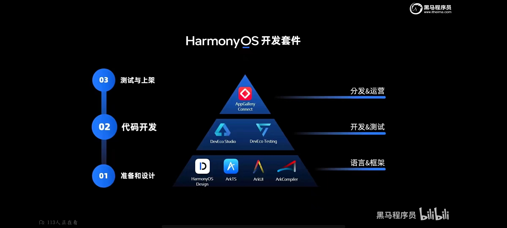


s


