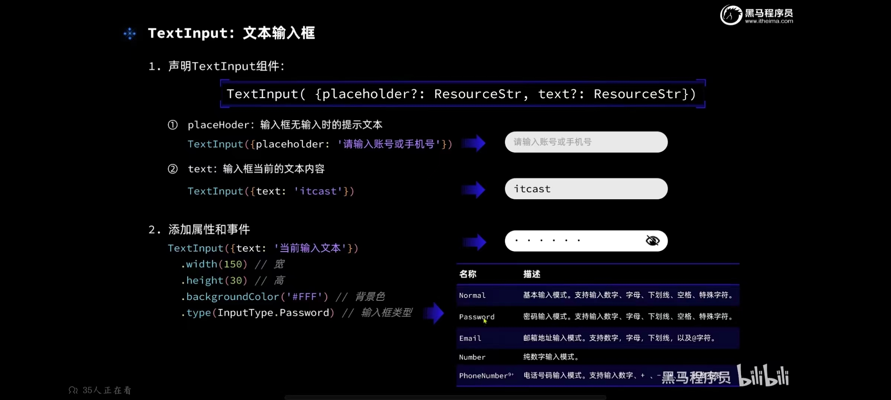

# 鸿蒙应用开发

> - [HarmonyOS官网_操作系统 || 应用 || 设备开发](https://www.harmonyos.com/cn/develop)
> - [HarmonyOS应用开发官网 - 华为HarmonyOS打造全场景新服务](https://developer.harmonyos.com/)
> - [黑马 鸿蒙HarmonyOS4.0开发视频教程（含DevEco Studio、ArkTS、ArkUI、鸿蒙项目实战等）_哔哩哔哩_bilibili](https://www.bilibili.com/video/BV1Sa4y1Z7B1/?spm_id_from=333.337.search-card.all.click)


## 基础入门


### 应用结构

- [HarmonyOS Design  设计工具](https://developer.harmonyos.com/cn/design)
- [ArkTS 语言 - HarmonyOS应用开发语言](https://developer.harmonyos.com/cn/develop/arkts/)
- [声明式UI框架ArkUI_跨端界面应用开发 - HarmonyOS应用开发](https://developer.harmonyos.com/cn/develop/arkUI/)
- [方舟编译器ArkCompiler-HarmonyOS SDK-HarmonyOS应用开发](https://developer.harmonyos.com/cn/develop/arkCompiler/)：将代码编译为字节码，从而提升运行效率
- [HUAWEI DevEco Studio和SDK](https://developer.harmonyos.com/cn/develop/deveco-studio/)：代码开发工具
- [DevEco Service  ](https://devecoservice.harmonyos.com/#deveco-testing)：测试工具
- [AppGallery Connect | 移动场景服务 | 移动应用开发 | 华为开发者联盟 (huawei.com)](https://developer.huawei.com/consumer/cn/agconnect)


### 开发异同

- 类似于React+Jquery的写法，一个文件中同时包含html、css、js
- 采用 TypeScript 语法
- 使用特定开发工具
  - [配置开发环境-快速开始-DevEco Studio使用指南](https://developer.harmonyos.com/cn/docs/documentation/doc-guides-V3/environment_config-0000001052902427-V3)


### 开发范式


### 开发目录

#### [应用配置文件（Stage模型）](https://developer.harmonyos.com/cn/docs/documentation/doc-guides-V3/application-configuration-file-overview-stage-0000001428061460-V3)

> 在基于Stage模型开发的应用项目代码下，都存在一个app.json5及一个或多个module.json5这两种配置文件。
>
> - app.json5
>   - 应用的全局配置信息，包含应用的包名、开发厂商、版本号等基本信息。
>   - 特定设备类型的配置信息
> - module.json5
>   - Module的基本配置信息，例如Module名称、类型、描述、支持的设备类型等基本信息。
>   - [应用组件](https://developer.harmonyos.com/cn/docs/documentation/doc-guides-V3/stage-model-development-overview-0000001427744552-V3)信息，包含UIAbility组件和ExtensionAbility组件的描述信息。
>   - 应用运行过程中所需的权限信息。


#### [资源分类与访问](https://developer.harmonyos.com/cn/docs/documentation/doc-guides-V3/resource-categories-and-access-0000001711674888-V3#ZH-CN_TOPIC_0000001711674888__系统资源)

> stage模型多工程情况下，共有的资源文件放到AppScope下的resources目录。


#### TS基础


### [ArkTS语言](https://developer.harmonyos.com/cn/docs/documentation/doc-guides-V3/arkts-get-started-0000001504769321-V3)

> 在保持TypeScript 语法风格的基础上，对TS的动态类型特性施加更严格的约束，引入静态类型。同时，提供了声明式UI、状态管理等相应的能力，让开发者可以以更简洁、更自然的方式开发高性能应用。





#### [@ohos.router (页面路由)](https://developer.harmonyos.com/cn/docs/documentation/doc-references-V3/js-apis-router-0000001478061893-V3)

> 页面路由栈支持的最大Page数量为32。
>
> - url
>   - 页面绝对路径，由配置文件中pages列表提供，例如：pages/index/index
>   - 如果url的值是"/"，则跳转到首页
> - params
>   - 使用router.getParams()获取传递的参数;在类web范式中，参数也可以在页面中直接使用，如this.keyValue(keyValue为跳转时params参数中的key值)，如果目标页面中已有该字段，则其值会被传入的字段值覆盖。
>   - params参数不能传递方法和系统接口返回的对象（params参数不能传递方法和系统接口返回的对象）；params参数不能传递方法和系统接口返回的对象。

- `router.pushUrl({}).then(()=>{}).catch(()=>{})`
- `router.replaceUrl`
- `router.back({url:'pages/detail'});   `    // 返回上一页面或指定的页面
- `router.clear()`    // 清空页面栈中的所有历史页面，仅保留当前页面作为栈顶页面。
- `let size = router.getLength();    `   // 获取当前在页面栈内的页面数量。
- `let page = router.getState();`     // 获取当前页面的状态信息
- `router.getParams();`     // 获取发起跳转的页面往当前页传入的参数。
- `router.showAlertBeforeBackPage({message: 'Message Info'})`   // 开启页面返回询问对话框。

```ts
// 导入路由模块
import router from '@ohos.router'

// 跳转到应用内的指定页面
router.pushUrl({
  url: 'pages/routerpage2',
  params: {
    data1: 'message',
    data2: {
      data3: [123, 456, 789]
    }
  }
})
  .then(() => {
    // success
  })
  .catch(err => {
    console.error(`pushUrl failed, code is ${err.code}, message is ${err.message}`);
  })


// 用应用内的某个页面替换当前页面，并销毁被替换的页面。不支持设置页面转场动效，如需设置，推荐使用Navigation组件。
router.replaceUrl({
  url: 'pages/detail',
  params: {
    data1: 'message'
  }
})
  .then(() => {
    // success
  })
  .catch(err => {
    console.error(`replaceUrl failed, code is ${err.code}, message is ${err.message}`);
  })
```


s


