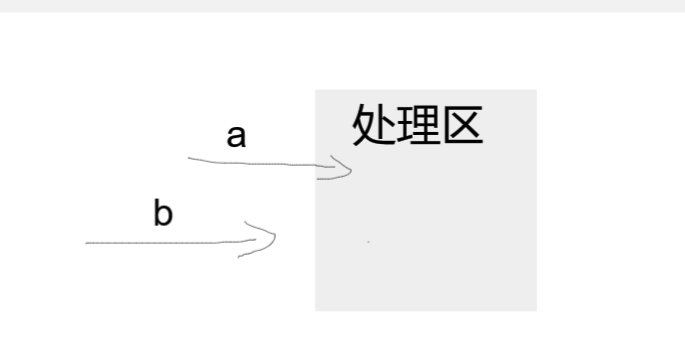

### 模板名

> | 时间 | 网站 |      |
> | ---- | ---- | ---- |
> |      |      |      |
> |      |      |      |


### 异步函数多次执行bug

> 2024.01.24

在用户修改配置时，会执行下面的异步方法，对现有的数据进行修改。期望的逻辑是：先删除activeObject中的内容，再追加新的数据，实现更新！

but：由于是异步函数，测试时发现，如果频繁的修改配置会出现更新后的数据增多！?

原因：由于是异步函数，在多次重复触发时，会产生多条处理事件，并排执行，但他们操作的数据却是同一份，假设当a执行一半，b刚好开始执行删除，b就会发现数据已经没有可删的，然后都开始向数据中追加，就会导致追加多次，与原数据不符。

解决：对于多次触发，首先想到的是“防抖 或 节流”。防抖是只执行一段时间内的最后一次；节流是每隔一段时间执行一次。首先排除节流（有可能导致用户修改数据，但看不到效果），其次在本次需求中，用户是通过滑动控制，期望用户能一直看到变化的过程，但连续的触发会被防抖抹去，也不符合需求。

后来想到之前token请求频繁问题的情景：[JS锁机制 | 夏之一周间 (wudetian.top)](https://notes.wudetian.top/notes/其他概念.html#js锁机制)

原理：队列的概念，将所有触发的事件，放入队列中。在函数执行前，判断当前是否有正在执行的内容，如果有则存入队列中，没有则执行；在函数执行结束后判断队列中是否还有内容，有则取出，无则结束！这里我并不在乎中间过于频繁所产生的队列内容，我只需要用户以最快的速度看到最新的效果即可。所以只要队列最后一个即可。（没有传参，就继续简化）



```js
// 出现问题的代码：
const pmdRender = async () => {
  const activeObject = canvasEditor.canvas.getActiveObject();
  const top = activeObject.get('top');
  const left = activeObject.get('left');
  for (let i = 0; i < baseData.img.length; i++) {
    await activeObject.removeWithUpdate(activeObject.getObjects()[baseData.img.length - i - 1]);
  }
  const AllImg = await waitAllImg(baseData);
  for (let i = 0; i < baseData.img.length; i++) {
    await activeObject.addWithUpdate(AllImg[i]);
  }
  activeObject.set({ top, left });
};

// 优化后：
let queue = false, loading = false;
const pmdRender = async () => {
  if (loading) {
    return (queue = true);
  }
  loading = true;
  const activeObject = canvasEditor.canvas.getActiveObject();
  const top = activeObject.get('top');
  const left = activeObject.get('left');
  for (let i = 0; i < baseData.img.length; i++)
    activeObject.removeWithUpdate(activeObject.getObjects()[baseData.img.length - i - 1]);
  waitAllImg(baseData).then((res) => {
    for (let i = 0; i < baseData.img.length; i++) activeObject.addWithUpdate(res[i]);
    activeObject.set({ top, left });
    canvasEditor.canvas.renderAll();
    loading = false;
    if (queue) (queue = false) && pmdRender();
  });
};
```

