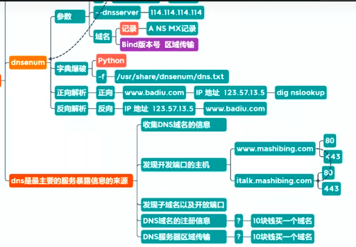
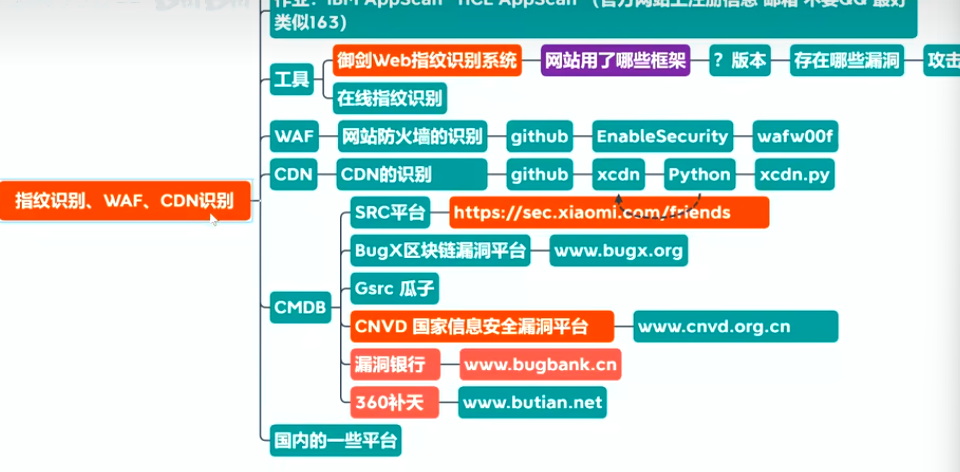
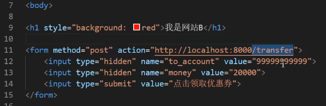
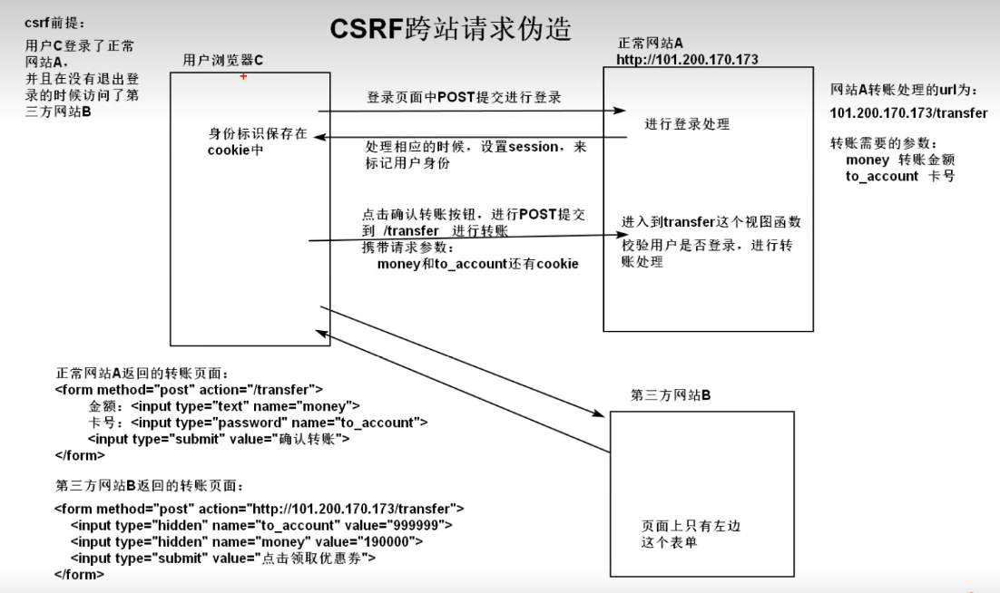
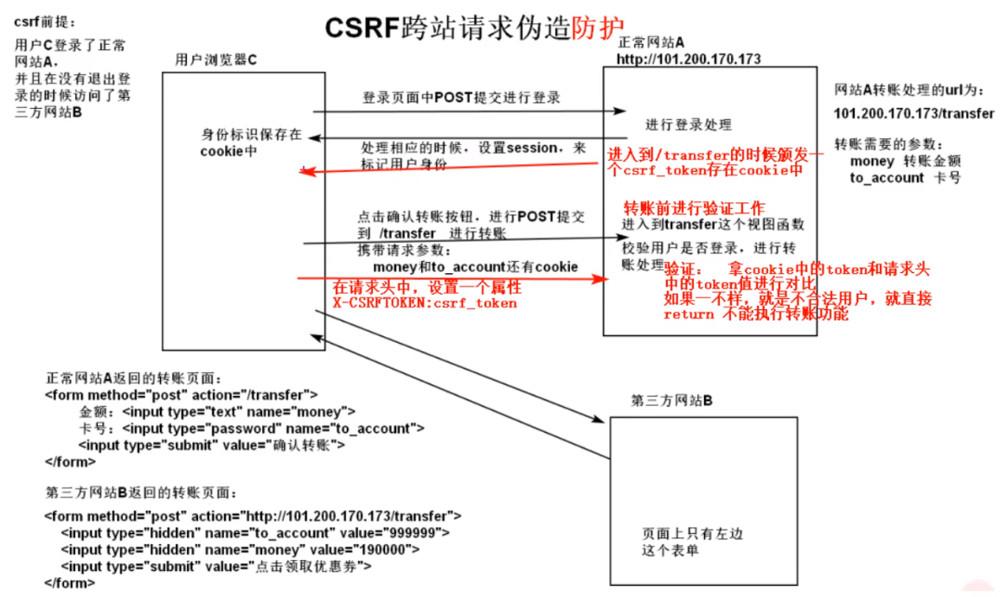

# 网络安全


## 基础概念

#### 黑客守则

1. 不恶意的破坏任何系统，恶意破坏他人的软件和服务器将要承担法律责任
2. 不修改不删除任何系统文件，如果是为了进入而修改，应在进入后恢复原样或备份
3. 不要轻易的将Hack的站点或密码告诉他人
4. 不在任何网络或公开渠道谈论相关的事情
5. 不要使用真名
6. 设备未上锁时不要轻易离开，并放置在安全的地方
7. 不要入侵或攻击电信个政府机关的服务器（主机）
8. 不在电话中谈论任何关于黑客的事情
9. 多读有关系统安全和系统漏洞的资料（复现漏洞、修复漏洞）
10. 不会编程和运维的黑客不是好黑客


#### 常见web服务器

1. IIS：微软旗下的Windows Server
2. Apache：兼容 Windows、Linux、MacOs Server
   - LAMP  LAMT  LAMPN    LAMPT
   - L:Linux   A:Apache    M:Mysql   P:php    T:Tomcat
3. Nginx：兼容 Windows、Linux、MacOs Server
4. Tomcat：开源的，Java Web项目常用
5. WebLogic
6. WebSphere
7. JBoss：J2EE开源的应用服务器


#### 渗透流程

1. 踩点 `Kail / dig / dnsmap `：确定目标地址范围
2. 收集信息` ping / fping / nmap / AutoScan `（网站信息whois信息、天眼查、备案系统、子域名、SSL证书、开放端口、网站框架、敏感文件/目录）
3. 访问`meta / kail`：密码嗅探
4. 授权`meta / kail / python / 字典`：密码爆破
5. 窃取信息：xxx
6. 灭迹：清除日志、隐藏内容
7. 创建后门`VNC/开放端口`：xxx
8. 拒绝服务`死亡之ping`：DDos


##### 信息收集

1. 信息收集
   - 企业级操作：先用扫描器扫描
     - IBM：AppScan
     - HP：WebInspect
     - 启明星辰：天镜
     - 安恒：明鉴
     - 绿盟：WVSS/RSAS
     - 其他:Nmap
   - DNS域传送漏洞（域名探测过程）
   - 根据主域名、可获得二级、三级域名
     - 通过Kail内置的dnsenum
   - 网站备案信息，备案号查询
   - SSL状态查询
   - APP信息提取
     - 抓包工具
     - 安装APP反编译：有价值得公司域名、Ip地址、端口号等信息
   - 第三方网站：7kbScan、漏洞银行、360补天、github、钟馗之眼、微步在线
   - Kali系统环境
     - 
   - 


#### SQL注入

> web程序得三层架构：界面层+业务逻辑层+数据访问层
>
> SQL注入漏洞：发生在应用程序的数据库层上的安全漏洞。在设计不良的程序当中，忽略了对输入字符串中夹带的 SQL 指令的检查，那么这些夹带进去的指令就会被数据库误认为是正常的 SQL 指令而运行，从而使数据库受到攻击，可能导致数据被窃取、更改、删除，以及进一步导致网站被嵌入恶意代码、被植入后门程序等危害。
>
> 通过注释、特定语义的sql代码，输入到用户可输入的文本中，实现注入【不过目前大多数后端工具自带sql防注入能力】


#### CSRF跨站请求伪造

> 挟制用户在当前已登录的Web应用程序上执行**非本意的操作的攻击方法**、欺骗用户的浏览器去访问一个自己曾经认证过的网站并运行一些操作

- `XSS` **利用的是用户**对指定网站的信任
- `CSRF` **利用的是网站**对用户网页浏览器的信任
  - 指攻击者盗用了你的身份，以你的名义发送恶意请求，容易造成个人隐私泄露以及财产安全
  - 例，在登录过的网站A之后，使用的第三方网站B偷偷携带了网站A提供的必要信息，对网站A进行的恶意/非用户主动操作的请求


##### CSRF防护

- 方案1：
  - 在请求头中携带token，后端拿到后将 cookie中的token与请求头中的token进行比较验证，如果一致则合法，不一致时为不合法请求
  - 为什么第三方网站直接用ajax带个请求头不行？
    - 答：第三方网站一般依赖于主网站，一旦脱离使用ajax单独发起请求，就会存在浏览器跨域问题，自然无法进行CSRF攻击，后端也会拦截来自陌生url的请求








[02-csrf项目中使用的通用版本_哔哩哔哩_bilibili](https://www.bilibili.com/video/BV13V411b7jH?p=181&spm_id_from=pageDriver&vd_source=49059bedc59884104ea6ef0a6e552378)


### CSP内容安全策略

- 一个额外的安全层，用于检测并削弱某些特定类型的攻击，包括跨站脚本（[XSS](https://developer.mozilla.org/zh-CN/docs/Glossary/Cross-site_scripting)）和数据注入攻击等。无论是数据盗取、网站内容污染还是恶意软件分发，这些攻击都是主要的手段。
- 不支持 CSP 的浏览器只会忽略它，如常运行，默认为网页内容使用标准的同源策略。如果网站不提供 CSP 标头，浏览器也使用标准的[同源策略](https://developer.mozilla.org/zh-CN/docs/Web/Security/Same-origin_policy)。
- 


### 利用OpenSSL生成私钥和公钥

> OpenSSL是什么？

```sh
 # 在 linux 中运行，会生成两个对应的密钥文件
 openssl genrsa -out rsa_private_key.pem 1024
 openssl rsa -in rsa_private_key.pem -pubout -out rsa_public_key.pem
```


## 安全防护

### 加密算法

> - 分类：对称加密、非对称加密
>
> ​	
