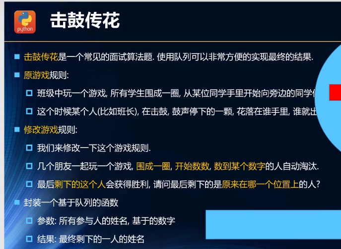
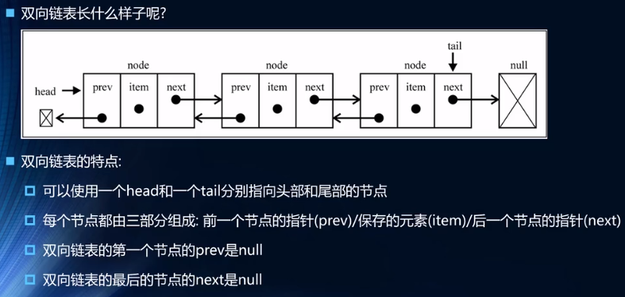

## 数据结构

### 数组

> 数组 线性结构，可以在任意位置插入和删除元素

- js数组  就是API的调用
  - 数组的特点：通过下标操作数据，十分高效！
  
  - 补充
    1. 常见语言的数组不能存放不同的数据类型，因此在封装时，通常存放在数组中的是Object对象
    2. 常见语言的数组容量不会自动变化（需要扩容操作，申请更大的空间作为数组元素）
    3. 常见语言的数组进行中间或前面插入和删除操作性能比较低（其他元素挨个移动）

### 栈结构

> 栈 受限的线性结构（只允许在栈顶进行插入和删除操作），先进后出（LIFO）

-  名词：
  - 插入元素（进栈、入栈、压栈）
  - 删除元素（出栈、退栈）
- 栈的使用场景
  - 函数的相互调用 A调用B,B调用C，C调用D
    - A先入栈，然后B，再C，最后D
    - 当最上层执行结束后，依次出栈
  - 函数递归
    - 函数递归就是再不停的将自己入栈，如果存在死循环会导致栈溢出，报错
  - 十进制转二进制（实现）
    - 除2取余，余数倒序写出（使用栈）


#### 栈的实现

- 实现方式

  - 基于数组实现
  - 基于链表实现
    - 链表也是一种数据结构，js中没有自带链表结构

- 栈的封装

  ```js
  // 栈常见的操作
  push(ele)   添加一个新元素到栈顶
  pop()     移除栈顶的元素,同时返回被移除的元素
  peek()    返回栈顶的元素，不对栈做任何修改
  isEmpty()   判断栈是否为空,空返回true,非空返回false
  size()    返回栈中元素的个数,与数组的length属性类似
  toString()  将栈结构的内容以字符形式返回
  ```
  
  ```js
  // method 方法   一般和某一对象实例有联系
  // function 函数
  function Stack(){
     this.items=[]    // 栈中的属性
     
     Stack.prototype.push=function(ele){
         this.items.push(ele)
     }
     Stack.prototype.pop=function(){
         //移除栈顶的元素,同时返回被移除的元素
         return this.items.pop()
     }
     Stack.prototype.peek=function(){
         return this.items[this.items.length-1]
     }
     Stack.prototype.isEmpty=function(){
         return this.items.length==0
     }
     Stack.prototype.size=function(){
         return this.items.length
     }
     Stack.prototype.toString=function(){
         let str=''
         this.items.forEach(i=>{ str + = i + " " })
         return str
     }
  }
  ```
  
  


### 队列结构

> 另一种受限的线性结构，先进先出 FIFO

- 实现方式

  - 基于数组实现（性能较差，需要移动大量的元素）
  - 基于链表实现

- 使用场景

  - 打印队列，按照次序依次放入打印机
  - 线程队列，
    - 为了让任务可以并行处理，通常会开启多个线程
    - 线程队列会依次序来启动线程，并处理对应的任务

- 队列的封装

  ```js
  // 队列常见方法
  enqueue(ele)  向队列尾部添加一个（或多个）新的顶
  dequeue()     移除队列的第一项，并返回被移除的元素
  front()       返回队列中第一个元素,但不修改队列
  isEmpty()     如果队列中不包含任何元素,返回true,否则返回false
  size()        返回队列中包含的元素个数
  toString()    将队列中的内容转成字符串形式，并以空格分隔
  ```

  ```js
  // 同上栈结构的数组封装法
  function Queue(){
     this.items=[]    // 栈中的属性
     
     Queue.prototype.enqueue=function(ele){
         this.items.push(ele)
     }
     Queue.prototype.dequeue=function(){
         return this.items.shift()
     }
     Queue.prototype.front=function(){
         return this.items[0]
     }
     Queue.prototype.isEmpty=function(){
         return this.items.length==0
     }
     Queue.prototype.size=function(){
         return this.items.length
     }
     Queue.prototype.toString=function(){
         let str=''
         this.items.forEach(i=>{ str + = i + " " })
         return str
     }
  }
  ```

- 面试题（击鼓传花）   17集

  

  ```js
  // 击鼓传花 代码实现
  // nameList 所有的人，num淘汰的数字
  function Game(nameList,num){
     // 创建队列结构  并把么每个人都放到队列中
     let queue = new Queue()
     for(let i=0;i<nameList.length;i++){
        queue.enqueue(nameList[i])
     }
     // 根据游戏规则，让每个人依次出队，再入队
     while(queue.size()==1){
        for(let j=1;j<num;j++){queue.enqueue(queue.dequeue())}
        queue.dequeue()
     }
     return queue.items[0]
  }
  // 测试：
  console.log(Game(["a", "c", "d", "e"], 2));    // a
  ```
  
  


### 优先级队列

> 在插入元素时考虑该数据的优先级，和其他数据进行优先级比较；每个元素不仅是一个数据，而且包含优先级

- 实现

  ```js
  function PriorityQueue(){
      // 创建元素
      function QueueElement(element,priority){
          this.element=element
          this.priority=priority
      }
      this.items=[]
      // 实现插入方法
      // 其他方法可直接从普通队列 共用
      PriorityQueue.prototype.enqueue =function(ele,priority){
          let queueElement = new QueueElement(ele,priority)
          if(this.items.length==0){
             this.items.push(queueElement)
          }else{
              let added = false
              for(let i=0;i<this.items.length;i++){
                  if(queueElement.priority<this.items[i].priority){
                      this.items.splice(i,0,queueElement)
                      break;
                  }
                  if(i==this.items.length-1){
                      this.items.push(queueElement)
                  }
              }
          }
      }
  }
  ```
  
  

### 链表结构

> 可用于存储一系列的元素

- 与数组的异同
  - 数组与链表一样，可用于存储一系列的元素，但是链表和数组的**实现机制完全不同**
  - 数组通过下表访问更方便（删除插入时间复杂度大），链表插入删除更高效（必须依次访问）
  - 数组/列表:
    - 数组的创建需要申请一段**连续的内存空间（一整块内存）**，并且大多数语言中，它的大小是固定的，当大小不能满足要求时，需要**扩容**（申请更大的空间，将元素复制过去）
    - 在数组开头或中间插入数据的成本很高，需要进行大量元素的位移
    - 虽然JavaScript封装了大量的方法，但背后的原理依旧如此
  
- 链表的优势
  - 链表中的元素在内存中**不必是连续的空间**，实现灵活的内存动态管理
  - 链表的每个元素由一个存储元素本身的节点和一个指向下一个元素的引用（指针/连接）组成
  - 不必在创建时确定大小，并且大小可以无限的延伸下去
  - 链表在**插入和删除**数据时，时间复杂度可以达到 O(1) ,相比数组效率高很多
  
- 链表的封装

  ```js
  // 链表的常见操作
  append(ele)      //向列表尾部添加一个新的项
  insert(position,element)    //向列表的特定位置插入一个新的项
  get(position)     //获取对应位置的元素
  indexOf(element)  //返回元素在链表中的索引，没有该元素返回-1
  update(position,newdata)  //修改某个位置的元素
  removeAt(position)    //从链表的特定位置移除一项
  remove(ele)       //从列表中移除一项
  isEmpty()     //如果链表中不包含任何元素返回true，链表长度大于0返回false
  size()        //返回链表包含的元素个数
  toString()    // 
  ```

  

  ```js
  function LinkedList(){
      // 节点类
      function Node(data){
          this.data=data
          this.next=null
      }
      // 属性
      this.head=null
      this.length=0
      
      // 原型上追加方法
      LinkedList.prototype.append=function(data){
          let newNode = new Node(data);
          //判断是不是第一个节点
          if(this.length==0){
              this.head = newNode;
          }else{
              let current = this.head
              while(current.next){ current=current.next }
              current.next=newNode
          }
          this.lengtn += 1
      }
      
      LinkedList.prototype.toString=function(){
          let current = this.head
          let lisString=''
          while(current){
              lisString += current.data + ' '
              current = current.next
          }
          return lisString
      }
      
      LinkedList.prototype.insert=function(position,data){
          //对position进行越界判断 越界就返回 false
          if(position<0||position>this.length)return false
          let newNode = new Node(data)
          //判断position==0？
          if(position==0){
              newNode.next = this.head
              this.head = newNode
          }else{
              let index=0
              let current = this.head
              let previous=null
              while( index++ < position ){
                  previous=current
                  current=current.next
              }
              previous.next=newNode
              newNode.next=current
          }
          this.length += 1
          return true
      }
      
      LinkedList.prototype.get=function(position){
          //对position进行越界判断 越界返回 null
          if(position<0||position>=this.length)return null
          let index=0
          let cunrrent = this.header
          while(index++<position){
              cunrrent=cunrrent.next
          }
          return  cunrrent.data
      }
      
      LinkedList.prototype.indexOf=function(data){
          //返回元素在链表中的索引，没有该元素返回-1
          let index=0
          let cunrrent = this.header
          while(cunrrent){
              if( cunrrent.data == data){ return index }
              index += 1
              cunrrent=cunrrent.next
          }
          return -1
      }
      
      LinkedList.prototype.update=function(position,newdata){
          if(position<0||position>=this.length)return false
          // 循环找到指定位置，将data的修改
          let index = 0
          let cunrrent = this.header
          while(index++<position){
              cunrrent=cunrrent.next
          }
          cunrrent.data=newdata
          return true
      }
  
      LinkedList.prototype.removeAt=function(position){
          if(position<0||position>=this.length)return null
          if(position==0){
              this.header=this.header.next
          }else{
              let index = 0
              let previous=null
              let current = this.header
              while(index++<position){
              previous=current
              current=current.next
              }
              previous.next=current.next
              this.length-=1
              return current.data
          }
      }
      
      LinkedList.prototype.remove=function(data){
          // 获取元素的位置信息，删除该位置的节点
          let index=this.indexOf(data)
          return this.removeAt(index)
      }
      
      LinkedList.prototype.isEmpty=function(){
          return this.length==0?true:false
      }
      
      LinkedList.prototype.size=function(){
          return this.length
      }
      
  }
  ```
  
  

### 双向链表

- 单链表（链表相连的过程是单项的）
  - 只能从**头遍历到尾** 或者 **尾遍历到头** （一般从头到尾）
  - 实现原理：上一个链表中有指向下一个的索引
  - 缺点：
    - 可以轻松的到达下一个节点，但不能回到上一个节点
    - 例: 文本编译器用链表存储文本，每一行用一个**String对象**存储在链表的一个节点中，当编辑器用户**上下移动光标**时，需要回到上个节点，单链表只能从头开始查找，不能指回上一个
  
  
  
- 双向链表
  - 每个节点 既有向前的引用，又有向后的引用
  - 缺点：
    - 每次插入/删除时，需要处理四个引用，而不是两个
  - 
  
- 封装双向链表

  ```js
  // 双向链表的常见操作
  append(ele)      //向列表尾部添加一个新的项
  insert(position,element)    //向列表的特定位置插入一个新的项
  get(position)     //获取对应位置的元素
  indexOf(element)  //返回元素在链表中的索引，没有该元素返回-1
  update(position,newdata)  //修改某个位置的元素
  removeAt(position)    //从链表的特定位置移除一项
  remove(ele)       //从列表中移除一项
  isEmpty()     //如果链表中不包含任何元素返回true，链表长度大于0返回false
  size()        //返回链表包含的元素个数
  toString()    // 由于列表使用了Node类，就需要重写继承自js对象默认的toString方法，让其只输出元素的值
  forwardString()  //返回正向遍历的节点字符串形式  从后往前遍历
  backwordString() //返回反向遍历的节点字符串形式  从前往后遍历 与toString方法一致
  ```

  ```js
  // 封装双向链表
  function DoublyLinkedList(){
      // 内部类 创建节点
      function Node(data){
          this.data=data
          this.prev=null
          this.next=null
      }
      // 属性
      this.head=null
      this.tail=null
      this.length=0
      
      DoublyLinkedList.prototype.append=function(data){
          let newNode=new Node(data);
          if(this.length==0){
              this.head=newNode
              this.tail=newNode
          }else{
              newNode.prev=this.tail
              this.tail=newNode
          }
      }
      
      DoublyLinkedList.prototype.toString=function(){
          var current=this.head
          var resyltString = ''
          while(current){
              resyltString += current.data + ''
              current=current.next
          }
          return resyltString
      }
      
      DoublyLinkedList.prototype.insert=function(position,element){
          // 越界判断
          if(position<0 || position>this.length)return false
          let newNode=new Node(data);
          // 
          if(this.length==0){
              this.head=newNode
              this.tail=newNode
          }else{
              if(position=0){
                  
              }eles if(position=this.length){
                  
              }else{
                  
              }
          }
      }
      
      
  }
  ```
  
  


### 集合


## 算法

> 一个有限指令集，每条指令的描述不依赖于语言，并在有限的步骤后终止


