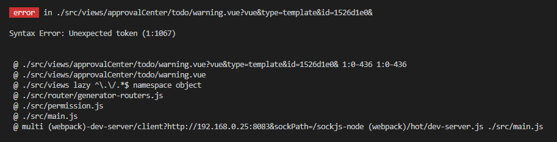
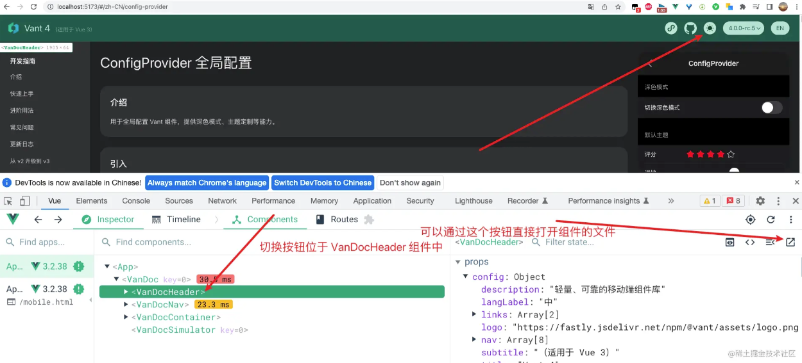

## ToDolis案例

- 数据在哪里，操作数据的方法就在那里
- 所有的方法命名时注意不要用关键字或保留字，否则报错！  (可以适当长一些，多个词)
- prop传给孩子的数据，如果孩子用data使用，相当于给孩子复制一份，不会再受父级数据的改变


### 性能优化

- `:key`的合理使用，减少vue内核再次渲染的压力，模板复用


### key值的设置

**便捷，但不太靠谱的方法** 

1. 使用索引值，极不推荐  
2. 使用随机数，可能偶发冲突  `Math.random()`
3. 使用当前的时间戳，存在不和理性  `Date.now()`

**推荐方法**

1. uuid标准
   - 作用：制定了规则，生成全球唯一的字符串
   - 使用了地理位置、MAC地址、。。。。。混合生成
   - 缺点：文件较大，生成的字符串过长
2. <span style ="color:red">nanoid</span>
   - 作用：是uuid的精简版，
   - 安装：在项目目录下<span style ="color:red">`npm i nanoid`</span>
   - 使用说明：
     - 采用分别暴露的方式引入
     - `import {nanoid} from 'nanoid'`
     - 直接调用`nanoid()`,就会返回一随机数


### 组件内传参数

- 为绑定事件传递参数，直接在标签的事件名后添加`（参数）`即可
- 参数可以是任何一个能通过模板语法获得的表达式/值

```html
<!-- 为绑定的点击事件传递参数 -->
<input type="checkbox" :checked="todo.checkeds" @click="shanchu(todo.id)"></input>
```


### 父子组件传值

#### 传数据(父-子)

- 把数据放在父组件中
- 使用propos配置项，共享数据给子组件
- 子组件不能修改props配置项接收到的数据，请看下一跳
- 父组件中的数据使用数组，子组件就可以通过数组的索引值更改父组件中的数据

#### 传方法(子-父)

- 传递方法让子组件调用，让子组件使用父组件的方法
- 可以将子组件的数据返回到父组件中使用

```vue
methods:{
   receive(x){
        console.log(x);
   }
}
```


### 数据的展示

- 使用`v-for`遍历已有的数据

- 配合插值语法或vue指令展示内容

- 在标签中传值时，一定记得加： 表示传递的是表达式，而不是字符串

- 使用V-html配合字符串拼接，实现js动态创建页面结构

  ```vue
  <template>
     <div class="navBox" v-html="navEle"></div>
  </template>
  <script>
  export default {
    name: 'App',
    data(){
      return {
        navEle:"",
        navList:[
        { id:1,name:"总览",parentid:null },
        { id:2,name:"山东",parentid:1 },
        { id:3,name:"河北",parentid:1 },
        { id:4,name:"河南",parentid:1 },
        { id:5,name:"济南", parentid:2 },
        { id:6,name:"青岛",parentid:2 },
        { id:7,name:"烟台",parentid:2 },
        { id:8,name:"石家庄",parentid:3 },
        { id:9,name:"唐山",parentid:3 },
        { id:10,name:"历下区",parentid:5 },
        { id:11,name:"市中区",parentid:5 },
        { id:12,name:"天桥区",parentid:5 }
        ]
      }
    },
    methods:{
      getNav(pid=1){
        var str="";
  
        this.navList.forEach(item=>{
          if(item.id==pid){
            str+=`<div class="title">${item.name}</div>
              	<ul class="layer1"> `
          }
          if(item.parentid==pid){
            str+=`
              <li>${item.name}
                <ul class="layer2">${this.getSubNav(item.id)}</ul>
              </li>`
          }
        })
        this.navEle=str
      },
  
      getSubNav(id,sub=0){
        var str="";
        sub++      
        this.navList.forEach(item=>{
          if(item.parentid==id){
            str+=`
              <li>
              	${item.name}
              	<ul class="subnav${sub}">${this.getSubNav(item.id,sub)}</ul>
              </li>`
          }
        })
        return str;
      }
    },
    mounted(){
      this.getNav()
    }
  }
  </script>
  ```
  
  


## 常见问题

### 深度样式

- vue3中     :deep()取代了/deep/ 

### 路由重复点击报错

- vue-router  的官方错误

- 解决方案：

  1. 对  vue-router 进行降级处理（不推荐）`npm i vue-router@3.0.7`

  2. 在路由操作时捕获异常，但不处理异常

     ```js
     this.$router.replace({
         name: "Guang",
     }).catch(()=>{});
     ```

  3. 直接修改原型方法 进行改造（推荐）

     ```js
     //  例：改造 push方法
     // 将以下代码直接粘贴到 router/index.js 中的 Vue.use(VueRouter)之前
     const originalPush = VueRouter.prototype.push;
     VueRouter.prototype.push = function(location){
        return originalPush.call(this,location).catch(()=>{});
     }
     
     const originalReplace = VueRouter.prototype.replace;
     VueRouter.prototype.replace = function(location){
        return originalReplace.call(this,location).catch(()=>{});
     }
     ```


### 不常见的语法错误：

1. v-if 中不能使用 `?.` 运算符，否则项目运行报错

   


### 无法获取location.serach

- **使用了hash导致**，因为hash会将url中第一个#后的内容都作为hash内容，所以search为空了.

- 解决办法

  - ```js
    var search = window.location.hash.split("?")[1]; 
    console.log(search)     // id=1&time=2021-11-23
    ```

    


## 其他

### axios 拦截器

```js

```


### axios 抽取

```js

```


### reset-css

> reset-css 是一种样式清除模块，清除默认样式  替代  *{margin:0,padding:0}等工作

- 安装 yarn add reset-css

- ```js
  // 在main.js入口文件中 引入 
  import 'reset-css'
  ```


### [better-scroll](https://gitee.com/mirrors/better-scroll/)

> BetterScroll 是一款重点解决移动端各种滚动场景需求的开源插件，适用于滚动列表、选择器、轮播图、索引列表、开屏引导等应用场景。

- 盒子要求
  - 外小 内大   使用溢出隐藏  `overflow:hidden;`

```js
// 两种安装选择
npm install better-scroll -S  # 安装带有所有插件的 BetterScroll
npm install @better-scroll/core # 核心滚动，大部分情况可能只需要一个简单的滚动
// 两种引入使用
import BetterScroll from 'better-scroll'
let bs = new BetterScroll('.wrapper', {
  movable: true,
  zoom: true
})

import BScroll from '@better-scroll/core'
let bs = new BScroll('.wrapper', {})
```


### vue-devtools

> vue控制台工具，可以直接打开组件指定的文件




### UI 框架

#### [Antd](https://1x.antdv.com/docs/vue/introduce-cn/)

- 如何实现slot-scope传参的

  ```html
  <!-- 获取文本数据使用text，当前行数据record，索引index  -->
  <template slot="hsRoundsName" slot-scope="text, record">
          <a class="btn entrance" @click="handleSee(record)" :title="text">{{ text }</a>
  </template>
  ```

  

#### [Vant UI](https://vant-contrib.gitee.io/vant/v2/#/zh-CN/home)

- Vue 2 项目，安装 Vant 2： npm i vant@latest-v2 -S

- 下载插件，实现自动按需引入

  - \# 安装插件 npm i babel-plugin-import -D

  ```js
  // 对于使用 babel7 的用户，可以在 babel.config.js 中配置
  module.exports = {
    plugins: [
      ['import', {
        libraryName: 'vant',
        libraryDirectory: 'es',
        style: true
      }, 'vant']
    ]
  };
  
  // 接着你可以在代码中直接引入 Vant 组件
  // 插件会自动将代码转化为按需引入形式
  import { Button,... } from 'vant';
  ```

  

- 对需要使用的UI组件进行统一管理

  - 在src文件夹下新建VantUI文件夹，增加index.js文件

  ```js
  // 统一管理使用的VantUI组件 使用什么就将组件在这里引入
  import Vue from 'vue';
  import { Button } from 'vant';
  import "vant/lib/button/style";
  Vue.use(Button);
  ....
  ```

  - 在入口文件main.js引入该文件 实现全局可用`import './VantUI/index.js'`

- 其他内容依据官方文档使用即可


#### [Element UI](https://element.eleme.cn/#/zh-CN)

- ```js
  // 下载 element-ui
  yarn add element-ui -S
  // 下载 babel-plugin-component 进行按需引入
  npm install babel-plugin-component -D
  // 在 .babel  或 babel.config.js 中添加如下内容
  {
    "presets": [["es2015", { "modules": false }]],
    "plugins": [
      [
        "component",
        {
          "libraryName": "element-ui",
          "styleLibraryName": "theme-chalk"
        }
      ]
    ]
  }
  
  // 在main.js入口文件中 引入配置。。。。。
  // 详细查看 VantUI的引入
  ........
  ```

  


#### [cube-ui](https://didi.github.io/cube-ui/#/zh-CN)

- 按需引入与vantui用法一致
