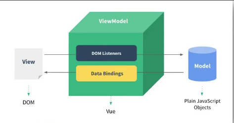
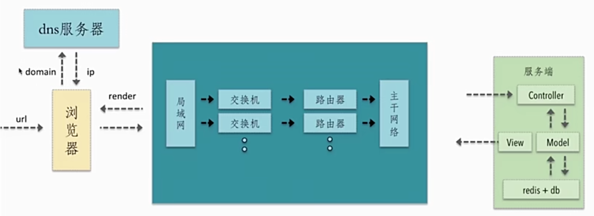
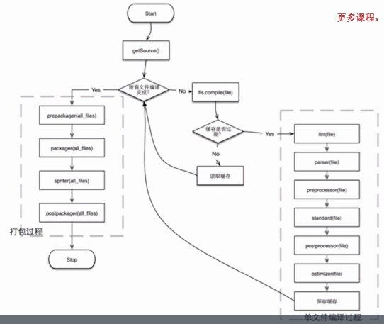
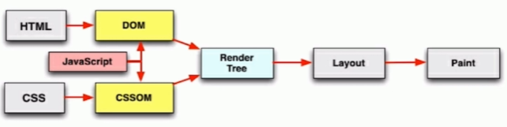

### 概念

#### 同步|异步

- 同步 sync：按顺序执行，前面的内容执行结束后，才会执行后面的部分
  - 例：js代码阻塞运行
- 异步：不需要等待某一部分执行，可以同时执行
  - 例：有回调函数(事件、定时器)、Ajax


#### 框架与库

- 框架(framework)：

  > 框架规定了自己的编程方式，是一套完整的解决方案，
  >
  > 大部分的逻辑在框架内部已经被确定，
  >
  > 使用时：需要根据规则填充自己的内容，具有一定的限制，但很强大（类似完形填空）

  - 例子：Vue.js

- 库(Library)：

  > 提供了一系列方法的集合，可以调用方法且程序逻辑由自己掌握，而并不是在库中定好的。
  >
  > 本质：一些函数的集合，每次调用函数实现一个特定的功能，只是一个工具
  >
  > 使用时：更自由，可以随意调用或不调用

  - 例子：jQuery


#### MVC与MVVM

- MVC：

  > 在传统的非前后端分离项目中，后端需要处理大量的内容，如果不按照一定的模式就是"大乱炖"
  >
  > 模型 M－视图(用户界面) V - 控制器 C

  - C即controller控制器：接受用户的输入并调用模型和视图去完成用户的需求，控制器本身不输出任何东西和做任何处理。它只是接收请求并决定调用哪个模型构件去处理请求，然后再确定用哪个视图来显示返回的数据。
  - V即View视图：指用户看到并与之交互的界面。比如由html元素组成的网页界面，或者软件的客户端界面。MVC的好处之一在于它能为应用程序处理很多不同的视图。在视图中其实没有真正的处理发生，它只是作为一种输出数据并允许用户操作的方式。
  - M即model模型：指业务规则。在MVC的三个部件中，模型拥有最多的处理任务。被模型返回的数据是中立的，模型与数据格式无关，这样一个模型能为多个视图提供数据，由于应用于模型的代码只需写一次就可以被多个视图重用，所以减少了代码的重复性。

  


- MVVM

  > 由后端的MVC架构演化而来，传统的MVC并不符合前端的实际需求
  >
  > 划分代码职责：原本需要发数据、存数据、拼模板、渲染DOM...（大乱炖）
  >
  > - Model 模型：对应Vue  data中的数据
  > - View 视图：模板
  > - ViewModel  视图模型：vue实例对象， 是View与Model的结合

  - 优点：
    - 将视图 UI 和业务逻辑分开
    - **低耦合**。视图（View）可以独立于Model变化和修改，一个ViewModel可以绑定到不同的"View"上，当View变化的时候Model可以不变，当Model变化的时候View也可以不变。
    - **可重用性**。你可以把一些视图逻辑放在一个ViewModel里面，让很多view重用这段视图逻辑。
    - 实现数据的双向绑定：
      - 修改数据 M => 视图自动改变
      - 修改视图 V => 数据自动改变




#### 数据代理

- 概念：通过一个对象代理对另一个对象中属性的操作（读/写）

- ```js
  // vue2: 借助Object.defineProperty为对象追加属性
  let obj = { x:100 }
  let obj2 = { y:200 }
  
  //通过obj2中的x对obj中的x进行读写操作
  Object.defineProperty( obj2,'x'{
     get(){
         return obj.x
     },
     set(value){
         obj.x = value
     }
  })
  ```


#### 防抖节流

- 为了限制JS频繁的执行一段代码

- 例：scroll事件，只是轻微滚动一下滚动条就触发多次事件，由于过于频繁地DOM操作和资源加载，严重影响了网页性能，甚至会造成浏览器崩溃

- 此时：用 debounce（防抖）和 throttle（节流）的方式来减少调用频率，同时又不影响实际效果

- **防抖**：

  - 连续的多次触发，固定的时间间隔内，存在新的触发，就清除之前的重新记时，满足时间执行一次——**最新一次触发**（只保留 新事件）
  - 手段1：通过设置setTimeout定时器的方式延迟执行，当快速多次点击的时候，每一次都会重置定时器，只有你一段时间都不点击时定时器才能到达条件并执行事件函数。即如果触发事件后在 n 秒内又触发了事件，则会重新计算函数延执行时间。
  - 模拟一个表单提交的例子，多次快速点击提交后只会执行一次

- **节流（节流阀）**：

  - 连续的多次触发，每一段固定的时间间隔内，我们只去执行一次——**固定频率触发**（忽略新产生的同类事件）
  - 确保某个事件，在同一时间只能有一个
  - 如果已经存在，就保留原来的，不再触发

  - 与防抖最大的区别就是，无论事件触发多么频繁，都可以保证在规定时间内可以执行一次执行函数
  - 例：用户在滚动页面时，每隔一段时间发一次 ajax 请求，而不是在用户停下滚动页面操作时才去请求数据


#### 重排(回流)、重绘

> DOM性能 浏览器的性能大部分都是被这两个问题所消耗

- 重绘不一定需要回流（比如颜色的改变），回流必然导致重绘（比如改变网页位置）
- 重绘：元素中的背景、透明度、颜色发生变化后，浏览器针对某一元素进行单独的渲染
- 重排（回流/重构）：DOM位置、大小或结构、定位发生变化；导致浏览器重新渲染整个DOM树、非常耗性能
  - 添加、删除可见的dom
  - 元素的位置改变
  - 元素的尺寸改变(外边距、内边距、边框厚度、宽高、等几何属性)
  - 页面渲染初始化
  - 浏览器窗口尺寸改变
  - 获取某些属性：offsetTop、offsetLeft、 offsetWidth、offsetHeight、scrollTop、scrollLeft、scrollWidth、scrollHeight、clientTop、clientLeft、clientWidth、clientHeight、getComputedStyle() (currentStyle in IE)。在多次使用这些值时应进行缓存
- 优化：
  - 不要一条一条地修改 DOM 的样式，可以先定义好 css 的 class，然后修改 DOM 的 className
  - 不要把 DOM 结点的属性值放在一个循环里当成循环里的变量
  - 获取浏览器重排DOM节点的属性值，存储到变量中
  - 避免使用 table 布局，很小的改动会造成整个 table 的重新布局


#### SPA单页应用

> 单页面应用指：只有一个web页面的应用。

- 特点：浏览器一开始直接加载必须的HTML、CSS、JS，所有的操作都在这一个页面上完成，有JavaScript控制交互和局部刷新
- 优点：
  - 有利于前后端分离
  - 良好的用户体验，不刷新界面，显示更流畅
  - 减轻服务器压力，不需要频繁请求界面
- 缺点：
  - 初次加载比较耗时
  - 不利于SEO优化


内存泄露与内存溢出


#### 事件委托

- addEventListener 事件绑定第三个参数默认为 false **事件冒泡阶段**
- 优点：
  - 提高性能：每个函数都会占用内存空间，只添加一个事件处理程序，所占用的内存空间更少
  - 动态监听：使用委托可监听“未来”的元素


#### 原生事件机制

1. 到目前为止,一共出现多少种事件机制?
   1. 一共存在3种
   2. 事件捕获机制
   3. 事件冒泡机制
   4. 标准事件机制
2. 标准事件机制,一共分为几个阶段?
   1. 捕获阶段
      1. 从最外层的document元素开始向内逐层传递,触发**同类型**事件,直到找到目标元素为止
   2. 目标阶段
      1. 捕获阶段结束之后,将目标元素身上所有的**同类型**事件全部触发
   3. 冒泡阶段
      1. 目标阶段结束之后,从目标元素开始向外逐层传递,触发**同类型**事件,直到最外层document元素为止
3. 如何绑定事件监听?
   1. 举例:现在需要给div节点,绑定click事件监听
   2. div.onclick=function(){}
      1. 本质:是对div对象的onclick属性进行赋值
      2. 该方法对于每个节点的每个事件,都只能绑定一个回调函数,后绑定的会覆盖之前绑定的
      3. 该方法只能绑定冒泡事件
   3. div.addEventListener('click',function(){})
      1. 本质:是调用div对象身上的addEventListener方法,并传入事件回调函数
      2. 该方法对于每个节点的每个事件,都可以绑定多个回调函数
      3. 第三个实参:
         1. 数据类型:
            1. 布尔值
               1. true->将当前事件存放于捕获阶段触发
               2. false->将当前事件存放于冒泡阶段触发
            2. 对象
               1. capture属性
                  1. true->将当前事件存放于捕获阶段触发
                  2. false->将当前事件存放于冒泡阶段触发
               2. passive属性
                  1. 前言:部分浏览器存在调用event.preventDefault()方法默认无效的情况
                  2. true->事件回调函数中的event.preventDefault()方法**生效**
                  3. false->事件回调函数中的event.preventDefault()方法**不生效**
   4. 如何阻止事件冒泡?
      1. event.stopPropagation();
      2. event.cancelBubble=true;
      3. 扩展:如何阻止事件捕获?
         1. event.stopPropagation方法在冒泡阶段事件中使用,就是阻止冒泡,捕获阶段事件中使用就是阻止捕获
   5. 问题:请问我们绑定的是事件还是事件的回调函数?
      1. 简单说法:给div绑定click事件
      2. 完整说法:给div绑定click事件的回调函数
      3. 绑定的是事件的回调函数,不是事件,每个标签具有什么事件都是由W3C规范制定的,不是我们绑定的


### 常识

#### 端口

- 端口范围：0~65535
- 知名端口：0~1024
- 常见端口：80、Mysql3306、mongodb27017


### 技巧

#### 变量命名管理

> 便于项目管理的同时避免编码时写错单词

- 创建 constant.js文件
- const定义变量并导出 `export const INCREMENT = 'increment'`
  - 当需要更换变量名时，只需修改一处
- 使用时导入需要的变量即可 `import {INCREMENT} from './constant'`


#### js获取ip地址

```js
 // 获取用户ip地址
let loginIp=''
const script = document.createElement("script")
script.src = "https://pv.sohu.com/cityjson?ie=utf-8"
script.async = true
document.body.appendChild(script)
script.onload = () => loginIp = window.returnCitySN["cip"];
```


### 前端性能优化


#### 前期铺垫

- web前端的开发与部署过程
  - 用户使用浏览器，借助网址向服务器获取【动态的、增量式】的静态资源
- 


- http请求的过程【深入理解http请求过程，是前端性能优化的核心】

  - 用户输入url ，浏览器解析后发送到DNS服务器，查询ip地址【DNS缓存，降低dns查询的时间？】

  - 借助基础网络，传输到对应的服务器【使用CDN请求静态资源，解决网络缓存、线路选择等问题，但默认携带的cookie是一种浪费，不同的cdn域名可以解决；但cdn无法作为接口】

  - 服务器接收到请求后，进行请求的分发处理Contorller

    - Model层，进行数据交互，读取数据库，获取数据
    - 最后将渲染好的页面通过View，返会给网络--浏览器

  - 浏览器接受数据【减少http请求的次数和大小？】

    - rander过程，浏览器将服务器返回的数据(html/css/js...)进行渲染【服务器端渲染？】

    - 浏览器生成DOM和BOM树，在进行css渲染，然后再去执行js相关的代码【渲染过程的优化？】
- 


#### 资源的合并与压缩

**作用点：借助文件的合并减少http请求次数；借助文件压缩，减少请求文件的大小**

##### html压缩

- 压缩在文本文件中有意义，但在HTML中不显示的字符，包括空格、制表符、换行符等，还有一些其他意义的字符，如：HTML注释也可以被压缩
- HTML压缩的效果不是很明显，但对于大量用户访问的网页来说，每kb的流量都不容忽视

##### html压缩方式

- 使用网站在线压缩，适合初学者（但一般不用，使用webpack...）
- node.js 提供了 `html-minifier`工具（可以进行很多的配置，具有可扩展性）
- 后端模板引擎渲染压缩（会增加服务端的计算量）

##### css压缩

- 使用在线网站进行压缩
- 使用`html-minifier`库对html中的css进行压缩
- 使用`clean-css`库对css进行压缩

##### js压缩与混乱

- 作用：无效字符的删除、剔除注释、代码语义的缩减和优化、代码保护(降低可读性)
- 方法：
  - 使用网站在线压缩
  - 使用`html-minifier`配置，对js进行压缩
  - 使用`uglifyjs2`对js进行压缩【】

##### 文件合并

- 不合并存在的问题

  - 文件与文件之间有插入的上行请求，增加了N-1个网络延迟

  - 受丢包影响更为严重

  - 经过代理服务器时可能会被断开

  - 
- 合并后的问题

  - 首屏渲染问题，合并后文件变大，首屏渲染可能减慢，需要适当分开
  - 缓存失效问题，任一文件的改动，会导致文件缓存大面积失效的问题
- 文件合并的建议

  - 公共库合并，对长期不经常改动的内合并
  - 不同页面的合并，对于单页应用，只加载当前页面，分别打包。
  - 见机行事，随机应变。
- 文件合并方法

  - 使用在线网站进行
  - 使用node.js实现文件合并，多种多样的库，自行挑选


#### 操作流程

##### 在线压缩工具

- 有一定的限制，可能不支持部分文件格式的压缩
- 分别手动对原生代码进行压缩
- 在js压缩过程中，需要手动根据依赖关系压缩后再合并
- 

##### 构建工具的优点

- 对于大量的文件可以进行高效快速的构建
- 具有良好的可扩展性
- 可根据配置进行定制化的设置

##### webpack构建工具(使用再学习)

##### fis3构建工具(使用再学习)

- 流程：
  - 单文件编译过程，形成完整的结构
  - 打包，依据源文件的内容，进行压缩和混乱




#### 图片相关优化

**使用参考：文件大小、色彩的丰富度  根据不同场景进行选择**

##### 类型分类

###### JPG图片- 有损压缩

- 情景：大部分**不需要透明图片**的业务场景
- 原始的数据与实际jpg压缩后的数据是不同的
- 但大多数jpg压缩并不影响肉眼观察
- 可能不支持透明，但实际使用大都可以透明

###### png8/png24/png32

- 情景：大部分需要**透明图片**的业务场景
- png8：256色+支持透明，
  - 内部其实是一个颜色的索引表，每个颜色就是2^8的索引值，因此会小很多
  - 适用于颜色变化不特别丰富的图片
  - 缺点：支持的颜色比较少，不适合颜色丰富且相近的图片
- png24：2^24色+不支持透明
  - 每一个索引值是png8的三倍
- png32：2^24色+支持透明
  - 相比于png24，增加了8位，用于支持透明

###### webp压缩程度更好，再ios和webview有兼容性问题

- 压缩程度更好，建议安卓全部使用

###### svg矢量图，代码内嵌，相对较小，图片样式相对简单的场景

- 情景：图片样式相对简单的业务场景
- 例如 icon库，或者其他库....

###### gif 支持动画


##### 图片压缩

本质：针对图片真实情况，舍弃一些相对无关紧要的色彩信息

###### css雪碧图

- 把网站的一些图片合并到一张图片，减少网站的HTTP请求数量
- 缺点：当图片文件较大时，可能导致图片的显示存在延迟的问题
- 一般使用在PC端，对性能要求较高
- 需要手动将图片合并，一定的ps基础

###### Image inline

- 将图片的内容内嵌到html中，减少网站的http请求数量
- 适合大小较小的图片，建议8kb以下做inline image使用
- 特点：导致页面文件变大，但减少了一次http请求
- 

###### svg矢量图

- 使用svg标签进行矢量图的绘制
- 使用iconfont解决icon问题
- 优点：速度和大小都会有很好的优化
- 学习：w3c

###### webp

- 优势：具有更优的图像数据压缩算法，能带来更小的体积，拥有无差别的图像质量
- 具备无损和有损的压缩模式、Alpha透明、动画特性
- 再PNG和JPEG上的转哈效果都非常优秀、稳定和统一

##### 转换方法

###### 格式转换

- [TinyPNG – Compress WebP, PNG and JPEG images intelligently](https://tinypng.com/)
- [智图_图片压缩在线工具_在线制作webp (isux.us)](https://zhitu.isux.us/)
- [Sprite Cow 雪碧图制作 - Generate CSS for sprite sheets](http://www.spritecow.com/)
- [SVG 教程 (w3school.com.cn)](https://www.w3school.com.cn/svg/index.asp)
- 图片格式的降级：兼容性服务，如果不支持更好的webp格式，自动转化为jpg格式(淘宝网)
- 转换方法
  - 手动更改转换
  - 使用webpack 或者 fis3 等其他自动化工具，进行插件配置还能控制压缩率
  - 后端服务自动转换


#### css和js的装载与执行

- 学习目标：
  1. 理解浏览器端 html、css、js的加载过程
  2. 结合 chrome 的能力学习掌握加载过程中的优化点
- 渲染的过程
  1. 拿到html文件后渲染为DOM树
     - HTML渲染特点
     - 词法分析，由上至下顺序执行生成DOM，
     - 多种资源的加载是并发进行加载的(受浏览器对单个域名并发请求限制)，因此一个网站常使用多个cdn服务
     - 是否阻塞：css加载阻塞js加载？js加载阻塞js执行？
       - css 在head中阻塞页面的渲染，当css加载完再渲染html(推荐)
       - css阻塞js的执行，因为js的执行可能操作css的内容
       - css不阻塞外部脚本的加载，并发加载
       - 直接引入的js阻塞页面的渲染，存在js操作dom时，影响dom加载
       - js不阻塞资源的加载（有一个预先扫描器，不执行先加载）
       - js顺序执行，阻塞后续js逻辑的执行
     - 依赖关系：css资源加载过慢时，出现屏闪问题(等完全渲染完后再显示)
     - 引入方式：
       - css：link 和 @import
       - js：script 和 路由动态引入 和 和 
  2. 再根据css样式生成CSSOM树
  3. 将两者合并渲染为页面




#### CSS

- 使用`translate3d`而不是`translate`手动开启GPU渲染引擎


#### JS

- 尽可能避免污染全局变量，全局声明的变量不会被垃圾回收机制回收
- 局部变量在代码调用结束之后，就会释放对应的内存空间，提高代码性能
