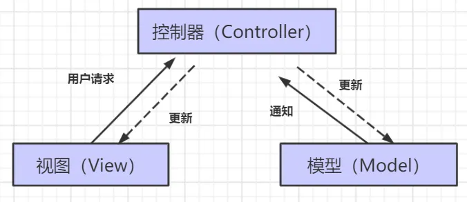
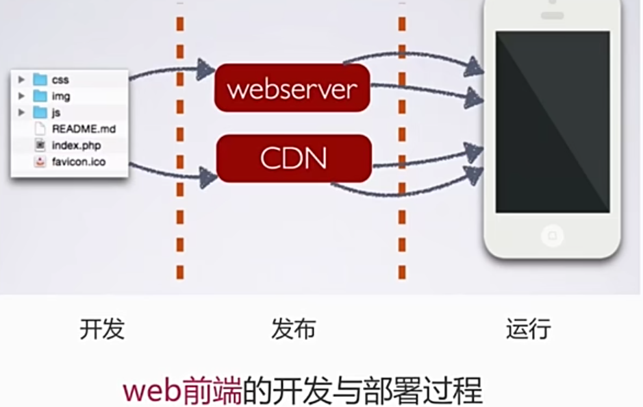
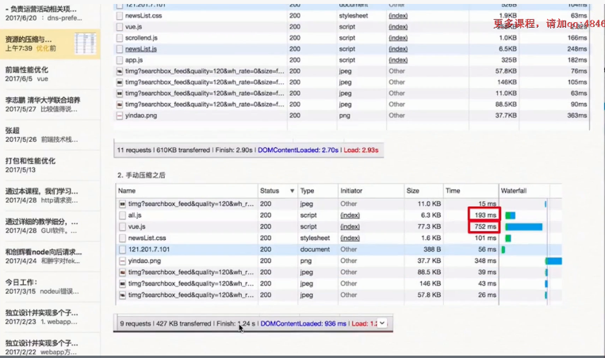
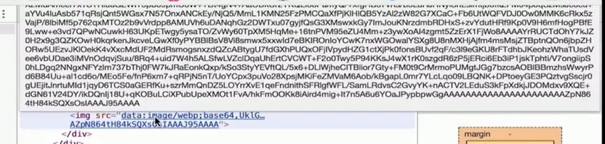
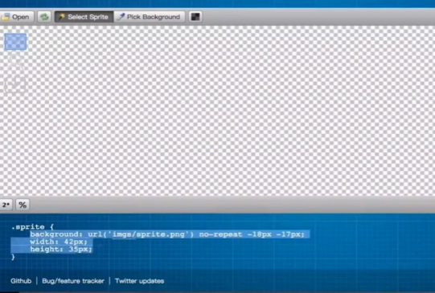

### 项目开发流程

> 需求分析、技术选型、系统设计、开发编码、调试测试、部署上线、运营推广等

1. #### 需求分析

   - 当我遇到某个问题、想到某个需求时，会 **第一时间把它记录下来** ，但不是立刻就去做这个项目了。

     记录的需求多了后，有时我会发现需求之间是可以有联系的，这个时候，我才会考虑是不是能把这些需求汇聚成一个新项目。还要再评估下时间和竞品：来不及、性价比不高、卷不过同行就不做。

   - 举个例子：我之前背面试题的时候发现很多题目的题解是有问题的， 但是没有人去讨论和维护，于是我就先把这点记录下来；之后又发现大家有阅读整套面试题的需求，可以有个组卷功能，才有了之后的面试鸭（https://www.mianshiya.com）。

   - 养成随时记录的习惯，自然酝酿出项目灵感，而不是等要做项目的时候再去硬想、硬分析，你会发现整个过程不仅轻松、而且最后做出来的项目会更实用、性价比更高。（我们做视频、写文章也是一样的）

2. 技术选型

   > 企业中的大项目，技术选型阶段要格外谨慎，不建议选择冷门、无人维护、无人熟悉的技术。但对于我们个人来说，不用考虑那么多，一般做项目时选择自己最熟悉的技术框架即可

   - 前端用什么？一般就是在 Vue 和 React 间抉择，然后统一使用 Ant Design 这种 **多框架兼容** 的组件库，而不是一个项目用一个新的组件库。
   - 后端用什么？一般是在 Java 和 Node 间抉择，小项目、侧重前端的项目用 Node（比如 yuindex：https://github.com/liyupi/yuindex），追求稳定性的大项目用 Java SpringBoot。
   - 怎么上线？一般前端用 Nginx、后端用 Docker
   - 尽量有一套自己用的最熟的技术栈，大多数项目都不用纠结技术选型。也别非得追求什么都用过，结果用的都不熟。

3. #### 系统设计

   - 关于系统设计，我觉得最重要的还是积累经验，很多需求和业务场景其实都是通用的（比如用户鉴权），只要你设计过一次，之后做类似的系统应该都是无压力。
   - 在做系统设计的过程中，建议大家绘制一些图来辅助理解，比如流程图、时序图、功能模块图等等，用在线绘图工具 draw.io 即可。

4. #### 开发

   > 当然，你也可以直接到 GitHub 上找一个开源项目去二改，比如知名的后台管理系统 Vue Admin Template。站在巨人的肩膀上，能帮助你大幅节省代码量和开发时间，屡试不爽。

   - 能不自己写的代码，就不要自己写
   - 自己写过的代码，绝对不重复写第二遍
   - 果是新项目，我会选择一个最符合我需求的脚手架来创建初始化项目模板，比如前端的 Ant Design Pro，什么布局、导航、路由、菜单、主题、整合组件、请求、测试、权限管理、国际化全都给你整合好了
   - 项目一定要有计划！
     - 今天做什么、明天做什么、每个功能花多少时间等，分清主次，先完成核心功能、再去完善细节。而不是功能还没开发完，就搁那纠结前端界面、什么字体大一号小一号的，到时候如果都上不了线，你觉得纠结这些事情还有意义么？

5. #### 测试

   - 单元测试到底是什么玩意？

6. #### 部署

   - 像我自己一般是使用 Vercel 免费的国外服务器来一键上线前端项目（还有个好处是不用备案）；用腾讯云托管之类的容器平台来快速发布用 Docker 打包的后端代码。或者就是用宝塔面板来可视化地运行 Node、PHP、Java 等项目，可比自己登上服务器，手动启动停止项目要方便多了。

     至于微服务项目嘛，也可以用同样的方式来部署，或者用 Docker Compose 来编排群起微服务。不过真正要上线一个产品，在没有用户的时候，我是不会选择用微服务的。

7. #### 运维

   - 一般我不会选择自己搭建运维监控管理平台，而是直接用现成的第三方服务。比如用百度统计、51.LA 来统计网站用户，用现成的第三方云数据库、云 Redis、容器托管平台来监控服务的运行、配置告警等等
   - 换句话说，想要真正做到快速，有现成的服务就用现成的吧，虽然会花一些额外的金钱投入，但是能省下来大量时间，性价比绝对是高的。对企业来说，时间就是金钱。


#### 实际工作步骤

1. 根据需求设计前端界面
2. 设计接口文档
3. 建立数据库表、搭建基本环境
4. 前后端分离开发
5. 联调
6. 上线


### 概念

#### 同步|异步

- 同步 sync：按顺序执行，前面的内容执行结束后，才会执行后面的部分
  - 例：js代码阻塞运行
- 异步：不需要等待某一部分执行，可以同时执行
  - 例：有回调函数(事件、定时器)、Ajax


#### 框架与库

- 框架(framework)：

  > 框架规定了自己的编程方式，是一套完整的解决方案，
  >
  > 大部分的逻辑在框架内部已经被确定，
  >
  > 使用时：需要根据规则填充自己的内容，具有一定的限制，但很强大（类似完形填空）

  - 例子：Vue.js

- 库(Library)：

  > 提供了一系列方法的集合，可以调用方法且程序逻辑由自己掌握，而并不是在库中定好的。
  >
  > 本质：一些函数的集合，每次调用函数实现一个特定的功能，只是一个工具
  >
  > 使用时：更自由，可以随意调用或不调用

  - 例子：jQuery


#### MVC与MVVM

- MVC：

  > 在传统的非前后端分离项目中，后端需要处理大量的内容，如果不按照一定的模式就是"大乱炖"
  >
  > 模型 M－视图(用户界面) V - 控制器 C

  - C即controller控制器：接受用户的输入并调用模型和视图去完成用户的需求，控制器本身不输出任何东西和做任何处理。它只是接收请求并决定调用哪个模型构件去处理请求，然后再确定用哪个视图来显示返回的数据。
  - V即View视图：指用户看到并与之交互的界面。比如由html元素组成的网页界面，或者软件的客户端界面。MVC的好处之一在于它能为应用程序处理很多不同的视图。在视图中其实没有真正的处理发生，它只是作为一种输出数据并允许用户操作的方式。
  - M即model模型：指业务规则。在MVC的三个部件中，模型拥有最多的处理任务。被模型返回的数据是中立的，模型与数据格式无关，这样一个模型能为多个视图提供数据，由于应用于模型的代码只需写一次就可以被多个视图重用，所以减少了代码的重复性。

  


- MVVM

  > 由后端的MVC架构演化而来，传统的MVC并不符合前端的实际需求
  >
  > 划分代码职责：原本需要发数据、存数据、拼模板、渲染DOM...（大乱炖）
  >
  > - Model 模型：对应Vue  data中的数据
  > - View 视图：模板
  > - ViewModel  视图模型：vue实例对象， 是View与Model的结合

  - 优点：
    - 将视图 UI 和业务逻辑分开
    - **低耦合**。视图（View）可以独立于Model变化和修改，一个ViewModel可以绑定到不同的"View"上，当View变化的时候Model可以不变，当Model变化的时候View也可以不变。
    - **可重用性**。你可以把一些视图逻辑放在一个ViewModel里面，让很多view重用这段视图逻辑。
    - 实现数据的双向绑定：
      - 修改数据 M => 视图自动改变
      - 修改视图 V => 数据自动改变


#### 数据代理

- 概念：通过一个对象代理对另一个对象中属性的操作（读/写）

- ```js
  // vue2: 借助Object.defineProperty为对象追加属性
  let obj = { x:100 }
  let obj2 = { y:200 }
  
  //通过obj2中的x对obj中的x进行读写操作
  Object.defineProperty( obj2,'x'{
     get(){
         return obj.x
     },
     set(value){
         obj.x = value
     }
  })
  ```


#### 防抖节流

- 为了限制JS频繁的执行一段代码

- 例：scroll事件，只是轻微滚动一下滚动条就触发多次事件，由于过于频繁地DOM操作和资源加载，严重影响了网页性能，甚至会造成浏览器崩溃

- 此时：用 debounce（防抖）和 throttle（节流）的方式来减少调用频率，同时又不影响实际效果

- **防抖**：

  - 连续的多次触发，固定的时间间隔内，存在新的触发，就清除之前的重新记时，满足时间执行一次——**最新一次触发**（只保留 新事件）
  - 手段1：通过设置setTimeout定时器的方式延迟执行，当快速多次点击的时候，每一次都会重置定时器，只有你一段时间都不点击时定时器才能到达条件并执行事件函数。即如果触发事件后在 n 秒内又触发了事件，则会重新计算函数延执行时间。
  - 模拟一个表单提交的例子，多次快速点击提交后只会执行一次

- **节流（节流阀）**：

  - 连续的多次触发，每一段固定的时间间隔内，我们只去执行一次——**固定频率触发**（忽略新产生的同类事件）
  - 确保某个事件，在同一时间只能有一个
  - 如果已经存在，就保留原来的，不再触发

  - 与防抖最大的区别就是，无论事件触发多么频繁，都可以保证在规定时间内可以执行一次执行函数
  - 例：用户在滚动页面时，每隔一段时间发一次 ajax 请求，而不是在用户停下滚动页面操作时才去请求数据


#### 重排(回流)、重绘

> DOM性能 浏览器的性能大部分都是被这两个问题所消耗

- 重绘不一定需要回流（比如颜色的改变），回流必然导致重绘（比如改变网页位置）
- 重绘：元素中的背景、透明度、颜色发生变化后，浏览器针对某一元素进行单独的渲染
- 重排（回流/重构）：DOM位置、大小或结构、定位发生变化；导致浏览器重新渲染整个DOM树、非常耗性能
  - 添加、删除可见的dom
  - 元素的位置改变
  - 元素的尺寸改变(外边距、内边距、边框厚度、宽高、等几何属性)
  - 页面渲染初始化
  - 浏览器窗口尺寸改变
  - 获取某些属性：offsetTop、offsetLeft、 offsetWidth、offsetHeight、scrollTop、scrollLeft、scrollWidth、scrollHeight、clientTop、clientLeft、clientWidth、clientHeight、getComputedStyle() (currentStyle in IE)。在多次使用这些值时应进行缓存
- 优化：
  - 不要一条一条地修改 DOM 的样式，可以先定义好 css 的 class，然后修改 DOM 的 className
  - 不要把 DOM 结点的属性值放在一个循环里当成循环里的变量
  - 获取浏览器重排DOM节点的属性值，存储到变量中
  - 避免使用 table 布局，很小的改动会造成整个 table 的重新布局


#### 微任务/宏任务

> - JavaScript中分为同步任务和异步任务，而异步任务中又分为宏任务和微任务两种；先执行同步任务，再执行异步任务；
> - 微任务永远比宏任务先执行；同层级先微任务后宏任务的顺序
> - 在执行微任务过程中产生的新的微任务并不会推迟到下个宏任务中执行，而是在当前的宏任务中继续执行。

- 微任务：Promise相关任务,Mutation Observer等等
- 宏任务：定时器,用户交互事件等


#### SPA单页应用

> 单页面应用指：只有一个web页面的应用。

- 特点：浏览器一开始直接加载必须的HTML、CSS、JS，所有的操作都在这一个页面上完成，有JavaScript控制交互和局部刷新
- 优点：
  - 有利于前后端分离
  - 良好的用户体验，不刷新界面，显示更流畅
  - 减轻服务器压力，不需要频繁请求界面
- 缺点：
  - 初次加载比较耗时
  - 不利于SEO优化


内存泄露与内存溢出


#### 事件委托

- addEventListener 事件绑定第三个参数默认为 false **事件冒泡阶段**
- 优点：
  - 提高性能：每个函数都会占用内存空间，只添加一个事件处理程序，所占用的内存空间更少
  - 动态监听：使用委托可监听“未来”的元素


#### 原生事件机制

1. 到目前为止,一共出现多少种事件机制?
   1. 一共存在3种
   2. 事件捕获机制
   3. 事件冒泡机制
   4. 标准事件机制
2. 标准事件机制,一共分为几个阶段?
   1. 捕获阶段
      1. 从最外层的document元素开始向内逐层传递,触发**同类型**事件,直到找到目标元素为止
   2. 目标阶段
      1. 捕获阶段结束之后,将目标元素身上所有的**同类型**事件全部触发
   3. 冒泡阶段
      1. 目标阶段结束之后,从目标元素开始向外逐层传递,触发**同类型**事件,直到最外层document元素为止
3. 如何绑定事件监听?
   1. 举例:现在需要给div节点,绑定click事件监听
   2. div.onclick=function(){}
      1. 本质:是对div对象的onclick属性进行赋值
      2. 该方法对于每个节点的每个事件,都只能绑定一个回调函数,后绑定的会覆盖之前绑定的
      3. 该方法只能绑定冒泡事件
   3. div.addEventListener('click',function(){})
      1. 本质:是调用div对象身上的addEventListener方法,并传入事件回调函数
      2. 该方法对于每个节点的每个事件,都可以绑定多个回调函数
      3. 第三个实参:
         1. 数据类型:
            1. 布尔值
               1. true->将当前事件存放于捕获阶段触发
               2. false->将当前事件存放于冒泡阶段触发
            2. 对象
               1. capture属性
                  1. true->将当前事件存放于捕获阶段触发
                  2. false->将当前事件存放于冒泡阶段触发
               2. passive属性
                  1. 前言:部分浏览器存在调用event.preventDefault()方法默认无效的情况
                  2. true->事件回调函数中的event.preventDefault()方法**生效**
                  3. false->事件回调函数中的event.preventDefault()方法**不生效**
   4. 如何阻止事件冒泡?
      1. event.stopPropagation();
      2. event.cancelBubble=true;
      3. 扩展:如何阻止事件捕获?
         1. event.stopPropagation方法在冒泡阶段事件中使用,就是阻止冒泡,捕获阶段事件中使用就是阻止捕获
   5. 问题:请问我们绑定的是事件还是事件的回调函数?
      1. 简单说法:给div绑定click事件
      2. 完整说法:给div绑定click事件的回调函数
      3. 绑定的是事件的回调函数,不是事件,每个标签具有什么事件都是由W3C规范制定的,不是我们绑定的


### 常识

#### 端口

- 端口范围：0~65535
- 知名端口：0~1024
- 常见端口：80、Mysql3306、mongodb27017


#### 加密

- md5加密
- [JSEncrypt 加密解密 ](https://blog.csdn.net/weixin_40974684/article/details/116299191)


### 技巧

#### 变量命名管理

> 便于项目管理的同时避免编码时写错单词

- 创建 constant.js文件
- const定义变量并导出 `export const INCREMENT = 'increment'`
  - 当需要更换变量名时，只需修改一处
- 使用时导入需要的变量即可 `import {INCREMENT} from './constant'`


#### 获取ip地址

##### 前端js

```js
 // 获取用户ip地址 借助搜狐接口
let loginIp=''
const script = document.createElement("script")
script.src = "https://pv.sohu.com/cityjson?ie=utf-8"
script.async = true
document.body.appendChild(script)
script.onload = () => loginIp = window.returnCitySN["cip"];
// {"cip": "211.142.190.47", "cid": "410000", "cname": "河南省"};
// loginIp 为ip地址
```

##### 后端node

```js
// 获取客户端ip地址
app.get('/ip', function (req, res) {
  var clientIp = getIp(req)
  console.log('客户端ip',clientIp)
  res.json({'youIp':clientIp});
})
//通过req的hearers来获取客户端ip
var getIp = function(req) {
  var ip = req.headers['x-real-ip'] || req.headers['x-forwarded-for'] || req.connection.remoteAddres || req.socket.remoteAddress || '';
  if(ip.split(',').length>0){
    ip = ip.split(',')[0];
  }
  return ip;
};
```


#### 下载文件（请求时携带token）

> 使用 msSaveBlob或 msSaveOrOpenBlob   可能存在兼容性问题

```js
// 因为存在兼容问题，使用前建议判断一下
 if (window.navigator.msSaveOrOpenBlob) {
    navigator.msSaveBlob(blob, filename);
  } else {
 	// 使用a标签的下载功能。。。
  }
// 创建内容
var blobObject = new Blob(["I scream. You scream. We all scream for ice cream."]);
// 1.msSaveBlob：只提供一个保存按钮
window.navigator.msSaveBlob(blobObject, 'msSaveBlob_testFile.txt');
// 2.msSaveOrOpenBlob：提供保存和打开按钮
window.navigator.msSaveOrOpenBlob(blobObject,'msSaveBlobOrOpenBlob_testFile.txt');
```


> 下载文件使用a标签的 download 属性，但a标签无法设置请求头、请求参数

- [使用a标签下载文件时要设置请求头如带上用于鉴权的token - 简书 (jianshu.com)](https://www.jianshu.com/p/f087cdf57846)

- `<a href="文件路径" download="filename">`

  - 注：如果遇到下载 txt、jpg 等文件时出现直接打开文件而不是下载文件的情况时，可以在下载地址即 url 后拼接 `?response-content-type=application/octet-stream` 即可

- objectURL = URL.createObjectURL(fileObject)   获取当前文件的一个内存URL,同步执行

  - 参数：用于创建 URL 的 File 对象、Blob 对象或者 MediaSource 对象。

- URL.revokeObjectURL(objectURL)      释放他们  

  - 浏览器在 document 卸载的时候，会自动释放它们，但是为了获得最佳性能和内存使用状况，你应该在安全的时机主动释放

- 

- ```js
  // 解决思路：
  // 1.使用xhr 发起请求，得到文件数据
  // 2.利用URL.createObjectURL() 将xhr获取的临时文件生成 本地临时地址
  // 3.使用a标签下载本地临时地址的文件 √
  this.getBlob(fileUrl || file.thumbUrl).then(blob => {
     this.saveAs(blob, file.name);
   });
  
  /** 获取 blob    url 目标文件地址  */
  getBlob(url) {
    return new Promise(resolve => {
      const xhr = new XMLHttpRequest();
      xhr.open("GET", url, true);
      xhr.setRequestHeader("token",sessionStorage.getItem('token'));
      xhr.responseType = "blob";
      xhr.onload = () => {
        if (xhr.status === 200) {
          resolve(xhr.response);
        }
      };
      xhr.send();
    });
  },
      
  /** 保存 blob
   * filename 想要保存的文件名称   */
  saveAs(blob, filename) {
    if (window.navigator.msSaveOrOpenBlob) {
      navigator.msSaveBlob(blob, filename);
    } else {
      const link = document.createElement("a");
      const body = document.querySelector("body");
      link.href = window.URL.createObjectURL(blob);
      link.download = filename;
      // fix Firefox
      link.style.display = "none";
      body.appendChild(link);
      link.click();
      body.removeChild(link);
      window.URL.revokeObjectURL(link.href);
    }
  },
      
  // 用fetch发送请求 对请求回来的二进制文件流进行处理
  fetch('/upload/user.png').then((res) => {
    res.blob().then((blob) => {
      const blobUrl = window.URL.createObjectURL(blob);
      // 这里的文件名根据实际情况从响应头或者url里获取
      const filename = 'user.txt';
      const a = document.createElement('a');
      a.href = blobUrl;
      a.download = filename;
      a.click();
      window.URL.revokeObjectURL(blobUrl);
    });
  });
  
  ```

  


### 设计模式

- 定义：在面向对象软件设计过程中针对特定问题的简洁而优雅的解决方案
- 作用：在于可复用性、可维护性。
- 原则：找出程序中变化的部分，并将变化封装起来。
  - 设计模式会增加代码量，容易将逻辑混论
  - 但软件的开发成本，不仅在开发阶段，也在后期维护阶段，采用好的设计模式，有利于降低维护成本
- 设计模式分为两部分：
  - 可变：
  - 不可变：将可变的部分封装后，剩下的就是不变和稳定的部分
- 设计模式的误解：
  - 设计模式的滥用，导致不该使用的地方使用，适得其反
  - 模式应该用在正确的地方
- 关注模式的意图而不是结构，模式只用放在具体的环境才有意义


#### 误解

- 不同语言的语法特性是不一样的，准确的说，最初的 23 种设计模式是针对 cpp、java 等静态类型、传统面向对象编程语言设计的，而在 JS 中有些模式可能已 经不再需要，而有些模式的实现会有变化。比如有些人为了实现 JS 版的工厂模式，生硬的将创建对象的步骤延迟到子类中，**实际上在静态类 型语言中让子类来“决定”创建对象的原因是为了迎合“依赖倒置”原则，解开对象类型的耦合，让对象表现出多态性，而在 JS 这种动态类型语言中，多态是天生的， JS 不存在类型耦合，不需要将对象延迟到子类中创建，所以 JS 其实是不需要工厂模式的**。

  ​    应用设计模式是为了解决问题，像上述这种牵强的应用只会让人觉得设计模式既难懂又没什么用，影响设计模式在 JS 中的发展。

  

  **模式的发展**

  ​    设计模式在 1995 年最初被提出时有 23 种，但它不应该被局限于这 23 种，从它被发明到现在这些年也许已经有更多的模式被发现并总结了出来，比如有些 JS 书籍会提到模块模式、沙箱模式，这些模式能否经受住时间考验还有待验证，但**设计模式是在发展的，不仅限于最初的 23 种**。


#### 行为型模式

> 行为型设计模式通常用来解耦

它是对在不同的对象之间`划分责任`和`算法`的抽象化，行为型模式不仅仅关注类和对象的结构，而且重点关注它们之间的相互作用；行为型模式一共有以下11种

- 模板方法模式（Template Method）
- 策略模式（Strategy）
- 命令模式（Command）
- 中介者模式（Mediator）
- 观察者模式（Observer）
- 迭代器模式（Iteratior）
- 访问者模式（Visiter）
- 责任链模式（Chain of Responsibility）
- 备忘录模式（Memento）
- 状态模式（State）
- 解释器模式（Interpreter）


##### 策略模式

> 针对一组算法，将每一个算法封装到具有共同接口的独立的类中，使得它们可以互换。


##### 观察者模式

> 定义：观察者模式定义了对象间的一种`一对多`的依赖关系，当一个对象的状态发生改变时，所有依赖于它的对象都将得到通知，并自动更新。观察者模式属于行为型模式。

- 理解：一个目标对象对应多个观察者，当目标对象发生改变时，就通知所由的观察者

- 步骤

  - 在目标对象中维护了一个观察者的数组，新增时将观察者向数组中push；
  - 然后通过notify通知所有的观察者；
  - 每个观察者只有一个update函数，用来接收观察者更新后的一个回调；

- 观察者模式把观察者对象维护在目标对象中的，需要发布消息时直接发消息给观察者。在观察者模式中，目标对象本身是知道观察者存在的

- ```js
  // 定义一个目标对象
  class Subject {
    constructor() {
      this.Observers = [];
    }
    add(observer) {
      //添加
      this.Observers.push(observer);
    }
    remove(observer) {
      //移除
      this.Observers.filter((item) => item === observer);
    }
    notify() {
      //通知所有观察者
      this.Observers.forEach((item) => {
        item.update();
      });
    }
  }
  //定义观察者对象
  class Observer {
    constructor(name) {
      this.name = name;
    }
    update() {
      console.log(`my name is:${this.name}`);
    }
  }
  
  let sub = new Subject();
  let obs1 = new Observer("observer11");
  let obs2 = new Observer("observer22");
  sub.add(obs1);  // 添加到观察者队列
  sub.add(obs2);
  sub.notify();   // 触发所有的观察者
  ```

  

#### 设计模式

##### 订阅发布模式

> 发布订阅模式是基于一个事件（主题）通道，希望接收通知的对象`Subscriber`通过自定义事件订阅主题，被激活事件的对象`Publisher`通过发布主题事件的方式通知各个订阅该主题的`Subscriber`对象。

- 与观察者模式的不同：增加了第三方即`事件中心`；目标对象状态的改变并非直接通知观察者，而是通过第三方的事件中心来派发通知。
- 订阅者订阅主题，发布者推送某个主题时，订阅该主题的所有读者都会被通知到；避免了观察者模式无法进行过滤筛选的缺陷。
- 而发布/订阅模式中，发布者并不维护订阅者，也不知道订阅者的存在，所以也不会直接通知订阅者，而是通知调度中心，由调度中心`(公用的对象实例)`通知订阅者。
- 例：
  - Vue2中的模板语法，实现数据与界面的双向绑定，数据与页面相互更新

##### 单例模式

> 单例就是保证一个类只有一个实例，并提供一个访问它的全局访问点

- 实现方法
  - 一般是先判断实例存在与否，如果存在直接返回，
  - 如果不存在就创建了再返回，这就确保了一个类只有一个实例对象。
  - 在JavaScript里，单例作为一个命名空间提供者，从全局命名空间里提供一个唯一的访问点来访问该对象
- 使用场景
  - 团队开发中，可能会产生命名冲突，这时候单例模式就能很好的解决这个问题。
  - 全局模态框，同一时间只允许弹出一个模态框，内容可以不一样，但都是同一个框，elementUI


##### 代理模式

> 为一个对象提供一个代用品或者占位符，以便控制对它的访问

- 常用虚拟代理形式：某一个花销很大的操作，可以使用虚拟代理的方式延迟到需要它的时候再去创建它，（虚拟代理实现图片懒加载）
- 图片懒加载方式，使用loading图占位，然后通过异步的方式加载图片，等图片记载好了再替换掉


##### 中介者模式

- 通过抽离配置项，进行代码的控制，实现各个事件的解耦，仅仅维护好中介者就行了

##### 装饰器模式

- 不改变原对象的基础上，在程序运行时给对象动态的添加方法。


### 前端性能优化


#### 网页加载过程

- web前端的开发与部署过程
  - 用户使用浏览器，借助网址向服务器获取【动态的、增量式】的静态资源


- 用户输入url ，浏览器解析后发送到DNS服务器，查询ip地址【DNS缓存，降低dns查询的时间？】

- 借助基础网络，传输到对应的服务器【使用CDN请求静态资源，解决网络缓存、线路选择等问题，但默认携带的cookie是一种浪费，不同的cdn域名可以解决；但cdn无法作为接口】

- 服务器接收到请求后，进行请求的分发处理Contorller

  - Model层，进行数据交互，读取数据库，获取数据
  - 最后将渲染好的页面通过View，返会给网络--浏览器

- 浏览器接受数据【 减少http请求的次数和大小？】

  - rander过程，浏览器将服务器返回的数据(html/css/js...)进行渲染【服务器端渲染？】

  - 浏览器生成DOM和BOM树，在进行css渲染，然后再去执行js相关的代码【渲染过程的优化？】


#### 资源的合并与压缩

**作用点：借助文件的合并减少http请求次数；借助文件压缩，减少请求文件的大小**

##### html压缩

- 压缩在文本文件中有意义，但在HTML中不显示的字符，包括空格、制表符、换行符等，还有一些其他意义的字符，如：HTML注释也可以被压缩
- HTML压缩的效果不是很明显，但对于大量用户访问的网页来说，每kb的流量都不容忽视

##### html压缩方式

- 使用网站在线压缩，适合初学者（但一般不用，使用webpack...）
- node.js 提供了 `html-minifier`工具（可以进行很多的配置，具有可扩展性）
- 后端模板引擎渲染压缩（会增加服务端的计算量）

##### css压缩

- 使用在线网站进行压缩
- 使用`html-minifier`库对html中的css进行压缩
- 使用`clean-css`库对css进行压缩

##### js压缩与混乱

- 作用：无效字符的删除、剔除注释、代码语义的缩减和优化、代码保护(降低可读性)
- 方法：
  - 使用网站在线压缩
  - 使用`html-minifier`配置，对js进行压缩
  - 使用`uglifyjs2`对js进行压缩【】

##### 文件合并

- 不合并存在的问题

  - 文件与文件之间有插入的上行请求，增加了N-1个网络延迟

  - 受丢包影响更为严重

  - 经过代理服务器时可能会被断开

  - 
- 合并后的问题

  - 首屏渲染问题，合并后文件变大，首屏渲染可能减慢，需要适当分开
  - 缓存失效问题，任一文件的改动，会导致文件缓存大面积失效的问题
- 文件合并的建议

  - 公共库合并，对长期不经常改动的内合并
  - 不同页面的合并，对于单页应用，只加载当前页面，分别打包。
  - 见机行事，随机应变。
- 文件合并方法

  - 使用在线网站进行
  - 使用node.js实现文件合并，多种多样的库，自行挑选


#### 操作流程

##### 在线压缩工具

- 有一定的限制，可能不支持部分文件格式的压缩
- 分别手动对原生代码进行压缩
- 在js压缩过程中，需要手动根据依赖关系压缩后再合并
- 

##### 构建工具的优点

- 对于大量的文件可以进行高效快速的构建
- 具有良好的可扩展性
- 可根据配置进行定制化的设置

##### webpack构建工具(使用再学习)

##### fis3构建工具(使用再学习)

- 流程：
  - 单文件编译过程，形成完整的结构
  - 打包，依据源文件的内容，进行压缩和混乱


#### 图片相关优化

**使用参考：文件大小、色彩的丰富度  根据不同场景进行选择**

##### 类型分类

###### JPG图片- 有损压缩

- 情景：大部分**不需要透明图片**的业务场景
- 原始的数据与实际jpg压缩后的数据是不同的
- 但大多数jpg压缩并不影响肉眼观察
- 可能不支持透明，但实际使用大都可以透明

###### png8/png24/png32

- 情景：大部分需要**透明图片**的业务场景
- png8：256色+支持透明，
  - 内部其实是一个颜色的索引表，每个颜色就是2^8的索引值，因此会小很多
  - 适用于颜色变化不特别丰富的图片
  - 缺点：支持的颜色比较少，不适合颜色丰富且相近的图片
- png24：2^24色+不支持透明
  - 每一个索引值是png8的三倍
- png32：2^24色+支持透明
  - 相比于png24，增加了8位，用于支持透明

###### webp压缩程度更好，再ios和webview有兼容性问题

- 压缩程度更好，建议安卓全部使用

###### svg矢量图，代码内嵌，相对较小，图片样式相对简单的场景

- 情景：图片样式相对简单的业务场景
- 例如 icon库，或者其他库....

###### gif 支持动画


##### 图片压缩

本质：针对图片真实情况，舍弃一些相对无关紧要的色彩信息

###### css雪碧图

- 把网站的一些图片合并到一张图片，减少网站的HTTP请求数量
- 缺点：当图片文件较大时，可能导致图片的显示存在延迟的问题
- 一般使用在PC端，对性能要求较高
- 需要手动将图片合并，一定的ps基础

###### Image inline

- 将图片的内容内嵌到html中，减少网站的http请求数量
- 适合大小较小的图片，建议8kb以下做inline image使用
- 特点：导致页面文件变大，但减少了一次http请求
- 

###### svg矢量图

- 使用svg标签进行矢量图的绘制
- 使用iconfont解决icon问题
- 优点：速度和大小都会有很好的优化
- 学习：w3c

###### webp

- 优势：具有更优的图像数据压缩算法，能带来更小的体积，拥有无差别的图像质量
- 具备无损和有损的压缩模式、Alpha透明、动画特性
- 再PNG和JPEG上的转哈效果都非常优秀、稳定和统一

##### 转换方法

###### 格式转换

- [TinyPNG – Compress WebP, PNG and JPEG images intelligently](https://tinypng.com/)
- [智图_图片压缩在线工具_在线制作webp (isux.us)](https://zhitu.isux.us/)
- [Sprite Cow 雪碧图制作 - Generate CSS for sprite sheets](http://www.spritecow.com/)
- [SVG 教程 (w3school.com.cn)](https://www.w3school.com.cn/svg/index.asp)
- 图片格式的降级：兼容性服务，如果不支持更好的webp格式，自动转化为jpg格式(淘宝网)
- 转换方法
  - 手动更改转换
  - 使用webpack 或者 fis3 等其他自动化工具，进行插件配置还能控制压缩率
  - 后端服务自动转换




#### css和js的装载与执行

- 学习目标：
  1. 理解浏览器端 html、css、js的加载过程
  2. 结合 chrome 的能力学习掌握加载过程中的优化点
- 渲染的过程
  1. 拿到html文件后渲染为DOM树
     - HTML渲染特点
     - 词法分析，由上至下顺序执行生成DOM，
     - 多种资源的加载是并发进行加载的(受浏览器对单个域名并发请求限制)，因此一个网站常使用多个cdn服务
     - 是否阻塞：css加载阻塞js加载？js加载阻塞js执行？
       - css 在head中阻塞页面的渲染，当css加载完再渲染html(推荐)
       - css阻塞js的执行，因为js的执行可能操作css的内容
       - css不阻塞外部脚本的加载，并发加载
       - 直接引入的js阻塞页面的渲染，存在js操作dom时，影响dom加载
       - js不阻塞资源的加载（有一个预先扫描器，不执行先加载）
       - js顺序执行，阻塞后续js逻辑的执行
     - 依赖关系：css资源加载过慢时，出现屏闪问题(等完全渲染完后再显示)
     - 引入方式：
       - css：link 和 @import
       - js：script 和 路由动态引入 和 和 
  2. 再根据css样式生成CSSOM树
  3. 将两者合并渲染为页面


#### CSS

- 使用`translate3d`而不是`translate`手动开启GPU渲染引擎


#### JS

- 尽可能避免污染全局变量，全局声明的变量不会被垃圾回收机制回收
- 局部变量在代码调用结束之后，就会释放对应的内存空间，提高代码性能


#### 总结-优化点

1. 减少HTTP请求数量

   - 多域名 不超过6个，有的会根据域名进行限制，同一域名同一时刻会限制请求数量
   - 合并代码，使用雪碧图、精灵图或canvas、svg等方式将图片转为代码
   - 使用更合理的代码逻辑，防抖节流等减少请求

2. 压缩请求数据的大小，减少每次请求的代码量

   - 一般借助打包工具，对代码、图片进行压缩
   - 代码逻辑中去除重复的  脚本/代码 引用

3. 较少cookie体积，会在每次请求中携带，影响请求的速度

4. 延迟加载非必要的引用脚本 - 当前太慢，砍当前

   - 均摊第一次加载时的任务量，提升体验

5. 预加载可能需要的内容 - 当前太慢，牺牲上次

   - 在上次加载中 提前加载本次需要的内容

6. 减少DOM元素的层级

7. 减少css代码中，标签嵌套的层级

8. 减少DOM的访问次数，较少DOM的重构(回流)，和不必要的重绘

9. 使用特别的属性，opacity、transform、

   > 这些属性能够在不同的层，进行单独绘制，不会导致页面重绘
   >
   > 间接使用设备GPU硬件渲染，提升效率

10. 合理利用HTTP缓存，浏览器缓存，利用静态资源

    - 本地缓存、避免重复加载


##### 网页加载阶段分析

1. 网页资源请求与加载阶段 ( DevTools查看请求各阶段耗时)

   - 浏览器对每个源允许的TCP连接数量限制

     > 现状：Chrome基于 `http`只允许6个TCP同一时刻连接同一源
     >
     > 方案：
     >
     > - 将多个资源分布在不同的子域名上，减少请求队列的等待时间；
     > - 但不同的域，需要不同的DNS域名解析过程（通常划分为 3-5 个域名比较合适）
     > - DNS解析记录会在浏览器中进行缓存，因此推荐使用 `公共CDN托管`

2. 网页渲染阶段( DevTools查看网页渲染各部分耗时`Paining\Rendering`)

   - 获取HTML生成DOM树，同时下载css、js文件

   - 将CSS解析为`CSSOM 层叠样式表模型`

     > 过于复杂的css嵌套规则会影响CSSOM的生成，导致渲染时间延长

   - JS引擎处理JS

     > 如果在页面渲染时，使用JS操作DOM，则会阻塞渲染
     >
     > 推荐方案：将Js代码放在页面代码底部      `</body>`前

   - 将DOM和CSSOM 构建成为`渲染树`，生成用户界面


### 云服务器使用：

- 在终端中输入连接命令`ssh root@111.67.199.222`  （公网ip）
- 使用 linux命令 / vim命令 操作系统

#### 宝塔面板

- 安装：`yum install -y wget && wget -O install.sh http://download.bt.cn/install/install_6.0.sh && sh install.sh`

- 查看公网登录地址 `bt default`
  - 外网面板地址: http://8.142.208.202:8888/a3e99629
    内网面板地址: http://172.18.218.46:8888/a3e99629

#### ssh登录报错

- 原因：第一次SSH连接时，生成的认证储存在客户端（也就是用SSH连线其他电脑的那个，自己操作的那个）中的known_hosts，
- 但是如果服务器验证过了，认证资讯当然也会更改，服务器端与客户端不同时，就会跳出错误
- 因此，只要把电脑中的认证资讯删除，连线时重新生成，就一切完美啦～要删除很简单，
- 只要在客户端输入一个指令`ssh-keygen -R 服务器ip地址`

```sh
PS C:\Users\wzt> ssh root@8.142.208.202
@@@@@@@@@@@@@@@@@@@@@@@@@@@@@@@@@@@@@@@@@@@@@@@@@@@@@@@@@@@
@    WARNING: REMOTE HOST IDENTIFICATION HAS CHANGED!     @
@@@@@@@@@@@@@@@@@@@@@@@@@@@@@@@@@@@@@@@@@@@@@@@@@@@@@@@@@@@
IT IS POSSIBLE THAT SOMEONE IS DOING SOMETHING NASTY!
Someone could be eavesdropping on you right now (man-in-the-middle attack)!
It is also possible that a host key has just been changed.
The fingerprint for the ED25519 key sent by the remote host is
SHA256:/y9BDVH04wKb/ouMYigQuyAuyn5yCnxLAQ/S6xMpTB8.
Please contact your system administrator.
Add correct host key in C:\\Users\\wzt/.ssh/known_hosts to get rid of this message.
Offending ECDSA key in C:\\Users\\wzt/.ssh/known_hosts:3
Host key for 8.142.208.202 has changed and you have requested strict checking.
Host key verification failed.
```


#### 开放服务器端口

- 配置安全组规则，打开对应端口，否则无法使用
  - 远程连接实例所需的22、3389端口在创建安全组时默认为开启状态
  - 您需要确认安全组的入方向已开放这些端口。如果未开放，请手动配置
- mysql 数据库端口：3306


#### 断开ssh连接后继续运行程序

- 使用screen运行
  - 安装命令执行任务 CentOS`yum install screen`
  - 创建screen窗口        `screen -S name`       //name用于标注screen窗口的用途,自由命名
  - 执行 screen -S name 之后系统会跳进一个新窗口，我们创建的新进程来执行
  - 在这里面启动程序即可
  - 离开screen窗口并保留程序在后台运行 `ctrl + a + d`
  - 查看screen进程          `screen -ls`
  - 进入进程     
    - 仅有一个进程时：   `screen  -r -d`
    - 当有多个进程：        `screen  -r -d pid`   //pid是进程的编号
  - 在窗口中`ctrl + a`再按下 d 键，就可以退出ssh登录，实现后台运行！
  - 删除进程`screen -S PID -X quit`   //PID是进程号
- 使用nohup执行
- 使用管理终端执行


#### 本地与服务器的文件传输

- linux的根目录  `/`
- 管理员用户的位置   `/root`   相当于`~`


##### 使用scp命令

- 需要提供服务服务器的开机密码

###### 本机--服务器

- 把本机的文件传给目标服务器
  - `scp 本机文件路径 root@192.168.1.147:服务器目标路径`        //ip地址为目标服务器地址
- 把本机的文件夹传给目标服务器
  - `scp -r 本机文件夹路径 root@192.168.1.145:服务器目标路径`

###### 服务器---本机

- 把远端服务器文件拷贝到本地
- `scp root@192.168.1.147:服务器的文件路径  本地文件存放路径`    //ip地址为目标服务器地址    


#### 当前状态

- 配置`node.js`环境 

  - 使用二进制文件安装。
  - 下载文件`wget https://nodejs.org/dist/v6.9.5/node-v6.9.5-linux-x64.tar.xz`
  - 解压之后，在bin文件夹中就已存在node和npm，无需重复编译。
  - 解压文件`tar xvf node-v6.9.5-linux-x64.tar.xz`
  - 创建软链接，您就可以在任意目录下直接使用node和npm命令。
  - `ln -s /root/node-v6.9.5-linux-x64/bin/node /usr/local/bin/node
    ln -s /root/node-v6.9.5-linux-x64/bin/npm /usr/local/bin/npm`

- 安装git工具

  - `yum -y install git` 安装git

- 安装mysql

  - 具体步骤看阿里云服务器官网

- 安装MongoDB数据库（教程：[Linux系统安装MongoDB数据库](https://blog.csdn.net/cnds123321/article/details/121596298)）

  - 从官网下载安装包 并上传到服务器
  - `tar -zxvf mongodb-linux-x86_64-rhel70-5.0.4.tgz`对压缩包进行解压
  - 将解压后的文件移动到指定目录下`mv mongodb-linux-x86_64-rhel70-5.0.4 /usr/local/mongodb5`
  - MongoDB 的可执行文件位于 bin 目录下，所以可以将其添加到 环境变量**PATH**路径中：`export PATH=/usr/local/mongodb5/bin:$PATH`，其中`/usr/local/mongodb5/bin`表示mongodb可执行文件的绝对路径。
  - 执行`mongo --version`命令查看mongodb版本如果成功表示配置成功。
  - 创建配置文件
    - 创建数据库文件夹，在mongodb的安装目录下创建`data/db`文件夹，这里`/usr/local/mongodb5`就是我系统上的安装目录。
    - 创建日志文件，在mongodb的安装目录下创建`logs`文件夹。
    - 创建配置文件夹，在mongodb的安装目录下创建`etc`文件。
    - 创建配置文件，在上一步创建的`etc`目录下使用`vi mongodb.conf`命令创建配置文件，并且写入如下内容

  ```sh
  # 数据存储路径
  dbpath=/usr/local/mongodb5/data/db
  # 日志文件路径
  logpath=/usr/local/mongodb5/logs/mongodb.log
  # 端口号
  port=27017
  fork=true
  journal=false
  storageEngine=wiredTiger
  ```

- 启动mongodb

  - cd到mongodb目录下的bin文件夹，执行如下命令：`./mongod --config /usr/local/mongodb5/etc/mongodb.conf`
  - 启动后，在任意目录下输入`mongo`命令就可以使用mongodb数据库了。

- 后续使用：参看《node.js入门教程》24页

- admin

  - 用户名：'root'   密码：'123456'   权限：root


#### HbuilderX网页打包原生app

- 新建web app 项目
- 进行配置
- 云打包
- over
