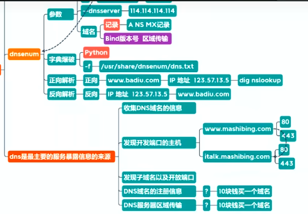
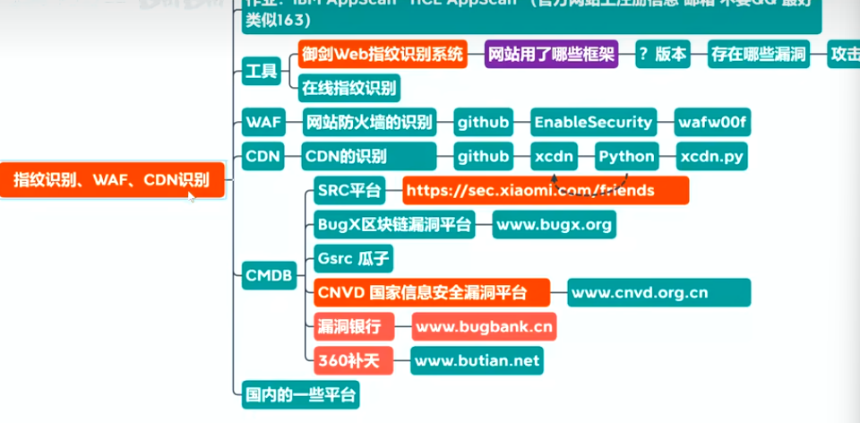

### 网络安全

#### 黑客守则

1. 不恶意的破坏任何系统，恶意破坏他人的软件和服务器将要承担法律责任
2. 不修改不删除任何系统文件，如果是为了进入而修改，应在进入后恢复原样或备份
3. 不要轻易的将Hack的站点或密码告诉他人
4. 不在任何网络或公开渠道谈论相关的事情
5. 不要使用真名
6. 设备未上锁时不要轻易离开，并放置在安全的地方
7. 不要入侵或攻击电信个政府机关的服务器（主机）
8. 不在电话中谈论任何关于黑客的事情
9. 多读有关系统安全和系统漏洞的资料（复现漏洞、修复漏洞）
10. 不会编程和运维的黑客不是好黑客

#### 常见web服务器

1. IIS：微软旗下的Windows Server
2. Apache：兼容 Windows、Linux、MacOs Server
   - LAMP  LAMT  LAMPN    LAMPT
   - L:Linux   A:Apache    M:Mysql   P:php    T:Tomcat
3. Nginx：兼容 Windows、Linux、MacOs Server
4. Tomcat：开源的，Java Web项目常用
5. WebLogic
6. WebSphere
7. JBoss：J2EE开源的应用服务器

#### 渗透流程

1. 踩点 `Kail / dig / dnsmap `：确定目标地址范围
2. 收集信息` ping / fping / nmap / AutoScan `（网站信息whois信息、天眼查、备案系统、子域名、SSL证书、开放端口、网站框架、敏感文件/目录）
3. 访问`meta / kail`：密码嗅探
4. 授权`meta / kail / python / 字典`：密码爆破
5. 窃取信息：xxx
6. 灭迹：清除日志、隐藏内容
7. 创建后门`VNC/开放端口`：xxx
8. 拒绝服务`死亡之ping`：DDos

##### 信息收集

1. 信息收集
   - 企业级操作：先用扫描器扫描
     - IBM：AppScan
     - HP：WebInspect
     - 启明星辰：天镜
     - 安恒：明鉴
     - 绿盟：WVSS/RSAS
     - 其他:Nmap
   - DNS域传送漏洞（域名探测过程）
   - 根据主域名、可获得二级、三级域名
     - 通过Kail内置的dnsenum
   - 网站备案信息，备案号查询
   - SSL状态查询
   - APP信息提取
     - 抓包工具
     - 安装APP反编译：有价值得公司域名、Ip地址、端口号等信息
   - 第三方网站：7kbScan、漏洞银行、360补天、github、钟馗之眼、微步在线
   - Kali系统环境
     - 
   - 

#### SQL注入

> web程序得三层架构：界面层+业务逻辑层+数据访问层
>
> SQL注入漏洞：发生在应用程序的数据库层上的安全漏洞。在设计不良的程序当中，忽略了对输入字符串中夹带的 SQL 指令的检查，那么这些夹带进去的指令就会被数据库误认为是正常的 SQL 指令而运行，从而使数据库受到攻击，可能导致数据被窃取、更改、删除，以及进一步导致网站被嵌入恶意代码、被植入后门程序等危害。

