计算机网络

### 一、计算机网络的基本概念

#### 1、网络分类（按地域规模）

- 个域网 PAN ( Personal Area Network )：覆盖范围一般在10米左右，如蓝牙耳机
- 局域网LAN ：局部地区形成的区域网络，如：企业网络、校园网络
- 城域网 MAN ：覆盖一个城市
- 广域网 WAN ：覆盖大范围地区甚至国家

#### 2、网络的网络

Internet 和 internet 的不同

##### ①、互联网 Internet

- 特指遵循 TCP/IP 标准、利用路由器将各种计算机网络互连起来形成、覆盖全球、特定的互联网。
- 使用 TCP/IP  协议、是一个专用名词

##### ②、互连网 internet

- 泛指由多个不同类型计算机网络互连形成的网络
- 可以使用 TCP/IP 之外的其他协议、是一个通用名词

#### 3、互联网的层级结构

一级供应商  主干 ISP：全球最高级别 ISP,互不结算（例如：中国联通、中国电信、美国Sprint、日本NTT.）

二级供应商  地区 ISP：需要向更高级别 ISP 交流量费（例如：教育网、**中国移动**）

#### 4、互联网的构成

##### ①、网络边缘

- 端系统：位于互联网边缘与互联网相连的计算机和其他设备

- 端系统有各类主机(host)构成：如：桌面计算机、服务器、移动计算机、其他物联网等设备

  

##### ②、网络核心

- 由互联网系统的分组交换设备和通信链路构成的网状网络。
  - 分组交换（链路层交换机、路由器）
  - 通信链路（光纤、铜缆、无线电、激光链路）

#### 5、接入网

- 接入网的目标是：将主机连接到边缘网络路由器上

- 边缘路由器是端系统Host去往其它远程端系统路径上的第一台路由器

- 有线网络接入技术：光纤入户FTTH、以太网、同轴电缆、双绞线的DSL、古老的拨号上网

- 无线网络技术：WIFI、4G/5G、卫星广域覆盖

- 我国普遍是 光纤入户；  美国80%依然使用曾经的 DSL和Cable

  

1. 光纤入户 FTTH ：猫 / 调制解调器
2. 数字用户线 DSL：**上下行速率 非对称：下载速度 一般大于  上传速度**
3. 同轴电缆  Cable ： 应用于有线电视，**上下行速率 非对称。**

### 二、计算机网络

#### ☆ 1、传输单位：比特(bit)

- 在发射机/接收机之间的物理媒介上传播数据的最小单位。
- 注意：1 B=8 b（注意大小写，1字节＝8比特）
  - 存储的单位字节( Byte )： K/M/G 层级为 2^10 进制
  - 传输的单位比特( Bit )： K/M/G 层级为 10^3 进制

#### 2、网络核心

目标：将海量的端系统互联起来。 

- 网络核心：由各类分组交换机（路由器）和链路，构成的网状网络。

- 包交换：
  - 主机将应用层消息分包，发送到网络
  - 网络将数据包从一个路由器转发到下一个路由器，通过从源到目标的历经上的链路，接逐跳传输抵达目的地。

#### 3、路由和转发

网络层的核心：路由与转发

##### ①、路由

- 全局操作：确定数据包从源到目标所使用的路径。
- 需要路由协议和路由算法，产生路由表。

##### ②、转发

- 本地操作：路由器或交换机将接收到的数据包转发出去（即移动到该设备的某个接口输出）
- 确定转发出去的接口/链路：根据从`入接口`收到的数据包的分组头目的地址，查找本地链路表，确定`出接口`

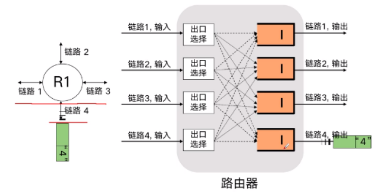

#### 4、典型交换方式的比较

##### ①、电路交换

- 电路交换需要建立连接，对预留资源难以实现灵活复用。
- 单独的建立线路，属于独占的，无法同时接入其他内容，无法在网络中使用

##### ②、报文交换

- 与分组交换类似，采用存储转发方式，但无法将应用的大报文拆分成多个分组
- 无法拆分大的报文，比较消耗资源。

##### ③、分组交换

**分组交换适合有大量突发数据传输需求的互联网。**

- 报文交换和分组交换较为灵活，在传送突发数据时可提高网络利用率。
- 由于分组长度小于报文长度，分组交换比报文交换的延时小，也具有更好的灵活性。

#### 5、网络协议

##### ☆  协议的三要素：

- 语法：规定传输数据的格式
- 语义：规定所要完成的功能
- 时序：规定各种操作的顺序

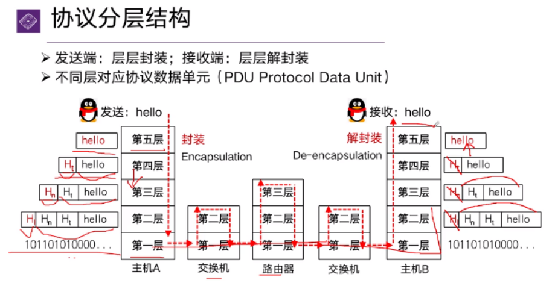

#### 6、参考模型

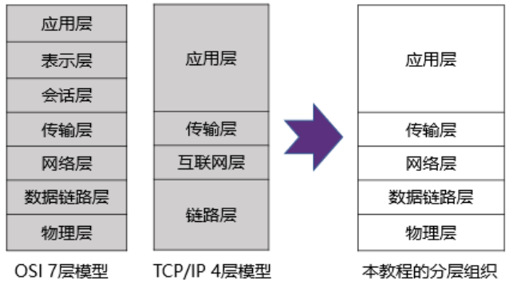

##### ☆ OSI 参考模型：七层

**下三层解决网络搭建的问题；上四层解决数据在计算机内部的问题。**

但因历史原因：通常采用TCP/IP协议

- **应用层**

  - 通过应用层协议，提供应用程序便捷的网络服务调用

    

- **表示层**

- **会话层**

- **传输层**

  - 将数据从源端口发送到目的端口（进程到进程）
  - 传输层的数据单元：报文

  

- **网络层**

  -  IP协议：IPv6 (128位) 海量地址空间
  - 将数据包跨越网络从源设备发送到目的设备（host to host）
  - 路由：实现从源端到目的端转发路径的高效选择；路由算法与协议。
  - 转发：处理网络拥塞、流量整形、保障延迟
  - 网络层的数据传输单位：分组

  

- **数据链路层**

  - 实现相邻网络实体间的数据传输

  - 当传输出错时，确定如何进行查错、纠错，如何要求重传、形成数据帧

  - 进行流量调节，避免"淹没"，当快速的发送端遇上慢速的接收端，接收端缓存溢出

  - 数据链路层的数据传输单位：帧(由若干个二进制组成)

    

- **物理层**
  - 定义如何在信道上传输0、1代码
  - 物理层的传输单位：比特 bit

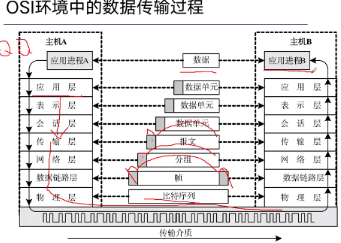

发送时：逐层增加信息；    接收后：核对信息后删除本层多余的信息。

##### ☆ TCP / IP参考模型：ARPANET所采用

**前三层与 OSI 参考模型基本一致。**

- 应用层

  - 传输层之上的所有高层协议：DNS、HTTP、FTP、SMTP...

- 传输层

  - 进行端到端的数据传输：TCP、UDP

- 互联网层

  - 允许主机将数据注入网络、让这些数据包独立的传输至目的地，并定义了数据包格式和协议

- 网络接口层

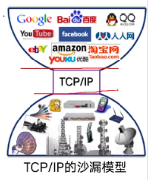

#### 7、网络安全

##### ①、恶意软件

- 病毒
  - 需要某种形式的用户交互进行传播
  - 例如：含有可执行文件的emali附件（打开后会给通讯录的所有用户再次发送）

- 蠕虫

  - 一种无须用户明显交即可运行和传播的独立程序
  - 通过不断扫描网络中存在漏洞的计算机，进行传播

- 蠕虫式的勒索病毒：利用系统漏洞入侵计算机并锁定文件进行勒索

##### ②、拒绝服务攻击（DoS）

- 入侵发起虚假流量的大量主机（产生僵尸主机或僵尸网络botnet）
- 从被入侵的僵尸主机向目标发送大量数据包，导致目标主机无法应对

*僵尸网络：采用一种或多种传播手段，将大量主机感染bot程序病毒。从而形成一对多的控制网络。*

##### ③、拖库、洗库、撞库

- 拖库：盗走用户数据
- 洗库：黑产用户数据变现
- 撞库：利用掌握的信息，在其他网站尝试。

#####  ④、数据可靠性

- 数据包嗅探
  - 广播传输（共享式以太网、无线网）
  - 混杂网络接口读取/记录所有数据包

- IP欺骗：攻击者产生伪造的IP数据包，再截取返回的服务器数据。

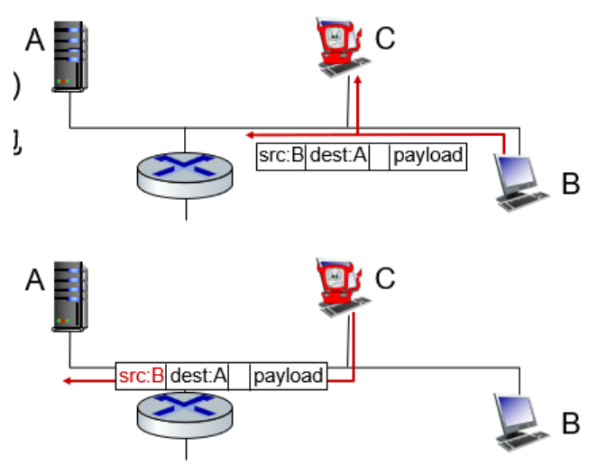

##### 如何防御？

- 身份验证、加密技术、完整性检查：数字签名检测/防止篡改、访问限制
- 防火墙：接入网络核心和核心网络的专用“安全卫士”

### 三、物理层(接口层)

*物理层：在传输介质中，如何把0、1表示出来*

- 是连接计算机的物理设备吗？   ×不是
- 是负责信号传输的具体物理媒体吗？ ×不是

**功能：**如何在连接计算机的传输媒体上传输数据/比特流

- 物理层将比特流按照传输媒体的需要进行编码
- 再将信号通或传输媒体传输到下一个物理层

**作用：**尽可能地屏蔽不同传输媒体和通信手段的差异、为数据链路提供统一地数据传输服务。

#### 信息和数据

数据分为：模拟数据、数字数据

- 模拟数据：在一段时间内具有连续的值。（声音 等）
- 数字数据：具有离散的值。（文本 等）
- 模拟信号和数字信号在传输过程中可以相互变换，即A/D和D/A。（猫 / 调制解调器 执行转换的过程）

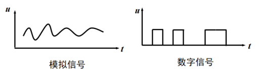

#### ☆ 传输方式

**1、通信线路采用不同的连接方式分类：**

- 点到点传输
- 广播传输

**2、按照数据信号在信道上的传送方向和时间的关系，传输方式分类：**

- 单工：指两个站点之间只能沿一个指定的方向传送数据信号（传呼机）
- 半双工：指两个站之间可以在两个方向上传送数据信号，但不能同时进行，又称“双向交替”模式，发/收之间的转向时间为20～50ms。（对讲机）
- 全双工：指两个站之间可以在两个方向上同时传送数据信号（电话）

**3、按照传输系统在传输数据信号过程中是否搬移频谱，传输方式可分两类：**

- 基带传输：传输数字信号（最简单最基本的传输方式，一般用低电平表示“0”，高电平表示“1”）
- 频带传输：传输模拟信号（指利用调制解调器搬移信号频谱的传输体制）

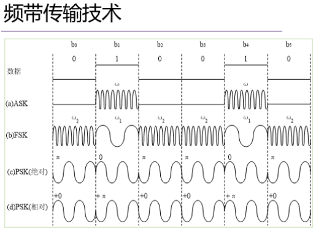

#### ☆  数据编码分类

- 曼彻斯特编码（将0、1编码转化为对应信号图）

  - 原理：从低跳到高表示“1”，从高跳到低表示“0”

    

- 差分曼彻斯特编码（将0、1编码转化为对应信号图）

  - 原理：在虚线上，不发生跳变表示下一位是“1”，发生跳变表示“0”

  

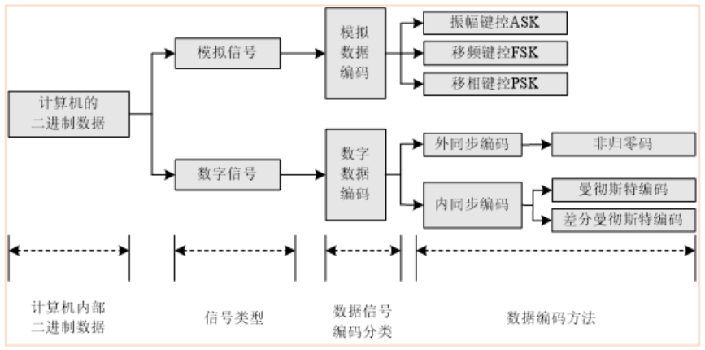

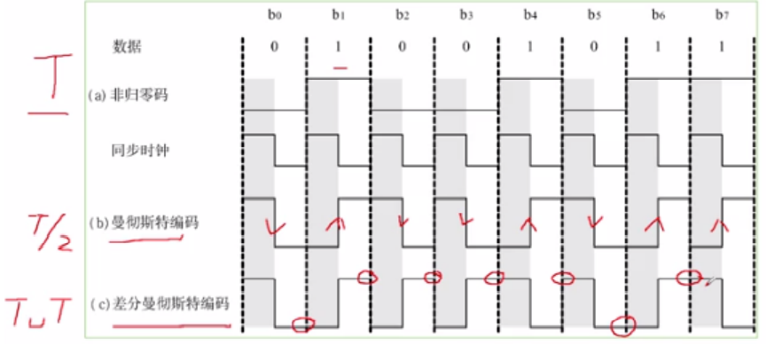

#### 性能度量：

带宽，有两种不同的意义：

- **在通信领域（模拟传输）**：带宽指某个信号具有的频带宽度。
  - 单位：赫（千赫、兆赫、吉赫、太赫等),如话音信号的带宽是3.1kHz (300Hz～ 3400Hz)。

- **在计算机领域（数字传输）**：带宽指计算机网络的通信线路所能传送数据的能力，即在单位时间内从网络中某一个点到另一个点所能达到的`最高数据速率`。单位：b/s（bit/s）

####  传输介质

传输介质：是指发送器与接收器之间的物理通路可分两大类

- 引导型媒介：指电磁波被导向某一媒体传播，例如：双绞线、光纤、同轴光缆
  - 光纤：玻璃纤维携带光脉冲，每个脉冲对应一位；高速点对点传输（ 10--100 Gbps ）
  - 双绞线(网线)：网线接口水晶头、5类线、6类线；(电话线为1对双绞线，网线为4对双绞线）
  - 同轴电缆：两根同心铜导线，双向传输。

- 非引导型媒介：指电磁波在大气层、外层空间和海洋中进行无线传播，例如：无线电（陆地无线电、卫星无线电频道）

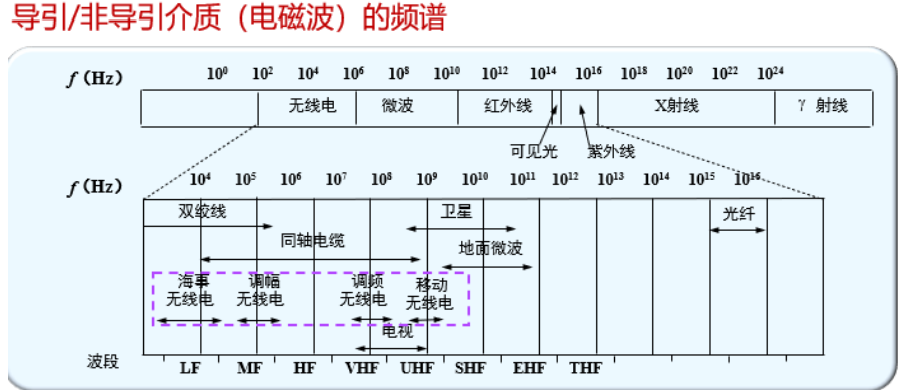

##### 水晶头

☆**RJ45（网线水晶头）**

重点：TIA568B：**橙白、橙、绿白、蓝、蓝白、绿、棕白、棕**

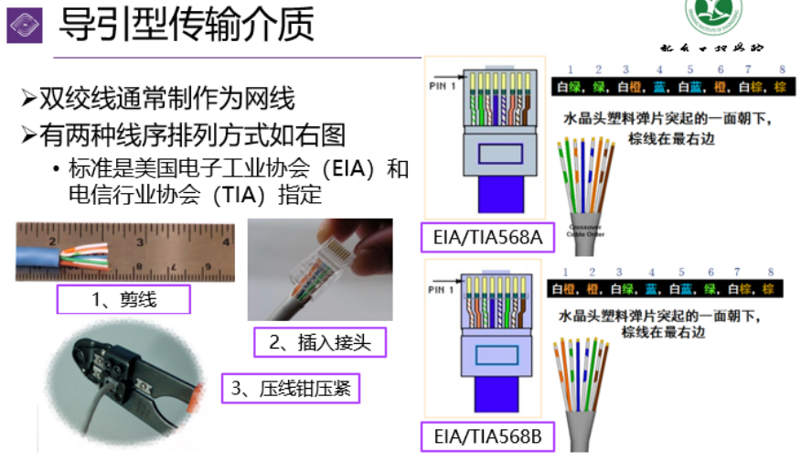

**常用绞合线** 6类线

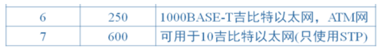

**复用技术 目的：允许用户使用一个共享信道进行通信，避免相互干扰、降低成本，提高利用率。**

##### 频分复用 FDM

- **频分复用**：是一种将多路基带信号调制到不同频率载波上，在进行叠加形成一个复合信号的多路复用技术。

  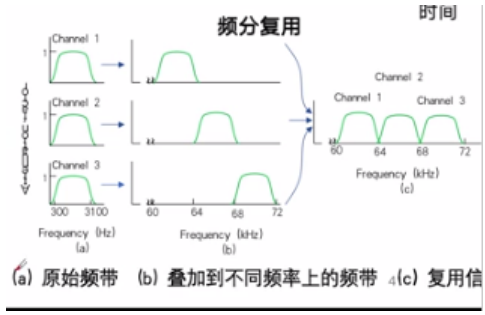
  
  

##### 时分复用 TDM

- 存在的不足：由于计算机数据的突发性质，用户对分配到的子信道的利用率一般是不高的。
- 为每一个用户的都分配时间，即使不发送数据也会保留空闲时间。

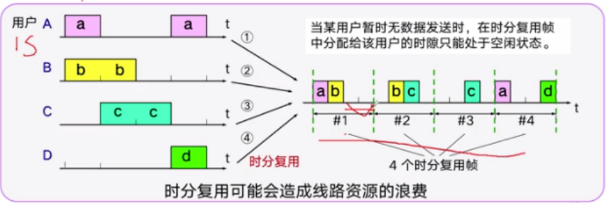

##### 统计时分复用 STDM

- 动态的按需分配共用信道的时间间隙，只将需要传送数据的终端接入共用信道，提高信道利用率。

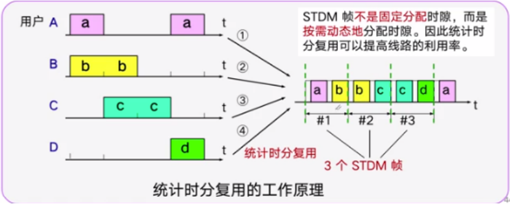

##### 波分复用 WDM

- 利用多个激光器在单条光纤上同时发送多束不同波长激光的技术。

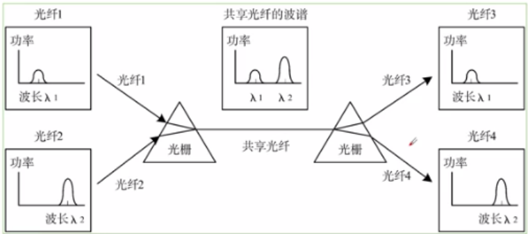

### 四、数据链路层(接口层)

*数据链路层：当传输出错时，如何进行查错、纠错，如何要求重传、形成数据帧；上下行速率不对等的流量控制*

- 向上：向网络层提供明确的服务接口
- 向下：向物理层提供位流服务

#### ☆ 数据链路层功能

- 成帧：将比特流划分为帧，便于检测和纠正物理层在比特传输中可能产生的错误。
- 差错控制：处理传输中出现的差错,如：错位、丢失等
- 流量控制：确保发送方的发送速率不大于接受方处理速率，避免接收缓冲区溢出。

#### 成帧的方式

物理层：bit     --      数据链路层：帧（有效载荷+头标+尾标）   --      网络层：分组 (有效载荷)

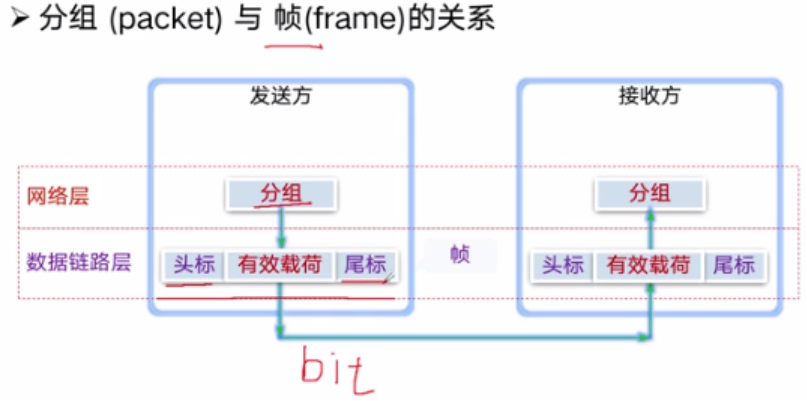

- 字节计数法：无差错传输的情形

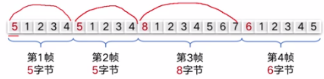

- 带字节填充的定界符法

定界符：一个特殊的字节，用于区分前后两个不同的帧。

接收方的处理：

- 逐个检查收到的每一个字节
- 收到ESC，则后一个字节无条件保留，不予检查
- 收到边界符，则为帧的边界

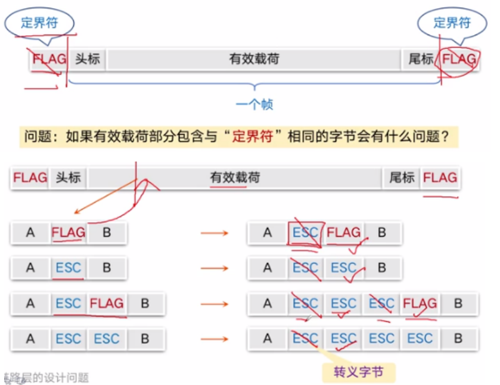

- 带比特填充的定界符法

把定界符由难以统一的特殊字符转化为 0、1比特字符

定界符：两个0比特之间，连续6个1，即：01111110

**发送方：遇到5个1就插入1个0**     

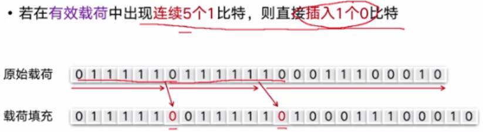

 **接收方：若出现连续的5个1比特，则直接删除下一个0**

**再次遍历若出现连续的5个1比特，且下一个比特为1，则构成定界符，否则不构成定界符，一帧结束**

#### ☆ 差错控制

1、链路层存在的问题：信道的噪声导致数据传输问题

- 差错：数据发生错误
- 丢失：接受方未收到
- 乱序：先发后收到，后发先收到
- 重复：一次发送，多次接收

**解决办法：**

- 通常采用增加冗余信息的策略；例：每个比特传递三份，自动纠错。

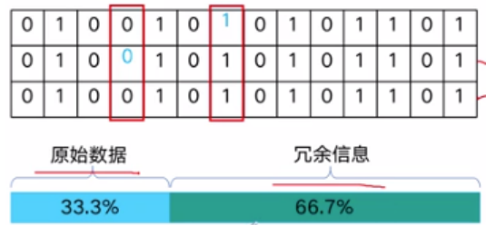

- 检查码：增加冗余信息判断是否出错，但不能推断哪里出错，再发一份。
  - 奇偶校验：

    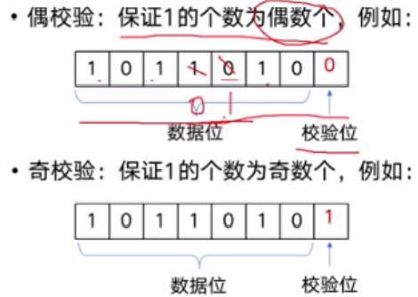

  - 校验和：

  - ☆ 循环冗余校验 CRC：

    - CRC-12 = x12+x11+x3+x2+x+1
    - CRC-16 = x16+x15+x2+1
    - CRC-CCITT = x16+x12+x5+1
    - CRC-32 = x32+x26+x23+x22+x16+x12+x11+x10+x8+x7+x5+x4+x2+x+1
    - **上述四个国际标准生成多项式，以太网、无线局域网使用CRC-32生成多项式**

    fx补零(gx最高次幂个)、除以gx(模二运算)、取余、补全fx

    模二运算：同则为0，不同为1

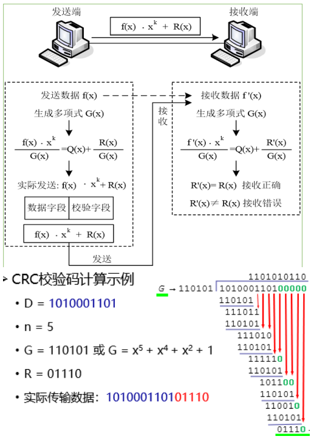

- 纠错码：加入足够冗余信息，发现错误并且能够纠正错误。

##### 滑动窗口协议

目的：对可以连续发出的最多帧数（已发出但未确认的帧）做限制。

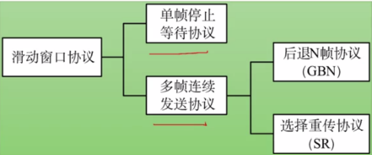

- 单帧停止等待协议：逐帧确认再发下一帧

  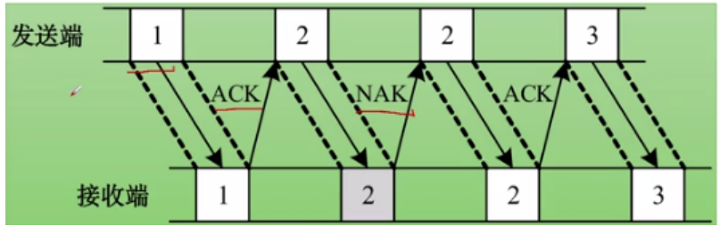

- 多帧连续发送协议

  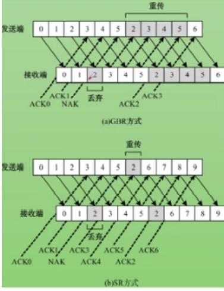

- 选择重发纠错滑动窗口控制过程

  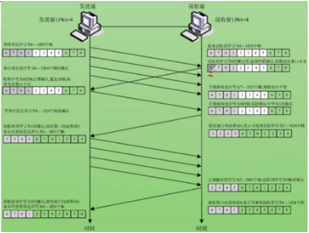

2、另一个问题：收发速率不同一致

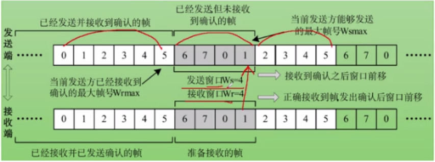

#### 数据链路协议

##### PPP 协议

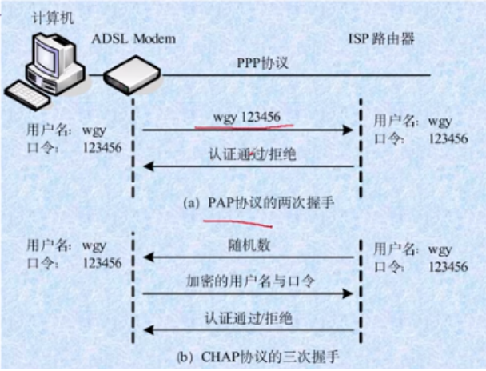

### 介质访问控制子层

*介质访问控制子层：属于数据链路层中，涉及局域网的部分*，也称MAC

**决定局域网的三要素：传输介质、拓扑结构、介质访问控制方法**

#### 常见的接入情形：

- 信道：信号的通道
  - 比如：双绞线、铜缆、光纤、卫星、空气等
- 点到点信道：信道直接连接两个端点
  - 
- 多点访问信道：多用户共享一根信道
  - 比如：早期的星型拓扑是集线器,现在的交换机

#### 介质访问控制方法

介质控制访问控制方法 解决的问题：

- 什么时候发送数据?
- 如何发现冲突?
- 出现冲突了怎么办？

#### 常见的局域网拓扑

- 总线拓扑、星型拓扑、环形拓扑

  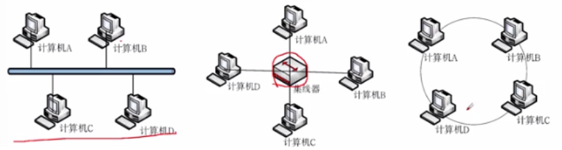

- 总线型局域网 CSMA/CD

- 令牌总线型局域网 Token Bus

- 令牌环局域网 Token Ring

  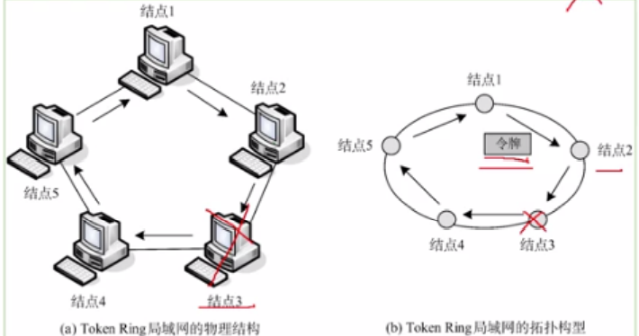

- 不同通信负荷下实际数据传输速率的比较

  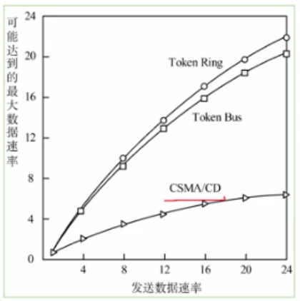

#### 以太网

平时使用的局域网就是以太网，

##### ☆  CSMA/CD

- 以太网采用**CSMA/CD**  即：带有冲突检测的载波监听多路访问（避免信号冲突）
- ☆ 工作原理:
  - 发送前先监听信道是否空闲，若空闲则立即发送数据（先听后发）
  - 发送时，边发边监听（边听边发）
  - 如果介质忙，持续监听，一旦空闲立即发送
  - 若监听到冲突，则立即停止发送（冲突停止）
  - 等待一段随机时间以后（退避），再次重新发送（延迟重发）

**先听后发** 存在的问题：同时发送、传播延迟时仍旧存在冲突的可能

**冲突窗口**：发送站发送出帧后能检测到冲突的最长时间（是一个时间区间）

- 冲突窗口的时长：等于最远两个传播时间的两倍,即2D（D是单边延迟）

##### 以太网的帧结构（MAC子层协议）

- 前同步码：保证接收电路在帧的目的地址字段来到之前达到正常接受状态，不保留也不计入帧头长度。

- 硬件地址（物理地址/MAC地址）：6个字节=48个比特位，唯一的

- 数据字段：46~1500字节，最小帧长46+18=64B，最大帧长1518B，字段不足时需要填充至46字节。

  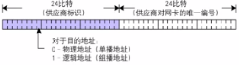

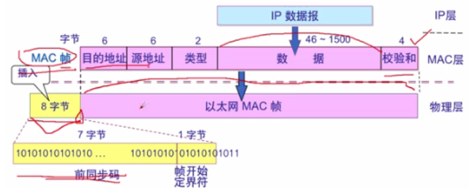

##### MIC地址举例

- 单播
- 广播               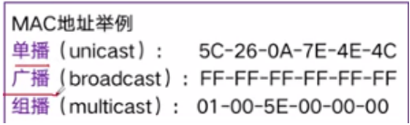
- 组播

在windows上使用`ipconfig/all`命令查看MAC地址

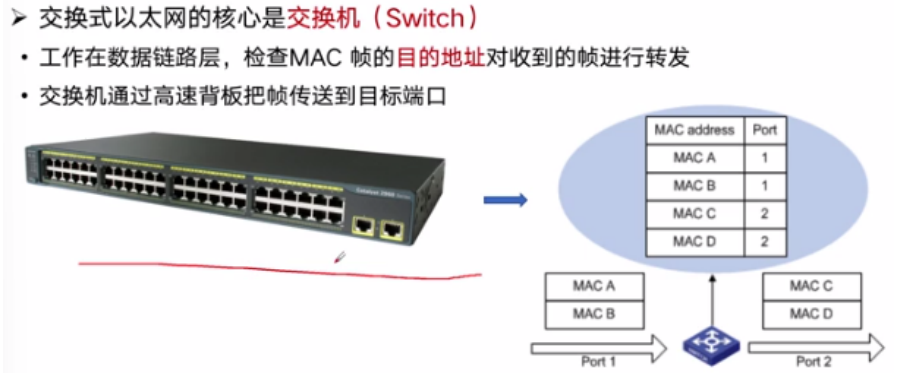

​                            

#####  交换式以太网

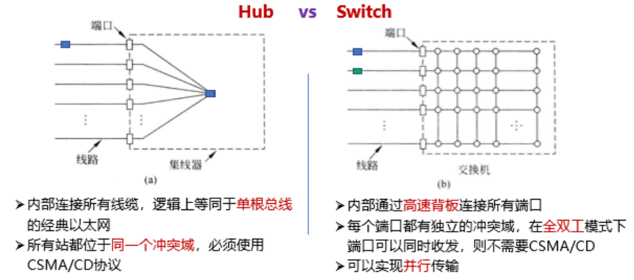

##### 链路层交换机

###### 交换模式：从转发时机的角度

- 存储转发模式
  - 特点：转发前接收整个帧、执行CRC校验
  - 缺点：延迟大
  - 优点：不转发出错帧、支持非对称交换
- 直通模式
  - 特点：接收到的数据直接转发
  - 缺点：可能转发错误帧、不支持非对称交换
- 无碎片模式
  - 特点：接收到帧的前64字节，即开始转发
  - 优点：过滤了冲突碎片，延迟和转发错帧介于存储转发和直通交换之间

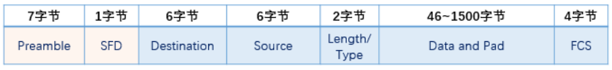

##### ☆ 交换机数据转发原理

- 交换机自学习生成表：MAC地址 端口号
- 当存在时，直接发送，不存在时进行自学习（广播）记录
- 转发：交换机根据MAC地址表单播转发数据帧
- 学习：MAC地址表是交换机通过学习接收的数据帧的源MAC地址来形成的
- 广播：如果目标地址在MAC地址表中没有，交换机就向除接收到该数据帧的端口外的其他所有端口广播该数据帧
- 更新：交换机MAC地址表的老化时间是300秒;如果一个帧的入端口和MAC地址表中源MAC地址的所在端口不同，交换机会将MAC 地址重新学习到新的端口

##### 无线局域网

**无线局域网：指以无线信道作为传输介质的计算机局域网**

- 分布式系统（DS）、访问点（AP）、站点（STA）、扩展服务集（ESS）
- 站点之间通信通过AP转发

路由器：

wan口：接外网

lan口：接内网

**扩展服务集ESS**

- 可以通过Ethernet交换机将多个BSS互联起来，构成一个扩展服务集ESS
- 方案2：ac+ap；
- 方案2：mesh组网；由一组呈网状分布的无线AP组成，AP之间通过点-点无线信道连接

**CSMA/CA：所有站点完成发送后，必须等待一段很短的时间才能发送下一帧。这段时间通称为帧间间隔或帧间隙 (IFS，Inter-Frame Space)。**

认证过程：校园网：802.1X EAP认证；家用：WPA PSK认证

**总结：**

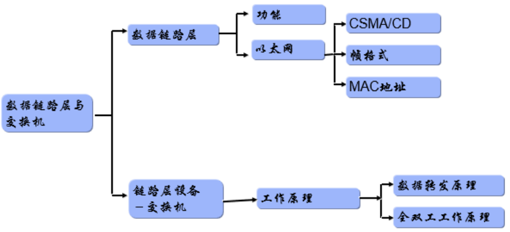

### 五、网络层

*网络层通过路由选择算法，为IP分组从源主机到目的主机选择一条合适的传输路径，为传输层端—端数据传输提供服务。*

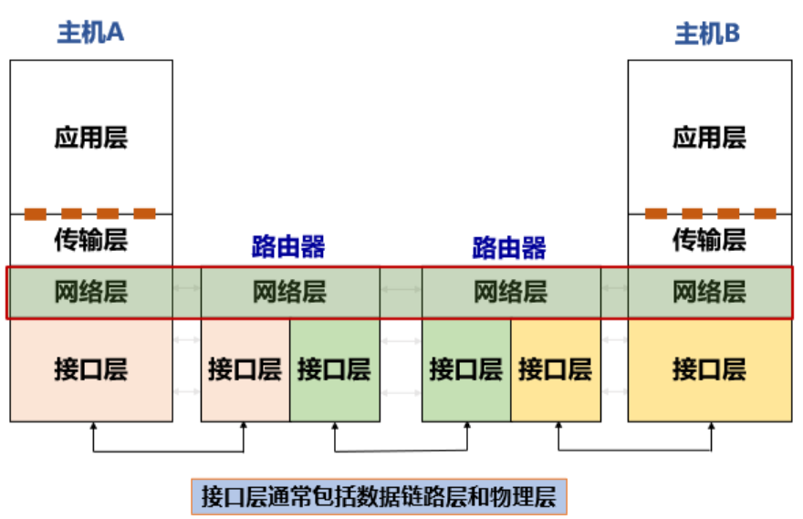

#### 网络层服务的实现

- 发送端：将传输层数据单元封装在数据包中
- 接受端：解析接收的数据包中，取出传输层数据单元，交付给传输层
- 路由器：检查数据包首部，转发数据包
- 网络层实现端系统间多跳传输可达

#### 无连接服务的实现

- 尽力而为交付：不提供端到端的可靠传输服务：丢包、乱序、错误/造价大大降低，运行方式灵活，能够适应多种应用
- 网络层不提供服务质量的承诺
- 数据报独立转发，不需要建立连接，相同源-目的 的数据报可能经过不同的路径

#### ☆ ipv4协议

- IPv4/网际协议版本4： 一种无连接的协议，是网络的核心，使用最广泛的网际协议版本
- IP协议是一种无连接、不可靠的分组传送服务的协议
- IP地址：网络上的每一台主机(或路由器)的每一个接口都会分配一个全球唯一的32位二进制标识符
- 将IP地址划分为固定的类，每一类都分为两个字段（网络号、主机号）
- 

##### IP地址分类

- IP地址共分为五类，ABC三类为单播地址
- IP地址的书写采用点分十进制记法，其中每一段取值范围为0~255
- A类地址：1.0.0.0 ~ 127.255.255.255        网络号长度为7位，主机号长度为24位
- B类地址：128.0.0.0 ~ 191.255.255.255
- C类地址：192.0.0.0 ~ 223.255.255.255
- D类IP地址：224.0.0.0 ~ 239.255.255.255
- E类IP地址：240.0.0.0 ~ 247.255.255.255

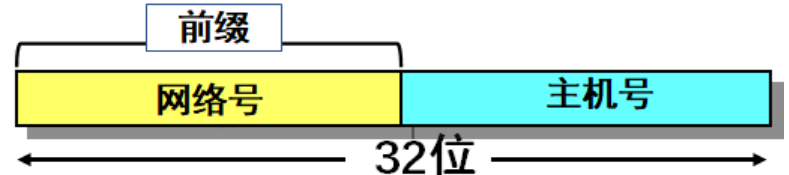

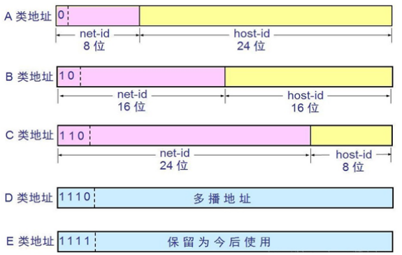

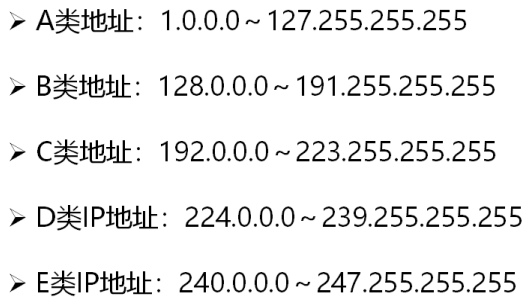

##### 特殊ip地址

| 地址            | 用途                                                         |
| --------------- | :----------------------------------------------------------- |
| 全0网络地址     | 只在系统启动时有效，用于启动时临时通信，又叫主机地址         |
| 网络127.0.0.0   | 指本地节点(一般为127.0.0.1)，用于测试网卡及TCP/IP软件，这样浪费了1700万个地址 |
| 全0主机地址     | 用于指定网络本身，称之为网络地址或者网络号 |
| 全1主机地址     | 用于广播，也称广播地址，需要指定目标网络 |
| 0.0.0.0         | 指任意地址                                                   |
| 255.255.255.255 | 用于本地广播，也称有限/受限广播，无须知道本地网络地址        |

#### 子网划分

- 子网划分，在网络内部将一个网络块进行划分以供多个内部网络使用，对外仍是一个网络
- 子网掩码，与 IP 地址一一对应，是32 bit 的二进制数，置1表示网络位，置0表示主机位

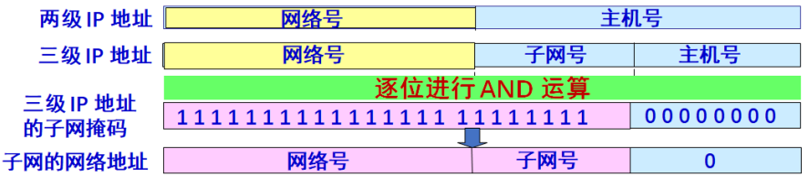

#### ipv6

- 地址长度为128bit，是IPv4地址长度的4倍 
- 是互联网工程任务组（IETF）设计的用于替代IPv4的下一代协议

#### RIP:内部网关协议  

- 路由选择协议RIP：是基于距离矢量算法的协议
- 基本思想：
  - 仅和**相邻路由器**交换信息
  - 路由器交换的内容是自己的**路由表**
  - 周期性更新：30s
- 特点：
  - 算法简单，易于实现
  - 收敛慢，需要交换的信息量较大
- 距离向量算法：
  - 第一步：路由器初始时的路由表只包含所有直接相连的网络路径，距离为1
  - 第二步：路由器周期性的向相邻路由器广播自己知道的路由信息
  - 第三步：相邻路由器根据收到的信息修改和更新自己的路由表
  - 最后：经过若干次更新，得到所有网络的最短距离，进入“收敛”状态

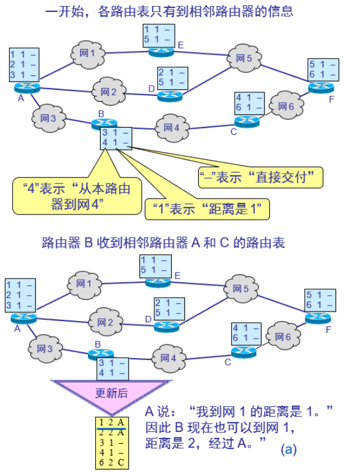

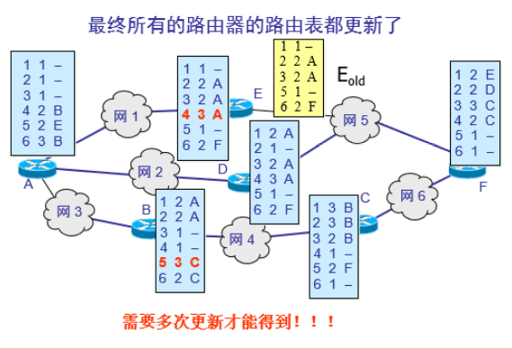

### 六、传输层

***传输层位于应用层和网络层之间；实现进程之间的端-端通信***

- 提供尽力而为服务（无法提供延迟保证、带宽保证等服务）
- 可以通过差错恢复、重排序等手段提供可靠、按序的交付服务

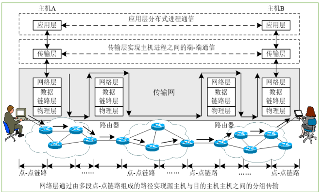

- 概念
  - 套接字：应用层和传输层的接口，也是应用程序和网络之间的API
  - 端口号port：用来区分同一个主机上的不同进程

#### UDP无连接传输协议(不可靠)

- 提供的服务
  - 进程到进程之间的报文交付
  - 报文完整性检查（可选）：检测并丢弃出错的报文
- 特点：
  - UDP协议在传输报文之前不需要在通信双方之间建立连接，因此减少了协议开销与传输延迟。
  - UDP对报文除了提供一种可选的校验和之外，几乎没有提供其他的保证数据传输可靠性的措施。
  - 如果UDP检测出在收到的分组出错，它就丢弃这个分组，既不确认，也不通知发送端和要求重传。
- 适用的应用：
  - 容忍丢包但对延迟敏感的应用：如流媒体
  - 以单次请求/响应为主的应用：如DNS
  - 若应用要求基于UDP进行可靠传输：由应用层实现可靠性

#### ☆ TCP面向连接的传输

***TCP在不可靠的IP服务上建立可靠的数据传输***

##### 三次握手、四次挥手

- 从上到下     
  - 上一个的seq+1 **=** 下一个的ack，上一个的ack不变**=**下一个的seq

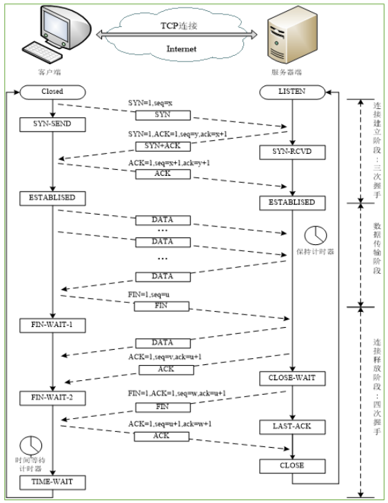

三次握手：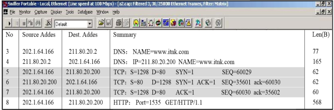

四次挥手：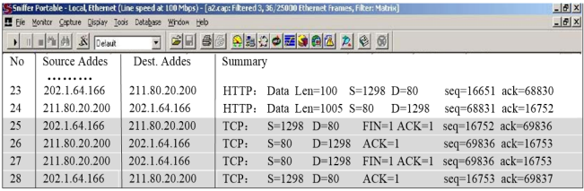

### 七、应用层

***为解决具体应用问题而彼此通信的进程，两台主机通信实际是其上对应的两个应用进程(process)在通信*，**

#### 应用进程通信方式

- 客户端(C)-服务器(S)
  - 客户-服务器方式描述的是应用进程之间服务和被服务的关系
  
  - 客户是服务请求方（主动请求服务，被服务）
  
  - 服务器是服务提供方（被动接受服务请求，提供服务）
  
  - 面向连接时，C/S通信关系一旦建立，通信就是双向的，双方地位平等，都可发送和接收数据
  
    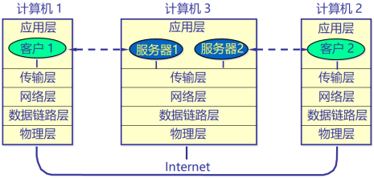
  
- 浏览器(Brower)-服务器(Server)
  - B/S方式采取浏览器请求、服务器响应的工作模式
  
  - 在B/S方式下，用户界面完全通过Web浏览器实现，一部分事务逻辑在前端实现，但主要的事务逻辑在服务器端实现
  
    
  
- 对等(P2P)
  - 对等方式是指两个进程在通信时并不区分服务的请求方和服务的提供方
  
  - 只要两个主机都运行P2P软件，它们就可以进行平等、对等的通信
  
  - P2P方式从本质上看仍然是使用了C/S方式，但强调的是通信过程中的对等，这时每一个P2P进程既是客户同时也是服务器
  
    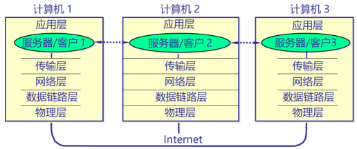

#### 域名系统

- 域名系统：主要负责将可读性好的域名映射成IP地址

  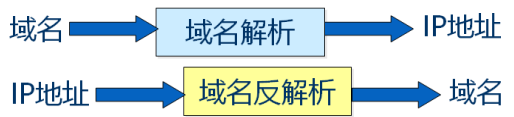

##### 一些特殊的域名

- 顶级域名
  - 国家或地区顶级域nTLD
    - .cn 表示中国
    - .us 表示美国
    - .uk 表示英国
  - 基础设施域.arpa 
  - 通用顶级域.gTLD
  - 早期的通用顶级域名
    - .com 表示公司企业          
    - .net 表示网络服务机构
    - .edu 表示教育机构(美国专用)  
    - .gov 表示政府部门(美国专用)  
    - .mil 表示军事部门(美国专用)   
- ☆ 国家顶级域名 .cn下的二级域名
  - .edu.cn 教育
  - .gov.cn 政府
  - .org.cn 非营利组织
  - .net.cn 网络服务
  - .com.cn 工商金融等企业
  - .ac.cn 科研
  - .mil.cn 国防机构

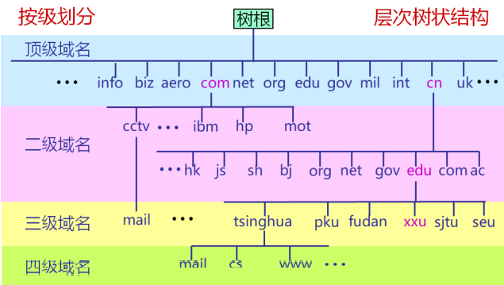

### 其他l?

路由算法

自治系统AS

ip  32 位      mac 48位    ipv6 64位

传播方式 点对点广播

同一局域网必须使用同一子网掩码

物理地址负责局域网之间的数据传输   ip地址在传输过程中始终保持不变

网络地址转换(NAT)

### ☆ 考点总结：

- OSI七层模型中每一层的作用以及传输单元/传输单位
- TCP/IP 协议相关
- 水晶头的排线顺序
- 传输方式
- 曼彻斯特编码
- 检错码：**奇偶校验**、**校验和**、循环冗余校验 模二运算
- CSMA/CD
- 交换机数据转发原理（MAC地址）
- 数据帧的帧格式
- 二进制与十进制得到转化
- ipv4 划分，转化，细节
- 已经知道ip地址  如何获取mac地址？
- RIP协议 ：内部网关协议
- UDP协议

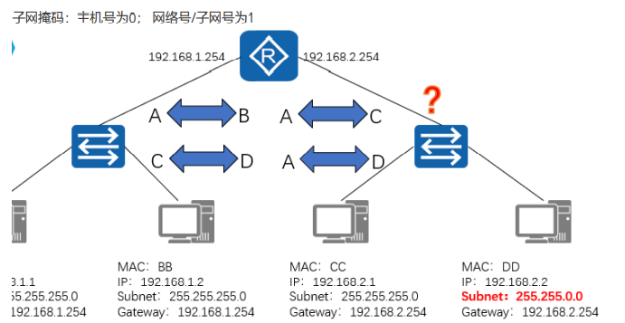

